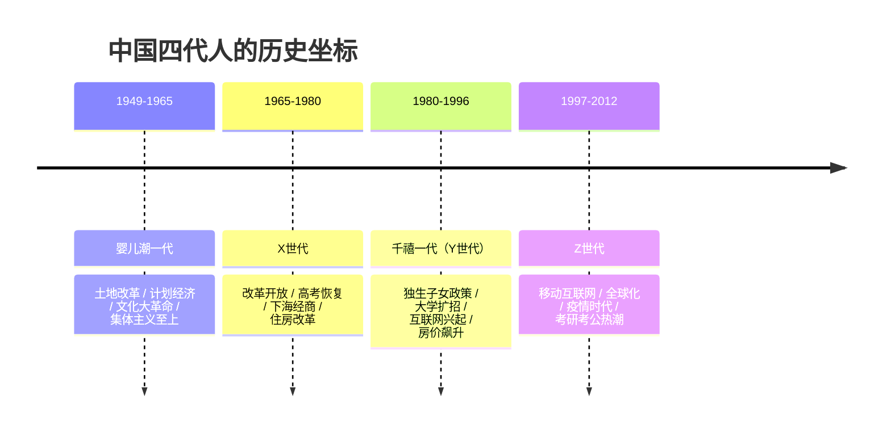
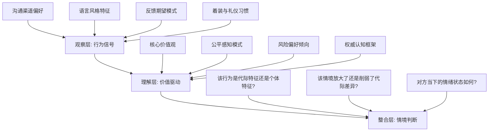
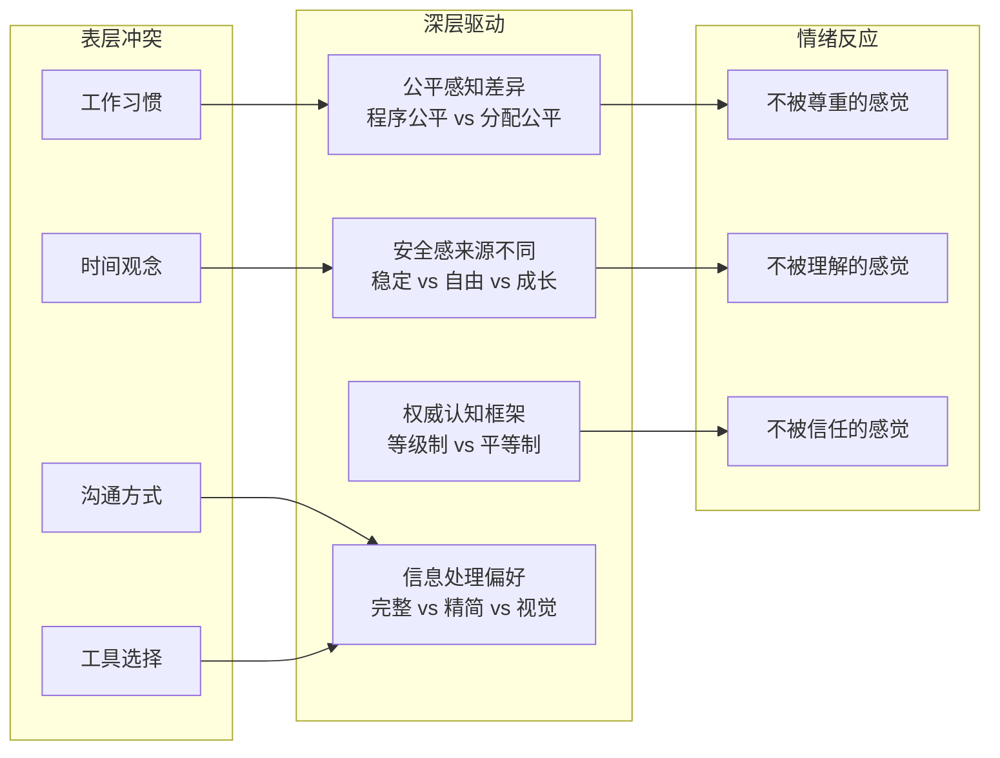
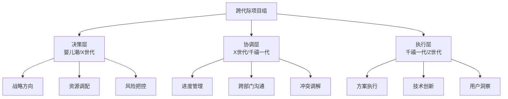

# 跨代际沟通——核心技巧

## 一、代际理论框架：理解"为什么不同"

在学习具体技巧之前，必须先理解代际差异的形成机制。代际差异不是刻板印象，而是社会历史力量塑造群体认知模式的客观现象。

### 1.1 代际形成的理论基础

**社会建构理论：** 美国社会学家卡尔·曼海姆（Karl Mannheim）在1928年提出"代际位置"理论——同一时期出生的人群，因共享重大历史事件的共同经历，形成了相似的认知框架和价值取向。这些"格式化事件"在人格形成期（约14-24岁）影响尤为深远。

**施特劳斯-豪代际理论：** 威廉·施特劳斯和尼尔·豪在《世代》（Generations, 1991）中提出，美国社会存在一个约80年的"大周期"（对应人生四季），由四个约20年的"转折期"组成。每个转折期产生一种特定的代际原型：先知（Prophet）、游侠（Nomad）、英雄（Hero）、艺术家（Artist）。这个理论虽然基于美国历史，但其代际周期性分析框架具有参考价值。

**文化代际传递理论：** 心理学家埃里克·埃里克森（Erik Erikson）的心理社会发展理论指出，每一代人都在前一代人的文化基础上进行"选择性继承与反叛"。年轻人既受上一代影响，也通过否定上一代来确立自我——这是代际张力的深层来源。

### 1.2 中国语境下的四代人

中国的代际划分不能照搬西方标准。中国的四代人各自经历了独特的社会变革，形成了鲜明的群体特征：



**婴儿潮一代（1949-1965年出生，2025年约60-76岁）：** 这一代人经历了物质匮乏的年代，集体主义深深烙印在他们的价值观中。他们中的许多人上过山、下过乡，经历过"铁饭碗"和下岗潮。他们看重秩序、稳定和权威，沟通中习惯尊卑有序。在工作中，他们重视"在场"和"过程"——加班本身有时比产出更被看重。他们的信息获取渠道以电视、报纸和人际传播为主，对新技术的学习曲线较陡但并非不可逾越。

**X世代（1965-1980年出生，2025年约45-60岁）：** 这是"夹缝中的一代"——上要赡养经历过动荡的父母，下要支撑面临高房价的子女。他们是中国最早的"打工人"，经历了从计划经济到市场经济的完整转型。他们务实、独立、结果导向，是"会哭的孩子有奶吃"和"闷声发大财"的混合体。他们的沟通风格直接但不失分寸，是天然的"翻译器"——能理解上一代的含蓄，也能接受下一代的直率。

**千禧一代（1980-1996年出生，2025年约29-45岁）：** 中国第一代独生子女，被称为"小皇帝"的一代。他们赶上了大学扩招（1999年）和房价起飞（2003年起），既是改革开放的最大受益者，也是内卷化的深度参与者。他们成长于互联网从无到有的时代，拥有较强的数字素养。他们追求意义感和成长性，期望被尊重而非被管理，对"画饼"有天然的免疫。沟通中偏好平等对话，重视反馈的及时性和具体性。

**Z世代（1997-2012年出生，2025年约13-28岁）：** 数字原住民，从小在智能手机和社交媒体中长大。他们中的年长者经历了2020年疫情对教育和就业的冲击，面对的是考研考公竞争白热化、就业市场收缩的现实。他们对权威天然祛魅，信息鉴别能力强，但注意力持续时间短。他们习惯碎片化、视觉化、互动式的沟通，对"假大空"零容忍。他们有更强的自我意识和心理健康意识，但同时也面临更大的焦虑和迷茫。

### 1.3 代际认知的三个关键机制

理解以下三个机制，能帮你穿透表面差异，找到沟通的底层逻辑：

**锚定效应（Anchoring Effect）：** 每代人的核心信念锚定在其成长期的关键经历上。婴儿潮一代锚定在"来之不易"，X世代锚定在"靠自己"，千禧一代锚定在"要公平"，Z世代锚定在"要真实"。理解了锚定点，就理解了对方所有反应的根源。

**曝光效应（Mere Exposure Effect）：** 人们偏好自己熟悉的沟通方式和工具，不是因为其他方式不好，而是因为熟悉感本身带来了安全感。当一位长辈坚持打电话而不是发微信时，他不是"落伍"，而是在用自己最有安全感的方式。

**代际公平感知差异：** 同一个职场政策，不同世代的"公平感"完全不同。例如"按资排辈"——婴儿潮一代认为公平（我熬了这么多年），千禧一代认为不公平（应该看能力）。这不是谁对谁错，而是公平标准不同：程序公平 vs. 分配公平 vs. 互动公平。

---

## 二、代际差异识别技巧

### 2.1 识别的层次模型

识别代际差异不能只看表面行为，需要分三个层次递进：



### 2.2 行为信号观察清单

| 观察维度 | 婴儿潮一代 | X世代 | 千禧一代 | Z世代 |
|---------|-----------|-------|---------|-------|
| **首选渠道** | 面对面、电话 | 邮件、电话 | 微信文字、协作文档 | 即时消息、语音片段、短视频 |
| **消息长度** | 详细、完整 | 简洁、要点式 | 适中、带表情符号 | 极短、缩写、表情包 |
| **回复速度期望** | 24-48小时可接受 | 工作时间内数小时 | 1小时内 | "已读"即期望回复 |
| **会议偏好** | 正式会议、有议程 | 高效简短、有结论 | 可以接受脑暴式讨论 | 异步沟通优先，必要时才开会 |
| **反馈期望** | 年度/季度评估 | 项目结束反馈 | 月度/即时反馈 | 实时反馈、随时可聊 |
| **着装信号** | 正式商务装 | 商务休闲 | 智能休闲 | 个性化表达 |
| **称谓习惯** | 职务+姓氏 | 姓氏+职务或哥/姐 | 名字或昵称 | 昵称或网名 |
| **决策风格** | 尊重权威、自上而下 | 征求意见但最终拍板 | 共识导向、参与式 | 数据驱动、快速试错 |

### 2.3 主动探测技巧

不要仅凭行为信号下结论——代际特征是概率性的，不是确定性的。以下探测技巧可以帮助你快速建立判断：

**开放式提问法：** 不要问"你是哪年出生的"（冒犯），而是通过话题自然探测。例如聊到"你印象最深的一件事"，对方的回答时代特征会自然流露。

**工具偏好探测：** "咱们用什么方式对齐进度最方便？"——对方的回答（邮件、微信群、飞书文档、电话）会暴露其代际倾向。

**反馈频率测试：** 在协作中先按你的习惯提供反馈，观察对方的反应。如果对方没有追问，说明反馈频率合适；如果对方主动追问，说明需要更多互动。

**冲突触发点观察：** 注意对方在什么情况下表现出不适或不满。对"不正式"不满通常是婴儿潮/X世代特征；对"效率低"不满通常是X世代/千禧特征；对"不透明"不满通常是千禧/Z世代特征。

### 2.4 避免识别误区

**误区一：年龄=代际。** 同样55岁的人，一个在体制内工作30年，一个在互联网创业15年——他们的沟通方式可能完全不同。代际是底色，职业经历、教育背景、个人性格是叠加层。

**误区二：代际特征=刻板印象。** 代际分析是"群体概率描述"，不是"个体定性判断"。它告诉你"这个群体有更高概率表现出这些特征"，但面对具体个人时，必须用实际行为来验证。

**误区三：忽视代际内部差异。** 千禧一代中，1980年出生的人（经历过没有互联网的童年）和1995年出生的人（小学就有智能手机）差异巨大。细分"80后"和"95后"往往比笼统说"千禧一代"更准确。

**误区四：忽视区域和城乡差异。** 一线城市Z世代和三四线城市Z世代的信息环境差异，可能比同城市不同代际之间的差异还大。北上广深的60后高管和县城的60后公务员，代际特征的表达方式截然不同。

---

## 三、与不同世代沟通的技巧

### 3.1 与婴儿潮一代（60-76岁）沟通

**核心沟通原则：尊重权威、结构清晰、节奏从容**

婴儿潮一代成长于一个信息稀缺、秩序至上的时代。他们习惯"先听结论再听过程"（因为时间宝贵），同时需要"完整的上下文"（因为他们要判断结论是否可靠）。这两个看似矛盾的需求，通过"金字塔式沟通"可以同时满足。

**沟通框架——PREP+R法：**
- **P**（Point）：先说结论——"我建议采用方案A"
- **R**（Reason）：给出核心理由——"因为成本低30%，工期短两周"
- **E**（Evidence）：提供证据——"这是三家供应商的报价对比"
- **P**（Point）：重申结论——"所以建议选方案A"
- **R**（Respect）：征求对方意见——"您经验丰富，想听听您的看法"

**具体技巧：**

1. **称谓与礼节是基础门槛。** 不是"装"，而是对方的社交操作系统。面对一位60岁的领导，叫"王总"而不是"老王"，不是虚伪，是尊重对方30年职业生涯所积累的社会身份。即使私下关系好，公开场合也应使用正式称谓。

2. **重要事项选择高带宽渠道。** 面对面 > 电话 > 视频 > 邮件 > 微信。婴儿潮一代对"高带宽"沟通（包含语调、表情、肢体语言的信息）有天然偏好，因为他们依赖这些非语言信号来判断对方的诚意和可信度。一条微信可能被过度解读语气，而面对面交流能消除歧义。

3. **给足"消化时间"。** 不要期望即时回复。提出重要议题后，给对方至少24小时的思考时间。追进度时可以说"上次提到的方案，您考虑得怎么样了？"而不是"方案定了吗？"。

4. **避免"技术傲慢"。** 当你需要教长辈使用新工具时，把它当作教小朋友走路——耐心、重复、不嘲笑。关键原则：只教"怎么做"，不解释"为什么"（除非对方问）。准备一份A4纸大小的操作指南，用大号字体，步骤编号，每步不超过一个动作。

5. **用"请教"代替"告知"。** 即使你知道答案，也可以说"我想请教一下，您觉得这个方案有没有什么需要注意的地方？"这不是拍马屁，而是打开对方分享经验的通道——你可能真的会获得有价值的补充视角。

**典型对话示例：**

> ❌ 差："老王，这个方案你觉得行不？微信上发你了，看看回复我。"
>
> ✅ 好："王总，关于下季度的市场方案，我整理了一份报告，想找个时间当面向您汇报。您看明天上午方便吗？"

### 3.2 与X世代（45-60岁）沟通

**核心沟通原则：结果导向、数据说话、尊重自主**

X世代是职场的中坚力量，也是最"累"的一代——上有老下有小，中间是KPI。他们没有时间听废话，但需要足够的信息来做判断。他们尊重专业，讨厌被微观管理。

**沟通框架——BLUF法（Bottom Line Up Front）：**
- **第一句：结论/请求。** "需要你审批这笔15万的预算。"
- **第二至三句：关键数据。** "预计ROI为2.3倍，回收期8个月。"
- **第四句：行动项。** "如果没问题，我今天下午就启动采购流程。"
- **附件：详细资料。** 完整的分析报告，供需要时查阅。

**具体技巧：**

1. **先说"要什么"，再说"为什么"。** X世代的注意力分配模型是：给你30秒说清楚"我需要你做什么"，如果感兴趣再给你2分钟解释"为什么"。不要反过来。

2. **用数据替代形容词。** 不要说"效果很好"，要说"转化率提升了23%"。不要说"客户反馈不错"，要说"NPS评分从42提升到67"。X世代在"数据 vs. 感觉"之间，永远信任数据。

3. **尊重工作与生活的边界。** 非工作时间发消息前问自己：这件事是否紧急到不能等到明天早上？如果答案是否，等到工作时间再发。X世代对工作生活平衡的重视程度远超你的想象——他们经历过"没有边界"的年代，所以更珍惜边界。

4. **给方案，不只给问题。** "我遇到了X问题，建议用Y方案解决，预计需要Z资源"比"我遇到了X问题，怎么办？"高效10倍。X世代尊重能独立思考的人。

5. **邮件是最安全的默认渠道。** 如果不确定对方偏好，用邮件。X世代是邮件的"原住民"——他们用邮件建立了职业生涯中的大部分重要关系。邮件还提供了一条天然的"思考缓冲"——不用即时回复，双方都可以从容应对。

**典型对话示例：**

> ❌ 差："领导，有个事儿想跟您说一下，就是上周那个客户，他好像对我们方案不太满意，我觉得可能需要调整一下，您觉得呢？"
>
> ✅ 好："张总，上周提案客户有两个反馈点：1）定价偏高（对比竞品高12%）；2）交付周期太长（他们需要45天内）。建议：方案一——降价8%+加急交付，预计毛利降3%；方案二——保持价格+增加服务内容。我倾向方案一，您怎么看？"

### 3.3 与千禧一代（29-45岁）沟通

**核心沟通原则：平等对话、解释意义、即时反馈**

千禧一代是"意义驱动"的一代。他们不是不想干活，而是需要知道"为什么是我干这个"和"干了之后对我有什么成长"。他们对"不解释原因就分配任务"的管理方式天然抵触。

**沟通框架——CONTEXT法：**
- **C**（Context）：背景——"公司正在推进数字化转型"
- **O**（Objective）：目标——"需要在Q3前完成客户管理系统升级"
- **N**（Need）：需求——"你的数据分析能力是这个项目的关键"
- **T**（Task）：任务——"请负责客户数据迁移和验证模块"
- **E**（Expected）：预期——"预计投入60%工时，持续8周"
- **X**（X-factor）：成长点——"完成后你将具备完整的数据架构经验"
- **T**（Timeline）：时间线——"本周五先出一份技术方案初稿"

**具体技巧：**

1. **"为什么"比"做什么"更重要。** 在分配任务时，花30秒解释背景和意义，能提升千禧一代50%以上的执行意愿和质量。这不是"太矫情"，而是这一代人的认知方式——他们需要意义框架来组织行动。

2. **反馈要"快、准、暖"。** 快：不要等到季度评估才说，24小时内给反馈。准：具体到行为层面——"你PPT的第三页数据可视化做得很好"而不是"做得不错"。暖：即使是指正，也先肯定再建议——"逻辑很清晰，如果能把数据来源标注一下会更有说服力"。

3. **邀请参与而非单向指令。** "这个项目我有一个初步想法，想听听你的意见"比"按这个方案执行"有效得多。参与感不是浪费时间，而是投资——参与决策的人执行时不需要额外说服。

4. **使用协作型工具。** 飞书文档、Notion、腾讯文档等支持多人实时协作的工具是千禧一代的"舒适区"。把任务清单、项目进度、会议纪要放在共享文档中，而不是通过口头传达或单向邮件。

5. **认可努力，不仅仅认可结果。** 千禧一代对"只看结果不看过程"的评价方式敏感。一个项目即使最终结果不如预期，过程中展现的能力提升和付出的努力也应该被看到。

**典型对话示例：**

> ❌ 差："小李，把那个报告改一下，下周一交。"
>
> ✅ 好："小李，这个季度的客户分析报告是管理层决策的重要依据（背景）。你上次做的月度分析很专业，这次想请你负责完整版（认可+委托）。主要需要加上竞品对比和趋势预测两个模块（具体需求）。如果做下来觉得有什么需要支持的随时说（开放支持），下周一初稿我们先对一下（明确节点）。"

### 3.4 与Z世代（13-28岁）沟通

**核心沟通原则：真实直接、视觉优先、共创参与**

Z世代是"祛魅"的一代。他们从小在信息爆炸中长大，对"画饼""PUA""爹味说教"有天然的雷达。他们不是不尊重权威，而是只尊重"真实的能力"而非"虚假的权威"。

**沟通框架——REAL法：**
- **R**（Real）：真实——说真话，不包装
- **E**（Engaging）：参与——邀请共创，不是单向灌输
- **A**（Actionable）：可执行——每条信息都指向具体行动
- **L**（Lean）：精简——能用图不用字，能用10字不用100字

**具体技巧：**

1. **说人话，不说"领导话"。** "让我们携手共进，共创辉煌"在Z世代耳朵里的翻译是"又来了"。直接说"这个项目做完能学到XX技能，对你的简历加分"——用他们的语言说他们的利益。

2. **视觉化一切。** Z世代的认知模式是"看"而非"读"。一份10页的文档不如一张清晰的信息图。一个复杂的流程不如一个2分钟的短视频。一段长文字不如一个表格或清单。在可能的情况下，用图、表、视频替代纯文字。

3. **创造参与感和共创机会。** 不要说"你负责执行"，要说"你觉得怎么做更好？"Z世代有强烈的自主意识和创造力，给他们空间，你会获得超出预期的产出。但要注意：参与不等于放任——给框架、给底线、给deadline，然后放手。

4. **即时反馈，不要等。** Z世代习惯了短视频平台的即时反馈循环——发一条内容，几分钟内就有点赞和评论。在工作中，他们同样期望快速反馈。当天的工作当天给反馈，即使是一句"今天做得不错，明天继续"也比一周后的一封长评更有价值。

5. **尊重心理边界。** Z世代有更强的心理健康意识。不要在非工作时间无故打扰，不要用情感绑架（"你不加班就是不敬业"），不要忽视对方的情绪状态。如果你注意到对方状态不对，可以私下问一句"最近还好吗？"——但不要追问细节。

6. **用"游戏化"提升参与度。** Z世代成长于游戏环境中，对积分、徽章、排行榜、挑战赛等游戏化元素天然亲近。在团队协作中引入适度的游戏化机制（如完成任务获得积分、设立周挑战赛），能显著提升参与度和动力。

**典型对话示例：**

> ❌ 差："小王，这个方案你重新做一版，要有创新，不要照搬以前的，下周五之前交。"
>
> ✅ 好："小王，上次那个方案客户觉得太传统了，想看看更新的思路。给你两个参考：1）XX公司的案例（链接）；2）最近抖音上这类产品的爆款内容（截图）。你先想两个方向，明天下午我们花15分钟碰一下，你觉得哪个更有意思我们就往哪个方向深入。"

---

## 四、代际冲突化解技巧

### 4.1 冲突的深层机制

代际冲突的表面是"做事方式不同"，深层是"公平标准不同"和"安全感来源不同"。



### 4.2 五步化解法（升级版）

**第一步：情绪觉察——"我现在在生气吗？"**

在做出任何反应之前，先进行自我检查。代际冲突中的情绪反应往往是"触发"而非"选择"——对方的某个行为激活了你的代际敏感点。一个简单的情绪自检清单：

- 我的身体有什么反应？（心跳加速、肌肉紧张、呼吸变浅）
- 我在心里给对方贴了什么标签？（"老古板""没礼貌""不懂事"）
- 如果把标签去掉，对方的行为本身是否真的冒犯了我？

如果三个问题中有一个指向"代际标签"，先暂停。给自己10秒（或者去倒杯水），让情绪回落到理性区间。

**第二步：好奇倾听——"你为什么这样做？"**

用真正的好奇心（而非质疑）去了解对方行为背后的逻辑。关键句式：

- "我想理解一下，你选择这个方式是出于什么考虑？"
- "能跟我说说，在你的经验里，这类事情通常怎么处理？"
- "你觉得最重要的点是什么？"

注意：这一步的核心是"听"，不是"反驳"。即使你完全不同意，也要先完整听完。

**第三步：共情标注——"我理解你的出发点是……"**

用一句话复述对方的核心关切，让对方感到"被听到"。例如：

- "我理解你希望每个步骤都有据可查，这样出了问题好追溯。"（对X世代）
- "我理解你觉得这个方案的执行逻辑不够清晰，需要更多细节。"（对婴儿潮一代）
- "我理解你希望参与决策过程，而不是被直接分配任务。"（对千禧一代）

共情不等于同意。你可以说"我理解你的出发点"而不说"我同意你的做法"。

**第四步：框架重构——"我们的共同目标是……"**

把冲突从"你vs我"重构为"我们vs问题"。找到双方的共同目标：

- "我们都是希望这个项目按时高质量交付。"
- "我们都希望客户满意。"
- "我们都希望这个团队运转顺畅。"

然后在共同目标的基础上讨论方案："在确保项目按时交付的前提下，我们怎么同时满足你对流程规范的需求和小李对灵活度的需求？"

**第五步：行为协议——"以后我们这样做……"**

把讨论的结果转化为具体、可执行的行为协议。不要停留在"以后互相理解"这种空话上，而是：

- "以后项目启动时，我用15分钟跟你同步背景和意义，然后你再开始执行。"
- "以后非紧急事项在工作时间沟通，紧急事项直接打电话。"
- "以后重要决策先邮件通知各方，24小时后开会讨论。"

协议要具体到行为层面，然后约定一个3周后的复盘时间——看这个协议是否真的有效，是否需要调整。

### 4.3 高频冲突场景深度解法

**场景一：会议中的"尊卑之争"**

> 背景：一个跨代际项目组开会，60后领导习惯先发表意见，95后新人觉得被"压制"了不同意见。

**拆解：** 领导先发言在婴儿潮一代看来是"定调子、省时间"，在Z世代看来是"压制异见、不民主"。双方都没有恶意，但结果是领导说了之后年轻人不说话了。

**解法：**
1. **会前收集：** 会前通过文档或匿名问卷收集所有人的初步意见，确保每个人的观点都被记录。
2. **轮流发言：** 会议中让资历最浅的人先发言（"先听听一线的声音"），资深者后发言做总结和补充。
3. **结构化讨论：** 使用"头脑书写"（Brainwriting）法——每人先独立写下3个观点，再轮流分享，避免从众效应。
4. **领导角色重定义：** 让领导的角色从"第一个发言的人"变为"最后一个发言的人"——先听所有人说完，再做总结和决策。

**场景二：加班文化的代际碰撞**

> 背景：一个团队中，70后经理认为"加班=敬业"，90后员工认为"效率=能力"，双方互相不满。

**拆解：** 70后经理的信念来自其成长年代——当时"在场"本身就是一种证明（因为缺乏远程协作工具，只能面对面工作）。90后员工的信念来自数字时代——他们可以在任何时间任何地点产出结果，"在场"与"产出"已经脱钩。

**解法：**
1. **从"过程考核"转向"结果考核"。** 明确每周/每月的产出标准和交付物，只要按时高质量交付，工作时间和地点由个人决定。
2. **建立"核心时间"制度。** 约定每天某段时间（如10:00-15:00）为团队共同在线时间，用于会议和协作，其余时间灵活安排。
3. **用数据说话。** 用项目管理工具（如Jira、飞书项目）记录每个人的任务完成情况，用数据而非"感觉"来评估工作效率。
4. **领导以身作则。** 如果经理自己准时下班（在完成工作的前提下），就是在用行动传递"结果导向"的文化。

**场景三：技术工具选择之争**

> 背景：团队协作时，老员工习惯Excel+邮件，新员工希望用飞书多维表格+在线文档，双方都不愿意用对方的方式。

**拆解：** 这不只是工具之争，而是"控制感"之争。老员工对Excel有完全的掌控感（我闭着眼都能做出透视表），对新工具则有失控感（万一系统崩了怎么办？）。新员工对新工具有天然的掌控感，觉得老工具"效率太低"。

**解法：**
1. **不要强制切换，设置"过渡期"。** 允许双轨运行一段时间——核心数据继续用Excel备份，同时在新平台上同步。
2. **找到"桥梁人"。** 团队中一定有既懂老工具又愿意学新工具的人，让他们做"翻译"——把Excel的数据导入新平台，让老员工看到新工具的价值。
3. **从"痛点"切入，不是从"功能"切入。** 不要说"飞书功能多强大"，而是说"上次你的Excel发错了版本，用在线文档就不会有这个问题"。
4. **给老员工"专家角色"。** 让老员工负责"数据准确性审核"——他们的经验在这个环节无可替代，同时自然接触新工具。

### 4.4 冲突化解中的语言模板

**当对方的观点让你不舒服时：**

| 场景 | 差的回应 | 好的回应 |
|------|---------|---------|
| 年长者说"年轻人就是吃不了苦" | "你们那个年代苦什么？" | "我理解您那一代确实经历了更多困难。现在的挑战不太一样，我也在学着应对。" |
| 年轻人说"这事按老办法做效率太低了" | "老办法怎么了？用了这么多年都没问题。" | "你说得对，确实可以看看有没有更高效的方式。你有什么想法？" |
| 上级说"你们年轻人就是不踏实" | "我哪里不踏实了？" | "我理解您的观察。能否具体说一下哪些方面让您有这个感受？我想改进。" |
| 下属说"为什么要加班？工作做完了啊" | "做完了不会再多做点？" | "你说得对，做完了就该休息。我刚才说的不太对，咱们明天上班再聊。" |

---

## 五、跨代际团队协作技巧

### 5.1 代际互补矩阵

不同世代的员工拥有互补的能力组合。高效团队不是"同一类人的集合"，而是"不同类型能力的编织"：

| 世代 | 核心优势 | 潜在盲区 | 最佳协作伙伴 |
|------|---------|---------|------------|
| 婴儿潮一代 | 人脉网络、危机处理经验、政治敏感度、耐心与定力 | 技术适应慢、可能抗拒变革 | Z世代（技术互补） |
| X世代 | 项目管理、跨部门协调、结果交付、资源调配 | 可能过于务实忽略创新、沟通偏直接 | 千禧一代（创新互补） |
| 千禧一代 | 学习能力、创意输出、用户洞察、协作精神 | 可能缺乏耐心、对权威敏感 | 婴儿潮一代（经验互补） |
| Z世代 | 技术原生能力、趋势敏感度、内容创造力、多元视角 | 可能缺乏深度、容易焦虑 | X世代（落地互补） |

### 5.2 跨代际沟通协议设计

在多代际团队启动时，花30分钟建立一份"沟通协议"，能避免后续80%的代际摩擦。

**沟通协议模板：**

```markdown
# 团队沟通协议 v1.0

## 1. 渠道使用规则
| 消息类型 | 首选渠道 | 回复时限 |
|---------|---------|---------|
| 紧急事项 | 电话 | 即时 |
| 日常协调 | 飞书/微信 | 工作时间内4小时 |
| 正式决策 | 邮件 | 24小时 |
| 文档协作 | 飞书文档/腾讯文档 | 异步，24小时内完成 |
| 非工作时间 | 仅限紧急事项 | — |

## 2. 会议规则
- 会议时长默认30分钟，最多不超过60分钟
- 每次会议必须有议程（提前4小时发出）和纪要（会后2小时内发出）
- 重要决策会议：正式议程 + 各方预审意见
- 日常站会：每人2分钟，只说"昨天完成/今天计划/需要支持"
- 会议中：资历最浅的人先发言

## 3. 反馈规则
- 任务完成后24小时内给予反馈
- 反馈格式：具体行为 + 影响 + 建议
- 鼓励即时的正面反馈（一条微信即可）
- 指正式反馈通过一对一沟通进行

## 4. 冲突处理
- 出现分歧时，先各自写下观点，再对齐
- 争议升级时，引入第三方中立者
- 所有冲突处理后需形成行为协议

## 5. 协议更新
- 每月回顾一次，全员可提出修改建议
- 修改需全员同意后生效
```

### 5.3 代际反向导师制度

传统的"老带新"只是故事的一半。真正的代际学习是双向的——年轻人也可以指导年长者。

**正向导师制（年长 → 年轻）：**
- 内容：行业历史、人脉资源、政治智慧、危机处理、职业规划
- 形式：月度一对一午餐/下午茶，每次一个主题
- 关键：不要变成"说教"——分享故事和经验，让年轻人自己提炼规律

**反向导师制（年轻 → 年长）：**
- 内容：新工具使用、行业趋势、年轻用户洞察、社交媒体运营
- 形式：每周15分钟的"技术微课"，手把手教一个新技能
- 关键：营造安全的学习环境——让年长者觉得"学习新东西不丢人"

**实施要点：**
1. 配对时考虑性格互补，不仅仅是代际互补
2. 给导师和学员都提供简单的指导手册
3. 设定3个月为一个周期，之后可以换搭档
4. 管理层要公开支持和宣传，消除"被指导=能力不行"的误解

### 5.4 跨代际项目组运作

**组建原则：** 每个项目组至少包含两个不同世代的成员。不是为了"政治正确"，而是因为代际多样性直接提升决策质量。

**角色分配框架：**



**协作节奏设计：**
- **日：** 异步进度更新（飞书文档/项目管理工具），每个人在自己方便的时间更新
- **周：** 30分钟同步会，使用站会格式（每人2分钟），资历浅者先说
- **月：** 60分钟深度复盘会，使用"开始-停止-继续"框架
- **季：** 半天的项目回顾+团建，跨代际分享各自的学习和感悟

---

## 六、跨代际家庭沟通技巧

### 6.1 家庭代际沟通的特殊性

家庭中的代际沟通比职场更复杂，原因有三：

1. **情感浓度更高。** 职场中你可以选择与某人保持距离，家人不行。情感越浓，冲突越烈。
2. **权力结构更固化。** 职场中的上下级关系可以通过跳槽改变，家庭中的父母-子女关系是终身的。
3. **期望值更不切实际。** 我们期望家人"应该理解我"，但家人往往是最不理解我们的人——因为他们看到的是"你从小到大"的完整版本，而不是"你现在的样子"。

### 6.2 与父母（婴儿潮/X世代）沟通

**日常沟通策略：**

1. **建立固定的沟通节奏。** 每周至少一次电话或视频通话，每次15-30分钟。固定的时间比频繁但随机的联系更有效——因为固定节奏传递的信号是"你在我生活中有一个固定位置"。

2. **分享"生活碎片"而非"汇报总结"。** 不要只在节日或出问题时才联系。分享一张今天午餐的照片、一段路上看到的趣事、一个工作中的小成就——这些"碎片"比年终汇报更能拉近距离。

3. **教技术的"三不原则"：** 不嘲笑、不代替、不放弃。当父母问你"怎么发朋友圈"时，不嘲笑（"这你都不会？"）、不代替（"我帮你发"）、不放弃（"算了你别学了"）。正确的做法：走到他们身边，让他们拿着自己的手机，你用语言指导他们操作。录一个30秒的短视频教程也很好——让他们可以反复看。

4. **应对"催婚催生催买房"三连：**
   - 不要硬刚（"你不懂"），也不要敷衍（"知道了"）
   - 用"共情+边界"法："我知道您是关心我（共情），这件事我自己有计划，等有进展了第一时间告诉您（边界）"
   - 如果反复催，可以更直接："每次聊这个我会压力很大，我不想因为这个减少跟您联系的次数。咱们聊聊别的好吗？"

**处理重大分歧（如职业选择、婚恋观、生活方式）：**

1. **先理解，再表达。** 父母反对你的选择，背后往往是恐惧——怕你走弯路、怕你受苦、怕你后悔。在表达自己的立场之前，先说出他们的恐惧："您是不是担心我做这个选择以后收入不稳定？"

2. **用"我"而非"你"开头。** "我觉得这个选择对我更好"比"你不理解我"好100倍。"我"开头表达感受，"你"开头传递指责。

3. **提供"安全网"信息。** 父母反对往往因为信息不足。"我已经存够了6个月的生活费""我有B计划""我咨询过行业前辈"——这些信息能降低他们的焦虑。

4. **接受"不完全认同"也是可以的。** 不是所有分歧都需要达成一致。"我知道您不完全同意，但您能不能先支持我试试？"——给父母一个台阶，也给自己一个机会。

### 6.3 与子女（Z世代/千禧一代）沟通

**日常沟通策略：**

1. **用"好奇"替代"评判"。** 不要说"你怎么又在刷手机"，试着说"你在看什么有意思的东西？给我看看"。前者引发对抗，后者开启连接。

2. **学会使用他们的"语言"。** 不需要变成一个"网瘾中年"，但至少了解孩子常用平台的基本功能。知道"弹幕"是什么、"B站"长什么样、"朋友圈三天可见"是什么意思——这些基本知识是与Z世代子女对话的入场券。

3. **尊重数字隐私。** 不偷看孩子的手机，不追问每一条朋友圈的含义，不评论每一条动态。信任是沟通的前提——你越监控，他们越隐藏。

4. **提供"可选择"的支持。** 不要主动给建议（除非对方问），而是说"如果你需要，我随时都在"。Z世代对"被安排"极度敏感，但对"被支持"非常感激。

**关键对话处理：**

| 场景 | 差的回应 | 好的回应 |
|------|---------|---------|
| 子女说想辞职创业 | "你疯了？铁饭碗不要了？" | "跟我说说你的想法？我帮你想想风险点。" |
| 子女不想结婚 | "你不结婚我怎么放心？" | "你的人生你做主。我就是想知道你过得好不好。" |
| 子女情绪低落 | "有什么好想不开的" | "我看你最近不太开心，想聊聊吗？不想聊也没关系。" |
| 子女做了你不同意的选择 | "我不同意！" | "我有一些顾虑，但这是你的人生。我们能不能一起讨论一下利弊？" |

### 6.4 家庭代际沟通的"仪式感"建设

建立家庭沟通的"仪式"，能在日常中自然消弭代际隔阂：

1. **家庭"分享时间"：** 每周一次家庭聚餐时，每人分享一件本周最开心的事和一件最困扰的事。规则：只听不说教，除非对方主动请求建议。

2. **"反向教学"时刻：** 让年轻人教长辈一个新技能（手机操作、新软件、新知识），让长辈教年轻人一个老技能（做一道家常菜、修理一件东西）。双向教学建立双向尊重。

3. **共同项目：** 一起完成一件事——整理家庭相册、策划一次家庭旅行、装修一个房间。共同项目创造共同话题，淡化代际身份。

4. **"家族故事"记录：** 让长辈讲述过去的故事，年轻人用手机录音或录像。这不仅是珍贵的家庭记录，更是一种代际之间的尊重传递——"你的经历值得被记录"。

---

## 七、代际沟通中的自我调整

### 7.1 代际同理心训练

代际同理心不是天生的，需要刻意练习。以下是四个层次的训练方法：

**第一层：认知同理心——"我知道你的感受"**

通过阅读和学习了解不同世代的经历。推荐练习：
- 读一本你父母年轻时畅销的书（如《平凡的世界》《人生》）
- 看一部反映你孩子成长年代的纪录片或电影
- 听不同世代推荐的音乐，理解他们的"时代BGM"

**第二层：情感同理心——"我能感受你的感受"**

代际叙事练习：
1. 找一位不同世代的人（家人、同事、朋友）
2. 问TA三个问题：
   - "你成长过程中印象最深的一件事是什么？"
   - "你觉得你的同龄人和上一代/下一代最大的不同是什么？"
   - "有什么是你希望其他世代的人能理解你的？"
3. 记录TA的回答，不做评判
4. 回想自己的答案，对比差异

**第三层：行为同理心——"我愿意调整自己"**

扩展沟通舒适区的具体行动：
- 本周尝试使用一种你平时不用的沟通工具（如果你习惯文字，试试语音；如果你习惯邮件，试试即时消息）
- 本周主动向一位不同世代的人请教一个问题
- 本周在一次跨代际交流中，刻意使用对方的表达习惯

**第四层：系统同理心——"我理解这个系统"**

理解代际差异是社会系统的一部分，不是个人的"问题"。每一代人都在用自己成长环境中最优的策略来应对世界——这些策略在当年都是合理的，只是环境变了。

### 7.2 代际沟通能力自评表

定期（每季度）用以下量表评估自己的跨代际沟通能力，找到需要提升的方向：

| 能力维度 | 1分（很少） | 3分（有时） | 5分（经常） | 当前评分 |
|---------|-----------|-----------|-----------|---------|
| 我能识别对话对象的代际特征 | 凭直觉判断 | 会观察但不系统 | 使用系统化观察框架 | ___ |
| 我能根据对方代际调整沟通方式 | 基本用同一套 | 偶尔调整 | 主动适配 | ___ |
| 遇到代际冲突时我能保持冷静 | 容易情绪化 | 有时能控制 | 总能先暂停再回应 | ___ |
| 我能理解不同世代的价值观 | 觉得不可理喻 | 理解但不认同 | 能站在对方角度思考 | ___ |
| 我主动使用不同世代偏好的工具 | 只用自己习惯的 | 偶尔尝试新的 | 常用多种工具 | ___ |
| 我能在跨代际团队中有效协作 | 经常摩擦 | 基本顺畅 | 主动促进代际互补 | ___ |
| 我定期反思自己的代际偏见 | 从不 | 偶尔 | 定期 | ___ |

**评分解读：**
- 7-14分：代际沟通舒适区较窄，建议从第三章的具体技巧开始练习
- 15-28分：有一定代际意识，建议重点提升冲突化解和同理心训练
- 29-35分：代际沟通能力较强，可以尝试担任团队中的"代际翻译器"角色

### 7.3 代际沟通的"翻车"复盘清单

当你在跨代际沟通中"翻车"（说了不该说的话、选错了渠道、误解了对方的意图），用以下清单快速复盘：

1. **发生了什么？** 客观描述事件，不加评判。
2. **我做了什么/说了什么？** 记录自己的具体言行。
3. **对方的反应是什么？** 记录对方的表情、语言、行为。
4. **我的假设是什么？** 我当时默认了什么？（例如："我以为他跟年轻人一样喜欢直接"）
5. **假设错在哪里？** 事实证明了什么？
6. **下次怎么做？** 具体的行为调整（不是"以后注意"，而是"以后先问对方偏好再选渠道"）。
7. **需要修复关系吗？** 如果伤害了对方，如何道歉和修复？

### 7.4 持续学习资源

代际沟通是一个需要持续学习的领域。推荐以下学习路径：

**入门级：**
- 书籍：《代际领导力》（Chip Espinoza）——系统介绍如何管理多代际团队
- 书籍：《数字化时代的代际管理》——聚焦中国职场代际问题
- 视频：TED Talk "The Way We Work" 系列中关于代际协作的演讲

**进阶级：**
- 书籍：《世代》（Generations, Strauss & Howe）——代际理论的经典之作
- 书籍：《文化地图》（The Culture Map, Erin Meyer）——理解文化差异对沟通的影响
- 课程：Coursera "Intercultural Communication"——跨文化沟通的系统课程

**实践级：**
- 加入跨代际的社群或兴趣小组，主动与不同世代的人交流
- 担任"反向导师"（教年长者新技能）和"正向学员"（向年长者学习经验）
- 在团队中主动推动代际沟通协议的建立和执行

---

> **本章核心要旨：** 跨代际沟通的本质不是"学会跟老人/年轻人说话"，而是理解每一代人都是特定历史环境的产物，他们的沟通方式、价值观念和行为模式都是在那个环境中被"优化"出来的适应策略。当你能穿透"代际标签"看到"人的适应性"时，跨代际沟通就从"技巧"变成了"理解"——而理解，是一切有效沟通的起点。
