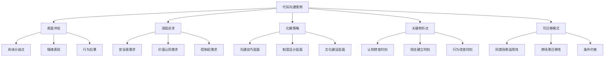
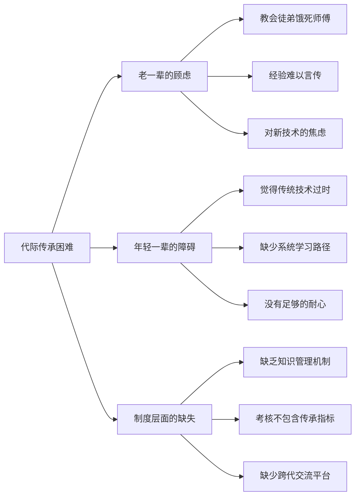
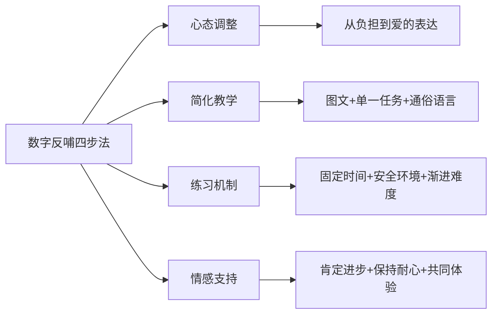
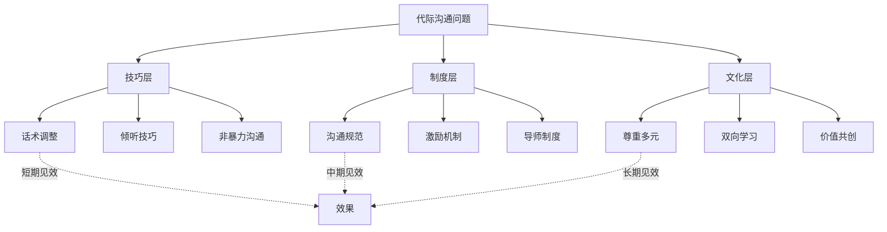

# 跨代际沟通——实战案例

> 案例不是故事，而是**浓缩的决策逻辑**。每一个案例背后都隐藏着可迁移的模式——读懂模式，你就能在自己的场景中创造解法。

本章汇集了职场、家庭、社区三大场景的实战案例。每个案例不仅讲述"发生了什么"，更深入分析**为什么发生**、**如何化解**、**哪些模式可以复用**。文章最后提供完整的自评工具和行动计划模板，帮助你将案例中的智慧转化为自己的能力。

---

## 一、案例分析框架：如何从案例中提取价值

在进入具体案例之前，先建立一个统一的分析框架。每个案例都从以下五个维度进行拆解，帮助你不仅"看热闹"，更能"看门道"。

### 1.1 五维分析模型

### 1.2 分析维度说明

| 维度 | 核心问题 | 分析要点 |
|------|---------|---------|
| 表面冲突 | 双方在争什么？ | 具体的分歧点、情绪反应、升级路径 |
| 深层诉求 | 各方真正在意什么？ | 安全感、价值认同、控制权、归属感 |
| 化解策略 | 用了什么方法？ | 沟通技巧、制度设计、文化建设三层 |
| 关键转折点 | 什么时刻发生了改变？ | 认知转变、信任建立、行为改变 |
| 可迁移模式 | 能用在什么地方？ | 模式的适用条件、迁移方式、约束边界 |

> **使用方法**：阅读每个案例时，先不看分析，用自己的框架解读一遍，再与文中的分析对照——这个"先思考后对照"的过程本身就是最好的学习。

---

## 二、职场跨代际沟通案例

### 2.1 案例一：互联网公司的代际融合

**行业**：互联网科技 | **规模**：500人 | **世代构成**：婴儿潮世代、X世代、千禧一代、Z世代四代共存

#### 背景

某互联网公司近年来大力招聘Z世代新员工，同时保留了一批经验丰富的婴儿潮世代和X世代老员工。公司发现，不同世代的员工之间存在明显的沟通障碍和协作摩擦，已影响到项目交付效率。

#### 冲突全景

| 冲突维度 | 老员工视角 | 年轻员工视角 | 客观表现 |
|---------|-----------|------------|---------|
| 工作态度 | "不尊重前辈"、"散漫" | "思想僵化"、"效率低下" | 互相贴标签，缺乏理解 |
| 会议参与 | 主导发言，期望后辈"先听后说" | 保持沉默，觉得"说了也没用" | 信息不对称，决策质量下降 |
| 工作工具 | 偏好邮件+文档（留痕、正式） | 偏好即时通讯+协作工具（快速、灵活） | 流程断裂，重复劳动 |
| 反馈方式 | 倾向当面反馈，注重语气委婉 | 倾向文字反馈，注重直接高效 | 反馈缺失或误读 |

#### 解决方案详解

**第一步：代际认知工作坊（打破刻板印象）**

工作坊设计的核心原则是**"用故事代替说教"**。公司邀请各世代代表分享成长经历和工作理念：

- 一位50多岁的技术总监分享了在没有互联网的年代如何通过图书馆和纸带打孔学习编程——每次调试需要等待数小时的批处理结果
- 一位23岁的Z世代新员工分享了在B站和YouTube自学UI设计、在GitHub上贡献开源项目的经历

**关键设计**：工作坊不是"教育"而是"对话"。参与者发现，尽管路径不同，但对技术的热情和学习精神是相通的。这种"发现共通性"的体验比任何培训课件都有效。

**第二步：跨代际双向导师制度（建立持续连接）**

传统导师制度是单向的——老带新。但这家公司设计了**双向导师制**：

| 导师方向 | 老员工→年轻员工 | 年轻员工→老员工 |
|---------|---------------|---------------|
| 指导内容 | 行业经验、人脉资源、决策思维 | 新工具使用、社交媒体趋势、敏捷方法 |
| 频率 | 每月2次正式辅导 | 每月2次技术分享 |
| 非正式交流 | 每月一次"导师午餐会" | 每月一次"工具体验日" |

**效果数据**：双向导师制实施3个月后，参与者的跨代际协作满意度从42%提升到78%。

**第三步：沟通规范优化（制度化保障）**

制定了**分层沟通矩阵**，兼顾各世代需求：

| 沟通场景 | 首选渠道 | 补充渠道 | 规范说明 |
|---------|---------|---------|---------|
| 重要决策和正式通知 | 邮件 | 即时通讯通知 | 邮件确保留痕，即时通讯确保触达 |
| 日常协调和快速沟通 | 企业微信/飞书 | — | 30分钟内响应预期 |
| 需要深度讨论的议题 | 视频会议 | 面对面会议 | 提前发送议程，控制时长 |
| 创意脑暴 | 面对面白板 | 在线协作工具 | 不限形式，鼓励发散 |
| 敏感反馈 | 一对一面谈 | — | 不使用文字渠道传递敏感信息 |

同时建立**"无会议日"**（每周三），尊重不同工作风格——老员工可以专注文档工作，年轻员工可以深度编码。

**第四步：混合工作模式（空间设计）**

引入灵活的混合工作模式：每周2-3天到办公室，其余时间远程办公。办公室空间重新设计：

- **开放协作区**：适合年轻员工喜欢的即时讨论
- **安静专注区**：适合老员工习惯的独立深度工作
- **半封闭讨论间**：适合3-5人的小范围讨论
- **休闲交流区**：咖啡吧台、沙发区，促进非正式交流

#### 实施效果（6个月数据）

| 指标 | 改进前 | 改进后 | 变化幅度 |
|------|-------|-------|---------|
| 员工满意度 | 61% | 76% | +25% |
| 跨部门协作效率 | 基准值 | 提升30% | +30% |
| 员工流失率 | 18% | 15.3% | -15% |
| 创新提案数量 | 基准值 | 提升40% | +40% |
| 会议效率评分 | 3.2/5 | 4.1/5 | +28% |

#### 关键启示

- **系统思维**：代际融合需要系统性的解决方案，单一措施（如一次团建）效果有限
- **双向学习**：反向指导比单向指导更能激发双方的积极性
- **制度保障**：沟通规范需要兼顾各世代需求，并通过制度化确保执行
- **空间即文化**：物理空间的设计会潜移默化地影响沟通模式

---

### 2.2 案例二：传统制造业的代际传承

**行业**：传统制造 | **规模**：200人 | **核心矛盾**：知识断层与技术传承危机

#### 背景

某传统制造企业面临严重的代际断层问题。核心技术人员大多是50-60岁的婴儿潮世代，即将在未来3-5年内退休。年轻技术人员（20-30岁）虽然技术基础扎实，但缺乏实际操作经验和行业洞察。企业的核心技术和工艺面临**失传风险**。

#### 问题深层分析

表面上看是"老的不愿教、小的不愿学"，但深层原因远比这复杂：

#### 四步解决方案

**第一步：知识抢救项目——"技术口述史"**

启动系统性的知识抢救项目，关键设计要点：

| 环节 | 具体做法 | 设计意图 |
|------|---------|---------|
| 访谈设计 | 安排专业团队对老一辈技术专家进行结构化访谈 | 确保知识的完整性和系统性 |
| 多媒体记录 | 文字+图片+视频+操作示范录像 | 不同类型知识用最适合的形式保存 |
| 知识库建设 | 建立可检索的技术知识库（含标签、关联、搜索） | 让知识可查找、可复用 |
| 年轻人参与 | 让年轻员工参与访谈过程，负责记录和整理 | 在互动中自然学习，而非被动接受 |

**关键创新**：不是简单地"让老师傅口述"，而是设计了**"问题驱动"的访谈框架**——先让年轻员工提出自己在实际工作中遇到的问题，再由老师傅结合这些问题讲解经验。这让知识传承更有针对性。

**第二步：师徒结对——结构化的传帮带**

| 师徒配对要素 | 设计说明 |
|------------|---------|
| 配对标准 | 技术方向匹配 + 性格互补 + 地理位置便利 |
| 学习计划 | 师徒共同制定，包含月度目标和里程碑 |
| 考核标准 | 不仅考核徒弟的学习成果，也考核师傅的传授质量 |
| 项目嵌入 | 师徒共同参与实际项目，在真实场景中学习 |
| 定期评估 | 每季度评估，允许更换配对 |

**第三步：技术融合创新——让传统和现代对话**

组建跨代际技术攻关小组，核心项目包括：

- **经验数字化**：将老师傅的手工检测经验转化为数据模型，开发智能辅助检测系统
- **工艺参数优化**：用数据分析方法优化老师傅凭经验设定的工艺参数
- **AR辅助操作**：开发增强现实操作指引，将老师傅的操作要点可视化

**具体成果**：3项传统工艺实现了数字化改进，其中一项焊接工艺的数字化辅助系统使新人培训周期从6个月缩短到了2个月。

**第四步：文化传承活动——情感连接**

| 活动形式 | 频率 | 目的 |
|---------|------|------|
| "老师傅讲故事"系列讲座 | 每月1次 | 传承行业文化和价值观 |
| 工厂历史展览 | 常设 | 建立企业认同感和自豪感 |
| 老中青三代技术交流会 | 每季度1次 | 促进跨代际了解 |
| 退休仪式和致敬活动 | 按需 | 让老员工感到被尊重 |

#### 实施效果

- 成功保留了核心技术知识，建立了包含**300+条目**的系统化技术知识库
- 12对师徒中有9对建立了良好的合作关系（75%成功率）
- 3项传统工艺得到数字化改进
- 年轻员工对企业认同感和归属感显著提升，入职1年内离职率下降了40%

#### 关键启示

- **知识传承需要制度化保障**：不能依赖个人自觉，需要制度设计
- **尊重经验是信任基础**：先让年轻人看到传统经验的价值，再引入创新
- **传统与创新结合**：让两代人都找到价值感，而非一方替代另一方

---

### 2.3 案例三：代际冲突化解的深度案例——传统制造业的"对照试验"

**行业**：传统制造（60年历史） | **规模**：500人 | **核心事件**：数字化工具引入引发的代际冲突

#### 冲突爆发

一次新产品研发会议上，矛盾集中爆发：

- **95后工程师**提出使用新的数字化设计工具，认为可以将研发周期缩短40%
- **70后技术总监**当场否决："我们用老方法做了20年，从来没出过问题。新工具风险太大，你们年轻人就是太急躁。"
- **结果**：年轻工程师消极怠工，老员工更加确信"年轻人靠不住"，项目陷入僵局

#### 深层诉求分析

HR总监张薇介入后，没有急于评判谁对谁错，而是分别与双方进行了深入交谈。她发现的真相出乎意料：

| 人员 | 表面立场 | 深层诉求 | 真实感受 |
|------|---------|---------|---------|
| 技术总监（70后） | 反对新工具 | 担心暴露数字化短板，失去团队权威 | "我也知道要跟上时代，但从头学新东西确实吃力" |
| 95后工程师 | 支持新工具 | 渴望专业能力被认可 | "数字化设计是我的专业优势，如果不能用，我在这里还有什么价值？" |

> **关键发现**：代际冲突的表面是**方法之争**，深层是**地位焦虑**和**价值认同**之争。不触及深层诉求，任何表面的妥协都是暂时的。

#### 化解策略：四步法

**第一步：创造"安全试验"机制**

张薇提议进行一次**对照试验**——这是整个化解过程的关键转折点：

| 试验设计要素 | 具体做法 | 设计意图 |
|------------|---------|---------|
| 任务分配 | 同一设计任务分两组：传统方法组 vs 新工具组 | 控制变量，结果可比 |
| 关键规则 | 试验结果仅用于评估方法，**不用于评价个人能力** | 消除双方的面子顾虑 |
| 评估标准 | 效率（时间）+ 质量（缺陷率）+ 可行性（工艺适配） | 多维度评估，避免单一指标偏见 |
| 结果呈现 | 由中立的第三方进行数据分析和报告 | 确保客观性 |

**第二步：试验结果引导认知转变**

试验结果显示：
- **新工具组**：设计效率提升35%，适合标准化组件
- **传统方法组**：在复杂工艺处理上更可靠，经验判断不可替代
- **结论**：两种方法**各有优势**，最优解是**融合使用**

这个结果让双方都保住了面子——老员工的方法没有被否定，年轻人的方法也被认可。

**第三步：建立"代际互助小组"**

基于试验结论，推动建立互助学习机制：

- 老师傅教年轻人工艺知识和质量把控经验
- 年轻人教老师傅使用数字化工具
- 每周一次"技术分享会"，轮流主讲
- 建立"技术搭档"制度——每个项目组必须包含不同世代的技术人员

**第四步：调整激励机制**

将"代际知识传承"纳入绩效考核，具体包括：
- 积极参与代际互助的员工获得额外绩效加分
- 为老员工提供数字化培训补贴（降低学习成本的心理门槛）
- 设立"最佳师徒搭档"年度奖项

#### 实施结果（6个月）

- 研发周期缩短了35%
- 产品质量指标提升了12%
- 团队氛围根本性转变

技术总监在年度总结会上说出了那句标志性的话："**年轻人不是来抢我们饭碗的，是来帮我们升级的。**"

#### 可迁移模式

这个案例中最值得复用的三个模式：

1. **安全试验模式**：当双方各执一词时，设计一个"对双方都安全"的对照试验，让事实说话而非让权威说话
2. **多维评估模式**：避免用单一指标评判，多维度评估可以让双方都找到价值
3. **激励导向模式**：激励机制要鼓励代际合作而非代际竞争

---

## 三、家庭跨代际沟通案例

### 3.1 案例四：春节家庭聚会的代际冲突

**场景**：三代同堂家庭聚会 | **世代**：祖辈（70+）、父辈（40+）、子辈（20+）

#### 三个典型冲突场景

**冲突场景一：职业选择之争**

> 爷爷："大学毕业了就去考公务员，稳定。"
> 孙子："我对创业更感兴趣，想做自媒体。"
> 爷爷："那算什么正经工作？不稳定。"
> *（孙子沉默，内心不满）*

**冲突分析**：

| 参与方 | 表面诉求 | 深层诉求 | 沟通障碍 |
|-------|---------|---------|---------|
| 爷爷 | 让孙子考公务员 | 对孙辈的关爱和担忧，希望后代生活稳定 | 用"为你好"代替"听你说" |
| 孙子 | 想做自媒体创业 | 渴望被认可，希望自主决定人生 | 用沉默代替解释 |

**冲突场景二：手机使用之争**

> 奶奶："年轻人整天就知道看手机，对眼睛不好。"
> 孙子："我在用手机学习和工作呢。"
> 奶奶："玩手机还说学习？"
> *（孙子感到不被理解）*

**冲突场景三：消费观念之争**

> 父母："你怎么又买了这么贵的东西？要懂得节约。"
> 孙子："这是我自己赚的钱，我有权利决定怎么花。"
> 父母："我们这么辛苦还不是为了你？"
> *（双方都不开心）*

**三场景的共性分析**：

这三个冲突看似不同，但遵循同一个模式——**"关心以批评的形式表达，需求以对抗的形式呈现"**。祖辈和父辈的出发点都是关心，但表达方式触发了年轻一代的防御反应。

#### 系统性改善方案

**行动一：用体验代替说教**

- 孙子主动向爷爷展示自己运营的自媒体账号，包括粉丝量、收入数据、商业模式
- 邀请爷爷参与一次视频拍摄，让长辈**亲身体验**年轻人的工作方式
- 分享自己的收入情况和财务规划，用**事实**打消长辈的担忧

> **原理**：长辈的反对往往基于"不了解"而非"不认同"。当他们看到具体的数据和成果时，态度通常会转变。

**行动二：建立"无手机时间"规则**

| 时段 | 规则 | 说明 |
|------|------|------|
| 用餐时间 | 全员无手机 | 统一规则，不是只针对年轻人 |
| 家庭活动时间 | 尽量不用手机 | 比如一起做饭、玩游戏时 |
| 其他时间 | 自由使用 | 尊重年轻人使用手机的需求 |
| 渐进引导 | 长辈学新功能 | 比如教爷爷用手机看新闻、奶奶用微信视频通话 |

**行动三：发现和创造共同话题**

- **共同话题**：家庭历史（"爷爷当年的故事"）、美食（一起做饭）、旅行计划、家族相册
- **共同活动**：一起包饺子、看电影、玩桌游、做手工
- **关键原则**：创造轻松的交流氛围，**先建立情感连接，再处理分歧**

#### 效果

经过几次有意识的调整：
- 爷爷开始对孙子的自媒体事业表示好奇，甚至主动问"今天发了什么内容"
- 奶奶学会了微信视频通话，与孙子的沟通更加频繁
- 家庭成员之间更加理解和尊重彼此的选择

#### 关键启示

- 代际冲突的根源往往是**不了解**，而非不认同
- **共同体验**是促进代际理解最有效的方式
- 设定**双向的边界和规则**可以减少不必要的摩擦——注意是双向的，不是只约束一方

---

### 3.2 案例五：数字反哺——教长辈使用智能手机

**角色**：小李（28岁）教妈妈（58岁）使用智能手机 | **持续时间**：3个月

#### 问题全景

小李最初很有耐心，但随着妈妈反复问同样的基础问题（如何发微信、如何拍照、如何支付），开始感到不耐烦。妈妈的问题背后有更深层的心理障碍：

| 表面问题 | 深层原因 | 表现 |
|---------|---------|------|
| 反复问基础操作 | 记忆力和学习方式不同 | 今天教了明天忘 |
| 害怕"按错了" | 对新技术的恐惧心理 | 不敢自己探索 |
| 听不懂解释 | 年轻人用语太专业 | 表面点头实际没懂 |
| 有问题就忍着 | 不好意思反复麻烦孩子 | 长期积累挫败感 |

#### 四步改进法

**第一步：调整心态——从"教技术"到"表达爱"**

小李意识到一个关键的认知转换：妈妈当年教自己用筷子、系鞋带时，也是不厌其烦地重复了无数遍。教长辈使用技术不是负担，而是一种**孝心的表达**和**关系的投资**。

**第二步：简化教学——降低认知负荷**

| 教学策略 | 具体做法 | 设计原理 |
|---------|---------|---------|
| 图文指南 | 制作带截图的操作步骤卡片 | 视觉记忆比语言记忆更持久 |
| 单一任务 | 一次只教一个功能 | 避免认知超载 |
| 通俗语言 | "点这个圆圆的图标"而非"点击应用图标" | 使用对方能理解的语言 |
| 减少步骤 | 设置桌面快捷方式，合并操作路径 | 降低操作复杂度 |
| 容错设计 | 告诉妈妈"怎么按都不会坏"，展示恢复方法 | 消除恐惧心理 |

**第三步：建立练习机制——从"被动学习"到"主动探索"**

- 每周安排固定的"手机学习时间"（如周日下午30分钟）
- 从简单功能开始，逐步增加难度：微信打字→发语音→视频通话→朋友圈→手机支付→网购
- 让妈妈在安全环境中练习——提前说"按错了也没关系，我教你恢复"
- 鼓励妈妈自己探索，培养信心——"您试试看，不行再来问我"

**第四步：情感支持——学习过程中的情感维护**

- 对妈妈的每一个小进步给予具体的肯定："妈，您今天自己发了朋友圈，太棒了！"
- 不因为学得慢而不耐烦——**耐心本身就是一种爱的表达**
- 通过共同使用手机增加亲子互动：一起看短视频、一起挑选商品、一起拍合照

#### 三个月后的成果

| 功能 | 学习进度 | 小李的感受 |
|------|---------|-----------|
| 微信聊天 | ✅ 熟练 | "妈妈开始给我发表情包了" |
| 视频通话 | ✅ 熟练 | "每天都要视频一次" |
| 手机支付 | ✅ 基本掌握 | "妈妈学会了扫码付款，很自豪" |
| 拍照分享 | ✅ 熟练 | "妈妈的朋友圈比我还丰富" |
| 网上挂号 | 🔄 学习中 | "正在教，进步很快" |

更重要的是，母子之间的关系因为共同学习而更加亲密。小李说："以前觉得教妈妈用手机是负担，现在觉得这是我们之间最温馨的互动时光。"

#### 数字反哺的通用方法论

---

### 3.3 案例六：家族企业的代际传承沟通

**企业类型**：建材企业 | **年营收**：5亿元+ | **传承主体**：创始人（60+）→ 海归二代（30+）

#### 冲突全景

王建国创办建材企业25年，儿子王明从海外留学回来后进入公司，希望推动数字化转型和品牌升级。父子在经营理念上产生了严重分歧：

| 分歧维度 | 父亲立场 | 儿子立场 | 冲突表现 |
|---------|---------|---------|---------|
| 战略方向 | "稳扎稳打" | "快速扩张" | 每次讨论都变成激烈争吵 |
| 管理风格 | 依赖"人情管理" | 推行"制度管理" | 老员工和新员工形成对立阵营 |
| 营销策略 | "酒香不怕巷子深" | "品牌需要主动经营" | 营销预算审批反复拉锯 |
| 用人理念 | 重用"老臣子" | 引进"职业经理人" | 核心岗位任命产生冲突 |

父亲觉得儿子"不知天高地厚，书读多了反而不会做生意"，儿子觉得父亲"固步自封，会把企业带进死胡同"。

#### 调解过程：三步沟通法

家族企业顾问李教授介入，采取了**"三步沟通法"**：

**第一步：分离"人"与"事"**

李教授让父子二人分别写下对方的**三个优点**和**三个担忧**。这个简单练习的效果出人意料：

| 人物 | 对方的三个优点 | 自己的三个担忧 |
|------|--------------|--------------|
| 父亲写儿子 | 有国际视野、学习能力强、有魄力 | 怕太激进搞垮企业、怕老员工被边缘化、怕失去控制权 |
| 儿子写父亲 | 行业经验丰富、人脉资源深厚、对品质有执念 | 怕错过转型窗口期、怕被竞争对手超越、怕想法永远不被采纳 |

> **关键发现**：双方的分歧不是"谁对谁错"，而是**不同经验背景下的不同判断**。父亲的担忧是合理的，儿子的焦虑也是真实的。

**第二步：建立"传承委员会"**

成立由外部顾问、核心高管、家族成员组成的"传承委员会"，关键规则：

| 规则 | 设计意图 |
|------|---------|
| 重大决策必须经过委员会讨论 | 避免父子二人直接冲突 |
| 父子二人都有否决权，但必须说明理由 | 保证双方的话语权，同时促进理性讨论 |
| 引入外部行业数据作为决策参考 | 用数据代替主观判断 |

**第三步：渐进式权力交接**

制定三年期的权力交接计划：

| 阶段 | 时间 | 内容 | 里程碑 |
|------|------|------|--------|
| 第一年 | 试探期 | 儿子负责新业务板块（数字化营销、电商），父亲继续掌管传统业务 | 新业务营收达到目标的80% |
| 第二年 | 扩展期 | 根据新业务表现，逐步扩大管理范围 | 传统业务数字化改造启动 |
| 第三年 | 交接期 | 完成核心业务交接，父亲转任"董事长"角色 | 父子完成正式交接仪式 |

#### 两年后结果

- 新业务板块营收增长了**120%**
- 传统业务因数字化工具引入，效率提升**20%**
- 父子关系明显改善

在一次行业论坛上，王建国公开说："**我儿子教会了我，老方法加上新工具，才是最好的方法。**"

#### 关键启示

- 家族企业的代际冲突往往**掺杂情感因素**，需要将"人"与"事"分离
- **第三方介入**可以提供客观视角，打破僵局
- **渐进式权力交接**比"一刀切"更可接受——让业绩说话，让时间证明
- **"业绩说话"**比"谁说了算"更能化解分歧

---

## 四、社区与公共服务领域的代际沟通案例

### 4.1 案例七：社区的"数字鸿沟"跨越

**场景**：社区服务中心 | **矛盾双方**：老年居民 vs 年轻社工

#### 问题表现

| 问题 | 老年居民的感受 | 年轻社工的感受 | 客观后果 |
|------|-------------|-------------|---------|
| 通知方式 | "没看到通知，错过了活动" | "微信群都发了，怎么不来？" | 活动参与率低 |
| 交流方式 | "想聊聊天，年轻人总在忙" | "老人来闲聊，耽误工作" | 情感疏离 |
| 表单填写 | "手机填表不安全、不放心" | "纸质表效率太低" | 流程冲突 |
| 咨询方式 | "打电话方便" | "电话太慢，信息留不下" | 服务效率低 |

#### 创新解决方案

社区主任陈芳设计了**"代际融合沟通方案"**，核心思路是**"双轨制"而非"替代制"**：

**方案一：双轨信息发布**

所有信息同时通过两个渠道发布：

| 渠道 | 形式 | 设计要点 |
|------|------|---------|
| 线上 | 微信群、公众号 | 适合年轻居民和中年子女 |
| 线下 | 纸质通知、公告栏 | 适合老年居民 |

**关键创新**：纸质通知的设计不再"土气"——参考年轻社工的审美，使用大字体、清晰排版，并附加二维码链接到详细信息。这既满足了老年人的阅读习惯，又为他们提供了"迈向数字化"的过渡路径。

**方案二："数字陪伴"项目**

招募社区中的青少年志愿者，与老年居民结成"数字伙伴"：

| 要素 | 设计 |
|------|------|
| 配对 | 1位青少年+1-2位老人 |
| 频率 | 每次60分钟 |
| 内容 | 微信视频通话、健康码、网上挂号、手机拍照等 |
| 激励 | 青少年获得志愿服务时长认证 |
| 附加价值 | 促进代际情感连接，青少年获得人生智慧 |

**方案三：混合式服务模式**

将服务分为两类：

- **线上可完成**：信息查询、简单预约、通知确认 → 鼓励线上
- **需要线下支持**：复杂业务办理、情感支持、纠纷调解 → 保留线下

同时在线下服务中融入数字化元素——比如用平板电脑展示信息，让老人在有人陪伴的情况下逐步适应。

**方案四："故事银行"项目**

鼓励老年居民讲述自己的人生故事，由年轻社工记录、整理、数字化保存。这个项目实现了**双赢**：老年人感到被尊重和重视，年轻人从老一辈的经历中获得智慧和启发。

#### 实施效果（一年）

| 指标 | 改进前 | 改进后 |
|------|-------|-------|
| 社区服务满意度 | 68% | 89% |
| 老年人数字技能（会用微信视频通话） | 30% | 70% |
| 活动参与率 | 45% | 72% |
| 社工对老年群体的理解度评分 | 2.8/5 | 4.2/5 |

#### 关键启示

- 数字鸿沟不仅是**技术问题**，更是**沟通方式和价值观的差异**
- **"双轨制"**是跨越数字鸿沟的务实策略——不强迫任何一方改变
- **代际互助项目**可以同时解决技术问题和情感连接问题
- 让老年人感到**"被需要"**比**"被帮助"**更有效

---

## 五、跨代际沟通的成功模式提炼

从上述七个案例中，我们可以提炼出以下可复用的成功模式：

### 5.1 反向指导（Reverse Mentoring）

**代表案例**：案例一（互联网公司双向导师制）

**核心机制**：年轻的"数字原住民"担任年长者的导师，分享新技术、新趋势、新思维方式。

| 要素 | 设计要点 |
|------|---------|
| 关系定位 | 平等的学习伙伴关系，而非"教与学"的等级关系 |
| 内容设计 | 年轻人教：工具使用、社交媒体、新趋势；年长者教：行业经验、决策思维、人脉 |
| 频率 | 每月至少2次正式交流+非正式午餐/咖啡 |
| 关键成功因素 | 年长者放下架子、年轻人尊重经验、双向学习而非单向教导 |

**真实案例**：某大型企业的CEO（55岁）与Z世代实习生（22岁）建立了反向指导关系。实习生向CEO介绍短视频平台的运营逻辑和用户行为，CEO向实习生分享企业战略思维。两人共同分析如何将短视频营销融入企业战略。

### 5.2 代际共创（Intergenerational Co-creation）

**代表案例**：跨代际产品创新团队

**核心机制**：组建由多代人组成的创新团队，利用代际差异作为创新资源。

| 世代 | 独特贡献 |
|------|---------|
| 婴儿潮世代 | 市场洞察、消费者理解、行业深度 |
| X世代 | 项目管理、资源协调、务实执行 |
| 千禧一代 | 创意设计、技术能力、用户思维 |
| Z世代 | 年轻用户视角、社交媒体趋势、前沿工具 |

**关键设计原则**：
- 代际差异是**创新的资源**，而非障碍
- 每一代人都有独特价值可以贡献
- 需要明确的角色分工和相互尊重

### 5.3 安全试验（Safe Experimentation）

**代表案例**：案例三（制造业对照试验）

**核心机制**：当双方各执一词时，设计一个"对双方都安全"的对照试验，让事实说话。

**设计要点**：
- 试验结果仅用于评估方法，**不用于评价个人能力**
- 多维度评估标准（效率+质量+可行性）
- 由中立第三方分析数据
- 结论指向"融合使用"而非"谁胜谁负"

### 5.4 模式对比总结

| 模式 | 适用场景 | 核心优势 | 实施难度 | 见效周期 |
|------|---------|---------|---------|---------|
| 反向指导 | 组织内代际学习 | 持续性好，双向受益 | ★★★ | 3-6个月 |
| 代际共创 | 产品/项目创新 | 产出明确，价值可见 | ★★★★ | 项目周期 |
| 安全试验 | 方法论分歧 | 用事实化解争议 | ★★ | 1-2个月 |
| 双轨制 | 服务/流程设计 | 不强迫任何一方改变 | ★★ | 2-3个月 |
| 知识抢救 | 传承危机 | 解决紧迫的知识流失 | ★★★★ | 6-12个月 |

---

## 六、失败案例与教训

> 成功的案例让我们知道"什么有效"，失败的案例让我们知道"什么必须避免"。以下案例经过脱敏处理，但教训是真实的。

### 6.1 失败案例一：强制"年轻化"引发的集体离职

**背景**：某传统零售企业新任CEO（38岁）上任后，推行"年轻化战略"，要求所有门店店长必须在40岁以下。

**过程**：
- 直接免去了8位50岁以上资深店长的职务
- 没有安排过渡期或知识传承机制
- 新任年轻店长缺乏管理经验，门店业绩下滑
- 被免职的老店长带走了大量客户资源和行业人脉

**后果**：
- 6个月内15家门店业绩下滑超过30%
- 3位被免职的老店长加入竞争对手
- 企业在当地行业的口碑严重受损

**教训**：
- **代际替代不能"一刀切"**——需要渐进式过渡
- **经验是有价资产**——不能简单否定
- **人情和关系网络**是传统行业的重要竞争力
- 正确做法应该是**"渐进式交接+知识传承+双向学习"**

### 6.2 失败案例二：反向指导的形式化

**背景**：某金融机构响应"数字化转型"号召，推行反向指导项目，安排年轻员工指导高管使用新技术。

**过程**：
- 项目启动时高管们热情表态支持
- 实际执行中，高管以"太忙"为由频繁取消辅导
- 年轻导师感到不被尊重，消极应对
- 项目3个月后流于形式，最终不了了之

**问题根因**：

| 问题 | 具体表现 |
|------|---------|
| 缺乏制度保障 | 没有将反向指导纳入高管的时间安排 |
| 缺乏激励机制 | 年轻导师没有额外的激励或认可 |
| 缺乏成果展示 | 没有展示反向指导的实际价值 |
| 文化障碍 | 高管放不下"我是领导"的面子 |

**教训**：
- 反向指导需要**制度保障**，不能只靠自觉
- 需要**明确的成果指标**和**激励机制**
- 需要创造让高管"有面子"的学习环境（如私下一对一，而非公开培训）
- 启动阶段需要一个**标杆性的成功案例**来带动

### 6.3 失败案例三：数字反哺的"孝顺绑架"

**背景**：某社区推广"教老人用手机"项目，鼓励子女教父母使用智能手机。

**过程**：
- 项目宣传过度强调"不教就是不孝"
- 部分老人感到被强迫，产生抵触
- 一些子女因工作繁忙无法坚持，产生愧疚感
- 项目参与者逐渐减少

**教训**：
- 数字反哺应该是**自愿的、愉悦的**，而非道德绑架
- 需要**替代方案**——对于没有子女或子女不在身边的老人，需要社区志愿者等其他支持
- 教学节奏应该**尊重老人的意愿**，而非子女或社区的期望

---

## 七、跨代际沟通的实用工具箱

### 7.1 代际沟通话术模板

**场景一：当你不同意长辈的观点时**

| 阶段 | 话术示例 | 原理 |
|------|---------|------|
| 先认可 | "您说的有道理，我理解您的考虑..." | 先降低对方的防御 |
| 再补充 | "同时我也在想，如果从另一个角度看..." | 用"同时"代替"但是" |
| 给依据 | "我看到一些数据/案例..." | 用事实支撑观点 |
| 求共识 | "您觉得这样是否可行？" | 给对方决策权 |

**场景二：当你想向长辈解释新事物时**

| 阶段 | 话术示例 | 原理 |
|------|---------|------|
| 找类比 | "这就像以前的XX，只不过..." | 用已知事物解释未知事物 |
| 讲好处 | "这样做可以帮您省掉XX麻烦" | 聚焦对对方的好处 |
| 演示 | "我来给您演示一下" | 行动比语言更有效 |
| 让他们试 | "您来试试看，我在这里" | 亲手体验加深记忆 |

**场景三：当长辈的建议你不打算采纳时**

| 做法 | 话术示例 | 原理 |
|------|---------|------|
| 感谢 | "谢谢您的建议，我认真考虑过了" | 让对方感到被尊重 |
| 说明理由 | "我目前的计划是XX，因为..." | 透明化你的思考过程 |
| 留余地 | "如果后面发现不行，我再来请教您" | 给双方台阶 |

### 7.2 代际沟通能力自测

请回顾你与不同世代的人沟通的经历，对以下陈述进行评分（1-5分，1=从不，5=总是）：

**认知维度：**
1. 我了解不同世代的成长背景和价值观差异
2. 我能识别代际冲突背后的深层原因
3. 我不会用世代标签来定义或评判他人

**行为维度：**
4. 我会根据不同世代的偏好调整沟通方式
5. 我主动创造与不同世代交流的机会
6. 我在代际冲突中能保持中立和耐心

**情感维度：**
7. 我对不同世代的观点保持开放和好奇
8. 我能从不同世代的人身上学到新东西
9. 我在与不同世代的人沟通时感到舒适

**总分解读：**

| 分数区间 | 水平 | 建议 |
|---------|------|------|
| 36-45分 | 优秀 | 你的代际沟通能力很强，可以成为团队中的"代际桥梁" |
| 27-35分 | 良好 | 部分领域可进一步提升，重点关注得分最低的维度 |
| 18-26分 | 一般 | 建议系统学习代际沟通知识，从本文的案例中寻找启发 |
| 9-17分 | 较弱 | 需要重点关注和提升，建议从"倾听不同世代的故事"开始 |

### 7.3 个人行动计划模板

基于自测结果，填写你的代际沟通提升计划：

| 提升领域 | 具体目标 | 行动步骤 | 时间节点 | 预期效果 |
|---------|---------|---------|---------|---------|
| 认知提升 | （例：了解Z世代价值观） | （例：阅读2本相关书籍+与3位Z世代深度交流） | （例：1个月内） | （例：能理解年轻人的3个核心诉求） |
| 行为调整 | | | | |
| 情感连接 | | | | |

### 7.4 跨代际沟通的"红线清单"

以下行为会严重破坏代际沟通，务必避免：

| 红线行为 | 为什么有害 | 替代做法 |
|---------|-----------|---------|
| 使用世代标签攻击 | "你们XX后就是XX"会立即引发对抗 | 谈论具体行为，而非群体标签 |
| 否定对方的整个经历 | "你们那个方法早就过时了"否定了对方的人生价值 | 认可经验的价值，讨论改进空间 |
| 在公开场合纠正长辈 | 当众让长辈"丢面子"会破坏关系 | 私下一对一沟通 |
| 用沉默代替沟通 | 冷战不解决问题，只会积累怨气 | 即使不认同，也表达"我听到了" |
| 强迫对方改变 | "你必须学会用手机"引发抵触 | 尊重节奏，提供支持 |

---

## 八、跨场景模式总结

### 8.1 代际沟通的"三层解法"

从所有案例中，我们提炼出代际沟通问题的**三层解法**：

| 层次 | 内容 | 见效周期 | 持续性 |
|------|------|---------|--------|
| 技巧层 | 话术调整、倾听技巧、非暴力沟通 | 数天到数周 | 需要持续练习 |
| 制度层 | 沟通规范、激励机制、导师制度 | 数周到数月 | 制度化后持续 |
| 文化层 | 尊重多元、双向学习、价值共创 | 数月到数年 | 根本性改变 |

> **最佳实践**：三层同步推进。技巧层解决"怎么说话"，制度层解决"怎么运作"，文化层解决"怎么思考"。

### 8.2 不同场景的策略选择

| 场景 | 推荐策略 | 优先级 | 关键成功因素 |
|------|---------|--------|------------|
| 职场代际冲突 | 安全试验+双向导师+激励调整 | 制度层优先 | 管理层的支持和示范 |
| 家庭代际摩擦 | 共同体验+边界设定+话术调整 | 技巧层+情感层 | 家庭成员的主动意愿 |
| 知识传承危机 | 知识抢救+师徒结对+数字化 | 制度层优先 | 时间紧迫性驱动 |
| 数字鸿沟 | 双轨制+数字陪伴+渐进引导 | 文化层+制度层 | 尊重节奏，不强迫 |
| 权力交接 | 分离人与事+渐进交接+第三方介入 | 制度层+文化层 | 业绩说话 |

---

## 九、读者行动清单

读完本章案例后，请根据你的情况完成以下行动：

- [ ] **回顾一个你经历过的代际沟通冲突**，用五维分析模型重新分析一遍
- [ ] **完成代际沟通能力自测**，找到你的提升方向
- [ ] **填写个人行动计划模板**，设定3个月内可执行的具体目标
- [ ] **选择一个本章的可迁移模式**，在你的实际场景中尝试应用
- [ ] **找一位不同世代的人**，进行一次深度对话——倾听他们的故事

> 代际沟通的能力不是读出来的，是**练出来的**。从最小的一步开始——今天就找一位不同世代的人，认真听他说完一个故事。
