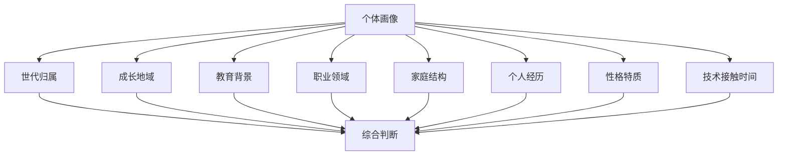
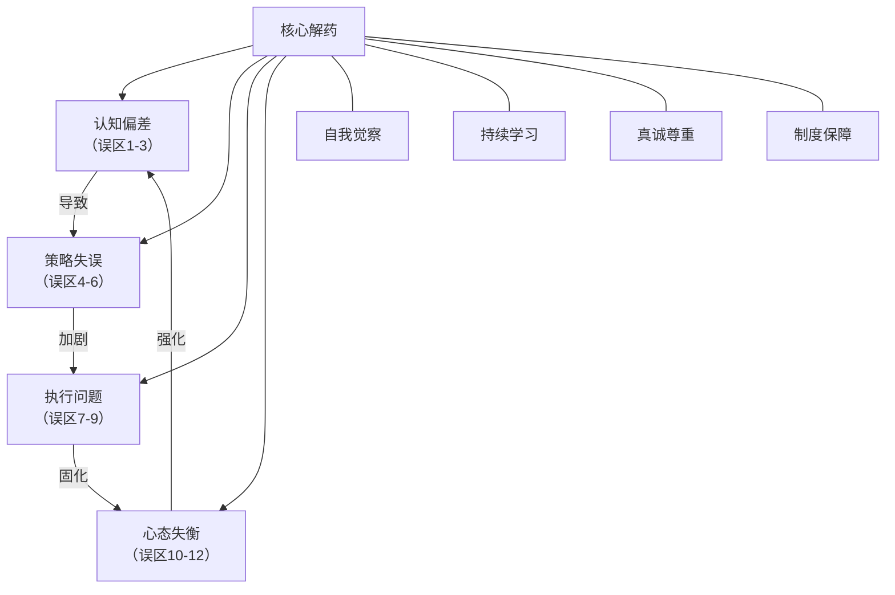

# 跨代际沟通——常见误区

跨代际沟通中，人们常因认知偏差、策略失误或心态失衡而陷入误区。这些误区不仅无法弥合代际鸿沟，反而会加深隔阂。本章系统梳理四大层面共十二个常见误区，逐一拆解其表现形式、深层危害和纠正方法，并提供可落地的自检工具。

---

## 一、认知层面的误区

认知偏差是跨代际沟通中最根深蒂固的障碍。它们往往在潜意识中运作，人们甚至意识不到自己正在犯错。

### 误区一：代际刻板印象

**表现：** 用世代标签来定义个体。常见话术包括："90后就是不能吃苦""老年人就是学不会技术""Z世代就是注意力不集中""70后都是保守派""00后整顿职场"。这些说法将复杂的个体简化为一个标签，忽略了人与人之间的巨大差异。

**心理学机制：** 刻板印象的本质是"认知吝啬"——大脑为了节省处理资源，倾向于将复杂信息归类简化。社会认同理论（Tajfel & Turner, 1979）指出，人们天然倾向于将自己归入某个"内群体"，并将其他群体标签化为"外群体"。代际标签恰好提供了这种分类框架。

**危害：**

- **自我实现预言（Self-fulfilling Prophecy）：** 当管理者认为"年轻人不能吃苦"时，会不自觉地减少对年轻人的挑战性任务分配，导致年轻人确实缺乏锻炼机会，反过来"验证"了刻板印象。Rosenthal & Jacobson（1968）的经典实验证明，教师对学生的期望会直接影响学生的表现。
- **归因偏差：** 将个体行为错误归因于世代特征。例如，一位年轻员工迟到，管理者可能归因为"年轻人散漫"，而非考虑具体的交通或健康原因。
- **信任侵蚀：** 被标签化的一方感受到不被尊重，信任基础被破坏，沟通意愿下降。
- **决策质量下降：** 基于刻板印象而非事实做出人事决策（如晋升、项目分配），错失真正的人才。

**纠正方法：**

| 步骤 | 具体做法 | 示例 |
|------|---------|------|
| 1. 觉察 | 当你用世代标签评价某人时，立刻暂停并自问"这是我的观察还是假设？" | "小张不回复邮件"→ 觉察到"年轻人不尊重正式沟通"的念头 |
| 2. 拆解 | 将行为与世代标签分离，寻找具体原因 | 小张可能更习惯即时通讯，不代表不尊重 |
| 3. 验证 | 直接与当事人沟通，了解真实情况 | "我发现你不太常用邮件，你更偏好什么沟通方式？" |
| 4. 更新 | 用真实的个体认知覆盖刻板印象 | 小张实际上文档能力很强，只是偏好不同渠道 |

**深层思考：** 世代特征描述的是统计趋势，不是个体命运。就像"男性平均身高高于女性"不代表你面前的这位男士一定比那位女士高。将统计规律应用于个体判断，是统计学中最基本的错误之一——生态谬误（Ecological Fallacy）。

---

### 误区二：认为代际差异是"好坏"问题

**表现：** 将代际差异简单地归结为"我们那时候更好"或"现在的年轻人不行"。典型话术："我们当年哪有这么多要求""现在的人就是吃不了苦""以前的员工多忠诚""年轻人一点委屈都受不得"。

**认知根源：** 这种思维源于"怀旧偏差"（Nostalgia Bias）——人们倾向于美化过去的经历，选择性地记住正面记忆，过滤掉负面体验。同时，"玫瑰色回忆效应"（Rosy Retrospection）让人觉得过去的一切都比现在好。

**危害：**

- **阻碍代际学习：** 如果认定过去的方式就是最好的，就不会向年轻一代学习新方法、新视角。
- **忽视环境变量：** 每一代人面对的经济环境、技术条件、社会结构完全不同。用50年前的标准评判今天的行为，忽略了"选择集合"已经发生了根本变化。
- **制造代际对立：** "好坏"框架天然制造对立——你说好，我说不好，变成零和博弈而非合作共赢。
- **固化权力结构：** 年长者掌握话语权时，"过去更好"的叙事会压制年轻世代的合理诉求。

**纠正方法：**

将"好坏"思维替换为"适应性"思维。每一代人在其所处的历史环境中都做出了最优的适应策略：

| 世代 | 核心环境特征 | 适应性策略 | 独特优势 |
|------|-------------|-----------|---------|
| 60后 | 物质匮乏、集体主义 | 勤俭节约、服从组织、长期规划 | 坚韧、大局观、忠诚度高 |
| 70后 | 改革开放初期 | 务实进取、抓住机遇、稳定优先 | 执行力强、资源整合能力 |
| 80后 | 市场经济、独生子女 | 竞争意识、自我驱动、兼顾理想与现实 | 独立思考、承上启下的桥梁角色 |
| 90后 | 互联网普及、全球化 | 信息敏感、追求效率、注重体验 | 学习速度快、跨界整合能力 |
| 00后 | 移动互联网原住民、多元文化 | 个性表达、平等对话、意义驱动 | 创造力、数字直觉、真实坦诚 |

**核心观点：** 没有"更好"的世代，只有"不同"的适应策略。跨代际沟通的目标不是让某一代人"改正"，而是让不同适应策略互补协作。

---

### 误区三：忽视代际内部差异

**表现：** 将同一代的所有人视为同质群体，忽视了性别、地域、教育水平、家庭背景、职业领域、城乡差异等因素造成的个体差异。例如，认为"所有00后都是数字原住民"，却忽略了农村地区00后可能接触数字设备较晚的事实。

**数据支撑：** 根据中国互联网络信息中心（CNNIC）的数据，截至2023年，城镇地区互联网普及率为83.1%，而农村地区为60.5%。这意味着同为00后，城市和农村的数字素养差异巨大。将他们笼统地归为"数字原住民"，对农村青年既不公平也不准确。

**危害：**

- **不公平对待：** 用世代标签替代了对个体的真实了解，可能导致资源分配不公。
- **错失人才：** 同一代中的"非典型"成员（如技术宅中的社交达人、传统行业中的创新者）可能被忽视。
- **沟通策略失效：** 针对整个世代制定的沟通策略，可能对其中相当一部分人完全不适用。
- **群体内部压力：** 当某一代被赋予特定标签时，不符合标签的个体会感受到来自"自己人"的压力。

**纠正方法：**

建立"多维度个体画像"——除了世代标签外，至少考虑以下维度：

**实操建议：**

1. **初始假设降权：** 将世代特征作为"冰山一角"的参考，而非全貌。初次接触时，假设你对对方一无所知。
2. **提问代替猜测：** 不要根据年龄推测对方的偏好，直接询问。"你平时更习惯用什么方式沟通？"比"你们年轻人肯定喜欢微信吧"好一万倍。
3. **关注个案数据：** 在团队管理中，建立每个成员的个人沟通档案，记录其偏好、风格和有效沟通方式，而非使用世代模板。

---

## 二、沟通策略层面的误区

策略层面的误区往往源于"我以为有效"的主观判断，而非经过验证的沟通效果。

### 误区四：要求对方"适应"自己

**表现：** 在跨代际沟通中，坚持让对方按照自己的方式进行沟通。例如："你应该学着用邮件，这才是专业的沟通方式""年轻人就应该多听少说""开会必须穿正装""汇报必须用PPT"。

**深层原因：** 这种行为背后是"默认自己是标准"的认知偏差（Ethnocentrism的代际版本）。当一个人长期处于某种沟通文化中，会将其内化为"正确的方式"，进而认为所有偏离这种方式的行为都是"不专业"或"不成熟"的。

**危害：**

- **单向适应的失衡：** 总是年轻一代适应年长者，会导致年轻人感到不被尊重、丧失主动性。
- **沟通效率下降：** 强迫使用不熟悉的沟通方式，反而增加认知负担，降低信息传递效率。
- **创新被抑制：** 新的沟通方式往往蕴含着更高效的协作模式，拒绝尝试意味着错失改进机会。
- **人才流失：** 在人才市场竞争激烈的今天，僵化的沟通文化会成为年轻人才离开的重要原因。

**纠正方法：双向适应矩阵**

| 沟通场景 | 年长者可调整 | 年轻者可调整 | 双方共识 |
|---------|------------|------------|---------|
| 日常沟通 | 接受即时通讯作为补充渠道 | 重要事项仍用正式渠道确认 | 即时沟通为主，正式渠道留痕 |
| 会议形式 | 增加互动环节，减少单向灌输 | 会前准备充分，会中积极发言 | 混合形式：正式议程+自由讨论 |
| 反馈方式 | 接受直接、平等的反馈风格 | 注意场合和方式的得体性 | 坦诚但尊重，直接但不伤人 |
| 工作汇报 | 接受数据化、可视化的呈现 | 理解口头汇报中的人情世故 | 数据支撑+故事化表达 |

**关键原则：** 沟通的目的是信息有效传递和关系维护，不是维护某种"正确的方式"。当一种沟通方式能更好地达成目的时，它就是更好的方式——无论它属于哪个世代。

---

### 误区五：过度迎合年轻世代

**表现：** 为了显得"年轻"或"潮流"，刻意模仿年轻人的语言和行为方式。例如：大量使用自己不理解的网络用语和表情包、在正式场合使用过于随意的语言、强迫自己参加不感兴趣的活动以示"亲近"。

**常见翻车场景：**

- 领导在正式会议中使用"绝绝子""yyds"，全场尴尬沉默
- 管理者强行使用年轻人的表情包，却用错了场合或含义
- 为了"贴近"年轻人，参加其私人聚会却让年轻人感到不自在

**危害：**

- **失去权威感：** 年轻人能敏锐地察觉"刻意"，这种不真诚反而损害领导者的可信度。
- **边界模糊：** 过度迎合可能模糊职场中的必要边界，导致管理困难。
- **自我迷失：** 丢掉自己的风格和立场，变成"四不像"——既不像真正的年轻人，也不再是值得信赖的前辈。

**纠正方法：**

1. **真诚优先于技巧：** 你可以不懂最新的网络用语，但不能不懂尊重和好奇。一句"这个词是什么意思？教教我"比强行使用更能赢得好感。
2. **保持身份一致性：** 你不需要变成年轻人，你需要成为"一个对年轻人开放的前辈"。角色定位清晰，沟通才自然。
3. **了解而非模仿：** 了解年轻人的文化可以帮助你理解他们的思维方式和价值取向，但了解不等于模仿。
4. **用尊重替代迎合：** "你这个方案的角度很新颖，我之前没想到"——真诚的肯定比任何"潮流语言"都有效。

---

### 误区六：忽视非正式沟通渠道

**表现：** 只重视正式的沟通渠道（如会议、邮件、报告），忽视了非正式沟通（如午餐聊天、茶水间交流、团建活动、甚至电梯里的寒暄）在跨代际关系中的关键作用。

**研究支撑：** 哈佛商学院的研究表明，团队中非正式交流的频率与团队信任度呈显著正相关。MIT人类动力学实验室的Alex "Sandy" Pentland通过可穿戴设备研究发现，非正式面对面交流是预测团队生产力的最强指标之一，甚至超过了个体智商和技能水平的总和。

**危害：**

- **信任赤字：** 正式沟通传递信息，非正式沟通建立信任。没有信任基础的跨代际沟通，只能停留在表面。
- **信息不对称：** 很多关键信息（如团队氛围、个人困扰、隐性知识）只在非正式场合流动。
- **代际隔阂固化：** 不同世代如果只在正式场合接触，很难建立真正的人际连接。
- **创新机会丧失：** 跨代际的创意碰撞往往发生在非正式场合——走廊对话、午餐闲聊中的"灵光一现"。

**纠正方法：**

**系统化构建非正式沟通渠道：**

1. **物理空间设计：** 设置跨部门、跨世代共享的休息区、茶水间，增加"偶遇"机会。
2. **制度化活动：** 每月至少一次跨代际午餐会/茶话会，主题轻松，不限于工作。
3. **导师制（Mentoring）：** 建立双向导师制——年长者分享行业经验，年轻人分享新技术和新视角。
4. **项目混搭：** 在项目组中有意识地安排不同世代的成员，创造日常协作中的非正式交流机会。
5. **兴趣小组：** 基于共同兴趣（而非世代）组建兴趣小组，如读书会、运动队、摄影社。

**注意事项：** 非正式沟通应该是自愿的、轻松的。强制参加的"团建"不是非正式沟通，而是另一种形式的正式活动。真正的非正式沟通发生在人们感到安全和放松的时刻。

---

## 三、执行层面的误区

执行层面的误区关乎"怎么做"，是最容易被忽视但后果最直接的问题。

### 误区七：忽视代际冲突的早期信号

**表现：** 对代际之间的轻微摩擦和不满视而不见，直到冲突升级为严重问题（如公开争吵、离职、团队分裂）才开始处理。典型的"灭火式"管理——只在火势已经蔓延时才出动。

**代际冲突的五级预警模型：**

**每个级别的处理成本：** Level 1只需要一次坦诚对话（30分钟），Level 3可能需要数次调解会议（数天），Level 5可能意味着重新招聘和团队重组（数月甚至数年）。越早介入，成本越低。

**早期信号清单：**

- [ ] 某个年轻员工开始回避与年长同事的协作
- [ ] 团队会议中出现微妙的语气变化（讽刺、不屑、不耐烦）
- [ ] 跨代际的非正式交流明显减少
- [ ] 某世代的成员开始在自己群体内"抱团"并吐槽另一世代
- [ ] 工作成果出现质量下降，特别是需要跨代际协作的部分
- [ ] 出现"他们就是……"这类将对方整体标签化的语言

**纠正方法：**

1. **建立定期的一对一沟通机制：** 管理者每两周与团队成员进行15分钟的非正式沟通，主动询问协作感受。
2. **团队氛围定期"体检"：** 每季度进行匿名的团队氛围调查，包含代际协作维度。
3. **"微冲突"即时处理：** 发现Level 1-2的信号时，在24小时内与相关方私下沟通，了解情况。
4. **冲突处理的"STOP"框架：**
   - **S（Situation）：** 描述具体情境，不加评判
   - **T（Thought）：** 表达自己的观察和想法
   - **O（Open）：** 开放地询问对方的感受和想法
   - **P（Plan）：** 共同商讨改善方案

---

### 误区八：用技术手段替代人际沟通

**表现：** 试图通过引入新的协作工具（如企业微信、飞书、钉钉、Slack）或平台来解决代际沟通问题，认为"只要工具好，沟通自然就好了"。

**典型案例：** 某公司为了改善代际沟通，花费数十万引入先进的协作平台，要求所有员工使用。结果：年轻员工迅速适应，年长员工学习困难，反而产生了新的代际鸿沟——年长员工因不会使用工具而感到被边缘化，年轻员工因等待年长同事操作而感到效率降低。

**危害：**

- **工具成为新障碍：** 本应促进沟通的工具，变成了新的代际分界线。
- **本质问题被掩盖：** 代际沟通的核心是理解和尊重，不是信息传递效率。工具解决了"传话"问题，但没解决"交心"问题。
- **技术焦虑加剧：** 强制推行新工具可能让技术能力较弱的世代产生焦虑和抵触。

**纠正方法：**

1. **先诊断再开药：** 明确代际沟通问题的根源——是工具问题、流程问题还是关系问题？如果是关系问题，再好的工具也无济于事。
2. **渐进式引入：** 新工具的引入应分阶段、有培训、有支持。设立"技术大使"（通常由年轻员工担任），为年长员工提供一对一帮助。
3. **保留选择权：** 允许不同世代选择自己舒适的主要沟通方式，工具只作为辅助和补充。
4. **技术+人际并行：** 每引入一个技术工具，配套一个人际互动环节。例如，引入新的项目管理工具后，安排跨代际的面对面培训会。
5. **衡量真正指标：** 不要以"工具使用率"衡量沟通效果，而要以"团队信任度""信息理解准确率""冲突频率"等真正指标来评估。

---

### 误区九：忽视代际沟通的持续性

**表现：** 组织一次代际沟通活动（如团建、培训、座谈会）后就认为问题已经解决，没有建立持续的机制。典型的"运动式"治理——轰轰烈烈开始，悄无声息结束。

**"一次活动"为什么不够：**

- **习惯需要重复建立：** 心理学研究表明，形成一个新的行为习惯平均需要66天（Lally et al., 2010）。一次活动的影响力通常在1-2周内衰减。
- **信任需要时间积累：** 代际之间的信任不可能通过一次活动建立，它需要反复的正面互动经验来逐步强化。
- **旧模式有惯性：** 团队中已有的沟通模式有强大的惯性，一次活动不足以改变长期形成的行为模式。

**纠正方法：建立代际沟通的"长效机制"**

| 时间维度 | 机制 | 具体做法 |
|---------|------|---------|
| 每日 | 微习惯 | 团队晨会中增加30秒的跨代际协作亮点分享 |
| 每周 | 固定环节 | 每周五的"跨代际咖啡时间"——随机配对两位不同世代的员工聊天15分钟 |
| 每月 | 主题活动 | 月度代际午餐会，设定轻松主题（如"我最想教给下一代的一件事"） |
| 每季度 | 评估反馈 | 匿名代际协作满意度调查+结果公示+改进计划 |
| 每年 | 制度更新 | 根据全年数据更新代际沟通制度，纳入组织文化建设 |

**关键：** 持续性不等于高频。与其每月搞一次大活动，不如每天有一个小习惯。代际沟通应该像呼吸一样自然，而不是像年度体检一样偶尔为之。

---

## 四、心态层面的误区

心态是所有行为的底层操作系统。心态层面的误区最难觉察，但影响最深远。

### 误区十：将代际差异视为威胁

**表现：** 将不同世代的差异视为对自身价值观和地位的威胁，产生防御性反应。典型内心独白："年轻人这样搞，我们这一套岂不是白做了？""他们不尊重经验，迟早会吃亏""如果他们的做法是对的，那我这些年岂不是走错了？"

**心理学解释：** 这种反应与"身份威胁"（Identity Threat）有关。当一个人的核心价值观或专业身份受到挑战时，大脑的杏仁核会触发类似"战或逃"的应激反应。代际差异之所以让人感到威胁，是因为它挑战了一个人多年积累的"我这样做是对的"这一核心信念。

**危害：**

- **防御性沟通：** 处于威胁感中的人倾向于防御性沟通——要么攻击（否定对方），要么回避（拒绝交流），两者都不利于建设性对话。
- **学习能力下降：** 处于威胁状态时，大脑的前额叶皮层（负责理性思考和学习）功能受到抑制，人变得更固执、更难接受新信息。
- **代际权力滥用：** 掌握权力的年长者可能利用职权压制年轻世代的创新尝试，以维护自己的"正确性"。

**纠正方法：**

1. **重新框架（Reframing）：** 将"他们的做法证明我是错的"重新框架为"他们的做法为我提供了新的视角"。差异不是否定，而是补充。
2. **分离身份与方法：** 你的专业价值不等于你使用的方法。方法可以迭代更新，而你的经验、判断力和人脉是不可替代的。
3. **成长型思维（Growth Mindset）：** Carol Dweck的研究表明，持有成长型思维的人将挑战视为学习机会而非威胁。培养"我可以从年轻人身上学到什么"的思维习惯。
4. **代际价值清单：** 列出你这一代人的独特优势和价值，同时列出年轻一代的优势。你会发现，这不是零和博弈，而是互补关系。

---

### 误区十一：拒绝接受新事物

**表现：** 以"年纪大了学不会"或"这不是我们的方式"为由拒绝接受新的沟通方式、工具或观念。常见表现：

- 拒绝使用新的协作工具，坚持用纸笔或老方法
- 对年轻人提出的新方案第一反应是"以前试过，不行"
- 将自己不理解的新事物一律归为"没用"或"瞎折腾"

**认知根源：** 这种行为背后是"功能固着"（Functional Fixedness）和"现状偏好"（Status Quo Bias）。功能固着让人只能看到事物的传统用途，现状偏好让人倾向于维持现有状态，即使改变可能带来更好的结果。

**"学不会"的真相：** 大脑具有终身可塑性（Neuroplasticity）。伦敦出租车司机的研究（Maguire et al., 2000）证明，即使是成年人的大脑也会因持续学习而发生结构性变化。"年纪大了学不会"是一个自我设限的信念，而非科学事实。真正让人"学不会"的是动机不足和练习不够，而非年龄。

**危害：**

- **能力退化加速：** 不使用的能力会加速退化，形成"不学→不会→更不想学"的恶性循环。
- **被边缘化：** 在快速变化的时代，拒绝学习意味着主动退出核心圈。
- **代际关系恶化：** 年轻人最反感的不是"不会"，而是"不愿学"。一个愿意学习的年长者比一个什么都精通但拒绝更新的人更受尊重。

**纠正方法：**

1. **微学习策略：** 不要试图一次性掌握所有新事物。每天花10分钟学习一个新工具或新概念，积累效果惊人。
2. **找到关联点：** 将新事物与已有知识建立联系。例如，学习新的项目管理工具时，可以想"这就像是我以前用的甘特图，只是换了一种呈现方式"。
3. **找一个"学习伙伴"：** 找一位年轻同事作为你的"新事物向导"，定期交流。这不仅是学习，也是建立代际关系。
4. **接受"笨拙期"：** 学习任何新事物都会经历一个"笨拙期"——做得不好、速度慢、容易出错。这是正常的学习曲线，不是能力不足的证明。
5. **从兴趣出发：** 选择一个你真正感兴趣的新领域开始学习，兴趣是最好的驱动力。

---

### 误区十二：忽视代际沟通中的情感因素

**表现：** 只关注代际沟通的"技术层面"——使用什么工具、采用什么语言、遵循什么流程——忽视了情感因素在代际沟通中的核心作用。

**为什么情感是核心：** 神经科学家Antonio Damasio的研究证明，情感不是理性的对立面，而是理性决策的必要基础。在沟通中，情感决定了信息是否能被接收——如果对方感到不被尊重或不被理解，再完美的逻辑也无法穿透情感的屏障。

**"正确的技术+错误的情感"的典型场景：**

- 用完美的PPT汇报了一个好方案，但全程没有看年长领导一眼，方案被否决
- 给年轻员工发了一条措辞严谨的工作邮件，但因为语气冰冷，被解读为"领导对我不满"
- 举办了一次代际交流活动，流程完美但氛围僵硬，参与者全程"走流程"没有真正交流

**代际沟通中的核心情感需求：**

| 世代 | 最核心的情感需求 | 最能打动他们的方式 |
|------|----------------|-------------------|
| 60后-70后 | 被尊重、被需要 | "您的经验对我们非常重要，请指点" |
| 80后 | 被认可、被信任 | "这个事交给你我放心，你来决策" |
| 90后 | 被理解、被平等对待 | "我理解你的想法，我们一起讨论" |
| 00后 | 被看见、被真实对待 | "你这个角度很独特，继续说说" |

**纠正方法：**

1. **先连接情感，再传递信息：** 在讨论工作之前，先花1-2分钟建立情感连接——关心对方的感受、表达真诚的兴趣。
2. **学会"情感标注"：** 直接说出你观察到的对方的情感。"我感觉你对这个方案有些顾虑，能说说你的想法吗？" 这种方式能迅速降低防御。
3. **投资"情感账户"：** 将跨代际关系想象成一个银行账户——每次正面互动是存款，每次负面互动是取款。确保你的"情感账户"始终有正余额。
4. **用心倾听比用技巧说话更重要：** 倾听时不打断、不评判、不急于给建议，只是真正地理解对方在说什么、感受什么。这种倾听本身就是最有力的情感支持。
5. **非语言信号要一致：** 确保你的语调、表情、肢体语言与你的话语一致。如果嘴上说"我很重视你的意见"，但身体后仰、眼神游离，对方感受到的是后者而非前者。

---

## 自检工具：跨代际沟通误区快速诊断

回答以下问题，评估你在跨代际沟通中的误区风险：

| 序号 | 自检问题 | 是 | 否 | 中立 |
|------|---------|---|---|------|
| 1 | 我是否经常用"他们这代人就是……"来描述某个世代？ | ⚠️ | ✅ | 🔶 |
| 2 | 我是否觉得过去的方式比现在的方式更好？ | ⚠️ | ✅ | 🔶 |
| 3 | 我是否了解团队中每位成员的个人沟通偏好（而非世代偏好）？ | ✅ | ⚠️ | 🔶 |
| 4 | 沟通方式的调整是否总是单向的（一方适应另一方）？ | ⚠️ | ✅ | 🔶 |
| 5 | 我是否曾刻意模仿年轻人的语言或行为以显得"亲近"？ | ⚠️ | ✅ | 🔶 |
| 6 | 我是否与不同世代的同事有定期的非正式交流？ | ✅ | ⚠️ | 🔶 |
| 7 | 我是否能及时察觉代际之间的微妙张力？ | ✅ | ⚠️ | 🔶 |
| 8 | 我是否认为引入好的工具就能解决代际沟通问题？ | ⚠️ | ✅ | 🔶 |
| 9 | 我所在的团队是否有持续性的代际沟通机制（而非一次性活动）？ | ✅ | ⚠️ | 🔶 |
| 10 | 面对年轻一代的新做法，我的第一反应是好奇还是质疑？ | 好奇✅ | 质疑⚠️ | 🔶 |
| 11 | 我是否主动学习过年轻世代使用的新工具或新平台？ | ✅ | ⚠️ | 🔶 |
| 12 | 在跨代际沟通中，我是否先关注情感连接再讨论具体内容？ | ✅ | ⚠️ | 🔶 |

**评分指南：** 如果有3个以上⚠️，说明你在跨代际沟通中存在明显误区，建议回顾对应章节并制定改进计划。如果大部分是✅，说明你已经具备较好的跨代际沟通意识，可以继续强化优势领域。

---

## 误区之间的关联与系统性应对

这十二个误区并非孤立存在，它们之间存在相互强化的关系：

**系统性应对原则：**

1. **从认知入手：** 改变认知偏差是一切改善的起点。没有正确的认知，再好的策略和工具都只是表面文章。
2. **策略与执行并重：** 认知改变后，需要具体的策略来指导行为，并通过持续执行将新行为固化为习惯。
3. **心态是底层保障：** 策略和执行可以一时有效，但只有心态层面的真正转变才能带来持久的代际和谐。
4. **制度是最终保障：** 个人层面的改变需要制度层面的支撑才能持续。将代际沟通的好做法嵌入组织制度，让"做对的事"成为默认选项而非额外努力。

---

> **本章要点回顾：** 跨代际沟通的十二个误区覆盖认知、策略、执行、心态四个层面，它们相互关联、彼此强化。应对的核心不是掌握更多技巧，而是培养自我觉察的能力——当你能识别自己正在犯哪个误区时，纠正就已经开始了一半。使用自检工具定期评估，建立持续改进的习惯，代际沟通的质量将随时间稳步提升。
