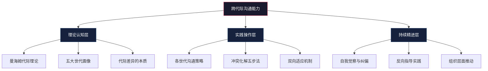

# 跨代际沟通——本章小结

## 一、本章核心框架回顾

跨代际沟通不是一门"讨好不同年龄层"的技巧，而是一种**系统性理解社会变迁如何塑造人的认知模式、价值排序和表达习惯**的能力。本章从理论基础出发，逐层深入到各世代的沟通要点、冲突化解策略和常见误区，构建了一个完整的跨代际沟通知识体系。

---

## 二、理论基础：为什么代际差异真实存在

### 2.1 曼海姆代际理论的核心逻辑

卡尔·曼海姆（Karl Mannheim）在1928年发表的《代际问题》中提出：一代人的集体意识并非凭空产生，而是在**性格形成的关键窗口期（大约14-24岁）**，由共同经历的重大历史事件所塑造。这个年龄段正是个体从依赖家庭走向独立思考的过渡期，对社会冲击的敏感度最高，记忆烙印也最深。

这意味着什么？意味着代际差异不是"年轻人不懂事"或"老年人固执"，而是**不同历史环境训练出的不同认知操作系统**。婴儿潮世代在经济高速增长期形成了乐观进取的底层信念，Z世代在全球疫情和信息过载中形成了务实怀疑的认知基调——两者都是对各自生存环境的理性适应。

### 2.2 五大世代的核心画像

| 世代 | 出生年份 | 关键历史事件 | 核心价值排序 | 主导沟通风格 |
|------|---------|-------------|-------------|-------------|
| 婴儿潮 | 1946-1964 | 冷战、文化大革命、改革开放 | 忠诚、奉献、等级秩序 | 面对面、正式、尊重权威 |
| X世代 | 1965-1980 | 经济转型、独生子女政策、下岗潮 | 独立、务实、工作生活平衡 | 直接高效、邮件、结果导向 |
| 千禧一代 | 1981-1996 | 互联网兴起、房价飙升、全球化 | 意义感、成长、体验 | 即时通讯、平等对话、反馈驱动 |
| Z世代 | 1997-2012 | 移动互联网、疫情、内卷 | 真实、多元、心理健康 | 视觉化、碎片化、平台化 |
| Alpha世代 | 2013至今 | AI普及、后疫情、短视频 | 待观察（数字原住民2.0） | 交互式、多模态、游戏化 |

**重要提醒：** 上述画像是统计趋势，不是个体标签。同一代内部的个体差异远大于代际间的平均差异。一个Z世代可能比婴儿潮世代更重视面对面沟通，一个婴儿潮世代可能比千禧一代更擅长数字工具。代际画像的正确用法是**作为理解他人的起点，而非定义他人的终点**。

### 2.3 代际差异的三重本质

代际差异并非简单的"观念不同"，它有三个层次：

1. **认知框架差异**：不同世代对同一信息的解读方式不同。比如"加班"这个词，婴儿潮世代可能联想到"敬业"，千禧一代可能联想到"剥削"，Z世代可能联想到"内卷"。这不是谁对谁错，是历史经验训练出的不同联想路径。

2. **沟通协议差异**：不同世代有不同的"默认设置"。婴儿潮世代默认"正式邮件比微信更尊重"，Z世代默认"能用表情包说清楚的事不需要打电话"。这些默认设置在各自世代内部是共识，跨世代时就成了冲突源。

3. **信任建立机制差异**：婴儿潮世代通过长期共事建立信任，X世代通过兑现承诺建立信任，千禧一代通过价值观共鸣建立信任，Z世代通过真实性建立信任。不理解对方的信任建立机制，再多的善意也无法有效传达。

---

## 三、各世代沟通策略精要

### 3.1 与婴儿潮世代沟通

**核心原则：尊重先行，耐心为基**

婴儿潮世代成长于强调集体和权威的环境中，他们对"礼节"的敏感度远高于年轻世代。这不是"老派"，这是他们几十年社会化的结果。

**具体策略：**
- **见面优先**：重要事项当面说，其次电话，再次邮件。微信消息对他们来说缺乏"郑重感"
- **称呼到位**：使用"您"和职务称呼，不要过早切换到"你"或昵称
- **给予时间**：他们可能需要更多时间消化新信息，不要催促"赶紧决定"
- **技术辅助**：如果需要他们使用数字工具，提供书面步骤指南，而不是口头说一遍
- **认可经验**：在引入新方法前，先肯定他们现有做法的价值，再说"我们可以在此基础上进一步优化"

### 3.2 与X世代沟通

**核心原则：直接高效，尊重独立**

X世代是"夹心层"，上有婴儿潮领导，下有千禧下属，他们是务实的问题解决者，厌恶废话和过度形式化。

**具体策略：**
- **开门见山**：先说结论和诉求，再补充背景。不要铺垫三分钟才进入正题
- **邮件为主**：他们偏好有记录的书面沟通，便于追溯和处理
- **给空间**：不要频繁打扰，他们重视专注工作时间，设定好check-in节点即可
- **用数据说话**：主观感受说服力弱，用事实、数据和案例支撑你的观点
- **尊重边界**：下班后非紧急事务不打扰，他们对工作生活平衡的重视是真实的

### 3.3 与千禧一代沟通

**核心原则：平等对话，解释"为什么"**

千禧一代成长于信息爆炸时代，他们不接受"因为我说了所以你做"的逻辑，需要理解任务的意义和价值。

**具体策略：**
- **解释背景**：分配任务时说明"为什么做这件事"以及"它如何影响更大的目标"
- **即时反馈**：不要等到年终评估才给反馈，他们需要实时的正向和建设性回应
- **用即时通讯**：微信、飞书、Slack是他们的主场，邮件在他们看来"太慢太正式"
- **提供成长路径**：他们愿意付出，但需要看到成长空间。定期讨论职业发展是必须的
- **认可而非命令**：用"你的方案很有洞察力，我们在此基础上调整"代替"按我说的改"

### 3.4 与Z世代沟通

**核心原则：真实透明，视觉优先**

Z世代是在社交媒体和短视频中长大的一代，他们对"套路"和"假大空"有极强的免疫力，同时对心理健康的重视程度远超前代。

**具体策略：**
- **真诚第一**：不要试图用话术包装，他们能一眼看穿不真诚
- **视觉化表达**：用图表、视频、信息图代替大段文字，信息密度高但表达形式要轻
- **尊重心理健康需求**：当他们表达焦虑或压力时，不要说"我们当年更苦"，而是认真倾听并提供支持
- **短反馈循环**：他们习惯了即时满足的节奏，频繁的、小粒度的反馈比一次大评估更有效
- **用他们的平台**：B站、小红书、抖音不只是娱乐工具，也是他们的信息获取渠道和社交语言

---

## 四、代际冲突化解的核心框架

### 4.1 冲突的四个根源

代际冲突很少是表面看到的"谁对谁错"，几乎都能追溯到以下四个根源之一：

| 冲突根源 | 典型表现 | 深层原因 |
|---------|---------|---------|
| 价值观念 | "年轻人就是不能吃苦" / "凭什么要我加班" | 对"好员工""好孩子"的定义不同 |
| 沟通风格 | "发微信太不正式" / "打电话太打扰" | 对"尊重"和"效率"的权重不同 |
| 工作方式 | "必须坐班才叫工作" / "在哪都能干活" | 对"自律"和"监督"的信任度不同 |
| 技术使用 | "手写更有诚意" / "电子签名更高效" | 对"仪式感"和"便捷性"的偏好不同 |

### 4.2 冲突化解五步法

**第一步：暂停判断（2秒原则）**
当你感到"这人怎么这样想"时，给自己2秒钟。这2秒是用来激活你的元认知——意识到你正在用自己世代的滤镜评判对方。

**第二步：倾听理解（3F倾听法）**
- **Fact（事实）**：对方在说什么具体内容？
- **Feeling（感受）**：对方的情绪状态是什么？
- **Focus（意图）**：对方真正想要达到的目的是什么？

**第三步：寻找共同点（锚定共识）**
代际冲突中，双方往往有80%的共同目标，只是路径选择不同。找到那个共同目标，把它作为对话的锚点。比如"我们都希望这个项目成功"，然后讨论"怎样做最有可能成功"。

**第四步：协商方案（双向适应）**
不是一方说服另一方，而是共同设计一个双方都能接受的方案。关键原则：**谁更在意某个维度，谁在那个维度上获得优先权**。比如年轻人更在意沟通渠道的选择（用飞书还是邮件），年长者更在意沟通的正式程度（邮件措辞要得体），那就"用飞书发但保持正式措辞"。

**第五步：建立新规范（制度化）**
好的解决方案要固化为团队规范，而不是每次冲突都重新谈判。把协商结果写成团队沟通公约，定期回顾和更新。

### 4.3 高频冲突场景速查

| 场景 | 年长方的立场 | 年轻方的立场 | 双赢方案 |
|------|------------|------------|---------|
| 会议形式 | 必须线下开，才有效率 | 能线上就线上，省时间 | 重要决策线下，日常同步线上 |
| 反馈方式 | 年终一起评估 | 随时给我反馈 | 月度一对一 + 即时文字正反馈 |
| 工作汇报 | 详细书面报告 | 几句话说清进度 | 结构化模板（3行：完成/进行中/阻塞） |
| 加班态度 | 加班是敬业表现 | 加班是管理失败 | 按项目节点冲刺，非必要不常态加班 |
| 技术工具 | 学不动了，够用就行 | 新工具效率更高 | 选核心工具统一培训，非核心各自偏好 |

---

## 五、12个常见误区深度解析

### 5.1 认知层面误区

**误区1：用世代标签定义个体**
"你是90后，所以你应该……"这是最常见也最危险的错误。代际画像是群体统计特征，应用到个体上就像用平均气温决定今天穿什么——可能正好合适，也可能大错特错。正确做法：用代际画像作为**了解的起点**，然后根据实际互动不断修正对这个具体人的认知。

**误区2：将代际差异等同于代际对立**
媒体喜欢用"90后整顿职场""00后教老板做人"这类对立叙事吸引流量，但这严重扭曲了现实。绝大多数跨代际合作是顺畅的，冲突只是少数。把媒体叙事当真，会制造本不存在的敌意。

**误区3：认为代际差异是"好坏"问题**
"年轻人就是浮躁""老年人就是保守"——这不是分析，是偏见。每种特质都是对特定历史环境的适应，没有绝对的好坏。浮躁可能意味着快速迭代，保守可能意味着稳健审慎。

### 5.2 策略层面误区

**误区4：要求对方单方面适应自己**
"你应该学会用微信""你应该习惯面对面沟通"——单方面要求是沟通的大忌。适应是双向的，如果只要求对方改变，本质上是在说"我的方式才是对的"。

**误区5：忽视非正式沟通渠道**
很多重要的代际理解不是在正式会议中建立的，而是在午餐闲聊、茶歇对话、团建活动中产生的。如果你只在正式场合与不同世代互动，你看到的永远是"职业面具"而非真实的人。

**误区6：用单一策略应对所有同代人**
"我和Z世代沟通就用表情包"——这种一刀切的策略忽略了同一代内部的巨大差异。你需要根据具体个体的偏好灵活调整，而不是把世代标签当万能公式。

### 5.3 执行层面误区

**误区7：过度依赖数字沟通**
年轻世代偏好文字沟通，但有些事情必须当面说：批评性反馈、敏感话题、情感支持。即使是Z世代，在收到坏消息时也希望得到面对面的关怀而非一条微信消息。

**误区8：忽视情感因素**
代际冲突表面上是"做事方式不同"，底层往往是"感觉不被尊重""感觉不被理解"。只解决表面问题（比如改了会议形式）而不处理情感需求（比如让年长者感到被重视），冲突会以其他形式再次爆发。

**误区9：将沟通工具选择等同于沟通能力**
会用微信不等于会和年轻人沟通，会写邮件不等于会和年长者沟通。工具只是载体，真正的沟通能力在于理解对方的需求、尊重对方的偏好、清晰表达自己的意图。

### 5.4 心态层面误区

**误区10：将代际差异视为威胁**
"年轻人来了我是不是要被淘汰？""老一辈挡着我没法创新？"——这种零和思维是代际焦虑的根源。代际差异是互补资源，不是竞争威胁。年长者的经验和年轻者的创新力结合，才能产生最大价值。

**误区11：放弃沟通的尝试**
"我和他们就是说不到一块去"——这往往是放弃的借口而非事实。沟通障碍几乎都能通过调整策略来改善，关键是你愿不愿意投入精力去理解对方的沟通逻辑。

**误区12：忽视代际优势**
每一代人都有独特优势：婴儿潮的韧性和全局观、X世代的独立和适应力、千禧一代的协作和创新力、Z世代的数字素养和多元视角。只看到代际差异带来的摩擦，看不到代际融合带来的增益，是一种认知盲区。

---

## 六、跨代际沟通能力自评框架

在采取行动之前，先用以下框架评估自己当前的跨代际沟通能力水平：

| 能力维度 | 初级（1-2分） | 中级（3-4分） | 高级（5分） |
|---------|-------------|-------------|-----------|
| 代际认知 | 对各世代特征了解模糊 | 能说出各世代大致特点 | 理解特征背后的历史成因 |
| 策略灵活度 | 用同一套方式和所有人沟通 | 能根据世代调整部分策略 | 能针对具体个体灵活定制 |
| 冲突处理 | 回避或强压代际冲突 | 能化解常见的代际摩擦 | 能将冲突转化为协作机会 |
| 自我觉察 | 未意识到自己的世代偏见 | 能识别偏见但偶尔犯错 | 能主动暂停并修正偏见 |
| 双向适应 | 只要求对方适应自己 | 愿意做出一定调整 | 主动寻找双方都舒适的方案 |
| 组织推动 | 仅限个人层面改善 | 在团队中促进代际理解 | 在组织层面推动代际融合制度 |

**评分说明：** 20分以上为高级水平，15-19分为中级，10-14分为初级，10分以下需要重点提升。不需要每一项都达到5分，识别自己的短板并有针对性地提升更重要。

---

## 七、行动清单与实施指南

### 7.1 立即行动（本周内）

**1. 绘制代际画像**
选择一个你不太了解的世代（建议选择你日常接触最少的），用以下模板完成画像：

世代名称：_______________
出生年份范围：_______________
成长期关键历史事件（至少3个）：
  1. _______________
  2. _______________
  3. _______________
这些事件如何塑造了他们的核心价值观：_______________
他们的典型沟通偏好：
  - 首选渠道：_______________
  - 表达风格：_______________
  - 对"尊重"的理解：_______________
我能做的一个调整：_______________

**2. 进行一次跨代际深度对话**
找到一位不同世代的人（同事、家人、邻居均可），进行一次30分钟以上的对话。目标不是说服对方，而是**理解对方的思考逻辑**。可以问以下问题：
- "您年轻时最影响您的一件事是什么？"
- "您觉得现在和年轻人沟通最大的障碍是什么？"
- "有什么事情您希望年轻人能理解的？"

**3. 记录本周代际互动日志**
每天记录2-3次与不同世代的沟通互动，标注：沟通对象的大致世代、沟通渠道、你当时的第一反应（是否有偏见）、实际效果。周末回顾，看看有没有模式。

### 7.2 短期行动（一个月内）

**1. 代际体验日**
用一整天时间，完全用另一个世代的方式生活和工作：如果对方习惯邮件，你就只用邮件；如果对方习惯语音消息，你就只发语音。体验对方的沟通生态，才能真正理解对方的"为什么不方便"。

**2. 收集人生故事**
找3个不同世代的人，每人聊30-60分钟，记录他们的人生关键转折点。不是为了写传记，而是为了**通过具体的人生经历理解抽象的代际特征**。一个婴儿潮世代的"为什么重视稳定"，可能藏在他们童年的一次搬迁经历中。

**3. 建立反向指导关系**
找一位不同世代的人，互相做对方的"导师"：你教他们你擅长的（比如数字工具使用、新趋势理解），他们教你他们擅长的（比如行业经验、人际关系处理）。反向指导是打破代际壁垒最有效的方式之一，因为它把差异变成了互惠资源。

**4. 阅读代际主题书籍**
推荐书单（按难度递增）：
- 入门：《代际领导力》——理解代际差异在管理中的应用
- 进阶：《千禧一代制造》——深入理解年轻世代的形成逻辑
- 深度：曼海姆《代际问题》——代际理论的原始文献

### 7.3 中期行动（三个月内）

**1. 跨代际沟通能力提升计划**
根据前述自评框架，识别自己的2-3个短板维度，制定针对性提升计划。每个维度设定一个可衡量的目标和具体的练习方式。

**2. 参与或组织跨代际协作项目**
在实际协作中检验和提升跨代际沟通能力。如果团队缺乏多样性，可以参与社区志愿服务、跨行业交流活动等。

**3. 建立定期代际交流习惯**
每周至少一次与不同世代的人进行非工作目的的交流。可以是午餐、散步、喝茶，关键是**不在任务压力下的自然互动**。

**4. 实施代际沟通改进措施**
在工作或家庭中选一个具体的代际摩擦点，应用本章的方法进行改善，并记录过程和结果。

### 7.4 长期行动（持续进行）

**1. 保持代际敏感度**
代际特征不是一成不变的。随着社会事件的发生和技术的演进，每一代人的特征也在微调。保持对社会趋势的关注，定期更新你对各世代的理解。

**2. 持续实践与反思**
跨代际沟通是一项需要持续练习的能力，不是学一次就能掌握的技能。定期反思自己的沟通效果，主动寻求反馈。

**3. 成为代际桥梁**
当你具备了较强的跨代际沟通能力后，主动在团队、家庭或社区中扮演"翻译者"角色——帮助不同世代的人理解彼此的意图和需求。这是跨代际沟通能力的最高价值体现。

---

## 八、本章核心公式

将本章的所有内容浓缩为一个可执行的公式：

跨代际沟通效果 = 认知准确性 × 策略灵活性 × 双向适应意愿 × 情感敏锐度

- **认知准确性**：你对各世代的理解有多准确（而不是多刻板）
- **策略灵活性**：你能根据具体情境调整沟通方式的能力
- **双向适应意愿**：你愿意为对方做出调整的程度
- **情感敏锐度**：你能察觉并回应对方情感需求的能力

四个因子中任何一个为零，整体效果就是零。只有四个因子同时为正，跨代际沟通才能真正有效。

---

## 九、结语

代际差异是社会变迁的自然产物，是每一代人在其时代约束下做出最优适应的结果。跨代际沟通的核心不是消除差异，而是理解差异、尊重差异、善用差异。

当你能够放下世代标签，以开放的心态去了解每一个独特的个体；当你能够跨越代际鸿沟，与不同世代的人建立真诚的连接——你不仅成为了一个更好的沟通者，也为构建一个更加包容、更加和谐的社会做出了贡献。

记住：每一代人都有值得学习的智慧，每一代人都值得被尊重和理解。而你能做的第一步，就是在下一次与不同世代的人沟通时，多问一句"为什么你会这样想"——这个简单的问题，就是打开代际理解之门的钥匙。
