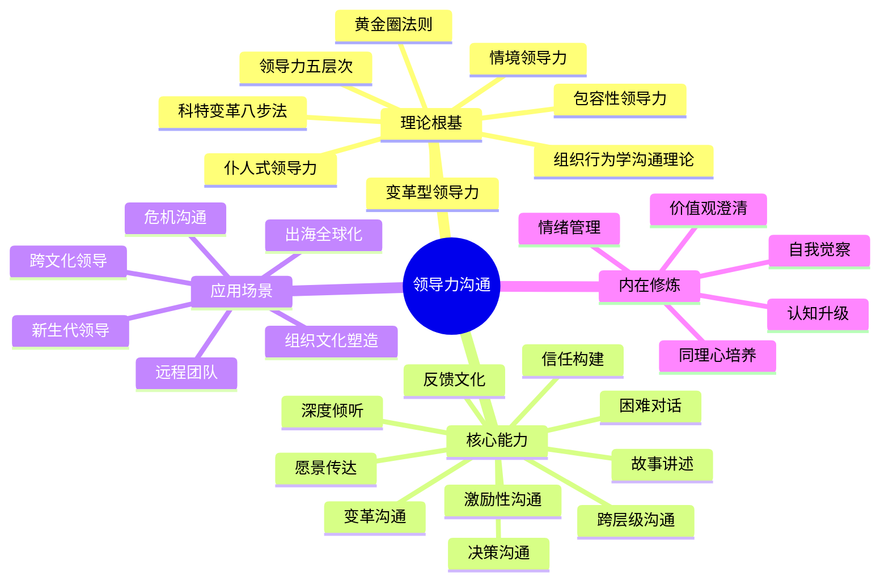
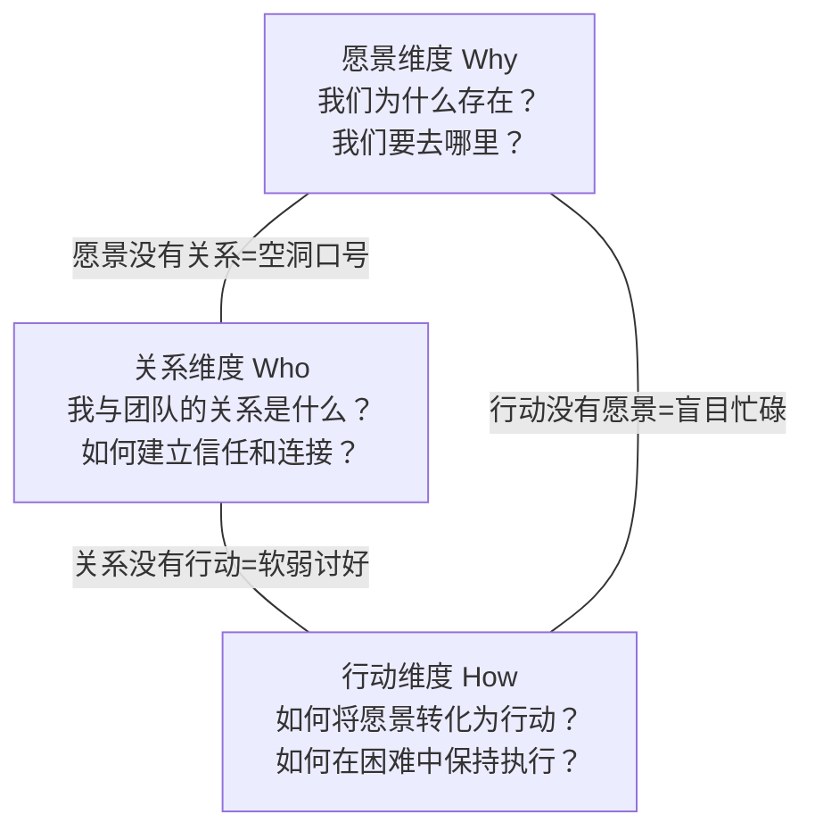
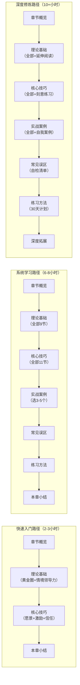

# 第二十四章 沟通与领导力

## 一句话定义本章

> **领导力的本质就是影响力，而影响力的核心是沟通。**

这不是一句鸡汤。管理学大师彼得·德鲁克（Peter Drucker）说过："管理者的工作中，60%以上是沟通。"而到了领导力层面，这个比例趋近于100%——你做的每一件事，从战略规划到团队激励，从危机处理到文化塑造，本质上都是在通过沟通施加影响。

本章要解决的核心问题只有一个：**一个领导者如何通过沟通，把一群人从A点带到B点？**

这个问题看似简单，展开后会涉及愿景设计、情感共鸣、信任构建、变革管理、冲突处理、文化建设等十余个子领域。我们将逐一拆解，给你一个完整的领导力沟通知识体系。

---

## 为什么领导力沟通值得单独成章？

很多人觉得"领导力沟通"就是"当了领导之后怎么说话"。这是一个严重的误解。领导力沟通不是职位的附属品，而是一种可以且必须提前修炼的能力。事实上，很多尚未担任管理职位的人，已经在通过非职权影响力行使领导力了——技术专家说服团队采用新架构、产品经理推动跨部门协作、甚至一个实习生用专业判断改变了项目方向，这些都涉及领导力沟通。

以下数据说明了为什么这个主题至关重要：

| 研究/来源 | 核心发现 |
|-----------|----------|
| 哈佛商学院调研 | 被解雇的CEO中，80%是因为"人际技能不足"而非业绩问题 |
| DDI全球领导力预测报告 | 高效领导者在"沟通"维度的得分是普通领导者的2.3倍 |
| 盖洛普Q12员工敬业度调查 | "我的领导让我清楚了解组织方向"是敬业度的首要预测因子 |
| 麦肯锡组织健康度研究 | 沟通能力强的领导团队所辖组织，其财务表现高出同业2.5倍 |
| Stanford Graduate School of Business | MBA毕业生认为"沟通能力"是职业发展中最重要的技能，超过技术专长 |

这些数据指向同一个结论：**领导力的差异，本质上是沟通能力的差异。**

---

## 领导力沟通的完整知识体系

在进入具体内容之前，我们先建立一个全景视图，让你知道这个领域的全貌是什么样的。

这个知识体系包含四个层面，从外到内依次是：

**1. 理论根基——你知道"为什么"**

理论不是用来装点门面的。一个好的理论能帮你在面对复杂情境时快速定位问题本质，而不是凭直觉瞎猜。比如，当你发现团队在变革中抗拒不前，如果你了解科特的变革八步法，你就知道问题可能出在"没有制造足够的紧迫感"或"缺少短期胜利"，而不是简单归因为"员工不配合"。

**2. 核心能力——你掌握"怎么做"**

这是领导力沟通的"兵器库"。每一种能力对应一类高频场景：愿景传达解决方向问题，激励性沟通解决动力问题，困难对话处理解决冲突问题……这些能力不是孤立的，而是组合使用的。一个高绩效领导者在一次团队会议中，可能同时运用愿景传达、故事讲述、深度倾听和反馈技巧。

**3. 应用场景——你能"用出来"**

理论和能力最终要落地到具体场景。危机时刻的沟通、跨文化团队的沟通、远程环境下的沟通——每种场景都有其独特的挑战和应对策略。这一层的价值在于：当你面对具体情境时，你知道该调用哪些能力、遵循什么原则。

**4. 内在修炼——你成为"那样的人"**

最深层也是最容易被忽略的一层。领导力沟通的终极瓶颈不是技巧，而是你这个人本身。你的自我觉察能力、情绪管理能力、价值观清晰度，决定了你所有沟通行为的"天花板"。一个内心混乱的人，技巧再好也只是"套路"。

---

## 核心框架：领导力沟通的三维模型

理解了知识体系的全景后，我们需要一个简明的核心框架来统领全章。这个框架就是"领导力沟通三维模型"：

三个维度的含义：

**愿景维度（Why）—— 给人方向感**

愿景解决的是"去哪里"的问题。人不会全力奔向一个看不清的目标。领导者的首要沟通任务，就是把模糊的战略意图翻译成每个人都能理解、认同、甚至为之热血沸腾的清晰图景。

但愿景传达不是单次演讲，而是一个持续的、多渠道的、反复强化的过程。研究显示，一个组织的战略方向，领导者平均需要重复传达7次以上，团队成员才能真正内化。

**关系维度（Who）—— 给人安全感**

人不会追随一个自己不信任的人。关系维度解决的是"你是谁"和"我们之间的关系是什么"的问题。信任不是一夜建立的，它来自每一次沟通行为的累积——你是否言行一致？你是否真的在倾听？你是否在困难时刻保护团队？

**行动维度（How）—— 给人确定感**

再好的愿景和关系，如果没有落地为具体行动，也只是空中楼阁。行动维度解决的是"具体怎么做"的问题。这包括：决策如何传达？任务如何分配？进度如何追踪？困难时刻如何保持团队的执行力？

三个维度的关系不是线性的，而是螺旋上升的。每一次行动的结果会反馈到关系（信任增强或削弱）和愿景（方向修正或强化）中，形成一个持续迭代的循环。

---

## 本章详细路线图

本章按照"理论→技巧→实战→纠偏→练习"的递进逻辑组织，共包含六大部分。以下是每个部分的详细介绍，帮助你在开始学习前建立心理预期。

### 第一部分：理论基础

**核心问题：领导力沟通的底层逻辑是什么？**

任何技能都有其理论根基。理论的价值在于：它帮你建立"心智模型"，让你在面对未知情境时，有分析问题的框架，而不是只能凭感觉行事。

本部分包含九个小节：

| 序号 | 主题 | 核心内容 | 为什么重要 |
|------|------|----------|------------|
| 1 | 黄金圈法则 | Simon Sinek的Why-How-What模型，从内向外的沟通逻辑 | 解释了为什么有些领导者的讲话能打动人心，而有些只是信息堆砌 |
| 2 | 变革型领导力 | Burns和Bass的理论，四个I维度（理想化影响、鼓舞性激励、智力激发、个性化关怀） | 当代领导力研究的主流范式，理解它就理解了高效领导者的核心行为模式 |
| 3 | 情境领导力 | Hersey-Blanchard模型，根据下属成熟度调整领导风格 | 没有万能的沟通风格，最佳方式取决于情境。这是"因材施教"的领导力版本 |
| 4 | 科特变革八步法 | John Kotter的变革管理框架中的沟通策略 | 70%的变革失败源于沟通不足或沟通失误，这个框架告诉你在变革每个阶段该说什么 |
| 5 | 仆人式领导力 | Robert Greenleaf的理论，领导者的首要角色是服务者 | 颠覆了"领导=权力"的传统认知，揭示了一种更具可持续性的领导沟通模式 |
| 6 | 包容性领导力 | 多元化背景下的领导沟通策略 | 全球化和多元文化背景下，包容性不是"nice to have"而是"must have" |
| 7 | 领导力五层次 | John Maxwell的五层领导力模型（职位→许可→生产→育人→巅峰） | 你在哪个层级，决定了你的沟通策略应该是什么。低层级的命令式沟通在高层级完全失效 |
| 8 | 组织行为学沟通理论 | 信息不对称、沟通网络、组织符号学等 | 理解组织中沟通的结构性障碍，跳出"个人技巧"层面看问题 |
| 9 | 理论小结 | 整合所有理论，建立统一认知框架 | 将碎片化的理论知识串联为一个可操作的心智模型 |

学完这部分，你应该能够在任何领导力沟通场景中，快速识别"这涉及哪个理论"，并据此选择应对策略。

### 第二部分：核心技巧

**核心问题：如何在不同情境中有效沟通？**

理论是"知道"，技巧是"做到"。这一部分把理论转化为可操作的沟通行为。

本部分包含十一个小节：

| 序号 | 技巧 | 核心能力 | 典型应用场景 |
|------|------|----------|--------------|
| 1 | 愿景传达 | 把抽象战略转化为生动具体的语言 | 战略规划会、全员大会、一对一目标对齐 |
| 2 | 激励性沟通 | 激发内在动力而非外部压力 | 季度动员、项目启动、低谷期提振士气 |
| 3 | 变革沟通 | 引导团队穿越变革的恐惧和阻力 | 组织重组、业务转型、技术升级 |
| 4 | 困难对话处理 | 处理绩效问题、冲突调解、坏消息传达 | 绩效面谈、团队冲突、裁员沟通 |
| 5 | 信任构建 | 通过一致的沟通行为建立信任 | 新任领导者融入、团队重建、跨部门合作 |
| 6 | 故事讲述 | 用故事传递价值观和理念 | 文化建设、客户提案、团队分享 |
| 7 | 深度倾听 | 用倾听展现领导力 | 一对一沟通、团队讨论、冲突调解 |
| 8 | 反馈文化 | 建立持续的双向反馈机制 | 绩效管理、团队成长、组织学习 |
| 9 | 跨层级沟通 | 与上级、平级、下级的不同沟通策略 | 向上汇报、平行协作、向下传达 |
| 10 | 决策沟通 | 如何传达决策并获得支持 | 战略决策、资源分配、方向调整 |
| 11 | 技巧小结 | 整合所有技巧，建立实操清单 | 快速参考和日常实践 |

### 第三部分：实战案例

**核心问题：理论和技巧如何在真实场景中应用？**

十个真实案例，覆盖领导力沟通的高频场景。每个案例不是简单讲故事，而是按照"背景→挑战→策略→执行→结果→复盘"的结构展开，让你能够从中提取可迁移的模式。

案例覆盖范围：

- **CEO级变革沟通**：微软"移动为先、云为先"转型——Satya Nadella如何用沟通重塑巨头
- **创业公司愿景传达**：字节跳动的"始终创业"——高速增长中如何保持方向一致
- **危机领导力沟通**：强生泰诺事件——危机沟通的黄金标准
- **跨文化领导**：联想全球化之路——东西方团队如何融合
- **远程团队领导力**：GitLab全远程文化——没有办公室如何建立连接
- **组织文化塑造**：海底捞的服务文化——价值观如何通过沟通落地
- **领导力失败案例**：某科技公司的沟通崩溃——反面教材的价值
- **新生代领导力**：新消费品牌的崛起——90后领导者的沟通方式
- **危机中的应变**：餐饮企业的疫情应对——不确定性中的沟通策略
- **出海全球化**：中国企业出海挑战——跨文化领导力沟通的实战

### 第四部分：常见误区

**核心问题：哪些沟通行为会削弱领导力？**

知道什么不该做，有时比知道该做什么更重要。本部分系统梳理领导力沟通中最常见的十二个误区，每个误区都包含：错误表现、为什么错、正确做法、实际案例。

### 第五部分：练习方法

**核心问题：如何系统性地提升自己的能力？**

"知道"和"做到"之间隔着一万次练习。本部分不是泛泛而谈"多练习"，而是给出具体的、可执行的、可追踪的练习方案，包括每日微练习、每周复盘模板、30天行动计划。

### 第六部分：本章小结 + 深度拓展

核心原则提炼、行动清单、以及为高级读者准备的延伸阅读和深度思考题。

---

## 学习路径建议

根据你的现有水平和学习目标，我们建议以下三种学习路径：

- **快速入门**：适合时间紧张、需要快速掌握核心要点的读者。聚焦最重要的理论和技巧，跳过案例和进阶内容。
- **系统学习**：适合希望完整掌握领导力沟通知识体系的读者。覆盖所有理论和技巧，精选案例，完成基础练习。
- **深度修炼**：适合希望将领导力沟通作为核心竞争力打造的读者。全量学习，深度实践，完成30天行动计划。

---

## 学习目标

完成本章学习后，你应该能够：

1. **理解**领导力沟通的核心理论框架——包括黄金圈法则、变革型领导力、情境领导力、仆人式领导力等关键模型，并能在具体场景中识别和运用这些理论
2. **掌握**十项核心沟通技巧——愿景传达、激励性沟通、变革沟通、困难对话处理、信任构建、故事讲述、深度倾听、反馈文化建设、跨层级沟通、决策沟通
3. **分析**真实场景中的领导力沟通策略——从成功案例中提取可复制的模式，从失败案例中识别需要规避的风险
4. **识别并纠正**领导力沟通中的常见误区——建立自我觉察能力，定期检视自己的沟通行为是否在削弱领导力
5. **应用**系统性的练习方法——将知识转化为习惯，将技巧内化为本能

---

## 前置知识检查

在正式开始之前，确认你对以下概念有基本了解。如果某个概念比较陌生，建议先回顾对应的章节：

| 前置知识 | 相关章节 | 自检标准 |
|----------|----------|----------|
| 倾听的层次 | 第五章《深度倾听》 | 能区分"听而不闻"和"共情倾听"的区别 |
| 非暴力沟通 | 第十二章《非暴力沟通》 | 了解"观察-感受-需要-请求"四步法 |
| 说服与影响力 | 第十五章《说服心理学》 | 知道Cialdini的六大影响力原则 |
| 冲突处理 | 第十八章《冲突沟通》 | 了解Thomas-Kilmann冲突模型的五种风格 |
| 跨文化沟通 | 第二十一章《跨文化沟通》 | 了解高低语境文化的差异 |

缺少这些基础不影响阅读，但如果全部陌生，建议将本章的学习节奏放慢，在遇到相关知识点时回顾对应章节。

---

## 开始之前：一个反思练习

在进入正式内容之前，请花5分钟完成这个小练习。它会帮你建立一个"参照点"，在学完本章后用来衡量自己的认知变化。

### 第一步：回忆

> **在你的职业生涯中，哪位领导者对你产生了最深远的影响？他/她是如何通过沟通影响你的？**

闭上眼睛，想30秒。不要急着回答，让记忆自然浮现。

### 第二步：记录

用三句话写下你的答案：

1. 这位领导者是谁？（可以用代号）
2. 他/她最让你印象深刻的一次沟通是什么？
3. 那次沟通对你产生了什么影响？

### 第三步：拆解

试着分析一下，那次沟通之所以有效，是因为它在哪个维度上做得特别好？

- [ ] 愿景维度——他/她让你看到了一个激动人心的方向
- [ ] 关系维度——他/她让你感受到被信任、被理解、被尊重
- [ ] 行动维度——他/她给了你清晰的指引，让你知道具体该怎么做
- [ ] 以上都不是，是别的原因（请写下来）

记住你的分析。在学完本章后，你会对同一个案例有更深刻、更系统的理解。**这种"前后对比"式的学习，是检验学习效果最直接的方式。**

---

*准备好了？让我们开始第一章——领导力沟通的理论基础。*
