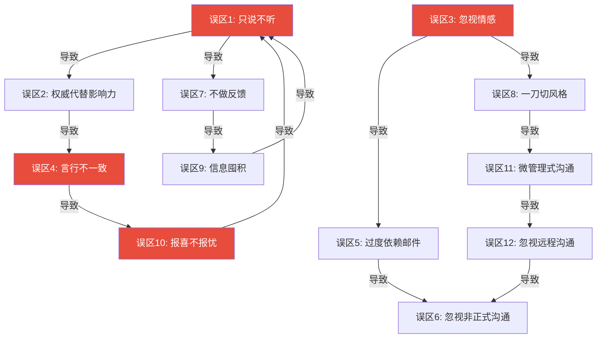
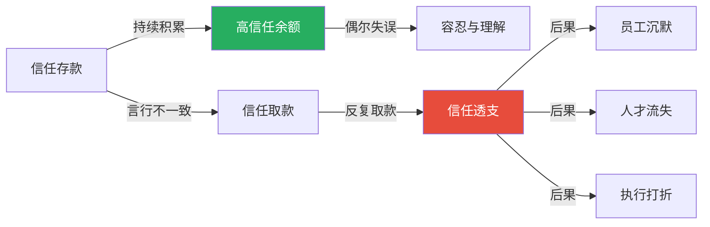
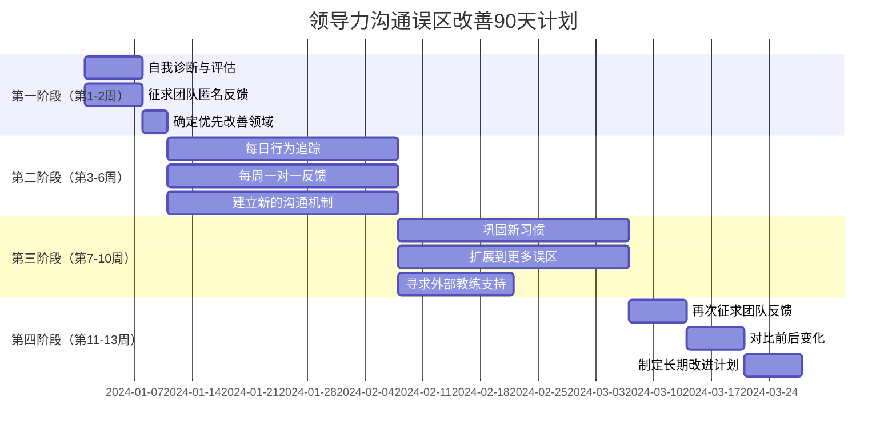

# 常见误区：领导力沟通中的典型错误

> "领导者的最大盲点，往往不是不知道该怎么做，而是不知道自己正在做错什么。"

领导力沟通中的误区有一个共同特征：**它们看起来都是"合理"的**。领导者用权威压服，是因为"效率优先"；忽视情感因素，是因为"要保持理性"；不做反馈，是因为"不想打击士气"。每一个误区背后，都有一套自洽的逻辑——而这正是它们危险的地方。

本节将系统剖析领导力沟通中最常见的十二个误区。前八个是"显性误区"——大多数领导者至少犯过其中几个；后四个是"隐性误区"——更深层、更难觉察，但破坏力同样巨大。每个误区都会从表现识别、底层机制、真实后果、纠正路径、信任修复五个层面展开，帮助你从"知道错在哪"到"知道怎么改"再到"知道怎么补救"。

***

## 误区全景图：十二个典型错误的关联网络

领导力沟通的误区并非孤立存在，它们往往相互强化、形成恶性循环。理解这些关联，是跳出误区的第一步。

如图所示，"只说不听"和"忽视情感"是两个核心误区，它们会像多米诺骨牌一样触发其他错误。而"言行不一致"和"报喜不报忧"是信任崩溃的两个关键节点——一旦信任崩塌，所有其他沟通努力都将失效。

***

## 误区危害程度矩阵

不同误区的破坏力和隐蔽性各不相同。下表按照"破坏力"和"觉察难度"两个维度对十二个误区进行分级：

| 误区 | 破坏力 | 觉察难度 | 信任损害 | 绩效影响 | 恢复周期 |
|------|--------|----------|----------|----------|----------|
| 只说不听 | ★★★★ | ★★ | 高 | 中高 | 2-3个月 |
| 权威代替影响力 | ★★★★ | ★★ | 高 | 高 | 3-6个月 |
| 忽视情感因素 | ★★★ | ★★★ | 中高 | 中 | 1-2个月 |
| 言行不一致 | ★★★★★ | ★★★ | 极高 | 高 | 6-12个月 |
| 过度依赖邮件 | ★★ | ★ | 中 | 中 | 2-4周 |
| 忽视非正式沟通 | ★★★ | ★★★★ | 中 | 中高 | 1-3个月 |
| 不做反馈 | ★★★★ | ★★ | 中高 | 高 | 2-4个月 |
| 一刀切风格 | ★★★ | ★★★★ | 中 | 中高 | 2-3个月 |
| 信息囤积 | ★★★★ | ★★★ | 高 | 高 | 3-6个月 |
| 报喜不报忧 | ★★★★★ | ★★★★ | 极高 | 极高 | 6-12个月 |
| 微管理式沟通 | ★★★★ | ★★ | 高 | 高 | 3-6个月 |
| 忽视远程团队 | ★★★ | ★★★ | 中高 | 中高 | 2-4个月 |

> **关键洞察**：破坏力最大的误区（言行不一致、报喜不报忧）恰恰是觉察难度最高的。这意味着领导者需要外部反馈机制来发现自己的盲点——仅靠自我反思远远不够。

***

## 第一部分：显性误区（误区1-8）

这八个误区是领导力沟通中最常见、最容易被识别的问题。大多数领导者至少犯过其中三到四个。

***

### 误区一：只说不听——信息泡沫的制造者

#### 表现特征

- 会议中80%的时间在说话，只有20%在听，甚至更少
- 员工还没说完就打断，用自己的经验替代对方的表达
- 听的时候在想自己接下来要说什么，表面在听实际在组织语言
- 下属汇报时频繁看手机或电脑，用肢体语言传递"不重要"的信号
- 从不主动征求反馈或意见，认为"有意见你们会说的"
- 对沉默的下属从不追问，将沉默等同于同意

#### 底层机制

这个误区的根源在于**权力对认知的扭曲**。加州大学伯克利分校的心理学研究发现，当一个人获得权力后，他的"观点采择"（perspective-taking）能力会显著下降——他更难站在别人的角度思考问题。这不是性格缺陷，而是权力的神经化学效应。

更具体地说，权力会降低大脑中"镜像神经元"的活跃度。镜像神经元是我们理解他人感受的神经基础，当它的活跃度降低时，领导者就会不自觉地减少对他人情感和观点的关注。

与此同时，领导者往往因为职位的原因获得了过多的发言权，但同时也失去了获取真实信息的能力。当领导者说得多、听得少时，团队成员会逐渐停止分享真实的想法和问题——心理学中称之为"沉默效应"（silence spiral）。结果是，领导者活在一个被过滤过的信息泡沫中，做出的决策越来越脱离现实。

#### 神经科学视角

研究表明，当人们感到自己被倾听时，大脑会释放催产素，增强信任感和合作意愿。催产素不仅促进社会联结，还降低杏仁核（大脑的威胁检测中心）的活跃度，使人更愿意承担风险和分享想法。反之，当人们感到被忽视时，大脑的威胁反应系统会被激活，导致防御和退缩。这意味着"不听"不仅是态度问题，更是在物理层面关闭了团队成员的坦诚通道。

#### 真实后果

**后果一：决策质量下降。** 诺基亚前高管在回忆录中坦承，公司衰落的关键原因之一是高层"听不到坏消息"。当领导者不听时，中层管理者会自动过滤掉负面信息，最终导致CEO在2007年仍然认为iPhone不会对诺基亚构成威胁。

**后果二：人才流失。** 盖洛普的调查显示，"感到自己的意见不被重视"是员工离职的前三大原因之一，仅次于薪酬和职业发展。一个不听的领导者，实际上是在用员工的耐心做赌注。

**后果三：创新枯竭。** 谷歌的"亚里士多德项目"研究发现，高效团队的第一要素是"心理安全感"——即成员敢于提出不同意见而不担心被惩罚。而"只说不听"的领导者恰恰是心理安全感的最大杀手。

#### 纠正路径

**第一步：建立倾听配额。** 在会议中设定硬性目标——自己说话的时间不超过40%。可以用手机计时器做简单记录，连续追踪两周。

**第二步：实践"最后发言"原则。** 管理学家吉姆·柯林斯在《从优秀到卓越》中发现，最高级别的领导者（第五级领导者）在讨论中总是最后发言。他们先听所有人的意见，吸收不同的观点，最后再表达自己的看法。这样做的好处是避免"锚定效应"——当领导者先表态时，下属倾向于附和而非独立思考。

**第三步：练习"三层倾听"。**
- **第一层：内容倾听**——听对方在说什么事实和观点
- **第二层：情感倾听**——听对方的情绪状态和未说出的需求
- **第三层：意图倾听**——听对方真正想要达成什么

大多数领导者只做到第一层。真正的倾听需要同时捕捉三个层面的信息。

**第四步：建立反馈回路。** 每月一次匿名调查，问团队成员："你在会议中感到被倾听的程度如何？"用1-10分量化，追踪趋势。

**第五步：创造"安全发声"机制。** 设立匿名意见箱、定期的一对一谈话、"红队挑战"（指定专人提出反对意见），从制度层面保证不同声音被听到。

#### 信任修复

如果你已经是一个"只说不听"的领导者，修复信任需要时间和一致性：
1. **公开承认**：在团队会议上坦诚"我意识到我过去听得太少了"
2. **具体承诺**：提出可衡量的改变（如"从今天起，每次会议我会先听每个人的意见再发言"）
3. **持续追踪**：三个月内定期征求反馈，展示你在改变
4. **接受初期的怀疑**：团队不会立刻相信你的改变，这是正常的——信任需要行动的积累

***

### 误区二：用权威代替影响力——服从的假象

#### 表现特征

- "因为我说的"作为决策理由，将职位等同于正确性
- 不解释原因，只要求执行，认为"解释太多显得不果断"
- 不允许质疑或不同意见，将不同声音视为挑战权威
- 用职位压人而非用道理说服，在争论中搬出"我是领导"
- 开会不是讨论，而是宣布，决策前不做任何征询
- 对"不听话"的人施以隐性惩罚（冷落、边缘化、不给机会）

#### 底层机制

权威依赖的背后，往往隐藏着两种心理动因：

**第一种是能力焦虑。** 一些领导者内心并不确信自己的判断是正确的，因此害怕被质疑——因为一旦被质疑，就需要给出理由，而他们不确定自己能给出好的理由。权威成为了一种"认知保护伞"。

**第二种是效率幻觉。** 用权威压服确实"快"——不需要解释、不需要讨论、不需要说服。但这种"快"是以牺牲理解和承诺为代价的。表面上决策执行了，实际上执行的质量和投入度大打折扣。

社会心理学家弗伦奇和雷文（French & Raven）提出的"权力基础理论"指出，领导者的权力来源有两种：**职位权力**（法定权、奖赏权、强制权）和**个人权力**（专家权、参照权）。过度依赖职位权力会削弱个人权力，形成恶性循环——越用权威，越没有影响力；越没有影响力，越需要依赖权威。

#### 权威 vs. 影响力：全面对比

| 维度 | 依赖权威 | 依靠影响力 |
|------|----------|------------|
| 执行动机 | 恐惧和服从 | 认同和承诺 |
| 团队行为 | 等待指令，不做决策 | 主动思考，承担责任 |
| 创新能力 | 低（不敢提出新想法） | 高（安全空间促进创新） |
| 人才保留 | 差（优秀人才不愿被压制） | 好（人才感到被尊重和赋能） |
| 可扩展性 | 受限于领导者个人 | 团队可以自我运转 |
| 决策质量 | 取决于领导者一人的认知 | 整合了集体智慧 |
| 危机应对 | 脆弱（领导者不在就瘫痪） | 韧性（团队有自主决策能力） |
| 组织文化 | 恐惧导向、政治化 | 信任导向、透明化 |

#### 真实后果

**案例：惠普的卡莉·费奥瑞纳时代。** 费奥瑞纳在担任惠普CEO期间，以强势的领导风格著称。她推行与康柏的合并时，面对董事会和创始人家族的反对，选择了用权力硬推而非充分沟通说服。虽然合并最终完成，但她在过程中积累的对立情绪最终导致了她被解职。更深远的影响是，惠普在她任期内失去了大量核心人才，组织文化从"工程师文化"变成了"恐惧文化"。

#### 纠正路径

**第一步：解释"为什么"。** 每个重要决定都附带原因。不是"我们要裁员"，而是"由于市场环境变化，我们的收入下降了30%，为了确保公司的长期生存，我们需要调整组织结构"。原因越充分，接受度越高。

**第二步：建立"决策透明度"制度。** 重大决策公开决策过程：考虑了哪些选项？各有什么利弊？为什么选了这个？这不是示弱，而是展示专业性和严谨性。

**第三步：允许并鼓励挑战。** 创造"安全挑战"的空间。亚马逊的杰夫·贝佐斯推行"不同意但执行"（disagree and commit）的文化——团队成员可以表达不同意见，但一旦做出决定，所有人全力执行。这既保留了讨论空间，又保证了执行效率。

**第四步：用"提问"代替"命令"。** 不是"你去做X"，而是"面对这个问题，你觉得最好的解决方案是什么？"当对方提出方案后，即使需要调整，也比直接命令更能获得承诺。

**第五步：展示专业能力。** 通过能力而非权力赢得尊重。当团队看到你在专业领域的深度时，他们自然会信任你的判断——这不是因为你的职位，而是因为你的能力。

#### 信任修复

1. **在下一次重大决策中改变行为**——公开决策过程，征求团队意见
2. **主动请求监督**——告诉团队"如果我又犯了用权威压人的毛病，请直接提醒我"
3. **为过去的行为道歉**——"过去有些决定我没有充分听取大家的意见，这是我的问题"
4. **给予下属决策权**——在一定范围内授权，展示你真的信任团队

***

### 误区三：忽视情感因素——理性至上的陷阱

#### 表现特征

- 只关注数据和逻辑，忽视情绪，认为"情感是工作的干扰"
- 在困难时刻只谈业务，不谈感受，用"专业"来回避情感
- 认为"情绪化"是负面的，应该被压制，特别是对男性下属
- 用理性的语言回应情感性的问题（如用KPI数据回应员工的倦怠感）
- 在裁员、重组等重大变化时不做情感关怀，只关注流程和效率
- 从不分享自己的情感，认为领导者应该"没有感情"

#### 底层机制

神经科学家安东尼奥·达马西奥（Antonio Damasio）在其著作《笛卡尔的错误》中记录了一个关键发现：一位因脑损伤而失去情感能力的患者，虽然理性分析能力完好，却完全无法做出日常决策——连"午饭吃什么"都无法决定。这个案例颠覆了"理性与情感对立"的传统观念，证明了**情感不是理性的对立面，而是决策的必要组成部分**。

从进化心理学的角度看，情感是人类数百万年进化过程中形成的信息处理系统。恐惧帮助我们识别危险，愤怒帮助我们维护边界，悲伤帮助我们处理失去，兴奋帮助我们抓住机会。当领导者忽视情感因素时，他们实际上是在关闭团队最重要的信息处理通道。

哈佛商学院教授约翰·科特（John Kotter）的研究指出，组织变革失败的首要原因不是战略错误，而是"未能建立足够强烈的紧迫感"——而紧迫感本质上是一个情感状态。只靠数据分析无法驱动变革，必须触动人心。

#### 典型场景深度分析

**场景一：功过不分**

团队加班完成了一个重要项目，领导者在总结会上说："这次项目虽然完成了，但还有很多可以改进的地方，下次要注意……"——团队需要的是认可，不是批评。

**深层问题**：这种模式会导致"付出无回报"的心理。当员工发现无论多努力都只会听到批评时，他们会停止额外付出。心理学中称之为"习得性无助"（learned helplessness）。

**正确做法**："首先，我想感谢大家这段时间的付出。我看到小王连续三天加班到凌晨调试系统，小李主动承担了额外的文档整理工作。这次项目能按时上线，每个人都很棒。当然，过程中我们也发现了一些可以优化的地方，我会在下周的复盘会上和大家一起讨论。"——先认可，再改进，而且认可要具体到人。

**场景二：危机中的数据冷漠**

公司宣布裁员，领导者在全员会议上用PPT展示财务数据——员工需要的是同理心和希望，不是财务分析。

**深层问题**：当人们处于恐惧和焦虑中时，大脑的杏仁核被激活，理性思维能力大幅下降。此时展示的数据不仅无法说服人，反而会被解读为"冷酷无情"。

**正确做法**：先处理情绪，再处理信息。"我知道今天的会议让大家很不安。我想先说，做出这个决定对我来说非常艰难。接下来我会坦诚地告诉大家发生了什么、为什么会这样、以及我们会如何一起度过这个困难时期。在我说完之后，我希望大家有任何问题或担忧都提出来，我会尽我所能回答。"

**场景三：创意被否决**

一位员工在会议上提出了一个被否决的想法，领导者直接说"这个不可行"——员工需要的是被尊重和被听见。

**深层问题**：公开否定一个人的想法，打击的不仅是这个想法，而是这个人的自信和未来的表达意愿。被公开否定一次，可能需要十次正面鼓励才能修复。

**正确做法**："这个想法很有意思，你愿意多说说你的思考过程吗？我有几个疑虑想和你讨论一下……"——先肯定创意行为本身，再讨论可行性。

#### 纠正路径

**第一步：建立"情感词汇"。** 很多领导者不是不想关注情感，而是缺乏表达情感的词汇。练习使用以下句式：
- "我理解这对你来说很困难"
- "我很感激大家在这个项目中的付出"
- "我知道这个消息让人不安"
- "我能感受到你的沮丧/担忧/兴奋"

**第二步：练习"情感雷达"。** 在每次会议或对话后，花30秒回顾：对方的情绪状态是什么？我有没有回应这个情绪？可以通过观察面部表情、肢体语言、语调变化来训练这个能力。

**第三步：在重大变化前做"情感预演"。** 预估人们听到消息后的情感反应（恐惧、愤怒、悲伤、困惑），并为每种反应准备回应。不要等到情感爆发才临时应对。

**第四步：适度展现自己的情感。** 领导者分享自己的情感（不是情绪失控）是一种强大的连接方式。"做出这个决定我也很难受"、"看到团队这么努力我真的很骄傲"——这样的话能建立深层次的共鸣。

**第五步：区分"共情"和"解决问题"。** 很多领导者的本能反应是"给建议"。但在很多时候，人们需要的是被理解，而不是被指导。练习说"我理解"，而不是"你应该"。

***

### 误区四：言行不一致——信任的头号杀手

#### 表现特征

- 口头说"创新很重要"，但惩罚失败，奖励保守
- 说"工作生活平衡"，但自己凌晨发邮件、周末安排工作
- 声称"开放透明"，但信息层层过滤，关键信息不公开
- 要求团队协作，但自己的奖励体系鼓励内部竞争
- 说"我信任你"，但事事过问、审批每一个细节
- 强调"客户第一"，但决策时优先考虑成本和便利

#### 底层机制

心理学中有一个核心概念叫**"归因理论"**（Attribution Theory）——当言行不一致时，人们会相信行为而非言语。这不是因为人们不宽容，而是因为行为比言语更难伪装，因此被视为更可靠的信号。

哈佛商学院的研究发现，领导者的行为对组织文化的塑造力是言语的**10倍**。一位领导者可以每天说"我们鼓励创新"，但如果他批评了一次失败的尝试，整个团队都会记住的是那次批评，而不是那些鼓励的话。

这背后的心理机制是**"负面偏差"**（Negativity Bias）——人类大脑对负面信息的敏感度是正面信息的3-5倍。一个负面事件需要5个正面事件才能平衡。这意味着，领导者的一次言行不一致，需要五次言行一致才能修复。

#### 信任账户模型

把信任想象成一个银行账户（这个比喻来自史蒂芬·柯维的《高效能人士的七个习惯》）：

- **存款行为**：兑现承诺、承认错误、保持透明、展现一致性、给予信任
- **取款行为**：食言、掩盖问题、言行不一、事后追责、微观管理

关键规则：
1. 每次言行一致都是小额存款
2. 每次言行不一致都是大额取款
3. 账户余额越高，团队对偶尔失误的容忍度越大
4. 当账户透支时，信任崩溃——而且重建信任比建立信任困难**5-10倍**

#### 真实案例

**正面案例：星巴克的霍华德·舒尔茨。** 舒尔茨在2008年回归星巴克时，做了一个令人震惊的决定：关闭全美7100家门店3.5小时，对13.5万名员工进行咖啡培训。华尔街批评这是"浪费"，但舒尔茨用行动证明了"我们真的把咖啡品质放在第一位"——这不是一句口号，而是用真金白银做了背书。这一行动极大地恢复了员工对品牌的信心。

**反面案例：某互联网公司的"扁平化"承诺。** 这家公司宣称实行扁平化管理，取消了所有职级称谓。但实际上，薪资差异巨大，决策权仍然集中在少数人手中，"扁平化"只是改了称呼而没有改变权力结构。员工很快看穿了这一点，内部信任度不升反降。一位离职员工在脉脉上写道："公司最大的问题不是有没有职级，而是说一套做一套。"

#### 纠正路径

**第一步：做一次"言行审计"。** 列出你反复强调的3-5个核心价值观，然后诚实审视：过去一个月，你的哪些行为与这些价值观一致？哪些不一致？请信任的同事帮你做这个审计——你的盲点往往在别人眼中显而易见。

**第二步：设定"行为锚点"。** 为每个价值观定义具体的行为标准。例如：
- 价值观："创新" → 行为锚点："每月至少公开讨论一次失败的尝试，领导者率先分享"
- 价值观："透明" → 行为锚点："重大决策在48小时内全员通报，包含决策过程和理由"
- 价值观："信任" → 行为锚点："团队成员可以自行决定10万元以下的支出，无需审批"

**第三步：建立"一致性提醒"机制。** 在做重要决策或发出重要信息前，自问："这与我声称的价值观一致吗？如果不一致，我该怎么解释？"

**第四步：做不到的就不要说。** 与其承诺"工作生活平衡"然后凌晨发邮件，不如诚实地说"现阶段项目紧急，可能需要大家多付出一些，但我会确保在项目结束后给大家充分的休息时间"。诚实的不完美比虚假的完美更值得信赖。

**第五步：系统匹配。** 确保组织的制度、流程和激励与宣称的价值观一致。如果说"团队协作"，就不要用纯粹的个人绩效排名来决定奖金。文化不是你说什么，而是你奖励什么。

***

### 误区五：过度依赖邮件代替面对面沟通——信息丰富度的缺失

#### 表现特征

- 重要的决策通过邮件宣布，认为"有书面记录就好"
- 敏感的反馈通过文字传递，避免面对面的不舒服
- 团队冲突通过邮件"对峙"，用抄送领导来施压
- 变革消息只发一封邮件，不做任何面对面解释
- 从不与远程团队进行视频会议，只靠文字沟通
- 习惯性地用邮件回复复杂问题，而不是打一个电话

#### 底层机制

达夫特和伦格尔（Daft & Lengel）的"信息丰富度理论"（Media Richness Theory）指出，不同的沟通渠道具有不同的信息传递能力。面对面沟通丰富度最高，因为它同时传递语言内容（7%）、语调（38%）和肢体语言（55%）——这就是著名的梅拉比安法则（Mehrabian's Rule）。而邮件只能传递语言内容，丢失了93%的信息。

更重要的是，文字沟通具有**"消极偏向效应"**（Negativity Bias in Text）。加州大学伯克利分校的研究发现，在没有语调和表情线索的情况下，接收者倾向于将中性文字解读为消极的。一封简单的"请把报告发给我"，在面对面说时是正常的请求，在邮件中却可能被读出"你为什么还没发给我"的责备语气。

#### 信息渠道选择矩阵

| 信息类型 | 推荐渠道 | 原因 |
|----------|----------|------|
| 战略愿景宣布 | 全员大会+邮件确认 | 需要情感共鸣+书面记录 |
| 敏感反馈 | 面对面一对一 | 需要观察反应、即时互动 |
| 裁员/重组通知 | 面对面+全员信 | 需要同理心+信息完整性 |
| 团队冲突处理 | 面对面调解 | 需要捕捉非语言信号 |
| 日常工作协调 | 即时消息/邮件 | 信息简单、不需要情感传递 |
| 绩效讨论 | 面对面一对一 | 需要双向对话、情感支持 |
| 会议记录/总结 | 邮件 | 需要书面记录、可追溯 |
| 跨时区非紧急事务 | 邮件/异步工具 | 时间差限制 |
| 庆祝/认可 | 面对面或视频 | 情感连接最大化 |
| 技术方案讨论 | 文档+会议结合 | 需要逻辑+讨论 |

#### 纠正路径

**第一步：建立"渠道决策树"。** 在发送任何重要信息前，问自己三个问题：
1. 这个信息的情感含量高吗？→ 高情感含量用面对面/视频
2. 被误解的风险大吗？→ 高误解风险用面对面/视频
3. 需要双向互动吗？→ 需要互动用面对面/视频

**第二步：遵循"先对话后文档"原则。** 对于敏感话题，先面对面沟通达成共识，再用邮件确认和记录。顺序不能反——先发邮件再谈话，邮件中的措辞可能已经造成了伤害。

**第三步：在发送前做"误解测试"。** 重读邮件，想象收件人处于最糟糕的心情来读这封邮件。如果可能产生误解，修改措辞或改为面谈。

**第四步：定期"无邮件时段"。** 每周设定半天"无邮件时间"，鼓励团队用直接对话代替邮件。很多管理者发现，15分钟的电话能解决邮件来回一周的问题。

***

### 误区六：忽视非正式沟通——真实信息的断路器

#### 表现特征

- 只在正式会议上与团队沟通，从不私下交流
- 从不与团队共进午餐或喝咖啡，认为这是"浪费时间"
- 走廊遇到下属只会点头微笑，不做任何实质性交流
- 认为非正式沟通是"不专业的"
- 不参加团队的社交活动，觉得"我是领导，应该保持距离"
- 出了办公室就完全切断与团队的联系

#### 底层机制

组织行为学研究表明，组织中**70%以上的真实信息流动发生在非正式渠道中**——茶歇间的闲聊、午餐时的吐槽、电梯里的反馈。正式会议中，人们会进行"印象管理"（Impression Management），选择性地展示信息；而在非正式场合，这种自我审查机制会大幅降低。

社会学家马克·格兰诺维特（Mark Granovetter）的"弱关系理论"（Strength of Weak Ties）揭示，很多突破性的想法和关键信息恰恰是通过"弱关系"（而非紧密的工作关系）传递的。领导者如果只维持正式的工作关系，就会失去这些"弱关系"带来的信息优势。

此外，麻省理工学院的"人类动力学实验室"（Human Dynamics Lab）研究发现，团队绩效的最佳预测指标不是成员的个人能力，而是成员之间的**非正式互动频率和模式**。领导者参与非正式沟通，不仅是在获取信息，更是在促进团队的社会联结。

#### 非正式沟通的五大价值

| 价值 | 正式会议中的表现 | 非正式场合中的表现 |
|------|------------------|-------------------|
| 获取真实信息 | 精心准备的汇报 | 即兴的真话 |
| 建立个人关系 | 角色化的互动 | 人与人的连接 |
| 发现潜在问题 | 问题被隐藏或美化 | 问题自然浮现 |
| 传播文化 | 正式宣讲 | 言传身教 |
| 建立归属感 | 制度化的关怀 | 自发的温暖 |

#### 纠正路径

**第一步：制度化"走动管理"（MBWA）。** 这是惠普在1970年代首创的管理实践。每周安排2-3次，走到团队的工作区域，不是去检查工作，而是去聊天。问"最近怎么样？"、"有什么我能帮忙的？"——关键是真诚，不是形式。

**第二步：创造"第三空间"。** 在办公区域设置非正式交流的空间——咖啡角、休闲区、站立聊天区。物理环境会影响行为模式：有咖啡角的团队，非正式交流频率提高40%。

**第三步：参加但不主导。** 参加团队的聚餐、团建活动，但不要让自己的存在改变氛围。可以先出现15-30分钟，然后离开，让团队有自己交流的空间。

**第四步：记住个人细节。** 记住团队成员的家庭情况、兴趣爱好、重要日子。"你女儿的钢琴比赛怎么样了？"这样的话能建立深层次的连接。

**第五步：对远程团队也要"非正式"。** 定期与远程成员进行一对一的"虚拟咖啡"（15分钟的随意聊天），使用视频而非文字。远程团队的非正式沟通缺失是远程管理中最大的隐性问题。

***

### 误区七：不做反馈——成长的刹车

#### 表现特征

- 一年只做一次年度评估，平时从不给反馈
- 只在出问题时才给反馈，"不批评就是表扬"
- 反馈模糊不清："做得不错"或"需要改进"，没有具体指向
- 从不给正面反馈，认为正面反馈会让人"骄傲"
- 害怕冲突，回避困难的反馈对话，用"再观察一下"拖延
- 反馈时夹杂个人情绪，不是在帮助对方成长，而是在发泄不满

#### 底层机制

人类大脑有一种天然的"进步检测机制"——当我们感到自己在进步时，大脑释放多巴胺，产生满足感和动力。哈佛商学院教授特蕾莎·阿马比尔（Teresa Amabile）在《进步定律》一书中指出，**"在有意义的工作中取得进步"是工作中最强的积极动力**。而反馈正是帮助人们感知进步的关键机制。

没有反馈，人们就像在黑暗中行走——不知道方向对不对、走了多远、还有多远。这种不确定性会导致焦虑、退缩和最终的放弃。盖洛普的调查显示，"在过去7天里，有人认可了我的工作"是敬业度最强的预测指标之一——甚至超过了薪酬和福利。

另一个关键机制是**"反馈恐惧"的形成循环**：当领导者只在出问题时才给反馈时，"反馈"在员工心中就等同于"批评"。于是，员工开始回避反馈、抗拒反馈、在收到反馈时产生防御反应。领导者看到这种反应，更加不愿意给反馈——恶性循环形成。

#### 反馈的黄金比例

研究建议，正面反馈和建设性反馈的最佳比例大约是 **5:1**——即每一条建设性反馈，应该伴随五条正面反馈。这不是说要"灌水"或虚伪地夸奖，而是说领导者应该更主动地发现和认可积极的行为。

为什么是5:1？因为人类大脑的负面偏差意味着负面信息的影响是正面信息的3-5倍。5:1的比例刚好能平衡这种偏差，创造一个总体积极的反馈环境。

#### SBI反馈模型详解

SBI（Situation-Behavior-Impact）是领导力反馈中最实用的框架之一：

| 要素 | 说明 | 示例 |
|------|------|------|
| **S - 情境** | 具体描述发生的时间和场景 | "在昨天下午的客户提案会上" |
| **B - 行为** | 客观描述观察到的行为，不加评判 | "你在展示方案时跳过了竞争对手分析部分" |
| **I - 影响** | 说明这个行为产生的具体影响 | "客户在会后专门问了我们对竞品的看法，这让他们对我们的全面性产生了疑虑" |

**完整示例**（建设性反馈）：
> "在昨天下午的客户提案会上（S），你在展示方案时跳过了竞争对手分析部分（B）。客户在会后专门问了我们对竞品的看法，这让他们对我们的全面性产生了疑虑（I）。下次我们一起检查一下演示的完整性，确保关键模块不遗漏。"

**完整示例**（正面反馈）：
> "在昨天下午的客户提案会上（S），当客户提出一个刁钻的技术问题时，你没有急于回答，而是先确认了问题的核心诉求，然后给出了一个结构化的解决方案（B）。客户当场表示这是他们见过最专业的回应，直接推动了合作意向（I）。这种专业处理方式值得团队学习。"

#### 反馈频率建议

| 反馈类型 | 推荐频率 | 渠道 |
|----------|----------|------|
| 日常认可 | 每天 | 口头/即时消息 |
| 具体行为反馈 | 每周 | 面对面一对一 |
| 绩效进展讨论 | 每月 | 面对面一对一 |
| 正式绩效评估 | 每季度 | 面对面+书面 |
| 职业发展讨论 | 每半年 | 面对面深度对话 |

#### 纠正路径

**第一步：建立"每日一反馈"习惯。** 每天至少给一位团队成员一条具体、及时的反馈。可以是正面的，也可以是建设性的。关键是具体和及时——不要等一周后再说"上周你那个做得不错"。

**第二步：停止使用"三明治法"。** 很多管理者习惯"表扬-批评-表扬"的三明治结构。但研究表明，这种模式会让员工对每次表扬都产生怀疑——"老板又夸我了，是不是又要批评什么？"。正面反馈和建设性反馈应该分开给。

**第三步：把反馈变成对话。** 不是单向地"给"反馈，而是双向地"讨论"。"我注意到……你对此有什么看法？"——让对方参与进来，反馈的效果会好得多。

**第四步：征求反馈。** 向团队征求关于自己沟通方式的反馈。"你觉得我最近的沟通方式有什么可以改进的？"——当你征求反馈时，你也在示范"反馈是安全的"。

**第五步：庆祝反馈文化。** 当团队成员主动给彼此反馈时，公开认可和鼓励。让反馈成为团队文化的一部分，而不是管理者的专利。

***

### 误区八：一刀切的沟通风格——情境盲视

#### 表现特征

- 对所有团队成员用同样的沟通方式，不考虑个体差异
- 不考虑性格、经验、文化背景对沟通偏好的影响
- 用自己偏好的沟通方式与所有人交流——"我就是这样说话的"
- 不根据情境调整沟通策略——紧急和不紧急、大事和小事用同一种方式
- 忽视不同人对信息的不同需求——有人需要细节，有人只需要结论
- 在不同文化背景的团队中使用单一的沟通范式

#### 底层机制

赫塞和布兰查德（Hersey & Blanchard）的情境领导力理论指出，没有一种"最佳"的领导风格，有效的领导力取决于追随者的**准备度**——能力（知识和技能）与意愿（信心和动机）的组合。用同一种方式与所有人沟通，必然会导致某些人感到被忽视，某些人感到被过度管控。

DISC行为模型将人的沟通偏好分为四类：

| 类型 | 特征 | 沟通偏好 | 领导者应调整的方式 |
|------|------|----------|-------------------|
| **D - 支配型** | 直接、果断、结果导向 | 简洁、要点先行、不绕弯子 | 先说结论，再给依据 |
| **I - 影响型** | 热情、社交、乐观 | 故事、互动、情感连接 | 用热情和认可建立连接 |
| **S - 稳健型** | 耐心、可靠、关系导向 | 稳定、可预测、充分准备时间 | 提前通知变化，给予支持 |
| **C - 谨慎型** | 精确、分析、质量导向 | 数据、逻辑、详细信息 | 提供完整数据和分析依据 |

当一个D型领导者用快速、直接的方式与S型员工沟通时，S型员工可能感到被压迫；当一个S型领导者用缓慢、详尽的方式与D型员工沟通时，D型员工可能感到不耐烦。

#### 纠正路径

**第一步：了解每个人的偏好。** 最简单有效的方法是直接问："你更喜欢什么样的沟通方式？是先说结论还是先说过程？是喜欢详细讨论还是要点概括？"大多数员工会感激这种关注。

**第二步：使用性格工具。** DISC、MBTI等工具可以帮助你快速了解团队成员的沟通偏好。但要记住：工具是起点，不是终点。真正的理解来自日常观察和互动。

**第三步：根据情境调整。** 同一个人在不同情境下也需要不同的沟通方式：
- 新手热情者（高意愿、低能力）→ 指导型：详细指令+频繁确认
- 学习受挫者（低意愿、低能力）→ 教练型：解释原因+持续鼓励
- 谨慎退缩者（高能力、低意愿）→ 支持型：倾听+赋能+共同决策
- 成熟执行者（高能力、高意愿）→ 授权型：充分信任+极少干预

**第四步：丰富沟通渠道。** 提供多种沟通方式，让每个人都能找到适合自己的：一对一谈话、小组讨论、书面文档、视频消息、匿名反馈等。

**第五步：持续观察和调整。** 沟通风格不是"设定好就不管了"。随着团队成员的成长和情境的变化，你需要持续观察和调整自己的方式。

***

## 第二部分：隐性误区（误区9-12）

这四个误区更深层、更难觉察，但破坏力同样巨大。它们往往在领导者不知不觉中侵蚀团队的信任和效率。

***

### 误区九：信息囤积——权力的幻觉

#### 表现特征

- 关键信息只在小圈子里流通，不向下传递
- 认为"信息就是权力"，分享信息等于放弃权力
- 需要团队执行任务但不解释背景和目的
- 不同步跨部门信息，导致团队信息不对称
- 选择性分享信息——只分享对"管理"有利的信息
- 团队成员经常说"我怎么不知道这件事？"

#### 底层机制

信息囤积的心理根源是**权力焦虑**。一些领导者潜意识中认为，如果团队成员掌握了和自己一样多的信息，自己的"不可替代性"就会降低。但事实恰恰相反——**信息共享型领导者的团队绩效远高于信息囤积型领导者**。

哈佛商学院教授琳达·希尔（Linda Hill）在研究新任领导者时发现，从"个人贡献者"到"管理者"的最大转变之一就是信息角色的改变：管理者的核心价值不是"拥有信息"，而是"促进信息流动"。

#### 真实后果

**信息囤积导致的决策延迟。** 某制造企业的部门经理习惯将客户反馈只分享给直接下属，不与其他部门同步。结果产品改进团队花了3个月解决一个已经通过售后服务解决的问题，浪费了大量资源。

**信息囤积导致的执行偏差。** 当团队只知道"做什么"但不知道"为什么做"时，他们无法在遇到意外情况时做出正确判断。就像士兵只知道"占领那个山头"但不知道"为什么要占领"——当敌人从另一个方向出现时，他们不知道该守还是该撤。

#### 纠正路径

**第一步：建立"需要知道"vs"应该知道"的区分标准。** 绝大多数工作信息属于"应该知道"——即团队成员知道后能更好地工作。只有极少数敏感信息（如未公开的并购、个人隐私）属于"需要知道"。

**第二步：推行"背景共享"文化。** 分配任务时，不仅说"做什么"，还要说"为什么做"、"这和整体目标的关系是什么"。用亚马逊的"六页备忘录"模式——在重要决策前，先用文字把背景和逻辑梳理清楚。

**第三步：定期信息同步会。** 每周或每两周一次全员信息同步，分享公司/部门的重要动态、决策进展、市场变化。让团队成员感到"我是知情的"。

**第四步：自检习惯。** 每次做重要决策或掌握重要信息后，问自己："我的团队知道这件事吗？如果不知道，他们需要知道吗？"

***

### 误区十：报喜不报忧——温水煮青蛙

#### 表现特征

- 只分享好消息，隐藏坏消息，直到问题无法掩盖
- 在向上汇报时美化数据，"包装"问题
- 对团队的困难和挑战轻描淡写，"没事的，一切都在控制中"
- 面对客户投诉或市场变化时不及时通知团队
- 用"还没确定"来拖延负面信息的传递
- 当坏消息最终暴露时，团队感到被欺骗

#### 底层机制

报喜不报忧的心理根源是**"领导者全能幻觉"**——一些领导者认为自己的职责是"保护团队"，不让团队受到负面信息的"干扰"。但这种"保护"实际上是一种**信息剥夺**，它剥夺了团队自主判断和提前准备的机会。

组织行为学家卡尔·韦克（Karl Weick）的"组织意义建构理论"指出，组织成员需要通过信息来"建构"对现实的理解。当领导者选择性地分享信息时，团队建构的"现实"就是扭曲的——他们不知道真正的挑战在哪里，也就无法做好准备。

更严重的是，当坏消息最终不可避免地暴露时（它总是会的），团队会感到双重伤害：一是坏消息本身的冲击，二是"为什么现在才告诉我们"的背叛感。后者对信任的伤害往往比坏消息本身更大。

#### 真实案例

**安然（Enron）事件。** 安然的管理层长期隐瞒公司的真实财务状况，不仅对外部投资者报喜不报忧，对公司内部员工也是如此。当真相大白时，公司瞬间崩塌，数万名员工的退休金化为乌有。一位安然前员工说："最让我愤怒的不是公司倒了，而是我直到最后一刻才知道真相。如果早知道，我至少可以提前找新工作。"

**反面教训的正面案例。** 美国西南航空在9/11事件后的做法堪称典范。CEO吉姆·帕克（Jim Parker）第一时间向全体员工坦诚了公司的财务困境，说明了可能需要采取的措施（包括可能的裁员），同时承诺会在有新信息的第一时间更新。这种坦诚让员工在最困难的时刻仍然信任管理层，西南航空最终成为唯一没有裁员的美国航空公司。

#### 纠正路径

**第一步：建立"坏消息快报"机制。** 规定坏消息必须在24小时内向相关团队通报，不允许积压或美化。

**第二步：区分"事实"和"不确定性"。** 可以说"我们目前面临X挑战，Y和Z方案正在评估中，预计下周会有明确结论"——这比"没事"好一万倍。坦诚不确定性不等于无能，而是尊重团队的知情权。

**第三步：练习"三段式"坏消息传递。**
1. **事实**："我们的Q2收入下降了20%"
2. **影响**："这意味着我们需要调整下半年的计划"
3. **行动**："我正在和管理层讨论应对方案，周三前会和大家分享具体计划"

**第四步：建立信任储备。** 如果你平时就保持信息透明，偶尔的坏消息不会造成恐慌——因为团队相信你不会隐瞒。信任是"报忧"的底气。

***

### 误区十一：微管理式沟通——控制的假象

#### 表现特征

- 每个任务都要事无巨细地过问，不放过任何细节
- 要求下属每天汇报工作进度，甚至每小时
- 对下属的工作成果进行逐字逐句的修改，即使质量已经达标
- 不允许下属自行做任何决定，"先问我再做"
- 沟通中频繁使用"你应该这样做"而非"你觉得怎么做更好？"
- 在下属和客户/合作伙伴沟通时要求全程抄送自己

#### 底层机制

微管理的心理根源通常是两种：**信任缺失**或**能力焦虑**。有些领导者因为过去的"被背叛"经历而不信任他人；有些则因为自己是从执行者晋升上来的，无法放下对具体执行的控制。

但微管理的实际效果恰恰与期望相反：
- 它不会提高质量，反而会降低主动性
- 它不会减少风险，反而会制造瓶颈（所有决策都要经过一个人）
- 它不会培养人才，反而会阻碍成长（下属没有独立决策的机会）

谷歌的"氧气计划"（Project Oxygen）研究发现，优秀管理者的首要特征是"是一个好教练"——而不是"控制每一个细节"。在评分最低的管理者中，微管理是排名第一的抱怨项。

#### 纠正路径

**第一步：建立"授权清单"。** 明确哪些决策可以由下属自行做、哪些需要咨询你、哪些需要你批准。逐步扩大"自行做"的范围。

**第二步：用"检查点"代替"全程监控"。** 不是每天问进度，而是设定2-3个关键检查点。"下周五我们一起看看方案初稿"——给空间，但有节点。

**第三步：练习"不回答"。** 当下属来问你"这个怎么做？"时，克制住直接给答案的冲动。反问"你觉得呢？"——80%的情况下，他们其实知道答案，只是需要确认。

**第四步：容忍"不同的正确"。** 下属的做法和你不一样，不代表就是错的。只要结果达标、方法合理，接受不同的路径。

**第五步：从"审批者"变成"教练"。** 把花在审批细节上的时间，用来帮助下属提升能力和视野。一个优秀的下属能解放你10倍的时间。

***

### 误区十二：忽视远程团队的沟通需求——距离的隐形成本

#### 表现特征

- 认为远程团队"不需要那么多沟通"
- 只在有任务分配时才联系远程成员
- 重要信息的传递存在时间差——远程团队总是最后知道
- 从不与远程成员进行非正式交流
- 在会议中远程参与者总是被忽视或被遗忘
- 不为远程团队建立专门的沟通节奏和机制

#### 底层机制

斯坦福大学的远程工作研究发现，远程员工的**孤立感**是影响其绩效和留存的最大因素——甚至超过了薪酬和职业发展。当一个团队成员感到"不在信息圈内"时，他的敬业度会下降50%以上。

远程沟通面临的独特挑战是**"可见性偏差"**——领导者倾向于更多关注"看得见"的人。在混合办公模式下，办公室里的人会获得更多非正式信息、更多互动机会、更多被记住的机会。这种偏差如果不主动纠正，会系统性地边缘化远程成员。

#### 纠正路径

**第一步：建立"远程优先"沟通原则。** 所有重要信息先通过数字渠道传递，再通过面对面补充。而不是反过来——先在办公室口头讨论，然后"忘了"同步给远程成员。

**第二步：增加远程成员的"非正式触点"。** 每周一次15分钟的"虚拟咖啡"（纯聊天，不谈工作），每月一次视频一对一，让远程成员感到自己是团队的一部分。

**第三步：会议中的"远程优先"。** 在混合会议中，让远程参与者先发言。这确保他们的声音被听到，也迫使现场参与者形成"远程视角"的习惯。

**第四步：信息同步的"24小时规则"。** 任何在非正式渠道（如办公室对话、走廊聊天）中产生的工作相关信息，必须在24小时内通过正式渠道同步给远程成员。

***

## 第三部分：误区诊断与恢复

### 误区自检清单

以下是领导者可以定期使用的自检问题。建议每月做一次，追踪趋势而非单次得分。

| 误区 | 自检问题 | 评分标准（1-10） |
|------|----------|-----------------|
| 只说不听 | 本周我在会议中倾听的时间占比是多少？ | 1=几乎不听，10=50%以上在听 |
| 权威代替影响力 | 最近一个重要决定，我是用道理说服还是用权力压服？ | 1=纯权力，10=纯道理 |
| 忽视情感因素 | 最近的团队沟通中，我有没有关注情感层面？ | 1=完全忽略，10=充分关注 |
| 言行不一致 | 我的行为是否与我声称的价值观一致？ | 1=严重不一致，10=高度一致 |
| 过度依赖邮件 | 最近有没有应该面对面沟通却用了邮件的情况？ | 1=经常，10=从不 |
| 忽视非正式沟通 | 本周我有没有与团队成员进行非正式交流？ | 1=零次，10=每天都有 |
| 不做反馈 | 本周我给了多少条具体的反馈？ | 1=零条，10=每天都有 |
| 一刀切风格 | 我是否根据不同人调整了沟通方式？ | 1=完全统一，10=高度个性化 |
| 信息囤积 | 我是否主动分享了所有团队需要知道的信息？ | 1=大量隐瞒，10=完全透明 |
| 报喜不报忧 | 我是否及时传递了负面信息？ | 1=隐藏坏消息，10=第一时间坦诚 |
| 微管理 | 我是否给了下属足够的自主空间？ | 1=事事过问，10=充分授权 |
| 忽视远程 | 远程团队成员是否感到被包含？ | 1=完全忽视，10=高度关注 |

**评分解读：**
- **96-120分**：优秀的领导力沟通者，继续保持并帮助团队成长
- **72-95分**：不错的基础，但有几个领域需要重点改进
- **48-71分**：存在明显的沟通盲点，建议选择2-3个最突出的误区优先改善
- **48分以下**：沟通问题已经严重影响团队，需要系统性的改变计划

### 误区改善的优先级策略

不要试图同时改掉所有误区——这既不现实，也会让你精疲力竭。建议按以下优先级排序：

**第一优先级（立即行动）：信任杀手类**
- 言行不一致
- 报喜不报忧

这两个误区对信任的损害最大，而信任是一切沟通的基础。如果信任崩塌，其他所有改进都将无效。

**第二优先级（一个月内启动）：信息断裂类**
- 只说不听
- 信息囤积
- 不做反馈

这三个误区直接关系到信息的流动质量和员工的成长。改善它们能快速提升团队的信息对称性和成员的敬业度。

**第三优先级（持续改进）：风格适配类**
- 权威代替影响力
- 忽视情感因素
- 一刀切风格
- 忽视非正式沟通
- 微管理

这些误区需要长期的行为改变和习惯养成。可以每个月重点改善一个，循序渐进。

**第四优先级（流程优化类）：**
- 过度依赖邮件
- 忽视远程团队

这两个误区更多是习惯和流程问题，通过建立新机制可以较快改善。

### 误区改善的90天计划

**第一阶段（第1-2周）：自我诊断**
1. 完成上述自检清单
2. 向团队发放匿名反馈问卷
3. 请3-5位信任的同事给出诚实评价
4. 综合分析，确定2-3个优先改善的误区

**第二阶段（第3-6周）：建立新习惯**
1. 针对每个优先误区，制定具体的改善行为
2. 每天记录自己的沟通行为（可以用日记或APP）
3. 开始每周一次与每位下属的一对一谈话
4. 建立新的沟通机制（如信息同步会、反馈文化等）

**第三阶段（第7-10周）：巩固与扩展**
1. 新习惯开始变得自然，继续坚持
2. 将改善范围扩展到更多误区
3. 考虑是否需要外部支持（如教练或培训）

**第四阶段（第11-13周）：评估与迭代**
1. 再次征求团队反馈
2. 对比前后变化
3. 庆祝进步（不要等"完美"了才认可自己）
4. 制定下一个90天的改进计划

> **觉察是改变的第一步。** 定期使用这些工具审视自己的沟通行为，你会发现持续改进的空间。但请记住，改善领导力沟通不是一次性事件，而是一个持续终生的修炼过程。最好的领导者不是不犯错的人，而是能够快速识别错误、真诚承认错误、并持续改进的人。

***
