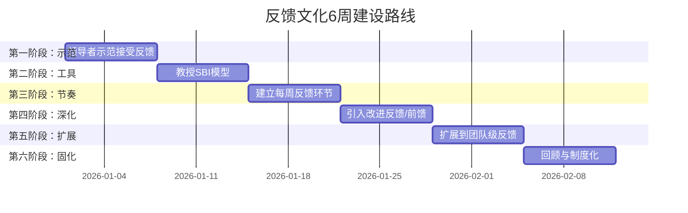

# 练习方法：系统性提升领导力沟通

领导力沟通不是天赋，而是可训练的技能。认知科学研究表明，人类大脑具有终身可塑性——通过系统性的刻意练习，任何人都能显著提升沟通能力。问题不在于"能不能学会"，而在于"练习方法是否正确"。

本节提供从基础到高级的完整练习体系，覆盖愿景传达、故事讲述、一对一沟通、困难对话、反馈文化、360度评估六大核心维度。每个练习都遵循"理论依据→操作步骤→进阶变体→常见误区"的结构，确保你不仅知道"怎么做"，还理解"为什么这样做"以及"怎样才算做到位"。

***

## 刻意练习的科学基础

在进入具体练习之前，理解"为什么这样练"比"怎么练"更重要。以下是支撑整个练习体系的核心理论。

### 安德斯·艾利克森的刻意练习理论

佛罗里达州立大学心理学家安德斯·艾利克森（Anders Ericsson）通过数十年研究发现，世界级专家的能力并非来自天赋，而是来自特定模式的练习。刻意练习有四个核心要素：

1. **明确的改进目标**：不是泛泛地"多练习演讲"，而是"这次练习把语速从每分钟200字降到160字"
2. **即时反馈机制**：练习后立即获得具体反馈，而非模糊的"挺好的"
3. **走出舒适区**：练习的内容应该略高于当前能力水平，太容易不会进步，太难会放弃
4. **大量重复与修正**：同一技能需要反复练习直到自动化

这四个要素直接决定了后续每个练习的设计逻辑。

### 神经可塑性与技能固化

每次重复一个沟通行为，大脑中对应的神经通路就会被强化一次。神经科学家唐纳德·赫布（Donald Hebb）提出的赫布法则指出："一起激发的神经元会连接在一起。"这意味着：

- 第1次练习某个技巧：生硬、刻意、需要大量注意力
- 第10次练习：开始流畅，注意力需求降低
- 第50次练习：基本自动化，可以在复杂场景中自如运用
- 第100次练习：内化为本能反应，即使在压力下也能稳定输出

理解这个过程有助于建立正确预期——前10次练习感觉"不自然"是完全正常的，不是你做错了，而是技能正在固化。

### 1万小时法则的修正

马尔科姆·格拉德威尔提出的"1万小时法则"过于简化。艾利克森的研究表明，关键不是练习时长，而是练习质量。100小时高质量刻意练习的效果可能超过1000小时低质量重复。对领导力沟通而言，每天30分钟的刻意练习，坚持3个月，就能看到显著变化。

### 学习曲线的四个阶段

理解技能习得的心理学阶段，可以帮助你在遇到瓶颈时不放弃：

- **第一阶段→第二阶段**：通过学习和观察，意识到自己的不足（本文的第一步）
- **第二阶段→第三阶段**：通过刻意练习获得技能，但需要集中注意力（本文的核心练习）
- **第三阶段→第四阶段**：通过大量重复使技能自动化（本文的进阶练习）

大多数人在第二阶段放弃——他们知道自己不足，但觉得练习太累、进步太慢。坚持过去，第三阶段的能力会逐渐变成第四阶段的本能。

***

## 练习一：愿景演讲练习

### 理论依据

愿景传达是领导力的核心能力。哈佛商学院教授约翰·科特（John Kotter）在《领导变革》中指出，70%的变革失败源于领导者未能有效传达愿景。愿景不是目标陈述——目标是"我们要做到X"，愿景是"当我们做到X时，世界会变成什么样"。愿景需要同时激活听众的理性和情感系统。

普林斯顿大学的尤里·哈森（Uri Hasson）通过fMRI脑扫描研究发现，当一个人用生动的故事传达信息时，听众的大脑活动会与讲述者的大脑活动同步——这被称为"神经耦合"。愿景演讲的目标正是实现这种耦合。

### 核心练习：五步愿景演讲法

**第一步：定义你的"为什么"（15分钟）**

拿出纸笔（不是电子设备——手写能激活不同的思维模式），回答以下问题，每个问题至少写3个答案：

| 问题 | 为什么要问这个问题 |
|------|-------------------|
| 我/我们团队存在的意义是什么？ | 这是愿景的根基——你为谁创造什么价值 |
| 如果我们做到了最好，世界会有什么不同？ | 这是愿景的终点——理想的未来画面 |
| 是什么信念驱动着我每天工作？ | 这是愿景的情感核心——让人产生共鸣的源泉 |
| 我们面对的最大挑战是什么？ | 这是愿景的紧迫性——为什么现在就需要行动 |
| 谁会因为我们成功而受益？ | 这是愿景的影响面——超越自我的意义 |

写下答案后，圈出最能触动你自己的那一个。如果你自己都不被打动，你的听众也不会。

**第二步：撰写愿景陈述（20分钟）**

使用以下模板将你的思考浓缩为150字以内的愿景陈述：

> "我们相信【核心信念】。我们的使命是【核心使命】。当我们成功时，【具体画面——用感官语言描述，让听众能看到、听到、感受到】。每个人都可以通过【具体方式】参与其中。"

**好愿景 vs 差愿景对比：**

| 维度 | 差愿景 | 好愿景 |
|------|--------|--------|
| 具体性 | "我们要成为行业领先者" | "我们要让每个家庭都能负担得起清洁能源" |
| 感官性 | "我们要提升用户体验" | "当用户打开我们的产品时，他们的第一反应是微笑" |
| 情感性 | "我们要实现10亿营收" | "当我们的解决方案进入农村地区时，孩子们能用上干净的水" |
| 行动性 | "大家一起努力" | "每个工程师每天写的代码，都在缩短一个病人等待诊断的时间" |

**第三步：准备3分钟演讲（20分钟）**

将愿景扩展为一个结构完整的3分钟演讲（约450字）：

- **开头（30秒）**：一个引人入胜的故事或问题。不要以"今天我想和大家分享一个愿景"开头——这种开场会让听众立刻关闭注意力。用一个具体的人、一个真实的场景、一个出乎意料的数据开始。
- **主体（2分钟）**：愿景的核心内容。按照"为什么→做什么→怎么做"的逻辑展开。"为什么"回答紧迫性，"做什么"回答方向，"怎么做"回答路径。
- **结尾（30秒）**：一个清晰的行动号召。不要以"谢谢大家"结尾——以一个请求结尾，让听众知道下一步该做什么。

**演讲结构模板：**

[故事/场景] → 这就是我们面对的现实 → 我们相信[核心信念]
→ 我们的使命是[核心使命] → 当我们成功时[具体画面]
→ 为此我们需要[具体行动] → 我邀请你[行动号召]

**第四步：录像练习（15分钟）**

录制自己的演讲。回放时，用以下清单逐项检查：

| 检查项 | 评分标准 | 常见问题 |
|--------|----------|----------|
| 语速 | 每分钟140-170字（中文） | 紧张时语速加快，重要内容前应刻意放慢 |
| 口头禅 | 每分钟不超过2次"嗯""那个""就是说" | 录音转文字后数频次，逐个消灭 |
| 眼神 | 70%时间看镜头/听众，30%自然游离 | 全程盯着稿子会让听众觉得不真诚 |
| 手势 | 与内容配合，不超过肩宽 | 手插口袋、抱臂、频繁摸脸都是紧张信号 |
| 情感 | 关键段落语调有变化，有真诚的情感投入 | 全程一个语调是最大的杀手 |
| 停顿 | 重要观点后停顿1-2秒 | 不停顿的演讲像机关枪，听众来不及消化 |

录像至少录3遍。第1遍是发现问题，第2遍是尝试修正，第3遍是打磨细节。

**第五步：获取反馈（10分钟）**

请2-3个人听你的演讲。不要问"你觉得怎么样"——这个问题太模糊，得到的反馈通常是"挺好的"。用以下具体问题获取有价值的反馈：

1. "听完后，你脑子里留下的第一个画面是什么？"（检验愿景是否有画面感）
2. "你能用自己的话复述我们的核心使命吗？"（检验信息是否清晰传递）
3. "这个愿景让你想做什么？"（检验是否有激励效果）
4. "哪个部分最打动你？哪个部分你想跳过？"（检验内容的吸引力分布）
5. "你觉得我真诚吗？"（检验真实感——领导力沟通的基石）

### 进阶练习

**初级进阶：变体练习**
- 用隐喻传达愿景："我们的团队就像一个……"
- 用数据传达愿景：将愿景的一个关键维度量化
- 用对比传达愿景："如果继续现状……如果选择改变……"
- 用提问传达愿景：以一个让听众深思的问题结尾

**中级进阶：场景练习**
- 在团队周会上用1分钟分享愿景的一个切面
- 在客户会议上用愿景框架介绍产品方向
- 在危机时刻用愿景稳定团队信心

**高级进阶：即兴愿景**
- 在没有准备的情况下，被问到"你们团队在做什么"时，能用30秒清晰传达核心愿景
- 训练方法：随机选择一个场景（电梯、茶歇、走廊），练习即兴表达

### 常见误区

| 误区 | 为什么是错的 | 正确做法 |
|------|-------------|----------|
| 愿景越宏大越好 | 太宏大的愿景让人觉得不切实际，反而失去信任 | 愿景要"够得着但要踮脚"——既令人兴奋又感觉可能实现 |
| 只说一遍就够了 | 研究表明，成年人需要听到同一信息7次才能记住 | 在不同场合、用不同方式反复传达同一愿景 |
| 愿景是领导者一个人的事 | 没有参与感的愿景不会被认同 | 让团队成员参与愿景的打磨，让每个人在里面找到自己的位置 |
| 照稿念效果最好 | 照稿念会失去真实感和互动感 | 记住核心框架，用自然语言表达，允许即兴发挥 |
| 用行业术语显得专业 | 术语让非专业听众关闭理解通道 | 用你妈妈能听懂的语言描述愿景 |

***

## 练习二：激励性故事创作

### 理论依据

人类大脑天生是为故事而设计的。斯坦福商学院营销学教授珍妮·利蒙德（Jennifer Aaker）的研究表明，故事的记忆效果是纯数据的22倍。这是因为故事同时激活大脑的多个区域——语言处理区、感觉皮层、运动皮层、情感中枢——形成"全脑体验"。

领导力沟通中的故事不是"讲故事比赛"中的文学创作，而是有目的的沟通工具。每讲一个故事，你都应该清楚地知道"我讲这个故事是为了让听众做出什么改变"。

心理学家丹·麦克亚当斯（Dan McAdams）的研究发现，人通过"叙事身份"来理解自己——我们是谁，取决于我们如何讲述自己的故事。作为领导者，你的故事不仅传递信息，还在塑造团队的集体叙事。

### 核心练习：故事创作五步法

**第一步：建立故事素材库（持续进行）**

准备一个随时可记录的工具（手机备忘录、笔记本、语音备忘录），记录以下类型的经历：

| 素材类型 | 记录什么 | 为什么重要 |
|----------|----------|-----------|
| 挑战与克服 | 你或团队面对的最大困难、采取的行动、最终的结果 | 展示韧性和解决问题的能力，激励团队面对困难 |
| 顿悟时刻 | 改变你思维方式的那个瞬间——一个对话、一本书、一次失败 | 传达成长型思维，鼓励持续学习 |
| 价值观事件 | 一个你做出艰难选择的时刻，而这个选择体现了你的核心价值观 | 用行动定义价值观，而非用口号 |
| 团队成就 | 一个团队协作创造的了不起的结果 | 建立集体认同感和自豪感 |
| 失败与教训 | 一次你犯的错、你从中学到的东西 | 展示脆弱性和学习能力，降低团队对失败的恐惧 |

**记录模板：**
日期：____
故事类型：____
一句话概括：____
关键人物：____
情感高点：____
核心教训：____
可以用于：____（场景/目的）

建议每周至少记录2个故事素材。素材库积累到50个以上时，你会发现面对任何沟通场景都能快速找到合适的故事。

**第二步：选择与匹配故事（5分钟）**

不是所有故事都适合所有场景。选择故事时，用以下匹配矩阵：

| 你要传达的信息 | 适合的故事类型 | 避免的故事类型 |
|---------------|---------------|---------------|
| "困难是可以克服的" | 挫折与克服 | 一帆风顺的成功故事 |
| "我们需要创新" | 顿悟时刻/失败教训 | 按部就班的执行故事 |
| "信任是我们的核心" | 价值观事件 | 纯技术/流程故事 |
| "我们是一个团队" | 团队成就 | 个人英雄主义故事 |
| "变革是好的" | 愿景故事/顿悟时刻 | 怀旧/维持现状的故事 |

**第三步：应用故事结构（20分钟）**

使用以下五段结构组织你的故事：

| 阶段 | 功能 | 时间占比 | 技巧要点 |
|------|------|---------|----------|
| 设置场景 | 让听众"进入"故事 | 15% | 用具体的时间、地点、人物、感官细节。不说"有一天"，说"去年七月一个下雨的周三下午" |
| 制造张力 | 让听众产生"然后呢？"的好奇 | 20% | 展示冲突、困难、矛盾。不要急于解决问题——张力是故事的引擎 |
| 展开行动 | 展示你/团队做了什么 | 30% | 聚焦关键决策和转折点，不要面面俱到。展示思考过程，而非只说结果 |
| 呈现结果 | 让听众看到变化 | 15% | 用对比展示变化——之前是什么样，之后变成了什么样 |
| 提炼启示 | 连接到当下场景 | 20% | 这是最重要的部分。故事本身不重要，故事与听众的关联才重要 |

**第四步：精炼语言（15分钟）**

好的故事语言有三个特征：

1. **具体代替抽象**：不说"团队很努力"，说"连续三周每天工作到凌晨两点，张伟的键盘上F5键都被按塌了"
2. **感官代替概念**：不说"办公室气氛紧张"，说"办公室里安静得能听到空调的嗡嗡声，每个人盯着屏幕，没有人说话"
3. **对话代替叙述**：不说"领导鼓励大家"，说"领导走进来，看了看我们，说了一句话：'我知道你们累了，但你们正在做的事情，明年会改变一百万人的生活'"

**语言检查清单：**
- [ ] 删除所有不推动故事前进的内容
- [ ] 每个段落至少有一个具体的感官细节
- [ ] 关键情感点有对话或内心独白
- [ ] 结尾的启示与当前沟通目的直接相关
- [ ] 总时长控制在3-5分钟（约450-750字）

**第五步：多维练习（15分钟）**

| 练习方式 | 目的 | 具体做法 |
|----------|------|----------|
| 镜子练习 | 观察自己的表情和肢体 | 站在镜子前讲，注意眼神、手势、表情是否与内容匹配 |
| 录音练习 | 专注于语言质量 | 只录音不录像，回听时关注语言的节奏、停顿、重点强调 |
| 录像练习 | 全面诊断 | 录制完整表演，用回放清单逐项检查 |
| 转述练习 | 内化故事结构 | 用自己的话把同一个故事讲给不同的人，每次都不看笔记 |

### 四种核心故事类型详解

**1. 起源故事——"我们为什么存在"**

使用场景：新员工入职、团队新成员加入、对外介绍团队
结构重点：创始人/团队的初心——遇到了什么问题——为什么现有方案不够好——我们的信念是什么
练习方法：将团队/公司的创建历史浓缩为3分钟版本，用"英雄之旅"框架重述

**2. 挫折故事——"我们如何面对失败"**

使用场景：团队遇到困难、士气低落、需要展示韧性
结构重点：面临什么挑战——犯了什么错——从中学到什么——如何变得更强
练习方法：选择一个真实失败经历，重点放在"我学到了什么"而非"我们多惨"

**3. 愿景故事——"我们正在创造什么"**

使用场景：年度战略会议、项目启动、需要激发使命感
结构重点：当前世界的样子——未来可以变成什么样——我们如何到达那里——你在其中的角色
练习方法：将抽象愿景转化为一个具体人的具体一天

**4. 价值观故事——"我们相信什么"**

使用场景：文化建设、招聘面试、团队凝聚
结构重点：一个具体事件——在那个事件中，一个艰难的选择被做出——这个选择体现了什么信念
练习方法：为团队的每个核心价值观准备一个真实故事

### 常见误区

| 误区 | 为什么是错的 | 正确做法 |
|------|-------------|----------|
| 故事越长越好 | 长故事容易失去注意力。研究表明，最佳故事时长为3-5分钟 | 宁短勿长，能用1分钟讲清楚的不要拖到5分钟 |
| 只讲成功故事 | 完美无缺的故事没有可信度，也无法引起共鸣 | 敢于展示脆弱性——你犯的错、你的挣扎、你的恐惧 |
| 故事和目的脱节 | 有趣但无关的故事会让听众困惑"他想说什么" | 每讲一个故事之前，先确定"讲完后我希望听众做什么" |
| 用别人的故事 | 网上找的故事没有真实感，听众能感觉到 | 优先讲自己的亲身经历。没有经历就去创造经历 |
| 只练习内容不练习表达 | 同一个故事，平铺直叙和声情并茂的效果天差地别 | 内容和表达各占50%的练习时间 |

***

## 练习三：一对一沟通练习

### 理论依据

盖洛普的研究发现，员工敬业度的最大预测因子不是薪酬、不是福利、不是工作环境，而是"我的直接上级是否关心我"。一对一沟通是建立这种关心的最有效方式——但前提是它做得好。

大多数领导者把一对一变成"进度汇报会"——这是最大的浪费。进度汇报用文档就够了。一对一的价值在于获取文档不会写的信息：团队成员的真实感受、隐藏的担忧、未成形的想法、个人层面的挑战。

谷歌的"氧气计划"（Project Oxygen）通过分析上万份管理数据发现，最好的管理者在一对一中花70%以上的时间在倾听，而非说话。

### 核心练习：高质量一对一四步法

**第一步：精心准备（10分钟）**

每次一对一前，花10分钟准备以下内容：

| 准备项 | 具体内容 | 为什么要准备 |
|--------|----------|-------------|
| 回顾上次承诺 | 上次一对一的行动项完成情况 | 表明你重视对方说的话，你记住了 |
| 了解近期状态 | 对方最近在做什么项目、遇到什么挑战 | 让对话有上下文，避免"最近怎么样"的空洞开场 |
| 准备开放性问题 | 2-3个无法用"是/否"回答的问题 | 开放性问题引导深入对话，封闭性问题导致敷衍 |
| 明确首要目的 | 这次对话我最想了解的是什么 | 有目的的对话才有价值，否则变成闲聊 |

**高质量开放性问题库：**

| 问题类型 | 示例问题 | 适用场景 |
|----------|----------|----------|
| 工作状态 | "目前的工作中，什么让你最有成就感？什么最消耗你？" | 了解工作满意度 |
| 成长发展 | "如果你有一周时间学习任何东西，你会学什么？" | 了解发展需求 |
| 团队协作 | "你觉得团队合作中最顺畅的是什么？最大的摩擦是什么？" | 了解团队动态 |
| 领导支持 | "我可以做什么来更好地支持你？有什么是我现在没做但应该做的？" | 获取向上反馈 |
| 个人状态 | "工作之外，有什么事情在影响你的状态吗？（你愿意分享的话）" | 关心个人层面 |
| 前瞻性 | "你对未来6个月有什么期待或担忧？" | 提前发现问题 |

**第二步：结构化对话（30-45分钟）**

| 阶段 | 时间 | 目的 | 关键行为 |
|------|------|------|----------|
| 温暖开场 | 3-5分钟 | 建立安全感 | 聊非工作话题——周末做了什么、家人怎么样、最近在看什么。这不是浪费时间，是在说"我关心你这个人" |
| 对方的议题 | 15分钟 | 获取真实信息 | "今天你最想聊什么？"让对方先说。这是最重要的一段时间——如果只能做一件事，就是让对方主导这部分 |
| 你的议题 | 10分钟 | 传递信息和支持 | 分享你掌握的信息、给出反馈、回应对方的需求。注意：这部分应该是回应对方的需求，而非你单方面的通知 |
| 发展对话 | 10分钟 | 促进成长 | "你最近在学什么？""你对自己的发展方向清楚吗？""有什么技能你想提升但没有机会？" |
| 行动总结 | 5分钟 | 确保落地 | 总结今天讨论的要点，确认下一步行动（谁、做什么、什么时候），约定下次一对一的时间 |

**第三步：四大关键行为练习**

**1. 全神贯注倾听练习**

目标：让对方感觉到"此刻，你是我世界上最重要的事"

练习方法：
- 关闭手机（不是静音——是关机或放在另一个房间）
- 关闭电脑屏幕上的所有窗口
- 身体前倾，保持眼神接触
- 不要在对方说话时准备你的回应——真正地听
- 当你想打断时，深呼吸一次再决定

每周选一次一对一，录音后分析：你说话的时间占比是多少？目标是不超过40%。

**2. 结构化提问练习**

目标：用问题引导对话深度，而非用建议终止对话

| 低质量提问 | 高质量提问 | 为什么更好 |
|-----------|-----------|-----------|
| "最近怎么样？" | "上周你提到项目有风险，现在情况怎么样了？" | 具体的跟进表明你在关注 |
| "你同意吗？" | "你对此有什么想法？" | 开放性问题邀请真实观点 |
| "你需要帮助吗？" | "这个任务的哪个部分你觉得最有挑战？" | 具体问题引出具体需求 |
| "为什么没完成？" | "过程中遇到了什么障碍？" | 询问障碍比质疑能力更安全 |
| "你有什么问题吗？" | "如果有一个问题你希望我知道但一直没有说，那会是什么？" | 给隐性问题一个出口 |

**3. 复述确认练习**

目标：确保你理解的和对方想表达的是同一件事

模板："我听到你说的是……，我理解得对吗？"

练习要求：
- 用你自己的话复述，不要原样重复
- 复述时关注事实和情感两个层面
- 如果复述不准确，让对方纠正——这本身就是在建立信任

**4. 战略性沉默练习**

目标：给对方思考和表达的空间

大多数人害怕对话中的沉默。但实际上，沉默是最高质量的倾听信号。

练习方法：
- 当对方回答一个问题后，停顿3秒再回应
- 当你问了一个重要问题后，允许沉默10秒以上
- 如果对方说"我不知道"，不要立刻换话题——等5秒，通常他们会补充更多想法

**第四步：反思记录（10分钟）**

每次一对一后，花10分钟填写以下反思表：

日期：____
对象：____
1. 今天了解到的新信息：____
2. 对方的情感状态（1-10）：____
3. 对方未说出但可能在想的：____
4. 需要跟进的事项：____（谁、做什么、什么时候）
5. 我做得好的地方：____
6. 我下次可以改进的地方：____
7. 对方给我的信号/线索（下次要跟进的）：____

### 一对一的绝对法则

| 法则 | 违反的后果 |
|------|-----------|
| 永远不要取消一对一 | 取消传递的信号是"你不重要"。如果必须改期，当天就约新的时间，不要"下次再说" |
| 永远不要把一对一变成汇报会 | 一旦变成汇报会，对方会关闭真实的沟通，只说你想听的话 |
| 永远记住对方分享的个人信息 | 记住对方孩子的名字、对方的兴趣爱好。下次跟进时，对方会感到被重视 |
| 永远不要在一对一中第一次给负面反馈 | 负面反馈应该在事件发生后的24小时内单独给出，不要积压到一对一 |
| 永远不要让一对一只聊工作 | 工作只是人的一部分。了解一个完整的人，才能真正领导这个人 |

### 常见误区

| 误区 | 为什么是错的 | 正确做法 |
|------|-------------|----------|
| 不用准备，直接聊 | 没有准备的一对一容易变成没有重点的闲聊 | 每次花10分钟准备，这10分钟能提升50%的对话质量 |
| 每个人用同样的方式 | 不同的人需要不同的沟通风格 | 内向的人需要更多沉默空间，外向的人需要更多引导回到重点 |
| 只聊工作进展 | 这是对一对一最大的浪费 | 至少60%的时间用于了解人，而非了解事 |
| 对方说"我很好"就信了 | "我很好"通常是"我不想说"的代名词 | 用更具体的追问打开话题："上周那个项目压力大吗？" |
| 快速给建议 | 对方可能需要的不是解决方案，而是被听到 | 先问："你需要我倾听，还是需要我给建议？" |

***

## 练习四：困难对话角色扮演

### 理论依据

哈佛商学院的研究发现，管理者平均每周花2.1小时在困难对话上，但82%的管理者表示自己没有接受过任何困难对话的培训。这意味着大多数人在用本能反应处理最需要技巧的场景。

心理学中的"战斗或逃跑"反应解释了为什么困难对话如此困难：当我们感知到威胁（包括社交威胁），大脑的杏仁核会激活，关闭前额叶皮层的理性思考能力。这意味着在困难对话中，你最需要理性的时候恰恰是你最不理性的时候。

解决办法不是"更坚强"，而是**提前准备**——当你已经在角色扮演中经历过对方的情绪反应，在真实对话中遇到同样的反应时，你的大脑就不会将其视为"意外威胁"，从而保持理性。

### 核心练习：场景角色扮演法

**第一步：选择和分析场景（5分钟）**

| 场景 | 难度 | 核心挑战 | 心理障碍 |
|------|------|----------|----------|
| 绩效改进反馈 | ★★★ | 平衡直接与尊重，避免伤害自尊 | 害怕被讨厌、害怕对方崩溃 |
| 拒绝一个请求 | ★★ | 清晰而不伤关系 | 害怕冲突、想当"好人" |
| 处理团队冲突 | ★★★★ | 中立、倾听、调解，不偏袒 | 害怕选错边、害怕事情失控 |
| 薪酬谈判 | ★★★ | 管理预期、保持关系、坚守底线 | 害怕被视为贪婪、害怕失去人才 |
| 宣布坏消息 | ★★★★ | 诚实与同理心的平衡 | 害怕成为"坏消息的传递者" |
| 纠正上级行为 | ★★★★★ | 勇气与策略的平衡 | 害怕被报复、害怕职业风险 |
| 与低绩效员工谈话 | ★★★★ | 既明确问题又保留尊严 | 害怕对方辞职、害怕诉讼风险 |

选择一个你近期需要进行但一直在拖延的对话。

**第二步：SBI对话框架准备（15分钟）**

SBI模型（Situation-Behavior-Impact）是反馈的黄金标准：

| 要素 | 说明 | 示例 |
|------|------|------|
| S-情境 | 描述具体的时间、地点、场景 | "在上周三的项目评审会上" |
| B-行为 | 客观描述你观察到的行为，不加评价 | "你连续三次打断了小李的发言"（而非"你不尊重人"） |
| I-影响 | 说明这个行为产生的具体影响 | "小李之后的20分钟没有再说一句话，他的一个好建议也因此没有被听到" |

**完整的困难对话框架：**

1. 开场（2分钟）
   "我想和你聊一个对我来说有点困难的话题，因为我重视我们的关系，
   所以我希望直接和你沟通而不是回避。"

2. 陈述事实（3分钟）
   用SBI模型描述情况。只说你亲眼看到/亲耳听到的事实。

3. 表达关切（1分钟）
   "我担心的是……"（说你的担心，不是对方的问题）

4. 倾听回应（5分钟）
   "我想听听你的看法。"然后闭嘴，真正地听。

5. 共同解决（5分钟）
   "你觉得我们可以怎么做来改善这个情况？"
   让对方参与解决方案的制定。

6. 明确行动（2分钟）
   确认具体行动、时间节点、检查方式。

7. 关系修复（1分钟）
   "我很感谢你愿意和我坦诚讨论这件事。这不会改变我对你的重视。"

**第三步：完整角色扮演（30分钟）**

找一个可信赖的伙伴进行角色扮演。分三轮进行：

**第一轮：完整演练**
- 你扮演自己，伙伴扮演对方
- 伙伴被告知扮演一个合理的、但有自己立场的人（不要刻意刁难）
- 完整走完对话流程
- 不打断，不重来——模拟真实情况

**第二轮：交换角色**
- 你扮演对方，伙伴扮演你
- 体验"接收反馈"的感觉——你会发现，同样的话从不同角度听，感受完全不同
- 这一轮的目的是培养同理心

**第三轮：压力测试**
- 伙伴扮演一个情绪化、防御性强的对方
- 练习在对方情绪激动时保持冷静
- 练习应对"我不同意""你不懂""这不公平"等反应

**第四步：结构化复盘（15分钟）**

用以下框架进行复盘，不要只说"还不错"或"不太行"：

| 复盘问题 | 自评 | 伙伴评价 |
|----------|------|----------|
| 开场是否直接但温和？ | | |
| 是否使用了SBI模型？ | | |
| 给对方足够的回应空间了吗？ | | |
| 有没有在对方情绪激动时保持冷静？ | | |
| 是否达成了一个具体的行动共识？ | | |
| 整个过程中你的情绪管理如何？ | | |
| 对方感觉被尊重了吗？ | | |

### 六种困难对话应对模板

**1. 绩效改进反馈**

"我想和你聊聊最近的工作表现。
 [SBI描述具体行为]
 这个情况让我担心，因为[具体影响]。
 我想了解你的看法——你觉得发生了什么？
 ……
 我相信你能改善这个情况。让我们一起制定一个计划。"

**2. 拒绝请求**

"我理解你的需求，也知道这对你的项目很重要。
 经过仔细考虑，这次我无法批准这个请求，原因是[具体原因]。
 我建议的替代方案是[具体方案]。
 你觉得这个方案可以吗？"

**3. 宣布坏消息**

"我有一个不太好的消息要告诉你，我选择直接和你说，因为你值得第一时间知道。
 [直接陈述事实]
 我知道这对你来说不容易消化。
 你有什么问题想问吗？
 ……
 接下来我会这样做来支持你：[具体支持措施]"

**4. 处理团队冲突**

"我知道你们之间最近有一些摩擦，我希望帮助解决。
 我想分别听一下你们的视角。
 [先听A] [再听B]
 我看到的共同点是……不同点是……
 我们可以一起找到一个双方都能接受的方案吗？"

**5. 纠正上级行为**

"领导，我有一件事想和您沟通，因为我觉得这对团队很重要。
 [SBI描述行为]
 我不确定您是否意识到了这个情况的影响。
 我想了解您的想法，也许有我理解不到的背景。"

**6. 薪酬/资源谈判**

"感谢你来讨论这个话题，我重视你的坦诚。
 我理解你期望[具体期望]。
 目前我能提供的范围是[具体范围]，原因是[具体原因]。
 我们可以探讨在这个范围内的最佳方案吗？"

### 情绪管理工具箱

在困难对话中，当对方情绪激动或你自己感到压力时：

| 情境 | 你的感受 | 应对策略 |
|------|----------|----------|
| 对方开始哭泣 | 不安、想终止对话 | "我理解你现在很难受。我们可以暂停一下。你需要喝杯水吗？"不要急于安慰，给空间 |
| 对方开始愤怒 | 被攻击、想反击 | "我听到你很生气，这对你是很重要的事情。"承认情绪，不要说"你冷静一下" |
| 对方沉默不语 | 尴尬、想填补沉默 | 保持沉默至少10秒。通常对方会在沉默中整理思路。然后问："你愿意和我分享你在想什么吗？" |
| 你自己感到心虚 | 想后退、想降低标准 | 深呼吸，提醒自己：回避问题不会让问题消失，只会让它恶化 |
| 对方开始推卸责任 | 沮丧、想争论 | "我理解你看到的情况不同。让我们回到具体行为上——在那个场景中，实际发生了什么？" |

### 常见误区

| 误区 | 为什么是错的 | 正确做法 |
|------|-------------|----------|
| 先表扬再批评（"三明治法"） | 对方会条件反射地等待"但是"，表扬也会失去可信度 | 直接但温和地说事实。好的反馈不需要裹上糖衣 |
| 用"大家都觉得"开头 | 这会让对方觉得被围攻，且会追问"谁说的" | 用"我"开头——"我观察到""我担心" |
| 回避情绪反应 | 情绪是信息，回避情绪等于忽视重要数据 | 承认情绪："我看到这对你来说很难受" |
| 只说问题不说期望 | 对方不知道"好"是什么样子 | 明确具体期望："下次遇到类似情况，我希望你……" |
| 对话后不跟进 | 没有跟进的对话等于白谈 | 24小时内发一条确认信息，约定检查时间 |

***

## 练习五：反馈文化试点

### 理论依据

麻省理工学院人类动力学实验室主任亚历克斯·彭特兰（Alex Pentland）通过可穿戴设备研究发现，高绩效团队的最显著特征不是智力水平或工作时长，而是**沟通模式**——特别是反馈的频率和坦诚度。高绩效团队的成员之间相互给予正面反馈的频率是低绩效团队的5倍。

然而，建立反馈文化是反直觉的。人类天生对批评有防御反应——这是进化的遗留机制。在原始社会，被部落排斥等同于死亡，所以我们的大脑将任何负面评价都标记为"生存威胁"。建立反馈文化的核心挑战不是"教人怎么给反馈"，而是"降低反馈的威胁感"。

### 核心练习：六周反馈文化建设

**第一周：自我启动——以身作则**

在团队会议上宣布你的意图。关键：不是"我要推行反馈文化"，而是"我希望你们帮助我变得更好"。

具体做法：
1. 在团队会议上，公开分享你最近犯的一个错误和你从中学到的东西
2. 向团队征求关于你沟通方式的反馈，用具体问题引导：
   - "在上次的项目讨论中，我的表达是否清晰？"
   - "我有没有在无意中忽略了谁的意见？"
   - "我在会议中的节奏把控如何？"
3. 当收到反馈时，当众感谢反馈者，不辩解，记录下来，并在下次会议中报告你采取了什么行动

**这一步的核心原则：** 领导者先接受反馈，团队才敢给出反馈。你是示范者，不是推行者。

**第二周：引入反馈工具——SBI模型**

教团队使用SBI模型（情境-行为-影响）：

| 要素 | 说明 | 正面反馈示例 | 改进反馈示例 |
|------|------|-------------|-------------|
| S-情境 | 具体的时间/场景 | "在昨天的客户会议上" | "在今天早上的代码审查中" |
| B-行为 | 客观描述行为 | "你用一个简洁的类比解释了技术方案" | "你在小王提交代码后直接重写了他的方案" |
| I-影响 | 说明影响 | "客户立刻理解了价值，当场决定推进" | "小王之后没有再提交代码，他可能觉得自己的贡献不被认可" |

培训方法：不要用PPT讲理论。直接做：
1. 你自己用SBI模型给团队成员3条反馈（正面+改进）
2. 让团队两两配对，互相练习给一条正面反馈
3. 全组讨论：用SBI模型给反馈和平时给反馈有什么不同

**第三周：建立反馈节奏——每周反馈环节**

在每周团队会议中加入10分钟的反馈环节：

每周反馈环节设计（10分钟）

1. 正面反馈轮转（5分钟）
   - 每个人给坐在右边的人一条具体的正面反馈
   - 必须使用SBI模型
   - 被反馈的人只能说"谢谢"

2. 本周学习分享（3分钟）
   - 每个人分享"本周我学到的一件事"
   - 可以是工作相关的，也可以是个人的
   - 不需要是成功——失败的教训也是学习

3. 改进请求（2分钟）
   - 每个人分享"下周我希望在某个方面得到反馈"
   - 这是在主动降低反馈的威胁感

**第四周：引入改进反馈**

当正面反馈成为常态后，开始引入改进反馈。

关键技巧：改用"feedforward"（前馈）而非"feedback"（反馈）
- 反馈说："你上次做得不好"
- 前馈说："下次如果这样做，效果会更好"

前馈练习：
1. 每人分享一个自己想改进的具体行为
2. 其他人每人给一条具体的"前馈建议"
3. 被建议的人只听、记笔记、说谢谢——不解释、不辩解

**第五周：扩展反馈网络**

将一对一反馈扩展为团队级反馈：
- 团队复盘时，加入"做得好的"和"下次可以不同的"两个维度
- 项目结束后，团队成员互相给结构化反馈
- 建立匿名反馈渠道，给不善于当面表达的人一个出口

**第六周：回顾与制度化**

每月进行一次反馈文化的回顾：
- 反馈文化进展如何？（1-10分）
- 有什么障碍？怎么克服？
- 有什么好的实践值得分享？
- 下个月的重点是什么？

将有效的反馈实践制度化——写入团队章程，纳入新员工入职培训。

### 反馈文化建设路线图

### 成功指标与评估方法

| 指标 | 衡量方式 | 达标标准 |
|------|----------|----------|
| 反馈频率 | 每周团队内自发反馈次数 | 平均每人每周至少收到1条自发反馈 |
| 反馈质量 | 抽样评估反馈的具体性（使用SBI的比例） | 80%以上的反馈包含具体的SBI要素 |
| 心理安全感 | 匿名问卷"我可以在团队中安全地表达不同意见" | 平均分4.0以上（5分制） |
| 主动求反馈 | 团队成员主动请求反馈的频率 | 每周至少2-3次主动求反馈 |
| 团队协作效率 | 项目交付速度和质量 | 3个月内可观察到改善 |

### 常见误区

| 误区 | 为什么是错的 | 正确做法 |
|------|-------------|----------|
| 一开始就要求所有人给反馈 | 在信任还没建立时强迫反馈会导致防御和敷衍 | 先从正面反馈开始，领导者先接受反馈，逐步建立安全感 |
| 只有自上而下的反馈 | 单向反馈是命令，不是文化 | 建立多方向反馈：上下级、平级、跨团队 |
| 反馈后没有行动 | 如果反馈石沉大海，人们就不再给反馈了 | 每条反馈都要有回应——即使不能采纳，也要解释原因 |
| 追求100%正面氛围 | 只有正面反馈没有改进反馈，团队不会成长 | 正面反馈和改进反馈的比例建议为3:1到5:1 |
| 用匿名问卷替代当面反馈 | 匿名问卷是补充，不是替代。当面反馈才能建立真正的信任 | 匿名渠道处理敏感问题，日常反馈当面进行 |

***

## 练习六：360度领导力沟通评估

### 理论依据

360度评估的核心价值在于消除"盲区"——你不知道自己不知道什么。心理学中的"达克效应"（Dunning-Kruger Effect）表明，能力较低的人往往高估自己的能力，而能力较高的人往往低估自己的能力。这意味着你的自我评估可能与他人对你的评估存在显著差异。

伦敦商学院教授摩根·麦考尔（Morgan McCall）的研究发现，高潜力领导者最显著的特征不是某项特定技能，而是"从经验中学习的能力"——而这种能力的前提是获取准确的反馈。360度评估是获取准确反馈最系统化的方式。

### 核心练习：设计与实施360度评估

**第一步：设计评估问卷（第1周）**

问卷设计的黄金原则：每个问题应该具体到行为层面，避免模糊的形容词。

| 维度 | 差的问题 | 好的问题 |
|------|---------|---------|
| 愿景传达 | "领导力如何？" | "在最近一个月，他/她是否用让你能理解的方式传达了团队的方向？" |
| 倾听能力 | "会倾听吗？" | "在一对一沟通中，他/她是否给你足够的发言时间？" |
| 反馈质量 | "反馈好不好？" | "他/她给你的反馈是否具体到可以帮助你改进？" |
| 信任建设 | "信任度如何？" | "他/她承诺的事情是否通常会兑现？" |
| 变革沟通 | "沟通能力如何？" | "在最近的变化中，他/她是否在变化发生前就与你沟通了原因和计划？" |
| 情感关怀 | "关心员工吗？" | "他/她是否了解你工作之外的基本情况（如家庭、兴趣）？" |

评分建议使用5分制（1=完全不符合，5=完全符合），加上每个维度1个开放性问题。

**完整问卷模板：**

领导力沟通360度评估问卷

说明：本问卷完全匿名，请根据你的实际体验如实作答。
1=完全不符合 2=不太符合 3=一般 4=比较符合 5=完全符合

一、愿景传达
1. 他/她能清晰地传达团队的方向和目标          [1] [2] [3] [4] [5]
2. 他/她的愿景描述让你感到有动力和方向感       [1] [2] [3] [4] [5]
3. 他/她在不同场合传达的信息是一致的           [1] [2] [3] [4] [5]
开放题：关于愿景传达，你有什么建议？____

二、倾听能力
4. 在沟通中，他/她是否给你足够的发言时间       [1] [2] [3] [4] [5]
5. 他/她是否记得你之前提出过的问题和建议        [1] [2] [3] [4] [5]
6. 当你表达不同意见时，他/她是否认真考虑        [1] [2] [3] [4] [5]
开放题：他/她最需要在哪个方面改进倾听？____

三、反馈质量
7. 他/她是否定期给你反馈（而非只在考核时）      [1] [2] [3] [4] [5]
8. 他/她的反馈是否具体、可操作                  [1] [2] [3] [4] [5]
9. 他/她是否在你做得好时给予认可                [1] [2] [3] [4] [5]
开放题：回忆一次他/她给你的最好的反馈。____

四、信任建设
10. 他/她是否言行一致                           [1] [2] [3] [4] [5]
11. 他/她是否在困难时刻为团队承担压力            [1] [2] [3] [4] [5]
12. 你是否愿意向他/她坦诚地表达困难和失误        [1] [2] [3] [4] [5]
开放题：什么最影响你对他/她的信任？____

五、变革沟通
13. 在变化发生时，他/她是否及时解释原因          [1] [2] [3] [4] [5]
14. 他/她是否在变革中关注团队成员的感受          [1] [2] [3] [4] [5]
15. 他/她是否为你在变革中的角色提供了清晰指引    [1] [2] [3] [4] [5]
开放题：最近一次变革中，他/她沟通做得最好的是什么？____

六、情感关怀
16. 他/她是否关心你作为一个人（而非只是员工）    [1] [2] [3] [4] [5]
17. 在你遇到困难时，他/她是否提供了支持          [1] [2] [3] [4] [5]
18. 他/她是否尊重你的工作与生活平衡              [1] [2] [3] [4] [5]
开放题：有什么是他/她可以做来更好地支持你的？____

**第二步：选择评估对象和收集反馈（第2-3周）**

| 评估来源 | 人数 | 价值 | 注意事项 |
|----------|------|------|----------|
| 直接下属 | 5-10人 | 最了解你的日常沟通风格 | 匿名性必须保证，否则反馈会失真 |
| 同级同事 | 3-5人 | 提供平行视角，了解跨部门沟通效果 | 选择有日常协作的同事 |
| 上级 | 1-2人 | 提供向上视角，了解战略传达效果 | 上级的反馈通常不匿名，但仍然有价值 |
| 外部合作伙伴 | 可选 | 提供外部视角 | 适合销售、客户关系等面向外部的角色 |

**关键原则：** 匿名性是360度评估的生命线。如果评估对象知道哪个下属给了什么评分，整个评估就失去了价值。使用匿名问卷工具（如问卷星、Google Forms），确保无法追踪到个人。

**第三步：分析结果（第4周）**

分析框架：

1. **维度平均分分析**：哪个维度最高？哪个最低？差距有多大？
2. **来源差异分析**：下属的评分和上级的评分有显著差异吗？差异说明什么？
3. **问题一致性分析**：同一个维度内的3个问题得分是否一致？不一致说明该维度的某些方面做得好，某些方面需要改进
4. **开放性问题分析**：高频出现的关键词是什么？具体建议有哪些？
5. **自评与他评对比**：你的自评和他人的评分差距有多大？差距最大的维度就是你的盲区

**结果可视化模板：**

维度           自评  下属  同级  上级  平均
愿景传达       4.0   3.5   3.8   4.0   3.7
倾听能力       3.5   2.8   3.2   3.5   3.1  ← 重点改进
反馈质量       3.0   2.5   3.0   3.0   2.8  ← 重点改进
信任建设       4.0   3.8   3.5   4.0   3.7
变革沟通       3.5   3.0   3.2   3.5   3.2
情感关怀       3.5   3.2   3.5   3.5   3.4

**第四步：制定改进计划（第4周）**

基于分析结果，制定90天改进计划：

| 优先级 | 维度 | 当前得分 | 目标得分 | 具体行动 | 衡量方式 |
|--------|------|----------|----------|----------|----------|
| 1 | 反馈质量 | 2.8 | 3.5 | 每天给至少1条SBI反馈 | 每周记录反馈次数 |
| 2 | 倾听能力 | 3.1 | 4.0 | 每次一对一中说话时间不超过40% | 录音自评 |
| 3 | 变革沟通 | 3.2 | 3.8 | 重要决策前先与核心成员沟通 | 团队反馈 |

**改进计划的SMART原则：**
- **S-Specific**（具体的）：不是"多倾听"，而是"每次一对一中说话时间不超过40%"
- **M-Measurable**（可衡量的）：不是"提升反馈质量"，而是"每周至少给5条SBI反馈"
- **A-Achievable**（可实现的）：不要一次改3个以上维度，优先级排序，逐步推进
- **R-Relevant**（相关的）：改进方向与团队当前需求匹配
- **T-Time-bound**（有时限的）：90天为一个周期，不是无限期

**第五步：跟踪进展与迭代（持续）**

| 时间节点 | 行动 |
|----------|------|
| 每周 | 自评本周改进计划的执行情况 |
| 每月 | 与1-2个信任的同事做非正式的进度检查 |
| 90天后 | 重新进行360度评估，对比前后结果 |
| 庆祝进步 | 即使只进步了0.3分，也值得肯定。改变是困难的，每一点进步都是真实的 |
| 调整计划 | 根据新结果调整下一个90天的改进重点 |

### 360度评估的常见陷阱

| 陷阱 | 如何避免 |
|------|----------|
| 评估结果出来后没有行动 | 在收到结果的1周内制定行动计划，30天内开始执行 |
| 只关注低分维度 | 高分维度也要维护——它们是你领导力的支柱 |
| 对负面反馈产生防御心理 | 记住：反馈是礼物。不准确的反馈也是有价值的信息——它说明了对方的感知 |
| 评估频率过高 | 360度评估建议每6-12个月一次。频繁评估会造成"评估疲劳" |
| 将评估结果公开展示 | 评估结果是个人发展工具，不是排名工具。绝对不要在团队中公开对比 |

***

## 整合练习计划

### 12周系统性提升计划

单个练习是技能点，系统练习才是能力面。以下计划将六个练习整合为一个连贯的提升路径：

| 阶段 | 周次 | 练习重点 | 每日时间 | 关键里程碑 |
|------|------|----------|----------|-----------|
| **基础期** | 第1-2周 | 愿景演讲 + 一对一沟通 | 30分钟 | 能用3分钟清晰传达愿景，完成4次高质量一对一 |
| **拓展期** | 第3-4周 | 故事创作 + 反馈文化启动 | 30分钟 | 积累10个故事素材，完成反馈文化第一周 |
| **深化期** | 第5-8周 | 困难对话 + 反馈文化推进 | 45分钟 | 完成3个场景的角色扮演，反馈环节进入正轨 |
| **评估期** | 第9-10周 | 360度评估实施 | 30分钟 | 完成问卷设计、收集、分析 |
| **整合期** | 第11-12周 | 行动计划执行 + 总结 | 30分钟 | 制定90天改进计划，建立长期练习习惯 |

### 每日微习惯清单

微习惯的关键是"小到不可能失败"——每个习惯不超过5分钟：

| 时段 | 微习惯 | 时间 | 目的 |
|------|--------|------|------|
| 晨间 | 今天的最重要沟通任务是什么？ | 2分钟 | 设定沟通意图，避免无意识沟通 |
| 工作中 | 给至少一个人一条具体的SBI反馈 | 3分钟 | 建立反馈肌肉记忆 |
| 工作中 | 在一次对话中练习"全神贯注倾听" | 持续 | 强化倾听的神经通路 |
| 工作中 | 记录一个故事素材 | 2分钟 | 持续积累故事库 |
| 晚间 | 今天的沟通做得好的和可以改进的是什么？ | 3分钟 | 建立反思习惯，加速学习曲线 |

### 进度跟踪工具

领导力沟通练习周记

第____周  日期：____

本周完成的练习：
□ 愿景演讲练习    完成次数：____
□ 故事创作练习    完成次数：____
□ 一对一沟通      完成次数：____
□ 困难对话练习    完成次数：____
□ 反馈文化建设    当前阶段：____
□ 360度评估      当前阶段：____

本周的关键收获：
1. ____
2. ____
3. ____

本周遇到的最大挑战：
____

下周的重点：
____

给自己本周的沟通能力打分（1-10）：____

### 长期维护：从练习到本能

当基础练习已经自动化后，进入持续精进阶段：

| 精进方向 | 具体做法 |
|----------|----------|
| 跨场景迁移 | 将在一对一中练好的倾听技巧迁移到会议、谈判、演讲中 |
| 教授他人 | 教团队成员使用这些工具——教是最好的学 |
| 刻意暴露 | 主动把自己放到不擅长的沟通场景中——内向的人练习当众表达，外向的人练习沉默倾听 |
| 定期重做360度评估 | 每6-12个月做一次，跟踪长期趋势而非短期波动 |
| 建立反馈同盟 | 找1-2个可信赖的人，定期互相给诚实反馈 |

> 能力的提升不在于知道多少，而在于练习了多少。不要试图同时开始所有练习——选择当前最需要的那一个，今天就开始。30天后，你会感谢今天的自己。
