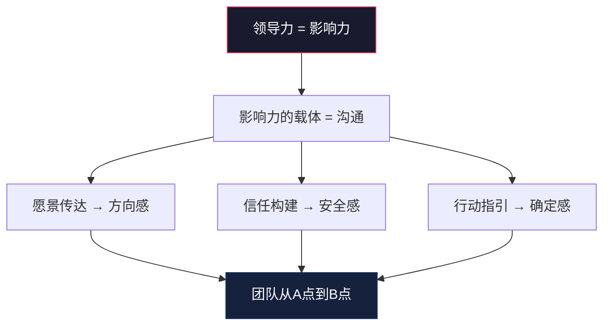
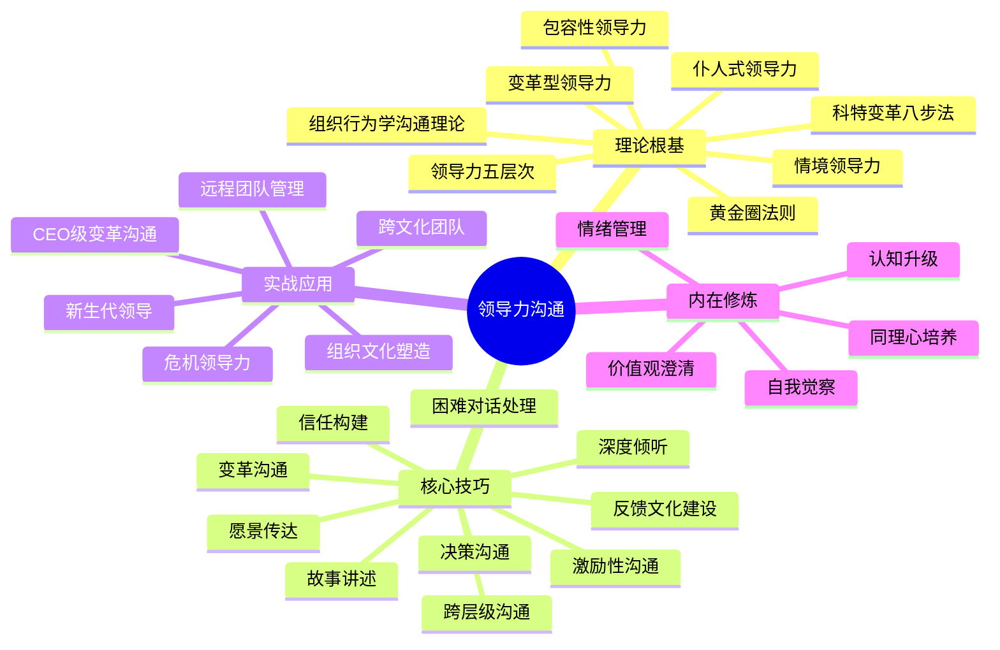
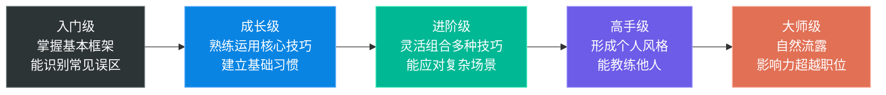

# 本章小结：领导力沟通的核心原则与行动清单

本章从理论根基、核心技巧、实战案例、常见误区到系统练习，完整构建了领导力沟通的知识体系。这份小结不是简单的重复，而是将全章内容提炼为可执行的原则、可自测的框架和可落地的行动方案。

---

## 核心命题回顾

本章围绕一个核心命题展开：

> **领导力的本质就是影响力，而影响力的核心是沟通。**

这不是鸡汤。哈佛商学院的追踪研究显示，被解雇的CEO中80%是因为"人际技能不足"而非业绩问题。DDI全球领导力报告指出，高效领导者在"沟通"维度的得分是普通领导者的2.3倍。盖洛普Q12调查中，"我的领导让我清楚了解组织方向"是敬业度的首要预测因子。

无论你是CEO还是基层管理者，无论你管理10人还是100人，你的领导力最终体现在你与他人沟通的质量上。沟通不是领导力的"附加技能"，而是领导力的"核心操作系统"。

---

## 知识体系全景图

本章的知识体系包含四个层面，从外到内依次递进：

**理论根基**解决"为什么"——帮你建立心智模型，面对复杂情境时快速定位问题本质。比如团队在变革中抗拒不前，如果你了解科特的变革八步法，就知道问题可能出在"没有制造足够的紧迫感"或"缺少短期胜利"，而不是简单归因为"员工不配合"。

**核心技巧**解决"怎么做"——这是领导力沟通的兵器库。每种能力对应一类高频场景，它们不是孤立的，而是组合使用的。一个高绩效领导者在一次团队会议中，可能同时运用愿景传达、故事讲述、深度倾听和反馈技巧。

**实战应用**解决"用出来"——理论和能力最终要落地到具体场景。危机时刻、跨文化团队、远程环境——每种场景都有独特的挑战和应对策略。

**内在修炼**解决"成为谁"——最深层也最容易被忽略。领导力沟通的终极瓶颈不是技巧，而是你这个人本身。你的自我觉察能力、情绪管理能力、价值观清晰度，决定了你所有沟通行为的天花板。

---

## 领导力沟通的十大原则

从本章的理论、技巧、案例和误区中，提炼出领导力沟通的十大核心原则。每条原则都附带具体行为指导和常见违反场景。

### 原则一：从"为什么"开始

**理论依据**：Simon Sinek的黄金圈法则（详见理论基础第1节）。人们不是因为你做什么而追随你，而是因为你为什么做而追随你。

**具体行为**：
- 在任何重要沟通中，先传达信念和使命，再谈方法和行动
- 用"我们之所以做这件事，是因为……"替代"我们需要完成……"
- 在战略会议中，花30%的时间讲"为什么"，而不是直接跳到执行细节

**常见违反**：新项目启动时直接分配任务，不解释这个项目的意义和价值，导致团队只是被动执行而非主动投入。

### 原则二：倾听是最高形式的尊重

**理论依据**：仆人式领导力理论（详见理论基础第5节）和深度倾听技巧（详见核心技巧第7节）。领导者的倾听能力决定了他能获得多少真实的信息和信任。

**具体行为**：
- 在对话中放下手机，保持眼神接触，用肢体语言表示关注
- 用提问代替假设："你怎么看？"而非"我觉得你应该……"
- 用复述确认理解："我听到你说的是……对吗？"
- 设定倾听配额：在会议中，自己说话的时间不超过40%
- 使用"最后发言"原则：先听所有人的意见，最后再表达自己的看法

**常见违反**：会议中80%的时间在说话，员工还没说完就打断，听的时候在想自己接下来要说什么。

### 原则三：信任是存款，需要持续积累

**理论依据**：信任构建技巧（详见核心技巧第5节）。信任账户的比喻——每一次言行一致都是存款，每一次言行不一致都是取款。

**具体行为**：
- 每一个承诺，无论大小，都要兑现
- 如果做不到自己说的，坦诚承认而非假装
- 请信任的同事帮你观察言行不一致的地方
- 确保组织的制度、流程和激励与宣称的价值观一致
- 在不确定时说"我还不确定"，而非给出模糊的承诺

**常见违反**：口头说"创新很重要"但惩罚失败，说"工作生活平衡"但自己凌晨发邮件，声称"开放透明"但信息层层过滤。信任建立需要数月甚至数年，摧毁只需要一瞬间。

### 原则四：情感不是需要管理的"问题"，而是需要尊重的"现实"

**理论依据**：神经科学家安东尼奥·达马西奥的研究——情感不是理性的对立面，而是决策的必要组成部分。忽视情感因素，就是在忽视人类决策的一半基础（详见常见误区第3节）。

**具体行为**：
- 在重大变化中，先回应情感，再传递信息
- 在沟通中加入情感语言："我理解这对你来说很困难"、"我很感激大家的付出"
- 观察非语言信号：注意团队的面部表情、肢体语言和语气
- 适当展现自己的担忧、兴奋或感谢，而非永远"理性冷静"
- 不要急于"解决问题"——有时候人们需要的是被理解，而不是被建议

**常见违反**：团队加班完成重要项目后，领导者在总结会上直接谈改进空间，而非先认可团队的付出。公司裁员时只展示财务数据，而不做情感关怀。

### 原则五：故事比数据更有穿透力

**理论依据**：故事讲述技巧（详见核心技巧第6节）。好的故事能让听众"体验"而非仅仅"了解"你的信息。神经科学研究表明，听故事时大脑会释放催产素，增强共情和信任。

**具体行为**：
- 建立个人故事素材库，记录你亲身经历的挑战、克服和成长
- 使用结构化的故事框架：设置场景→制造张力→展开行动→呈现结果→提炼启示
- 用具体的感官描述代替抽象描述，让听众"看到"画面
- 每个故事控制在3-5分钟，服务于一个核心信息
- 根据场景选择故事类型：起源故事（传达价值观）、挫折故事（展示韧性）、愿景故事（激发使命感）

**常见违反**：用一堆数据和图表试图说服团队，但人们记不住任何一条。数据告诉人们"是什么"，故事告诉人们"为什么重要"。

### 原则六：没有一种"最佳"的沟通风格

**理论依据**：情境领导力理论（详见理论基础第3节）。有效的沟通取决于对方的需求和情境。一个经验丰富的老员工需要的是授权和信任，而一个新入职的员工需要的是指导和支持。

**具体行为**：
- 直接问每个人："你更喜欢什么样的沟通方式？"
- 使用性格工具（如DISC）了解团队成员的沟通偏好
- 根据对方的成熟度调整风格：指令→教练→支持→授权
- 注意观察每个人的反应，根据反馈调整
- 提供多种沟通渠道，让每个人都能找到适合自己的方式

**常见违反**：对所有团队成员用同样的沟通方式，不考虑个体差异。用自己偏好的沟通方式与所有人交流，导致某些人感到被忽视，某些人感到被过度管控。

### 原则七：行动比言语更有说服力

**理论依据**：归因理论——当言行不一致时，人们会相信行为而非言语。变革型领导力中的"以身作则"维度（详见理论基础第2节）。

**具体行为**：
- 如果你说"创新很重要"，就不要惩罚失败，而是庆祝学习
- 如果你说"开放透明"，就主动分享信息，包括坏消息
- 如果你说"团队合作"，就确保奖励体系鼓励协作而非内部竞争
- 在要求别人之前，自己先做到
- 用行为而非职位来影响他人

**常见违反**：要求团队准时开会但自己经常迟到，声称重视员工发展但从不花时间辅导，说"我信任你"但事事过问。

### 原则八：沟通不是一次性事件

**理论依据**：科特变革管理八步法（详见理论基础第4节）。变革沟通需要持续、多渠道、重复进行。研究显示，一个组织的战略方向，领导者平均需要重复传达7次以上，团队成员才能真正内化。

**具体行为**：
- 用多种渠道传达同一信息：全员会议、一对一对话、邮件、内部论坛、故事分享
- 你认为已经说了太多遍的那一天，团队可能才第一次真正听到
- 在不同场合用不同方式重复核心信息：数据、故事、比喻、案例
- 定期检查团队是否真正理解了你的意图，而非假设他们已经理解
- 建立信息传达的反馈闭环：传达→确认理解→收集反馈→调整

**常见违反**：在全员大会上宣布一次战略方向，然后就认为所有人都理解了。三个月后发现团队还在按旧方向工作，才意识到信息根本没有传达到位。

### 原则九：反馈是礼物，而非攻击

**理论依据**：反馈文化建设技巧（详见核心技巧第8节）。建设性的反馈帮助人成长，及时的认可能激发动力。不给反馈不是"善解人意"，而是"放弃帮助"。

**具体行为**：
- 建立反馈习惯：每天至少给一条具体、及时的反馈
- 使用SBI模型（情境-行为-影响）确保反馈客观具体
- 保持正面反馈和建设性反馈的5:1比例
- 不用"三明治法"（表扬-批评-表扬），这会让人对表扬产生怀疑
- 向团队征求关于自己沟通方式的反馈，展示接受反馈的态度

**常见违反**：一年只做一次年度评估，只在出问题时才给反馈，反馈模糊不清："做得不错"或"需要改进"。当反馈等同于批评，人们就会逃避反馈。

### 原则十：领导力沟通是一种修行

**理论依据**：领导力五层次模型（详见理论基础第7节）。从职位（最低）到巅峰（最高），每上升一层，对沟通能力的要求都指数级增长。

**具体行为**：
- 每月使用误区自检清单审视自己的沟通行为
- 向信任的同事征求关于你沟通方式的坦诚反馈
- 每次重要沟通后花5分钟复盘：哪些做得好？哪些可以改进？
- 每天进步一点点，而非追求"一次到位"
- 把领导力沟通当作终身修炼，而非一次性培训

**常见违反**：参加了一次领导力培训就认为"学会了"，然后回到日常工作中恢复旧习惯。领导力沟通不是一套可以一次性掌握的技巧，而是需要持续修炼的能力。

---

## 关键理论回顾

| 理论 | 提出者 | 核心洞察 | 一句话总结 | 章节位置 |
|------|--------|----------|------------|----------|
| 黄金圈法则 | Simon Sinek | 从"为什么"开始沟通 | 先说信念，再说方法 | 理论基础第1节 |
| 变革型领导力 | Burns & Bass | 通过沟通变革追随者 | 愿景+关怀+激发+以身作则 | 理论基础第2节 |
| 情境领导力 | Hersey & Blanchard | 根据情境调整风格 | 灵活是最高的领导力 | 理论基础第3节 |
| 科特变革八步法 | John Kotter | 沟通是变革的核心 | 过度沟通永远不够 | 理论基础第4节 |
| 仆人式领导力 | Robert Greenleaf | 领导者首先是服务者 | 倾听优先，赋能他人 | 理论基础第5节 |
| 包容性领导力 | 多位学者 | 创造平等的对话空间 | 让每个人的声音被听见 | 理论基础第6节 |
| 领导力五层次 | John Maxwell | 影响力深度递进 | 追求情感共鸣和行动转化 | 理论基础第7节 |
| 组织沟通理论 | 多位学者 | 理解组织中的结构性沟通障碍 | 跳出个人技巧看系统问题 | 理论基础第8节 |

**理论之间的关系**：这些理论不是孤立的，而是互相补充的。黄金圈法则告诉你"从哪里开始"（Why），变革型领导力告诉你"做什么"（四个I维度），情境领导力告诉你"怎么做"（因人而异），科特八步法告诉你"何时做"（变革的每个阶段），仆人式领导力告诉你"以什么姿态做"（服务而非控制）。掌握这些理论的联动关系，你就能在任何场景中快速调用合适的框架。

---

## 关键技巧回顾

| 技巧 | 核心要点 | 适用场景 | 章节位置 |
|------|----------|----------|----------|
| 愿景传达 | 简化、画面化、重复 | 战略会议、团队激励 | 核心技巧第1节 |
| 激励性沟通 | 看见、认可、赋予意义 | 日常管理、困难时期 | 核心技巧第2节 |
| 变革沟通（STAR） | 情境-过渡-优势-阻力 | 组织变革、战略调整 | 核心技巧第3节 |
| 困难对话（SBI） | 情境-行为-影响 | 绩效反馈、冲突处理 | 核心技巧第4节 |
| 信任构建 | 言行一致、透明、兑现承诺 | 新任领导、团队重建 | 核心技巧第5节 |
| 故事讲述 | 结构化、真实、有启示 | 传达文化、激励团队 | 核心技巧第6节 |
| 深度倾听 | 全神贯注、复述确认 | 所有沟通场景 | 核心技巧第7节 |
| 反馈文化 | 从自己开始、嵌入流程 | 团队发展、文化建设 | 核心技巧第8节 |
| 跨层级沟通 | 向上/平级/向下不同策略 | 组织协作、信息传递 | 核心技巧第9节 |
| 决策沟通 | 透明理由、征求输入、明确行动 | 战略决策、资源分配 | 核心技巧第10节 |

**技巧组合使用模式**：高绩效领导者不是单独使用某一种技巧，而是根据场景灵活组合。例如：

- **全员大会**：愿景传达 + 故事讲述 + 激励性沟通
- **一对一会议**：深度倾听 + 反馈 + 信任构建
- **变革期**：变革沟通 + 愿景传达 + 情感回应 + 持续重复
- **危机时刻**：透明沟通 + 情感关怀 + 行动指引 + 深度倾听
- **绩效面谈**：SBI反馈 + 深度倾听 + 激励性沟通

---

## 常见误区回顾

| 误区 | 核心问题 | 改进方向 | 自检频率 |
|------|----------|----------|----------|
| 只说不听 | 获取不到真实信息 | 设定倾听配额，使用"最后发言"原则 | 每次会议后 |
| 用权威代替影响力 | 服从而非承诺 | 解释"为什么"，征求意见，允许挑战 | 每次决策时 |
| 忽视情感因素 | 沟通缺乏温度 | 先回应情感再传递信息 | 每次重要沟通前 |
| 不一致的言行 | 信任崩溃 | 言行审计，请人监督 | 每月一次 |
| 过度使用邮件 | 信息丰富度不足 | 敏感话题面对面，建立渠道决策树 | 每次发送前 |
| 忽视非正式沟通 | 缺乏真实连接 | 安排走动管理，记住个人细节 | 每周一次 |
| 不做反馈 | 无法成长 | 每天一条具体反馈，使用SBI模型 | 每天 |
| 一刀切的风格 | 无法适配需求 | 了解每个人偏好，灵活调整风格 | 每次沟通前 |

**误区的深层原因**：这些误区不是因为领导者"不知道"，而是因为它们在短期内看起来"更高效"。用权威压服比解释原因快，发邮件比开会省时间，不做反馈避免了冲突。但长期来看，每一个误区都在透支你的信任账户和团队效能。觉察是改变的第一步。

---

## 领导力沟通能力自测

在制定行动计划之前，先评估你当前的领导力沟通状态。以下自测问卷涵盖本章的十个核心维度，每个维度用1-5分评估（1=完全不符合，5=完全符合）。

### 自测问卷

| 序号 | 维度 | 自测问题 | 评分(1-5) |
|------|------|----------|-----------|
| 1 | 愿景传达 | 我能用简洁有力的语言传达团队的方向和使命 | |
| 2 | 深度倾听 | 在对话中，我能放下手机、全神贯注地倾听对方 | |
| 3 | 信任构建 | 我的言行高度一致，团队成员信任我说到做到 | |
| 4 | 情感回应 | 在重大变化或困难时刻，我首先回应团队的情感需求 | |
| 5 | 故事讲述 | 我能用真实的故事而非抽象概念来传达价值观 | |
| 6 | 灵活应变 | 我能根据不同人和情境调整自己的沟通方式 | |
| 7 | 以身作则 | 我的行为与我宣称的价值观完全一致 | |
| 8 | 持续沟通 | 重要的信息我会通过多种渠道反复传达 | |
| 9 | 反馈习惯 | 我每天都会给团队成员具体、及时的反馈 | |
| 10 | 自我觉察 | 我定期反思自己的沟通行为并主动征求反馈 | |

### 评分解读

| 总分区间 | 水平评估 | 建议路径 |
|----------|----------|----------|
| 40-50分 | 高手级：领导力沟通已经是你的核心竞争力 | 关注深度修炼路径，探索更高级的应用场景 |
| 30-39分 | 进阶级：基础扎实，但有明显的短板领域 | 聚焦得分最低的2-3个维度，制定专项提升计划 |
| 20-29分 | 成长期：有意识但执行力不足 | 从行动清单的"本周"项开始，建立基础习惯 |
| 10-19分 | 入门级：需要系统性学习 | 建议按"系统学习路径"重新学习本章全部内容 |

**如何使用自测结果**：
1. 总分帮你判断整体水平
2. 单项得分帮你识别优先改进领域
3. 每3个月重新测试一次，追踪进步
4. 将得分最低的3个维度作为下一季度的重点

---

## 实战案例速查

本章的十个实战案例覆盖了领导力沟通的高频场景。以下是速查索引，方便你在面对具体情境时快速找到参考：

| 案例 | 核心场景 | 关键启示 | 适用情境 |
|------|----------|----------|----------|
| 微软"移动为先、云为先"转型 | CEO级变革沟通 | 愿景重塑+文化变革+持续沟通 | 大型组织战略转型 |
| 字节跳动"始终创业" | 高速增长中的愿景传达 | 保持创业精神+扁平沟通 | 快速扩张期团队 |
| 强生泰诺事件 | 危机领导力沟通 | 透明+速度+以行动证明 | 公关危机、安全事故 |
| 联想全球化之路 | 跨文化领导 | 尊重差异+求同存异+文化融合 | 跨国团队管理 |
| GitLab全远程文化 | 远程团队领导力 | 文档化+异步沟通+信任机制 | 远程/混合办公团队 |
| 海底捞服务文化 | 组织文化塑造 | 价值观落地+一线赋权 | 服务行业、文化建设 |
| 某科技公司沟通崩溃 | 领导力失败案例 | 信息封闭+权威压制的后果 | 引以为戒的反面教材 |
| 新消费品牌崛起 | 新生代领导力 | 平等对话+共创文化 | 年轻团队管理 |
| 餐饮企业疫情应对 | 危机中的应变沟通 | 灵活调整+情感关怀+行动指引 | 突发不确定性场景 |
| 中国企业出海挑战 | 出海全球化 | 跨文化敏感度+本地化沟通 | 海外业务拓展 |

---

## 行动清单

### 本周可以开始的事（每项15-30分钟）

- [ ] **定义你的"为什么"**：拿出纸笔，回答三个问题——我/我们团队存在的意义是什么？如果我们做到了最好，世界会有什么不同？是什么信念驱动着我每天工作？将答案浓缩为150字以内的愿景陈述。
- [ ] **征求一次反馈**：找一位你信任的同事，问一个具体问题："在最近一次团队会议中，我的沟通方式有什么可以改进的地方？"记录对方的回答，不辩解，只感谢。
- [ ] **进行一次深度倾听**：在下一次一对一对话中，练习三个行为——放下手机、不打断对方、用复述确认理解。对话结束后自问：我真的理解了对方的意思吗？
- [ ] **给一条具体的反馈**：使用SBI模型（情境-行为-影响），给一位团队成员一条正面反馈。例如："在昨天的客户会议中（情境），你主动准备了数据备份（行为），这让客户对我们的方案更有信心（影响）。"
- [ ] **安排一次非正式沟通**：与一位你平时交流不多的团队成员共进午餐或喝咖啡。不聊工作KPI，聊他最近在忙什么、有什么兴趣爱好。

### 本月可以推进的事

- [ ] **完成愿景演讲练习**：撰写并练习你的3分钟愿景演讲（参考练习方法第1节），录像回放，获取2-3人的反馈。
- [ ] **创作一个激励性故事**：基于你的真实经历，创作一个3-5分钟的故事，使用"设置场景→制造张力→展开行动→呈现结果→提炼启示"的结构。
- [ ] **优化一对一会议**：按照练习方法第3节的模板重新设计你的一对一会议——开场寒暄→对方的议题→你的议题→发展对话→行动总结。
- [ ] **启动反馈文化试点**：在团队会议中加入10分钟的反馈环节，教团队使用SBI模型，从你自己接受反馈开始。
- [ ] **进行360度评估**：设计包含6个维度的问卷（愿景传达、倾听能力、反馈质量、信任建设、变革沟通、情感关怀），向下属、同级、上级收集匿名反馈。

### 本季度可以建立的系统

- [ ] **建立反馈文化**：将反馈嵌入团队的日常流程——每周团队会议的反馈环节、每日一对一中的即时反馈、季度的360度评估。
- [ ] **优化沟通渠道**：为不同类型的信息建立明确的沟通渠道规范——紧急事项即时通讯、重要决策面对面、日常协调邮件、文化分享内部论坛。
- [ ] **培养故事讲述能力**：建立个人故事素材库（至少20个故事），在团队中定期分享故事，用故事替代部分数据汇报。
- [ ] **定期自检**：每月使用本章的误区自检清单和能力自测问卷审视自己的沟通行为，追踪进步趋势。

---

## 沟通风格灵活应变指南

情境领导力理论的核心应用：根据不同人的成熟度和不同场景调整你的沟通风格。以下是指南速查表：

| 下属成熟度 | 特征描述 | 推荐风格 | 沟通行为 | 典型场景 |
|------------|----------|----------|----------|----------|
| R1 低能力低意愿 | 新人或面对全新挑战 | 指令式 | 明确告知做什么、怎么做、何时做 | 新员工入职、新项目启动 |
| R2 低能力高意愿 | 有热情但缺乏经验 | 教练式 | 指导+鼓励，解释为什么 | 新晋主管、转岗员工 |
| R3 高能力低意愿 | 有能力但信心不足或动力不足 | 支持式 | 倾听+鼓励+参与决策 | 老员工遇到瓶颈、变革期团队 |
| R4 高能力高意愿 | 独立且自信的成熟员工 | 授权式 | 信任+放手+提供资源 | 核心骨干、专家型员工 |

**使用要点**：
- 同一个人在不同任务上可能处于不同成熟度，不能一刀切
- 定期评估，因为成熟度会变化
- 风格不等于人格，而是情境化的选择
- 当你不确定时，默认选择"教练式"——既有指导又有支持

---

## 关键框架速查卡

以下是本章涉及的核心实操框架，方便日常快速参考：

### SBI反馈模型

S - Situation（情境）：具体描述发生的情境
    例："在昨天的项目评审会上……"
B - Behavior（行为）：客观描述观察到的行为
    例："你提前准备了三种备选方案……"
I - Impact（影响）：说明这个行为产生的影响
    例："这让决策效率提高了50%，团队对你的专业度更加认可。"

### STAR变革沟通框架

S - Situation（情境）：我们现在的处境是什么？
T - Transition（过渡）：我们需要经历什么变化？
A - Advantage（优势）：这个变化会带来什么好处？
R - Resistance（阻力）：可能的阻力是什么？如何应对？

### 愿景传达模板

"我们相信【核心信念】。
我们的使命是【核心使命】。
当我们成功时，【具体画面】。
每个人都可以通过【具体方式】参与其中。"

### 一对一会议结构

05min  开场：非正式寒暄，关心近况
15min  对方的议题："你今天最想聊什么？"
10min  你的议题：分享信息、反馈、支持
10min  发展对话："你最近在学什么？需要什么帮助？"
05min  行动总结：确认下一步行动

---

## 进阶学习路径

完成本章基础内容后，如果你希望进一步深化领导力沟通能力，以下是推荐的进阶方向：

### 理论深化

| 方向 | 推荐阅读 | 核心收获 |
|------|----------|----------|
| 领导力哲学 | Simon Sinek《无限游戏》 | 从"赢"到"持续玩"的领导力思维转变 |
| 变革管理 | John Kotter《领导变革》 | 变革八步法的完整展开和最新案例 |
| 仆人式领导 | Robert Greenleaf《仆人式领导》 | 理解服务型领导的哲学根基 |
| 教练技术 | Michael Bungay Stanier《 coaching habit》 | 用7个问题提升日常辅导效果 |
| 非暴力沟通 | Marshall Rosenberg《非暴力沟通》 | 深入理解"观察-感受-需要-请求"四步法 |

### 实践深化

| 方向 | 具体行动 | 预期收获 |
|------|----------|----------|
| 教练认证 | 完成ICF认证的基础教练课程 | 掌握专业的对话引导技术 |
| 演讲训练 | 加入Toastmasters或类似组织 | 系统性提升公众表达能力 |
| 跨文化实践 | 主动参与跨文化项目或海外轮岗 | 在真实场景中锻炼跨文化沟通 |
| 写作修炼 | 定期撰写领导力反思博客 | 通过写作深化思考，建立影响力 |

### 能力进阶阶梯

---

## 最后的话

领导力沟通不是一个终点，而是一段旅程。没有人天生就是完美的沟通者，也没有人能够"完成"沟通能力的学习。每一天、每一次对话、每一个团队会议，都是练习和成长的机会。

记住这三个关键词：

**觉察**——意识到自己的沟通行为和影响。没有觉察，就没有改变的起点。定期自问：我的沟通行为是否在帮助团队前进，还是在拖后腿？

**练习**——将理论转化为日复一日的具体行为。知道"应该倾听"和真正做到"全神贯注倾听"之间，隔着一万次刻意练习。从今天开始，选择一个行动项，坚持21天。

**真诚**——所有技巧的基础是真诚地关心他人。如果缺乏真诚，再好的技巧也只是套路。人们不在乎你知道多少，直到他们知道你有多在乎。

> "人们不在乎你知道多少，直到他们知道你有多在乎。"
> ——西奥多·罗斯福

从今天开始，翻到行动清单，选择一个你最需要改进的维度，找到对应的行动项，开始你的领导力沟通提升之旅。不需要完美，只需要开始。

***
