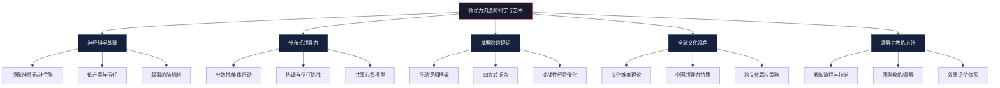
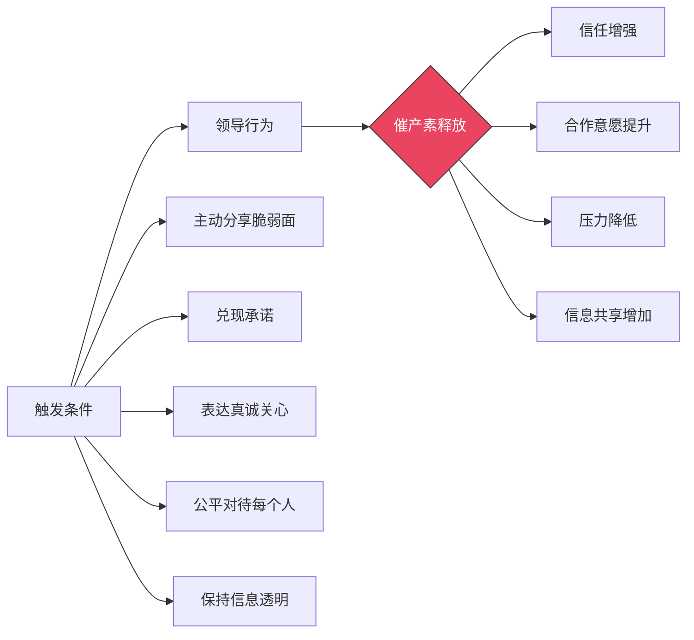
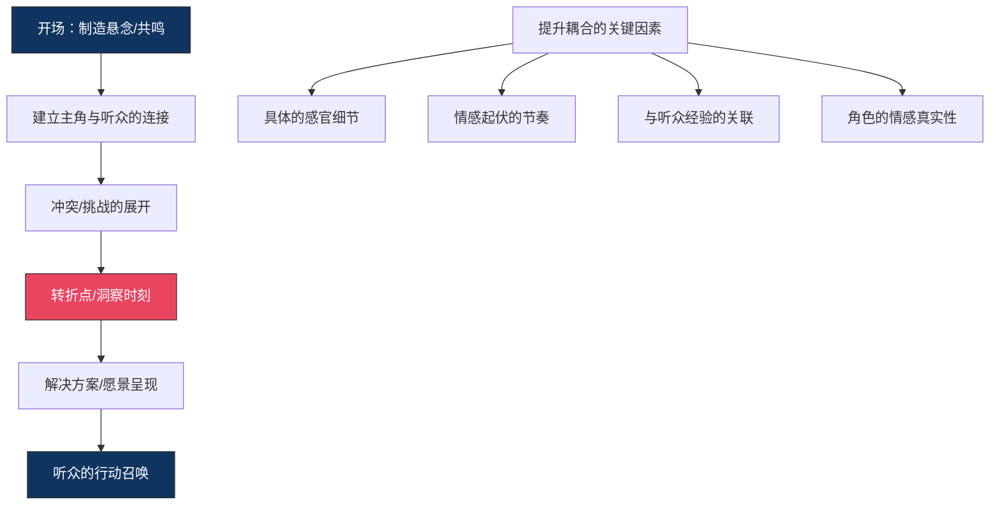
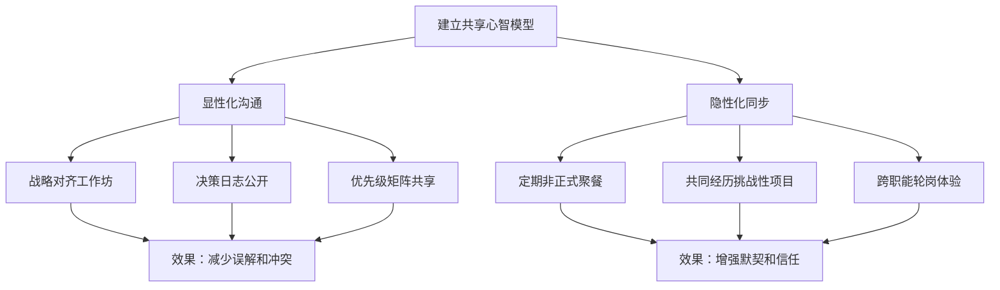
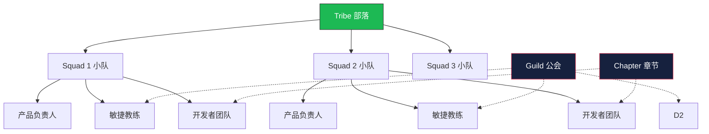
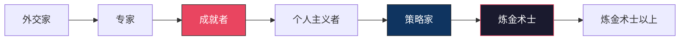
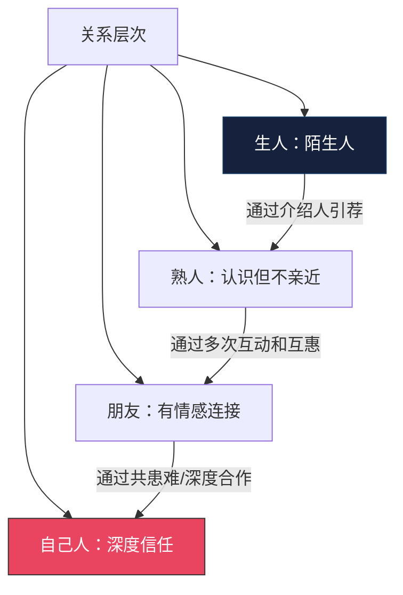
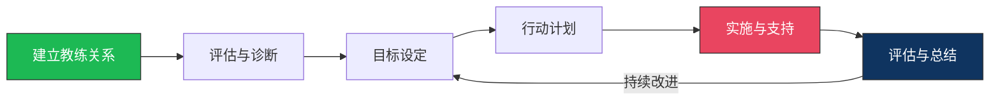

# 深度拓展：领导力沟通的科学与艺术

本章从神经科学、分布式领导力、发展阶段理论、全球文化视角和教练方法五个维度，对领导力沟通进行深度拓展。这些内容不是孤立的知识模块，而是相互交织的认知体系——神经科学解释"为什么有效"，发展阶段理论说明"领导者如何成长"，分布式领导力回答"领导力如何在组织中展开"，全球视角揭示"文化如何塑造领导力沟通"，教练方法则提供"如何系统提升"的路径。

---

## 一、领导力沟通的神经科学

### 1.1 领导力的脑神经基础

领导力沟通的神经科学研究旨在理解大脑如何处理领导相关的社会认知和沟通信息。这一领域的研究借助功能性磁共振成像（fMRI）、脑电图（EEG）、近红外光谱（fNIRS）等神经影像技术，揭示了领导力沟通背后的脑机制。理解这些机制不是学术兴趣——它直接解释了"为什么某些沟通方式有效而另一些无效"，从而让领导者能够基于科学而非直觉来优化自己的沟通策略。

#### 镜像神经元系统

镜像神经元（Mirror Neurons）是一类在个体执行动作和观察他人执行相同动作时都会激活的神经元。1992年，意大利帕尔马大学的Giacomo Rizzolatti团队在研究猕猴运动前皮层时偶然发现了这类神经元。后续人类脑成像研究证实，人类大脑中存在类似的镜像系统，主要分布在额下回（Broca区）、顶下小叶和颞上沟。

在领导力沟通中，镜像神经元系统起着关键作用——当领导者展示出自信、热情和同理心时，追随者的镜像神经元会被激活，从而产生"情感共鸣"。这解释了为什么有感染力的领导者能够通过自己的表达方式影响团队的情绪状态。

**具体机制：** 当领导者在演讲中展现真实的热情时，听众大脑中负责产生该情绪的区域会被同步激活。这不是"被说服"，而是自动的、无意识的神经模仿。神经科学研究者V.S. Ramachandran甚至预言，镜像神经元之于心理学的意义，如同DNA之于生物学。

**实操启示：**

| 镜像神经元激活条件 | 沟通策略 | 反面做法 |
|---|---|---|
| 观察到真实情感表达 | 用真实情感讲述愿景故事 | 用平淡语调念PPT要点 |
| 观察到身体动作同步 | 配合手势强调关键信息 | 站立僵硬不动 |
| 观察到面部表情变化 | 让表情反映内容的情感色彩 | 面无表情地讲激励性内容 |
| 观察到语音韵律变化 | 调整语速、音量和停顿 | 用单一语调持续讲话 |

#### 社会脑网络

社会脑（Social Brain）是指大脑中专门处理社会信息的神经网络，包括内侧前额叶皮层（mPFC）、颞顶联合区（TPJ）、前扣带回皮层（ACC）和杏仁核等区域。领导力沟通需要频繁调用社会脑网络来理解他人意图、预测他人行为、处理社交信号和管理社交关系。

Robin Dunbar的"社会脑假说"提出，人类大脑新皮层的扩大主要是为了应对复杂的社会关系管理。他估算，人类能够维持稳定社交关系的人数上限约为150人（即"邓巴数"）。这对领导力沟通的直接启示是：当团队规模超过150人时，领导者不可能与每位成员建立深度个人关系，必须依赖层级结构、文化价值观和制度来维持组织凝聚力。

**各脑区在领导力沟通中的功能分工：**

| 脑区 | 功能 | 领导力沟通应用 |
|---|---|---|
| 内侧前额叶皮层（mPFC） | 心智化——推断他人想法和感受 | 理解团队成员的真实需求和顾虑 |
| 颞顶联合区（TPJ） | 视角转换——站在他人立场思考 | 设计让不同受众都能理解的沟通策略 |
| 前扣带回皮层（ACC） | 冲突监测——发现信息不一致 | 识别团队中的认知冲突和价值观差异 |
| 杏仁核 | 威胁检测——快速情感反应 | 识别团队成员的恐惧、焦虑信号 |
| 脑岛 | 内感受觉知——感受身体状态 | 察觉自己的压力反应和直觉信号 |

#### 信任与催产素

神经科学研究发现，催产素（Oxytocin）在人际信任的建立中起着关键作用。Paul Zak的实验表明，当个体感受到被信任时，大脑会释放催产素，进而增强其对信任方的信任回报。这形成了一个"信任的正反馈循环"。

当领导者展示出真诚、透明和关怀的行为时，追随者的大脑会释放更多的催产素，从而增强信任感。这解释了为什么真诚的领导力沟通比技巧性的沟通更能赢得追随者的信任。

**催产素释放的触发条件及领导力应用：**

**实操策略——建立"高催产素"沟通环境：**

1. **分享脆弱面：** 适度分享自己的失败经历和学习心得，让团队看到你的真实一面。Brené Brown的研究表明，领导者展示脆弱（vulnerability）不是软弱，而是建立深层信任的最有效方式之一。
2. **一致性言行：** 神经科学发现，不一致的言行会激活ACC（冲突监测），导致信任下降。每一次言行不一致都会在追随者大脑中留下"警报信号"。
3. **物理接触与近距离：** 研究显示，面对面沟通比视频沟通更容易触发催产素释放（因为存在更多非语言线索和物理接近性）。对于关键的信任建立对话，尽量选择面对面方式。
4. **渐进式信任投资：** 信任的建立遵循"小步递进"原则——先在小事上展示信任，再逐步升级。一次性给予过大信任反而可能激活杏仁核的威胁检测。

#### 压力与皮质醇

领导力沟通中的压力情境会导致皮质醇（Cortisol）水平升高，影响前额叶皮层的功能，从而降低决策质量、创造力和社交认知能力。Amy Cuddy的研究指出，高压力状态不仅影响领导者的内在认知，还会通过姿态、面部表情和语音传播给团队，形成"压力传染"。

**皮质醇对领导力沟通的具体影响：**

| 皮质醇水平 | 认知状态 | 沟通表现 | 团队影响 |
|---|---|---|---|
| 正常（基线） | 清醒、专注 | 清晰表达、有效倾听 | 团队信任、高效协作 |
| 轻度升高 | 警觉、紧张 | 表达略显急促、注意力集中 | 团队轻微紧张但保持专注 |
| 中度升高 | 思维狭窄、防御性 | 沟通变得刻板、缺乏灵活性 | 团队出现焦虑传染 |
| 重度升高 | 思维冻结、决策瘫痪 | 沟通中断或情绪爆发 | 团队恐慌、信任崩溃 |

**领导者的压力管理工具箱：**

1. **正念呼吸（4-7-8法）：** 吸气4秒，屏气7秒，呼气8秒。研究显示，3-4个循环可以显著降低皮质醇水平。适合在重要会议前使用。
2. **认知重评（Cognitive Reappraisal）：** 将威胁性情境重新解读为挑战性情境。例如，将"这次演讲可能失败"重新定义为"这是一个展示学习和成长的机会"。神经影像学研究证实，认知重评能有效降低杏仁核的激活程度。
3. **力量姿势（Power Posing）：** 在重要沟通前，花2分钟做出扩展性的姿势（双手叉腰、身体舒展）。虽然学界对此方法的效应量存在争议，但多项复制研究确认其对主观自信感有正向影响。
4. **预先排练关键对话：** 对关键沟通进行预先排练可以降低不确定性带来的皮质醇释放。排练不仅包括内容，还包括对可能的反对意见和突发状况的应对。

---

### 1.2 领导力叙事的脑机制

叙事是领导力沟通的核心工具。神经科学研究揭示了领导力叙事如何影响追随者的大脑——叙事不是"讲故事的技巧"，而是一种深层的"脑对脑通讯协议"。

#### 神经耦合（Neural Coupling）

Princeton大学的Uri Hasson团队在2010年的开创性研究中发现，当听众理解说话者的故事时，他们的大脑活动模式会与说话者的大脑活动模式产生"耦合"——即听众的大脑活动开始"跟随"说话者的大脑活动。这种耦合程度越高，听众对故事的理解越深入。更关键的是，耦合效应具有"前瞻性"：听众大脑的活动变化有时会先于说话者的大脑变化，表明听众在主动预测故事的走向。

**这对领导力沟通意味着什么？** 有效的领导力叙事不仅是信息传递，更是大脑状态的同步。当领导者讲述一个有感染力的愿景故事时，他实际上在将自己的大脑状态"复制"到听众的大脑中。这解释了为什么同一份信息，用故事讲述比用PPT罗列要点的效果高出数倍。

**提升神经耦合的叙事结构：**

#### 默认模式网络的激活

当追随者听到领导者的愿景叙事时，他们的默认模式网络（Default Mode Network, DMN）会被激活。DMN与想象、未来规划和自我投射等认知功能相关。这意味着有效的愿景叙事能够激发追随者对未来的想象和投入。

**DMN激活的叙事设计原则：**

1. **使用"想象一下"开头的句式：** "想象一下，三年后我们的产品每天帮助一千万人完成他们的工作"比"我们的目标是三年内达到一千万日活"更能激活DMN。
2. **提供具体的感官细节：** "走进我们的新办公室，你看到开放式工位上每个团队都在热烈讨论，阳光从落地窗洒进来"比"我们会有更好的办公环境"更能激活想象。
3. **让听众成为故事的主角：** "当你的孩子问你'爸爸/妈妈，你每天在做什么'，你可以自豪地说……"——将听众本人置于叙事的中心，最大化自我投射效应。

#### 多巴胺奖赏系统

激励性的领导力叙事能够激活追随者的多巴胺奖赏系统，产生积极的情感体验和行动动机。这解释了为什么有感染力的领导力演讲能够激发人们的热情和行动力。

Paul Zak的实验发现，带有情感张力的故事（包含冲突和解决）比单纯的事实陈述能产生更多催产素释放和更多的后续合作行为。故事中的紧张和释放循环类似于"多巴胺的过山车"——紧张时多巴胺下降（期待），解决时多巴胺飙升（奖赏），这种波动本身就让人上瘾并加深记忆。

**多巴胺驱动的叙事设计公式：**

多巴胺叙事 = 冲突张力 + 情感真实 + 解决满足 + 行动启发

冲突张力："我们的市场份额连续三个季度下滑，竞争对手正以三倍的速度推出新功能。"
情感真实："说实话，看到这些数字的那个晚上，我整夜没睡。"
解决满足："但正是在那个深夜，我想起了我们的核心优势——我们比任何人都更了解用户的痛点。"
行动启发："所以从明天开始，每个产品经理每周花两天时间直接和用户对话。"

---

### 1.3 神经科学在领导力沟通中的应用

基于神经科学研究的发现，可以提炼出以下领导力沟通的实践框架。

#### N.E.U.R.O. 沟通框架

| 步骤 | 原则 | 神经科学依据 | 具体做法 |
|---|---|---|---|
| **N** — Nurture Trust（培育信任） | 信任优先 | 催产素系统 | 先花时间建立关系，再推动行动；主动分享信息和脆弱面 |
| **E** — Engage Emotion（调动情感） | 情感先行 | 杏仁核与边缘系统 | 用故事和画面替代数据表格；先打动心，再说服脑 |
| **U** — Unify Brain States（统一脑状态） | 神经耦合 | 镜像神经元/神经耦合 | 用具体的感官细节和情感节奏同步听众的大脑 |
| **R** — Reduce Threat（减少威胁感） | 心理安全 | 杏仁核威胁检测 | 创造安全的沟通氛围；避免公开批评；鼓励不同意见 |
| **O** — Optimize State（优化状态） | 状态管理 | 前额叶/皮质醇 | 管理自己的压力状态；在重要沟通前做准备；注意非语言信号 |

#### 应用案例：变革沟通的神经科学设计

**场景：** 公司即将进行大规模组织重组，需要向全体员工传达。

**传统做法（低效）：** 发一封邮件说明重组方案、时间线和影响。

**神经科学设计（高效）：**

1. **N — 先培育信任（前2周）：** CEO录制视频，坦诚分享公司的挑战和自己对未来的思考，主动展示脆弱面。催产素释放，信任度提升。
2. **E — 调动情感（第3周）：** 组织小型座谈会，分享老员工在公司成长的故事，唤醒集体记忆和归属感。杏仁核和海马体激活，情感连接建立。
3. **U — 统一脑状态（第4周）：** 在全员大会上，用具体的画面描述重组后的愿景——"想象一下，明年这个时候，每个产品团队都拥有端到端的决策权，你不再需要等待四层审批才能修复一个bug。"DMN激活，愿景共情。
4. **R — 减少威胁感（贯穿全程）：** 建立FAQ通道，每周更新，对敏感问题不回避。杏仁核威胁信号降低。
5. **O — 优化状态（实施阶段）：** 为管理者提供变革沟通培训，帮助他们管理自己的压力反应，避免压力传染给团队。

#### 常见误区

| 误区 | 神经科学真相 | 正确做法 |
|---|---|---|
| "只要逻辑严密就能说服人" | 人脑是先情感后逻辑的——情感通道堵住了，逻辑信息进不去 | 先建立情感连接，再呈现逻辑论证 |
| "好的演讲靠记忆和背诵" | 背诵式表达缺乏情感波动，无法触发神经耦合 | 掌握框架，在框架内自然表达 |
| "领导者要永远保持冷静" | 过度控制的情感表达显得不真实，降低催产素释放 | 在适当情境下展示真实情感，包括焦虑和决心 |
| "信息越多越有说服力" | 大脑的工作记忆容量有限（Miller的7±2法则），信息过载导致认知疲劳 | 突出3个核心信息点，用故事包裹 |

---

## 二、分布式领导力中的沟通

### 2.1 分布式领导力的概念与特征

分布式领导力（Distributed Leadership）是一种新兴的领导力范式，强调领导力不是集中在单一领导者身上，而是分布在组织的多个层面和多个成员之间。这一概念由Gronn（2002）和Spillane（2006）等学者提出和发展。

分布式领导力与传统的"英雄式领导"形成鲜明对比：

| 维度 | 英雄式领导 | 分布式领导力 |
|---|---|---|
| 领导力来源 | 个人特质和职位 | 互动过程和集体智慧 |
| 决策模式 | 自上而下 | 多向互动 |
| 信息流动 | 层级传递 | 网络化共享 |
| 适应性 | 依赖领导者个人判断 | 依赖系统的学习能力 |
| 风险点 | 关键人物离开导致真空 | 协调成本和角色模糊 |
| 适用场景 | 危机时刻、明确方向 | 复杂创新、知识密集型工作 |

分布式领导力的核心特征包括：

- **领导力的分散性：** 领导力不局限于正式的领导职位，而是分布在组织的各个层面。
- **集体行动：** 领导力是通过集体的互动和协作实现的，而非单个领导者的行动。
- **情境依赖性：** 领导力的分布在不同的情境和任务中可能发生变化——同一团队中，A场景下由张三主导，B场景下可能由李四主导。
- **互依性：** 分布式领导力中的各个角色相互依赖，共同对领导力的效能负责。

### 2.2 分布式领导力中的沟通挑战

分布式领导力对沟通提出了独特的挑战。这些挑战不是"做到就行"的简单问题，而是需要系统性机制来解决的结构性难题。

#### 挑战一：协调复杂性

当领导力分布在多个角色之间时，协调各方的行动和决策变得更加复杂。每增加一个分布式决策节点，可能的沟通路径数量呈指数级增长。一个5人领导团队的沟通路径为10条（n(n-1)/2），10人则增长到45条。

**具体表现：**
- 多个领导者可能同时向同一团队发出不同优先级的指令
- 信息在多层级传递中失真或延迟
- 决策权边界不清晰导致"要么都管，要么都不管"

#### 挑战二：身份模糊性

在分布式领导力中，领导角色的边界可能不够清晰，这可能导致责任推诿或权力冲突。当"谁负责什么"没有明确答案时，团队成员不知道该听谁的，领导者之间也容易产生摩擦。

#### 挑战三：一致性挑战

分布式领导力需要确保不同领导者传递的信息和价值观保持一致。信息不一致可能导致团队困惑和信任缺失。例如，产品负责人告诉团队"质量第一"，而工程负责人说"速度优先"，团队将陷入认知失调。

#### 挑战四：信任建设

在分布式领导力中，信任不仅需要在领导者和追随者之间建立，还需要在各个领导者之间建立。这意味着信任网络的规模从线性增长变为指数级增长。

### 2.3 分布式领导力的沟通策略

#### 策略一：建立共享心智模型

共享心智模型（Shared Mental Model, SMM）是分布式领导力有效运作的基础。SMM包括两种类型：任务模型（对工作流程和任务需求的共同理解）和团队模型（对团队成员能力、偏好和工作风格的共同理解）。

**建立SMM的沟通方法：**

**具体实施方法：**

1. **战略对齐工作坊（季度）：** 每季度组织所有分布式领导者参加战略对齐工作坊，共同回顾目标进展、讨论优先级调整、对齐下一季度的行动方向。工作坊应包含结构化的讨论环节，而非仅仅是汇报。
2. **决策日志公开：** 建立决策日志制度——每个分布式领导者记录自己做出的重要决策及其理由，并在共享平台上公开。这不仅促进信息透明，也帮助其他领导者理解决策逻辑。
3. **"影子日"制度：** 每位分布式领导者每季度花一天时间"影子跟随"另一位领导者，观察其工作方式和决策过程。这种亲身体验能有效更新团队模型。

#### 策略二：透明的信息共享

建立开放的信息共享机制，确保所有相关人员能够及时获得决策所需的信息。信息透明可以减少误解和冲突，增强团队的协调能力。

**信息共享的分层设计：**

| 信息层级 | 共享范围 | 共享方式 | 频率 |
|---|---|---|---|
| 战略信息 | 全体分布式领导者 | 月度战略简报 | 每月 |
| 运营信息 | 相关领导者+团队 | 周报/看板 | 每周 |
| 决策背景 | 相关人员 | 决策日志/Slack频道 | 实时 |
| 敏感信息 | 核心领导者 | 一对一对话 | 按需 |

#### 策略三：定期对话与反思

建立定期的团队对话和反思机制，让团队成员分享各自的进展、挑战和学习。AAR（After Action Review，行动后回顾）是一种简单有效的结构化反思方法：

AAR四步法：
1. 我们预期会发生什么？（计划对比）
2. 实际发生了什么？（事实回顾）
3. 为什么会有差异？（原因分析）
4. 下次我们怎么做会更好？（改进行动）

#### 策略四：灵活的沟通渠道

根据不同的情境和需求，灵活运用多种沟通渠道：

| 沟通目标 | 推荐渠道 | 原因 |
|---|---|---|
| 传递重要决策 | 面对面会议/视频会议 | 需要非语言线索和即时互动 |
| 日常协调 | 即时消息（Slack/飞书/钉钉） | 快速、异步、可追溯 |
| 复杂讨论 | 文档协作+评论 | 给各方思考时间，避免群体思维 |
| 争议性话题 | 小范围面对面会议 | 需要信任和安全的讨论氛围 |
| 跨时区协调 | 录制视频更新+文档 | 尊重不同工作时间 |

#### 策略五：冲突管理机制

在分布式领导力中，不同角色之间的冲突不是异常情况，而是结构性必然。关键不是避免冲突，而是建设性地管理冲突。

**冲突管理的三级响应机制：**

1. **一级（自行解决）：** 当冲突仅涉及两个领导者且不涉及战略方向时，由双方直接对话解决。组织应提供冲突沟通的培训和工具。
2. **二级（调解介入）：** 当冲突升级或涉及多方利益时，由中立的第三方（如另一位领导者或HR）进行调解。
3. **三级（裁决决策）：** 当冲突无法通过调解解决时，由更高层级的领导者做出最终裁决。裁决应透明、有依据，并记录在决策日志中。

### 2.4 分布式领导力在不同组织中的应用

#### 教育领域的分布式领导力

在学校中，分布式领导力表现为校长、教师、家长和社区共同参与学校的领导和决策。研究显示，采用分布式领导力的学校在教学质量和学生发展方面表现更好。

**案例：** 芬兰教育系统是分布式领导力的典范。芬兰学校没有"教学主任"来检查教师的教学质量，而是通过教师之间的同行学习、专业自治和集体责任来维持高质量教学。教师拥有高度的专业自主权，同时通过定期的教研组会议和校际合作来保持一致性。

#### 医疗领域的分布式领导力

在医院中，分布式领导力表现为医生、护士、管理人员和其他医疗专业人员共同参与医疗服务的领导和改进。分布式领导力有助于提升医疗团队的协作效率和患者安全。

**案例：** 约翰·霍普金斯医院推行的"CUSP"（Comprehensive Unit-based Safety Program）项目采用了分布式领导力模式——每个病区由医生、护士、药剂师和质量改进专员组成安全领导团队，共同识别风险、制定改进措施。该项目将中心静脉导管感染率降低了近70%。

#### 科技公司的分布式领导力

许多科技公司采用分布式领导力模式，通过跨功能团队、扁平化组织结构和自主管理来激发创新和敏捷性。

**Spotify的"部落-小队"模型详解：**

- **Squad（小队）：** 跨功能的自组织团队，拥有端到端的产品开发能力，像一个小型创业公司。
- **Tribe（部落）：** 多个小队的集合，共享一个大的产品领域，由Tribe Lead协调。
- **Chapter（章节）：** 同一专业领域（如前端开发）的人跨小队组成的横向社区，由Chapter Lead管理（通常是小队成员的直线经理）。
- **Guild（公会）：** 自愿参加的跨部落兴趣社区，关注特定主题（如测试自动化、性能优化）。

这个模型的精髓在于：纵向的小队负责"做什么"，横向的章节和公会负责"怎么做得更好"，形成了一种网格化的分布式领导力结构。

---

## 三、领导力发展的阶段理论

### 3.1 领导力发展的纵向视角

传统的领导力研究主要关注领导力的横向维度——即领导者具备哪些特质、技能和行为。近年来，领导力研究越来越关注纵向维度——即领导力是如何随着时间的推移而发展和深化的。领导力发展的阶段理论试图描述领导者从初级到高级的成长过程。

**横向维度 vs 纵向维度的类比：**

| 维度 | 横向发展 | 纵向发展 |
|---|---|---|
| 类比 | 学习更多技能（更多的工具） | 提升操作系统版本（更强的处理能力） |
| 领导力内容 | 更多管理技能、更多的知识 | 更复杂的认知、更广阔的视角、更深的自我觉察 |
| 发展方式 | 培训、阅读、实践 | 挑战性经验、反思、教练 |
| 速度 | 可以快速积累 | 缓慢且非线性 |
| 局限 | 不改变"操作系统"——同样的认知框架面对更复杂的问题会力不从心 | 核心发展，改变看待世界的方式 |

### 3.2 主要的领导力发展阶段模型

#### Cook-Greuter的自我发展九阶段模型

这一模型基于Susan Cook-Greuter博士的研究，描述了领导者自我认知的九个发展阶段。该模型建立在Jane Loevinger的自我发展理论和Robert Kegan的成人发展理论之上，经过对数千名管理者的访谈和评估验证。

| 阶段 | 名称 | 核心特征 | 领导力表现 |
|---|---|---|---|
| 1 | 前社会阶段 | 无自我意识 | 不适用 |
| 2 | 冲动型 | 以自我为中心，即时满足 | 需要直接监督，难以领导他人 |
| 3 | 机会主义型 | 操控性，利益驱动 | 短期导向，关系工具化 |
| 4 | 顺从型 | 遵循规则和群体规范 | 善于执行，缺乏独立判断 |
| 5 | 专家型 | 追求专业能力和个人卓越 | 技术权威，但可能忽视他人观点 |
| 6 | 成就者型 | 目标导向，系统思维 | 战略规划能力，注重结果和效率 |
| 7 | 个人主义者型 | 意识到视角的多元性 | 开始容纳不同观点，关注自我发展 |
| 8 | 自治型 | 尊重他人自主权，系统整合 | 能处理复杂矛盾，建立自主性团队 |
| 9 | 建构觉察型 | 保持多个视角的灵活切换 | 创造性整合，深度同理心 |
| 10 | 统一型 | 看到万物的内在联系 | 超越自我，服务于更大的使命 |

**关键洞察：** 研究显示，大多数成年领导者处于"成就者阶段"（约30-35%的管理者），这意味着他们能够制定战略目标和执行计划，但可能难以容纳与自己认知框架不一致的信息。只有约5-8%的管理者达到"自治型"或更高的阶段。

#### Torbert的行动逻辑框架

William Torbert基于发展心理学和组织行为学的研究，提出了七种"行动逻辑"（Action Logics），描述了领导者在组织中的不同行为模式：

**各行动逻辑的领导力沟通特征：**

- **外交家（Diplomat）：** 关注被接纳和归属感，避免冲突。沟通风格：礼貌、避免争议、遵循社交规范。局限：难以处理需要直面冲突的情境。
- **专家（Expert）：** 关注专业正确性和个人效率。沟通风格：数据驱动、逻辑严密、强调专业知识。局限：可能忽视情感因素和他人观点。
- **成就者（Achiever）：** 关注目标达成和组织效能。沟通风格：目标明确、结果导向、善于制定计划。局限：在高度模糊的情境中可能感到不适。
- **个人主义者（Individualist）：** 关注自我意识和差异化。沟通风格：开放探索、质疑假设、重视个人成长。局限：可能被视为"特立独行"。
- **策略家（Strategist）：** 关注组织变革和系统整合。沟通风格：善于创建愿景、处理复杂矛盾、发展组织能力。这是大多数高效领导者所在的发展阶段。
- **炼金术士（Alchemist）：** 关注社会变革和跨界整合。沟通风格：能够同时处理多个时间维度（历史、当下、未来），将对立的力量创造性地整合。

#### Kegan的成人发展理论

哈佛大学Robert Kegan教授的成人发展理论描述了成人认知能力的几个发展阶段。Kegan的独特贡献在于他的"主体-客体"理论——在每个发展阶段，个体以前一阶段的"主体"（即你身处其中、无法看到的框架）转化为"客体"（即你可以看到和反思的对象）。

| Kegan阶段 | 主体（你看不到的） | 客体（你能看到的） | 领导力影响 |
|---|---|---|---|
| 第3阶：社会化心智 | 他人的期望和评判 | 自己的具体需求和欲望 | 难以做违背共识的决策 |
| 第4阶：自主心智 | 自己的身份认同和价值观 | 他人的期望和规范 | 能坚持原则，但可能过于刚性 |
| 第4.5阶：自我探索 | 介于自主和自我转化之间 | 开始质疑自己的身份框架 | 创造力和灵活性增加 |
| 第5阶：自我转化心智 | 自己的"操作系统"本身 | 多个身份系统和价值观框架 | 能容纳矛盾，创造新的整合 |

**关键洞察：** Kegan估计约65%的成人从未超越第3阶（社会化心智），约30%达到第4阶（自主心智），只有约5%达到第5阶（自我转化心智）。这意味着大多数领导者倾向于遵循"他人期望"或"自己的价值框架"，只有少数领导者能够真正容纳多重框架并创造性地整合它们。

### 3.3 领导力发展的关键转折点

领导力发展通常不是线性的渐进过程，而是通过关键的转折点实现阶段性的跳跃。这些转折点通常伴随着深层的认知重构和身份转变。Michael Lombardo和Robert Eichinger的研究（Center for Creative Leadership）指出，约70%的领导力发展来自挑战性工作经验，20%来自人际关系（教练、导师），10%来自正式培训。

#### 第一次重大转折：从个人贡献者到团队领导者

**转变本质：** 从"通过自己创造价值"转向"通过他人创造价值"。

**核心挑战：**
- 身份认同转变："我不再是最厉害的技术专家，而是帮助别人成为厉害的技术专家"
- 从"做"到"管"：工作成果不再取决于自己双手的产出，而取决于团队的能力和动力
- 关系复杂度跃升：从管理自己的工作关系到管理团队内部和外部的多重关系

**沟通能力的具体变化要求：**

| 能力维度 | 个人贡献者 | 团队领导者 |
|---|---|---|
| 向上沟通 | 汇报个人工作进展 | 汇报团队进展、争取资源、管理上级期望 |
| 平行沟通 | 技术讨论、协作请求 | 跨团队协调、利益谈判、信息共享 |
| 向下沟通 | 不适用 | 分配任务、提供反馈、激励发展、处理冲突 |
| 自我对话 | "我怎么解决这个问题" | "谁最适合解决这个问题" |

**实操建议：**
- **"10次管理挑战"练习：** 新任管理者在第一个月内完成10次关键管理对话——5次一对一反馈（包括至少1次困难反馈）、3次任务分配对话、2次向上沟通对话。每次对话后写反思日志。
- **"不做英雄"自律：** 当团队遇到困难时，克制住自己亲自上阵的冲动。改为问："你觉得可以怎么做？需要我提供什么支持？"

#### 第二次重大转折：从职能领导者到跨职能领导者

**转变本质：** 从"理解一个专业的深度"转向"理解多个专业的宽度"。

**核心挑战：**
- 认知复杂度跃升：需要同时理解多个职能领域的语言、逻辑和优先级
- 利益相关者激增：从管理团队内部到管理多个团队和部门
- 价值观冲突：不同职能可能有不同甚至矛盾的优先级（如产品vs.工程、销售vs.合规）

#### 第三次重大转折：从执行领导者到战略领导者

**转变本质：** 从"如何做好事情"转向"做正确的事情"。

**核心挑战：**
- 时间视野拉长：从季度目标到3-5年战略
- 不确定性增加：从已知目标到探索方向
- 影响力扩大：从直接影响到通过组织文化和制度间接影响

#### 第四次重大转折：从组织领导者到系统领导者

**转变本质：** 从"管理一个组织"转向"影响一个生态系统"。

**核心挑战：**
- 视角跃升：从组织内部到行业、社会、全球层面
- 权力性质变化：从正式权力到影响力（你无法"命令"生态系统的参与者）
- 复杂性管理：从可控的组织复杂性到不可控的系统复杂性

### 3.4 领导力发展的实践启示

#### 构建个人领导力发展计划

基于发展阶段理论，可以设计系统化的领导力发展计划：

**步骤一：评估当前阶段**
- 使用领导力评估工具（如Leadership Development Profile, LDP）确定当前发展阶段
- 收集360度反馈，了解他人对自己领导力的感知
- 自我反思：你在什么情境下感到最不适？最不适的情境往往指向你尚未发展出的能力。

**步骤二：识别发展任务**
- 根据当前阶段和目标阶段的差距，确定需要发展的核心能力
- 优先发展对当前角色影响最大的能力

**步骤三：设计挑战性体验**
- 研究一致表明，挑战性的工作经验是领导力发展的最有效催化剂
- 这些经验包括：承担更大的责任、处理复杂的问题、应对失败和挫折、在不同的文化环境中工作

**具体的发展性挑战清单：**

| 发展阶段 | 推荐的挑战性经验 |
|---|---|
| 从个人贡献者到管理者 | 领导一个跨职能项目；做一次需要协调多方利益的决策；处理团队成员的绩效问题 |
| 从职能到跨职能 | 轮岗到另一个职能工作6-12个月；领导一个跨部门变革项目；处理多方利益冲突 |
| 从执行到战略 | 主导一次战略规划流程；进入一个全新市场或产品线；面对一次重大的战略决策 |
| 从组织到系统 | 代表组织参与行业协会或公共政策讨论；主导一次生态系统层面的协作倡议 |

**步骤四：建立反思和反馈机制**
- 经验本身不足以促进发展，关键在于对经验的反思
- 建议：每周花30分钟写领导力反思日志，使用"发生了什么→我做了什么→效果如何→下次可以怎么做"的结构
- 寻找3-5位信任的反馈来源，定期询问："在我最近的领导行为中，你看到哪些是有效的？哪些需要改进？"

**步骤五：寻求教练和指导**
- 专业的教练和有经验的导师可以为领导力发展提供重要的支持
- 教练和导师的区别：教练帮助你发现自己的答案，导师分享自己的经验
- 建议：同时拥有教练和导师——教练帮助你发展思考方式，导师帮助你理解行业和组织

---

## 四、领导力沟通的全球视角

### 4.1 文化维度与领导力沟通

领导力沟通深受文化背景的影响。Geert Hofstede的文化维度理论、Edward T. Hall的高低语境理论和GLOBE（Global Leadership and Organizational Behavior Effectiveness）研究项目是理解文化对领导力沟通影响的三大理论框架。

#### Hofstede六大文化维度

| 文化维度 | 高分文化特征 | 低分文化特征 | 对领导力沟通的影响 |
|---|---|---|---|
| **权力距离** | 中国、印度、马来西亚 | 丹麦、瑞典、新西兰 | 高：领导者的权威不容质疑，沟通更正式；低：领导者被视为"同级中的协调者"，沟通更平等 |
| **个人主义/集体主义** | 美国、英国（个人主义） | 日本、韩国（集体主义） | 个人主义强调个人成就和直接表达；集体主义强调团队和谐和间接表达 |
| **不确定性回避** | 日本、德国、法国 | 美国、英国、新加坡 | 高：需要详细计划和规则；低：接受模糊性和即兴应对 |
| **男性化/女性化** | 日本、匈牙利（男性化） | 瑞典、挪威（女性化） | 男性化强调竞争和成就；女性化强调合作和生活质量 |
| **长期导向/短期导向** | 中国、日本、韩国 | 美国、英国、尼日利亚 | 长期导向注重持续改进和耐心；短期导向注重快速结果 |
| **放纵/克制** | 墨西哥、哥伦比亚 | 俄罗斯、中国 | 放纵文化接受自由表达情感；克制文化更约束情感表达 |

#### Hall的高低语境理论

| 维度 | 高语境文化 | 低语境文化 |
|---|---|---|
| **代表文化** | 中国、日本、韩国、阿拉伯国家 | 美国、德国、瑞士、北欧 |
| **信息传递方式** | 大量依赖上下文、非语言线索和隐含含义 | 直接、明确、字面表达 |
| **领导力沟通特征** | 领导者通过"言外之意"传达信息；需要"读懂空气" | 领导者明确说出期望和标准；书面沟通为王 |
| **冲突处理** | 间接、维护面子、通过第三方调解 | 直接面对、就事论事、当面讨论 |
| **典型沟通失误** | 对低语境文化的人说得太含蓄 | 对高语境文化的人说得太直接 |

#### GLOBE研究的关键发现

GLOBE项目覆盖了62个国家，是迄今最大规模的跨文化领导力研究。其核心发现包括：

1. **普遍受欢迎的领导力特质：** 诚信（integrity）、魅力型领导（charismatic leadership）、团队导向（team orientation）在全球所有文化中都受到正面评价。
2. **普遍不受欢迎的领导力特质：** 自我保护（self-protective）和自我中心（face-saving）在所有文化中都被负面看待。
3. **文化敏感的领导力特质：** 参与式领导、人本导向、自主性等特质的文化接受度差异显著。

### 4.2 全球领导力沟通的实践挑战

#### 跨文化领导力沟通的复杂性

在全球化的组织中，领导者需要与来自不同文化背景的团队成员沟通。这要求领导者具备文化智能（Cultural Intelligence, CQ），能够理解和适应不同的文化规范和沟通风格。

**文化智能的四个维度：**

| 维度 | 定义 | 发展方法 |
|---|---|---|
| CQ-认知 | 了解不同文化的知识和规范 | 阅读跨文化研究、学习目标文化的历史和价值观 |
| CQ-元认知 | 反思自己的文化假设和偏见 | 在每次跨文化互动前自问："我可能带有哪些文化假设？" |
| CQ-动机 | 对跨文化互动的兴趣和信心 | 设定跨文化发展目标、寻找跨文化学习机会 |
| CQ-行为 | 适应不同文化的行为能力 | 练习调整沟通风格、语言使用和非语言行为 |

#### 虚拟团队的领导力沟通

远程工作和虚拟团队的普及为领导力沟通带来了新的挑战。在虚拟环境中，非语言沟通线索减少（研究估计面对面沟通中有60-70%的信息来自非语言线索），时区差异增加了沟通的复杂性，文化差异可能在虚拟环境中被放大。

**虚拟团队领导力沟通的"3C"框架：**

1. **Clarity（清晰性）：** 在虚拟环境中，信息的清晰度要求更高——书面沟通需要更加结构化，会议需要更明确的议程和结论。
2. **Connection（连接性）：** 虚拟环境中，人与人之间的情感连接更难建立。领导者需要主动创造非正式互动的机会（如虚拟茶歇、线上团建）。
3. **Consistency（一致性）：** 虚拟团队需要更稳定的沟通节奏——固定的站会、周会和月度回顾，创造团队的"沟通节拍"。

#### 语言障碍

英语作为全球商业语言的普及并不能消除语言障碍。即使团队成员都使用英语，他们的英语水平、表达风格和文化背景的差异仍可能影响沟通的效果。

**应对语言障碍的策略：**
- **书面+口头双重确认：** 重要决策通过会议讨论后，再用书面形式总结确认，确保所有人理解一致。
- **使用简单英语：** 避免习语、俚语和复杂的长句。研究显示，当英语是第二语言时，信息理解率从母语的95%下降到约60-70%。
- **鼓励提问文化：** 主动询问"我的表达清楚吗？"而不是"你听懂了吗？"——后者暗示理解力不足，前者承认表达的责任在自己。

### 4.3 跨文化领导力沟通的策略

#### 发展文化智能

文化智能的发展需要长期投入，但可以从以下步骤开始：

1. **文化自我觉察：** 识别自己的文化编程——你的沟通风格、决策方式、冲突处理方式如何受到自己文化的影响？
2. **文化知识积累：** 系统学习目标文化的历史、价值观、沟通规范和禁忌。
3. **跨文化实践：** 寻找与不同文化背景的人合作的机会，从低风险的情境开始积累经验。
4. **跨文化反思：** 每次跨文化互动后进行反思——哪些互动顺利？哪些有误解？误解的根源是什么？

#### 建立共同的团队规范

在多元文化的团队中，建立明确的团队沟通规范可以减少文化差异带来的误解。团队规范应由团队成员共同讨论制定，而非由领导者单方面宣布。

**跨文化团队规范清单示例：**

沟通规范：
1. 会议语言为英语，所有人有权请求重复或澄清
2. 重要决策书面记录，并在24小时内分发确认
3. 不同意见可以私下或匿名提出
4. 跨时区会议轮换时间，不固定让某一时区承担不便

反馈规范：
1. 反馈采用"SBI"结构（Situation-Behavior-Impact）
2. 亚洲同事可以书面反馈替代当面反馈
3. 欧美同事注意表达方式，避免过于直接

决策规范：
1. 日常决策：负责人自主决定，知会相关人
2. 重要决策：至少48小时讨论期，考虑所有时区意见
3. 战略决策：面对面或视频会议，充分讨论后决定

#### 利用文化多样性作为优势

文化多样性不仅是挑战，也是创新和问题解决的资源。研究表明，多元文化团队在复杂问题解决上表现优于同质化团队，但前提是领导者能够有效管理多样性带来的张力。

**将文化多样性转化为优势的三种方法：**

1. **多视角头脑风暴：** 在解决问题时，明确要求每个人从自己的文化视角出发提供解决方案——不同文化对问题的理解和解决路径往往截然不同。
2. **文化配对：** 在项目中将不同文化背景的成员配对，让他们互补彼此的文化盲点。
3. **文化展示日：** 定期组织团队成员分享自己文化中的工作方式和最佳实践，促进相互学习。

### 4.4 中国领导力沟通的独特性

中国领导力沟通具有独特的文化特征，基于数千年的儒家文化传统和当代社会变革的交织。

#### 关系导向（Guanxi）

在中国文化中，人际关系（关系）在领导力沟通中起着核心作用。有效的中国领导者通常会投入大量时间和精力建立和维护关系网络。关系不仅是沟通的渠道，也是影响力的来源。

**关系建设的层次结构：**

**关系建设的实操建议：**
- **送礼文化：** 适度的礼物是关系建设的一部分，但需注意分寸——过于贵重可能被视为贿赂，过于廉价可能被视为敷衍。关键是"心意"而非"价值"。
- **饭局文化：** 中国的商业关系很大程度上在餐桌上建立。领导者应学会利用饭局进行非正式的关系建设——饭局不是"吃饭"，而是"社交剧场"。
- **互惠原则：** 中国的"人情"系统遵循严格的互惠原则。接受帮助意味着欠下"人情债"，需要在未来以适当的方式偿还。

#### 面子管理

"面子"概念深刻影响着中国领导力沟通的方式。有效的中国领导者会注意维护自己和他人的面子，避免在公开场合让人难堪。批评和反馈通常会以间接和委婉的方式表达。

**面子管理的沟通策略：**

| 情境 | 西方做法 | 中国本土做法 | 融合做法 |
|---|---|---|---|
| 给予负面反馈 | 当面直接说明 | 私下委婉暗示 | 私下用SBI框架（具体情境+行为+影响），给予改进建议 |
| 纠正下属错误 | 公开讨论（透明） | 私下沟通 | 私下一对一，承认下属的出发点是好的，讨论改进方案 |
| 表达不同意见 | 在会议上直接提出 | 会后私下提出 | 会前与关键决策者私下沟通，会上用"补充"而非"反对"的方式 |
| 承认自己的错误 | 直接承认 | 可能回避 | 公开承认错误，但同时说明已经采取的改进措施 |

#### 和谐与共识

中国文化强调和谐与共识，这影响着领导力沟通中冲突处理和决策的方式。中国的领导者通常会寻求共识，避免直接的对抗和冲突。

**和谐导向下的决策优化：**
- 中国文化中的共识决策可能非常高效（如果领导者拥有强大的关系网络和协调能力），也可能导致决策缓慢（如果过度追求表面和谐而回避真正的分歧）。
- 建议：在追求和谐的同时，建立"安全分歧"机制——如匿名意见收集、一对一私下讨论等，让真正的不同意见能够在不破坏和谐的前提下被表达和讨论。

#### 长幼有序

中国文化中的等级观念影响着领导力沟通中的信息流向和表达方式。下级通常对上级保持尊重，不敢轻易表达不同意见。这要求领导者主动创造开放的沟通氛围，鼓励坦诚的反馈。

**打破层级壁垒的实操方法：**
- **"领导最后发言"原则：** 在团队讨论中，领导者最后发言，避免自己的观点先入为主地影响团队。
- **"匿名意见箱"：** 建立匿名反馈渠道，让不敢当面表达的员工有安全的发声途径。
- **"新员工茶话会"：** 定期与新入职的员工座谈——新员工往往有"初来乍到的新鲜眼光"，他们的观察可能揭示老员工已经习惯的问题。
- **以身作则承认错误：** 领导者公开承认自己的错误和学习，这是最有效的信号——"犯错是可以的"。

---

## 五、领导力教练方法

### 5.1 领导力教练的理论基础

领导力教练（Leadership Coaching）是一种个性化的发展方法，通过一对一或小组教练关系，帮助领导者提升领导力效能。领导力教练不是"告诉领导者该怎么做"，而是通过结构化的对话过程，帮助领导者自己发现答案。

#### 四大理论支柱

| 理论基础 | 核心观点 | 对教练实践的启示 |
|---|---|---|
| **成人学习理论（Knowles）** | 成人学习者具有自我导向性、经验丰富性、学习准备性和问题中心性 | 教练应引导而非灌输；充分利用领导者的已有经验；聚焦真实工作问题 |
| **建构发展理论（Kegan/Cook-Greuter）** | 成人认知能力有发展阶段，发展的关键在于"主体→客体"的转化 | 教练应帮助领导者"看到"自己看不到的思维框架；通过挑战性对话推动认知发展 |
| **积极心理学（Seligman）** | 人的优势和积极情感是发展的重要资源 | 教练应帮助领导者识别和发展优势，而非只关注弱点；激发积极情感和意义感 |
| **系统理论** | 领导力不仅是个体行为，更是系统现象 | 教练应帮助领导者理解组织系统对个人行为的影响；培养系统思维能力 |

### 5.2 领导力教练的核心流程

领导力教练遵循结构化的流程，但保持足够的灵活性以适应每个领导者的需求。

#### 阶段一：建立教练关系

教练关系是领导力教练的基础。有效的教练关系建立在信任、尊重和保密性的基础上。

**关键做法：**
- **初次会谈（Chemistry Session）：** 在正式开始教练之前，安排一次30分钟的初步会谈，让双方评估是否适合合作。这次会谈不是"面试"，而是互相了解的过程。
- **明确"游戏规则"：** 在第一次正式会谈中，明确以下事项：教练目标、会谈频率和时长、保密原则、沟通方式、双方的角色和责任。
- **签订教练协议：** 即使是非正式的教练关系，也建议签署一份简单的书面协议，明确双方的期望和承诺。

#### 阶段二：评估与诊断

通过360度反馈、心理测评、面谈等方式，全面了解领导者的当前状况、优势和发展需求。

**常用评估工具：**

| 工具 | 类型 | 适用场景 |
|---|---|---|
| 360度反馈问卷 | 行为评估 | 了解他人对自己领导力的感知 |
| Leadership Development Profile（LDP） | 发展阶段评估 | 了解领导者当前的认知发展阶段 |
| CliftonStrengths（盖洛普优势识别） | 优势评估 | 识别领导者的天赋和优势 |
| EQ-i 2.0 | 情商评估 | 了解领导者的情商水平和薄弱领域 |
| Hogan Assessment | 性格评估 | 识别领导者的"暗面"风险因素 |
| MBTI/DISC | 行为风格评估 | 了解领导者的沟通和决策风格 |

#### 阶段三：目标设定

基于评估结果，与领导者共同设定明确的发展目标。目标应遵循SMART原则，但在教练中还需要增加一个维度——**个人意义**：这个目标对领导者个人意味着什么？

**目标设定的"GPS"框架：**
- **G（Goal）：** 具体的发展目标是什么？
- **P（Path）：** 达到目标需要经历哪些关键步骤？
- **S（Significance）：** 这个目标对你个人和职业发展有什么意义？

#### 阶段四：行动计划制定

制定具体的发展行动计划。行动计划应具有灵活性，可以根据实际情况进行调整。

**行动计划模板：**

发展目标：[具体、可衡量的发展目标]

关键行动：
1. [具体行动步骤] → 预期时间 → 里程碑指标
2. [具体行动步骤] → 预期时间 → 里程碑指标
3. [具体行动步骤] → 预期时间 → 里程碑指标

支持资源：
- 教练会谈：每两周一次，每次60分钟
- 发展性经验：[具体的工作挑战]
- 反馈来源：[具体的人和方式]
- 学习资源：[书籍、课程、案例]

检查点：
- 第2周：[检查内容]
- 第4周：[检查内容]
- 第8周：[中期评估]
- 第12周：[最终评估]

风险与应对：
- 风险1：[可能的障碍] → 应对：[策略]
- 风险2：[可能的障碍] → 应对：[策略]

#### 阶段五：实施与支持

在领导者实施行动计划的过程中，教练提供持续的支持、反馈和挑战。

**教练会谈的结构（GROW模型的升级版——CLEAR模型）：**

1. **C（Contract）：** 明确本次会谈的目标和规则
2. **L（Listen）：** 教练深度倾听领导者的叙述，不做评判
3. **Explore）：** 通过提问帮助领导者深入探索问题的本质和多种可能性
4. **A（Action）：** 帮助领导者确定具体的下一步行动
5. **R（Review）：** 回顾会谈的收获和下一步的承诺

#### 阶段六：评估与总结

定期评估教练过程的效果，总结学习成果和改进空间。

### 5.3 领导力教练的核心技能

#### 深度倾听

教练需要具备超越表面信息的倾听能力，能够听到领导者言语背后的情感、信念和假设。

**三层倾听模型：**

| 层次 | 关注点 | 教练的行为 | 示例 |
|---|---|---|---|
| 第一层：内容倾听 | 说话者说了什么 | 记住关键信息和事实 | 记录领导者描述的事件经过 |
| 第二层：情感倾听 | 说话者的感受是什么 | 捕捉情感信号，命名情感 | "我听到你说这些时，似乎有些焦虑" |
| 第三层：结构倾听 | 说话者的思维模式是什么 | 识别反复出现的假设和信念 | "你似乎有一个假设：如果我不亲力亲为，事情就会出问题" |

**第三层倾听是教练的核心能力。** 大多数人只能做到第一层和第二层，只有训练有素的教练能够稳定地做到第三层。第三层倾听不是"分析"说话者，而是"听到"说话者自己可能没有意识到的模式。

#### 有力提问

教练通过开放式、探索性和挑战性的问题来帮助领导者深入思考和扩展视角。

**不同类型的问题及其作用：**

| 问题类型 | 作用 | 示例 |
|---|---|---|
| 澄清问题 | 确保理解准确 | "当你说'没有进展'时，具体指的是什么？" |
| 探索问题 | 深入探索问题的本质 | "这个挑战背后，你认为真正的障碍是什么？" |
| 假设检验问题 | 挑战隐含的假设 | "你假设团队需要你的批准才能行动。这个假设从何而来？" |
| 视角转换问题 | 切换到不同的视角 | "如果你的竞争对手是你的教练，他们会给你什么建议？" |
| 行动导向问题 | 推动采取行动 | "在接下来一周内，你可以做的最小的一步是什么？" |
| 价值连接问题 | 连接到深层价值 | "如果这个目标实现了，对你个人而言意味着什么？" |

**教练提问的"禁区"：**
- **引导性问题：** "你不觉得你应该……吗？"（这不是提问，是伪装成提问的建议）
- **多重问题：** 一次问两三个问题（让领导者不知道该回答哪个）
- **"为什么"问题：** "你为什么那样做？"（容易引发防御——改用"是什么让你选择了那个方向？"）

#### 直接反馈

教练需要提供诚实、具体和建设性的反馈。有效的反馈能够帮助领导者看到自己的盲点。

**反馈的SBI+框架：**
- **S（Situation）：** 描述具体的情境
- **B（Behavior）：** 描述观察到的具体行为
- **I（Impact）：** 描述该行为产生的影响
- **+（Alternative）：** 提供一个可选的替代行为

#### 挑战与支持的平衡

教练需要在挑战领导者走出舒适区和提供情感支持之间找到平衡。过度的挑战可能导致防御，过度的支持可能导致停滞。

**判断挑战程度的信号：**

| 信号 | 含义 | 教练应对 |
|---|---|---|
| 领导者沉默、思考 | 恰当的挑战——正在消化 | 给予思考空间，等待回应 |
| 领导者情绪激动但继续探索 | 恰当的挑战——触及深层 | 同理心回应，继续探索 |
| 领导者变得防御、辩解 | 挑战过大——退回支持 | 调整强度，确认安全 |
| 领导者轻松带过 | 挑战不足——需要加大 | 用更直接的方式重复挑战 |

### 5.4 领导力教练的效果评估

领导力教练效果的评估是一个复杂的过程，需要考虑多个层面的指标。

**柯克帕特里克四级评估模型在教练中的应用：**

| 评估层级 | 评估内容 | 评估方法 | 时间点 |
|---|---|---|---|
| 第一级：反应 | 领导者对教练过程的满意度 | 教练结束后的满意度问卷 | 每次会谈后 |
| 第二级：学习 | 领导者的认知发展和能力提升 | 360度反馈对比、发展阶段评估 | 教练开始和结束时 |
| 第三级：行为 | 领导者在工作中的行为改变 | 上级和同事的行为观察、具体行为事件 | 教练结束后3-6个月 |
| 第四级：结果 | 对业务指标的影响 | 团队绩效、员工满意度、业务成果 | 教练结束后6-12个月 |

**ROI计算方法：**
教练ROI = (教练带来的收益 - 教练成本) / 教练成本 × 100%

收益指标（可量化）：
- 员工保留率提升（减少离职成本）
- 团队绩效提升（增加产出价值）
- 决策质量提升（减少错误决策成本）
- 冲突减少（减少协调成本）

教练成本：
- 教练费用（外部教练）或时间成本（内部教练）
- 领导者投入的时间
- 评估工具和管理成本

**研究数据：** ICF（International Coaching Federation）的全球教练调查显示，86%的公司报告教练的投资回报率为正向，其中报告ROI的公司中位数为7倍投资回报。

### 5.5 领导力教练的发展趋势

领导力教练领域正在经历快速发展和变革。

#### 趋势一：团队教练的兴起

传统的领导力教练主要是一对一的，越来越多的组织开始采用团队教练的方法来发展领导团队的集体领导力。

**团队教练 vs 个人教练：**

| 维度 | 个人教练 | 团队教练 |
|---|---|---|
| 关注焦点 | 个人领导力发展 | 团队集体效能 |
| 核心工具 | 深度对话 | 团队动态观察+集体反思 |
| 效果衡量 | 个人行为改变 | 团队协作质量提升 |
| 典型场景 | 新任管理者、晋升准备 | 新组建的领导团队、跨部门协作 |
| 挑战 | 个人投入度 | 团队动力复杂性 |

#### 趋势二：AI辅助教练

人工智能技术正在被应用于领导力教练，提供日常的反馈、追踪和提醒服务。AI辅助教练不是要取代人类教练，而是扩展教练服务的覆盖范围——让更多人能获得基本的教练支持。

**AI教练的合理定位：**
- **适合AI的：** 日常反馈、习惯追踪、信息提醒、模式识别（如分析沟通邮件的情感倾向）
- **不适合AI的：** 深层身份转变、复杂情感处理、价值观探索、组织政治导航

#### 趋势三：数据驱动的教练

通过数据分析技术，教练可以基于更全面和客观的数据来支持教练过程。例如，通过分析领导者的沟通模式（邮件频率、会议参与度、决策速度）和团队互动数据（网络分析、情感分析），提供更有针对性的教练支持。

#### 趋势四：教练督导（Coach Supervision）

教练督导正在成为领导力教练领域的专业标准。教练督导帮助教练反思自己的教练实践，提升教练能力，处理教练过程中的伦理和情感挑战。ICF已将教练督导作为高级认证的要求之一。

#### 趋势五：全球化教练

随着组织的全球化发展，跨文化领导力教练的需求不断增加。这要求教练具备跨文化的知识和能力，能够适应不同文化背景的领导者的需求。全球化教练需要具备CQ（文化智能），并且能够在教练过程中帮助领导者发展其自身的CQ。

---

## 六、综合应用框架

### 6.1 将五维知识整合为一体

以上五个维度不是独立的知识模块，而是相互关联的认知体系。以下是将它们整合应用的框架：

**整合应用的场景示例：**

| 场景 | 神经科学应用 | 发展阶段考量 | 分布式领导力应用 | 文化因素 | 教练方法 |
|---|---|---|---|---|---|
| 新任管理者赋能 | 信任建立（催产素）+ 情感叙事 | 识别第一次转折点的挑战 | 暂不适用（个人过渡） | 中国文化的层级期望 | 个人教练+导师配对 |
| 跨文化团队管理 | 减少威胁感（杏仁核）+ 非语言觉察 | 成就者阶段需扩展视角 | 建立共享心智模型 | GLOBE维度+高低语境 | 团队教练+文化培训 |
| 组织变革沟通 | 叙事脑机制+状态管理 | 评估组织整体发展阶段 | 多节点一致性传播 | 中国文化中的面子管理 | 管理者教练+变革支持 |
| 高管继任计划 | 深度信任+身份转变支持 | 从执行到战略的转折 | 培养分布式领导者 | 全球化视野培养 | 长期教练+发展性挑战 |

### 6.2 本章核心要点回顾

1. **神经科学告诉我们的不是"技巧"，而是"原理"：** 理解催产素、镜像神经元和多巴胺系统不是为了"操控"，而是为了让领导者的沟通更加符合人脑的工作方式。
2. **分布式领导力不是"人人都是领导"：** 而是在适当的时机让适当的人发挥领导作用，关键在于协调机制和共享心智模型。
3. **发展阶段不是"等级标签"：** 每个阶段都有其价值和局限，发展的关键在于"看到自己看不到的"。
4. **文化不是"刻板印象"：** 文化维度提供的是概率性的趋势，而非确定性的标签。每个个体都可能偏离其文化的"平均值"。
5. **教练不是"给答案"：** 教练的核心价值在于帮助领导者发展自己的认知能力，而非提供解决方案。

领导力沟通的科学与艺术，最终归结为一个核心命题：**理解人，尊重人，发展人。** 神经科学帮助我们理解人脑的工作方式，发展阶段理论帮助我们理解人的成长路径，全球视角帮助我们理解人的文化差异，教练方法则提供了系统性地帮助人发展的路径。这四者的交汇点，就是领导力沟通的本质。
