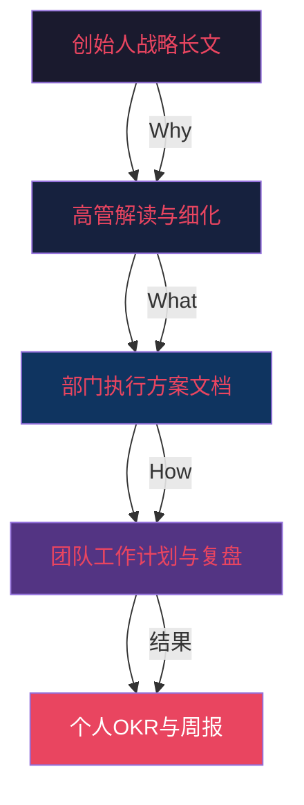
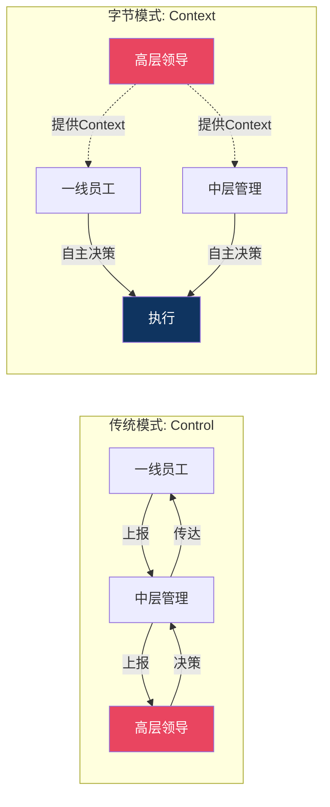

## 案例二：创业公司愿景传达——字节跳动的"始终创业"

### 背景：从0到千亿美元的沟通挑战

2012年，张一鸣在北京一套四居室公寓里创立了字节跳动，推出的第一款产品是"今日头条"——一个基于算法推荐的资讯平台。彼时中国互联网市场已被BAT（百度、阿里巴巴、腾讯）三巨头牢牢把控，一个没有社交关系链、没有内容储备、没有流量入口的创业公司，想要突围几乎是不可能的事。

然而到2025年，字节跳动已成为全球估值最高的未上市科技公司之一，旗下产品覆盖全球超过150个国家和地区，月活跃用户超过20亿。TikTok成为全球下载量最高的应用之一，抖音在中国日活用户超过7亿。公司员工从最初的几个人扩展到超过15万人，分布在全球200多个办公室。

这个过程中，张一鸣面临的领导力沟通挑战是多维度的：

**规模挑战**：当公司从10人到100人、1000人、1万人、10万人时，信息传递的路径呈指数级增长。创始人不可能再与每个员工面对面交流，传统的"师徒制"文化传承方式完全失效。

**速度挑战**：字节跳动的业务以极快的速度迭代和扩张。从资讯到短视频、从国内到海外、从ToC到ToB，每一次业务转向都需要全体员工理解新方向。如果愿景传达不到位，就会出现"上面在打仗，下面在赶路"的脱节现象。

**文化挑战**：当大量新员工涌入时，老员工的创业精神如何传递给新人？当公司从一个"小而美"的创业团队变成跨国巨头时，如何避免大公司病？这是字节跳动提出的"始终创业"理念要解决的核心问题。

**竞争挑战**：在激烈的互联网人才争夺战中，愿景传达不仅是内部管理工具，更是吸引和留住顶尖人才的关键。优秀工程师选择加入字节跳动，很多时候不是因为薪资，而是因为认同公司的使命和做事方式。

### 愿景的构建："始终创业"的内涵解析

"始终创业"不是一句简单的口号，而是字节跳动经过多轮演化后形成的系统性文化理念。理解这个愿景的构建过程，对于任何需要在组织中传达愿景的领导者都具有借鉴意义。

#### 第一阶段：从"技术信仰"到"信息创造价值"

张一鸣在创业初期的愿景表达是技术导向的——"用技术改善信息的生产和分发"。这个表述精准、具体，适合早期创业团队。它清晰地告诉团队：我们的核心竞争力是算法，我们的战场是信息分发。

这个阶段的愿景传达主要依靠"做"而非"说"。张一鸣本人就是一个极致的技术信仰者，他每天花大量时间阅读技术论文、研究产品数据。团队成员从他的行为中自然理解了公司的方向。

#### 第二阶段：从产品使命到企业愿景

随着产品线从今日头条扩展到抖音、西瓜视频、火山小视频等，单纯的"信息分发"已经不足以涵盖公司的全部业务。字节跳动将愿景升级为"激发创造，丰富生活"（Inspire Creativity, Enrich Life）。

这个转变的关键在于：愿景从描述"我们做什么"转向描述"我们为用户创造什么价值"。这与Simon Sinek的黄金圈法则高度吻合——用户买的不是你的产品，而是你的信念和它带来的改变。

#### 第三阶段："始终创业"的文化内核

当公司规模突破数万人时，字节跳动发现一个矛盾：公司的成功带来了资源和品牌优势，但也滋生了"大公司心态"——一些团队开始追求"稳"而非"快"，开始看重"流程"而非"结果"，开始习惯"汇报"而非"行动"。

张一鸣在多次内部讲话中反复强调一个观点：**创业精神不等于小公司状态，而是一种面对不确定性的思维方式**。他将"始终创业"分解为几个可操作的行为准则：

- **Day-1心态**：像第一天加入公司一样保持好奇心和紧迫感
- **追求极致**：不接受"差不多就行"，每个细节都有优化空间
- **务实敢为**：不空谈战略，快速试错，用结果说话
- **开放谦逊**：不因过去的成功而自满，持续向外界学习
- **坦诚清晰**：直接表达真实想法，不搞办公室政治

这些准则不是挂在墙上的标语，而是被嵌入到人才评估、晋升标准、团队复盘的每一个管理环节中。

### 沟通策略深度分析

#### 策略一：透明的信息共享——用信息民主化消除层级壁垒

**核心理念**：张一鸣认为，信息是决策的基础，信息不对称是组织低效的根本原因。在传统企业中，信息按照层级流动——高层知道最多，中层次之，基层最少。这种结构导致基层员工缺乏全局视角，无法做出最优决策。

**具体做法**：

字节跳动在内部推行了"Context, not Control"的管理理念。这个理念源自Netflix的文化手册，张一鸣将其深度本地化后融入了字节跳动的管理实践。其核心含义是：领导者应该提供充分的背景信息（Context），让员工自主做出决策（而非通过层层审批来控制执行）。

在工具层面，字节跳动使用自研的飞书（Lark）作为核心协作平台。飞书的设计理念本身就体现了信息透明的文化：

| 功能模块 | 透明化机制 | 对沟通的影响 |
|---------|-----------|------------|
| 云文档 | 默认全员可见，需主动设置权限 | 任何人的工作成果都可被查阅和学习 |
| OKR系统 | 全员OKR对所有人开放 | 每个人都能看到CEO的目标和进展 |
| 项目空间 | 项目进度、文档、讨论向全员开放 | 跨部门协作无需层层审批获取信息 |
| 飞书知识库 | 公司制度、流程、最佳实践集中沉淀 | 新员工可以快速获取所需知识 |
| 飞书多维表格 | 数据实时更新，多角色共享 | 决策依据对所有人透明可见 |

**实际效果与数据**：

字节跳动内部有一条不成文的规定：如果一个问题可以在飞书文档中找到答案，就不应该通过即时消息去问同事。这条规则极大减少了重复沟通的成本。据公开报道，字节跳动内部每天产生的飞书文档编辑量超过数千万次，文档成为了比即时消息更重要的信息载体。

**对创业公司的借鉴**：

信息透明不是简单的"信息共享"，而是一种管理哲学的转变。创业公司可以从小处开始实践：

1. 建立公司级的OKR文档，全员可查阅，每月更新
2. 重要决策的讨论过程（而非仅仅是结论）以文档形式沉淀
3. 新员工入职时提供一份"公司历史与文化"文档，由创始人亲自撰写
4. 定期举办全员问答会（AMA），创始人回答任何员工提出的任何问题

#### 策略二：书面沟通优先——用文字对抗信息衰减

**为什么书面沟通如此重要**：

口头沟通有一个天然的缺陷：信息衰减。当一个想法从创始人传递到高管、从高管传递到总监、从总监传递到一线员工时，每经过一个节点，信息都会被重新理解和转述。经过3-4层传递后，原始信息可能已经面目全非。

书面沟通可以有效解决这个问题。一份写好的文档可以被直接分享给任何人，不存在"传话走样"的问题。更重要的是，书面表达要求作者将模糊的想法结构化、逻辑化，这个过程本身就能提升思考的质量。

**张一鸣的书面沟通实践**：

张一鸣是"书面沟通"的坚定践行者。据公开资料，他在字节跳动内部写过大量长文，涵盖战略思考、产品理念、管理方法等多个维度。这些文档不是简单的"通知"，而是深度的思考分享。以下是他一些内部文档的主题方向（基于公开报道和离职员工的分享）：

- **关于创业心态**：解释为什么字节跳动需要"始终创业"，以及创业心态在不同业务阶段的具体表现
- **关于人才标准**：定义什么样的人适合字节跳动，以及"优秀"和"一般"的差距在哪里
- **关于决策方法**：如何在信息不完整的情况下做出决策，以及如何避免常见的决策偏误
- **关于组织效率**：分析哪些因素在降低组织效率，以及如何通过制度设计来改善

这些文档的共同特点是：**有观点、有论据、有具体例子、有行动建议**。它们不是空洞的"精神讲话"，而是可以被员工直接理解和执行的行动指南。

**书面沟通的层次结构**：

**创业公司如何建立书面沟通文化**：

1. **从创始人开始**：每月写一封全员信，分享公司的最新进展、面临的挑战、以及为什么做出某些关键决策
2. **建立文档模板**：为常见的沟通场景（项目启动、决策讨论、复盘总结）设计统一的文档模板，降低写作门槛
3. **用文档代替会议**：能用文档说清楚的事不开会，必须开会的事先发文档、会上只讨论
4. **建立知识库**：将公司的最佳实践、踩过的坑、成功经验系统性地沉淀为文档

#### 策略三：去层级化对话——打破权力距离的沟通设计

**权力距离与沟通质量的关系**：

组织行为学中有一个重要概念叫"权力距离"（Power Distance），由荷兰学者吉尔特·霍夫斯泰德（Geert Hofstede）提出。权力距离高的组织中，下属不敢对上级提出异议，信息只沿着层级自上而下流动；权力距离低的组织中，员工可以自由表达不同意见，信息多方向流动。

字节跳动刻意将权力距离降到最低。具体做法包括：

**"去总"文化**：在字节跳动内部，没有人称呼"张总"、"李总"，而是直呼其名或使用花名。这个看似简单的称谓改变，实际上深刻影响了沟通的心理状态。当一个基层员工称呼CEO为"一鸣"时，他在心理上更容易提出不同意见；而当他需要说"张总，我觉得..."时，心理上已经预设了服从的立场。

**扁平化组织结构**：字节跳动的组织架构相对扁平，很多团队只有2-3个层级。这意味着一线员工的想法可以直接传递给团队负责人，不需要经过多层中层管理者的"过滤"。

**跨级沟通机制**：字节跳动鼓励跨级沟通。一个工程师可以直接在飞书文档中@一个副总裁来提出建议或反馈问题，这在很多传统企业中是不可想象的。

**"虚线汇报"与项目制**：字节跳动大量采用项目制的工作方式，一个员工可能同时参与多个项目，向不同的项目负责人汇报。这种结构打破了传统科层制的信息孤岛效应。

**实践效果**：

字节跳动前员工在多个公开平台分享过他们的体验：在字节跳动，一个刚入职的应届生可以直接在全公司的文档中评论CEO的全员信，提出自己的看法。如果评论有见地，不仅不会被忽视，还可能被引用到后续的讨论中。这种文化极大地激发了员工的参与感和主人翁意识。

#### 策略四：数据驱动的决策沟通——让事实说话

**从"领导说了算"到"数据说了算"**：

在很多企业中，决策权与职位正相关——职位越高，话语权越大。这种模式的问题在于：职位高不等于信息全，经验多不等于判断准。特别是在互联网行业，市场变化极快，十年前的经验可能完全不适用于今天的环境。

字节跳动在决策沟通中强调一个原则：**"谁对听谁的，而不是谁大听谁的"**。这个原则的落地需要一套完整的数据基础设施来支撑：

| 决策环节 | 传统企业做法 | 字节跳动做法 |
|---------|------------|------------|
| 方案提出 | 领导提出方向，下属执行 | 任何人可提出方案，附数据论证 |
| 方案讨论 | 会议上口头讨论 | 飞书文档异步讨论，所有论据可追溯 |
| 方案决策 | 最高职位者拍板 | 基于数据和逻辑的共识决策 |
| 结果验证 | 靠感觉评估 | A/B测试量化效果 |
| 复盘总结 | 总结经验教训 | 数据对比，量化改进幅度 |

**A/B测试文化**：

字节跳动是A/B测试的重度使用者。据公开报道，今日头条和抖音的产品迭代中，任何一个界面上的按钮位置、颜色、文案的改变，都要通过A/B测试来验证效果。这种文化延伸到了管理决策中：当团队对某个方向有分歧时，不是靠争论来解决问题，而是设计一个小规模实验，让数据来说明问题。

这对领导力沟通的启示是：**当你的决策有数据支撑时，沟通的成本会大幅降低**。你不需要花大量时间去"说服"别人，只需要展示数据和逻辑。

**如何在创业公司中建立数据驱动的沟通文化**：

1. **定义关键指标**：为每个业务模块定义3-5个核心指标，确保团队对"什么是好的结果"有统一标准
2. **建立数据看板**：使用飞书多维表格、Metabase等工具建立实时数据看板，让数据对所有人透明
3. **培养"提出假设-验证-复盘"的思维习惯**：每个方案都要回答"你怎么知道这个方案有效？你准备怎么验证？"
4. **容忍失败，但要求学习**：A/B测试中90%的假设可能被证伪，这不要求——但每次失败都必须产出明确的学习结论

#### 策略五：高频、多渠道的愿景渗透

**单一渠道的局限**：

很多创业公司犯的一个错误是：愿景传达只在一个渠道进行——比如季度全员大会。问题是，季度大会的频次太低，信息密度太大，员工很难在一次会议中消化所有信息。更关键的是，大会上的信息传递是单向的，缺乏互动和反馈。

字节跳动采用了"高频、多渠道、多形式"的愿景渗透策略：

**渠道矩阵**：

| 渠道 | 频次 | 形式 | 目的 |
|-----|------|------|------|
| 创始人全员信 | 季度 | 长文 | 战略方向、重大决策的Why |
| 全员All Hands | 月度 | 视频+问答 | 双向沟通，回答员工疑问 |
| 部门周会 | 每周 | 文档+讨论 | 将公司愿景拆解为部门目标 |
| 1-on-1 | 每周/双周 | 面对面 | 将愿景与个人成长连接 |
| 飞书文档 | 随时 | 异步协作 | 日常工作中的愿景践行 |
| OKR复盘 | 季度 | 文档+评审 | 用目标追踪验证愿景落地 |
| 新员工培训 | 入职时 | 培训+导师 | 文化传承的第一步 |
| 内部论坛/社群 | 随时 | 讨论 | 自发的文化传播 |

**关键原则：每一条信息都要回答"So What"**

愿景传达最大的敌人是"与我无关"。当一个一线员工听到"我们要成为全球最大的内容平台"时，他可能会想："这跟我每天写的代码有什么关系？"

字节跳动的做法是：每一条愿景层面的信息，都要往下延伸到"这意味着你应该怎么做"。例如：

- **公司愿景**：激发创造，丰富生活
- **产品目标**：让用户在抖音上每天花费的时间从30分钟增加到40分钟
- **团队目标**：优化推荐算法，将用户满意度提升15%
- **个人目标**：在Q3完成视频理解模型的V2版本，准确率提升到92%

这种从愿景到个人目标的层层拆解，确保了每个员工都知道自己的工作如何与公司的宏大愿景产生连接。

### 领导力沟通的深层机制

#### "Context, not Control"的理论基础

张一鸣多次引用Netflix文化手册中的"Context, not Control"理念。这个理念的背后是领导力理论中的"共享式领导"（Shared Leadership）和"分布式认知"（Distributed Cognition）理论。

传统管理学认为，领导者的核心职责是"做决策"和"监督执行"。但在复杂多变的环境中，这种集中式决策模式会导致两个问题：

1. **信息瓶颈**：所有重要信息都汇聚到领导者一个人身上，超过认知负荷后决策质量下降
2. **响应延迟**：信息从一线传递到决策层需要时间，等到决策传达回来时，情况可能已经变化

"Context, not Control"的解决方案是：领导者不控制每个决策，而是确保每个决策者拥有足够的背景信息（Context）。这包括公司的战略方向、当前的优先级、可用的资源、以及历史的经验教训。

#### 坦诚文化的心理学基础

字节跳动的"坦诚清晰"原则有坚实的心理学基础。哈佛商学院教授艾米·埃德蒙森（Amy Edmondson）的研究表明，团队的"心理安全感"（Psychological Safety）是高绩效的最强预测因素之一。心理安全感指的是团队成员相信，即使自己犯了错误或提出了不同意见，也不会被惩罚或嘲笑。

张一鸣在内部多次强调"ego要小"——即不要让自尊心阻碍学习和改进。他本人也在公开场合多次承认自己的决策失误，这种领导者层面的"示弱"为整个组织建立了心理安全感的基调。

#### 文化传承的"涟漪效应"

字节跳动的文化传播模型可以用"涟漪效应"来理解：创始人是投入水中的石子，他的行为和信念以"波纹"的形式向外扩散。每一层管理者都是一个"涟漪节点"——他们不仅传递信息，更重要的是用自己的行为来诠释文化。

这个模型的关键在于：**如果任何一个涟漪节点的行为与文化理念不一致，信息就会在那个节点发生扭曲**。例如，如果一个总监口头上说"鼓励提出不同意见"，但在实际会议中总是打压异议，那么他所管理的整个团队都不会真正相信公司的"坦诚"文化。

字节跳动通过以下机制来确保涟漪效应的一致性：

1. **管理者的文化考核**：管理者不仅考核业务结果，还要考核文化践行情况，由下属匿名评估
2. **360度反馈**：每年进行360度评估，其中"是否践行公司价值观"是重要评估维度
3. **管理者培训**：新任管理者必须完成领导力培训，其中沟通技巧和文化传承是核心模块
4. **案例库建设**：将文化践行的正面和负面案例整理成内部培训材料

### 从字节跳动到你的创业公司：可落地的行动框架

#### 第一步：定义你的"始终创业"（第1-2周）

每个公司的愿景都应该是独特的，但方法论是通用的。以下是提炼愿景的具体步骤：

1. **回答三个核心问题**：
   - 为什么你的公司存在？（不是"做什么"，而是"为什么做"）
   - 你希望为用户/客户创造什么不可替代的价值？
   - 10年后，如果一切顺利，世界因为你而发生了什么变化？

2. **将愿景压缩到一句话**：这句话应该能让任何一个员工在30秒内向家人解释"我的公司在做什么"。字节跳动的"激发创造，丰富生活"就是一个优秀的范例。

3. **将愿景翻译成行为准则**：抽象的愿景需要被翻译成"在日常工作中这意味着什么"。字节跳动的"追求极致"翻译成了"每个产品页面的加载时间是否还可以再快0.1秒"。

#### 第二步：建立信息透明的基础设施（第3-4周）

选择合适的工具并建立使用规范：

- **协作工具选择**：飞书（适合国内团队）、Notion（适合国际化团队）、语雀（适合技术团队）
- **信息分类体系**：将信息分为"全员可见"、"部门可见"、"项目可见"三级，明确每级的范围
- **文档模板库**：为常见场景（项目启动文档、决策记录、复盘报告、周报）设计统一模板
- **更新频率约定**：OKR每月更新，全员信每季度一封，项目文档实时更新

#### 第三步：创始人以身作则（持续）

愿景传达最有效的方式不是"说"，而是"做"。创始人需要在日常行为中持续展现愿景中倡导的文化：

- **公开承认错误**：在全员沟通中坦诚分享自己最近犯的一个错误以及从中学到了什么
- **亲自参与文化活动**：不要把文化建设完全委托给HR，创始人应该亲自参与新员工培训、全员问答等场景
- **保持信息输入的多样性**：定期与一线员工交流，了解他们在实际工作中遇到的问题
- **写，持续地写**：定期将自己的思考以文字形式分享给全公司

#### 第四步：建立反馈闭环（第5-8周）

愿景传达不是单向的广播，而是需要持续的反馈来验证效果：

| 反馈机制 | 频次 | 具体做法 |
|---------|------|---------|
| 匿名调研 | 季度 | 问卷调查员工对公司愿景的理解程度和认同度 |
| 1-on-1沟通 | 双周 | 管理者在1-on-1中询问"你觉得我们最近的方向对吗？" |
| OKR对齐检查 | 月度 | 检查个人OKR是否与公司愿景方向一致 |
| 全员问答 | 月度 | 创始人在全员会议上回答员工关于战略方向的问题 |
| 离职面谈 | 每次 | 了解离职员工对公司文化的真实感受 |

### 常见误区与纠正方法

**误区一：把愿景传达等同于"开大会喊口号"**

很多创业公司花大量精力设计精美的愿景海报和标语，但员工看完就忘。原因在于：口号是抽象的，而人的大脑更容易记住具体的故事和场景。

纠正方法：用故事代替口号。不要说"我们要追求极致"，而是讲一个具体的故事："上周我们的一个工程师花了三天时间把一个页面的加载时间从800毫秒优化到了200毫秒。有人问他为什么花这么长时间，他说'用户每多等一秒，就会有5%的人离开'。这就是追求极致。"

**误区二：只传达好消息，不传达坏消息**

一些领导者认为，传达坏消息会打击士气。但研究表明，信息不透明带来的猜疑和谣言对士气的伤害远大于坏消息本身。

纠正方法：建立"好消息和坏消息都公开说"的文化。字节跳动在内部会分享竞品的优秀做法、自己的产品缺陷、以及未达预期的业务数据。这种坦诚反而增强了员工对公司的信任。

**误区三：愿景传达是一次性的事**

很多创业公司在创立初期花大量时间讨论愿景，但一旦开始执行，就再也没有人提起。愿景变成了抽屉里的一份文件，而不是日常工作的指南针。

纠正方法：将愿景嵌入到日常管理的每一个环节。招聘时问候选人"你为什么想加入我们"来验证文化匹配度；绩效考核时评估员工是否践行了公司价值观；复盘时不仅讨论结果，还讨论过程中的文化践行情况。

**误区四：创始人一个人扛所有愿景传达工作**

随着公司规模扩大，创始人不可能亲自与每个员工沟通。如果愿景传达只依赖创始人一个人，信息到达一线时已经严重衰减。

纠正方法：培养"文化大使"——在每个团队中识别那些深度认同公司文化的员工，让他们成为愿景传达的节点。字节跳动的做法是让每个管理者都成为"文化传承者"，而不仅仅是"业务管理者"。

**误区五：忽视非正式沟通渠道**

很多领导者把愿景传达局限在正式场合（全员大会、邮件、文档），忽视了茶水间闲聊、午餐时间、团建活动等非正式沟通渠道的影响力。实际上，员工对文化的感知更多来自非正式场景。

纠正方法：创造促进非正式交流的环境。字节跳动的飞书群组中有很多兴趣社群（读书、运动、摄影等），这些非工作社群中员工自发分享的内容，往往比正式文化培训更能传递公司的真实氛围。

### 进阶：从愿景传达到愿景共创

当公司发展到一定阶段后，更高阶的做法不是单向地"传达"愿景，而是邀请员工参与"共创"愿景。

字节跳动在某些战略方向的制定过程中，会通过内部文档征集全员的意见和建议。张一鸣会在文档中提出自己的初步思考，然后邀请所有人评论、质疑、补充。最终的方向往往是集体智慧的结晶，而非创始人一个人的独断。

这种"共创"模式有几个显著的好处：

1. **更高的认同度**：参与了制定过程的人，对结果的认同度和执行力远高于被动接受的人
2. **更完善的方向**：一线员工往往拥有创始人不具备的信息和视角，他们的输入能显著提升决策质量
3. **更强的归属感**：当员工感到自己的声音被重视时，他们的主人翁意识会大幅提升
4. **自然的文化传承**：参与共创的过程本身就是最好的文化培训

**共创的实施要点**：

- 明确参与范围和时间窗口，避免无限讨论
- 创始人先提出框架和方向，再邀请补充，避免"白纸式"讨论导致的混乱
- 对每条有价值的建议都要给予回应，即使最终没有采纳
- 记录讨论过程和决策理由，形成可追溯的文档

### 本案例的理论映射

本案例中涉及的核心理论与本章其他小节的对应关系：

| 案例中的实践 | 对应理论 | 所在小节 |
|------------|---------|---------|
| "始终创业"的Why/How/What | Simon Sinek黄金圈法则 | 理论基础·一 |
| 创始人以身作则、承认错误 | 变革型领导力沟通 | 理论基础·二 |
| 根据团队发展阶段调整沟通方式 | 情境领导力理论 | 理论基础·三 |
| "去总"文化、跨级沟通 | 仆人式领导力 | 理论基础·五 |
| 信息对全员透明开放 | 包容性领导力沟通 | 理论基础·六 |
| 数据驱动的决策沟通 | 领导者的决策沟通框架 | 核心技巧·十 |
| 书面文化、OKR公开 | 建立信任的沟通行为 | 核心技巧·五 |
| 多渠道愿景渗透 | 激励性沟通技巧 | 核心技巧·二 |

### 关键启示

- **愿景不是口号，而是行动指南**：好的愿景能被翻译成每个员工每天的具体行动
- **透明是信任的基础**：信息不对称是组织低效和政治内耗的根源
- **书面沟通在快速扩张的组织中尤其重要**：文字可以跨越层级和地域，保持信息的完整性
- **文化靠行为传递，不靠标语建立**：领导者的一言一行比任何文化手册都更有说服力
- **数据驱动的沟通能够减少层级带来的沟通障碍**：当事实和数据说话时，职位高低就变得不那么重要
- **愿景传达是一个持续的过程**：它不是一次性的公告，而是融入日常管理的系统性工程
- **从"传达"到"共创"是进阶之路**：让员工参与愿景的制定，比单向灌输更有效

***
