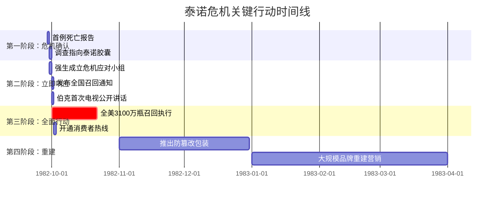
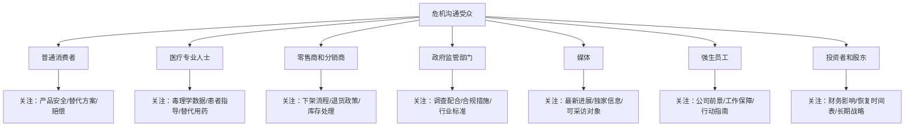
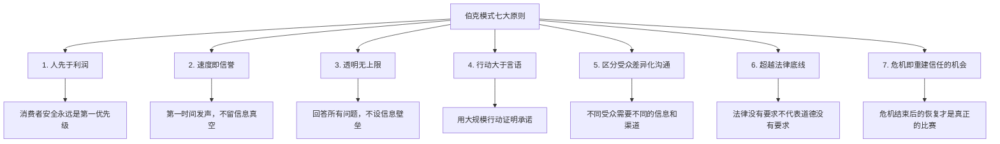
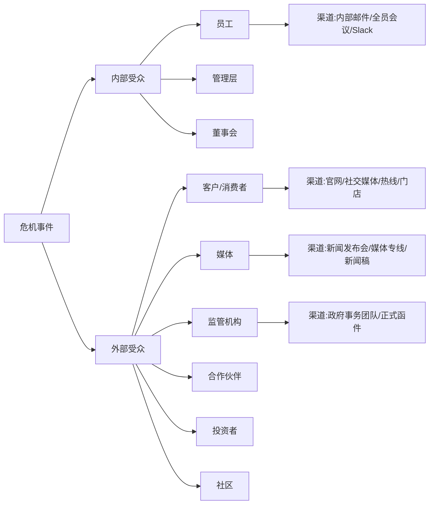

## 案例三：危机中的领导力沟通——强生泰诺事件

1982年的泰诺投毒事件被公认为**危机沟通史上的分水岭**。它不仅定义了现代危机管理的基本范式，更证明了一个核心命题：在危机中，领导者的沟通决策可以直接决定一家企业的生死存亡。强生公司在此事件中的表现，至今仍是全球商学院危机管理课程的必修案例。

### 背景与事件全景

#### 时代背景

1982年，泰诺（Tylenol）是美国非处方止痛药市场的绝对霸主。其主要成分为对乙酰氨基酚（acetaminophen），由强生公司（Johnson & Johnson）旗下的麦克尼尔消费品公司（McNeil Consumer Products）生产。当时的市场数据如下：

| 指标 | 数据 |
|------|------|
| 泰诺在止痛药市场的份额 | 37% |
| 泰诺年销售额 | 约12亿美元（占强生总营收约10%） |
| 芝加哥地区市场份额 | 约35% |
| 胶囊剂型在泰诺产品线中的占比 | 超过70% |

泰诺不仅是强生的旗舰产品，更是公司利润的重要支柱。在品牌认知度方面，泰诺在美国消费者心中的地位类似于今天苹果或谷歌在其领域的地位——它是品类的代名词。

#### 危机爆发

1982年9月28日至30日，芝加哥地区接连发生了7起离奇死亡事件。死者均服用了泰诺胶囊，但死因并非药物本身的副作用，而是胶囊中被注入了**氰化钾（potassium cyanide）**——一种剧毒物质，致死剂量仅为200-300毫克。

七名遇难者为：

- **Mary Kellerman**，12岁，9月29日服用泰诺后数小时内死亡
- **Adam Janus**，27岁，邮递员，同日死亡
- **Stanley Janus**，25岁，Adam的弟弟，因服用同一瓶泰诺死亡
- **Theresa Janus**，19岁，Stanley的妻子，同样遇难
- **Mary Reiner**，27岁，刚生产不久
- **Mary McFarland**，31岁
- **Paula Prince**，35岁，空乘人员

调查很快指向一个令人不寒而栗的事实：被投毒的泰诺胶囊分别来自**不同的药房**，分布在芝加哥地区的不同区域。这意味着投毒行为发生在产品进入零售环节**之后**——有人在商店货架上将氰化物注入胶囊后放回。这不是生产事故，而是**蓄意的无差别谋杀**。

#### FBI与FDA的介入

事件发生后，联邦调查局（FBI）和食品药品监督管理局（FDA）迅速介入。调查面临的困难包括：

- **投毒时间和地点不明确**：产品在多个零售点销售，追溯链极长
- **包装无防篡改设计**：当时的胶囊瓶盖没有密封，任何人都能打开瓶子将胶囊取出注入毒物后放回
- **公众恐慌蔓延**：媒体大规模报道引发全国性恐慌，各州陆续报告疑似投毒案例（后多为误报或模仿犯罪）
- **投毒者始终未被抓获**：尽管有一名嫌疑人James William Lewis曾向强生勒索100万美元，但从未有足够证据证明他就是投毒者。此案至今未正式结案

### 决策层的领导力沟通

#### 核心人物：詹姆斯·伯克

詹姆斯·伯克（James Burke）1976年出任强生公司CEO。他不是一个典型的企业高管——他更像一个价值观驱动的领导者。伯克上任后做的第一件重要事情，就是重新审视和强化强生1943年首次发布的**"我们的信条"（Our Credo）**。

这份信条明确规定了强生的责任优先级：

1. **对医生、护士、患者和母亲负责**——确保产品质量和安全
2. **对员工负责**——保障工作环境和福利
3. **对社区负责**——支持社区发展
4. **对股东负责**——为股东创造合理回报

关键在于，这份信条将**消费者安全置于股东利益之上**。这不仅仅是一句口号，它在泰诺危机中成为了实际决策的指导原则。伯克后来说："我们的信条不是写给墙上看的，它是我们在危机中做出正确决定的根本。"

#### 第一时间响应（事件发生后数小时内）

在确认泰诺胶囊确实是导致死亡的原因后，伯克和他的团队在几小时内做出了第一个关键沟通决策。他们的行动可以用以下时间线来呈现：

伯克在事件确认后**没有等待调查结果**，没有召开律师会议讨论法律责任，没有咨询公关公司如何"管理信息"。他做的第一件事是**直接面对公众**。

#### 沟通策略的五个支柱

伯克的危机沟通策略可以归纳为五个相互关联的支柱：

**支柱一：速度优先，抢占信息真空**

危机沟通的第一法则是：**如果你不定义叙事，别人就会替你定义**。伯克深谙此道。在事件确认后的第一天，强生就通过以下渠道发出了自己的声音：

- 主动联系全国各大媒体，提供最新信息
- 伯克本人录制电视讲话，通过三大电视网（ABC、NBC、CBS）播出
- 公司发言人24小时待命，随时回应媒体问询
- 向医疗专业人士发送紧急通知，警告泰诺风险

伯克没有躲在律师和公关团队背后。他亲自走到聚光灯下，这一行为本身就传递了一个强烈信号：**这件事的负责人就在你面前，他没有在逃避**。

**支柱二：信息透明，不设信息壁垒**

伯克为强生的危机沟通设立了一条铁律：**对公众不隐瞒任何信息，回答所有问题，无论这些问题对公司多么不利**。

具体做法包括：

| 沟通渠道 | 透明度措施 |
|---------|-----------|
| 新闻发布会 | 每天至少一次，不限制提问，不使用"无可奉告" |
| 消费者热线 | 开通免费电话，配备专业人员解答所有疑问 |
| 医疗专业渠道 | 向医生和药剂师发送详细的毒理学信息和应对指南 |
| 零售商沟通 | 直接联系全国零售商，指导下架和退货流程 |
| 政府配合 | 全力配合FBI和FDA调查，共享所有内部信息 |

这种透明度在1982年是极为罕见的。当时的企业危机沟通标准操作是：律师介入→发布最小化声明→尽量减少公开露面→等待事件"自然平息"。伯克的做法完全是**反直觉**的——他主动放大了事件的可见度，而不是试图缩小它。

**支柱三：以行动超越言语——史无前例的全面召回**

1982年10月1日，伯克做出了一个在当时看来几乎疯狂的决定：**召回全美市场上所有的泰诺胶囊——3100万瓶，价值超过1亿美元**。

这个决定的非凡之处在于：

1. **法律上并无要求**：投毒发生在零售环节，不是生产缺陷，强生在法律上没有召回义务
2. **财务上极为沉重**：1亿美元的直接损失，加上品牌受损带来的预期收入下降，总损失可能超过数亿美元
3. **行业前所未有**：此前从未有任何消费品公司进行过如此大规模的产品召回
4. **执行风险极高**：需要协调全国数万个零售点，在恐慌氛围中完成物流操作

伯克通过电视广告亲自向公众解释了这一决定。广告的核心信息是：

> "泰诺的瓶子被打开了。我们不知道这是怎么发生的。但我们现在唯一能做的，就是确保每一个美国人都不再面临任何风险。我们正在召回每一瓶泰诺胶囊。你的安全是我们最重要的事情。"

这则广告没有法律免责声明，没有花哨的公关语言，没有试图将责任推给"未知的第三方"。它传达的信息简单而有力：**你的安全比我们的利润更重要**。

**支柱四：多渠道、多受众的差异化沟通**

伯克的团队意识到，危机中的沟通对象不是一个同质化的群体。不同受众有不同的关注点和信息需求，需要**差异化的沟通策略**：

针对每类受众，强生都有专门的沟通方案：

- **消费者**：电视广告、报纸全版广告、免费热线电话（24小时运营）、商店内的告示和工作人员指引
- **医疗专业人士**：紧急医学通讯（Dear Doctor letter），详细说明氰化物中毒的症状、检测方法和治疗方案
- **零售商**：专门的商务团队直接联系每一家零售商，提供下架指引、退货物流方案和财务补偿安排
- **政府**：伯克亲自与FDA专员Arthur Hayes Jr.沟通，主动提供全部信息，配合调查
- **员工**：伯克通过内部信件和全员会议稳定军心，强调公司价值观，保证不会裁员
- **投资者**：召开紧急电话会议，坦诚说明财务影响和恢复计划

**支柱五：将危机转化为长期信任建设**

伯克没有把召回当作危机的终点。他把它当作**重建信任的起点**。在召回完成后的6个月内，强生做了以下工作：

- 与多家包装技术公司合作，开发了**防篡改包装（tamper-evident packaging）**。新包装包括：瓶口的收缩薄膜密封、瓶盖下的纸质密封层、外包装盒的胶封设计
- 向FDA提议将防篡改包装作为**行业强制标准**。1983年，美国国会通过了《防篡改包装法（Federal Anti-Tampering Act）》，将蓄意篡改消费品列为联邦重罪
- 伯克亲自走访全美多个城市，与药剂师、医生和消费者面对面交流，听取他们对新包装的反馈
- 推出大规模品牌重建广告运动，核心信息是"泰诺回来了，比以前更安全"

### 沟通效果与商业恢复

#### 短期效果

泰诺召回事件在短期内的影响是巨大的：

| 时间点 | 泰诺市场份额 | 说明 |
|--------|-------------|------|
| 1982年9月（危机前） | 37% | 行业霸主 |
| 1982年11月（召回后） | 接近0% | 产品全面下架 |
| 1983年2月（新品上市后） | 约7% | 防篡改包装版泰诺上市 |
| 1983年11月（危机一年后） | 30% | 基本恢复 |
| 1984年 | 35% | 接近危机前水平 |

从市场份额跌至接近零到恢复到30%，强生只用了不到一年时间。这在消费品行业中是**史无前例的恢复速度**。

#### 财务影响

- **直接召回成本**：超过1亿美元（产品销毁、物流、消费者退款）
- **品牌重建投入**：约1-2亿美元（广告、新包装研发和生产、渠道重建）
- **危机期间的股价波动**：强生股价在事件初期下跌约20%，但在三个月内基本恢复
- **长期回报**：防篡改包装成为行业标准后，泰诺的安全形象反而成为竞争优势，长期销售持续增长

#### 媒体与公众反应

伯克的沟通策略赢得了媒体和公众的广泛赞誉：

- 《华盛顿邮报》在危机期间的社论写道："强生公司的反应堪称企业责任的典范"
- 多次民调显示，公众对强生的信任度不仅没有因危机而永久受损，反而**在危机处理后有所提升**
- 伯克本人成为美国最受尊敬的商业领袖之一，后来被里根总统任命为全国禁毒运动的负责人

### 理论分析：为什么这个案例如此重要

#### 与库姆斯情境危机沟通理论的对应

危机沟通学者W. Timothy Coombs提出的**情境危机沟通理论（SCCT, Situational Crisis Communication Theory）**认为，危机的类型决定了组织应采取的沟通策略。SCCT将危机分为三类：

| 危机类型 | 组织责任程度 | 推荐策略 |
|---------|------------|---------|
| 受害者型（Victim）：自然灾害、谣言、产品被篡改 | 低 | 否认策略、受害者表达 |
| 意外型（Accidental）：技术故障、人为失误 | 中 | 减弱策略、补偿表达 |
| 可预防型（Preventable）：故意违规、隐瞒信息 | 高 | 重建策略、全面补偿 |

泰诺事件属于**受害者型危机**——投毒是第三方的犯罪行为，强生本身没有过失。按SCCT理论，强生完全可以采用否认策略，将责任完全推给投毒者，并等待事件平息。

但伯克选择了**远超理论建议的策略**。他采取了本应用于"可预防型"危机的重建策略——大规模召回、全面透明、主动补偿。这种"过度反应"在理论上看似不必要，但实际效果证明：**在公众情绪被恐惧主导时，理性层面的"合理"反应是不够的，你需要在情感层面给出足够的信号来重建信任**。

#### 伯克模式的核心原则提炼

从泰诺案例中，可以提炼出危机领导力沟通的七条核心原则：

**原则一：人先于利润**。伯克在董事会面前面临巨大压力——有董事质疑1亿美元的召回是否过激。伯克的回答是："如果我们不召回，下一次有人可能还会死。我们的信条说得很清楚。"这不是表演，这是真实的决策冲突，而伯克选择了人。

**原则二：速度即信誉**。事件确认到第一份公开声明之间不到24小时。在没有互联网、没有社交媒体的1982年，这个速度已经是极限。信息真空会被恐惧和谣言填充，而恐惧和谣言一旦占据公众心智，任何后续的真相都难以清除。

**原则三：透明无上限**。伯克没有设定"可公开信息"和"不可公开信息"的边界。他告诉媒体团队："如果记者问了，就回答。如果你们不知道答案，就说'我们还不知道，但我们正在查'。永远不要说'无可奉告'。"

**原则四：行动大于言语**。1亿美元的召回行动本身就是最有力的沟通。它不需要任何修辞技巧来"包装"——数字本身就在说话。

**原则五：区分受众差异化沟通**。对消费者强调安全和情感支持，对医疗专业人士提供技术和临床数据，对零售商提供操作流程，对员工强调稳定和价值观。一套话术打所有人是低效的。

**原则六：超越法律底线**。法律不要求强生召回，法律不要求强生赔偿，法律不要求强生CEO上电视。但伯克做了所有这些事情。**法律是底线，不是天花板**。

**原则七：危机即重建信任的机会**。多数企业把危机当作"度过就好"的灾难，伯克把它当作"重建更好"的机会。防篡改包装、《防篡改包装法》、泰诺的安全形象——这些都是危机"副产品"，但最终成为了强生的长期资产。

### 与失败案例的对比分析

泰诺事件的价值不仅在于它本身的成功，更在于它为后来的危机管理提供了一个**"应该怎么做"的标杆**。将泰诺模式与后续的失败案例对比，能更清晰地看到危机沟通中"做对"和"做错"的差异。

#### 对比案例一：1989年埃克森·瓦尔迪兹号石油泄漏

1989年3月，埃克森公司的油轮瓦尔迪兹号在阿拉斯加威廉王子湾触礁，泄漏了约1100万加仑原油。埃克森CEO劳伦斯·罗尔（Lawrence Rawl）的危机应对与伯克形成了鲜明对比：

| 对比维度 | 伯克（强生泰诺，1982） | 罗尔（埃克森瓦尔迪兹，1989） |
|---------|---------------------|--------------------------|
| 第一响应时间 | 数小时内 | 数天后才公开表态 |
| CEO公开露面 | 亲自上电视，多次新闻发布会 | 拒绝前往事故现场，长时间不露面 |
| 责任态度 | 主动承担责任 | 将责任推给油轮船长和海岸警卫队 |
| 信息透明度 | 全面开放，回答所有问题 | 限制媒体访问，信息封锁 |
| 行动力度 | 史无前例的全面召回 | 清理行动启动缓慢，资源投入不足 |
| 与政府关系 | 主动配合 | 被动应对，与政府产生冲突 |
| 长期品牌影响 | 品牌恢复并增强 | 品牌严重受损，长期负面关联 |
| 总损失（含罚款和赔偿） | 约1-3亿美元 | 超过70亿美元 |

罗尔在危机中的经典失误是**在6天后才发表首次公开声明**——而在这6天里，全世界的电视屏幕上反复播放着海鸟被原油覆盖垂死挣扎的画面。埃克森的沉默被公众解读为冷漠和傲慢，这个品牌形象的损失远超石油泄漏本身的环境影响。

#### 对比案例二：2010年英国石油公司（BP）深水地平线事件

2010年4月，BP的深水地平线钻井平台在墨西哥湾爆炸，导致11人死亡和历史上最大的海洋石油泄漏。BP CEO托尼·海沃德（Tony Hayward）的沟通堪称灾难性的反面教材：

- 泄漏持续了87天，海沃德在早期多次低估泄漏规模
- 海沃德说出了一句被广泛引用的灾难性言论："**我想找回我的生活（I'd like my life back）**"——这句话在公众看来，是在抱怨自己作为CEO的压力，而非关注受害者的痛苦
- BP的公关广告试图将焦点从环境灾难转移到"BP正在努力清理"

与伯克相比，海沃德的失败在于**缺乏同理心的沟通**。伯克在每一次公开讲话中都首先提到遇难者和他们的家庭，而海沃德始终把注意力放在公司和自己身上。

#### 对比案例三：1996年杰克箱（Jack in the Box）大肠杆菌事件

1993年，杰克箱快餐连锁爆发大肠杆菌O157:H7污染事件，导致数百人患病、4名儿童死亡。公司CEO Robert Nugent最初的反应是淡化问题和回避媒体，与伯克模式形成了又一个对比。杰克箱最终存活下来，但花了数年时间才恢复品牌声誉，且在此期间关闭了大量门店。

### 常见误读与澄清

#### 误读一："强生的召回是理所当然的"

许多人将强生的召回决策视为"正常的企业责任反应"，但事实是：**在1982年，没有任何法律规定企业需要在这种情况下进行召回**。强生的做法不仅超出了法律要求，也超出了当时行业普遍的预期。当时多数业内人士和法律专家都认为强生反应过度。伯克是在**逆着商业逻辑**做出决定。

#### 误读二："强生的危机处理很简单"

事后看来，强生的应对似乎是"显而易见的正确选择"，但这种后见之明忽略了决策时的巨大不确定性。伯克面临的真实困境包括：

- 如果召回后证明投毒不是发生在零售环节而是生产环节呢？那强生将面临毁灭性的刑事责任
- 如果召回引发更大的恐慌，导致消费者对所有胶囊类产品丧失信心呢？那整个品类都会消亡
- 如果投毒者持续作案呢？召回能否真正解决问题？
- 董事会内部有强烈反对声音，认为1亿美元的召回将严重损害股东利益

在所有这些不确定性面前，伯克仍然选择了最激进的方案。这需要**极大的领导勇气**。

#### 误读三："泰诺危机处理可以复制"

很多企业试图"复制"泰诺模式，但往往只学到了表面。泰诺模式成功的前提条件包括：

- **组织文化支撑**：强生的信条文化已经存在了近40年，不是危机时临时创造的
- **领导者的个人品格**：伯克是一个真正信奉企业社会责任的人，不是在表演
- **危机的性质**：投毒是外部犯罪行为，强生本身没有过失，这使得"受害者"定位是可信的
- **时代背景**：1982年没有社交媒体，信息传播速度远慢于今天，给了企业更多反应时间

如果强生自身在产品质量上有过失，或者CEO本人缺乏可信度，同样的策略可能会适得其反。

### 当代启示：泰诺模式在社交媒体时代的演变

#### 速度要求从"小时"变成了"分钟"

1982年，伯克有24小时来准备第一次公开声明。在今天的社交媒体时代，危机的传播速度以分钟计算。一条推文或一段TikTok视频可以在一小时内获得数百万次浏览。当代企业面临的挑战是：**你必须在掌握全部事实之前就开始沟通**。

这意味着现代危机沟通需要：

- **预设的"先发声明"模板**：在确认事实之前，先表达关切和行动意愿
- **社交媒体监听系统**：在危机正式爆发前捕捉早期信号
- **授权前线员工**：客服和社交媒体运营人员需要被授权在一定范围内回应，而不是所有回复都要层层审批

#### 透明度的定义扩展了

1982年的"透明"意味着回答记者的问题。今天的"透明"意味着：

- 主动在社交媒体上发布实时更新
- 公开内部调查的阶段性进展（即使是"我们还在调查"）
- 邀请独立第三方参与调查并公开其结论
- 使用视频、直播等多媒体形式，而不仅仅是文字声明

#### 行动的衡量标准更高了

伯克用1亿美元的召回证明了他的诚意。但今天的消费者已经见过太多"表演性行动"——企业捐款、CEO道歉视频、公关驱动的公益活动。**当代消费者更看重的是系统性改变**：是否修改了导致危机的流程？是否更换了失职的高管？是否建立了防止同类事件再次发生的机制？

### 实操框架：将泰诺模式应用于你的组织

#### 危机前准备清单

在危机发生之前，组织应该建立以下基础设施：

**1. 价值观文档化和内化**

不只是把价值观挂在墙上，而是：
- 每季度在全员会议上讨论价值观在日常工作中的体现
- 在新员工入职培训中将价值观作为核心课程
- 在绩效评估中纳入价值观践行的维度
- 定期用真实案例（正面和反面）来检验价值观的实际适用性

**2. 危机沟通预案**

- 按危机类型（产品安全、数据泄露、高管丑闻、自然灾害等）制定差异化的沟通模板
- 指定危机沟通团队和明确的决策链
- 预先建立与关键媒体的联系渠道
- 定期进行危机模拟演练（至少每年一次）

**3. 利益相关者地图**

绘制完整的利益相关者地图，明确每类群体的信息需求、沟通渠道和关键联系人：

#### 危机中沟通的五步行动框架

**第一步：确认事实（Facts）**
- 发生了什么？
- 影响范围有多大？
- 是否仍在持续？
- 有哪些已知信息？哪些还不知道？

**第二步：组建团队（Team）**
- 危机沟通总负责人（应为CEO或至少是C级别高管）
- 信息收集和验证团队
- 对外沟通团队（媒体关系、社交媒体、客户服务）
- 对内沟通团队（员工、投资者）
- 法律顾问团队（注意：法律团队应提供建议，不应主导沟通决策）

**第三步：发出首次声明（Statement）**
首次声明应包含以下要素，缺一不可：

- **已知事实**：我们目前知道什么
- **表达关切**：对受影响者的真实同情
- **行动承诺**：我们正在做什么，以及我们接下来要做什么
- **信息承诺**：我们会持续更新信息的方式和时间
- **可验证性**：留出公众可以联系到的渠道

**第四步：持续沟通（Ongoing）**
- 设定固定的更新节奏（如每6小时或每天两次）
- 即使没有新进展，也要发布"我们仍在积极处理"的更新
- 保持信息一致性，避免不同渠道出现矛盾说法
- 主动纠正已传播的不准确信息

**第五步：恢复与复盘（Recovery）**
- 危机结束后进行完整的复盘分析
- 向所有利益相关者发布最终总结
- 将危机中学到的教训纳入组织流程和培训
- 持续监测品牌声誉和信任指标

### 总结：泰诺事件的永恒价值

泰诺事件之所以在40多年后仍然被反复讨论，是因为它回答了一个永恒的问题：**当灾难发生时，一个领导者应该如何说话、如何行动？**

伯克的答案是：

1. **站在人的一边，不是站在钱的一边**
2. **尽快说话，说真话，说完整的话**
3. **用行动证明你的言语**
4. **把危机当作展示你真正是谁的机会，而不是掩盖你真正是谁的借口**

这个答案在1982年是正确的，在今天依然正确。技术在变，传播渠道在变，公众的期望在变，但**真诚、透明和以人为核心的领导力沟通原则不会过时**。

泰诺事件最终证明了一个深刻的悖论：**当你在危机中放弃短期利益来保护他人时，你反而获得了最大的长期回报**。这不是运气，这是领导力的回报。
