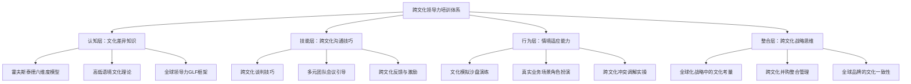

## 案例四：跨文化团队领导——联想的全球化之路

### 案例背景与战略语境

2005年5月1日，联想集团以12.5亿美元（含承担债务5亿美元）正式完成对IBM个人电脑事业部的收购。这笔交易不仅是中国企业当时最大的海外并购案，更将联想从一家年营收约30亿美元的中国本土企业，瞬间推入一个需要管理全球160多个国家业务、协调中美欧日多地区团队的跨国运营格局。

**并购前的联想与IBM PC事业部在文化基因上存在巨大差异：**

| 维度 | 联想（中国） | IBM PC事业部（美国） |
|------|-------------|---------------------|
| 企业历史 | 1984年成立，20年历史 | 1981年发明IBM PC，品牌沉淀超20年 |
| 管理风格 | 军事化管理，强调执行力 | 矩阵式管理，强调流程和专业分工 |
| 沟通文化 | 含蓄、层级分明、重面子 | 直接、扁平化、重效率 |
| 决策模式 | 自上而下，快速执行 | 自下而上论证，共识驱动 |
| 员工期望 | 服从大局、长期稳定 | 个人发展、工作生活平衡 |
| 工作语言 | 中文 | 英语 |

这种差异不是抽象的学术概念，而是每天都在实际工作中产生摩擦的真实问题。联想高管回忆，最初几个月的联合会议上，中方团队沉默寡言并不代表同意，美方团队的直言不讳也并非不尊重——双方都在用自己的文化逻辑解读对方的行为，误读不断累积。

### 文化维度分析：用理论框架理解冲突根源

要理解联想面临的跨文化挑战，霍夫斯泰德（Geert Hofstede）的文化维度理论提供了最经典的分析框架。以下是中美两国在六个文化维度上的量化对比（数据来源：Hofstede Insights）：

| 文化维度 | 中国得分 | 美国得分 | 差异表现 |
|---------|---------|---------|---------|
| 权力距离（PDI） | 80 | 40 | 中方接受等级差异，美方追求平等参与 |
| 个人主义（IDV） | 20 | 91 | 中方重集体和谐，美方重个人表达 |
| 不确定性回避（UAI） | 30 | 46 | 中方灵活应变，美方依赖流程制度 |
| 男性气质（MAS） | 66 | 62 | 两国差异较小，均追求成就导向 |
| 长期导向（LTO） | 87 | 26 | 中方注重长远布局，美方关注季度业绩 |
| 放纵维度（IVR） | 24 | 68 | 中方克制内敛，美方鼓励自我表达 |

**这些数据直接解释了联想并购初期的典型冲突场景：**

- **会议场景**：美方团队期待每个人主动发言、质疑方案，中方团队认为下属当众反驳领导是不给面子。权力距离80 vs 40的差距，让同一个会议室里的"正常行为"标准完全不同。
- **绩效反馈**：美方经理习惯一对一直接指出问题（个人主义+低语境文化），中方经理倾向于在非正式场合委婉暗示（集体主义+高语境文化）。结果美方觉得中方"不够透明"，中方觉得美方"太粗鲁"。
- **战略规划**：杨元庆提出五年全球化蓝图（长期导向87），美方管理层关注的是下个季度的财报表现（长期导向26）。双方对"紧迫"的定义完全不同。

### 联想的跨文化沟通策略体系

联想并非一夜之间解决了跨文化问题，而是经历了一个从混乱到有序的渐进过程。以下是其核心策略的详细拆解：

#### 策略一：文化融合而非文化征服

联想选择了一条极具智慧的中间路线——既不完全西化，也不固守中国模式，而是创造一种"联想特色"的混合文化。

**具体做法：**

1. **双CEO制度的过渡设计**。并购后初期，联想任命IBM出身的Stephen Ward担任CEO，杨元庆退任董事长。这个安排安抚了IBM团队和全球客户，但也确保了中国创始团队在战略层面的决策权。2005年底，联想引入前戴尔高管Bill Amelio接替CEO，进一步强化国际化运营能力。直到2009年，柳传志重新出山担任董事长，杨元庆回归CEO职位——此时杨元庆的英语能力和国际化视野已经成熟到足以领导全球业务。

2. **"赢"文化的提炼**。联想将IBM的PCG（个人电脑事业部）精神与自身的"发动机文化"融合，提炼出以"说到做到、尽心尽力、创新"为核心的新价值观。这个新价值观不是单方面的灌输，而是在双方团队的反复讨论中逐渐成形的。

3. **制度层面的双向适应**。联想没有简单照搬IBM的流程，也没有全盘推行中国式管理，而是对关键流程进行了"兼容性设计"——例如保留了IBM的矩阵汇报体系，但在决策链条上增加了联想的效率机制；保留了联想的快速迭代文化，但在质量管控上引入了IBM的六西格玛标准。

#### 策略二：语言战略——从"勉强能用"到"战略资产"

语言问题看似表面，实则是跨文化沟通中最深层的权力结构问题。联想选择英语作为全球工作语言，这一决定的影响深远：

**杨元庆的英语学习之路本身就是领导力的示范**。并购初期，杨元庆的英语水平仅能应付简单对话，在董事会和分析师会议上需要翻译。但他坚持每天学习，逐渐能够直接用英语进行复杂的战略讨论。这个过程被联想内部广泛传颂，传递了两个重要信号：第一，学习对方的语言是对对方文化的最大尊重；第二，领导者愿意在公开场合展示自己的不完美，打破了"完美领导"的幻觉。

**联想的语言策略不仅限于管理层，而是系统性的能力建设：**

- 2006年起，联想在北京总部开设全员英语培训项目，覆盖超过5000名中国区员工
- 为高管配备一对一英语教练，重点训练商务谈判、媒体采访、董事会汇报等场景
- 在内部通讯系统中推行双语制度，重要通知必须同时发布中英文版本
- 鼓励中美团队成员结成"语言伙伴"，在互助学习中建立个人关系

**语言策略的深层逻辑**：选择英语不仅是效率考量，更是向全球团队和客户发出的信号——联想是一家真正的全球化公司，而非一家试图伪装成国际企业的中国公司。这种信号在并购初期对稳定IBM团队的人心至关重要。

#### 策略三：跨文化领导力培训体系

联想没有把跨文化培训当作一次性的HR活动，而是将其嵌入领导力发展的长期体系中：

**培训内容的层次设计：**



**培训的关键创新点：**

1. **真实案例驱动**。联想没有使用教科书上的通用案例，而是将并购后真实发生的文化冲突事件（脱敏后）编入培训教材。例如，一个典型的案例是：中方项目经理在邮件中写"我们再研究研究"，美方团队理解为"方案被否决需要重做"，而中方的本意是"暂时没时间讨论，稍后继续"。这种基于真实经历的案例比任何理论都更有说服力。

2. **双向培训而非单向培训**。联想同时为中国团队和美国团队提供培训，内容各有侧重但目标一致——理解对方的文化逻辑。中方培训侧重"如何在直接沟通中保持关系"，美方培训侧重"如何解读高语境文化中的隐含信息"。

3. **行动学习项目**。培训的最终考核不是考试，而是一个真实的跨文化协作项目。学员被编入中美混合团队，在3个月内完成一个实际业务课题，在过程中自然地练习跨文化沟通技能。

#### 策略四：建立跨文化的信任机制

联想深知，制度和培训只能解决表层问题，跨文化团队的深层融合依赖于人与人之间的信任。为此，联想设计了多层次的信任建设机制：

**全球领导力论坛（Lenovo Leadership Meeting）**。联想每年举办1-2次全球高管峰会，将来自不同国家和地区的管理团队聚集在一起。这不是传统的PPT汇报会，而是包含大量非结构化社交时间的深度互动——共同的户外拓展、文化之夜、开放式圆桌讨论。联想发现，在正式会议中难以表达的意见，往往在咖啡时间或晚餐中自然而然地流露出来。

**跨文化导师制度**。联想为关键岗位的管理者配备了来自不同文化背景的导师。例如，一位中国区的高级经理会配一位美国区的导师，反过来也成立。这种安排不仅帮助管理者理解异文化的工作方式，更重要的是建立了一个跨越文化边界的个人支持网络。

**"影子计划"（Shadow Program）**。联想安排中美团队的关键成员互访对方办公室，进行为期2-4周的"影子学习"——跟随对方的日常工作节奏，参加对方的会议，体验对方的办公文化。这种沉浸式体验的效果远超任何课堂培训。

### 联想跨文化整合的关键时间节点

| 时间 | 事件 | 文化整合意义 |
|------|------|-------------|
| 2005年5月 | 完成收购，Stephen Ward出任CEO | 安抚IBM团队，信号：尊重原有文化 |
| 2005年底 | 首次全球领导力论坛 | 建立中美高管的面对面关系 |
| 2006年 | 全员英语培训项目启动 | 系统性解决语言障碍 |
| 2006-2007年 | 跨文化领导力培训体系上线 | 将文化融合制度化 |
| 2008年 | 北京奥运会赞助商 | 提升全球品牌认知，增强文化自信 |
| 2009年 | 杨元庆回归CEO | 标志跨文化领导力成熟 |
| 2011年 | 成为全球第二大PC厂商 | 全球化整合成效显现 |
| 2013年 | 跃升全球PC市场份额第一 | 跨文化融合的最终验证 |
| 2014年 | 收购摩托罗拉移动和IBM x86服务器业务 | 跨文化整合能力的再次应用 |

### 深度剖析：联想跨文化沟通中的典型困境与突破

#### 困境一：决策速度的"快"与"慢"之争

联想在中国市场以"快速决策、快速执行"著称。并购后，这种风格与IBM遗留的矩阵式决策流程产生了剧烈碰撞。

**具体场景**：2006年，联想计划在东南亚市场推出一款面向中小企业的产品。中国团队认为市场窗口稍纵即逝，主张两周内完成方案审批并启动执行。美方团队坚持要经过完整的市场调研、财务分析、风险评估流程，预计需要8周。双方在这个问题上僵持不下。

**联想的解决方案——"双轨制决策"**：

- **日常运营决策**：保留联想的快速迭代模式，授权区域团队在既定框架内自主决策，48小时内完成审批
- **战略级决策**：采用IBM的深度论证模式，设立跨文化评估委员会，确保重大决策经过充分的多元视角审视
- **紧急响应决策**：设立"绿色通道"机制，CEO有权在24小时内做出超越常规流程的决策，事后补交完整论证

这个双轨制不是妥协，而是对两种文化的优点进行了结构性整合——既保留了中国团队的速度优势，又利用了美国团队的风险管控能力。

#### 困境二：反馈文化的冲突与调和

反馈方式的差异是跨文化团队中最容易引发情绪对立的问题。

**IBM风格**：直接、具体、即时。"This proposal has three major flaws..."——这种表达在美国文化中是高效的专业反馈，在中国文化中可能被理解为公开批评和不尊重。

**联想风格**：间接、含蓄、关系导向。"这个方案还有提升空间"——在中国文化中是委婉的建设性意见，在美国文化中可能被理解为模糊、不真诚。

**联想建立的"跨文化反馈协议"：**

1. **SBI模型的跨文化适配**。联想采用Situation-Behavior-Impact（情境-行为-影响）反馈模型，但在跨文化场景中增加了第四步——"Intent"（意图确认）。完整流程为：描述具体情境→描述观察到的行为→说明行为产生的影响→确认对方的真实意图。最后一步尤其重要，因为跨文化场景中"意图"和"影响"之间的偏差远大于同文化场景。

2. **反馈的"预热"机制**。在跨文化场景中，联想要求管理者在给出正式反馈前，先通过非正式渠道（如私下聊天、一对一会谈）了解对方的立场和背景，避免在正式场合出现意外的文化冲突。

3. **书面反馈的优先权**。联想发现在跨文化场景中，书面反馈（邮件或文档）比口头反馈更有效——它给了接收方消化和思考的时间，减少了即时情绪反应的风险。

#### 困境三：非正式沟通网络的文化差异

在中国企业中，非正式沟通网络（饭局、酒局、私下关系）是信息流动和决策酝酿的重要渠道。这种网络在美国企业文化中虽然也存在，但形式和运作逻辑完全不同。

联想面临的挑战是：如何在不排斥任何一方文化习惯的前提下，建立有效的非正式沟通网络？

**联想的实践：**

- **正式化的"非正式活动"**。联想定期组织跨文化社交活动，如团队建设日、文化分享会、家庭日等。这些活动有明确的目的（促进跨文化关系），但以非正式的形式进行。
- **"午餐轮换制"**。联想鼓励不同文化背景的员工轮流共进午餐，打破了"中国人扎堆、美国人扎堆"的自然聚类倾向。
- **虚拟咖啡聊天**。对于无法面对面交流的远程团队，联想建立了随机配对的"虚拟咖啡"系统，每周随机匹配两名来自不同国家的员工进行15分钟的非工作话题聊天。

### 联想案例的理论映射

联想的跨文化领导实践与多个经典理论形成了精确的对应关系：

**与霍夫斯泰德理论的映射**：联想的"文化融合"策略本质上是在权力距离（从80向60左右调整）、个人主义（从20向40左右调整）两个维度上寻找中间点，而非简单地向任何一方靠拢。

**与Erin Meyer《文化地图》的映射**：Meyer的八个维度（沟通、评估、说服、领导、决策、信任、分歧、时间安排）几乎覆盖了联想面临的全部挑战。联想的策略是在每个维度上找到"可操作的中间地带"，而非追求完美的文化一致性。

**与科特变革八步法的映射**：联想的文化整合过程高度契合科特模型——建立紧迫感（全球PC市场竞争加剧）→组建领导联盟（中美混合高管团队）→制定愿景（成为全球PC领导者）→沟通愿景（全球领导力论坛）→授权行动（双轨制决策）→创造短期成效（市场份额增长）→巩固成果（制度化文化融合）→融入文化（成为联想的DNA）。

### 跨文化领导力的常见误区

基于联想案例和其他跨国企业的实践经验，以下是跨文化领导中最常见的错误：

**误区一：将文化差异等同于个人能力差异**

当一位中国团队成员在会议上沉默不语时，不应将其解读为"缺乏主见"或"不够专业"——这可能只是高语境文化中的正常行为模式。同样，当一位美国团队成员在会议上直接质疑领导的方案时，不应将其解读为"不尊重权威"——这是低语境文化中常见的专业表达方式。

**误区二：追求"文化中立"**

有些企业试图创造一种"没有文化色彩"的沟通方式，这既不可能也不必要。文化是身份的一部分，要求员工放弃自己的文化特征等于要求他们放弃自我。正确的做法是创造一个包容多种文化表达方式的环境，而非消灭差异。

**误区三：将跨文化问题简化为"语言问题"**

语言障碍只是冰山一角。即使所有团队成员都流利使用同一种语言，文化差异导致的沟通障碍依然存在——因为沟通的深层结构（谁可以对谁说什么、在什么场合说、用什么方式说）是由文化决定的。

**误区四：一次培训解决所有问题**

跨文化能力是一种需要持续练习的技能，而非一次培训就能获得的知识。联想的经验表明，跨文化培训的效果会在3-6个月后衰减，需要通过持续的实践、反馈和强化来维持。

**误区五：忽视文化冲突中的权力关系**

跨文化冲突往往不是纯粹的"文化差异"问题，背后隐含着权力关系。在联想案例中，"选择英语作为工作语言"表面上是效率考量，实际上也涉及谁的语言被赋予了更高的地位。忽视这种权力维度会导致表面上的文化和谐掩盖深层的不满。

### 可复用的跨文化领导力工具箱

从联想案例中提炼出以下可直接应用的工具和框架：

#### 工具一：文化差异预评估矩阵

在组建跨文化团队之前，使用以下矩阵预评估潜在的沟通障碍：

```text
┌─────────────────┬──────────────────┬──────────────────┬─────────────────┐
│ 沟通维度         │ 团队A文化特征     │ 团队B文化特征     │ 差异等级(1-5)   │
├─────────────────┼──────────────────┼──────────────────┼─────────────────┤
│ 信息传递方式     │ 高语境/含蓄       │ 低语境/直接       │                 │
│ 决策权归属       │ 集中式/层级       │ 分散式/扁平       │                 │
│ 冲突处理方式     │ 回避/面子导向     │ 面对/问题导向     │                 │
│ 时间观念         │ 灵活/关系优先     │ 严格/任务优先     │                 │
│ 反馈方式         │ 间接/私下         │ 直接/公开         │                 │
│ 信任建立路径     │ 关系型/慢热       │ 任务型/快速       │                 │
└─────────────────┴──────────────────┴──────────────────┴─────────────────┘
差异等级：1=相似 2=略有不同 3=明显差异 4=显著冲突 5=严重冲突
行动建议：3级以上维度需要制定专项沟通协议
```

#### 工具二：跨文化会议引导清单

```text
会前准备：
□ 确认会议语言，必要时提供翻译支持
□ 提前24小时发送议程，给非母语者准备时间
□ 明确会议目标和期望的参与方式
□ 了解参会者的文化背景，预判可能的沟通风格差异

会中引导：
□ 主动邀请沉默的参与者发言（"XX，你对这个方案怎么看？"）
□ 每个议题后做简短总结，确认理解一致
□ 避免使用文化特定的俚语、笑话、隐喻
□ 注意非语言信号的文化差异（眼神接触、身体距离、沉默的含义）
□ 对争议性议题采用书面匿名投票而非举手表决

会后跟进：
□ 用文字形式确认会议决策和行动计划
□ 为非母语参会者提供会后补充意见的渠道
□ 收集参会者对会议方式的匿名反馈
```

#### 工具三：跨文化反馈的SBI+I模型

```text
标准SBI模型（适用于同文化场景）：
  Situation（情境）：描述具体的时间、地点、场合
  Behavior（行为）：描述观察到的具体行为
  Impact（影响）：说明行为产生的结果

跨文化增强版SBI+I模型：
  Situation + Behavior + Impact + Intent（意图确认）
  
  示例：
  "在昨天的产品评审会上（S），当David提出市场策略调整建议时，
  你在没有充分讨论的情况下直接否定了这个方案（B），
  这导致David在后续讨论中保持沉默，其他美方团队成员也减少了发言（I）。
  我想确认一下，你当时的考虑是什么？是否有我遗漏的背景信息？（I）"
```

### 高级议题：跨文化领导力的前沿发展

#### 全球本土化（Glocalization）的领导力维度

联想的成功经验之一是"全球本土化"策略——在全球统一的品牌和战略框架下，允许各区域市场在执行层面保留高度的文化适应性。这种策略在领导力层面表现为：全球统一的领导力素质模型 + 区域差异化的领导力行为表现。

例如，联想的全球领导力素质模型中包含"有效沟通"这一项，但在不同文化区域中，"有效沟通"的具体行为表现可以不同——在中国区可能是"善于倾听和理解隐含意图"，在美国区可能是"善于清晰表达和建设性质疑"。

#### 数字化时代的跨文化沟通新挑战

随着远程办公和数字化协作工具的普及，跨文化沟通面临新的挑战：

- **虚拟环境中的非语言信号缺失**。视频会议无法完全传递面对面交流中的肢体语言、空间距离、能量场等非语言信息，而这些恰恰是高语境文化中最重要的沟通载体。
- **异步沟通中的文化误读**。邮件和即时消息缺乏语调和表情，更容易被不同文化背景的接收者误读。一句简单的"收到，谢谢"在中文语境中可能是礼貌性的确认，在英文语境中可能被理解为冷淡的回应。
- **数字工具的文化偏好差异**。不同文化对沟通工具的偏好不同——中国团队习惯微信的即时性和非正式性，欧美团队习惯邮件的正式性和可追溯性。工具选择本身就是一种文化立场的表达。

#### 跨文化领导力的自我修炼路径

对于希望提升跨文化领导力的个人，以下是联想案例启示的修炼路径：

**第一阶段：文化自觉（3-6个月）**

认识到自己的文化偏见是跨文化能力的起点。使用霍夫斯泰德量表或Meyer的文化地图评估自己的文化定位，理解自己的沟通风格受哪些文化因素影响。

**第二阶段：文化知识（6-12个月）**

系统学习目标文化的历史、价值观、社会规范和商业习惯。不要停留在表面的"文化趣闻"层面，要深入理解文化现象背后的社会逻辑。

**第三阶段：文化适应（12-24个月）**

在实际的跨文化工作场景中练习适应——调整自己的沟通风格、决策方式、反馈模式，使之在不同文化环境中都能有效运作。

**第四阶段：文化整合（24个月以上）**

达到能够自如地在不同文化之间切换，并能帮助团队建立跨文化协作规范的水平。这是联想高管最终达到的状态——不是"变成美国人"或"坚持做中国人"，而是成为一个真正的"跨文化领导者"。

### 联想案例对当代企业的启示

联想的跨文化整合经验，对中国企业的出海战略具有直接的参考价值：

1. **文化整合是CEO工程，不是HR项目**。杨元庆亲自学习英语、亲自参与跨文化论坛、亲自推动文化融合政策——如果跨文化整合只停留在HR层面，注定流于形式。
2. **时间是跨文化融合的必要投入**。联想用了将近5年时间才基本完成中美团队的文化融合，用了近8年才在全球市场站稳脚跟。任何试图在6个月内解决跨文化问题的想法都是不现实的。
3. **制度设计比文化建设更可靠**。"文化融合"听起来很美，但如果没有配套的制度设计（双轨制决策、跨文化反馈协议、会议引导流程），文化融合就只能停留在口号层面。
4. **以身作则比任何政策都有效**。杨元庆用英语学习的坚持、在公开场合展示不完美的勇气，比任何正式的跨文化政策都更能影响团队的行为。

### 本案例核心启示

- 跨文化沟通的本质是理解差异、尊重差异、利用差异，而非消除差异
- 语言是跨文化沟通的基础设施，但文化理解才是核心能力
- 信任关系是跨越文化鸿沟的最终桥梁，而信任需要时间和具体行动来建立
- 领导者的自我改变是跨文化整合最强的信号——当最高领导者愿意学习和改变时，整个组织才会跟进
- 制度化是跨文化能力从个人技能转化为组织能力的关键步骤
- 跨文化领导力不是一种天赋，而是一种可以通过系统训练获得的能力

***
