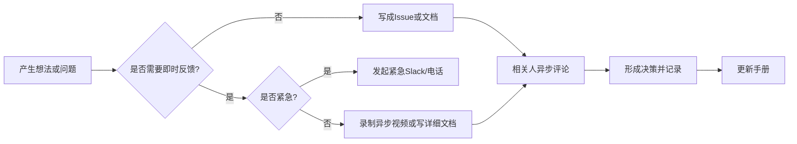
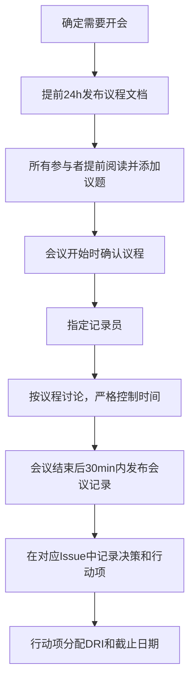

## 案例五：远程团队领导力沟通——GitLab的全远程文化

### 案例定位

在所有领导力沟通场景中，**远程团队的领导力沟通**是近年来增长最快、挑战最大的领域。它颠覆了传统领导力中"面对面互动"的基本假设——当你无法走进同事的工位、无法观察肢体语言、无法在茶水间偶遇时，如何建立信任、传递愿景、协调行动？

GitLab是全球最大的全远程公司之一，也是远程工作领域最系统化的实践者。它不仅自己践行全远程，还将整套方法论以开源手册的形式公之于众，成为无数企业研究和效仿的对象。这个案例之所以值得深度剖析，是因为GitLab的远程领导力沟通不是"权宜之计"，而是**从第一天起就被设计进了组织的基因**——它展示了当沟通被刻意设计而非自然发生时，远程团队可以达到甚至超越同地团队的协作效率和文化凝聚力。

---

### 一、背景：一家"没有办公室"的科技公司

#### 1.1 GitLab的发展历程与全远程基因

GitLab成立于2014年，由乌克兰开发者Dmitriy Zaporozhets和荷兰开发者Sytse "Sid" Sijbrandij联合创立。两人最初通过开源社区远程协作开发了一个DevOps平台，这段经历直接塑造了GitLab的全远程基因——公司的诞生本身就是远程协作的产物。

**关键发展里程碑：**

| 时间 | 里程碑 | 对远程文化的启示 |
|------|--------|-----------------|
| 2014年 | GitLab开源项目启动 | 从开源社区的分布式协作中诞生 |
| 2015年 | 加入Y Combinator | 即使在YC期间也坚持远程工作 |
| 2015年 | 发布公司手册（Company Handbook） | 将内部知识系统化公开 |
| 2018年 | 员工突破100人，分布在20+国家 | 证明远程模式可以规模化 |
| 2019年 | 员工突破1000人，分布在40+国家 | 远程协作体系成熟 |
| 2021年 | 员工超过1500人，分布在65+国家 | IPO前夜，远程模式经受资本市场检验 |
| 2022年 | 成功在纳斯达克IPO | 全球最大的全远程上市公司之一 |

**核心数据（截至2024年）：**

- **员工规模**：超过2000人
- **地理分布**：65个以上国家和地区
- **时区跨度**：覆盖几乎所有时区（UTC-12到UTC+14）
- **办公室数量**：零（没有任何实体办公室）
- **手册规模**：超过2000页，全部公开可访问
- **年营收**：超过5亿美元

#### 1.2 为什么远程领导力沟通是独特的挑战

远程工作不是"在办公室工作 + 视频会议"。它是一种根本不同的工作方式，对领导力沟通提出了独特的挑战：

**远程沟通 vs 同地沟通的差异分析：**

| 维度 | 同地团队 | 远程团队 |
|------|----------|----------|
| 信息传递 | 大量通过偶发对话、观察、肢体语言传递 | 必须刻意记录和传达，否则信息丢失 |
| 信任建立 | 通过日常互动自然积累 | 需要通过可交付物和持续的沟通刻意建立 |
| 时区问题 | 不显著 | 可能横跨十几个时区，实时协调极其困难 |
| 非语言信号 | 丰富的面部表情、肢体语言、环境线索 | 几乎消失，纯文字沟通容易产生误解 |
| 社交连接 | 自然发生（茶水间、午餐、团建） | 必须刻意设计，否则根本不会发生 |
| 信息公平性 | 在办公室的人天然获取更多信息 | 信息不对称风险极高，必须通过制度保障透明度 |
| 工作可见性 | 在办公室的"存在感"天然可见 | 必须通过结果和文档来体现贡献 |
| 文化传承 | 通过氛围、仪式、老员工带新自然传承 | 必须通过书面化、制度化的方式系统传承 |

这些差异意味着：**在远程环境中，领导者的每一项沟通行为都需要比同地环境更加刻意、更加结构化、更加文档化**。一个在办公室中可以通过"走过来说两句话"就解决的问题，在远程环境中可能需要一条精心组织的异步消息。

---

### 二、沟通策略的深度分析

GitLab的远程沟通策略不是临时搭建的，而是经过十年迭代形成的系统性框架。以下从六个维度深入分析。

#### 2.1 异步沟通优先——尊重时区与专注力

**核心理念：** GitLab的沟通哲学可以用一句话概括——"如果你需要实时才能完成一件事，那说明你的流程设计有问题。"

**异步优先的具体实践：**

**1. 文档先行（Handbook First）**

任何重要的决策、流程、政策都首先以文档形式记录在手册中。当团队成员遇到问题时，第一步不是问同事或上级，而是查阅手册。这创造了一种"文档即权威"的文化——如果某件事没有被记录在手册中，那它就不存在。

**2. 视频留言替代会议**

GitLab广泛使用异步视频工具（如Loom）。当一个讨论需要更丰富的表达时，员工录制视频留言而非发起会议。接收者在自己的工作时间观看并回复。这种方式既保留了语气和表情的丰富性，又避免了时区和日程冲突。

**3. Issue和Merge Request作为沟通中心**

GitLab的所有工作沟通都围绕其产品的Issue和Merge Request进行。每一个任务、每一个讨论、每一个决策都记录在对应的Issue中。这不仅解决了异步沟通的需求，还自动创建了组织记忆。

**异步沟通的效率公式：**

**为什么异步优先如此重要？** 它解决了远程团队面临的两个核心矛盾：一是时区差异导致"总有人在睡觉"，实时协调成本极高；二是频繁的实时互动会打断深度工作。GitLab的数据显示，异步优先的沟通方式使员工每周减少约40%的会议时间，同时信息传达的完整度反而提高了——因为书面表达比即兴发言更结构化、更少遗漏。

#### 2.2 透明的手册文化——2000页的组织说明书

GitLab的手册（Handbook）是其远程文化的基石。它不是一份静态的政策文件，而是一个持续更新的活文档，记录了公司的方方面面。

**手册的内容结构：**

| 章节类别 | 内容示例 | 页数（估算） |
|----------|----------|-------------|
| 文化与价值观 | CREDIT价值观、文化指南、多样性与包容性 | ~200页 |
| 工作方式 | 异步沟通指南、会议规范、文档写作标准 | ~300页 |
| 人力资源 | 招聘流程、入职指南、绩效评估、薪酬体系 | ~250页 |
| 产品与工程 | 开发流程、代码审查规范、发布流程 | ~400页 |
| 市场与销售 | 品牌指南、销售流程、客户沟通标准 | ~200页 |
| 安全与合规 | 信息安全策略、数据保护、合规要求 | ~150页 |
| 管理指南 | 1:1指导、团队建设、冲突处理、晋升标准 | ~300页 |
| 其他 | 差旅政策、设备采购、报销流程等 | ~200页 |

**手册的运作机制：**

**1. "直接提交"原则（Directly Responsible Individual, DRI）**

手册的每一个页面都有一个DRI（直接责任人），负责该页面内容的准确性和时效性。任何人都可以提交修改建议（通过Merge Request），但DRI负责审核和合并。

**2. "说出来的才算数"原则**

GitLab有一条硬性规定：**如果某件事只在口头讨论过但没有被记录到手册中，它就不是官方政策。** 这条规则确保了所有重要信息都被文档化，避免了"只有一部分人知道的潜规则"。

**3. 手册的持续维护**

GitLab将手册维护视为与产品开发同等重要的工作。员工被鼓励在日常工作中随手更新手册——发现过时的信息就修复，发现缺失的内容就补充。这种"修手册和修代码一样重要"的文化，保证了手册的持续生命力。

**手册的沟通价值：**

- **对新员工**：入职第一天就能了解公司的全部运作方式，减少了"问老员工才能知道"的信息不对称
- **对所有员工**：提供了决策参考框架，减少了"这事该怎么办"的不确定性
- **对管理者**：减少了重复回答相同问题的时间，可以将精力集中在更重要的事情上
- **对外部人员**：极端的透明度建立了品牌信任，也是GitLab最好的招聘广告

#### 2.3 沟通渠道矩阵——什么信息走什么通道

GitLab对不同类型的沟通使用了严格定义的渠道矩阵，避免了"信息散落在各个角落"的问题。

**GitLab沟通渠道指南：**

| 沟通类型 | 首选渠道 | 备选渠道 | 响应时间预期 |
|----------|----------|----------|-------------|
| 代码/产品讨论 | GitLab Issue/MR | — | 24小时内首次响应 |
| 项目状态更新 | GitLab Issue（标签追踪） | 周报 | 按里程碑 |
| 日常协作 | GitLab Issue评论 | Slack | 异步，不设即时响应 |
| 紧急事件（生产事故） | Slack紧急频道 + 电话 | — | 15分钟内响应 |
| 个人/社交对话 | Slack（非工作频道） | Donut咖啡聊天 | 无压力 |
| 官方政策/流程变更 | 手册更新（MR） | 邮件通知 | 按评论周期 |
| 全员通知 | 邮件 | GitLab Issue | 48小时内阅读 |
| 1:1沟通 | 视频通话（Zoom） | 异步视频（Loom） | 按约定时间 |
| 薪酬/HR敏感事项 | 邮件（加密）或视频通话 | — | 48小时内 |

**关键原则：**

- **公共渠道优先**：讨论应尽量在公共Issue中进行，而非私聊。这样其他相关人可以搜索到历史讨论，避免信息只存在于两个人之间的私聊记录中
- **书面记录优先**：即使在视频会议中做了决定，也必须在对应的Issue或手册页面中书面记录
- **避免"Slack即决策"**：Slack上的讨论被视为"暂时性的"，正式决策必须落实到Issue或手册中

#### 2.4 会议文化的革新——开会是最后的手段

GitLab对会议采取了极其审慎的态度。他们的基本原则是：**如果一件事可以通过异步沟通解决，就不要开会。**

**GitLab的会议规范：**

**1. "无会议日"制度**

GitLab设立了固定的无会议日（通常在周二或周三），在这些天中所有员工都可以专注于深度工作，不被会议打断。

**2. 会议的三个必要条件**

召开会议必须满足以下三个条件中至少一个：
- 需要实时头脑风暴或创意讨论
- 需要处理敏感的人际或HR问题
- 需要紧急应对危机事件

**3. 会议的标准流程**

当会议确实必要时，GitLab要求遵循以下流程：

**4. 录制与透明**

GitLab默认录制所有视频会议，录像和转录稿对所有员工开放。这意味着即使无法参加某个时区的会议，也可以事后异步了解全部内容。这个做法体现了GitLab的"透明度不打折扣"原则。

**5. "反向会议"模式**

对于跨时区的团队，GitLab有时采用"反向会议"——提前录制好讨论内容，参与者在各自方便的时间观看并在评论区讨论，最后在一个简短的同步会议中确认结论。这种方式将最需要创造力的异步部分放在了每个人精力最好的时段。

#### 2.5 刻意的社交连接——不让"人性化"被远程消解

远程工作最容易丧失的，是非正式的人际连接——那些"走到同事工位聊两句"、"一起吃午饭"、"茶水间偶遇"的自然社交。GitLab深刻认识到这一点，并投入大量资源刻意创造社交机会。

**GitLab的社交连接机制：**

**1. Donut聊天（虚拟咖啡）**

GitLab使用Donut Slack机器人，每周随机配对两名员工进行30分钟的非工作视频聊天。这个机制覆盖全公司，确保每个人每周都有机会与不认识的同事建立个人连接。聊天内容没有限制——可以聊家庭、爱好、旅行，也可以分享生活中的趣事。

**2. 兴趣小组（Affinity Groups）**

GitLab鼓励员工创建基于共同兴趣的小组，如：
- 宠物爱好者（分享宠物照片和故事）
- 烹饪爱好者（分享食谱和烹饪视频）
- 读书俱乐部（每月讨论一本书）
- 健身小组（互相督促运动打卡）
- 游戏之夜（定期组织在线桌游）

**3. 虚拟团建活动**

定期组织全公司或团队级别的虚拟活动：
- 线上K歌/才艺表演
- 虚拟旅游（通过Google Earth参观同事所在的城市）
- 在线烹饪课（各时区分别组织）
- 年度"Contribute"活动（面对面的全员聚会，详见后文）

**4. 面对面聚会——Contribute活动**

尽管GitLab是一家全远程公司，但它每年举办一次全员面对面聚会，称为"Contribute"。这个为期一周的活动将所有2000+员工聚在一起，进行团队建设、战略讨论和文化活动。GitLab认为，**远程工作并不意味着永远不见面，而是减少了见面的频率、提高了见面的质量**。

**为什么社交连接如此重要？**

哈佛商学院的研究显示，团队成员之间的非正式社交关系直接影响协作效率和心理安全感。在远程环境中，如果缺乏社交连接，团队成员之间会变成"只知道名字的陌生人"，这会导致：沟通更加谨慎和保留、不愿主动求助或提供帮助、冲突升级更快（因为缺乏信任缓冲）。GitLab通过制度化的社交机制，确保了"人性化"不被远程环境消解。

#### 2.6 跨时区协作机制——"跟随太阳"的工作模式

GitLab的员工分布在全球65+个国家，时区跨度极大。这意味着**任何一个时间段，都有人在工作，也有人在睡觉**。GitLab将这种挑战转化为优势，发展出了"跟随太阳"（Follow the Sun）的工作模式。

**跨时区协作的具体机制：**

**1. 时区重叠窗口**

虽然GitLab不强制所有人必须在线的时段，但对于需要实时协作的团队，会约定一个最小重叠窗口（通常为2-4小时）。在这个窗口中，团队成员可以进行同步沟通，其余时间则完全异步。

**2. Issue接力（Issue Handoff）**

对于跨时区的持续性工作（如事故处理、功能开发），GitLab使用"Issue接力"模式。当前时区的工作者在Issue中详细记录当前状态、已完成的工作、接下来需要做的事情以及注意事项，然后由下一个时区的同事接手。这种模式将全球时区差异变成了"24小时不间断工作"的优势。

**3. 决策的异步化**

GitLab的多数决策不需要"所有人同时在场讨论"。决策过程通常是：
- DRI提出方案，写成详细的文档
- 相关人在各自的工作时间审阅并提出反馈
- DRI根据反馈修订方案
- 在规定的评论期（通常48-72小时）结束后，DRI做出最终决策
- 决策及其理由记录在对应的Issue中

**4. 时区感知的日程安排**

GitLab要求所有人在个人资料中标注自己的时区和工作时间。会议安排工具会自动计算所有参与者的本地时间，避免在某个人的深夜安排会议。

---

### 三、领导力沟通的特殊维度

在远程环境中，领导者的沟通面临一系列独特的挑战。GitLab发展出了系统化的应对方案。

#### 3.1 新员工入职的远程化——第一印象决定一切

在同地公司中，新员工入职通常有同事带着参观办公室、一起吃午饭、在工位上手把手教学。在全远程环境中，这些都不存在。GitLab将入职过程系统化为一个完整的远程体验。

**GitLab远程入职流程：**

| 入职阶段 | 时间 | 内容 | 负责人 |
|----------|------|------|--------|
| 入职前准备 | 入职前2周 | 设备邮寄、账号创建、入职手册发送 | HR + IT |
| 第一天 | Day 1 | 视频欢迎会、公司文化介绍、与Buddy配对 | 直属经理 + HR |
| 第一周 | Week 1 | 手册必读章节学习、部门介绍、第一次1:1 | Buddy + 经理 |
| 前30天 | Month 1 | 完成所有入职培训模块、参与第一个实际项目 | 经理 + 导师 |
| 前90天 | Month 3 | 完成第一个里程碑、参与Contribute活动（如有）、转正评估 | 经理 |

**Buddy制度（伙伴制度）：**

每位新员工入职时会被分配一位"Buddy"——一位资深员工，负责在入职后的前三个月提供非正式的支持。Buddy的角色不是导师（不涉及工作技能指导），而是"文化向导"——帮助新员工理解"在GitLab工作的隐性规则"。这种角色的存在，弥补了远程环境中"老员工带新"自然消失的缺口。

#### 3.2 绩效管理与反馈的远程化

在远程环境中，管理者无法通过日常观察来评估员工的工作状态。GitLab发展出了以结果为导向的绩效管理体系。

**GitLab远程绩效管理框架：**

**1. OKR（目标与关键结果）体系**

GitLab使用OKR来设定和追踪目标。每个季度，团队和个人设定明确的目标和可量化的关键结果。OKR的透明度极高——所有人的OKR（包括CEO的）对全公司可见。这种透明性解决了远程环境中的"看不到别人在做什么"的问题。

**2. 持续反馈而非年度评估**

GitLab不依赖年终评估来提供反馈。管理者被要求：
- 每周与直接下属进行一次异步Check-in（通过书面更新）
- 每两周进行一次30分钟的1:1视频通话
- 在每次项目里程碑后提供具体的反馈
- 使用SBI（Situation-Behavior-Impact）模型来结构化反馈

**SBI反馈模型在远程环境中的应用：**

| 要素 | 说明 | 示例 |
|------|------|------|
| Situation（情境） | 描述具体场景 | "在上周三的API设计讨论Issue中" |
| Behavior（行为） | 描述观察到的行为 | "你详细记录了三种方案的优缺点并附上了性能测试数据" |
| Impact（影响） | 说明行为产生的影响 | "这让跨时区的同事能够在自己的工作时间做出充分评估，加速了决策过程" |

**3. 360度反馈**

GitLab每年进行两次360度反馈，收集来自同事、上级、下级和跨部门合作方的反馈。反馈通过专门的工具收集和汇总，确保匿名性和建设性。

#### 3.3 危机沟通的远程化

远程团队面临危机（如生产事故、安全事件、PR危机）时，沟通的挑战比同地团队更为严峻——你无法把所有人叫到一间会议室里快速对齐。

**GitLab的远程危机沟通协议：**

**1. 明确的升级路径**

GitLab定义了清晰的事件严重等级和对应的沟通升级路径：

| 严重等级 | 定义 | 响应时间 | 沟通方式 |
|----------|------|----------|----------|
| SEV-1 | 服务完全不可用或数据泄露 | 15分钟 | Slack紧急频道 + 电话召集 |
| SEV-2 | 核心功能严重受损 | 1小时 | Slack紧急频道 |
| SEV-3 | 非核心功能异常 | 4小时 | Issue跟踪 |
| SEV-4 | 微小问题，不影响用户体验 | 下一个工作日 | Issue跟踪 |

**2. 事故指挥官（Incident Commander）制度**

每次SEV-1或SEV-2事件，都会指定一名事故指挥官（IC），负责协调所有沟通和决策。IC的职责是：确保所有相关方及时获得信息、做出关键决策、在事故结束后主持事后复盘（Postmortem）。

**3. 事后复盘（Blameless Postmortem）**

GitLab对所有SEV-1和SEV-2事件进行无指责的事后复盘。复盘文档记录事件的时间线、根本原因、影响范围和改进措施，并对全公司公开。这种"无指责"文化确保了团队成员愿意坦诚地分享错误和教训。

#### 3.4 文化传承的远程化

在同地公司中，文化通过"氛围"自然传承——新人坐在老员工旁边，观察他们的工作方式，逐渐融入。在远程环境中，这种自然传承不存在。GitLab通过三种机制确保文化的持续传承：

**1. 手册即文化载体**

如前所述，2000页的手册不仅是操作指南，更是文化的文字化呈现。GitLab的价值观、行为准则、决策框架都以手册为载体，确保文化不依赖于某个"文化传承者"的个人存在。

**2. CREDIT价值观的嵌入**

GitLab的文化核心是其CREDIT价值观体系（详见第四节），每个价值观都有具体的行为描述和考核标准，确保价值观不是口号而是可执行的行为准则。

**3. Contribute全员聚会**

年度Contribute活动是文化传承的关键仪式。在一周的面对面互动中，新老员工建立个人连接，新员工亲身体验"GitLab的氛围"，老员工重新感受文化的核心。这种年度"文化充值"弥补了远程环境中文化稀释的风险。

---

### 四、CREDIT价值观——远程协作的行为准则

GitLab的文化核心是CREDIT价值观体系，六个字母分别代表六项核心价值。这不是一份挂在墙上的标语，而是深入每个沟通细节的行为准则。

**CREDIT价值观详解：**

| 价值 | 英文全称 | 在沟通中的具体体现 |
|------|----------|-------------------|
| C | Collaboration（协作） | 公共渠道优先，避免私聊中的信息孤岛 |
| R | Results（结果） | 以可交付物和数据为基础进行评估，而非"看起来在忙" |
| E | Efficiency（效率） | 异步优先，减少不必要的会议，书面记录替代口头传达 |
| D | Diversity（多样性） | 尊重不同时区、文化背景、工作风格的差异 |
| I | Iteration（迭代） | 快速发布最小可行方案，持续改进而非追求完美 |
| T | Transparency（透明） | 默认公开，手册文化，所有决策有迹可循 |

**价值观如何指导具体沟通决策：**

以"Transparency（透明）"为例，它不是抽象的原则，而是具体的行为指南：
- 所有Issue默认对全公司可见，只有涉及个人隐私的HR事项才是私有的
- 会议默认录制并向全员开放
- 公司财务数据定期向全员通报
- CEO的日程表对全员可见
- 即使是敏感的战略讨论，事后也会以摘要形式公开

这种极致的透明度在远程环境中尤为重要——**当信息不对称存在时，人会本能地往最坏的方向猜测**。透明度消除了猜测的空间，建立了信任的基础。

---

### 五、理论框架对照分析

为了帮助读者将GitLab案例与本章的理论框架对接，以下进行系统对照。

#### 5.1 与情境领导力理论的对照

情境领导力理论主张领导风格应根据下属的成熟度灵活调整。在远程环境中，这种灵活性面临额外挑战——你更难感知下属的状态。

| 情境领导力风格 | GitLab的远程实践 |
|---------------|-----------------|
| 指导型（高任务、低关系） | 入职手册提供了详尽的任务指引，新员工可以自驱学习 |
| 教练型（高任务、高关系） | Buddy制度 + 定期1:1，兼顾任务指导和关系建立 |
| 支持型（低任务、高关系） | 兴趣小组、Donut聊天、非正式社交机制 |
| 授权型（低任务、低关系） | OKR体系 + DRI制度，给予充分自主权 |

GitLab的远程体系实际上是**在制度层面系统化地支持了所有四种情境领导力风格**——通过手册和模板支持指导型，通过Buddy和1:1支持教练型，通过社交机制支持支持型，通过OKR和DRI支持授权型。这种制度化弥补了远程环境中"领导者难以灵活切换风格"的困境。

#### 5.2 与仆人式领导力的对照

仆人式领导力强调领导者首先是一个服务者，通过赋能团队来实现目标。GitLab的管理模式与仆人式领导力高度契合：

- **倾听**：GitLab通过全员反馈机制、匿名调查、公开的Issue讨论确保领导者持续倾听团队的声音
- **同理心**：跨时区的制度设计体现了对不同生活方式和工作节奏的尊重
- **治愈**：无指责的事后复盘文化为团队提供了一个安全地面对和处理失败的空间
- **自我认知**：360度反馈机制帮助管理者持续反思自己的领导方式
- **说服而非命令**：DRI决策模型强调通过充分的讨论和文档化来说服，而非通过职位权威命令

#### 5.3 与包容性领导力的对照

包容性领导力强调尊重和利用多样性。GitLab的全远程模式天然具有包容性优势：

- **地理包容性**：65个国家的员工无需搬家即可工作，这为发展中国家的优秀人才提供了前所未有的机会
- **时区包容性**：异步优先的工作方式尊重了每个人的生活节奏
- **身体包容性**：远程工作为行动不便或有特殊需求的人提供了便利
- **文化包容性**：书面沟通为主的文化减少了因口音、语言流利程度导致的不平等

---

### 六、可量化的成果

GitLab的远程领导力沟通模式的效果，最终通过一系列客观数据来衡量。

| 指标 | 数据 | 行业对比/说明 |
|------|------|--------------|
| 员工地理分布 | 65+国家 | 远程公司中最广泛的地理分布之一 |
| 员工留存率 | 高于行业平均 | 全远程模式下的员工留存率与硅谷头部公司持平 |
| 手册规模 | 2000+页 | 科技公司中最详尽的公开手册 |
| IPO表现 | 2022年纳斯达克上市 | 全球最大的全远程上市公司之一 |
| 年营收 | 超过5亿美元 | 持续高速增长 |
| 会议时间占比 | 低于行业平均 | 异步优先策略显著减少了会议时间 |
| Glassdoor评分 | 4.0+ | 在远程公司中处于较高水平 |

**更深层的成果：**

GitLab的远程模式不仅在数字上可衡量，还在组织层面产生了深远影响：
- **人才池的扩大**：不受地理限制的招聘使GitLab可以在全球范围内挑选最优秀的人才，而非局限于某个城市的候选人
- **成本效率**：零办公室租金意味着更多资源可以投入产品和人才
- **知识留存率**：所有重要知识都记录在手册和Issue中，人员流动不会导致知识流失

---

### 七、关键启示与可迁移模式

#### 7.1 远程领导力沟通的六个核心原则

**原则一：文档化一切**

在远程环境中，"没有被记录的事情就不存在"。领导者需要建立一种习惯：每一个决策、每一次讨论、每一条政策都以书面形式记录在可搜索的系统中。这不是额外的工作，而是远程工作的基本成本。

**原则二：异步是默认，同步是例外**

将实时会议视为"最后的手段"而非"默认选项"。这不仅解决了时区问题，还保护了每个人的深度工作时间。当确实需要会议时，做好充分准备——议程、材料、预期产出都应提前分享。

**原则三：透明度建立信任**

在缺乏面对面互动的环境中，透明度是建立信任的最有效方式。默认公开而非默认隐藏，让每个人都能看到"事情是怎么运作的"。当信息不对称存在时，人会本能地往最坏的方向猜测。

**原则四：刻意创造社交连接**

远程工作中的社交不会自然发生。领导者需要通过制度化的机制（如虚拟咖啡、兴趣小组、定期面对面聚会）来刻意创造人际连接的机会。这种投资的回报是更高的信任、更好的协作和更低的流失率。

**原则五：以结果而非"存在感"评估绩效**

远程环境中无法通过"坐在工位上"来判断一个人是否在工作。领导者必须转向以结果为导向的评估方式——设定明确的目标，追踪可量化的成果，用SBI模型提供具体的反馈。

**原则六：为异步沟通投资基础设施**

高效的异步沟通需要强大的基础设施支撑——版本化的文档系统、结构化的Issue追踪、异步视频工具、自动化的状态同步。对这些工具和流程的投资，是远程团队高效运作的前提条件。

#### 7.2 不同规模团队的应用建议

| 团队规模 | 重点应用的GitLab模式 | 实施优先级 |
|----------|---------------------|-----------|
| 5-20人 | 异步沟通习惯 + 简化版手册 + 每周虚拟咖啡 | 立即开始，1个月内见效 |
| 20-100人 | 沟通渠道矩阵 + DRI制度 + OKR体系 + 入职Buddy制 | 需要2-3个月的系统建设 |
| 100-500人 | 完整的手册体系 + 会议规范 + 360度反馈 + 年度聚会 | 需要持续投入，6个月见效 |
| 500人以上 | GitLab全套体系 + 专门的"远程工作运营"团队 | 需要组织级别的投入 |

---

### 八、反面警示：GitLab模式的局限性

GitLab的模式并非没有代价和局限。在学习其经验时，需要清醒地认识以下问题。

#### 8.1 手册维护的高成本

2000页的手册需要持续投入大量人力维护。GitLab有专门的团队负责手册的结构化和更新。对于资源有限的中小团队，完全复制这种手册体系可能不现实。建议的做法是**从核心流程和政策开始，逐步扩展**，而非一开始就追求覆盖所有方面。

#### 8.2 信息过载的风险

极度的透明度意味着每个人都可以看到海量信息。GitLab也面临过员工"信息疲劳"的问题——太多的通知、太多可以阅读的文档、太多参与讨论的邀请。解决这个问题需要清晰的信息优先级和过滤机制。

#### 8.3 不适合所有类型的工作

GitLab的模式高度依赖书面沟通能力。对于需要高度实时协作的工作（如硬件研发、实验室操作、客服热线），纯异步模式可能不适用。在这些场景中，需要找到同步和异步之间的平衡点。

#### 8.4 孤独感和倦怠风险

即使是GitLab这样精心设计社交机制的公司，远程工作仍然可能导致员工的孤独感。长期缺少面对面互动、工作和生活空间重叠、持续的在线压力都可能导致倦怠。GitLab通过Contribute活动、心理健康支持和灵活的工作政策来缓解这些风险，但无法完全消除。

#### 8.5 文化稀释的挑战

随着公司规模增长，文化稀释是不可避免的挑战。GitLab在从100人增长到2000人的过程中，多次面临"新员工不理解手册文化"的问题。文化的传承需要持续的投入——不是一次性培训可以解决的，而是需要通过制度、仪式和领导者的持续示范来维持。

---

### 九、延伸思考

1. 如果你的团队是"混合办公"（部分人在办公室、部分人远程），GitLab的哪些策略可以直接使用？哪些需要调整？你如何避免"在办公室的人形成信息优势，远程的人成为二等公民"的陷阱？

2. GitLab的"极致透明"在你的组织文化中是否可行？如果不行，你可以在哪些具体维度上提高透明度，同时保护必要的隐私和商业机密？

3. 在你的行业中，"异步优先"的工作方式面临哪些具体的障碍？这些障碍是真实的还是习惯性的？如何通过小规模实验来验证异步方式的可行性？

4. GitLab每年花费大量资源举办全员面对面聚会。如果你的预算有限，你会如何设计一个更经济的替代方案来达到同样的文化传承效果？

5. GitLab的远程模式对领导者的书面表达能力提出了极高的要求。如果你的团队成员（包括你自己）的书面表达能力不足以支撑高效的异步沟通，你会如何系统性地提升这种能力？

***
