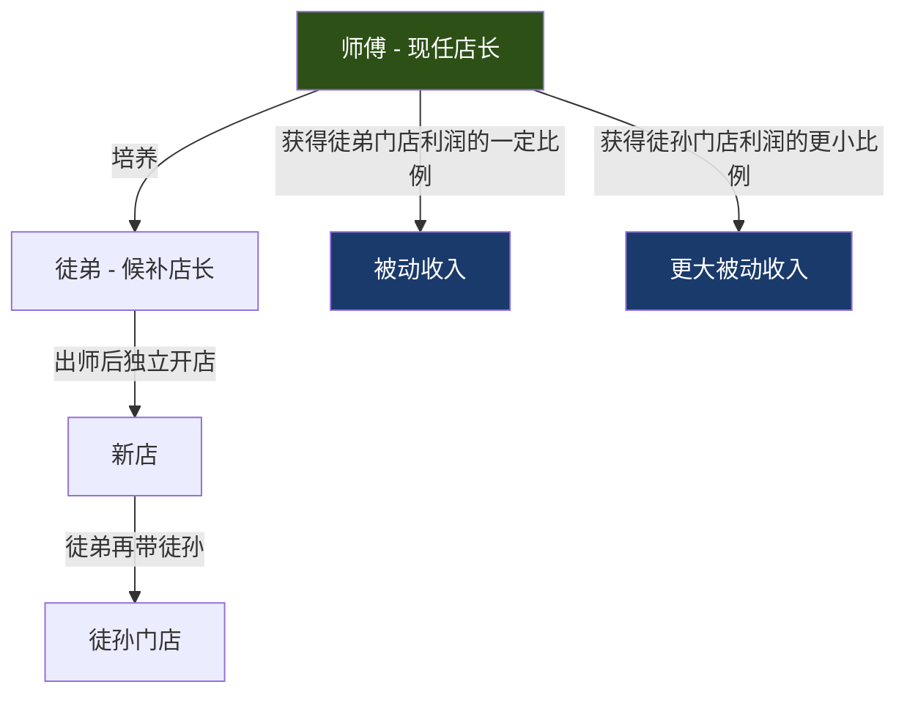
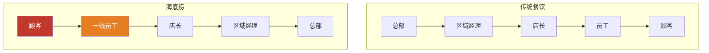
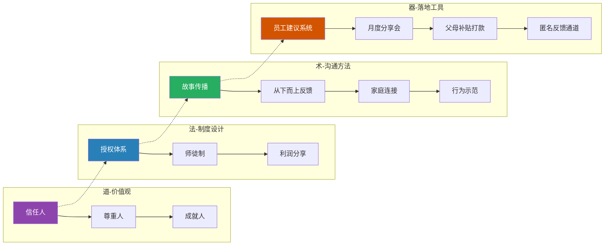

## 案例六：组织文化塑造——海底捞的服务文化

### 一、案例背景：从四张桌子到千亿市值

1994年，四川简阳一家只有四张桌子的小火锅店开业了。创始人张勇没有餐饮经验，不懂厨艺，甚至连火锅底料都是买的现成的。但就是这家店，在三十年间成长为拥有超过1300家门店、年营收超400亿元、员工超10万人的中国餐饮巨头。2018年海底捞在港交所上市，市值一度突破4500亿港元。

海底捞的成功密码不是锅底配方，不是食材供应链，而是一种几乎不可复制的东西——**以极致服务为核心的组织文化**。

这家企业的服务有多极致？顾客等位时可以免费做美甲、擦鞋、吃零食；一个人吃火锅，服务员会在对面放一只毛绒玩具陪吃；顾客随口说一句"西瓜好吃"，服务员直接打包一个让他带走；下雨天顾客离开时，员工追出几百米送伞。

这些不是手册上的规定，不是总部的统一要求，而是**一线员工自发的创造性行为**。问题在于：是什么样的领导力沟通方式，能让十万名员工——其中绝大多数是没有大学学历的年轻人——主动地、持续地、创造性地提供远超预期的服务？

这正是本案例要深入分析的核心命题。

---

### 二、海底捞文化的核心基因：信任与授权

#### 2.1 张勇的管理哲学：把人当人

张勇出身底层，1994年和三个朋友凑了8000块钱创业。他没有MBA背景，没有管理学理论，但他有一个朴素而深刻的信念：**人被尊重了，才会发自内心地尊重别人**。

这个信念的形成有具体的故事。创业初期，张勇发现一个叫杨利娟的服务员，每天比别人多干两小时，主动帮顾客带孩子、找丢失的手机。张勇没有把这些当成"应该的"，而是直接提拔她当店长，后来杨利娟成为海底捞的首席运营官，2022年接替张勇出任CEO。

张勇说过一段话，后来被商学院反复引用：

> "我们的核心竞争力不是服务，是人力资源体系。好的服务是结果，不是原因。原因是我们的员工愿意提供好服务。"

这段话揭示了海底捞文化的底层逻辑——**先解决"人愿不愿意干"的问题，再解决"怎么干"的问题**。

#### 2.2 授权体系：中国餐饮业最激进的信任实验

海底捞的授权力度在整个中国餐饮业乃至服务业中都是罕见的。以下是具体的授权层级：

| 授权对象 | 授权内容 | 审批流程 | 行业对比 |
|---------|---------|---------|---------|
| 普通服务员 | 单桌赠菜、打折、免单（单次限额约300元） | 无需审批，自主决定 | 绝大多数餐饮企业需要店长以上审批 |
| 店长 | 单笔100万元以下的支出（包括装修、设备采购） | 无需上级审批 | 同等规模企业通常需要区域经理或总部审批 |
| 小区经理 | 所辖门店的人事任免、选址决策 | 知会大区经理即可 | 多数企业需要总部人力资源部门介入 |
| 大区经理 | 区域战略规划、新品牌孵化 | 向总部汇报 | 通常需要董事会级别决策 |

**这个授权体系的核心沟通信号是"我信任你"**。张勇深信，给员工信任比给员工培训更能激发好服务。当一个服务员被授权可以免单时，他传递的不是"你可以少收钱"，而是"我把你当成一个能做判断的人"。

这种信任的回报是显著的。海底捞的员工流失率长期维持在约10-15%，而中国餐饮行业平均流失率高达60-80%。这意味着海底捞每年节省了大量招聘和培训成本，并保持了服务质量的连续性。

#### 2.3 "连住利益，锁住管理"——师徒制的利益绑定

海底捞最独特的制度设计之一是**师徒制**。这不是一个简单的"老带新"安排，而是一套精密的利益绑定机制：

**制度要点：**

1. **师傅的收入 = 自己门店利润 + 徒弟门店利润分成 + 徒孙门店利润分成**。这意味着一个店长有强烈动机去培养优秀人才，因为徒弟开店越多，自己的收入越高。

2. **徒弟开店后，师傅不需要再管这家店**，但仍然享受利润分成。这创造了"退休式收入"的可能——一个老店长即使退居二线，收入也可能远超普通店长。

3. **每家新店的店长必须由老店长的徒弟担任**。这保证了文化传承：徒弟从师傅那里学到的不仅是管理技能，更是海底捞的服务理念和沟通方式。

**这个制度的沟通效果极为深远**：它让"带人"从一个管理义务变成了一个经济利益驱动的主动行为。师傅会花大量时间教徒弟，不是因为公司规定，而是因为自己的收入取决于徒弟的能力。

---

### 三、文化传播的四大机制

#### 3.1 机制一：故事而非制度——用叙事构建文化

海底捞的员工手册很薄。张勇刻意不制定详细的服务操作规范，因为他认为"服务是活的，规范会把它变成死的"。取而代之的是**故事传播**。

**故事是怎么流传的？**

- **新员工入职培训**：7天的入职培训中，超过一半时间在讲述真实的服务案例。培训师不会说"你要主动帮顾客"，而是讲一个具体故事："去年夏天，有个服务员看到一位孕妇顾客想吃冰淇淋但又怕凉，她跑到隔壁甜品店买了一份常温的芒果慕斯，自掏腰包。后来那位孕妇成了我们的忠实顾客，每次都指定去这个服务员的台位。"

- **月度分享会**：每家门店每月举行一次服务故事分享会，员工轮流讲述自己或同事的优秀服务案例。这些故事会被记录、评选，最好的故事会进入公司内部的"服务故事库"。

- **师徒口传**：师傅带徒弟时，会不断用故事来解释"为什么这样做"。比如："我以前遇到一个客人，一个人来吃火锅，点了两盘肉就坐在那里不动了。我看他脸色不好，就多聊了几句，才知道他刚失恋。我送了他一份甜品，写了一张卡片。后来他每个月都来，还带了女朋友来。你看，服务不是端盘子，是关心人。"

**为什么故事比制度更有效？**

制度告诉人"做什么"，故事告诉人"为什么做"和"怎么做"。一个听过100个服务故事的新员工，面对任何突发情况都能找到参考——不是通过查手册，而是通过回忆类似的故事。这就是海底捞想要的效果：**让文化成为一种直觉，而不是一套规则**。

#### 3.2 机制二：从下而上的沟通——让一线发声

传统餐饮企业的沟通是单向的：总部制定标准，区域传达，门店执行，员工服从。海底捞刻意打破了这个模式。

**具体做法：**

**（1）员工建议制度**

任何员工都可以直接向店长提出改进建议。建议被采纳后，提出者会获得奖金（从几百到几千元不等）和公开表彰。更重要的是，很多被采纳的建议会以提出者的名字命名。

例如，海底捞著名的"甩面表演"——服务员在顾客面前把面条拉成各种花样——最初就是一位普通服务员的创意，后来成为海底捞的标志性服务之一。

**（2）匿名反馈通道**

海底捞在内部系统中设置了匿名反馈渠道，员工可以匿名反映门店管理问题、同事之间的矛盾、甚至对上级的不满。这些反馈直接到达区域经理层面，绕过店长。

**（3）"倒三角"管理理念**

张勇多次强调一个观点："我的上级是员工，员工的上级是顾客。" 这不是口号——在海底捞的考核体系中，店长的考核指标之一是"员工满意度"，而不是单纯的营业额。

**沟通效果：** 当员工知道自己的声音真的会被听见、会被采纳时，他们不会把建议当成额外负担，而是当成一种参与感。这种参与感是主人翁意识的根基。

#### 3.3 机制三：关心员工的家庭——用行动而非口号

海底捞在员工关怀方面的投入力度，在中国餐饮业中几乎没有可比的对手。

**具体措施：**

| 关怀项目 | 具体内容 | 沟通信号 |
|---------|---------|---------|
| 住宿 | 所有员工提供免费宿舍，距门店步行不超过20分钟，配空调、网络、专人打扫 | "你的基本生活质量由我负责" |
| 子女教育 | 在四川简阳建设员工子女学校（"海底捞希望小学"升级版），解决员工子女入学问题 | "你不仅是一个员工，你是一个家庭的支柱" |
| 父母补贴 | 优秀员工的父母每月可收到公司发放的奖金（直接打到父母账户） | "你的家人也是我的家人" |
| 晋升通道 | 从服务员到店长最快只需4年，且不看学历只看能力 | "你的天花板不由出身决定" |
| 回家安排 | 春节期间安排员工轮休返乡，并提供交通补贴 | "你值得和家人团聚" |

**父母补贴是一个特别精妙的沟通设计。** 当一位员工的父母收到公司打来的500元奖金时，父母会打电话给孩子："好好干，这个公司不错。" 这比任何公司培训都有效——**它把沟通的对象从员工本人扩展到了员工的家庭系统**，创造了来自家庭的正向激励。

张勇解释过这个设计的逻辑："我管不了十万个人，但我能让十万个人的父母帮我管。"

#### 3.4 机制四：领导者的行为示范——身先士卒

文化不是靠宣讲建立的，而是靠领导者的行为建立的。张勇和其他高管的行为模式本身就是最强大的文化沟通工具。

**行为示范的实例：**

1. **张勇亲自站台**：创业初期，张勇亲自在店里端盘子、擦桌子、给顾客带孩子。即使公司做大后，他仍然会不定期到门店"微服私访"，以普通顾客身份体验服务。

2. **高管轮岗制度**：海底捞的区域经理以上管理者，每年必须花一定时间在一线门店"回炉"——重新当服务员、当传菜员。这不是象征性的，而是实打实的全日制工作。

3. **杨利娟的故事**：杨利娟从16岁的服务员做起，一路成长为CEO。这个案例本身就是海底捞文化的最强证明——"在这里，出身不重要，能力决定一切"。她的晋升过程被反复在新员工培训中讲述，是最有说服力的文化叙事。

4. **危机时刻的示范**：2020年新冠疫情爆发，海底捞全国门店关停数月。张勇和高管团队主动降薪，同时承诺不裁员。这个行为传递的信号极其强烈——"我和你们共进退"。

---

### 四、海底捞文化的沟通框架解析

将海底捞的组织文化沟通提炼为一个可复制的框架：

**这个框架的核心逻辑是：价值观决定制度设计，制度设计决定沟通方法，沟通方法需要工具落地。四层缺一不可。**

很多企业模仿海底捞的服务——学它的美甲、学它的甩面、学它的等位零食——但学不像。原因在于它们只学了"术"和"器"层面的东西，没有"道"和"法"的支撑。没有真正的授权，员工做美甲只是在执行任务；有了授权，员工做美甲是在表达关怀。

---

### 五、文化危机与修复：2017年的老鼠门事件

任何组织文化都会面临考验。2017年8月，媒体曝光海底捞北京两家门店后厨出现老鼠、用漏勺掏下水道等卫生问题。这是海底捞历史上最严重的公关危机。

**海底捞的危机沟通反应：**

1. **反应速度**：曝光后3小时内，海底捞发布官方声明，没有否认、没有辩解、没有推卸。声明的关键词是"感谢媒体和公众的监督，我们确实存在问题"。

2. **责任归属**：声明明确指出"问题出在管理层，不是员工"。这个表态保护了一线员工的士气，同时向公众传递了担当的信号。

3. **整改措施**：公布具体整改方案，包括后厨可视化、邀请顾客参观后厨、增加卫生检查频次等。

4. **后续跟进**：整改完成后，主动邀请媒体回访。

**这次危机的沟通效果：** 与大多数企业在危机中的防御姿态不同，海底捞的坦诚态度反而赢得了公众的谅解。很多人评价说"这才是大企业该有的态度"。危机之后，海底捞的客流不降反升。

**这个案例的沟通启示：** 组织文化的真正强度，不是在顺境中体现的，而是在危机中体现的。当领导者在危机中依然坚持"坦诚、担责、行动"的原则时，文化不仅没有被摧毁，反而被强化了。

---

### 六、海底捞模式的局限与争议

没有完美的组织文化模式。对海底捞的分析如果只讲好的一面，就失去了参考价值。

#### 6.1 过度扩张后的文化稀释

2019-2021年，海底捞进行了激进的扩张——仅2020年疫情期间就逆势新开544家门店。快速扩张带来了严重问题：

- **新店长培养速度跟不上开店速度**，大量不够成熟的管理者被提拔
- **师徒制的质量下降**，因为师傅数量不够，带出的"徒弟"水平参差不齐
- **服务质量出现下滑**，社交媒体上开始出现"海底捞服务不行了"的评价

2021年底，海底捞宣布关闭约300家门店，一次性关停近四分之一的门店。这次"啄木鸟计划"是张勇承认扩张战略失败的标志。

**沟通启示：** 文化有它的承载极限。当组织扩张速度超过文化的传承速度时，文化必然被稀释。领导者需要认识到，文化是需要时间浇灌的，不是靠资源就能加速的。

#### 6.2 员工压力与内卷

海底捞的高强度服务文化也带来了副作用。一些员工反映：

- 被顾客"过度刁难"时，公司倾向于满足顾客而非保护员工
- 服务标准不断被抬高，员工需要不断"表演"热情
- 师徒制中，师傅对徒弟有很大的话语权，可能造成权力不对等

这些问题提醒我们：**授权文化需要配套的边界保护机制**。授权不等于无限责任，信任不等于没有底线。

#### 6.3 模式可复制性的争论

很多企业试图复制海底捞模式，绝大多数失败了。原因包括：

- **创始人基因不可复制**：张勇的个人特质（底层出身、对人性的深刻理解、敢于放手）是文化的关键变量
- **经济模型不同**：海底捞的高翻台率和客单价支撑了高人力成本投入，其他行业未必具备这个条件
- **文化有路径依赖**：海底捞的文化是在三十年中自然生长的，短期内人为"植入"很难生效

---

### 七、可复用的领导力沟通策略

从海底捞案例中提炼出适用于其他组织的沟通策略：

#### 7.1 策略一：从"控制"转向"信任"

| 控制型沟通 | 信任型沟通 |
|-----------|-----------|
| "按照手册执行" | "你判断怎么做最好" |
| "出了问题我负责" | "出了问题我们一起承担" |
| "这是规定" | "这是原则，你怎么理解" |
| 管理者是裁判 | 管理者是教练 |

**实施步骤：**

1. **从小授权开始**：不要一上来就给员工免单权。可以从"允许员工在50元以内自主决定赠送小礼品"开始，观察效果后逐步扩大。

2. **明确边界**：授权不等于放任。需要设定清晰的底线——什么情况下可以行使授权，什么情况下需要上报。

3. **容错机制**：员工行使授权出现错误时，要区分"善意的错误"和"恶意的滥用"。前者要包容甚至鼓励，后者才需要纠正。

#### 7.2 策略二：建立"故事资产库"

**操作指南：**

1. **收集故事**：每月从各团队收集优秀服务/协作/创新的真实案例
2. **结构化记录**：每个故事包含"情境-行为-结果-启示"四要素
3. **多渠道传播**：新员工培训、月度会议、内部公众号、员工食堂的展示屏
4. **持续更新**：故事库不是一次性建设，而是持续积累的过程
5. **命名机制**：优秀案例可以用员工名字命名，如"小王快速响应法"

#### 7.3 策略三：打通家庭连接

**不需要照搬海底捞的父母补贴制度**，但可以借鉴"把沟通对象从员工扩展到家庭"的思路：

- 员工获得重要成就时，给家属发一封感谢信或小礼物
- 年终总结时，制作一份员工成长报告寄给家属
- 开放日邀请家属来公司参观
- 节日给员工家属发送祝福（而非只给客户发）

#### 7.4 策略四：领导者必须"在场"

**文化不是通过邮件、PPT、标语建立的，而是通过领导者的日常行为建立的。**

具体做法：
- 每周至少花半天时间在一线观察和体验
- 亲自回复员工的建议（至少是部分）
- 在公开场合讲述员工的优秀故事
- 在犯错时公开承认，而非掩饰

---

### 八、关键启示总结

1. **文化不是贴在墙上的口号，而是日常的行为和决策。** 海底捞的墙上没有"顾客至上"四个字，但每个员工的行为都在践行这个理念。

2. **授权是最强有力的沟通行为之一。** 当你对一个人说"我信任你"时，你传递的信息比任何培训课程都更深刻。

3. **故事是文化传承的最佳载体。** 制度会过时，手册会被遗忘，但故事会被反复讲述。

4. **关心员工不是成本，而是投资。** 海底捞在员工关怀上的投入回报率，远高于大多数企业的营销投入回报率。

5. **文化有承载极限。** 扩张速度必须匹配文化的传承速度，否则再好的文化也会被稀释。

6. **危机是文化的试金石。** 一个组织的文化是否真实，在危机中一目了然。

7. **领导者的行为就是最强大的文化沟通。** 员工不会听你说什么，会看你做什么。

---
