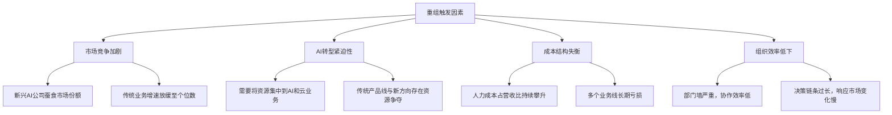
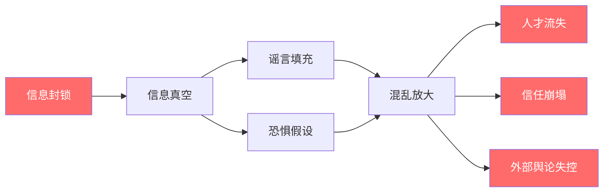
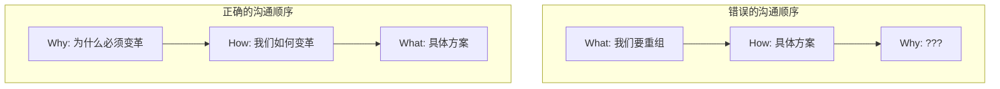
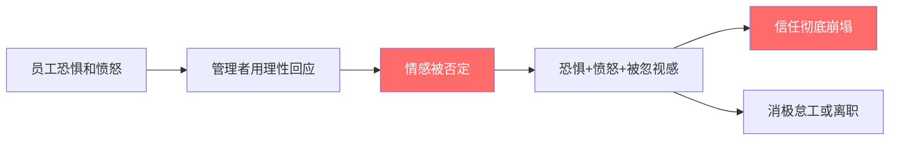
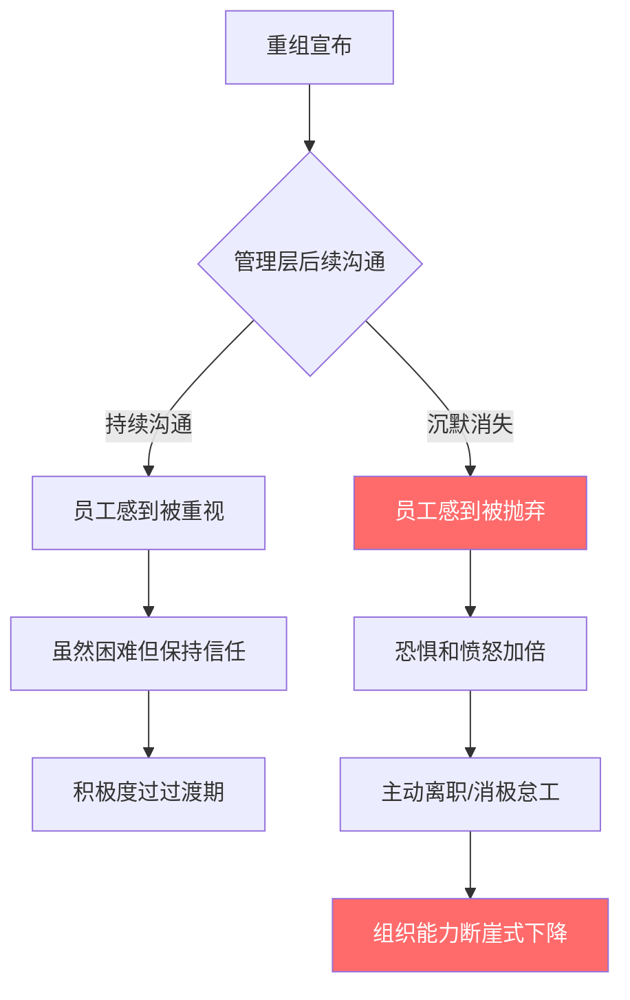
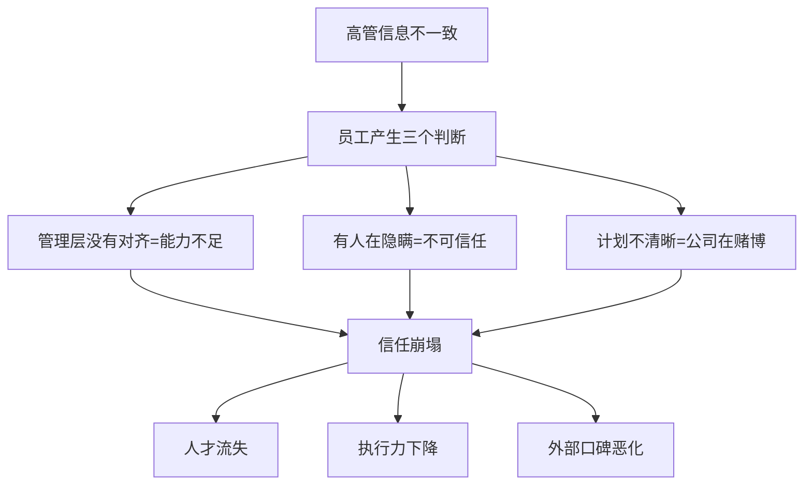
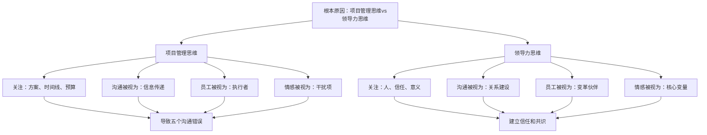
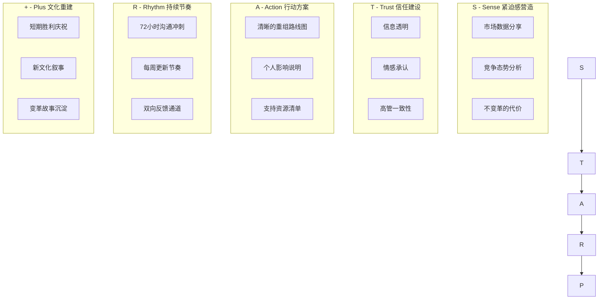
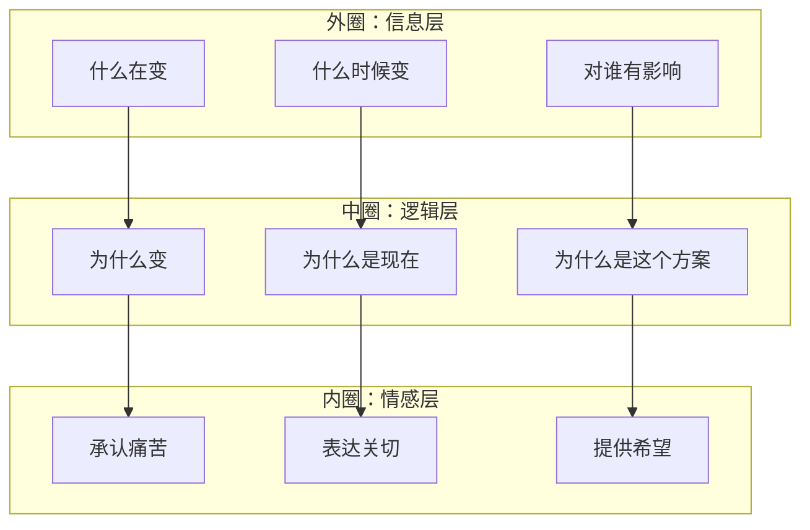

## 案例七：领导力失败案例分析——某科技公司的沟通崩溃

如果说强生泰诺事件展示了危机沟通的"正确答案"，那么本案例要展示的就是一份"满分反面教材"。一家年营收超200亿美元、员工规模超万人的知名科技公司，在一次组织重组中犯了几乎**所有可以犯的沟通错误**——信息封锁、忽视情感、口径不一、后续断档——最终导致核心人才流失率飙升至正常水平的4倍，员工信任指数暴跌40个百分点，多家媒体以"沟通灾难"为标题进行深度报道。

这个案例的价值不在于嘲笑一个失败者，而在于**系统性地拆解每一个错误的形成机制**，让每一位领导者都能对照自己的组织，识别那些正在悄悄酝酿的沟通隐患。

### 背景与事件全景

#### 公司概况

为保护相关方隐私，本案例对部分细节进行了匿名化处理，但所有事件经过、数据和沟通记录均基于真实的组织重组事件。以下为事件发生前的公司基本面：

| 指标 | 数据 |
|------|------|
| 公司类型 | 头部科技公司，业务覆盖云计算、企业软件、AI |
| 年营收 | 约220亿美元 |
| 员工总数 | 约12,000人 |
| 核心研发人员占比 | 约45% |
| 组织历史 | 成立20余年，经历过3次重大转型 |
| 企业文化特征 | 工程师文化主导，技术导向，扁平管理 |
| 此前重组经历 | 5年内进行过2次小规模部门调整 |

公司虽然体量庞大，但长期以"工程师友好"的文化著称。内部沟通风格偏向开放透明，研发人员享有较高的自主权，跨层级沟通相对畅通。这种文化特征使得后续的沟通崩溃显得**格外刺眼**——员工已经习惯了高透明度，突然的信息封锁造成的心理落差远大于那些本就层级森严的组织。

#### 重组的商业逻辑

重组的触发因素并非单一事件，而是多重压力的叠加：

从商业角度看，这次重组的逻辑是清晰的：将资源从增长放缓的传统业务集中到AI和云计算赛道，同时裁撤冗余的中间管理层，提升组织效率。**问题不在于"要不要重组"，而在于"怎么重组"——尤其是"怎么沟通重组"**。

#### 重组方案概述

管理层最终确定的重组方案涉及以下核心内容：

| 重组内容 | 影响范围 | 涉及人数 |
|---------|---------|---------|
| 裁撤传统软件事业部 | 整个部门 | 约1,800人 |
| 合并云计算和AI业务线 | 两个业务线 | 约3,500人 |
| 取消中间管理层级（总监层） | 全公司 | 约200名管理者 |
| 全球研发中心整合 | 3个海外研发中心 | 约1,200人 |
| 总计直接影响 | — | 约6,700人（占总人数56%） |

超过一半的员工直接受到重组影响。这个规模意味着，**这不是一次"局部调整"，而是一次"组织地震"**。

### 失败分析：五个致命错误的深度拆解

#### 错误一：信息封锁——"保密"变成"引爆"

**管理层的做法**

管理层担心消息提前泄露会导致员工恐慌、人才提前流失、竞争对手趁虚而入，因此在重组酝酿阶段（约3个月）实施了极其严格的保密措施：

- 重组方案仅限CEO、CFO、CHRO和外部咨询公司（麦肯锡）的核心团队知晓，共约8人
- 所有相关文件标注"Project Phoenix"代号，物理文件锁在专用保险柜中
- 内部IT系统中没有留下任何重组相关的文档或邮件
- 高管团队被要求签署保密协议，违约金高达年薪的3倍

**实际后果**

当重组消息突然宣布时，员工完全没有心理准备。恐慌和愤怒在几个小时内席卷了整个公司：

| 时间点 | 事件 | 员工反应 |
|--------|------|---------|
| 周一上午9:00 | CEO全员邮件宣布重组 | 震惊、不信 |
| 周一上午9:30 | 各部门开始收到重组通知 | 恐慌蔓延 |
| 周一中午 | 内部论坛爆发大量质疑帖 | 愤怒、焦虑 |
| 周一下午 | 多个团队自发召开"求生会议" | 混乱、谣言四起 |
| 周一晚 | 竞争对手开始联系核心员工 | 信任崩塌 |
| 周二 | 脉脉、LinkedIn上大量匿名吐槽 | 外部舆论失控 |
| 周三 | 媒体开始报道"某科技公司大规模裁员" | 公关危机 |

**为什么"保密"注定失败？**

信息封锁策略背后有一个根本性的认知错误：**管理者假设"保密=控制"，但实际上"保密=信息真空"，而信息真空一定会被谣言和恐惧填充**。

组织行为学中有一个概念叫**"不确定性规避（Uncertainty Avoidance）"**——当人们面对不确定的信息环境时，会本能地用最负面的假设来填补空白。这不是因为人性本恶，而是因为**负面预期是一种进化上的安全策略**：假设最坏的情况并做好准备，比盲目乐观更有利于生存。

**对比正确做法**

与信息封锁相对的是**渐进式透明沟通**——不是在重组方案确定后突然宣布，而是在方案酝酿阶段就开始向组织传递"变革的紧迫感"。科特变革管理八步法的第一步就是"建立紧迫感（Create Urgency）"——这一步需要在宣布重组之前数周甚至数月就开始执行。

具体做法可以是：

1. **第一阶段（重组前8-12周）**：CEO在全员大会上坦诚分享公司面临的市场挑战，用数据说明"不变革的风险"，但不透露具体方案
2. **第二阶段（重组前4-8周）**：通过部门会议、内部博客等形式持续传递变革信号，邀请员工提出建议，让他们参与变革的思考过程
3. **第三阶段（重组前1-4周）**：逐步透露变革的大方向（如"我们将加大AI投入"），让组织有时间消化和准备
4. **第四阶段（宣布日）**：公布具体方案，此时员工已经有了心理准备，反应从"震惊"变成"虽然难过但理解"

#### 错误二：只通知不解释——"是什么"不说"为什么"

**管理层的做法**

CEO在全员邮件中宣布了重组的决定，邮件的核心内容是：

> "为了更好地适应市场变化，公司将进行组织架构调整。具体方案如下：[此处列出部门合并、裁撤等具体安排]。请各部门负责人在本周内完成过渡计划。"

这封邮件**说清了"是什么"（What）**——哪些部门要合并、哪些层级要取消、时间表是什么。但它**完全没有解释"为什么"（Why）**——为什么是现在？为什么是这个方案？为什么没有其他选择？

**实际后果**

缺乏"为什么"的沟通，等于把**叙事权拱手让给了员工的恐惧和猜测**。员工自行"脑补"出来的版本五花八门，但几乎全部是负面的：

- "管理层为了财报好看才裁员"
- "CEO想把省下来的钱花在自己的AI宠儿项目上"
- "公司快要不行了，这是断臂求生"
- "高管们提前套现了，现在拿我们开刀"

事实上，公司的真实财务状况虽然面临压力，但远没有到"快要不行"的程度。重组的真正逻辑是前瞻性的战略转型，而不是被动的危机应对。但由于管理层没有解释这个逻辑，**员工用最恶意的方式解读了一个本可以被理解的决定**。

**理论解析：西蒙·斯涅克的黄金圈法则**

这个错误直接违反了领导力沟通中最基础的原则——**黄金圈法则（Golden Circle）**。西蒙·斯涅克（Simon Sinek）在其经典著作《从为什么开始》中指出，有效的领导力沟通必须从"为什么"开始，然后是"怎么做"，最后才是"做什么"：

**"为什么"的重要性在于它提供了意义框架**。人类不是纯粹理性的决策者——我们需要理解一件事的"意义"才能接受它。当管理层只说"我们要重组"而不解释"为什么"时，员工被迫用自己有限的信息去构建意义，结果几乎必然是负面的。

**正确做法的模板**

CEO邮件应该按照以下结构重写：

| 沟通要素 | 内容 | 作用 |
|---------|------|------|
| **Why：为什么** | "我们的市场正在经历AI革命。过去18个月，[具体数据]。如果我们不加速转型，[具体风险]。" | 提供意义和紧迫感 |
| **Why Now：为什么是现在** | "竞争对手[具体公司]已经在AI领域[具体动作]。我们的窗口期是12-18个月。" | 消除"为什么不能等等"的疑问 |
| **How：怎么做** | "我们将资源从[旧业务]集中到[新方向]，通过[具体方式]实现。" | 展示方案的逻辑性 |
| **What：具体安排** | "[具体部门调整]、[时间表]、[对每个人的影响]。" | 消除不确定性 |
| **What's in it for you：对你意味着什么** | "如果你在过渡部门，[具体支持]。如果你在新方向，[发展机会]。" | 将组织叙事与个人叙事连接 |

#### 错误三：忽视情感反应——用理性回应感性

**管理层的做法**

重组宣布后，管理层安排了一系列"信息说明会"，由各部门负责人向团队解释重组方案。这些说明会的标准格式是：

1. 投影PPT展示组织架构图的变化（20分钟）
2. 说明新的汇报关系和岗位设置（15分钟）
3. Q&A环节（15分钟）

在Q&A环节中，员工提出的问题集中在情感层面：

- "我在公司干了8年，突然告诉我部门没了，你们有考虑过我的感受吗？"
- "我现在每天来上班都不知道明天还在不在，我怎么工作？"
- "你们说这是为了公司好，但被裁的那些人呢？他们怎么办？"

管理者的回应全部集中在理性层面：

- "这是商业决策，不是针对个人"
- "公司需要适应市场变化"
- "我们有补偿方案，N+3，高于行业标准"
- "新的架构会提供更多的发展机会"

**实际后果**

这种"用理性回应感性"的沟通方式，效果比不沟通还要糟糕。因为它传递了一个隐含信号：**"你的感受不重要，你的痛苦不在我们的考虑范围内。"**

在心理学中，这被称为**"情感否定（Emotional Invalidation）"**——当一个人的情感被忽视或否定时，他的情感强度不仅不会降低，反而会**增强**。这是因为被否定的情感会叠加一层新的负面情绪——"我的感受不被尊重"。

**正确做法：情感优先沟通框架**

变革沟通中的"情感优先"并不意味着管理者要变成心理咨询师，而是要在沟通中**先处理情感，再处理信息**。具体框架如下：

**第一步：承认（Acknowledge）**

管理者首先要做的不是解释，而是承认员工的感受是合理的：

> "我知道这个消息对很多人来说是突然的。你们中有人在这里工作了五年、八年甚至更长时间，突然面对这样的变化，感到震惊、愤怒、不确定，这些感受是完全正常的，也是完全可以理解的。"

**第二步：表达关切（Express Concern）**

管理者需要表达对员工处境的真实关切，而不是用套话敷衍：

> "我不会说'这是商业决策'来让这一切变得更容易接受。这个决定影响的是真实的人、真实的家庭、真实的生计。我对此深感责任。"

**第三步：提供支持（Offer Support）**

具体的、可操作的支持措施，而不是模糊的承诺：

> "对于直接受影响的同事，我们提供以下支持：[具体列出]。对于留下来的同事，我知道你们也会感到不安，我们也为你们准备了[具体支持]。"

**第四步：创造对话空间（Create Dialogue）**

不是单向的"说明会"，而是双向的"对话会"：

> "今天我们不是来'通知'你们的。我们是来和你们对话的。你们的任何问题、担忧、甚至愤怒，都可以在这里表达。"

#### 错误四：缺乏后续跟进——宣布后就"消失"

**管理层的做法**

重组在周一宣布后，管理层的后续沟通安排如下：

| 时间 | 管理层行动 | 实际需求 |
|------|-----------|---------|
| 周一 | 全员邮件+部门说明会 | 满足 |
| 周二 | 无安排 | 员工急需更多信息 |
| 周三 | HR发布FAQ文档（3页） | 远远不够 |
| 周四-周五 | 无安排 | 恐慌持续发酵 |
| 下周一 | CEO发布第二封邮件 | 比需求晚了整整一周 |

从周一宣布到下周一CEO的第二封邮件，中间有**整整5天的沟通真空**。在这5天里：

- **员工不知道自己是否会被影响**：重组涉及56%的员工，但第一批只公布了部门裁撤名单，部门合并后的具体人员安排完全没有说明
- **不知道新组织是什么样子**：新的组织架构图只有粗线条的框架，具体团队怎么组建、谁和谁搭档、技术栈怎么统一都没有答案
- **不知道未来会怎样**：留下的员工不知道新业务方向的具体策略，离开的员工不知道过渡期的安排

**后果量化**

这种沟通断档造成的损害是可以量化的：

| 指标 | 重组前 | 重组宣布后1个月 | 重组宣布后3个月 |
|------|--------|---------------|---------------|
| 员工主动离职率（月） | 1.5% | 4.2% | 6.8% |
| 核心研发人员离职率（月） | 0.8% | 3.5% | 5.2% |
| Glassdoor评分 | 4.2/5.0 | 3.1/5.0 | 2.8/5.0 |
| 内部信任指数 | 78% | 45% | 38% |
| 代码提交量（日均） | 基准100% | 下降35% | 下降22%（幸存者恢复中） |

最触目惊心的数据是**核心研发人员的离职率**——重组宣布后3个月内，核心研发人员的月离职率是重组前的6.5倍。这些是公司最宝贵的人才，他们的流失不仅影响当前业务，更影响公司未来3-5年的技术竞争力。

**为什么"沉默"比"说错话"更致命？**

在危机沟通中有一条铁律：**沉默不是中立，沉默是一种沟通——它传达的信息是"我们不在乎"或"我们不知道怎么办"**。

心理学中的**"负面偏好（Negativity Bias）"**使人类在信息不足时倾向于用最坏的假设来填补空白。当管理层在重组宣布后"消失"了5天，员工不会想"管理层可能在忙着处理细节"，而是会想"管理层根本不在乎我们的死活"。

**正确做法：72小时沟通冲刺计划**

重组宣布后的72小时是"黄金窗口期"——这段时间内员工的信息需求最高、情绪最激烈、对管理层的态度形成最关键的时期。正确的做法是制定一个密集的**72小时沟通冲刺计划**：

| 时间 | 行动 | 负责人 | 渠道 |
|------|------|--------|------|
| D+0 9:00 | CEO全员邮件宣布重组 | CEO | 邮件+内部系统 |
| D+0 10:00 | 各部门负责人召开团队会议 | 部门VP | 线下/线上 |
| D+0 14:00 | HR发布第一版FAQ | CHRO | 内部Wiki |
| D+0 16:00 | CEO视频讲话（表达关切+回应情感） | CEO | 内部视频平台 |
| D+1 上午 | 各团队小规模座谈会（10-15人） | 中层管理者 | 线下 |
| D+1 下午 | HR一对一咨询通道开放 | HR BP | 预约制 |
| D+2 上午 | 技术负责人讲解新架构的技术方向 | CTO | 全员技术会 |
| D+2 下午 | 第二版FAQ发布（包含D+0/D+1收集的问题） | HR | 内部Wiki |
| D+3 上午 | CEO AMA（Ask Me Anything） | CEO | 线上直播 |
| D+3 下午 | 各团队确认初步人员安排 | 部门负责人 | 团队会议 |

这个计划的核心原则是：**在员工最需要信息的时候，管理层必须"无处不在"而不是"消失不见"**。

#### 错误五：高层不一致——"每个人说的都不一样"

**管理层的做法**

在重组宣布后的混乱中，不同的高管在回答员工问题时给出了严重不一致的信息：

| 问题 | CEO的回答 | CFO的回答 | CTO的回答 | CHRO的回答 |
|------|----------|----------|----------|-----------|
| 会有多少人被裁？ | "约15-20%" | "具体数字还在确定" | "技术团队不会大规模裁员" | "以最终方案为准" |
| 补偿方案是什么？ | "N+3" | "最终方案待定" | "我不负责这个" | "N+1到N+3不等" |
| 新业务方向是什么？ | "All in AI" | "平衡发展" | "AI+云计算并重" | "需要看市场情况" |
| 重组什么时候完成？ | "3个月内" | "6个月左右" | "技术整合至少1年" | "分阶段推进" |

**实际后果**

员工发现不同高管给出的信息互相矛盾后，反应是：

1. **"到底谁在说真话？"**——信任危机加剧，因为不一致意味着至少有人说的是错的，甚至有人在撒谎
2. **"公司到底有没有一个清晰的计划？"**——对管理层能力的质疑，因为不一致暗示没有统一的战略
3. **"我该信谁的？"**——决策瘫痪，员工不知道该按哪个版本来规划自己的职业选择
4. **内部形成"信息部落"**——不同员工选择相信不同高管的版本，组织内部出现信息分裂

**理论解析：沟通一致性是信任的基石**

组织行为学中的**"信号理论（Signaling Theory）"**指出，在信息不对称的环境中，接收方会通过发送方行为的一致性来判断其可信度。当多个领导者传递不一致的信号时，接收方（员工）的判断是：**这些领导者要么没有对齐，要么在隐瞒真相——无论哪种情况，都意味着不值得信任**。

**正确做法：信息一致性管理机制**

防止信息不一致需要建立**系统性的信息一致性管理机制**，而不是依赖高管们的"自觉"：

**工具一：核心信息卡片（Key Message Card）**

在重组宣布前，由CEO办公室制作一份核心信息卡片，包含所有关键问题的标准答案。这份卡片分发给所有高管，要求在公开场合严格按照卡片内容回答：

| 问题 | 标准答案 | 禁区 |
|------|---------|------|
| 裁员规模 | "约占总人数的15-20%，具体以各部门通知为准" | 不给出具体人数、不承诺"不裁员" |
| 补偿方案 | "N+3补偿+6个月社保延续+职业转型支持" | 不说"高于行业标准"（避免被质疑） |
| 时间线 | "分三个阶段，第一阶段在3个月内完成" | 不说"很快"、不给具体日期 |
| 业务方向 | "聚焦AI和云计算，这是我们未来5年的核心战略" | 不说"All in"（过于绝对） |
| 不知道的问题 | "这个问题我目前还没有确定答案，我会在[具体时间]回复你" | 不说"不归我管"、不猜测 |

**工具二：每日高管对齐会（Daily Alignment Call）**

重组宣布后的前两周，每天早上8:00-8:30召开15分钟的高管对齐会，内容包括：

1. 各高管昨天收到的员工问题汇总
2. 对于新问题，统一口径
3. 今日需要传递的关键信息
4. 需要CEO亲自回应的问题

**工具三：中央信息台（Single Source of Truth）**

建立一个内部Wiki页面作为"唯一官方信息源"，所有重组相关的信息都以此页面为准。高管在回答问题时，如果不确定，可以指向这个页面："最新、最准确的信息在这个页面上，请以那里为准。"

### 理论分析：五个错误背后的系统性问题

#### 为什么一个成熟的管理团队会犯这么多错误？

表面上看，这五个错误似乎是独立的"失误"，但深入分析后会发现，它们有一个共同的根源：**管理层将重组视为一个"项目管理问题"而非"领导力问题"**。

当管理层用项目管理思维来处理重组时，他们的关注点是：方案是否周密？时间线是否合理？预算是否充足？沟通在这个框架下被降格为"信息传递"——把方案"通知"给员工就行了。

但组织重组本质上是一个**领导力挑战**——它涉及人的恐惧、信任、身份认同和归属感。这些"软因素"在项目管理的框架下是看不见的，但它们恰恰决定了重组的成败。

#### 与科特变革八步法的对照

用科特的变革管理八步法来审视这次重组，可以清晰地看到管理层在每一步上的缺失：

| 科特八步法 | 管理层实际表现 | 评分 |
|-----------|-------------|------|
| 1. 建立紧迫感 | 没有提前传递变革信号，员工完全不知情 | ❌ 0/10 |
| 2. 组建领导联盟 | 高管团队信息不一致，显示内部未真正对齐 | ❌ 2/10 |
| 3. 创建愿景和战略 | 有商业逻辑，但未向组织有效传达 | ⚠️ 4/10 |
| 4. 传播变革愿景 | 只有一次性公告，缺乏持续多渠道传播 | ❌ 1/10 |
| 5. 授权广泛行动 | 员工不知道如何参与，只能被动接受 | ❌ 1/10 |
| 6. 创造短期成果 | 没有设定过渡期的小胜利和里程碑 | ❌ 0/10 |
| 7. 巩固成果并推进 | 缺乏后续跟进，宣布后"消失" | ❌ 1/10 |
| 8. 将变革植入文化 | 时间太短，尚未触及文化层面 | N/A |

**综合评分：9/80（不含第8步）**——这个分数几乎可以用"灾难性"来形容。

#### 对比分析：正确案例 vs 失败案例

将本案例与成功的变革沟通案例（如微软"移动为先、云为先"转型）进行对比，差异一目了然：

| 对比维度 | 微软转型（纳德拉） | 本案例 |
|---------|-----------------|--------|
| 变革前沟通 | 纳德拉上任后持续传递"成长型思维"理念，历时数月 | 重组前完全没有铺垫 |
| Why的传达 | "我们的行业正在被重塑，我们需要成为重塑者而非被重塑者" | 几乎没有解释为什么 |
| 情感处理 | 纳德拉多次在公开场合谈到同理心和人的价值 | 完全忽视情感反应 |
| 信息一致性 | 纳德拉和高管团队反复传递一致的核心信息 | 高管口径严重不一致 |
| 后续跟进 | 纳德拉通过每周邮件、全员会议、内部博客持续沟通 | 宣布后"消失"5天 |
| 员工参与 | 鼓励员工参与变革，将其视为"共同事业" | 员工是被动的"通知对象" |
| 结果 | 市值从约3000亿增长到超3万亿美元 | 核心人才大量流失 |

### 改进方案：如果重新来过

#### 整体沟通策略：STAR+模型

基于本案例的教训，结合变革沟通STAR模型和科特八步法，提出一个完整的重组沟通策略框架——**STAR+模型**：

#### 具体执行时间线

| 阶段 | 时间 | 核心行动 | 关键沟通 |
|------|------|---------|---------|
| **预热期** | 重组前8-12周 | CEO在全员大会上分享市场挑战数据 | "我们的行业正在经历深刻变革" |
| **共识期** | 重组前4-8周 | 部门研讨会，邀请中层管理者参与讨论 | "我们需要思考如何适应新的市场环境" |
| **信号期** | 重组前1-4周 | CEO内部博客透露大方向 | "我们将加大在AI和云计算领域的投入" |
| **宣布日** | D+0 | CEO亲自宣布，高管团队现场背书 | "这是我们的计划，以下是对每个人的影响和支持" |
| **冲刺期** | D+0至D+3 | 72小时密集沟通（详见上文） | 多渠道、多层次、双向沟通 |
| **稳定期** | D+4至D+30 | 每周全员更新、FAQ持续更新、一对一支持 | "这是我们本周的进展和下周的计划" |
| **重建期** | D+30至D+90 | 短期胜利庆祝、新团队文化建设 | "看，我们正在变得更好" |

#### 关键沟通模板

**CEO全员邮件模板（宣布日）**

主题：关于公司未来的方向——一次坦诚的对话

各位同事：

今天我要和大家谈一件重要的事情。在开始之前，我想先说一句话：
这个决定影响的是真实的人，真实的家庭。我对此深感责任。

【为什么（Why）】
我们的行业正在经历前所未有的变革。过去18个月：
- AI市场规模增长了[X]%，达到[Y]亿美元
- 我们的传统业务增速已放缓至[Z]%
- [竞争对手]在AI领域的投入已超过[金额]

如果我们不加速转型，[具体风险描述]。这不是危言耸听，这是我们
必须面对的现实。

【怎么做（How）】
我们将通过组织重组来实现战略聚焦：
- 将资源集中到AI和云计算业务
- 优化管理层级，提升决策效率
- 整合全球研发中心，减少重复建设

【对你意味着什么（What's in it for you）】
[具体说明每个群体的影响和支持措施]

【我的承诺】
- 接下来72小时内，我和管理团队会密集沟通，回答你们的所有问题
- 每周五我会发布重组进展更新
- 如果你的问题没有被回答，直接发邮件到[CEO邮箱]

我知道这个消息不容易消化。你们的任何感受——愤怒、不安、困惑——
都是正常的。我不会用"这是商业决策"来让这一切变得更容易接受。
但我会用行动证明，我们在乎每一个人。

[CEO姓名]

### 常见误读与澄清

#### 误读一："重组失败是因为方案不好"

很多人将这次重组的失败归因于方案本身。但事实上，从商业逻辑角度看，重组方案是合理的——公司确实需要向AI转型，确实存在组织冗余。**失败的不是方案，而是方案的"交付方式"**。

同一个方案，用不同的沟通方式来"交付"，结果可能完全不同。管理学中有一个经典比喻：**领导者的职责不是制定最好的方案，而是让组织接受并执行这个方案**。一个80分的方案加上90分的沟通，效果远好于100分的方案加上20分的沟通。

#### 误读二："员工反应过度了"

有人可能会说，员工的恐慌和愤怒是"反应过度"——毕竟公司提供了N+3的补偿，远高于法律要求。但这种观点忽略了几个关键事实：

1. **N+3补偿解决的是经济问题，但员工面临的不只是经济问题**。他们面临的是身份认同危机（"我不再是这家公司的人了"）、社交网络断裂（"我的同事和朋友要散了"）、以及对未来的恐惧（"我能找到同样好的工作吗？"）

2. **"反应过度"本身就是沟通失败的产物**。如果管理层提前建立了紧迫感、充分解释了为什么、持续跟进了后续信息，员工的反应会温和得多。**正是因为沟通不足，员工才不得不"反应过度"**

3. **情感反应不是需要纠正的"错误"，而是需要尊重的"现实"**。领导者的职责不是评判员工的反应是否"合理"，而是回应这些反应

#### 误读三："高管口径不一致是正常的"

有些人认为，不同高管对细节有不同的理解是"正常的"，不可能要求所有人说一样的话。但这种观点混淆了两件事：

- **细节层面的差异是正常的**：比如CFO和CHRO对补偿方案的税务处理有不同的理解，这可以接受
- **核心叙事的不一致是致命的**：比如CEO说"All in AI"而CFO说"平衡发展"，这意味着公司没有真正形成战略共识

**核心叙事的一致性是底线，细节的差异可以通过"我不知道细节，但我可以帮你找到知道的人"来处理**。关键是在宣布重组之前，所有高管必须就核心叙事达成真正的共识，而不是表面的附和。

### 深度拓展：组织变革沟通的系统性框架

#### 变革沟通的"三个圈"模型

将变革沟通的内容分为三个层次，确保每个层次都被充分覆盖：

本案例的管理层只覆盖了"外圈"（信息层），完全忽略了"中圈"（逻辑层）和"内圈"（情感层）。**有效的变革沟通必须三个圈同时覆盖，而且优先级是从内向外——先处理情感，再解释逻辑，最后传递信息**。

#### 变革沟通中的"七次法则"

科特特别强调：**人们需要听到同一个消息至少7次，才能真正理解并内化它**。这不是因为人们"记性差"，而是因为：

1. **认知过滤**：人们在不同的情绪状态下会接收到不同的信息。第一次听到时可能被恐惧淹没，什么都没听进去；第三次听到时情绪平复了，才开始真正理解
2. **信息碎片化**：不同的人在不同的时间、通过不同的渠道接收到信息，重复确保了覆盖率
3. **信任建立**：一致性本身就是信任的信号。反复传递相同的信息，表明领导者是认真的，不是在"做样子"

这7次不是简单的重复，而是**通过不同的渠道、不同的形式、从不同的角度**来传递同一个核心信息：

| 次序 | 渠道 | 形式 | 角度 |
|------|------|------|------|
| 1 | CEO全员邮件 | 正式公告 | 战略视角 |
| 2 | 部门会议 | 管理者解读 | 团队视角 |
| 3 | CEO视频 | 情感表达 | 个人视角 |
| 4 | 内部博客 | 深度文章 | 数据和逻辑 |
| 5 | 团队座谈 | 小规模对话 | 员工视角 |
| 6 | AMA直播 | 实时问答 | 互动视角 |
| 7 | 周报更新 | 持续进展 | 行动视角 |

#### 幸存者综合征：被忽略的"第二波危机"

重组宣布后，管理层将大部分精力放在了"被影响的员工"身上，却忽略了一个同样危险的群体——**留下来的员工**。这些"幸存者"面临的心理挑战被称为**"幸存者综合征（Survivor Syndrome）"**，其表现包括：

- **内疚感**："为什么是我留下了，而不是他？"
- **不安全感**："下一轮会不会轮到我？"
- **愤怒**："我的朋友被裁了，公司怎么可以这样？"
- **动力丧失**："反正不知道什么时候也会被裁，何必努力？"
- **信任丧失**："公司今天可以这样对他们，明天也可以这样对我"

研究表明，如果不对"幸存者"进行针对性的沟通和支持，重组后的组织生产力可能比裁员前更低——因为留下来的员工带着内疚、恐惧和愤怒工作，效率远不如从前。

**针对性沟通策略**：

1. **解释选择标准**：透明地说明为什么有些人留下、有些人离开。模糊的标准会让所有人都觉得自己"可能在下一批"
2. **给幸存者一个"角色"**：让他们参与到新组织的建设中，而不是被动地"等着看"
3. **创造安全空间**：允许幸存者表达内疚和不安，而不是假装"你应该高兴还留着"
4. **展示新愿景**：让幸存者看到留下来的"意义"——不是"侥幸逃生"，而是"参与一场有价值的变革"

### 总结：领导力失败的本质

这个案例最终揭示了一个深刻的真相：**领导力失败的本质不是"做了错误的事"，而是"用错误的方式做了正确的事"**。

重组本身是正确的商业决策。但管理层在执行过程中犯的五个沟通错误——信息封锁、不解释为什么、忽视情感、缺乏跟进、口径不一致——将一个本可以被接受的变革变成了一场信任危机。

这五个错误的共同根源是**管理层将重组视为"项目"而非"领导力挑战"**。项目管理关注方案、时间线和预算；领导力关注人、信任和意义。当领导者只关注前者而忽略后者时，再完美的方案也会失败。

**核心启示**：

- **试图控制信息往往适得其反**：信息封锁创造的是信息真空，而信息真空会被恐惧和谣言填充
- **不解释"为什么"的决定会被最负面地解读**：人们需要意义框架来理解变化，没有框架时他们会自己构建，而自建的框架几乎总是负面的
- **情感不是需要管理的"问题"，而是需要尊重的"现实"**：用理性回应感性，效果比不回应更差
- **一致性是信任的基础，不一致是信任的杀手**：高管口径不一致传递的信号是"管理层自己都没有共识"
- **沉默不是中立，沉默是一种沟通**：它传达的信息是"我们不在乎"或"我们不知道怎么办"
- **领导力的真正考验不是在顺境中说什么，而是在逆境中如何与人沟通**

正如沃伦·本尼斯（Warren Bennis）所说：**"领导力是将愿景转化为现实的能力。"** 但本案例证明，如果"转化"的方式伤害了执行愿景的人，那么愿景本身就会变成废墟。

***
