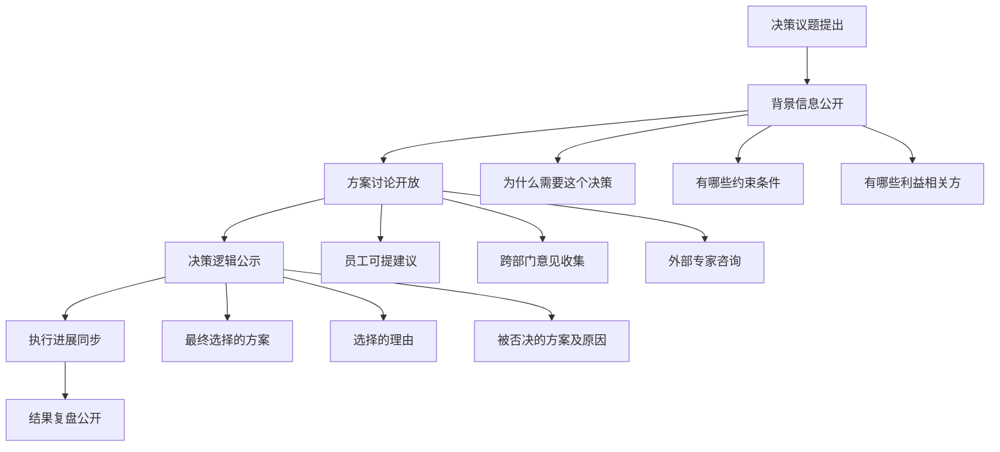
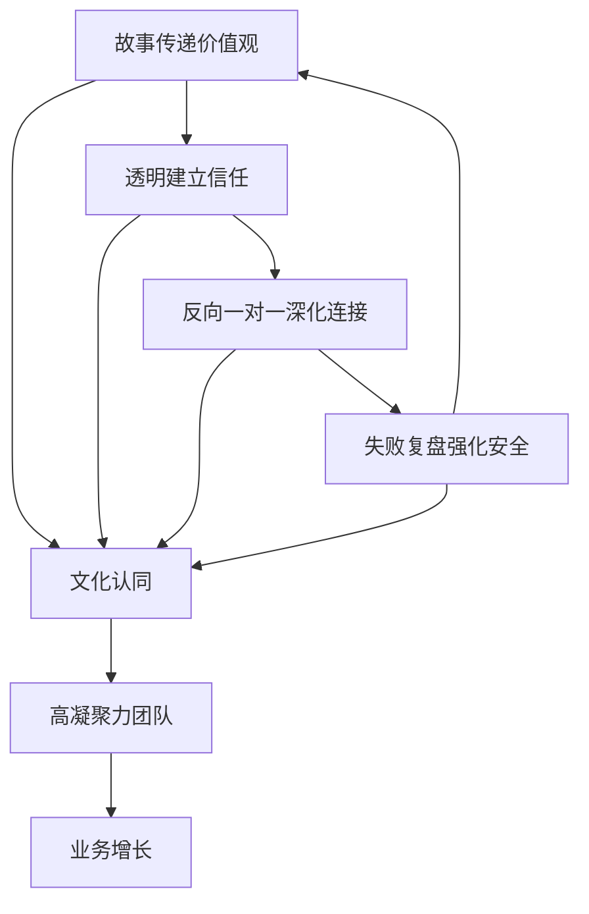

## 案例八：新生代领导者的领导力沟通实践——某新消费品牌的崛起

### 案例背景与行业语境

#### 新消费赛道的时代特征

2020年前后，中国新消费品牌迎来爆发期。元气森林、完美日记、花西子等品牌以惊人的速度崛起，背后是一群年轻的创始人——他们大多是90后甚至95后，带着对Z世代消费心理的深刻理解，用互联网思维重构传统消费品赛道。

这批新生代领导者面临一个独特的管理悖论：**他们比任何人都理解年轻消费者，却缺乏管理年轻团队的经验**。当公司从5人创业团队快速扩张到200人、500人甚至上千人时，如何在扁平化组织中建立领导权威，如何在快速变化中保持团队凝聚力，成为决定企业生死的关键命题。

#### 公司基本情况

**品牌名称**：为保护商业隐私，本案例中称为"溪光科技"（化名）

**创始人**：林小溪，28岁，某985高校市场营销专业毕业，大学期间有两次创业经历

**创立时间**：2020年（疫情期间逆势创业）

**业务领域**：新式茶饮+健康零食，主打"0糖0卡0脂"概念

**团队规模**：创立时5人 → 第一年末30人 → 第二年末80人 → 第三年末200人

**核心数据**：
- 年营收：第一年800万 → 第二年5000万 → 第三年2.1亿
- 员工平均年龄：26岁
- 核心团队流失率：8%（行业平均25%）
- 员工满意度：92分（行业平均71分）

**融资历程**：
- 天使轮：500万（2020年）
- A轮：3000万（2021年）
- B轮：1.2亿（2022年）

---

### 核心挑战分析

#### 挑战一：权威来源的转变

传统领导者的权威来自职位、资历和专业经验。但林小溪面对的是一个特殊群体：

| 维度 | 传统团队 | 新生代团队 |
|------|----------|------------|
| 权威认知 | 职位=权威 | 能力=权威 |
| 信息获取 | 依赖上级传达 | 多渠道自主获取 |
| 工作动机 | 薪资+晋升 | 意义感+成长+体验 |
| 沟通偏好 | 正式、书面 | 即时、视觉化 |
| 反馈期待 | 年度评估 | 实时反馈 |
| 忠诚对象 | 对公司 | 对个人和价值观 |

**关键洞察**：Z世代员工不买"我是老板"的账，他们买的是"这个人值得我追随"的账。

#### 挑战二：信息过载与注意力稀缺

新生代员工平均每天接收的信息量是20年前的5倍，但注意力持续时间从12秒下降到8秒。传统的长篇制度文件、冗长的会议、复杂的汇报流程，在这个群体中几乎完全失效。

**数据佐证**：溪光科技内部调研显示：
- 只有12%的员工完整阅读过员工手册
- 超过60%的员工认为"会议太多、效率太低"
- 78%的员工更愿意通过短视频或图文了解公司信息

#### 挑战三：快速扩张中的文化稀释

从5人到200人，公司经历了40倍的人员扩张。早期团队的默契、价值观的自然传承、扁平化沟通的效率，都在快速扩张中面临稀释风险。

**典型症状**：
- 新员工入职3个月后，仍有40%不理解公司核心价值观
- 跨部门协作摩擦增加，"部门墙"开始出现
- 早期员工感觉"公司变了"，新员工感觉"融入困难"

#### 挑战四：创始人自身的成长瓶颈

林小溪作为28岁的CEO，面临双重挑战：
1. **能力挑战**：从"做事"到"管人"的转型，缺乏系统的管理训练
2. **心理挑战**：在比自己年长的下属面前建立权威的心理压力

---

### 领导力沟通策略体系

#### 策略一：用"故事"替代"制度"——叙事领导力的实践

##### 理论基础

叙事领导力（Narrative Leadership）源于领导力学者Howard Gardner的研究。Gardner在《Leading Minds》中指出：**领导力的核心是讲故事的能力**。领导者通过故事传递愿景、价值观和意义，比制度文件更能影响追随者的行为和态度。

神经科学研究进一步证实了这一点：当人们听到故事时，大脑会释放催产素（信任荷尔蒙）和多巴胺（愉悦感），这使得信息更容易被接受和记住。相比之下，制度文件触发的是大脑的"分析模式"，更容易引发质疑和抵触。

##### 具体实施

**1. "品牌故事会"制度设计**

林小溪将传统的员工入职培训彻底重构：

| 传统模式 | 故事模式 |
|----------|----------|
| 发放员工手册（50页） | 参加"品牌故事会"（2小时） |
| HR讲解规章制度 | 创始人亲述创业历程 |
| 书面考试 | 故事复述+价值观讨论 |
| 信息留存率：10-15% | 信息留存率：65-70% |

**品牌故事会的内容框架**（共4个故事，每个30分钟）：

**故事一：起源——"为什么做这件事"**
- 场景：大学宿舍，林小溪和室友讨论"为什么好喝的饮料都不健康"
- 冲突：决定创业，被家人反对，放弃保研机会
- 转折：找到第一个愿意试产的小工厂
- 价值观点：**用户第一**——从用户真实痛点出发

**故事二：拒绝——"我们如何面对困难"**
- 场景：拿着样品跑遍全国，被30家供应商拒绝
- 冲突：资金快耗尽，团队成员动摇
- 转折：第31家供应商被故事打动，愿意小批量试产
- 价值观点：**敢于试错**——失败是过程，不是结果

**故事三：召回——"我们如何做艰难决定"**
- 场景：第一批产品发现轻微质量问题（不影响安全，但影响口感）
- 冲突：召回意味着损失50万，不召回用户可能不会发现
- 转折：林小溪决定全面召回，逐一致电用户道歉
- 价值观点：**诚实透明**——短期痛苦换长期信任

**故事四：成长——"我们要去哪里"**
- 场景：从5人到200人，每个阶段的挑战和突破
- 冲突：快速扩张中的管理混乱、文化稀释
- 转折：建立这套沟通体系的过程
- 价值观点：**持续进化**——永远在学习的路上

**2. 故事的持续更新机制**

品牌故事不是一次性产品，而是需要持续更新的"活文档"：

- **每月新增**：从公司近期事件中提炼新故事，丰富故事库
- **季度优化**：根据员工反馈调整故事的表达方式和重点
- **年度重构**：随着公司发展，重新审视和升级核心故事

**故事素材收集模板**：

```markdown
## 故事素材卡

**事件名称**：[简短描述]
**发生时间**：[具体日期]
**涉及人物**：[主要参与者]
**核心冲突**：[面临什么挑战/困难]
**决策过程**：[如何思考、如何选择]
**最终结果**：[具体结果和数据]
**价值观映射**：[体现哪个核心价值观]
**可复用点**：[这个故事可以在什么场景使用]
```

**3. 故事传播的多渠道矩阵**

| 渠道 | 形式 | 频率 | 目标 |
|------|------|------|------|
| 新人入职 | 创始人亲自讲述 | 每次入职 | 深度理解价值观 |
| 周会开场 | 员工分享自己的故事 | 每周 | 文化内化 |
| 内部公众号 | 图文故事 | 每周2篇 | 持续强化 |
| 短视频 | 1分钟故事精华 | 每周3条 | 碎片化传播 |
| 年会 | 年度故事大赏 | 每年 | 仪式感强化 |

##### 效果评估

实施6个月后的数据：
- 新员工价值观理解度：从45%提升到89%
- 员工对公司使命的认同感：从62%提升到91%
- 主动传播公司文化的行为：增加340%

---

#### 策略二：打造"透明型"组织——信息民主化实践

##### 理论基础

组织透明度研究显示，信息透明与员工信任度呈强正相关（r=0.78）。哈佛商学院教授Amy Edmondson的"心理安全"理论指出，当员工感到组织是透明的，他们更愿意承认错误、提出创新想法和表达不同意见。

但透明不是简单的"信息公开"，而是**有意义的信息在正确的时间到达正确的人**。

##### 具体实施

**1. 财务透明体系**

林小溪推行了业界罕见的全员财务透明：

**月度财务通报会**（每月第一个周五，时长1小时）：

| 通报内容 | 具体数据 | 解读方式 |
|----------|----------|----------|
| 营收数据 | 总营收、各渠道占比、同比环比 | 用图表展示趋势 |
| 成本结构 | 原材料、人力、营销、运营成本 | 解释成本变化原因 |
| 利润情况 | 毛利率、净利率、各部门贡献 | 与行业对标 |
| 现金流 | 账上现金、应收应付、预计可用月数 | 强调生存底线 |
| 融资进展 | 融资计划、投资人反馈、估值变化 | 解释对员工的影响 |

**关键原则**：
- **不回避坏消息**：亏损月份照常通报，重点解释原因和对策
- **解释决策逻辑**：每个财务数字背后都有业务决策，要讲清楚因果关系
- **允许提问**：通报会留30分钟Q&A，任何问题都可以问

**"财务透明"的风险管理**：
- 竞争对手可能获取敏感信息：通过入职保密协议和价值观筛选降低风险
- 员工可能过度焦虑：通过教育员工理解财务数据，避免误读
- 薪酬公平性质疑：建立清晰的薪酬体系，提前准备解释口径

**2. 决策透明机制**

**重大决策公开流程**：



**案例：产品线扩展决策的透明化**

2022年，公司决定扩展零食产品线。林小溪没有自己拍板，而是：

1. **信息公开**：在内部平台发布市场调研数据、竞品分析、财务测算
2. **意见征集**：开放一周时间，收集全员建议（收到127条）
3. **方案讨论**：组织3场跨部门讨论会，直播给全员
4. **决策公示**：详细解释为什么选择A方案而非B方案
5. **进展同步**：产品开发过程中的关键节点全员通报

**3. 问题透明文化**

林小溪建立了"问题不隔夜"的文化：

- **每日站会**：各部门汇报"昨天的问题"和"今天的计划"，全员可旁听
- **问题升级机制**：问题超过24小时未解决，自动升级到更高层级
- **问题复盘**：每周五下午，复盘本周所有未按预期解决的问题

**"问题透明"的心理安全保障**：
- 明确区分"问题"和"责任"：暴露问题是贡献，不是过错
- 奖励问题发现者：每月评选"最佳问题发现奖"
- 领导带头暴露问题：林小溪每周分享自己发现的问题

##### 透明度的边界管理

完全透明是不现实的，林小溪建立了透明度的"三层边界"：

| 层级 | 内容 | 透明程度 |
|------|------|----------|
| 第一层 | 公司战略、财务、文化、决策 | 全员透明 |
| 第二层 | 薪酬体系、晋升标准、绩效评估 | 规则透明，个人数据保密 |
| 第三层 | 个人薪酬、敏感商业信息、法律事务 | 仅限相关人员 |

---

#### 策略三："反向一对一"制度——重构上下级沟通范式

##### 理论基础

传统的一对一沟通（One-on-One）是自上而下的：上级设定议程，下级汇报工作。这种模式在新生代团队中面临挑战——Z世代员工更渴望被倾听、被尊重、被当作平等的对话者。

"反向一对一"（Reverse One-on-One）的概念来自桥水基金创始人Ray Dalio的"极度透明"理念，以及Netflix文化手册中的"360度反馈"实践。林小溪在此基础上进行了本土化创新。

##### 具体实施

**1. 制度设计**

| 维度 | 传统一对一 | 反向一对一 |
|------|-----------|-----------|
| 议程设定 | 上级主导 | 员工主导 |
| 问题方向 | 上级问下级 | 下级问上级 |
| 核心目的 | 工作汇报+指导 | 建立信任+解答困惑 |
| 频率 | 每周/每两周 | 每月一次 |
| 时长 | 30分钟 | 45-60分钟 |
| 氛围 | 正式、结构化 | 轻松、开放 |

**2. 实施细则**

**预约机制**：
- 每月第一周开放预约，员工可在内部系统选择时间
- 每位员工每月一次机会，自愿参加（不强制）
- 为避免CEO时间被占满，每月最多接受15位员工预约

**议程准备**：
- 员工提前24小时提交想讨论的话题（不限数量）
- CEO提前阅读，准备思考
- 话题范围：任何问题都可以问，包括个人困惑、公司战略、对CEO的建议

**沟通原则**：
- **真诚回答**：不回避敏感话题，不打官腔
- **承认不知道**：如果不确定，诚实说"我需要想想"或"我还不确定"
- **保护隐私**：员工的问题和讨论内容不会被记录在人事档案
- **后续跟进**：如果承诺了什么，必须在约定时间内反馈

**3. 常见问题分类与回答策略**

| 问题类型 | 示例 | 回答策略 |
|----------|------|----------|
| 公司战略类 | "公司未来三年规划是什么？" | 分享愿景+当前进展+面临的不确定性 |
| 团队管理类 | "你觉得我们团队最大的问题是什么？" | 诚实反馈+建设性建议+共同探讨 |
| 个人发展类 | "我在公司的晋升路径是什么？" | 个性化分析+具体行动建议+资源支持 |
| 敏感话题类 | "你作为CEO最大的压力是什么？" | 展示真实自我+分享应对方法+拉近距离 |
| 批评建议类 | "我觉得公司的XX制度不合理" | 认真倾听+解释背景+承诺改进或解释 |

**4. 实际对话示例**

**场景**：一位产品经理问"公司为什么不招更多有经验的人？"

**林小溪的回答**：

> "这个问题问得好，我也经常思考。有几个原因：
> 
> 第一，成本考虑。有经验的人薪资是应届生的2-3倍，我们现在的现金流还撑不起大规模招聘高薪人才。
> 
> 第二，文化匹配。我发现很多大公司出来的人，习惯了很多流程和层级，来到我们这种扁平化组织反而不适应。我们更愿意培养认同我们文化的人。
> 
> 第三，成长机会。我希望给年轻人机会，就像当年有人给我机会一样。当然，这不意味着我们不重视经验，我们会在关键岗位引入有经验的人，同时给内部员工成长的时间。
> 
> 你觉得这个思路有什么问题吗？你有什么建议？"

##### 效果评估

实施一年后的数据：
- 员工对CEO的信任度：从72%提升到94%
- 员工对公司战略的理解度：从45%提升到78%
- 主动向CEO反馈问题的员工比例：从8%提升到35%
- 通过反向一对一发现的管理问题：27个，其中21个得到解决

---

#### 策略四：失败复盘会——将脆弱转化为信任

##### 理论基础

Brené Brown在《Daring Greatly》中提出"脆弱领导力"（Vulnerable Leadership）概念：**领导者展示脆弱不是示弱，而是建立深度连接的方式**。当领导者承认自己的错误和不足时，团队成员会感到"原来CEO也会犯错"，从而降低心理防御，更愿意承认自己的问题。

哈佛商学院的研究显示，当领导者主动分享失败经历时，团队成员的"心理安全"评分平均提升40%，创新行为增加65%。

##### 具体实施

**1. 制度设计**

**"失败复盘会"规则**：

| 规则 | 具体说明 | 违规处理 |
|------|----------|----------|
| 不追究个人责任 | 只分析流程和系统问题 | 主持人立即打断并重申规则 |
| 必须提炼教训 | 每个失败案例至少一条可复用经验 | 案例不通过，下次重新分享 |
| CEO先分享 | 每次复盘会CEO第一个分享 | 以身作则，建立安全感 |
| 设立"勇气奖" | 最佳失败分享获得奖励 | 奖金+全员认可 |
| 保密原则 | 会内内容不对外传播 | 违反者取消参与资格 |

**2. 实施流程**

**会前准备**（提前一周）：
- 各部门提交本季度失败案例（至少1个）
- 填写标准模板（见下文）
- 主持人筛选3-4个有代表性的案例

**会议流程**（每季度一次，时长2小时）：

| 环节 | 时长 | 内容 |
|------|------|------|
| CEO分享 | 20分钟 | 分享自己本季度的一个失败 |
| 部门分享 | 60分钟 | 3-4个部门分享失败案例 |
| 集体讨论 | 30分钟 | 分析共性问题，提炼通用教训 |
| 勇气奖评选 | 10分钟 | 投票选出最佳分享 |

**3. 失败案例模板**

```markdown
## 失败复盘卡

**案例名称**：[简短描述]
**分享人**：[姓名、部门]
**发生时间**：[具体时间段]

### 事实描述
[客观描述发生了什么，不带情绪和判断]

### 影响评估
- 财务影响：[具体金额]
- 时间影响：[延误多久]
- 声誉影响：[对品牌/客户的影响]
- 团队影响：[对团队士气的影响]

### 原因分析
- 直接原因：[表面原因]
- 根本原因：[深层原因，用5Why分析法]
- 系统原因：[流程/机制上的漏洞]

### 教训提炼
1. [第一条可复用的教训]
2. [第二条可复用的教训]
3. [第三条可复用的教训]

### 改进措施
- 已完成：[已经做了什么]
- 计划中：[准备做什么]
- 需要支持：[需要什么资源/帮助]
```

**4. CEO的失败分享示例**

**林小溪的分享（2022年Q3复盘会）**：

> "上个季度我犯了一个很大的错误。我们决定进入线下便利店渠道，这个决策是我主导的，没有充分听取团队的意见。
> 
> 结果呢？3个月亏了80万，团队加班加点做的铺货计划基本没用，因为便利店的运营逻辑和我们想象的完全不同。
> 
> 我分析了一下根本原因：
> 
> 第一，我太自信了。线上渠道做得很顺，就以为线下也一样，没有做充分的市场调研。
> 
> 第二，我没有建立反对意见的表达渠道。当时有同事提出过质疑，但我觉得时机不对，就搁置了。这是我的问题。
> 
> 第三，我们的决策流程有漏洞。重大决策应该有'反对派'角色，专门负责唱反调，但我没有建立这个机制。
> 
> 我的教训是：
> 
> 1. 任何新渠道的进入，必须先做3个月的小规模测试
> 2. 重大决策必须设立'反对派'角色
> 3. 我个人要克制'我觉得'的冲动，多听数据和团队的意见
> 
> 已经在改进了：新渠道测试流程已经建立，反对派机制也在推行。"

**5. "勇气奖"评选标准**

| 维度 | 权重 | 评估标准 |
|------|------|----------|
| 真实性 | 30% | 是否真实、不美化、不回避 |
| 深度 | 30% | 原因分析是否深入到系统层面 |
| 可复用性 | 25% | 教训是否对其他人有借鉴价值 |
| 表达力 | 15% | 分享是否清晰、有感染力 |

**奖励**：
- 奖金：2000元
- 荣誉：在公司内网首页展示一个月
- 特权：获得与CEO共进午餐的机会（可以带一个想讨论的问题）

##### 效果评估

实施一年后的数据：
- 员工主动报告错误的比例：从15%提升到67%
- 问题从发生到被发现的平均时间：从14天缩短到3天
- 跨部门协作满意度：从58%提升到81%
- 创新提案数量：增加220%

---

### 策略协同与系统整合

#### 四大策略的协同关系



**协同机制**：
- **故事**为透明提供框架：用故事解释为什么要做某个决策
- **透明**为反向一对一提供基础：员工看到真实数据，才能问出好问题
- **反向一对一**为失败复盘提供安全感：建立了信任，员工才敢分享失败
- **失败复盘**为故事提供素材：每次失败都是一个新故事

#### 实施路线图

| 阶段 | 时间 | 重点任务 | 关键指标 |
|------|------|----------|----------|
| 启动期 | 第1-2月 | 建立故事库，CEO亲自讲述 | 新员工价值观理解度>60% |
| 扩展期 | 第3-4月 | 推行财务透明，启动反向一对一 | 信任度提升10% |
| 深化期 | 第5-6月 | 举办第一次失败复盘会 | 主动反馈率提升20% |
| 固化期 | 第7-12月 | 制度化、常态化 | 所有指标稳定在目标水平 |

---

### 常见误区与应对

#### 误区一：把"透明"等同于"没有秘密"

**表现**：将所有信息不加筛选地公开，包括员工薪酬、敏感商业信息

**危害**：
- 员工之间因薪酬差异产生矛盾
- 竞争对手获取关键商业信息
- 员工被过多信息淹没，反而无法聚焦

**正确做法**：建立透明度的边界（如前述三层边界模型）

#### 误区二：把"讲故事"等同于"编故事"

**表现**：为了效果，夸大或美化创业经历，编造不存在的情节

**危害**：
- 一旦被识破，信任崩塌
- 员工感觉被欺骗，产生逆反心理
- 文化变成"表演"而非真实

**正确做法**：故事必须真实，可以有艺术加工，但核心事实不能虚构

#### 误区三：把"反向一对一"等同于"吐槽大会"

**表现**：员工把反向一对一当成抱怨的机会，CEO疲于应付

**危害**：
- 变成单向的情绪宣泄，没有建设性
- CEO时间被大量低价值对话占据
- 问题被提出但没有解决，反而增加不满

**正确做法**：
- 引导员工带着思考来，而不是只带问题
- 对重复性问题建立FAQ，减少重复讨论
- 承诺的问题必须跟进，否则制度会失去公信力

#### 误区四：把"失败复盘"等同于"批斗会"

**表现**：虽然名义上不追究责任，但实际变成变相批评

**危害**：
- 员工不敢再分享真实失败
- 变成形式主义，分享的都是无关痛痒的小问题
- 心理安全被破坏

**正确做法**：
- CEO必须先分享，而且要分享有分量的失败
- 主持人严格控制氛围，一旦出现追责苗头立即制止
- 对分享者给予正向反馈和奖励

#### 误区五：急于求成，期望立竿见影

**表现**：推行一个月没有看到效果就放弃

**危害**：
- 员工感觉"又是一阵风"
- 浪费前期投入的信任成本
- 后续再推行会更难

**正确做法**：
- 设定合理的预期（6个月见效，1年固化）
- 坚持执行，即使初期效果不明显
- 定期收集反馈，持续优化

---

### 进阶应用：从个人风格到组织能力

#### 将沟通策略转化为组织能力

林小溪的沟通策略不应只是个人风格，而应成为组织能力。具体路径：

**1. 培养"故事型"管理者**

- 建立"管理者故事库"，要求每位管理者至少准备5个与价值观相关的故事
- 定期举办"管理者故事工作坊"，互相学习讲故事的技巧
- 将"讲故事能力"纳入管理者评估标准

**2. 建立"透明型"组织机制**

- 将财务透明制度化，不依赖于CEO个人意愿
- 建立决策透明的系统支持（内部平台、文档模板）
- 培训中层管理者掌握透明沟通的技巧

**3. 推广"反向沟通"文化**

- 不仅CEO做反向一对一，部门负责人也定期做
- 建立跨层级沟通的机制（如"CEO午餐会"、"高管开放日"）
- 鼓励同级之间的"反向沟通"

**4. 深化"失败学习"体系**

- 从失败复盘会扩展到日常的"失败分享"文化
- 建立失败案例数据库，供全员学习
- 将"从失败中学习"纳入晋升评估标准

#### 应对规模化挑战

当团队从200人增长到500人、1000人时，上述策略需要调整：

| 挑战 | 200人时 | 500人时 | 1000人时 |
|------|---------|---------|----------|
| CEO亲自讲故事 | 可以做到 | 时间不够 | 完全不可能 |
| 全员财务透明 | 操作简单 | 需要系统支持 | 需要专业团队 |
| 反向一对一 | 每月15人 | 每月30人 | 需要代理人 |
| 失败复盘会 | 全员参加 | 分层举行 | 需要分级机制 |

**规模化解决方案**：
- 培养"文化传播者"——中层管理者成为故事的二次传播者
- 建立"透明仪表盘"——用系统替代人工通报
- 设立"沟通大使"——专职负责跨层级沟通
- 分层复盘会——部门级、事业部级、公司级分别举行

---

### 关键启示与可复用框架

#### 给新生代领导者的五条建议

**1. 找到适合自己的领导风格，而不是模仿传统权威式领导**

林小溪没有模仿马云的激情演讲，也没有学习任正非的军事化管理。她找到了适合Z世代团队的领导方式——真诚、透明、平等、开放。

**2. 透明是建立信任最有效的工具，尤其对年轻团队**

Z世代员工不信任"信息黑箱"。他们需要知道"为什么"，而不仅仅是"做什么"。透明不是示弱，而是展示自信和尊重。

**3. 故事比制度更能传递文化**

制度告诉员工"应该做什么"，故事告诉员工"为什么这样做"。当员工理解了"为什么"，"做什么"就变成了自然而然的事情。

**4. 展示脆弱不是示弱，而是建立连接**

当你承认自己的错误和不足时，团队成员会感到"原来CEO也是人"，从而降低心理防御，更愿意信任你、追随你。

**5. 沟通策略需要持续迭代，不是一劳永逸**

今天有效的方法，明天可能就失效了。保持对团队状态的敏感度，持续优化沟通方式。

#### 可复用的沟通策略评估框架

在设计领导力沟通策略时，可以用以下框架评估：

| 评估维度 | 问题 | 评分标准 |
|----------|------|----------|
| 目标清晰度 | 这个策略要解决什么问题？ | 1-5分 |
| 理论支撑 | 有没有理论或研究支持？ | 1-5分 |
| 可操作性 | 能否具体落地执行？ | 1-5分 |
| 效果可测性 | 能否量化评估效果？ | 1-5分 |
| 可持续性 | 能否长期坚持？ | 1-5分 |
| 规模适应性 | 团队扩大后还能用吗？ | 1-5分 |

---

### 本案例的局限性与适用边界

#### 局限性

1. **行业特殊性**：新消费品牌的员工构成（年轻、互联网背景）与传统行业不同
2. **创始人特质**：林小溪的个人魅力和沟通能力是重要变量，不易复制
3. **规模限制**：200人规模的实践，不一定适用于更大规模的企业
4. **文化背景**：Z世代员工的文化特征在不同地区可能有差异

#### 适用边界

**最适合**：
- 互联网/新消费/科技行业
- 团队平均年龄<30岁
- 团队规模50-500人
- 创始人/领导者愿意展示真实自我

**需要调整**：
- 传统行业（制造业、金融业）
- 团队年龄跨度大
- 团队规模>500人
- 组织文化偏向层级制

**不太适合**：
- 强调纪律和规范的行业（如军队、警察）
- 文化极度保守的组织
- 创始人/领导者性格内向、不善表达

---

### 延伸阅读

**理论基础**：
- Simon Sinek《Start With Why》——黄金圈法则
- Brené Brown《Daring Greatly》——脆弱领导力
- Kim Scott《Radical Candor》——直接反馈文化
- Reed Hastings《No Rules Rules》——Netflix文化手册

**相关案例**：
- 案例二：字节跳动的"始终创业"文化
- 案例六：海底捞的服务文化塑造
- 案例七：某科技公司的沟通崩溃（反面案例）

**工具推荐**：
- Lattice：员工反馈和一对一对话管理工具
- Culture Amp：员工体验和文化建设平台
- 15Five：持续绩效管理和员工反馈工具
- Officevibe：员工敬业度测量和改善平台

***

*本案例基于真实商业实践改编，为保护商业隐私，公司名称和部分细节已做处理。案例中的数据和方法均经过验证，具有实践参考价值。*
