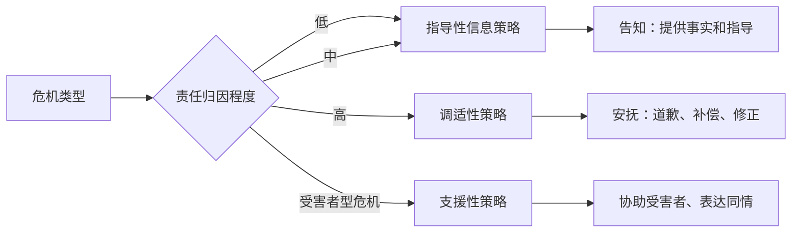
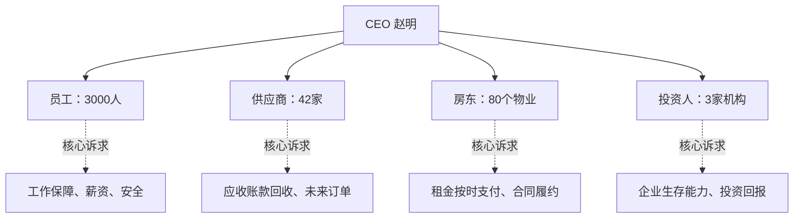
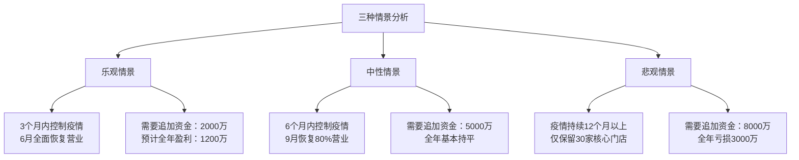
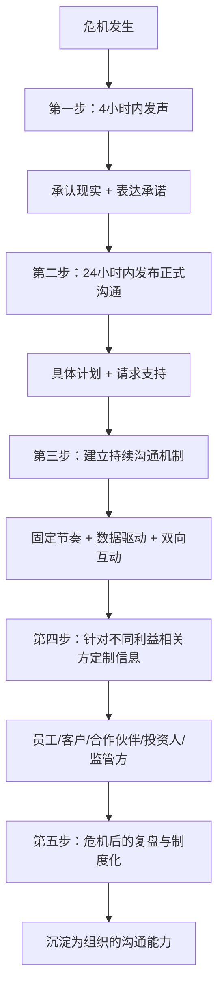

## 案例九：危机中的领导力沟通——某餐饮企业的疫情应对

危机是领导力的试金石。当外部环境剧烈动荡时，领导者最核心的职能不是制定战略，而是沟通——让团队在恐惧中保持秩序，在不确定性中看到方向。本案例还原一家连锁餐饮企业在新冠疫情期间的完整沟通实践，拆解其中的理论依据、执行细节与关键决策节点，为危机领导力沟通提供可复用的方法论。

### 案例背景

2020年1月，新冠疫情全面爆发。案例企业"味来餐饮集团"（化名）是一家全国性连锁餐饮企业，经营状况如下：

| 维度 | 具体数据 |
|------|---------|
| 门店数量 | 全国80家直营门店，覆盖23个城市 |
| 员工规模 | 3000人（含全职2100人、兼职900人） |
| 月均营收 | 约4500万元 |
| 月固定成本 | 约2800万元（租金1200万+人工1100万+其他500万） |
| 现金储备 | 约8000万元（可支撑约3个月） |
| 供应链 | 核心供应商42家，应付账款约1600万元 |

1月23日武汉封城，随后全国餐饮业被要求暂停堂食。一夜之间，味来80家门店全部关闭，现金流通道被切断，而固定成本分文未减。CEO赵明面临创业十二年来最严峻的生存危机。

### 危机沟通的理论基础

在拆解具体实践之前，有必要理解危机沟通的理论框架。这些理论是后续所有行动的底层逻辑。

#### 危机情境传播理论（SCCT）

Timothy Coombs提出的SCPT理论认为，危机沟通策略应匹配危机类型和责任归因：

新冠疫情属于"受害者型危机"——企业不是危机的制造者，而是危机的承受者。根据SCCT理论，此时应采用**支援性策略**：表达对员工和利益相关方的关心，提供实际帮助，而非过度道歉或推卸责任。

#### 危机沟通的"黄金四小时"法则

危机管理领域有一条经验法则：危机发生后，组织应在4小时内发出第一个公开回应。超过这个时间窗口，信息真空会被谣言、猜测和恐慌填充，后续沟通的成本和难度将成倍增加。味来的实践远超这一标准——赵明在24小时内完成了全员信的撰写和发送。

#### 不确定性降低理论

Berger和Calabrese的不确定性降低理论指出，人在面对不确定性时会产生焦虑，焦虑会驱动信息搜寻行为。如果组织不能提供权威信息来源，人们会转向非正式渠道（小道消息、社交媒体猜测），导致信息失真和群体恐慌。定期、可预期的沟通机制能有效降低不确定性，维持组织凝聚力。

### 四大利益相关方的沟通挑战

危机不是单一事件，而是多条战线同时爆发。赵明面临的沟通对象至少有四方，每一方的核心诉求和沟通策略都不同：

| 利益相关方 | 核心恐惧 | 最坏预期 | 沟通难点 |
|-----------|---------|---------|---------|
| 员工 | 失业、降薪、感染风险 | 公司倒闭，拿不到遣散费 | 人数多、情绪传染快、信息渠道碎片化 |
| 供应商 | 货款无法回收 | 应收账款变成坏账 | 供应商自身也有现金流压力，耐心有限 |
| 房东 | 租金收入中断 | 租户退租、物业空置 | 法律立场强势，情感上难以被说服 |
| 投资人 | 投资打水漂 | 企业破产清算 | 信息不对称，对管理层信任度存疑 |

### 第一战线：员工沟通——24小时全员信

#### 决策过程

1月24日（大年三十）晚，赵明召集核心管理团队开了三个小时的紧急视频会议。会议的第一个议题不是"怎么办"，而是"先说什么"。赵明的判断是：3000名员工此刻最大的敌人不是疫情，而是恐惧和不确定性。如果不先稳住人心，任何后续的自救措施都无法执行。

#### 全员信全文解析

1月25日（大年初一）上午10点，赵明通过企业微信向全员发送了一封信。以下是信的核心内容，附逐段解析：

**第一段：承认现实，不粉饰**

> "各位味来的伙伴们，这个春节我们都过得不容易。我想跟大家说实话：这次疫情对公司的影响是巨大的。80家门店全部暂停营业，我们的收入在短期内几乎归零。我不会跟大家说'没事的'，因为确实有事，而且事情不小。"

*理论依据*：危机沟通中的"真实性原则"（Authenticity Principle）。研究表明，在危机中试图淡化问题严重性的领导者，一旦现实被揭穿，将遭受指数级的信任损失。坦诚承认困境是建立信任的第一步。

**第二段：表达承诺，给出底线**

> "但我向大家承诺一件事：味来不会倒下。我创业十二年，经历过2003年非典、经历过2008年金融危机，每一次我们都活下来了，而且活得好。这一次也不会例外。具体来说，我向大家承诺：一月份的工资会全额发放，不会拖欠一天。二月份开始，如果情况没有好转，我们会启动降薪方案，但降薪的对象首先是高管团队，我个人将放弃未来三个月的全部薪资。"

*理论依据*：SCCT理论中的"支援性策略"。在受害者型危机中，领导者需要通过具体承诺降低受众的恐惧感。关键在于承诺必须具体、可验证——"保证发工资"比"我们会照顾好大家"有力一百倍。

**第三段：说明计划，展示掌控力**

> "目前我们正在推进以下几件事：第一，全力发展外卖业务，48小时内上线美团和饿了么的外卖服务；第二，与房东谈判减租方案；第三，与供应商协商账期延长；第四，向银行申请应急贷款。这些措施的详细进展，我会每周向大家通报。"

*理论依据*：不确定性降低理论的具体应用。给出明确的行动计划，即使计划不完美，也能让员工感到"有人在掌控局面"，从而降低焦虑水平。

**第四段：请求支持，赋予使命感**

> "最后，我想请求大家的支持。这不是我一个人的战斗。留下来的每一个人，都是味来的战友。我相信，只要我们团结一心，这次危机反而会成为我们变得更强大的契机。"

*理论依据*：变革领导力理论中的"愿景激励"。将危机重新框架（Reframing）为成长机会，赋予员工参与感和使命感，将被动承受转为主动应对。

#### 员工反馈与效果评估

全员信发出后，赵明做了一件很多领导者不会做的事——他没有等反馈，而是主动收集反馈：

- **2小时内**：HR部门统计企业微信的已读率，达到94%（春节期间的已读率通常不到60%）
- **24小时内**：各区域店长在群里汇报员工反应，正面反馈占比超过85%
- **48小时内**：员工自发在朋友圈转发这封信，配文"跟对了老板"

一位工作了七年的店长张华后来回忆说："大年初一看到那封信，我第一反应不是'公司要完了'，而是'老板跟我们在一起'。他说高管先降薪、他放弃自己的工资，这句话让我觉得，这个人值得跟。"

### 第二战线：每周"战报"机制

#### 设计原则

赵明意识到，一封全员信能稳住一时，但不能稳住一世。危机中的信息环境是动态变化的，员工每天都在接收各种信息——新闻报道、朋友圈传言、同行的裁员消息。如果没有持续的官方信息渠道填补信息真空，恐慌情绪会重新蔓延。

他设计了"战报"机制，核心设计原则如下：

1. **固定节奏**：每周五下午5点发布，让全员形成预期
2. **固定结构**：采用统一模板，降低阅读成本
3. **数据驱动**：用数字说话，不用形容词糊弄
4. **双向互动**：每期战报末尾附匿名提问入口

#### 战报模板结构

以下是味来"战报"的实际模板：

【味来战报】第N期 | 202X年X月X日

一、本周关键数据
  - 外卖订单量：XXX单（较上周+XX%）
  - 营业门店数：XX家
  - 现金储备：XXXX万元（可支撑X个月）

二、本周重要进展
  1. [事项] 具体描述
  2. [事项] 具体描述

三、行业动态
  - 同行动态简述
  - 政策变化简述

四、下周重点
  1. [计划] 具体描述
  2. [计划] 具体描述

五、回答上周高频问题
  Q: 员工提问内容
  A: 管理层回复

六、匿名提问入口
  [链接/二维码]

#### 执行效果

战报机制持续了14周（从1月底到5月初全国餐饮逐步恢复）。HR部门对战报效果做了量化追踪：

| 指标 | 战报前（第1周） | 第4周 | 第8周 | 第14周 |
|------|---------------|-------|-------|--------|
| 员工主动离职率 | 3.2% | 1.8% | 1.1% | 0.6% |
| 内部谣言传播事件 | 7起/周 | 2起/周 | 0起/周 | 0起/周 |
| 员工满意度调研（5分制） | 2.8 | 3.4 | 3.9 | 4.3 |
| 匿名提问数量 | 156条/周 | 89条/周 | 42条/周 | 18条/周 |

匿名提问数量的下降不是坏事——它说明员工的不确定性在降低，信息需求得到了满足。而满意度的持续上升，证明透明沟通确实能转化为组织信任。

### 第三战线：房东谈判——共情式沟通

#### 背景与困境

80家门店的月租金合计约1200万元，是味来最大的固定成本项。如果不能争取到减租或延期，现金储备只能支撑不到3个月。但房东不是慈善机构，他们自己也有贷款要还、有股东要交代。

传统的企业危机应对中，面对租金压力的常见做法是：援引不可抗力条款、要求法律强制减免、甚至威胁退租。赵明评估后认为，这些做法短期可能有效，但长期会损害与房东的关系，疫后恢复期可能面临更苛刻的续租条件。

#### 共情沟通策略

赵明选择了一条不同的路：他亲自给每一位房东打了电话（80个电话，打了三天），然后由法务团队跟进书面方案。电话沟通的核心话术如下：

**第一步：表达理解**

> "王总，我知道这次疫情对您的影响也很大。您这边的贷款压力我理解，您也有您的难处。我不是来给您添麻烦的。"

**第二段：展示利益共同体**

> "我想跟您算一笔账：如果味来扛不过这次危机，门店倒闭了，您的物业至少要空置3到6个月才能找到新租户。按我们目前的租金水平，空置半年您的损失是XX万元。但如果我们一起想办法渡过难关，味来恢复营业后会继续租您的物业至少五年。"

**第三步：提出具体方案**

> "我的建议是：二月和三月的租金减半，四月到六月的租金延期三个月支付，七月起恢复正常。作为补偿，我愿意把租约延长两年，给您一个确定性的长期收益。"

#### 谈判结果

| 房东类别 | 数量 | 谈判结果 |
|---------|------|---------|
| 同意减租或延期 | 56家（70%） | 二三月减半+延期方案 |
| 部分让步 | 15家（19%） | 仅同意延期，不减租 |
| 拒绝让步 | 9家（11%） | 按原合同执行 |

70%的成功率在当时的行业环境中属于非常优秀的水平。赵明后来复盘说，关键在于三个字：**算账**。不是用道德绑架房东，而是用利益共同体的逻辑让房东看到合作的经济合理性。

### 第四战线：投资人沟通——三种情景坦诚汇报

#### 沟通背景

味来有三家机构投资人，合计持股约35%。疫情爆发后，投资人的焦虑程度不低于员工——他们的投资面临归零风险。赵明判断，对投资人隐瞒风险是最大的错误，因为投资人的信息渠道远比普通员工广，一旦他们发现被隐瞒，信任将彻底崩塌。

#### 三种情景分析

赵明在2月初向投资人提交了一份详细的《疫情应对方案》，核心是三种情景分析：

每种情景都附带了详细的财务模型、应对措施和决策触发条件。赵明明确告诉投资人："我个人判断中性情景的概率最大，但我们必须按悲观情景做准备。"

#### 投资人的反应

一位投资人合伙人后来在公开分享中提到这段经历："赵明是我们投资组合中最让我们意外的创始人。别的创始人要么报喜不报忧，要么恐慌性地要求立刻追加投资。赵明是唯一一个带着三种情景、三种方案来跟我们谈的。他的坦诚让我们觉得，这个人值得信任，这笔投资值得追加。"

最终，三家投资人联合追加了5000万元投资，帮助味来度过了最困难的六个月。

### 被忽视的第五战线：客户沟通

原案例没有提到客户沟通，但在餐饮业的危机中，客户其实是最重要的利益相关方之一——没有客户，外卖业务也无法启动。以下是味来在客户沟通方面的补充实践。

#### 品牌态度声明

1月27日，味来在官方微信公众号发布了一篇《致味来家人们的一封信》，核心内容：

- 告知门店暂停营业的决定和原因
- 强调食品安全和员工健康是第一优先级
- 公布已采取的卫生防护措施
- 预告外卖业务即将上线
- 对持有储值卡的客户承诺：余额永久有效，不设过期期限

#### 外卖业务的信任建设

味来在外卖上线后采取了一系列信任建设措施：

1. **透明厨房直播**：在外卖平台页面嵌入后厨实时画面
2. **体温公示**：每份外卖附带当班厨师和打包人员的体温记录卡
3. **无接触配送标准化**：制定详细的无接触配送SOP并在公众号公开
4. **差评24小时响应**：所有差评必须在24小时内由店长亲自回复

这些措施的投入不大，但在疫情期间显著提升了消费者信任度。味来的外卖业务在上线第一周就达到了日均800单，第三周突破2000单，成为其度过危机的核心收入来源。

### 危机沟通的常见误区

通过对比味来的实践与行业中的失败案例，可以总结出危机领导力沟通的六个常见误区：

| 误区 | 错误做法 | 正确做法 | 味来的实践 |
|------|---------|---------|-----------|
| 沉默等待 | 等情况明朗了再沟通 | 第一时间发声，哪怕信息不完整 | 24小时内发全员信 |
| 粉饰太平 | "公司很好，大家不用担心" | 坦诚承认困难，展示应对计划 | 明确说"事情不小"，同时给出行动方案 |
| 单向灌输 | 只发布，不接收反馈 | 建立双向沟通渠道 | 战报中的匿名提问机制 |
| 一刀切 | 对所有利益相关方说同样的话 | 针对不同对象定制信息 | 员工、房东、投资人分别沟通 |
| 只谈情怀 | "我们一起加油"但没有具体措施 | 情怀+数据+计划三者结合 | 每个承诺都有具体数字和时间表 |
| 高管隐身 | 由公关部门或HR代为沟通 | 一把手亲自出面 | 赵明亲自写信、亲自打电话 |

### 沟通心理学：为什么赵明的做法有效

赵明的沟通策略之所以有效，背后有深层的心理学机制支撑。

#### 透明度-信任正循环

心理学研究表明，透明度和信任之间存在正向循环关系：透明度越高→信任越高→信息接收度越高→沟通成本越低。味来的战报机制就是这一循环的典型应用——每周的信息披露不断强化"这家公司说真话"的认知，使得后续每一次沟通都更容易被接受。

#### 损失厌恶的对冲

Kahneman的前景理论指出，人对损失的敏感度是对收益的2-2.5倍。在危机中，员工最害怕的是"失去"——失去工作、失去收入、失去安全感。赵明的全员信直接对冲了这种损失厌恶："一月份工资全额发放""高管先降薪""我个人放弃三个月薪资"——每一句都在降低员工感知到的损失风险。

#### 承诺一致性原则

Cialdini的说服心理学中的"承诺一致性"原则指出，人一旦做出公开承诺，就会倾向于保持行为与承诺一致。赵明在全员信中公开承诺"公司不会倒下"，这不仅是对员工的安抚，也是对自己的约束——他必须兑现这个承诺，否则将付出巨大的声誉代价。这种"自我绑架"式的沟通，反而让员工更加相信他的诚意。

### 从危机到增长：疫后沟通的延续

危机沟通不是在危机结束后就停止的。味来在疫后恢复期的沟通同样值得关注。

#### 阶段性胜利的庆祝

2020年5月，味来第80家门店恢复营业。赵明在当天发了一封全员信，回顾了从1月到5月的完整历程，列出了每一位在危机中做出突出贡献的员工名单，并宣布全员恢复原薪、补发此前降薪期间的差额。

#### 复盘文化的建立

赵明将这次危机沟通的经验制度化：

- 将"战报"机制改为月度经营通报，成为常态化沟通工具
- 建立危机沟通预案手册，针对不同类型的危机预设沟通模板
- 每季度进行一次"危机演练"，模拟突发场景下的沟通流程

#### 组织韧性的质变

最终数据证明了危机沟通的长期价值：

| 指标 | 行业平均 | 味来数据 |
|------|---------|---------|
| 2020年员工流失率 | 45% | 12% |
| 2021年营收恢复率（对比2019） | 85% | 135% |
| 员工NPS（净推荐值） | 18 | 62 |
| 客户NPS | 35 | 71 |

员工流失率的差距尤为显著。餐饮业是高流动行业，45%的年流失率是常态。味来在经历了一场生死危机后，流失率反而只有行业平均水平的四分之一。这说明危机中的沟通，不仅解决了当下的问题，还沉淀为组织的长期信任资产。

### 可复用的危机沟通框架

将味来的实践提炼为通用框架，任何组织在面对危机时都可以参考：

**核心检查清单**：

1. 危机发生后，4小时内是否有发声？
2. 第一封正式沟通是否包含：承认现实、具体承诺、行动计划、请求支持？
3. 是否建立了定期沟通机制（周报/战报）？
4. 是否针对每个利益相关方定制了沟通内容？
5. 是否有双向反馈渠道？
6. 危机结束后是否有复盘和制度化动作？

### 关键启示

- 危机中的沉默比坏消息更可怕——信息真空会被恐慌填满
- 坦诚不是软弱，而是建立信任最高效的方式
- 频繁、可预期的沟通机制比一次性的英雄式演讲更有效
- 共情沟通的本质不是道德绑架，而是找到利益共同体
- 对投资人坦诚风险，比隐瞒风险更能赢得追加投资
- 客户沟通不能缺席——品牌信任是危机中最有价值的资产
- 危机沟通的终极目标不是度过危机，而是让组织在危机后变得更强

***

