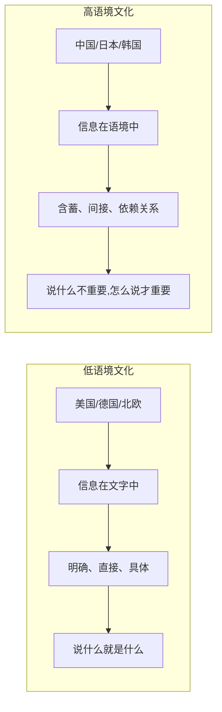
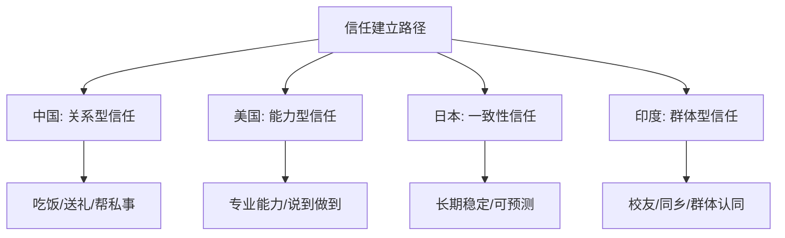
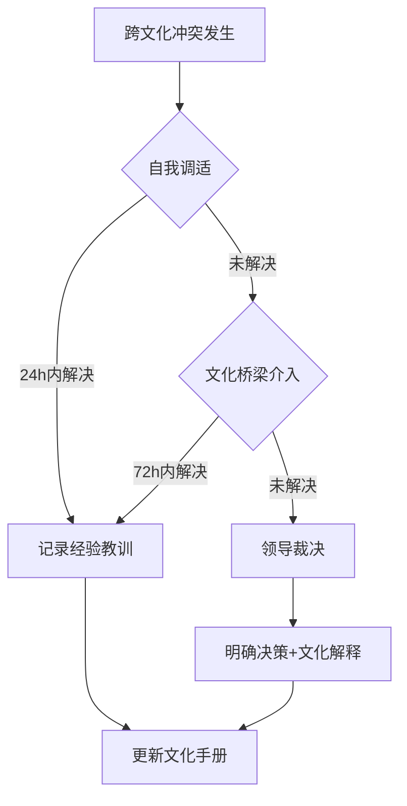

## 案例十：跨文化领导力沟通——某中国企业出海的挑战

> "文化是看不见的软件——它决定了你的团队如何思考、如何沟通、如何决策。领导者如果不理解这套操作系统，再好的战略也执行不下去。"——改编自Geert Hofstede

### 案例背景

张伟是一家中国科技公司（以下简称"星辰科技"）的海外业务负责人。公司2021年启动东南亚和北美市场扩张，张伟被任命为全球化业务VP，需要管理一个由中国人、美国人、印度人、日本人组成的跨文化团队，总人数约45人，分布在4个国家。

**团队构成：**

| 子团队 | 人数 | 分布 | 文化背景 | 工作模式 |
|--------|------|------|----------|----------|
| 中国核心团队 | 15人 | 深圳 | 高语境、集体主义 | 线下集中 |
| 美国市场团队 | 12人 | 旧金山 | 低语境、个人主义 | 远程+混合 |
| 印度技术团队 | 10人 | 班加罗尔 | 高权力距离、多时间观 | 远程为主 |
| 日本合作团队 | 8人 | 东京 | 极高语境、集体主义 | 线下集中 |

上任六个月后，张伟发现团队协作效率远低于预期：项目延期率高达35%，跨文化误解引发的冲突每周至少发生2-3次，部分外籍员工开始考虑离职。

---

### 第一部分：文化冲突全景——六个维度的碰撞

#### 维度一：直接沟通 vs. 间接沟通（高/低语境文化）

**冲突场景：** 在一次产品评审会上，张伟看着美国团队提交的方案，直接说："这个方案不行，重新做。"

**三重反应：**

- **中国团队成员（李明）：** 内心翻译为"领导觉得方向有问题，需要调整"，默默记录后开始修改，认为这是正常的上下级互动。
- **美国团队成员（Sarah）：** 感到困惑和不满——"哪里不行？标准是什么？没有具体反馈我怎么改？"她当场追问了三个问题，张伟觉得她在"挑战权威"。
- **日本团队成员（田中）：** 认为张伟在公开场合"丢面子"，不仅对方案的提出者不尊重，也破坏了团队和谐。田中在之后两周的会议中变得沉默。

**理论解析：Edward T. Hall的高/低语境理论**



低语境文化中，沟通的重心是"说了什么"；高语境文化中，沟通的重心是"怎么说、谁说、在哪里说"。张伟用高语境的方式（暗示"不行"、期望对方自己悟出问题所在）去沟通低语境文化的成员，信息在传递过程中大量丢失。

#### 维度二：个人主义 vs. 集体主义

**冲突场景：** 季度复盘会上，张伟当众表扬美国团队的James："James这个季度的客户转化率提升了25%，是全团队的标杆。"

**双重效果：**

- **美国团队：** James感到被认可，其他成员也受到激励，认为"只要做出成绩就能被看到"。
- **日本团队：** 被点名的日本员工（如果换成佐藤）会极度不适——在日本文化中，个人被单独从团队中拎出来表扬，等于暗示"其他人做得不好"，破坏了"和"的集体和谐。佐藤可能在会后私下找张伟表达不安，或者更糟——什么都不说但从此降低投入。

**Hofstede文化维度对比（个人主义指数）：**

| 国家 | 个人主义指数（满分100） | 含义 |
|------|------------------------|------|
| 美国 | 91 | 极度个人主义，个人成就优先 |
| 日本 | 46 | 偏集体主义，团队和谐优先 |
| 中国 | 20 | 强集体主义，家庭/团队纽带紧密 |
| 印度 | 48 | 中等，兼顾个人与集体 |

#### 维度三：时间观念的冲突

**冲突场景：** 张伟在周一的全球站会上说："下周五前完成原型。"

**四重理解：**

- **中国团队：** "下周五是dead line，提前一天周四交。"——单时间观（Monochronic），对deadline严格遵守。
- **美国团队：** "Friday means Friday，下周五下班前交。"——同样是单时间观，但精确到小时。
- **印度团队：** "下周五左右完成。"——多时间观（Polychronic），deadline是参考点而非硬约束，人际关系和突发事务可能优先。实际交付在下下周二。
- **日本团队：** "下周五前必须完成，如果完不成要提前说明。"——时间观念强，但配合"提前沟通"的责任感。

**理论工具：Fons Trompenaars的时间导向模型**

┌─────────────────────────────────────────────────────────┐
│                  时间观念连续谱                           │
│                                                         │
│  严格守时 ◄──────────────────────────────► 灵活弹性     │
│                                                         │
│  德国 > 美国 > 中国 > 印度 > 中东                        │
│  (±5分) (±15分) (±30分) (±1天) (看关系)                 │
│                                                         │
│  单时间观：一次做一件事，严格日程                         │
│  多时间观：多件事并行，日程是参考                         │
└─────────────────────────────────────────────────────────┘

#### 维度四：权力距离

**冲突场景：** 张伟在周会上问："大家对这个方案有什么意见？"中国团队和日本团队无人发言——不是没意见，而是"领导定了方向，下面执行就好"。美国团队则滔滔不绝地提出了7条反对意见，张伟内心觉得"怎么这么多事"。

**Hofstede权力距离指数：**

| 国家 | 权力距离指数 | 表现 |
|------|-------------|------|
| 印度 | 77 | 尊重层级，不敢直接反驳上级 |
| 中国 | 80 | 等级分明，领导决策权大 |
| 日本 | 54 | 中等，但强调"读空气"不公开反对 |
| 美国 | 40 | 相对平等，鼓励质疑和辩论 |

#### 维度五：不确定性规避

**冲突场景：** 张伟提出一个新市场策略，要求团队"大胆试错，快速迭代"。

- **美国团队：** 非常适应，立即开始A/B测试，接受失败作为学习的一部分。
- **日本团队：** 感到焦虑——"没有详细计划和风险评估怎么能开始？"要求先做完整的可行性分析。
- **中国团队：** 表面接受，但私下倾向于模仿已被验证的路径。
- **印度团队：** 需要明确的流程和检查节点才感到安全。

#### 维度六：信任建立机制

**冲突场景：** 张伟想和美国团队建立信任，组织了一次团建聚餐。

- **中国文化：** 信任通过"关系"建立——吃饭、喝酒、送礼、帮忙办事。信任先于商业合作。
- **美国文化：** 信任通过"能力"建立——你靠谱、专业、说到做到，我信任你。不需要成为朋友。
- **日本文化：** 信任通过"一致性"建立——长期、稳定、可预测的行为模式。急不得。
- **印度文化：** 信任通过"家族/群体"建立——如果你是我校友、同乡、前同事，天然信任度高。



---

### 第二部分：系统性解决方案

张伟没有停留在"意识到差异"的层面，而是建立了一套系统性的跨文化领导力沟通体系。以下是他的完整方法论。

#### 方案一：构建团队文化画像（Culture Map）

**目标：** 让所有人看到彼此的文化差异，把"隐性的文化假设"变成"显性的团队共识"。

**操作步骤：**

1. **文化维度问卷：** 让每位成员在7个维度上为自己打分（1-10分），结果汇总成团队文化地图。
2. **文化分享会：** 每月一次，由不同文化背景的成员轮流分享"在我的文化中，XX是怎么做的"。
3. **可视化文化手册：** 将结论编成一页纸的《团队文化沟通指南》，新成员入职时必读。

**文化手册核心内容模板：**

```markdown
# 星辰科技跨文化沟通指南 v2.0

## 反馈方式
- 对美国团队：直接、具体、数据驱动。"这个指标低于目标15%，原因是XXX"
- 对日本团队：以团队为单位，私下沟通个人。"团队整体表现优秀，有个别细节可以优化"
- 对印度团队：明确+鼓励。"这部分做得好，那部分需要在周三前修改"
- 对中国团队：直接但留面子。"方向对了，细节再打磨一下"

## 会议规则
- 所有人发言机会均等（避免权力距离压制）
- 美国同事发言后，主动问日本/中国同事"有没有补充"
- 争议问题先私下收集意见，再在会上讨论

## 时间约定
- 所有deadline标注具体日期+时间+时区
- "下周五"统一写成"2024-03-15 17:00 PST / 2024-03-16 09:00 CST"
- 印度团队增加mid-point check（截止日前50%时间点检查进度）

## 冲突处理
- 第一步：确认是文化差异还是真正的分歧
- 第二步：如果涉及"面子"，私下解决
- 第三步：如果涉及"效率"，公开讨论但对事不对人
```

#### 方案二：差异化沟通策略矩阵

张伟为每个子团队设计了差异化的沟通策略，核心原则是"目标统一，路径多元"。

**完整策略矩阵：**

| 沟通场景 | 中国团队 | 美国团队 | 日本团队 | 印度团队 |
|----------|----------|----------|----------|----------|
| **目标传达** | 战略层面讲清楚，细节自上而下分解 | 给目标和边界，过程自主 | 详细计划+预期+风险预案 | 目标+里程碑+检查点 |
| **反馈方式** | 私下为主，"三明治法" | 直接具体，数据说话 | 团队名义，私下补充 | 先肯定再改进，明确标准 |
| **冲突处理** | 领导仲裁，私下调解 | 公开辩论，对事不对人 | 避免正面冲突，找中间人 | 层级协调，尊重资历 |
| **激励方式** | 团队奖金+晋升通道 | 个人认可+自主权+成长 | 团队荣誉+稳定保障 | 家庭关怀+职业发展 |
| **会议风格** | 会前沟通达成共识，会上演示 | 头脑风暴，鼓励质疑 | 会前文件准备，会上谨慎 | 尊重发言顺序，领导先说 |

#### 方案三：文化桥梁人（Cultural Bridge）机制

**定义：** 在每个子团队中培养1-2位"文化桥梁人"——既了解中国文化（或总部文化），又深度熟悉当地文化的员工。

**选拔标准：**

- 至少有2年以上跨文化工作/生活经验
- 中英文流利（或中+当地语言）
- 性格开放、有耐心、善于解释
- 在团队中有一定的影响力和信任度

**职责清单：**

1. **翻译语境：** 当张伟的指令可能被误解时，提前向本地团队解释"他的意思是……"
2. **预警冲突：** 发现文化冲突苗头时，主动向张伟或相关成员提示
3. **双向教育：** 帮助中国团队理解当地文化，也帮助当地团队理解中国总部的逻辑
4. **文化培训：** 参与新成员的文化融入培训

**实际效果：**

张伟在美国团队中找到了华裔美国人Lisa，她在中美两国都有工作经验。Lisa在张伟和Sarah那次冲突后主动介入，向Sarah解释："张伟的反馈风格是中国式的——他不会当面说'你的方案A部分很好，B部分需要调整到XXX标准'，但他的'不行'不代表全盘否定，你需要主动去问细节。"同时Lisa也告诉张伟："美国团队需要具体的、可操作的反馈，'不行'对他们来说信息量为零。"

#### 方案四：跨文化沟通的"三步翻译法"

张伟发现，很多冲突源于他"说出口的话"和对方"接收到的信息"之间的落差。他开发了一套"三步翻译法"：

第一步：我想传达什么？（意图层）
第二步：用对方文化能接受的方式怎么说？（表达层）
第三步：确认对方实际理解了什么？（验证层）

**实战对比：**

| 场景 | 未翻译（张伟的原始表达） | 翻译后（适配对方文化） |
|------|-------------------------|----------------------|
| 美国员工方案有问题 | "这个方案不行，重新做。" | "方案的A部分数据支撑不足，B部分的市场假设需要验证。能否在周三前针对这两点修改？" |
| 日本员工需要改进 | "佐藤，你这个月的数据不达标。" | "团队本月整体进展顺利，有几个技术细节如果优化一下会更好。佐藤，会后我们单独聊聊？" |
| 印度团队进度延迟 | "怎么还没做完？" | "目前进展到哪一步了？有什么阻碍需要我帮忙协调的吗？我们重新确认一下时间节点。" |
| 中国团队需要加压 | "大家辛苦了，但进度还是得加快。" | "方向没错，但市场窗口有限。我们看一下哪些环节可以并行，我来协调资源。" |

#### 方案五：建立跨文化冲突升级机制

很多跨文化冲突不是"谁对谁错"，而是"谁都没错但就是对不上"。张伟建立了三级冲突处理机制：

**Level 1 — 自我调适（0-24小时）：** 冲突双方先冷静，尝试从对方文化角度理解。

**Level 2 — 文化桥梁介入（24-72小时）：** 如果自我调适无效，文化桥梁人介入调解，帮助双方"翻译"各自的真实意图。

**Level 3 — 领导裁决（72小时+）：** 如果仍然无法解决，张伟介入做最终决策，但会明确解释决策的文化考量。



---

### 第三部分：实施过程中的关键挑战与应对

#### 挑战一：文化刻板印象的陷阱

张伟初期犯了一个典型错误——把文化维度当成了"人的标签"。他一度认为"所有美国人都直接"、"所有日本人都含蓄"，结果遇到一个性格内向的美国工程师和一个风格强势的日本销售时，措手不及。

**纠正方法：** 文化维度是"概率分布"而非"确定标签"。同一个人在不同场景下可能展现不同特质。正确做法是：

- 先用文化维度作为"初始假设"，快速建立理解框架
- 通过实际互动持续修正对个体的认知
- 定期更新每个人的"沟通偏好卡片"，而非一刀切

#### 挑战二：翻译损耗

跨文化沟通中的信息损耗是惊人的。张伟的一句话经过"中文→英文→文化语境→个人理解"的四层过滤后，信息保真度可能只有60%。

**应对策略：**

- **关键信息多渠道传递：** 重要决策同时用文字（邮件/文档）+语音（会议）+视觉（图表）传达
- **要求复述确认：** 会议结束前让对方用自己的话复述理解和行动项
- **异步确认机制：** 会后24小时内发送会议纪要，要求对方确认理解是否正确

#### 挑战三：公平感悖论

差异化沟通策略实施后，中国团队产生了不满："凭什么对美国同事那么客气，对我们就直来直去？"

**张伟的处理方式：**

1. 在全员会议上公开解释："差异化不是区别对待，而是为了同一个目标——让每个人都能发挥最好水平。"
2. 用数据说话：展示调整前后跨文化冲突数量和项目交付率的变化
3. 反向公平：给中国团队也增加了他们更在意的激励——更多决策参与权和晋升透明度

---

### 第四部分：量化成果与数据验证

调整措施实施6个月后，张伟用数据验证了效果：

| 指标 | 调整前 | 调整后 | 变化 |
|------|--------|--------|------|
| 项目延期率 | 35% | 12% | ↓ 66% |
| 跨文化冲突/周 | 2-3次 | 每2周1次 | ↓ 75% |
| 员工满意度（外籍） | 5.2/10 | 7.8/10 | ↑ 50% |
| 主动离职率（年度） | 25% | 8% | ↓ 68% |
| 跨团队协作效率 | 基准100% | 140% | ↑ 40% |

团队成员的典型反馈：

- Sarah（美国）："张伟现在会说'A部分数据需要补充，B部分逻辑可以优化'——这才是我能用的反馈。"
- 田中（日本）："他开始用团队的方式表扬我们，我不再觉得被孤立。"
- Raj（印度）："现在每个里程碑都有明确的时间点和检查，我再也不用猜deadline到底是什么意思了。"

---

### 第五部分：常见误区与纠正

| 误区 | 为什么是错的 | 正确做法 |
|------|-------------|----------|
| "英语好就能跨文化沟通" | 语言只是载体，文化才是操作系统 | 学语言的同时学文化语境 |
| "全球化就是统一标准" | 统一目标≠统一方式 | 目标统一，路径多元 |
| "尊重文化差异=不设底线" | 底线（如诚信、安全）不因文化而变 | 明确不可妥协的底线，在底线之上灵活 |
| "学了文化理论就是跨文化高手" | 理论是地图，实践才是走路 | 用理论指导实践，在实践中修正理论 |
| "一个文化桥梁人就够了" | 一个人覆盖不了所有文化维度 | 每个子团队至少1-2位，且需要持续培训 |
| "冲突是坏事，要避免" | 健康冲突能暴露问题、促进创新 | 区分破坏性冲突和建设性冲突，前者消除后者引导 |

---

### 第六部分：进阶框架——跨文化领导力的五层能力模型

对已经掌握基础方法的领导者，张伟总结了五层进阶能力：

```mermaid
graph TD
    A[第一层: 文化意识] --> B[第二层: 文化知识]
    B --> C[第三层: 文化适应]
    C --> D[第四层: 文化整合]
    D --> E[第五层: 文化引领]

    A -->|知道文化差异存在| B
    -->|了解各文化的维度和特征| C
    -->|能调整自己的行为适配对方| D
    -->|能融合多元文化创造新工作方式| E
    -->|能让不同文化背景的人都愿意跟随你|
```

- **第一层——文化意识：** 知道"文化差异存在"，不以自己的文化为默认标准。
- **第二层——文化知识：** 掌握Hofstede、Hall、Trompenaars等理论框架，能分析具体文化的特征。
- **第三层——文化适应：** 能根据对方的文化背景调整自己的沟通方式、决策风格、反馈方法。
- **第四层——文化整合：** 能在多元文化团队中创造一种"第三文化"——既不是中国式也不是美国式，而是属于这个团队自己的工作方式。
- **第五层——文化引领：** 能让不同文化背景的人都自愿跟随你——不是因为你和他们一样，而是因为你尊重差异、创造价值。

大多数出海领导者卡在第一层到第二层之间——知道有差异，但缺乏系统知识和实操能力。张伟的案例展示了如何从第二层突破到第四层的完整路径。

---

### 关键启示总结

1. **文化差异是信息，不是障碍。** 理解差异是高效协作的前提，不是"政治正确"的装饰。
2. **没有"放之四海而皆准"的领导力风格。** 好的跨文化领导者不是只有一种沟通方式，而是有一个"沟通方式工具箱"。
3. **系统性优于临时应对。** 文化手册、差异化策略、桥梁人机制、冲突升级机制——系统比个人直觉更可靠。
4. **数据验证效果。** 跨文化沟通不是"感觉好多了"，而是要用项目交付率、冲突频率、离职率等硬指标来验证。
5. **持续迭代。** 文化认知不是一劳永逸的——团队在变、人在变、市场在变，文化沟通指南也需要持续更新。
6. **公平≠相同。** 差异化沟通的目的是让每个人都能发挥最好水平，这才是真正的公平。
