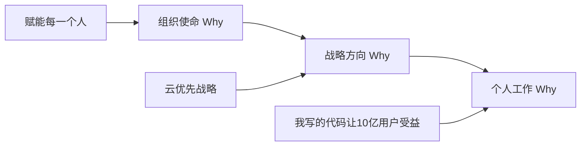
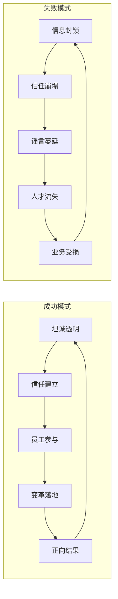
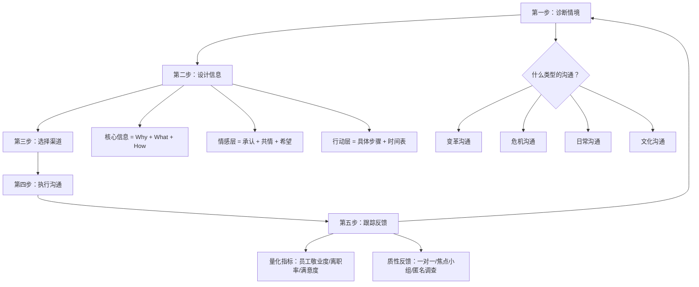

## 本节小结

十个案例，十种情境，但领导力沟通的底层逻辑是相通的。本节不打算简单重复每个案例的要点，而是将十个案例打散重组，提炼出一套可迁移的领导力沟通框架。

### 一、十个案例的全景回顾

先用一张表把十个案例的核心信息拉齐，方便对比阅读：

| 案例 | 核心场景 | 关键人物/组织 | 结果 | 核心沟通策略 |
|------|----------|---------------|------|-------------|
| 案例一 | CEO变革沟通 | 纳德拉/微软 | 市值从3000亿→3万亿美元 | 从"为什么"开始，重复核心信息7次以上 |
| 案例二 | 愿景传达 | 张一鸣/字节跳动 | 全球化布局成功 | OKR透明化，用数据而非口号驱动 |
| 案例三 | 危机沟通 | 强生/泰诺事件 | 品牌信任度反而提升 | 速度+坦诚+行动先行 |
| 案例四 | 跨文化团队 | 联想 | 全球PC市场份额第一 | 尊重差异，建立共同语言 |
| 案例五 | 远程团队 | GitLab | 全远程2000+员工高效运转 | 文档即沟通，异步优先 |
| 案例六 | 文化塑造 | 海底捞 | 员工满意度行业领先 | 故事传播，以身作则 |
| 案例七 | 沟通失败 | 某科技公司 | 核心人才大量流失 | 反面教材：信息封锁+高层不一致 |
| 案例八 | 新生代领导 | 某新消费品牌 | 三年100%+增长率 | 坦诚透明，失败去污名化 |
| 案例九 | 疫情危机 | 某餐饮企业 | 存活并逆势扩张 | 共情先行，信息分层传递 |
| 案例十 | 跨文化出海 | 某中国企业 | 海外市场突破 | 文化智商，本地化沟通 |

### 二、六大核心原则深度解析

从十个案例中提炼出六条核心原则。这些原则不是并列的清单，而是一个相互嵌套的系统。

```mermaid
graph TD
    A[领导力沟通原则系统] --> B[坦诚透明]
    A --> C[从"为什么"开始]
    A --> D[以身作则]
    A --> E[关注情感]
    A --> F[持续沟通]
    A --> G[文化嵌入]

    B --> B1[信息对称减少猜疑]
    C --> C1[意义感驱动行动]
    D --> D1[行为是最强信号]
    E --> E1[情绪是决策的底层引擎]
    F --> F1[重复是内化的前提]
    G --> G1[价值观从口号变为习惯]

    B1 --> H[信任基础]
    C1 --> H
    D1 --> H
    E1 --> I[情感连接]
    F1 --> I
    G1 --> J[组织记忆]
    H --> K[高效领导力沟通]
    I --> K
    J --> K
```

#### 2.1 坦诚透明——信任的基石

**为什么这一条排在第一位？** 因为没有信任，后面五条全部失效。你可以有完美的愿景叙事、感人的危机声明，如果团队不信任你，这些话只会被当作表演。

**强生泰诺事件的启示：** 1982年，芝加哥地区7人因服用含氰化物的泰诺胶囊死亡。强生CEO詹姆斯·伯克面临一个选择——是低调处理还是全面公开。他选择了后者：立即召回全美3100万瓶泰诺（价值1亿美元），24小时内召开全国新闻发布会，全程配合警方调查。结果？泰诺市场份额从35%暴跌至8%，但五个月后恢复到30%，一年后完全恢复。

关键不在于"召回"这个动作本身，而在于**信息传递的速度和完整度**。伯克没有等内部调查结束再发声，没有用模糊的官方辞令，没有试图最小化事件影响。他把"我们知道的"和"我们不知道的"同时告诉了公众，然后用行动证明"我们正在做的"。

**某科技公司反面案例的教训：** 同样是组织变革，某科技公司选择了信息封锁——裁员消息先在社交媒体上泄露，员工比管理层更晚知道重组计划，高层在不同场合给出矛盾的解释。结果是核心团队流失率飙升，Glassdoor评分从4.2跌至2.8，招聘成本翻了三倍。

**坦诚透明的操作定义：**

| 维度 | 做法 | 常见误区 |
|------|------|----------|
| 信息对称 | 员工知道的不比外部少 | "先内部消化再说"导致谣言填补空白 |
| 不确定性坦白 | 明确区分"已确认"和"仍在评估" | 为了显得果断而给出虚假确定性 |
| 坏消息优先 | 坏消息亲自说、尽快说 | 等到无法隐瞒才被动披露 |
| 一致性 | 所有高层传递同一信息 | CEO和VP的口径不一致 |

#### 2.2 从"为什么"开始——意义感驱动行动

西蒙·斯涅克的"黄金圆环"理论在领导力沟通中被反复验证：人们不因为"做什么"而追随你，他们因为"为什么做"而追随你。

**纳德拉的做法：** 他上任后反复强调的不是"我们要做云计算"（What），而是"我们要赋能地球上的每一个人和每一个组织，让他们取得更多成就"（Why）。这个"为什么"足够大，大到可以容纳任何业务调整——做云计算是因为它能赋能更多人，做AI也是因为同样的原因。当员工理解了"为什么"，具体的"做什么"就变成了逻辑推导而非自上而下的指令。

**字节跳动的做法：** 张一鸣用"始终创业"四个字定义了字节跳动的"为什么"。这个定位解释了为什么公司要不断进入新领域（不是贪婪，是创业精神），为什么组织架构要频繁调整（不是混乱，是适应变化），为什么工作强度大（不是压榨，是创业常态）。当"为什么"被内化后，很多管理问题自然消解。

**"为什么"的三层传递结构：**



领导者经常犯的错误是只传递了第一层（组织使命），就期待员工自动推导出第三层（个人意义）。实际上，**中间的战略连接层最容易断裂**。纳德拉的做法是在年信中先讲使命，再讲战略优先级，再具体到每个事业部的目标——让每一层的"为什么"都有明确的上下文。

#### 2.3 以身作则——行为是最强的信号

**海底捞的案例：** 张勇不是在PPT里写"服务至上"，而是在门店巡店时亲自为顾客端锅底、帮员工系围裙。海底捞的服务文化不是靠培训手册建立的，而是靠"创始人这样做，店长这样做，老员工这样做，新人自然跟着做"这个链路传导的。

**纳德拉的案例：** 他要求全员学习成长型思维，自己先在全员大会上公开承认"我对女性薪酬问题的发言是错误的"。他要求拥抱开源，微软先在GitHub上开源了.NET核心框架。行为信号的传递效率远高于语言——当员工看到CEO在犯错后公开道歉，"失败是学习的证据"这句话才真正有了分量。

**以身作则的信号放大机制：**

领导者的每一个公开行为都在被下属解码。解码的规则很简单：**看领导者把时间、注意力和资源投在哪里**。

- 纳德拉每年亲自写年信 → 信号：变革是CEO的第一优先级，不是HR的项目
- 海底捞店长亲自服务顾客 → 信号：服务不是基层员工的事，是每个人的事
- GitLab CEO公开自己的OKR → 信号：透明不是口号，是从CEO开始的义务

#### 2.4 关注情感——情绪是决策的底层引擎

丹尼尔·卡尼曼在《思考，快与慢》中证明：人类的决策首先由情感系统（系统1）触发，然后才由理性系统（系统2）进行验证。领导力沟通如果只诉诸理性（数据、逻辑、战略），就忽略了驱动行动的真正引擎。

**强生的做法：** 伯克在新闻发布会上没有只说"我们已经召回产品"（理性），他说"这些受害者是我们的邻居、我们的家人"（情感）。他把一个商业危机转化为一个道德事件，让公众的情感从"恐惧"转向"信任"。

**某餐饮企业疫情应对的做法：** 疫情期间，创始人没有只发一封"公司会度过难关"的声明，而是录了一段视频，讲述自己创业时也经历过类似的至暗时刻。他说："我理解你们的恐惧，因为我也害怕。但我想告诉你们，每一次危机过后，留下来的人都变得更强大。"这段视频在员工群里的转发率达到了97%。

**情感沟通的四步法：**

1. **承认情绪**："我知道这个消息让大家感到不安"——不要跳过这一步直接讲方案
2. **共情共鸣**："如果我坐在你们的位置，我也会有同样的感受"——把领导者的立场拉到和员工同一侧
3. **提供意义**："但正因为困难，我们做的这件事才更有价值"——把负面情绪转化为正面动力
4. **行动承诺**："以下是具体的三步计划"——情绪需要落地到行动才能真正转化

#### 2.5 持续沟通——重复是内化的前提

约翰·科特在《领导变革》中的研究数据：领导者平均需要将同一个信息重复传达7次以上，团队才能真正内化。这不是因为员工理解力差，而是因为信息在传递过程中会被噪音稀释、被旧习惯覆盖、被不确定性干扰。

**纳德拉的实践：** 他在年信、全员大会、产品发布会、媒体采访、内部邮件中反复强调同一个核心信息——"成长型思维"。他不是在复制粘贴同一段话，而是在不同语境下用不同方式表达同一个核心。

**字节跳动的实践：** OKR的双月刷新机制本身就是一种持续沟通的制度设计——每两个月，全公司从上到下重新对齐目标。这不是官僚主义，而是用制度保障信息不会在组织层级传递中衰减。

**持续沟通的节奏设计：**

| 频率 | 内容 | 渠道 | 案例来源 |
|------|------|------|----------|
| 每日 | 小胜利、一线故事 | 团队群/Slack | 海底捞每日晨会分享 |
| 每周 | 进展回顾、障碍暴露 | 周会/周报 | GitLab每周全员异步更新 |
| 每月 | 里程碑通报、方向校准 | 全员邮件/会议 | 纳德拉的月度全员Q&A |
| 每季 | 战略回顾、优先级调整 | 季度业务回顾 | 字节跳动OKR双月刷新 |
| 每年 | 愿景重申、文化仪式 | 年信/年会 | 纳德拉的年度公开信 |

#### 2.6 文化嵌入——价值观从口号变为习惯

**海底捞的案例：** 海底捞的服务文化不是靠墙上贴的标语建立的，而是靠三个机制嵌入日常行为：
- **故事传播机制**：每个门店每周分享"感动顾客"的真实故事，好的故事在全公司流传
- **授权机制**：服务员有权自主决定给顾客免单、送菜，不需要请示店长——这个制度本身就是"信任员工"这个价值观的最强表达
- **晋升机制**：所有店长从服务员做起，文化认同是晋升的首要标准

**GitLab的案例：** GitLab有一份超过2000页的员工手册（全部公开在GitLab.com上），这份手册不是管理工具，而是文化载体。它规定了从"如何写一封好的邮件"到"如何做决策"的一切行为标准。新员工入职的第一个月，主要任务就是阅读这份手册。

**文化嵌入的四个抓手：**

1. **制度保障**：把价值观转化为可执行的制度（如海底捞的授权机制）
2. **故事传播**：用真实故事替代抽象口号（每周的感动故事分享）
3. **仪式感**：设计文化仪式强化认同（GitLab的手册更新、海底捞的拜师仪式）
4. **筛选机制**：招聘和晋升时把文化匹配作为硬指标

### 三、成功模式与失败模式对比

把成功案例和失败案例放在一起对比，模式会更加清晰：



**失败模式的五个典型特征：**

| 特征 | 具体表现 | 后果 |
|------|----------|------|
| 信息封锁 | 裁员消息先从外部泄露 | 员工信任归零，核心人才主动离职 |
| 高层不一致 | CEO和VP给出矛盾解释 | 组织决策瘫痪，中层无所适从 |
| 只通知不解释 | "公司决定重组，大家配合" | 员工感到被当作工具而非伙伴 |
| 忽视情感反应 | 只讲数据不讲共情 | 恐惧和愤怒在暗处发酵 |
| 缺乏后续跟进 | 重组宣布后三个月没有更新 | 不确定性持续消耗组织能量 |

### 四、可迁移的领导力沟通框架

综合十个案例，提炼出一个五步框架，适用于任何领导力沟通场景：



**框架详解：**

**第一步：诊断情境——你面对的是什么类型的沟通？**

不同情境需要不同的沟通策略。强生的危机沟通和纳德拉的变革沟通，方法完全不同。在开始沟通之前，先回答三个问题：

- 这是正面消息还是负面消息？（好消息可以稍慢，坏消息必须快）
- 利益相关者有哪些？（员工、客户、投资人、媒体——他们的关注点不同）
- 信息缺口有多大？（员工已经知道了多少？谣言填补了多少空白？）

**第二步：设计信息——核心信息必须包含三层**

任何领导力沟通的核心信息都应包含三层：
- **Why**：为什么这件事重要？（意义感）
- **What**：具体是什么？（事实清晰度）
- **How**：接下来怎么做？（行动指引）

缺少任何一层都会导致沟通失败。只有Why没有What是空话，只有What没有How让人焦虑，只有How没有Why让人抗拒。

**第三步：选择渠道——信息和渠道必须匹配**

紧急危机 → 全员会议+CEO亲自出面（如强生的新闻发布会）
重大变革 → 年信+全员大会+一对一面谈的组合（如纳德拉）
文化渗透 → 日常故事+制度嵌入+仪式感（如海底捞）
远程团队 → 文档优先+异步更新+定期视频（如GitLab）

**第四步：执行沟通——注意信号放大效应**

领导者在沟通时，不只传递信息内容本身，还在传递信号。你选择在什么时间、什么场合、用什么语气、穿什么衣服说话，都在被下属解码。纳德拉穿休闲装出席发布会是一个信号，张勇亲自端锅底是一个信号，CEO第一个分享失败也是一个信号。

**第五步：跟踪反馈——沟通不是发射，是对话**

沟通效果不能靠感觉判断，必须有量化和质性两种反馈渠道：
- **量化指标**：员工敬业度调查、内部净推荐值（eNPS）、离职率变化、内部沟通平台的参与率
- **质性反馈**：一对一面谈中的真实声音、匿名反馈箱、焦点小组讨论

### 五、不同领导层级的应用指南

领导力沟通不是只有CEO才需要做的事。不同层级的领导者，应用场景和侧重点不同：

| 层级 | 典型场景 | 核心挑战 | 重点原则 | 参考案例 |
|------|----------|----------|----------|----------|
| 高层（CEO/VP） | 组织变革、危机公关、战略转型 | 信息在多层级传递中衰减 | 从"为什么"开始，持续沟通 | 纳德拉、强生 |
| 中层（总监/经理） | 团队重组、目标对齐、冲突调解 | 上下信息不对称，夹心层困境 | 坦诚透明，关注情感 | 字节跳动OKR、某科技公司反面案例 |
| 基层（主管/组长） | 日常激励、新人融入、绩效反馈 | 权威有限，影响靠信任而非职位 | 以身作则，文化嵌入 | 海底捞服务员授权 |
| 新生代领导者 | 快速扩张、代际差异、扁平化管理 | 经验不足，需要快速建立权威 | 失败去污名化，坦诚透明 | 某新消费品牌 |

### 六、领导力沟通的自我诊断清单

读完十个案例后，用以下清单诊断你当前的领导力沟通水平：

- [ ] **坦诚度**：团队成员是否能从你这里获得和外部一样多的信息？
- [ ] **意义感**：你的团队成员能否清晰说出"我们为什么做这件事"？
- [ ] **行为一致性**：你要求团队做的事情，自己是否先做到了？
- [ ] **情感连接**：在重大变革或危机中，你是否先处理情绪再处理事务？
- [ ] **持续性**：你的核心信息是否有规律地重复传递，还是只在"需要的时候"才沟通？
- [ ] **文化嵌入**：你的价值观是否已经转化为可观察的日常行为，而不只是墙上的标语？
- [ ] **反馈闭环**：你是否有机制定期收集沟通效果的反馈？

如果以上七项中有三项以上无法自信地回答"是"，那么这就是你下一步需要重点改进的方向。

### 七、从案例到行动：你的下一步

案例的价值不在于复制，而在于理解背后的原理。每个组织的情境不同，但领导力沟通的核心原则是相通的。以下是基于本节内容的三个立刻可以执行的行动：

1. **本周**：选一个你一直在回避的坏消息，用"四步情感沟通法"（承认情绪→共情共鸣→提供意义→行动承诺）重新设计你的沟通内容
2. **本月**：设计一套适合你团队的持续沟通节奏（参考2.5节的节奏表），开始执行
3. **本季度**：做一次匿名的领导力沟通效果调查，用第六节的七项清单作为问卷框架

> 最后记住：领导力沟通不是一个"技能"，而是一种"习惯"。技能可以在培训中获得，习惯只能在实践中养成。读完这十个案例，最重要的不是记住了多少知识点，而是明天早上到办公室后，你做的第一件不同的事是什么。
