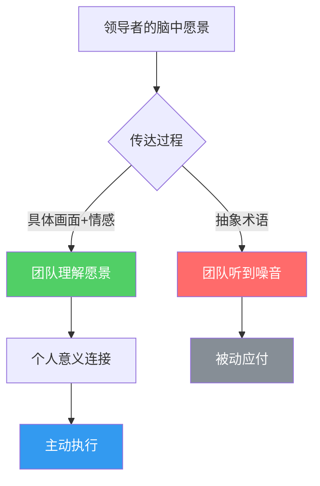

## 一、愿景传达技巧

愿景是领导力的基石。一个无法传达的愿景，等同于不存在的愿景。本节从认知科学、组织行为学和实战经验三个维度，系统拆解愿景传达的完整方法论。

### 为什么愿景传达如此困难？

领导者最常犯的错误之一是"以为自己说清楚了"。你脑中有一幅清晰的战略蓝图，但当你用抽象的商业术语表达出来时，团队成员听到的只是一串空洞的词汇。

这种现象在认知科学中被称为**"知识的诅咒"（Curse of Knowledge）**——一旦你知道了某件事，就很难想象不知道它是什么感觉。1990年斯坦福大学Elizabeth Newton的实验完美诠释了这一点：当一个人"敲击"一首歌的节奏时，敲击者认为对方能听懂的概率是50%，而实际猜对率仅为2.5%。领导者的愿景传达也面临同样的困境。

**愿景传达失败的五个典型原因：**

| 失败原因 | 表现 | 后果 |
|---------|------|------|
| 过度抽象 | "我们要成为行业领导者" | 团队无法转化为具体行动 |
| 信息过载 | 一份20页的PPT塞满数据 | 关键信息被淹没 |
| 缺乏情感连接 | 只谈数字和KPI | 员工被动执行，没有内驱力 |
| 单次沟通 | 开一次大会就以为搞定 | 信息遗忘曲线导致三个月后无人记得 |
| 言行不一 | 说创新但惩罚失败 | 信任崩塌，愿景沦为笑柄 |

### 愿景传达的五步法

#### 第一步：简化核心信息

将愿景浓缩为一句话。如果不能用一句话说清楚，说明你还没有想清楚。

**检验标准：电梯测试**——你能否在30秒内向一个完全不了解你业务的人说清楚你在做什么、为什么重要？

**简化的方法论：**

1. **剥洋葱法**：连续追问五次"为什么这很重要"，直到触达最本质的价值
2. **用户视角法**：从终端用户的体验出发描述，而不是从企业能力出发
3. **反面验证法**：写出你的愿景陈述，然后问"这句话的反面是什么？"如果反面没有人会支持，说明你的愿景没有区分度

**案例对比：**

- 反面："我们要通过技术创新驱动数字化转型，赋能生态伙伴，构建可持续发展的商业闭环"——这句话适用于任何一家科技公司，毫无区分度
- 正面（马斯克对SpaceX）："让人类成为多星球物种"——七个字，清晰、大胆、不可忘记

**愿景一句话的三个要素：**

- **方向**：我们要去哪里？
- **意义**：为什么值得去？
- **规模**：影响有多大？

#### 第二步：连接个人意义

解释这个愿景对每个人意味着什么。人们关心的不是"公司的战略目标"，而是"这对我有什么影响"。

这是愿景从"领导者的口号"变成"团队的信念"的关键转化步骤。哈佛商学院John Kotter的研究表明，成功的变革领导者花在沟通愿景上的时间是失败者的10倍以上，而且他们始终在回答同一个问题："这和我有什么关系？"

**连接个人意义的四个层面：**

| 层面 | 问题 | 示例 |
|------|------|------|
| 职业成长 | 这个愿景如何帮助我成长？ | "在这次转型中，每个人都会掌握AI协作能力，这将是你未来十年最值钱的技能" |
| 日常工作 | 我的工作内容会怎么变？ | "你不需要再手动处理那些重复报表，可以把时间花在真正需要判断力的事情上" |
| 团队归属 | 我在其中扮演什么角色？ | "你负责的用户研究是整个产品决策的起点，没有你的洞察，我们就是在闭门造车" |
| 价值认同 | 这件事为什么有意义？ | "我们做的不是卖软件，是让那些没有技术背景的创业者也能用上企业级工具" |

**实操技巧：一对一愿景对话**

不要只在大会上讲愿景。Kotter建议在小范围、一对一的场景中，用对话而非演讲的方式传达愿景。具体做法：

1. 先问对方："你觉得我们现在最大的挑战是什么？"——了解对方的认知基线
2. 分享你的判断，用具体数据和案例支撑
3. 描绘改变后的画面，特别强调对对方的具体影响
4. 问对方："你怎么看？"——把独白变成对话
5. 记录对方的反馈，后续跟进

#### 第三步：使用具体画面

用具体的场景和画面代替抽象的概念。"成为行业领导者"不如"让每个家庭都能用上我们的产品"。

认知心理学研究表明，人类大脑处理具体画面的效率是抽象概念的6倍。当你说"提升客户满意度"时，听众的大脑没有明确的加工路径；当你说"让每一个打电话来的客户在挂电话时都能露出微笑"时，听众的脑海中会自动浮现画面——这就是**具象化**的力量。

**具象化的五种手法：**

1. **场景描写法**：描绘愿景实现后某个具体场景
   - "想象一下，三年后的早晨，一个农村妈妈用我们的APP预约了县城医院的专家号，孩子不用再坐五个小时的大巴去省城看病"
2. **数据锚定法**：用具体的数字代替模糊的程度词
   - 不说"大幅降低"，说"从平均47天降到3天"
3. **用户故事法**：用一个真实用户的经历承载愿景
   - "上个月，云南的一位老师告诉我们，因为我们的平台，她的学生第一次看到了大海的视频"
4. **对比冲击法**：用before/after的强烈对比制造画面感
   - "现在，报销一张发票需要7个审批节点、平均12天。我们的目标是：拍照上传，3分钟到账"
5. **隐喻映射法**：用听众熟悉的事物比喻陌生的概念
   - "我们要做的不是另一个ERP系统，而是企业的'操作系统'——就像Windows让每个人都能用电脑一样，我们让每家企业都能用上数字化管理"

#### 第四步：提供行动指引

愿景必须能够回答"那我明天应该做什么？"

这是大多数愿景传达的最后一公里断裂点。领导者描绘了激动人心的未来，但团队回到工位上，面对的还是同样的待办事项。愿景和行动之间缺少一座桥梁。

**从愿景到行动的转化框架：**

**具体做法：**

1. **愿景→战略地图**：用平衡计分卡或战略地图，将愿景分解为4-6个战略主题
2. **战略→OKR**：每个战略主题对应2-3个目标，每个目标对应3-5个关键结果
3. **OKR→周计划**：每周团队会议上，每个人汇报"本周我做了什么来推进愿景"
4. **决策过滤器**：给团队一个简单的判断标准——"当面临两个选择时，选那个更接近愿景的"

**决策过滤器的实战模板：**

> 当你不确定该做什么时，问自己三个问题：
> 1. 这件事是否让我们的用户离"那个画面"更近一步？
> 2. 如果愿景实现了，这件事还重要吗？
> 3. 三年后回头看，我会为做了这件事感到骄傲吗？
>
> 三个都是"是"——全力投入。两个"是"——慎重考虑。一个或零个——放弃或委托。

#### 第五步：重复再重复

重要的信息需要反复传达。你觉得自己已经说了太多遍的那一天，团队可能才第一次真正听到。

这并非夸张。组织沟通研究发现，一个关键信息从领导者发出到被基层员工真正理解和内化，平均需要经过**7次有效接触**。而且每次接触需要用不同的形式和渠道。

**重复但不无聊的七种传播形式：**

| 次序 | 形式 | 场景 | 要点 |
|------|------|------|------|
| 1 | 全员大会发布 | 季度/年度 | 正式宣布，制造仪式感 |
| 2 | 部门深度解读 | 会后一周内 | 结合部门实际翻译愿景 |
| 3 | 一对一对话 | 持续进行 | 连接个人意义 |
| 4 | 可视化展示 | 日常可见 | 海报、屏保、工位卡片 |
| 5 | 故事传播 | 每周 | 分享与愿景一致的正面案例 |
| 6 | 决策嵌入 | 每次会议 | "这个决定是否符合我们的愿景？" |
| 7 | 回顾复盘 | 月度/季度 | "我们离愿景更近了吗？差多远？" |

**关键原则：每一次重复都要有增量信息。** 简单的复制粘贴会让愿景沦为噪音。第一次讲"是什么"，第二次讲"为什么"，第三次讲"对你意味着什么"，第四次讲"我们做到了哪些"……每次都有新的信息层次。

### 实用框架：愿景陈述模板

> "我们相信【核心信念】。我们正在为【目标群体】创造一个【具体画面】。为了实现这个愿景，我们将【核心行动】。每个人都可以通过【具体方式】参与其中。"

**填写示例（某教育科技公司）：**

> "我们相信**每个孩子都值得拥有个性化教育**。我们正在为**全国三四线城市的中小学生**创造一个**随时都能获得优质辅导的学习环境**。为了实现这个愿景，我们将**用AI技术把一线城市名师的教学方法变成每个老师都能使用的工具**。每个人都可以通过**分享你身边的学习故事、参与产品体验反馈、或推荐给身边的家长**参与其中。"

### 愿景传达的常见误区

| 误区 | 为什么是错的 | 正确做法 |
|------|------------|---------|
| "愿景越大越好" | 太大的愿景让人觉得不真实，反而丧失动力 | 大胆但可信，最好能说清楚"凭什么能做到" |
| "说一次就够了" | 信息遗忘曲线：一周后忘记70% | 7次以上的多形式重复 |
| "只在正式场合讲" | 员工知道领导在"表演"，感受不到真诚 | 在日常决策、闲聊、邮件签名中持续嵌入 |
| "愿景不能变" | 外部环境变化时固守旧愿景会失去团队信任 | 核心信念不变，具体画面可以迭代 |
| "让中层去传达就行" | 信息逐层衰减，到基层已面目全非 | 领导者直接面对一线，至少每季度一次 |
| "PPT做得漂亮就够了" | 形式大于内容，员工记住的是笑话不是愿景 | 内容为王，用最朴素的语言讲最深刻的道理 |

### 不同场景下的愿景传达策略

#### 初创团队（10人以内）

- **形式**：创始人一对一+每周全员会
- **频率**：每天都在讲，融入日常对话
- **重点**：每个人都知道公司为什么存在，自己为什么重要
- **忌讳**：不要照搬大公司的正式流程，小团队需要的是信念感染力而非流程规范

#### 成长期团队（10-100人）

- **形式**：全员大会+部门解读+内部文档
- **频率**：每月至少一次全员触达
- **重点**：开始需要书面化，建立内部知识库，让新人入职就能理解愿景
- **忌讳**：不要让愿景停留在墙上，要嵌入到绩效评估和晋升标准中

#### 大型组织（100人以上）

- **形式**：多层级传播体系+文化建设+仪式感
- **频率**：每季度一次全员活动，每月一次部门复盘
- **重点**：通过故事、仪式、符号系统让愿景成为组织文化的一部分
- **忌讳**：不要只靠邮件和企业微信推文，需要线下场景和情感连接

### 进阶：愿景领导力的深层修炼

#### 从"传达"到"共创"

最高级的愿景传达不是单向输出，而是让团队成员成为愿景的共同创造者。当人们参与了愿景的制定过程，他们会把愿景视为"我们的"而非"你的"。

**共创愿景的操作步骤：**

1. **提出方向**：领导者提出愿景的大方向和核心信念（不是完整方案）
2. **收集输入**：通过工作坊、匿名问卷、一对一对话收集每个人的看法
3. **共同打磨**：在小范围工作坊中，把碎片化的想法整合成完整的愿景陈述
4. **全员投票**：让每个人对愿景陈述提出修改意见，直到获得广泛认同
5. **共同承诺**：在正式场合，每个人公开承诺"我愿意为这个愿景付出什么"

#### 愿景的"压力测试"

一个好愿景需要经得起以下六个问题的考验：

1. **清晰度测试**：随机问10个人"我们的愿景是什么"，答案是否一致？
2. **激励度测试**：听到这个愿景后，人们是否感到兴奋而非困惑？
3. **可信度测试**：人们是否相信这个愿景真的可以实现？
4. **行动度测试**：人们能否从愿景中推导出自己的具体行动？
5. **持久度测试**：三年后这个愿景是否仍然有效？
6. **区分度测试**：竞争对手能否直接复制这个愿景？

如果六个问题中有两个以上答案为"否"，就需要重新打磨愿景。

### 本节小结

愿景传达不是一个单次事件，而是一个持续的过程。核心公式是：

> **有效愿景传达 = 简化核心信息 × 连接个人意义 × 使用具体画面 × 提供行动指引 × 持续重复传播**

五个环节缺一不可。简化不到位，听众听不懂；不连接个人意义，听众不在乎；不用具体画面，听众记不住；没有行动指引，听众无法执行；不持续重复，听众会遗忘。把这五步做成一个系统，你的愿景就不再是一句口号，而是驱动团队前进的真实力量。
