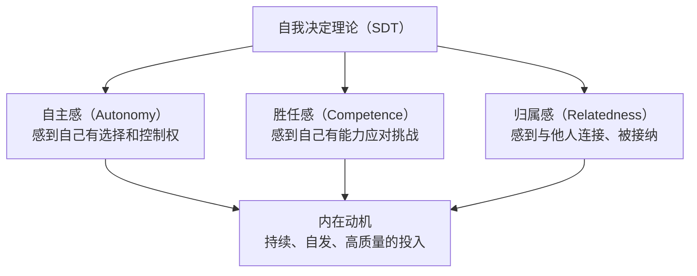
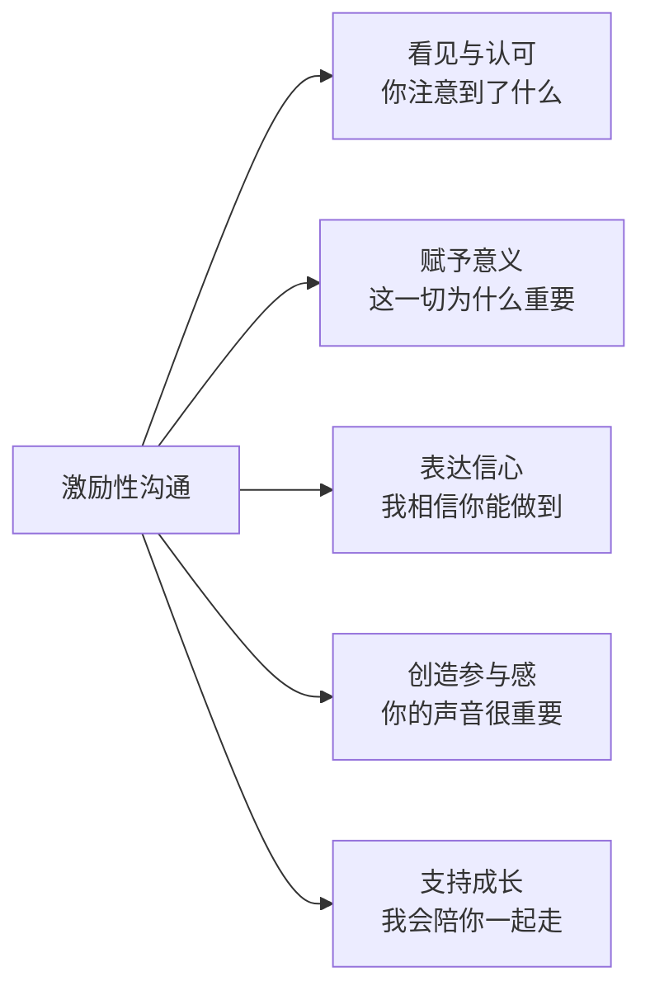

## 二、激励性沟通技巧

### 为什么激励是领导力沟通的核心能力？

领导者的首要任务不是分配任务，而是点燃人心。一个团队可以暂时因为制度和考核而运转，但只有当成员真正被激励时，才会爆发出超越预期的创造力和执行力。激励性沟通不是"说好话"或"画大饼"，而是一套基于心理学原理、经过实践验证的系统性沟通方法论。

德鲁克曾说："管理的本质是激发人的善意和潜能。"这句话的关键词是"激发"——它不是外部强加的，而是通过沟通唤醒的。本节将从理论根基出发，系统讲解激励性沟通的完整框架、具体技巧、实操工具和常见误区。

---

### 理解激励的心理学根基

#### 自我决定理论（Self-Determination Theory）

心理学家爱德华·德西（Edward Deci）和理查德·瑞安（Richard Ryan）提出的自我决定理论（SDT），是理解人类动机最重要的理论框架之一。该理论认为，人类有三种基本心理需求，当这些需求被满足时，人会表现出最强的内在动机：

| 需求 | 定义 | 被满足时的表现 | 被挫伤时的表现 |
|------|------|----------------|----------------|
| 自主感 | 感到行为出于自己的选择而非外部压力 | 主动承担、富有创造力、愿意额外付出 | 被动执行、应付差事、抵制变化 |
| 胜任感 | 感到自己有能力完成有挑战的任务 | 愿意接受挑战、持续学习、追求卓越 | 回避困难、害怕失败、自我设限 |
| 归属感 | 感到自己是团队和组织的一部分 | 积极协作、主动分享、维护团队利益 | 孤立疏离、信息囤积、只关注个人利益 |

这三种需求构成了激励性沟通的理论基石。**有效的激励性沟通，本质上就是在每一次沟通中有意识地满足对方这三种心理需求。**

#### 内在动机与外在动机的根本区别

很多领导者误以为激励就是"给钱"或"画饼"。这涉及一个关键区分：外在动机和内在动机。

**外在动机**来自外部奖惩——加薪、晋升、奖金、考核。它的特点是见效快、衰减也快。一旦外部刺激消失，行为也会停止。更严重的是，过度依赖外在奖励会"挤出"内在动机，心理学上称为"过度合理化效应"（Overjustification Effect）。

**内在动机**来自行为本身的意义感和满足感——工作本身的乐趣、成长的成就感、对使命的认同。它的特点是持久、稳定、不需要外部持续施加压力。

| 维度 | 外在动机 | 内在动机 |
|------|----------|----------|
| 驱动来源 | 奖金、考核、升职 | 意义感、成长感、归属感 |
| 持续性 | 刺激消失则行为停止 | 持久稳定 |
| 创造力 | 抑制创造性思维 | 激发创造性思维 |
| 适用场景 | 机械性、重复性任务 | 复杂性、创造性任务 |
| 领导者能做什么 | 设计合理的制度（必要但不充分） | 通过沟通创造意义感、信任感、成长空间 |

**关键洞察**：领导者能直接影响的主要是内在动机。制度和考核由HR和管理层共同设计，但只有领导者本人能通过日常沟通创造意义感和归属感。这就是为什么激励性沟通是领导力的核心能力，而不是"锦上添花"。

#### 赫茨伯格的双因素理论

弗雷德里克·赫茨伯格（Frederick Herzberg）的研究进一步验证了上述区分。他将工作因素分为两类：

- **保健因素**（Hygiene Factors）：薪酬、工作条件、公司政策、人际关系等。这些因素做好了，员工不会不满，但也不会被激励。它们是"底线"，不是"天花板"。
- **激励因素**（Motivators）：成就感、认可、工作本身的挑战性、责任感、成长机会。这些因素才是真正驱动卓越表现的引擎。

这个理论对领导者的启示非常直接：**不要把精力全部花在改善保健因素上（那更多是组织制度的事），而要专注于在日常沟通中创造激励因素。**

---

### 激励性沟通的核心框架

基于上述理论，我们建立一个完整的激励性沟通框架——"五维激励模型"：

每个维度对应不同的心理需求，组合使用时产生最强的激励效果。下面逐一展开。

---

### 维度一：看见与认可

#### 为什么"被看见"是人类最深层的需求之一？

心理学家威廉·詹姆斯（William James）说过："人类本性中最深刻的渴望，就是受到赞赏。"这不是虚荣心，而是人类社会性本能的体现。在进化心理学的视角下，被群体看见和认可意味着"我被接纳了，我是安全的"。

在工作场景中，"被看见"的含义更具体：我的努力被注意到了，我的贡献被理解了，我的价值被确认了。当一个人长期感到"做了很多但没人看到"时，最容易出现的状态是职业倦怠。

#### "看见与认可"的具体方法

**方法一：SBI反馈法（Situation-Behavior-Impact）**

这是最结构化、最有效的认可方式。SBI模型由三个要素构成：

| 要素 | 说明 | 示例 |
|------|------|------|
| Situation（情境） | 具体描述发生的场景 | "在上周三的客户提案会上" |
| Behavior（行为） | 具体描述你观察到的行为 | "你主动用数据反驳了客户对ROI的质疑" |
| Impact（影响） | 说明这个行为产生的实际影响 | "这让客户当场决定签下一阶段合同，团队士气也因此大幅提升" |

完整示例："上周三客户提案会上（S），你主动用数据反驳了客户对ROI的质疑（B），这不仅让客户当场决定签下一阶段合同，也让整个团队看到了数据驱动的价值（I）。谢谢你。"

**为什么SBI比简单说"做得好"有效得多？**因为模糊的认可让人怀疑你是否真的注意到了他的贡献，而具体到行为层面的认可传递了两个信息：第一，我确实在关注你；第二，这个行为值得继续做。

**方法二：进步原则（Progress Principle）**

哈佛商学院特蕾莎·阿马比尔（Teresa Amabile）的研究发现，**工作中的小进步是影响情绪和动机的最强因素**，甚至超过薪酬和认可。她称之为"进步原则"。

领导者可以这样运用进步原则：

1. **设定可感知的小里程碑**：不要只设定年底的大目标，把过程拆分为每周/每两周的小阶段
2. **在每次小进步时给予即时反馈**："这个版本比上周迭代了三个关键功能，我看到你在数据库查询优化上下了功夫"
3. **帮助团队看到自己的进步**：定期回顾，用数据和事实展示"我们走了多远"

**方法三：个性化认可**

不同的人对认可的方式有不同的偏好。有些人喜欢公开表扬，有些人会觉得尴尬而偏好私下的肯定。有些人在意书面的认可（邮件、文档），有些人更看重口头表达。

了解团队成员的认可偏好，是"看见"的进阶版。你可以直接问："当你做了一件很棒的事情时，你更希望我怎么反馈？私下聊还是在团队会上说？"

#### "看见与认可"的常见陷阱

| 陷阱 | 表现 | 修正方法 |
|------|------|----------|
| 泛泛而谈 | "大家辛苦了""做得不错" | 用SBI法具体到行为层面 |
| 只在结果好时才认可 | 忽略过程中的努力和进步 | 运用进步原则，认可过程而非只看结果 |
| 认可方式千人一面 | 对所有人用同样的方式 | 了解每个人的偏好，个性化表达 |
| 认可滞后 | 事情过去一个月才提 | 尽量在24小时内给予反馈 |
| 认可变成操控 | "你做得好，所以继续加班吧" | 认可是纯粹的感谢，不要附加条件 |

---

### 维度二：赋予意义

#### 为什么"意义感"比"金钱"更能驱动人？

维克多·弗兰克尔（Viktor Frankl）在《活出生命的意义》中写道："人可以忍受几乎任何'如何'，只要有一个足够的'为什么'。"这不是鸡汤，而是有大量研究支撑的结论。

当人们理解自己工作的意义时，大脑的奖赏回路会被激活，其效果类似于获得物质奖励。神经科学研究表明，意义感会激活前额叶皮层的"价值评估"区域，释放多巴胺，产生持久的满足感——这与单纯的物质奖励（主要激活伏隔核，产生短暂快感）有本质区别。

#### 赋予意义的三层递进

**第一层：连接工作与用户/客户的影响**

最直接的方式是让团队成员看到自己的工作如何影响了真实的人。

- 分享客户反馈："上周有用户专门写了一封感谢信，说你优化的那个搜索功能帮她节省了每天30分钟。10万用户里有多少人因此受益，你能想象吗？"
- 建立"用户故事墙"：定期收集和分享用户使用产品/服务的真实故事
- 安排"走进用户"活动：让工程师直接与用户对话，感受自己的代码如何改变生活

**第二层：连接个人贡献与团队/组织使命**

帮助每个人理解自己的工作在更大的拼图中处于什么位置。

模板："你做的【具体工作】，帮助团队实现了【团队目标】，这最终推动了我们组织在【组织使命】上的进展。"

示例："你优化的那个数据处理流程（具体工作），将报表生成时间从4小时缩短到15分钟（团队目标），这让我们的业务团队能更快地做出决策，在竞争激烈的市场中抢占先机（组织使命）。"

**第三层：连接工作与个人成长**

帮助每个人看到工作如何服务于自己的长期职业发展。

- "这次你负责的技术方案评审，其实是在锻炼你的架构设计能力。这正是你之前说想提升的方向。"
- "你在这次跨部门协作中展现的沟通能力，比你在技术层面的进步更让我印象深刻。这是你走向技术管理的关键能力。"

#### 赋予意义的实操工具

**工具一：意义清单模板**

在项目启动时，带领团队完成以下清单：

| 问题 | 回答 |
|------|------|
| 我们做的这件事，最终会帮助谁？ | |
| 如果我们做得特别好，会有什么不同？ | |
| 如果我们不做这件事，谁会受到影响？ | |
| 这件事对我们每个人的成长意味着什么？ | |
| 完成这件事后，我们能为此骄傲吗？为什么？ | |

**工具二：意义回顾会议**

每两周花15分钟进行一次"意义回顾"：

1. 分享一个过去两周中收到的用户/客户正面反馈
2. 让一个团队成员分享"这周哪件事让你觉得最有价值"
3. 领导者总结这段时间的工作如何推动了整体目标

---

### 维度三：表达信心

#### 信心的传递机制：皮格马利翁效应

心理学家罗森塔尔（Robert Rosenthal）的经典实验证明了"期望效应"——当老师对学生有更高的期望时，学生的实际表现会显著提升。这个效应在职场中同样成立：**领导者对团队表达的期望和信心，会直接影响团队的实际表现。**

但信心的表达不是盲目的喊"你一定行"。无效的信心表达往往因为缺乏真实感而适得其反。

#### 有效表达信心的三要素

**要素一：基于事实的信心**

信心必须建立在对对方能力的真实了解之上，而不是空泛的鼓励。

- ❌ "我相信你一定能搞定"（空泛，缺乏依据）
- ✅ "上次你在比这更复杂的场景下都处理得很好，这次我同样有信心。你之前在XX项目中展现的分析能力，正是现在需要的"（具体，有依据）

**要素二：承认困难的真实性**

盲目乐观会削弱信任。有效的信心表达需要同时承认困难的存在。

- ❌ "别担心，肯定没问题"（否认困难，让对方觉得你不理解实际情况）
- ✅ "这个任务确实有挑战性，时间紧、资源有限。但正因为如此，我认为你是最合适的人选，因为你在XX方面的经验是团队中最深的"（承认困难，同时表达信心）

**要素三：提供支持的信心**

信心不只是"我相信你能做到"，还包括"你不会孤军奋战"。

- "你来做技术方案，产品和设计那边我来协调资源"
- "如果遇到卡点，随时拉我一起讨论。我不期望你一个人扛所有压力"
- "你需要的预算和人力，我已经提前和财务沟通过了"

#### 信心表达的时机选择

| 时机 | 地位 | 具体场景 | 表达方式 |
|------|------|----------|----------|
| 接受挑战时 | 最高 | 分配有难度的新任务 | "基于你在XX方面的表现，我认为你完全有能力承担这个角色" |
| 遇到困难时 | 高 | 项目进展不顺、遇到技术瓶颈 | "我们遇到的这个困难是正常的。你在XX方面的能力让我相信我们能找到解决方案" |
| 犯错之后 | 高 | 失误或判断失误 | "每个人都会犯错。这次经验会让你下次做得更好。我依然信任你的能力" |
| 变革时期 | 高 | 组织调整、业务转型 | "过去我们在XX中的转型经历证明，这个团队有能力适应变化" |
| 日常工作 | 中 | 一对一、日常互动 | "这个方案你来推进我放心" |

---

### 维度四：创造参与感

#### 为什么参与感是激励的放大器？

组织行为学的研究反复证明一个结论：**人们对他们参与制定的决策，执行意愿远远高于被动接受的决策。** 这被称为"宜家效应"（IKEA Effect）——人对自己投入了劳动的事物，会赋予更高的价值。

在领导力沟通中，创造参与感不是简单的"征求意见"。它涉及三个层次：

| 层次 | 含义 | 适用场景 |
|------|------|----------|
| 信息分享 | 让团队了解决策的背景和逻辑 | 日常事务、常规决策 |
| 意见征询 | 在决策前征求团队的想法 | 重要决策、方向性选择 |
| 共同决策 | 团队成员直接参与决策过程 | 战略方向、关键资源分配 |

#### 创造参与感的具体方法

**方法一：提问而非告知**

领导者最容易犯的错误是"先说答案，再问意见"。这实际上是在暗示"我已经想好了，你的意见不重要"。

正确的顺序是：先问，后说。

| 场景 | 错误方式 | 正确方式 |
|------|----------|----------|
| 讨论新方案 | "我觉得应该用方案A，大家怎么看？" | "这个需求你们觉得最核心的挑战是什么？你们有什么想法？" |
| 分配任务 | "这个项目你来负责，目标是XX" | "这个项目你最想负责哪个部分？你觉得目标怎么定比较合理？" |
| 解决问题 | "这个问题的解决方案是XX" | "你们已经尝试了什么？你们觉得接下来可以怎么试？" |

**方法二：授权而非委托**

授权（Empowerment）和委托（Delegation）有本质区别：

- **委托**："你去把这件事做了。"——对方是执行者，决策权在你手中。
- **授权**："这件事由你负责，你有权在这个范围内做决定。如果需要更高层级的支持，找我。"——对方是主人，你提供的是边界和支持。

授权的核心是真正把决策权下放，并且在对方做了一个与你不同的决定时，不秋后算账。

**方法三：公开认可贡献**

在更高层面的会议上提及团队成员的贡献，是最有力的参与感创造方式。

- 在管理层会议上："这个方案的核心思路来自我们的工程师XX，他在技术调研中发现了一个关键的机会点。"
- 在跨部门协作中："这次项目的成功，设计团队的XX在用户体验上的洞察起到了决定性作用。"

公开认可不仅激励了被认可者，也向整个团队传递了一个信号：**你的贡献会被看到，会被传播到你无法触及的地方。**

#### 创造参与感的边界

参与感不意味着"所有事都要民主讨论"。有些决策需要快速做出（危机应对），有些决策涉及机密信息（组织调整），有些决策超出了团队成员的视野（战略方向）。

关键原则：**在你拥有选择空间的地方，创造参与感；在没有选择空间的地方，至少创造知情权。**

即使是"已经决定"的事情，也可以这样沟通："这个决定是基于XX和XX的信息做出的。我知道这可能不是大家的第一选择，我来解释为什么我认为这是目前最好的路径。你们有什么疑问？"

---

### 维度五：支持成长

#### 为什么"成长支持"是最高层次的激励？

当基本的薪酬和安全感满足后，人最深层的工作动机之一就是"成为更好的自己"。管理学家丹尼尔·平克（Daniel Pink）在《驱动力》一书中将"精通"（Mastery）列为三大内在动机之一。

领导者通过沟通支持团队成员成长，不是偶尔的"培训推荐"，而是一个持续的、系统性的沟通过程。

#### 支持成长的沟通框架

**框架一：成长对话（Growth Conversation）**

定期（建议每季度一次）与团队成员进行专门的成长对话，区别于日常的一对一和绩效面谈。成长对话的核心议题只有一个：**你想成为什么样的人，我如何帮你到达那里？**

成长对话的结构：

| 阶段 | 时间 | 核心问题 | 领导者角色 |
|------|------|----------|------------|
| 回顾 | 10分钟 | "过去三个月，你觉得自己最大的进步在哪里？" | 倾听者，不评判 |
| 探索 | 15分钟 | "你希望在接下来的半年里，在哪个方向上突破？" | 引导者，帮助澄清 |
| 规划 | 10分钟 | "要实现这个成长目标，你需要哪些资源和机会？" | 资源提供者 |
| 承诺 | 5分钟 | "我能为你做的一件事是什么？" | 行动者，做出承诺 |

**关键注意**：成长对话中的承诺必须兑现。如果你说"我会帮你争取参加XX培训的机会"，就必须真正去推动。一次失信的承诺比没有承诺更伤人。

**框架二：发展性反馈（Developmental Feedback）**

与纠正性反馈不同，发展性反馈的目的不是修正错误，而是拓展能力边界。

结构："你在XX方面已经做得很好了。如果你能进一步在YY方面提升，你将达到下一个层次。我建议你可以尝试ZZ。"

示例："你在技术方案设计上已经是团队最扎实的了。如果你能进一步提升向非技术人员解释技术方案的能力，你将有能力担任技术负责人的角色。我建议你可以尝试在下次产品评审会上主动做技术部分的汇报。"

**框架三：挑战性任务的指派**

把有挑战性的任务交给一个人，本身就是一种强有力的激励——它传递的信号是"我认为你已经准备好了"。

但挑战性任务的指派需要配套的支持性沟通：

1. **指派时**："这个任务比你之前做的要复杂一些，但我选择你是因为你在XX方面的能力。"
2. **过程中**："最近进展怎么样？有没有遇到需要我帮忙的地方？"（定期但不频繁）
3. **完成后**："你在这个任务中展现的XX能力，比你之前有明显进步。我注意到了。"

---

### 激励性沟通的场景化应用

#### 场景一：季度/年度动员会

**目标**：在新阶段开始时激发团队的斗志和方向感

**结构**：
1. **回顾成就**（15%）：用具体数据和故事展示上一阶段的成就，重点提及团队中具体个人的贡献
2. **说明现状**（20%）：诚实分析当前的市场环境、竞争态势、内部优势和不足
3. **描绘愿景**（30%）：用具体的画面描述下一阶段的目标达成后会是什么样子
4. **明确路径**（20%）：每个人在实现这个愿景中的角色和关键行动
5. **表达信心**（15%）：基于团队过往的表现和能力，表达对未来的信心

#### 场景二：低谷期提振士气

**目标**：在团队经历挫折或低潮时重建信心

**结构**：
1. **承认现实**：不粉饰太平，直面困难。"最近确实很难，我不打算假装一切正常。"
2. **归因正确化**：将失败归因于可改变的因素（方法、策略），而非不可改变的因素（能力、运气）。"这次失败不是因为我们能力不行，而是因为我们在XX环节的策略需要调整。"
3. **找到亮点**：即使在失败中，也一定有值得肯定的部分。"虽然最终结果不理想，但你在XX环节的处理方式是正确的。"
4. **重新定义问题**：将"我们失败了"重构为"我们找到了一条不通的路"。
5. **制定下一步行动**：给人明确的方向和行动感。"接下来两周，我们聚焦做三件事……"

#### 场景三：一对一激励

**目标**：在日常互动中持续激励个体

**核心原则**：一对一中的激励不需要大场面，关键是"及时"和"真实"。

- 开场时提及最近的一个具体进步："上次你说在提升代码审查效率，我注意到最近你的review comment质量明显提升了。"
- 在对话中表达信任："这个客户交给你来跟进，我放心。"
- 结束时给出明确的支持承诺："你提到的那个工具采购的事，我这周帮你推一下。"

---

### 激励性沟通的深层机制

#### 不同人格类型的激励策略

并非所有人对同一种激励方式都有相同的反应。DISC行为风格模型提供了有用的参考：

| 行为风格 | 核心驱动 | 有效的激励方式 | 需要避免的 |
|----------|----------|----------------|------------|
| D型（支配型） | 成就和控制 | 赋予更大的责任和自主权，直接认可结果 | 过度细节化的指导、冗长的情感表达 |
| I型（影响型） | 社交和认可 | 公开表扬、团队庆祝、社交性的认可 | 只关注数据和逻辑，忽略情感连接 |
| S型（稳健型） | 安全和稳定 | 提供明确的预期、表达长期信任、稳定的认可 | 突然的变化、公开的高调表扬、不确定性 |
| C型（谨慎型） | 准确和质量 | 认可专业能力、提供学习机会、用数据说话 | 模糊的表扬、情感化的表达、无依据的乐观 |

了解你团队成员的主要行为风格，调整你的激励方式，效果会成倍提升。

#### 避免"激励疲劳"

持续使用同一种激励方式会导致"边际效用递减"——当你第100次说"做得好"时，它的激励效果可能只有第1次的十分之一。

应对策略：
1. **变换方式**：交替使用不同的激励维度（认可、意义、信心、参与、成长）
2. **保持真诚**：宁可少说也不说假话。真诚的少言胜过频繁的空话
3. **关注"未被激励"的人**：团队中最沉默、最稳定的人，往往最容易被忽视，但他们可能恰恰最需要被看见
4. **创造意外**：偶尔的非预期认可比规律性的表扬更有冲击力

---

### 激励性沟通的常见误区

#### 误区一：激励等于说好话

**表现**：每次沟通都是"大家很棒""我们一定能行"，回避任何负面信息。

**问题**：失去真实感。当领导者只说好话时，团队会认为你要么不了解实际情况，要么在刻意隐瞒什么。

**正确做法**：激励必须建立在真实的基础上。承认困难、直面问题，然后在这个基础上表达信心和方向，才是真正有力的激励。

#### 误区二：用比较来激励

**表现**："你看人家XX团队已经做到了""隔壁小王比你晚来都升了"。

**问题**：比较不是激励，是羞辱。它激活的是人的防御机制，而不是动力系统。

**正确做法**：和个人的过去比，而不是和别人比。"你现在的方案质量比三个月前提升了至少两个档次"——这是成长感，不是竞争压力。

#### 误区三：只在结果好时才激励

**表现**：项目成功了大肆庆祝，项目失败了沉默不语或严厉批评。

**问题**：这让团队形成"只有成功才值得被认可"的认知，导致人们回避风险、害怕失败。

**正确做法**：在过程中持续激励，而非只看结果。特别是当团队付出了努力但结果不理想时，更需要领导者站出来认可努力和学习。

#### 误区四：用"伪参与"来创造参与感

**表现**：形式上征求意见，但实际已经做好了决定；征求意见后没有任何反馈或采纳的迹象。

**问题**：比不征求意见更糟糕。它传递的信号是"你的意见我听到了但不重要"。

**正确做法**：要么真正参与（在决策前征询，且认真考虑），要么诚实地说明为什么这次不能参与（"这个决定时间很紧，我会在下周解释为什么选择了这个方向"）。

#### 误区五：把激励当成一次性事件

**表现**：年初开一次动员会，年中开一次总结会，平时不做任何激励性沟通。

**问题**：激励是一个持续的过程，不是事件。就像充电不是一次充够，而是持续供电。

**正确做法**：将激励性沟通融入日常——每周的一对一、每天的即时反馈、每个小里程碑的认可。

---

### 进阶：建立激励型团队文化

#### 从个人激励到文化塑造

最高层次的激励不是领导者一个人在做，而是整个团队形成了相互激励的文化。当团队成员之间也能主动"看见"彼此的贡献、"赋予"工作以意义、"表达"对同伴的信心时，领导者的激励就从"个人行为"进化为"组织能力"。

建立激励文化的关键动作：

1. **建模**：领导者首先要成为激励性沟通的示范者。你的每一个沟通行为，团队都在学习
2. **制度化**：在团队会议中固定"认可环节"——每周团队会的最后5分钟，每个人分享一个"本周我看到的XX做的一件好事"
3. **工具化**：提供让团队成员能便捷地相互认可的工具（内部论坛、Slack频道、实体"点赞墙"）
4. **故事化**：把团队中的激励故事提炼为团队的"共同记忆"——"还记得去年XX项目里YY那个晚上改了三天bug的事吗？那种精神就是我们团队的DNA"

#### 自我检测清单

定期（建议每月一次）用以下清单检视自己的激励性沟通状态：

- [ ] 过去一周，我是否对至少两个团队成员给出了具体的、行为层面的认可？
- [ ] 过去一周，我是否帮助至少一个团队成员看到了他/她工作的意义？
- [ ] 过去两周，我是否在至少一个困难场景中表达了对团队的信心（而非只是空泛的鼓励）？
- [ ] 过去一个月，我是否让团队成员参与了至少一个重要决策的过程？
- [ ] 过去一个月，我是否与至少一个团队成员进行了关于个人成长的对话？
- [ ] 我的激励方式是否因人而异，还是对所有人用同样的套路？
- [ ] 我的激励是基于真实观察，还是只在走形式？

如果以上问题中有三个以上回答"否"，说明你的激励性沟通需要有意识地加强。

---

### 本节要点回顾

| 维度 | 核心方法 | 关键原则 |
|------|----------|----------|
| 看见与认可 | SBI反馈法、进步原则、个性化认可 | 具体、及时、真诚 |
| 赋予意义 | 三层递进（用户影响→组织使命→个人成长） | 从人的关注点出发，而非组织视角 |
| 表达信心 | 基于事实的信心、承认困难、提供支持 | 真实、具体、有支持承诺 |
| 创造参与感 | 提问先于告知、真正授权、公开认可贡献 | 真实参与，非伪参与 |
| 支持成长 | 成长对话、发展性反馈、挑战性任务 | 承诺必须兑现，关注个体差异 |

激励性沟通不是天赋，而是可以通过刻意练习掌握的技能。它的核心不在于你说了什么漂亮的话，而在于你是否真正在乎面前这个人——在乎他的感受、他的成长、他的价值。当这份在乎真实存在的时候，技巧只是帮助你更好地表达它。

***
