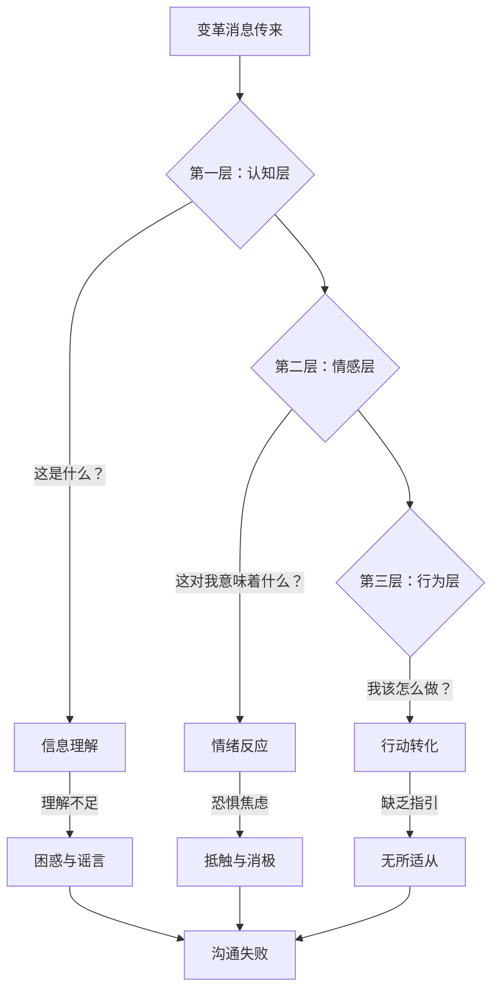
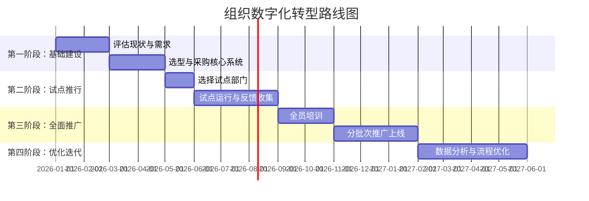
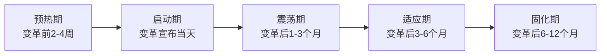

## 三、变革沟通策略

变革是组织生命周期中最脆弱的时刻——据 McKinsey 2023 年调研，约 70% 的组织变革项目未能达到预期目标，其中"沟通不充分"被列为首要失败原因的占比高达 52%。领导者的沟通能力，在变革时期不是加分项，而是决定成败的核心变量。

本节从变革沟通的心理底层出发，提供一套可落地的完整策略体系。

### 变革为什么难沟通：心理阻力的三层模型

理解变革沟通之前，必须先理解人在面对变革时的心理反应机制。John Kotter 在《领导变革》中指出，人们对变革的抵触并非源于"不理解"，而是源于"不认同"和"不信任"。

**第一层：认知阻力（"我不明白"）**——员工不理解变革的原因、内容和方式。信息模糊时，大脑倾向于用最坏的假设填补空白，这就是谣言产生的心理机制。

**第二层：情感阻力（"我害怕"）**——变革威胁到人们对确定性、胜任感和归属感的基本需求（William Bridges 转型三阶段理论：结束→迷茫→新生）。最常见的恐惧包括：失去岗位、失去地位、失去能力优势、失去人际关系网络。

**第三层：行为阻力（"我不会"）**——即便理解了、接受了，如果缺乏具体的行为指引和技能支持，人们依然无法行动。

有效的变革沟通必须同时穿透这三层：**让人明白、让人安心、让人行动**。

### 变革沟通的 STAR 模型

STAR 模型是一个贯穿变革全周期的沟通框架，覆盖从"为什么变"到"怎么变"再到"变了之后怎样"的完整叙事链条。

#### S — Situation（情境）：诚实描述现实

情境阶段的核心任务是**制造紧迫感**，让人们意识到"不变不行"。John Kotter 将这列为变革八步法的第一步，也是最关键的一步。

**具体做法：**

1. **用数据说话，而非观点**
   - 不要说"我们的业绩在下滑"，要说"过去 6 个季度，我们的市场份额从 23% 下降到 17%，同期竞争对手 A 的份额从 15% 增长到 22%"
   - 不要说"行业在变化"，要说"根据 Gartner 报告，到 2027 年，65% 的现有业务流程将被 AI 工具替代，而我们目前的自动化率仅为 8%"

2. **描绘"不变革的代价"**
   - 量化损失：如果不变革，预计未来 12 个月收入损失多少、客户流失率上升多少
   - 使用竞争对手案例：展示那些因拒绝变革而衰落的同行企业
   - 制造"窗口期"意识：强调"现在行动"和"半年后行动"之间的巨大差异

3. **不回避困难和风险**
   - 坦诚告知变革过程中可能遇到的挑战
   - 承认"这不会容易"比假装"一切都很简单"更能赢得信任
   - 研究表明（Schweiger & DeNisi, 1991），在不确定时期，即使传递坏消息的组织，其员工满意度和留任率也显著高于那些保持沉默的组织

**常见错误：** 用恐惧驱动而非用事实驱动。过度渲染危机可能导致员工陷入"习得性无助"——觉得无论怎么做都没用。正确的平衡是：**承认困难 + 表达信心 + 给出路径**。

#### T — Transition（过渡）：明确变革路径

过渡阶段的核心任务是**降低不确定感**。人们不是抗拒变革本身，而是抗拒被蒙在鼓里。

**具体做法：**

1. **分解变革步骤**
   - 将宏大的变革目标拆解为可理解的阶段性里程碑
   - 每个阶段有明确的时间节点、负责人和交付物
   - 使用路线图（Roadmap）可视化呈现

2. **明确每个人的角色**
   - 不同层级的员工需要不同的信息粒度
   - 高管需要知道战略方向和投资回报
   - 中层需要知道部门目标和资源分配
   - 基层需要知道自己具体要做什么、怎么做、什么时候做
   - **关键原则：** 每个人都应该能回答"这件事对我下周的工作有什么影响？"

3. **设定合理预期**
   - 明确告知变革初期可能出现效率下降（"学习曲线"效应）
   - 预先说明"试错期"的正常范围
   - 避免过度承诺——说了"三个月见效"就必须三个月见效，否则会摧毁信任

#### A — Advantage（优势）：描绘变革后的图景

优势阶段的核心任务是**激发动力**。人们需要一个值得为之付出努力的愿景。

**具体做法：**

1. **连接个人利益与组织利益**
   - 不要只说"公司会更好"，要具体到"你的工作会怎样变好"
   - 举例："引入新系统后，你每周花在数据整理上的 8 小时将缩减到 1 小时，腾出的时间可以投入到更有创造性的分析工作中"
   - 举例："组织架构调整后，每个产品团队将拥有独立的决策权，不再需要等三个月的审批流程"

2. **使用具象化的场景叙事**
   - 不要说"效率会提升"，要描绘一个具体的早晨："想象一下，2027 年的某个周一早晨，你打开电脑，系统已经自动为你生成了上周的数据报告，你只需要花 10 分钟审阅，然后把精力放在真正的决策上"
   - 使用"变革前 vs 变革后"对比表，让人直观看到差异

| 维度 | 变革前 | 变革后 |
|------|--------|--------|
| 日报制作 | 手工收集 5 个系统数据，耗时 2 小时 | 系统自动汇总，10 分钟审阅 |
| 审批流程 | 平均 7 个工作日，经过 4 层审批 | 关键决策 24 小时内完成 |
| 客户响应 | 48 小时内首次回复 | 2 小时内首次回复 |
| 跨部门协作 | 邮件往返，信息不同步 | 统一平台，实时同步 |
| 技能成长 | 零散的自学 | 体系化的学习路径 + 内部导师 |

3. **找到并展示"早期胜利"（Quick Wins）**
   - Kotter 强调，变革初期必须创造可见的、可庆祝的小胜利
   - 这些小胜利的功能是：证明方向正确、奖励参与者、打消观望者的疑虑
   - 选择标准：容易实现、可见度高、与变革愿景直接相关

#### R — Resistance（阻力）：主动回应担忧

阻力管理是变革沟通中最容易被忽视、也最容易出问题的环节。大多数领导者倾向于回避阻力，但回避只会让阻力转入地下，变得更难处理。

**阻力的六种来源及应对策略：**

| 阻力类型 | 核心担忧 | 典型表现 | 应对策略 |
|----------|----------|----------|----------|
| **利益损失型** | "我会失去什么？" | 公开反对、联合抵制 | 提供补偿方案、重新定义利益 |
| **能力不足型** | "我做不来" | 拖延、找借口 | 提供培训、辅导和足够练习时间 |
| **信任缺失型** | "上次也是这样说的" | 冷漠、阳奉阴违 | 用行动证明、兑现小承诺积累信任 |
| **信息不足型** | "我不了解情况" | 焦虑、传播谣言 | 增加沟通频次、提供完整信息 |
| **习惯惯性型** | "为什么要改？现在挺好" | 消极应付、走老路 | 展示数据对比、提供过渡期支持 |
| **价值观冲突型** | "这违背了我的原则" | 离职、公开批评 | 深度对话、寻找共识、尊重选择 |

**关键做法：**

1. **创建安全的表达空间**
   - 设立匿名反馈渠道（匿名问卷、意见箱、第三方平台）
   - 定期举办"畅所欲言会"（Town Hall），高管直接回答问题
   - **重要规则：** 不惩罚提出异议的人，不对表达担忧的人贴标签

2. **区分"需要解决的问题"和"需要接纳的情绪"**
   - 如果员工的担忧指向真实的制度缺陷——修改制度
   - 如果员工的担忧源于对未知的恐惧——提供陪伴和倾听
   - 切忌对情绪说"你不要这么想"，情绪不需要被纠正，需要被看见

3. **利用"影响力节点"**
   - 每个组织都有非正式的意见领袖，他们的影响力有时超过正式领导
   - 识别这些关键人物，将他们纳入变革联盟
   - 当他们从"抵触者"转变为"支持者"，会带动大量跟随者

### 变革沟通的五阶段时间线

变革沟通不是一次性事件，而是一个持续的过程。以下是按时间线划分的五个关键阶段：

#### 阶段一：预热期（变革前 2-4 周）

**目标：** 制造心理准备，避免"突然袭击"

- 通过一对一对话，先与关键利益相关者沟通（中层管理者、意见领袖、核心技术骨干）
- 逐步释放信号，让组织对变革有心理预期
- 收集当前痛点和期望，为变革方案提供输入
- **反面案例：** 某互联网公司在周一全员邮件中突然宣布裁员 30%，没有任何预兆，导致剩下 70% 的员工陷入恐慌和不信任，两个月内主动离职率飙升至 25%

#### 阶段二：启动期（变革宣布当天）

**目标：** 清晰、一致、有感染力地传递变革信息

- **信息一致性原则：** 所有渠道（全员会议、邮件、内部通讯、部门会议）传递的核心信息必须完全一致。如果 CEO 说"不会裁员"，而 VP 在部门会上说"会优化人员结构"，信任会瞬间崩塌
- **分层沟通：** 先高层统一对齐 → 再中层管理培训（让他们学会怎么跟团队沟通）→ 最后全员宣布
- **准备 FAQ 文档：** 提前预见员工最关心的 20 个问题，准备好统一的回答
- **CEO/变革负责人亲自出面：** 变革信息不能只靠邮件或公告，必须由最高负责人亲自传达，这本身就是一种信号——"这件事很重要，我亲自负责"

#### 阶段三：震荡期（变革后 1-3 个月）

**目标：** 管理情绪低谷，维持变革动力

这是最危险的阶段。新鲜感消退、困难开始显现、抱怨增多。William Bridges 称之为"中间地带"（Neutral Zone）——旧的已经打破，新的尚未建立。

**沟通重点：**
- 提高沟通频次：从月度更新改为每周甚至每日更新
- 持续展示进展：用数据说话——"本周新系统处理了 1,200 笔订单，比上周增长 40%"
- 正面故事传播：收集并分享一线员工的成功故事
- 坦诚面对问题：遇到困难不回避，"本周我们遇到了 X 问题，原因是 Y，正在用 Z 方案解决"

#### 阶段四：适应期（变革后 3-6 个月）

**目标：** 巩固新行为，解决深层问题

- 培训效果追踪和补强
- 收集"变革中最痛苦的环节"，针对性优化
- 将变革成果与绩效体系挂钩，形成制度保障
- 识别并表彰"变革先锋"——那些率先拥抱变革并取得成果的人

#### 阶段五：固化期（变革后 6-12 个月）

**目标：** 将变革内化为"新的常态"

- 变革成果数据回顾：对比变革前后的关键指标
- 经验教训文档化：记录什么有效、什么失败
- 将变革中建立的好流程写入标准操作手册
- **警惕"回弹"：** 研究表明，约 50% 的变革成果会在 2 年内回弹到旧状态（Beer & Nohria, 2000），持续的沟通和制度保障是防止回弹的关键

### 变革沟通的五大原则

#### 原则一：过度沟通（Over-Communicate）

**核心规则：** 你认为已经足够多的沟通量，通常只有实际需要的 10%。

John Kotter 在研究大量变革案例后发现，变革领导者几乎总是低估沟通的必要次数。他的建议是"用 10 倍的量来沟通"。

**具体标准：**
- 变革宣布后第一周：每天至少一次全员更新
- 震荡期：每周 2-3 次正式沟通 + 持续的非正式交流
- 适应期：每周 1 次进展更新
- 固化期：每月 1 次成果回顾

**渠道组合：** 不要只依赖一种渠道。有效的变革沟通至少使用 5 种以上渠道——全员会议、部门会议、一对一对话、内部邮件/公告、内部社交平台（飞书/钉钉/企业微信）、视觉海报/看板。

#### 原则二：双向沟通（Two-Way Communication）

宣布变革不是沟通，说服别人接受变革也不是真正的沟通。真正的沟通是**双向的信息流动**。

**具体做法：**
- 每次全员会议留出至少 40% 的时间用于问答
- 设立"变革大使"制度：每个部门选 1-2 名员工代表，定期收集反馈上报
- 使用"向上反馈"工具：匿名的月度脉搏调查（Pulse Survey），3-5 个问题快速了解员工情绪
- **反面案例：** 某制造企业推行精益生产，管理层每周开会宣布进展，却从未收集过一线工人的反馈。6 个月后发现，一线工人早已发明了自己的"变通方案"绕开新流程，因为新流程在实际操作中有三个致命缺陷——如果管理层问了，第一周就能发现

#### 原则三：一致性（Consistency）

信息不一致是变革信任的最大杀手。

**具体做法：**
- 建立"核心信息卡"（Key Message Card）：一页纸文档，包含变革的 3-5 个核心信息点和标准表述，发给所有管理层
- 每次管理层会议后，统一对齐口径再向下传达
- 如果情况发生变化需要调整说法，**主动说明**："我们之前说的是 X，现在情况变了，更新为 Y，原因是 Z"

#### 原则四：及时性（Timeliness）

不要让谣言跑在真相前面。信息真空会被恐惧和猜测填补。

**具体做法：**
- 确立"24 小时原则"：重大变革消息，必须在 24 小时内正式传达给所有相关人员
- 如果还没准备好完整方案，先传达"我们在做什么 + 什么时候会有更多信息"
- 对社交媒体和内部论坛上的猜测，及时回应——不回应等于默认

#### 原则五：透明度（Transparency）

**核心规则：** 不知道的就说不知道，承诺了解后会回复——然后真的回复。

人们对领导者的信任不是来自"领导者什么都知道"，而是来自"领导者说真话"。

**具体做法：**
- 如果某个问题还没有答案，直接说"这个问题我们还没有决定，预计在 X 日期前给大家更新"，并确保到日期时真的更新
- 如果犯了错误，直接承认："之前的 X 决策确实考虑不周，我们现在做了调整"
- 分享决策过程："我们考虑了 A、B、C 三个方案，A 方案因为 XX 原因被排除，B 方案因为 YY 原因被排除，最终选择 C 方案"

### 不同变革场景的沟通策略

不同类型的变革需要差异化的沟通策略。以下是四种常见变革场景的具体应对：

#### 场景一：组织架构调整

**核心挑战：** 涉及权力和利益重新分配，阻力最大

| 阶段 | 关键动作 | 沟通重点 |
|------|----------|----------|
| 决策前 | 秘密筹备，仅核心团队知晓 | — |
| 宣布时 | 一把手亲自宣布，全员同步 | 为什么调、调什么、对每个人的影响 |
| 一周内 | 各部门一对一沟通 | 你的新角色/职责/汇报关系 |
| 一个月内 | 新团队破冰 + 目标对齐 | 新团队的共同愿景和协作规则 |

**关键提醒：** 被调整的管理者最容易成为阻力来源。必须单独、提前沟通，给他们尊重和选择（转岗、新角色、体面退出）。

#### 场景二：裁员/人员优化

**核心挑战：** 信任危机，留任者比被裁者更需要关注

**沟通顺序（至关重要）：**
1. 先通知被裁员工——一对一、面谈、提供支持
2. 再通知留任员工——坦诚原因、明确未来、回答焦虑
3. 最后对外沟通——统一口径、保护品牌

**留任者沟通的关键信息：**
- "你留下来是因为你的价值，不是因为运气"
- "接下来的工作量会调整，不会让你一个人干三个人的活"
- "公司对你的承诺没有变，以下是我们接下来的发展计划"

#### 场景三：技术系统切换

**核心挑战：** 能力阻力为主，需要大量培训支持

**沟通重点：**
- 强调"为什么这个系统比旧系统好"——用具体的功能对比
- 提供充足的培训时间和资源——不是"周五下午培训 2 小时"就够了
- 设立"超级用户"（Super User）——每个部门培训 2-3 名精通新系统的专家，作为同事的第一求助对象
- 建立"学习积分"激励——完成培训模块可获得积分，兑换小奖品

#### 场景四：文化变革

**核心挑战：** 最慢、最难、需要最长时间

文化变革不是宣布出来的，是日复一日的行为示范出来的。

**沟通策略：**
- **少说多做：** 领导者自己先践行新的文化行为，比任何口号都有效
- **故事传播：** 收集并传播体现新文化的真实故事——"上周，张工在发现产品缺陷后主动暂停了上线流程，这就是我们说的'质量优先'"
- **制度配合：** 将文化价值观写入绩效考核、晋升标准和招聘标准
- **耐心：** 文化变革通常需要 2-3 年才能看到实质变化，领导者必须做好长期战的准备

### 变革沟通的常见误区与纠正

#### 误区一："宣布了就等于沟通了"

❌ 错误：发一封全员邮件或开一次全员会，认为大家都知道了
✅ 正确：反复沟通、多渠道沟通、确认理解——"我说了"不等于"他们听到了"，"他们听到了"不等于"他们理解了"，"他们理解了"不等于"他们认同了"

#### 误区二："好消息要快说，坏消息要拖着"

❌ 错误：公司业绩好的时候大张旗鼓宣传，裁员的消息一拖再拖
✅ 正确：坏消息更要尽快说。拖延只会让员工从正式渠道之外获知信息——这种情况下，你不仅传递了坏消息，还传递了"我不信任你们"的信号

#### 误区三："沟通是 HR 的事"

❌ 错误：把变革沟通的责任完全交给 HR 或公关部门
✅ 正确：变革沟通的一号责任人是业务领导者自己。HR 可以提供工具和支持，但员工最想听到的是自己的直属领导怎么说、怎么做

#### 误区四："把所有人当成同一类受众"

❌ 错误：对高管、中层、基层用同一套话术
✅ 正确：根据受众的关注点定制信息。技术团队关心"新系统的技术架构"，销售团队关心"对客户体验的影响"，财务团队关心"成本和 ROI"

#### 误区五："一次沟通就够了"

❌ 错误：开一次全员大会后就进入沉默期
✅ 正确：变革沟通是一个持续数月甚至数年的过程。每次沟通只解决当阶段的核心问题，然后进入下一轮

#### 误区六："只关注理性层面"

❌ 错误：全程用数据、图表、逻辑来沟通
✅ 正确：人是情感动物。在理性信息的基础上，加入情感共鸣——讲真实的故事、承认困难和焦虑、展示对员工的关心。Simon Sinek 的"黄金圈法则"（Why → How → What）在变革沟通中尤其适用——先讲"为什么"激发共鸣，再讲"怎么做"和"做什么"

### 变革沟通工具箱

#### 工具一：变革沟通计划模板

| 要素 | 填写内容 |
|------|----------|
| 变革概述 | 用一句话描述变革内容 |
| 变革原因 | 为什么必须变？不变会怎样？ |
| 变革目标 | 变革后的理想状态是什么？ |
| 影响范围 | 影响哪些部门/人群？ |
| 核心信息 | 3-5 个必须反复传达的关键信息 |
| 受众分组 | 按影响程度和关注点分为几组？ |
| 沟通渠道 | 每组用哪些渠道？ |
| 沟通节奏 | 每个阶段的沟通频率 |
| 关键人物 | 谁负责传达？谁是变革大使？ |
| 反馈机制 | 怎么收集和处理反馈？ |
| 风险预案 | 可能出现的负面反应及应对 |

#### 工具二：变革 FAQ 文档框架

提前预见员工最关心的问题，准备统一回答。典型的变革 FAQ 包括：

1. **发生了什么？** ——清晰描述变革内容
2. **为什么现在做？** ——解释时机和紧迫性
3. **对我有什么影响？** ——按角色分层回答
4. **会不会裁员/降薪？** ——如果会，坦诚说明并提供支持；如果不会，明确承诺
5. **我需要做什么？** ——具体的行为指引和时间表
6. **培训支持有哪些？** ——详细的培训计划和资源
7. **如果我不同意怎么办？** ——反馈渠道和流程
8. **时间线是什么？** ——关键里程碑和检查点
9. **如何衡量成功？** ——变革成功的标准
10. **谁负责回答我的问题？** ——指定的联系人和反馈渠道

#### 工具三：一对一对话指南（给中层管理者）

中层管理者是变革沟通的"腰部力量"——向上承接战略，向下传递执行。

**对话结构（15-20 分钟）：**

| 环节 | 时间 | 内容 |
|------|------|------|
| 开场 | 2 分钟 | 说明对话目的，创造安全感 |
| 倾听 | 5 分钟 | "你对这次变革有什么想法和感受？"——先听，不说 |
| 回应 | 5 分钟 | 针对具体担忧回答，诚实不敷衍 |
| 澄清 | 3 分钟 | 确认对方理解了什么，纠正误解 |
| 行动 | 3 分钟 | 明确下一步的具体行动和支持 |
| 收尾 | 2 分钟 | 约定下次跟进时间，保持开放 |

**关键技巧：**
- 用"你觉得……"开头，而不是"你应该……"
- 不要急于"说服"，先"理解"
- 如果遇到自己无法回答的问题，承诺"我去了解一下，明天回复你"——然后真的明天回复

### 实战案例

#### 案例一：微软的文化变革（Satya Nadella 时代）

**背景：** 2014 年，Steve Ballmer 时代的微软以内部竞争文化著称——员工之间的排名末位淘汰制度（Stack Ranking）导致部门间互相拆台，创新停滞，公司市值在十年间几乎原地踏步。

**变革策略：**
- **情境（S）：** Nadella 在首次全员信中直言——"我们的行业不尊重传统，只尊重创新"。用数据展示：移动互联网时代，微软几乎缺席。
- **过渡（T）：** 取消 Stack Ranking，引入"成长型思维"（Growth Mindset）评估体系。从"你比我强我就输了"变成"我们一起学就能赢"。
- **优势（A）：** 描绘"One Microsoft"愿景——打破部门墙，让所有产品为同一个云平台协同。
- **阻力（R）：** 承认"这不是一夜之间能改变的"。Nadella 亲自写邮件分享自己在微软的成长经历，建立情感共鸣。

**结果：** 微软市值从 2014 年的约 3,000 亿美元增长到 2024 年的超过 3 万亿美元，成为全球最有价值的公司之一。员工满意度从行业下游跃升至前列。

#### 案例二：某中型制造企业的数字化转型

**背景：** 一家 500 人的传统制造企业决定推行 ERP 系统，替代已使用 15 年的手工记账 + Excel 模式。

**挑战：** 一线车间主管平均年龄 48 岁，多数人不会使用智能手机以外的数字工具。

**沟通策略：**
- **预热期：** 先派技术团队到车间蹲点两周，了解真实工作流程和痛点。在此基础上制作了"系统能帮你解决的 10 个最烦人的问题"宣传材料
- **启动期：** 车间主管以上人员每人获得一台平板电脑，系统预装好，登录即可使用。不是"先培训再用"，而是"先摸一摸再培训"
- **震荡期：** 每个车间指定一名 30 岁以下的"数字辅导员"，手把手教老师傅使用。不设考核截止期，但设"进步之星"周奖
- **适应期：** 将系统使用率纳入绩效，但权重仅 10%，避免"逼迫感"

**结果：** 6 个月后系统使用率达到 92%。最关键的数据——月末对账时间从 5 天缩短到 0.5 天。

#### 案例三：反面案例——某科技公司的"静默裁员"

**背景：** 某独角兽公司在一个月内通过"绩效优化"名义裁掉了 40% 的员工，但全程没有任何正式沟通——没有全员信，没有 CEO 讲话，只有被裁员工收到一封冷冰冰的系统通知。

**后果：**
- 留任员工通过脉脉、微信群获知消息，恐慌蔓延
- 一个月内主动离职率 22%，包含多名核心技术骨干
- 招聘平台评分从 4.2 降至 2.8，半年内校招投递量下降 65%
- 客户因团队动荡对交付能力产生疑虑，丢失了两个大客户

**教训：** 沉默不是保护，是最大的伤害。越是艰难的变革，越需要坦诚的沟通。

### 进阶：变革沟通的深层原理

#### 原理一：叙事传输理论（Narrative Transportation Theory）

心理学研究（Green & Brock, 2000）表明，当人被一个故事"传输"进去时，其态度改变的程度远大于接受纯逻辑论证时。这就是为什么在变革沟通中，**一个真实的故事胜过一百页数据报告**。

**应用方法：**
- 收集变革中的真实故事——"使用新系统后，客服小李第一次在 2 小时内解决了一个过去需要 3 天的客户投诉，客户专门发了感谢信"
- 让故事中的当事人亲自讲述——比领导转述更有感染力
- 持续更新故事集——每月收集 2-3 个新故事

#### 原理二：心理安全感（Psychological Safety）

Google 的 Project Aristotle 研究发现，高绩效团队的第一要素是心理安全感。在变革时期，心理安全感更加重要——如果员工觉得"说真话会被惩罚"，所有反馈渠道都是摆设。

**建立心理安全感的具体做法：**
- 领导者率先承认自己的不确定性："这个问题我也没有答案，让我们一起探索"
- 对提出异议的员工公开感谢，而不是私下批评
- 将"建设性冲突"写入团队规范——"我们鼓励不同意见，但要求对事不对人"

#### 原理三：社会认同理论（Social Proof）

当人们不确定该怎么做时，会观察其他人的行为来决定自己的行动。在变革中，**早期采用者的行为示范**比任何宣传都有说服力。

**应用方法：**
- 选择有影响力且态度积极的员工作为"变革先锋"
- 让他们在全员面前分享自己的使用体验和收获
- 可视化呈现变革的采纳率——"目前已有 67% 的同事完成了新系统培训"

### 本节核心要点

| 维度 | 核心要点 |
|------|----------|
| 心理模型 | 变革阻力三层：认知（不明白）→ 情感（害怕）→ 行为（不会），沟通必须穿透三层 |
| STAR 模型 | 情境（制造紧迫感）→ 过渡（降低不确定性）→ 优势（激发动力）→ 阻力（主动回应） |
| 五阶段时间线 | 预热期 → 启动期 → 震荡期 → 适应期 → 固化期 |
| 五大原则 | 过度沟通、双向沟通、一致性、及时性、透明度 |
| 关键能力 | 倾听先于说服、故事胜过数据、行动重于承诺、持续胜过一次 |

变革沟通的本质不是"管理信息"，而是"管理人心"。技术层面的策略和工具可以学习，但最根本的要素是领导者对人的真诚关切——真正相信员工有权知道影响他们生活的事情，真正关心变革过程中每一个人的感受和需求。这种真诚，无法伪装，也无法速成。
