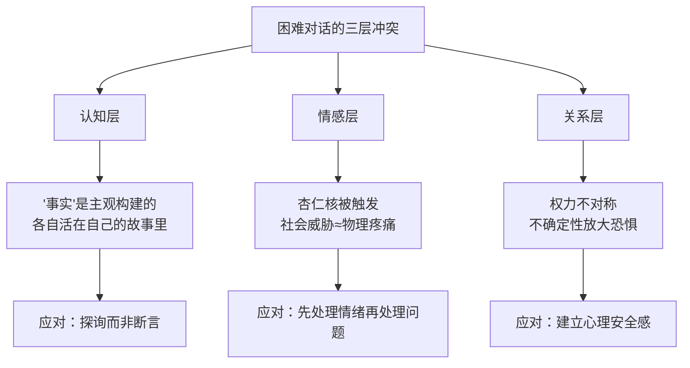
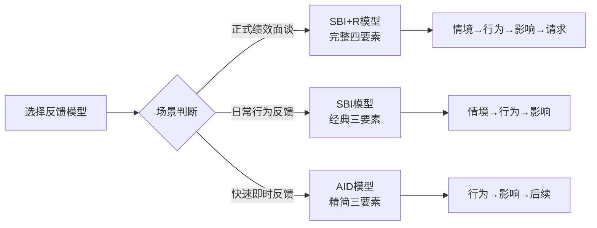

## 四、困难对话处理

领导者的真正考验，往往不在于激励士气的高光时刻，而在于那些你本能想回避的对话——告诉下属他被辞退了、指出绩效持续不达标、通知团队项目被砍、回应薪资不公的质疑。这些对话之所以困难，是因为它们同时触及权力关系、自我认同和人际信任的敏感地带。

哈佛谈判项目的研究表明，**70%的管理者承认会拖延或回避困难对话**，而每拖延一天，问题的解决成本就上升一层：小摩擦演变为系统性矛盾，个人不满扩散为团队信任危机。掌握困难对话处理能力，不是锦上添花的领导力加分项，而是领导者的核心生存技能。

### 4.1 困难对话的本质：为什么它们如此艰难

在学习具体技巧之前，理解困难对话的底层心理机制至关重要。困难对话之所以难，根源在于三个层面的冲突同时发生：

**认知层面——"事实"并不客观。** 每个人都活在自己构建的"故事"里。当你说"你的报告质量不达标"时，你脑中是与行业标准的对比；对方脑中却是"我已经连续加班三天了"的付出叙事。困难对话的本质不是纠正事实，而是协调两个截然不同的故事版本。

**情感层面——威胁感知被触发。** 人脑的杏仁核会在感知到社会威胁（被否定、被排斥、失去地位）时触发"战或逃"反应。神经科学研究表明，社会排斥激活的脑区与物理疼痛相同。这就是为什么绩效反馈会让人生理性不适——大脑把它当作了一次"攻击"。

**关系层面——权力不对称放大恐惧。** 上下级关系中，下属天然处于信息劣势。他不知道你的真实意图、公司的决策逻辑、自己在团队中的真实位置。这种不确定性会让任何负面信息被放大解读。

理解了这三个层面，你就会明白：困难对话的难度不在于"说什么"，而在于如何在高情绪压力下维持双方的认知开放性和关系安全感。



### 4.2 困难对话的全景分类

领导者面临的困难对话远不止裁员和绩效谈话。以下是一个实用分类框架，帮助你识别不同类型对话的核心挑战：

| 对话类型 | 核心挑战 | 典型场景 | 情绪强度 | 准备时间 |
|---------|---------|---------|---------|---------|
| 结果通知型 | 接受不可逆决定 | 裁员、解雇、项目终止、晋升落选 | ★★★★★ | 高 |
| 行为纠正型 | 改变既定行为模式 | 绩效不达标、违规操作、态度问题 | ★★★★ | 中高 |
| 关系修复型 | 重建破裂的信任 | 冲突调解、背叛感处理、信任重建 | ★★★★ | 高 |
| 期望重置型 | 调整不对称认知 | 薪资谈判、角色调整、预期管理 | ★★★ | 中 |
| 拒绝型 | 说"不"而不伤关系 | 拒绝加薪请求、拒绝请假、拒绝方案 | ★★★ | 中 |
| 敏感议题型 | 处理禁忌话题 | 个人卫生、偏见行为、心理健康 | ★★★★★ | 高 |

不同类型的对话需要不同的策略框架。本章将逐一深入讲解最常见、最具挑战性的几种。

### 4.3 结果通知型对话：裁员与解雇

这是领导者面临的最困难的沟通任务——你必须将一个不可逆的决定传达给对方，而这个决定可能深刻影响他的生活。处理不当不仅伤害被辞退者，也会摧毁团队对你的信任。

#### 4.3.1 道：为什么裁员沟通的质量决定组织命运

裁员沟通的质量直接影响三个关键指标：

- **被辞退者的再就业速度**。研究显示，获得尊重且清晰的离职沟通的员工，平均再就业时间缩短30%（LinkedIn 2023 workforce report）。
- **留任团队的生产力恢复期**。粗暴的裁员方式会导致留任员工出现"幸存者综合征"，生产力下降20%-40%，恢复期长达6个月。
- **雇主品牌声誉**。Glassdoor数据表明，裁员沟通体验差的公司，未来招聘成本平均上升15%。

裁员沟通不是"把这个消息告诉他"的简单信息传递，而是一个涉及法律合规、心理支持、团队管理、品牌维护的系统工程。

#### 4.3.2 法：裁员沟通的完整流程

**第一阶段：决策确认期（通知前1-2周）**

1. 确保决策经过完整的审批链路，不存在反转可能。最糟糕的裁员沟通就是"先通知了再撤回"——信任彻底崩塌。
2. 准备完整的法律文件包：解除劳动合同通知、补偿方案明细、竞业协议（如有）、离职交接清单。
3. 与HR确认所有法律合规事项：经济补偿计算、社保公积金截止日期、年假折算。
4. 准备员工援助资源：EAP（员工帮助计划）联系方式、再就业辅导资源、推荐信模板。
5. 通知被辞退者的直属上级（如果不是你本人），确保他对后续团队沟通有准备。

**第二阶段：对话执行（15-30分钟）**

裁员对话的核心原则是**BLUF（Bottom Line Up Front）**——先说结论，再解释原因。

推荐的对话框架：

> **第1步——直接进入（30秒内）。**
> 坐下后不要寒暄、不要铺垫。过度的寒暄会让对方预感到坏消息，反而增加焦虑。
>
> "小张，今天请你来是有一个重要的决定需要通知你。"
>
> **第2步——传达决定（1分钟内）。**
> 清晰、简洁、不回避。
>
> "公司经过慎重考虑，决定终止与你的劳动合同。这个决定与你的个人能力无关，是公司业务结构调整的结果。"
>
> **第3步——说明补偿方案（3-5分钟）。**
> 逐项说明，确保对方理解。
>
> "根据劳动法和公司政策，你将获得N+1的经济补偿，具体金额是……社保和公积金缴纳至本月末……未休年假将按日工资300%折算……"
>
> **第4步——提供支持资源（2分钟）。**
> "公司会为你提供EAP咨询服务的过渡期使用权限。如果你需要，我可以为你写一封推荐信。HR同事小李会全程协助你办理离职手续。"
>
> **第5步——给对方表达的空间。**
> 停下来。等待。不要急于填补沉默。对方可能需要时间消化，可能有疑问，可能有情绪。给他空间。
>
> **第6步——收尾。**
> "我理解这是一个艰难的时刻。如果后续有任何需要帮助的地方，可以随时联系我。"

**第三阶段：后续处理（通知后24-48小时）**

- 通知团队其他成员。拖延只会催生谣言。简洁说明："小张已经离开了公司，他的工作将由……接手。"
- 保护隐私。不要透露裁员的具体原因细节，只说"组织架构调整"。
- 回应团队的情绪反应——可能包括恐惧、愤怒、内疚。坦诚面对，不要假装什么都没发生。
- 24小时内完成离职交接，不要拖延。

#### 4.3.3 术：高频错误与纠正

| 常见错误 | 为什么有害 | 正确做法 |
|---------|----------|---------|
| 过度寒暄铺垫 | 让对方在猜测中煎熬，最后"恍然大悟"的冲击更大 | 30秒内进入正题 |
| 说"我也是被迫的" | 推卸责任，让对方感到连个有担当的人都没有 | 承认这是组织的决定，用"我们"而非"上面" |
| 过度道歉 | 反而让对方觉得自己"应该被同情"，伤害尊严 | 表达遗憾但保持尊重，不过度情绪化 |
| 争辩补偿方案的合理性 | 被辞退者此刻需要的不是辩论，是尊重 | 清晰说明方案，如有异议引导至HR流程 |
| 说"这对你也是好事" | 没有人在被辞退时需要被"开导" | 不要试图美化现实 |
| 当天让对方立刻离开 | 传递"我们不信任你"的信号，伤害尊严 | 给予合理的交接时间（通常1-3天） |
| 忽视留任团队的感受 | "幸存者综合征"会导致生产力断崖式下降 | 24小时内与团队坦诚沟通 |

#### 4.3.4 器：裁员沟通清单模板

```markdown
## 裁员沟通准备清单

### 决策层
- [ ] 决策已完成全部审批，无反转可能
- [ ] HR已确认法律合规（补偿计算、合同条款）
- [ ] 法务已审核相关文件
- [ ] 直属上级已知情并有准备

### 物料准备
- [ ] 解除劳动合同通知（已签字）
- [ ] 补偿方案明细表
- [ ] 离职交接清单
- [ ] 竞业协议（如适用）
- [ ] EAP服务使用说明
- [ ] 推荐信模板（如适用）

### 对话安排
- [ ] 时间：周初（周二/周三），避开节假日前一天
- [ ] 时长：预留30分钟，不应少于15分钟
- [ ] 地点：私密会议室，确保隔音
- [ ] 在场人员：直属上级 + HR代表（仅裁员，一对一解雇可仅直属上级）
- [ ] 对方日程：确认当天没有重要会议/截止日期

### 后续准备
- [ ] 团队沟通话术
- [ ] 工作交接方案
- [ ] 系统权限关闭时间表
- [ ] IT设备回收流程
```

### 4.4 行为纠正型对话：绩效改进沟通

绩效改进对话与裁员沟通不同——目标不是传达一个决定，而是促成改变。这需要截然不同的技能组合：你既要清晰地指出问题，又要保持对方的改变意愿。

#### 4.4.1 道：绩效反馈的心理学原理

绩效反馈之所以难以被接受，根本原因在于**自我服务偏差（Self-serving Bias）**——心理学研究表明，90%的人认为自己的表现高于平均水平。当你的反馈与对方的自我认知产生冲突时，大脑会自动启动防御机制：否认、合理化、外归因。

有效的绩效沟通必须绕过这些防御机制。绕过的方式不是"更强硬地指出问题"，而是**让对方自己看到问题**。

#### 4.4.2 法：三大反馈模型及其适用场景

**模型一：SBI（Situation-Behavior-Impact）反馈模型**

这是最经典的行为反馈工具，适用于描述具体的行为事件。

- **Situation（情境）**：明确描述事件发生的时间、地点、场景
- **Behavior（行为）**：客观描述你观察到的具体行为，不加评判
- **Impact（影响）**：说明这个行为对你、团队、业务产生的具体影响

示例：
> "在上周三的客户提案会议中（情境），你迟到了20分钟，而且没有准备我们讨论过的数据分析部分（行为），这让客户对我们的专业性产生了疑虑，我在会后花了额外两小时修复关系，客户的反馈评分从上季度的4.2降到了3.5（影响）。"

SBI模型的精髓在于：每个要素都必须具体。"你最近状态不好"不是SBI，"在10月15日的项目评审会上，你提交的方案缺少竞品分析章节，导致评审被推迟了一周"才是。

**模型二：SBI+R（Situation-Behavior-Impact + Request）扩展模型**

在SBI基础上增加Request（请求），明确告知你希望对方做什么改变。

完整示例：
> "在上周的客户提案会议中（S），你迟到了20分钟且没有准备数据分析（B），这让客户质疑我们的专业性，评分从4.2降到3.5（I）。我希望在下一次客户会议前，你至少提前一天完成数据部分的准备，并在会议开始前15分钟到场检查设备（R）。"

**模型三：AID（Actions-Impact-Do）精简模型**

适用于时间紧张、需要快速反馈的场景。

- **Actions（行为）**：你做了什么
- **Impact（影响）**：导致了什么结果
- **Do（后续）**：下一步你该怎么做

示例：
> "你上周连续三天在站会时没有更新Jira看板（A），导致其他同事无法判断任务状态，项目进度跟踪出现了混乱（I）。请从明天开始，每天站会前15分钟更新看板状态（D）。"



#### 4.4.3 术：绩效改进对话的完整流程

**第一步：建立安全氛围（2-3分钟）**

不要一上来就进入"问题模式"。先建立一个开放的对话环境：

- "小王，今天想和你聊聊最近的工作情况，也想听听你的想法。"
- 选择私密、安静的环境，确保不会被打断。
- 关闭电脑通知，手机静音。你的注意力就是你的尊重。

**第二步：双向信息收集（5-10分钟）**

在你给出反馈之前，先了解对方的视角：

- "最近工作感觉怎么样？有没有遇到什么困难？"
- "你对自己这段时间的表现怎么看？"
- 认真倾听，不要急于纠正。对方的自我评估可能会给你意想不到的信息。

**第三步：使用SBI+R模型给出反馈（5-10分钟）**

- 描述3-5个具体的行为事件，不要泛泛而谈。
- 每个事件都用SBI+R的结构。
- 区分"行为问题"和"能力问题"——前者需要态度调整，后者需要培训支持。

**第四步：倾听对方的解释和回应（5-10分钟）**

- 对方可能会解释、辩护、或提供你不知道的背景信息。
- 保持开放心态，真正听进去。
- 如果对方的解释有道理，承认并调整你的判断。

**第五步：共同制定改进计划（5-10分钟）**

改进计划必须满足SMART原则：

| 要素 | 含义 | 示例 |
|-----|------|-----|
| Specific | 具体的 | "每周提交一份周报"而非"提高沟通频率" |
| Measurable | 可衡量的 | "周报字数不少于500字，包含本周进展、下周计划、风险项" |
| Achievable | 可实现的 | 考虑对方当前工作量和能力水平 |
| Relevant | 相关的 | 与岗位职责和团队目标直接相关 |
| Time-bound | 有时限的 | "从下周一开始，持续一个月，月底复查" |

**第六步：明确后续跟进（2-3分钟）**

- 约定下次跟进的时间（通常2-4周）。
- 明确跟进的方式（1对1会议、书面汇报、日常工作观察）。
- 表达支持："这个计划不是为了给你压力，是为了帮你更好地发挥。如果有任何需要我支持的地方，随时找我。"

#### 4.4.4 进阶：区分"不会做"和"不愿做"

绩效问题的根因只有两种：**能力缺口**和**意愿缺口**。两者的应对策略截然不同：

| 维度 | 能力缺口（不会做） | 意愿缺口（不愿做） |
|------|------------------|------------------|
| 表现特征 | 努力但结果不佳，频繁求助 | 有能力但消极怠工，找借口 |
| 根本原因 | 技能不足、经验不够、资源欠缺 | 态度问题、动力不足、价值观冲突 |
| 应对策略 | 提供培训、辅导、工具支持 | 明确期望、调整激励、终极警告 |
| 领导者角色 | 教练（Coach） | 管理者（Manager） |
| 时间框架 | 给予充分的学习和成长时间 | 设定明确的改善期限（通常30-60天） |
| 失败后果 | 考虑调岗到更匹配的岗位 | 启动辞退流程 |

判断方法：给他足够的资源和指导后，观察2-4周。如果表现明显改善，是能力问题；如果改善后又回落，很可能是意愿问题。

### 4.5 关系修复型对话：冲突调解与信任重建

当团队成员之间、或你与下属之间的关系出现裂痕时，回避只会让伤口溃烂。关系修复对话是领导者必须掌握的高难度技能。

#### 4.5.1 道：信任的四个维度

根据Charles Green的信任等式：**信任 = (可信度 + 可靠性 + 亲近感) / 自我导向**。

- **可信度（Credibility）**：你说的话是否专业、准确、有根据
- **可靠性（Reliability）**：你是否言行一致、说到做到
- **亲近感（Intimacy）**：对方是否感到与你交流是安全的
- **自我导向（Self-orientation）**：你是否只关心自己的利益

信任破裂通常发生在某个维度上出了问题。修复对话必须针对具体的破裂点。

#### 4.5.2 法：冲突调解的四步框架

**步骤一：分别了解双方视角（单独面谈）**

在把双方拉到一起之前，先分别与每个人单独面谈。目的：
- 了解冲突的真正根源（表面原因往往不是真正原因）
- 评估双方的情绪状态
- 让每个人感到被倾听和理解

关键问题：
- "发生了什么？从你的角度看是怎样的？"
- "你觉得对方为什么会这样做？"
- "这件事对你最大的影响是什么？"
- "你觉得怎样才能解决这个问题？"

**步骤二：找到共同利益点**

冲突双方往往关注立场（"我想要A" vs "我想要B"），但立场背后通常有共同的利益（"我们都希望项目成功"、"我们都希望工作环境舒适"）。找到这个共同点是调解的基础。

**步骤三：引导三方对话**

把双方带到一起，由你担任引导者：
- 设定基本规则："每个人都有充分表达的机会，不打断、不攻击。"
- 让双方用"我"开头的陈述句表达感受，而非用"你"开头的指责句。
- 帮助双方看到对方视角中的合理部分。
- 引导双方共同提出解决方案，而不是你替他们决定。

**步骤四：达成协议并跟进**

- 将达成的共识写成书面记录。
- 明确双方各自需要采取的行动。
- 约定1-2周后跟进，确认改善情况。

#### 4.5.3 术：修复上下级之间的信任破裂

当信任破裂发生在你和下属之间时，处理方式有所不同。作为上级，你需要承担更多的修复责任。

**场景一：你承诺了但没做到。**

错误做法：轻描淡写或假装没发生过。
正确做法：主动承认，解释原因（不找借口），给出补偿方案。

> "上个月我答应帮你申请的培训名额，后来因为预算审批的问题没有推进。这是我的失误，我应该提前告知你而不是让你自己来问。我已经重新提交了申请，这次附上了部门总监的签字。如果还是不行，我会找到替代方案。"

**场景二：你在公开场合批评了下属。**

错误做法："别那么敏感，我说的是工作。"
正确做法：私下道歉，并在下次公开场合中修正。

> "上次周会上我说你方案'不够成熟'，这个说法不够准确，也没有考虑到你在两周内完成这些工作的投入。我想当面向你道歉。你的方案框架是对的，我建议的改进方向是……"

### 4.6 期望重置型对话：薪资谈判与角色调整

这类对话的核心挑战在于：双方对"公平"的认知存在结构性差异。管理者看到的是预算约束和团队平衡，员工看到的是自己的付出和市场行情。

#### 4.6.1 薪资谈判对话框架

**准备阶段：**
- 收集数据：同岗位市场薪资区间、公司内部薪资带宽、该员工的绩效历史。
- 明确底线：你最多能给到多少，超出部分需要什么审批流程。
- 准备替代方案：如果无法满足薪资要求，能否用其他方式补偿（弹性工作、培训机会、职级调整）。

**对话结构：**

1. **肯定价值**（真诚具体）："你这半年在XX项目上的表现确实突出，尤其是……"
2. **呈现数据**（客观透明）："我查了市场同岗位的薪资中位数在X-Y之间，你目前的薪资在……"
3. **说明限制**（诚实坦率）："基于公司的薪资体系和今年的预算，我能在Z的范围内做调整。"
4. **替代方案**（灵活创意）："如果薪资暂时无法一步到位，我想探讨其他方式来认可你的价值——比如……"
5. **长期承诺**（建立预期）："我会在下次调薪窗口为你争取更大的幅度，同时也希望你在XX方面继续保持/做出突破。"

**关键原则：**
- 不要贬低对方的价值来压低期望。
- 不要做出超出你权限的承诺。
- 如果确实无法满足，要诚实说"不"，而不是拖延。

#### 4.6.2 角色调整对话

当需要调整某人的职责范围（扩大、缩小、或横向调动）时：

- 明确说明调整的背景和原因（业务需要、个人发展、团队优化）。
- 强调调整后的机会而非损失。
- 给对方充分的适应时间。
- 提供必要的支持和资源。

### 4.7 敏感议题对话：当话题触及"禁区"

某些话题因为涉及个人隐私、文化敏感性或法律风险，许多领导者选择回避。但回避往往让问题恶化。

#### 4.7.1 个人卫生与职场行为问题

当需要与下属讨论个人卫生、体味、着装不当等问题时：

- **原则**：私下、尊重、具体、提供解决方案。
- **话术**："小李，我想和你私下聊一个可能有些尴尬的话题。最近有同事反馈在密闭空间工作时感到不适，我想可能是个人护理方面的。我理解这很私人，但如果需要的话，公司洗手间有相关的……"
- **禁忌**：在公开场合提及、使用嘲讽语气、让HR群发邮件提醒"所有人注意卫生"。

#### 4.7.2 心理健康话题

当怀疑下属可能有心理健康问题（抑郁、焦虑、成瘾）时：

- **不要诊断**。你不是心理医生，不要说"我觉得你可能有抑郁症"。
- **表达关心**。"我注意到你最近状态和以前不太一样，想确认一下你还好吗？"
- **提供资源**。"公司有EAP员工帮助计划，可以提供免费的咨询服务。我把联系方式发给你？"
- **保护隐私**。除非涉及安全风险（如自残倾向），否则不要告知其他同事。
- **调整预期**。如果对方确实有心理健康问题，短期内调整工作量和预期是合理的。

### 4.8 拒绝型对话：如何优雅地说"不"

领导者经常面临各种请求——加薪、请假、资源支持、方案采纳。学会拒绝而不伤害关系，是一项核心技能。

#### 4.8.1 拒绝的三要素公式

**肯定 + 理由 + 替代方案**

- **肯定**：真诚地认可对方的请求或努力
- **理由**：给出客观、具体的拒绝理由（不是"上面不同意"）
- **替代方案**：提供一个你可以做到的替代选项

示例（拒绝加薪请求）：
> "你提出的加薪申请我认真看了，你这半年的业绩确实不错（肯定）。但目前公司整体的薪资调整窗口已经关闭，Q4的预算已经锁定（理由）。我建议我们这样做：我先帮你把这个调薪需求列入明年的Q1优先名单，同时年底的绩效奖金我会为你争取最高档。你看这个方案可以吗（替代方案）？"

#### 4.8.2 高频拒绝场景话术

| 场景 | 肯定 | 理由 | 替代方案 |
|------|------|------|---------|
| 拒绝请假 | "我理解你想休假" | "但这周正好是项目上线窗口" | "下月初可以吗？我提前帮你排" |
| 拒绝方案 | "这个想法很有创意" | "但目前的资源无法支撑" | "我们可以先做一个简化版验证" |
| 拒绝晋升 | "你的能力有目共睹" | "这个岗位需要XX经验" | "我给你安排一个XX项目来积累" |
| 拒绝远程办公 | "你远程时的效率很高" | "但本周有客户现场会议" | "会议结束后可以继续远程" |

### 4.9 情绪管理：对话中的自我调控

困难对话不仅考验沟通技巧，更考验情绪管理能力。你作为领导者，在对话中必须保持冷静和专业，即使对方情绪激动。

#### 4.9.1 对话前的情绪准备

- **预演最坏场景**。在对话前花5分钟想象对方可能的最激烈反应（哭泣、愤怒、沉默），并想好你的应对方式。预演能显著降低实际发生时的情绪冲击。
- **调节生理状态**。深呼吸4-7-8法（吸气4秒、屏住7秒、呼气8秒）能有效降低心率和焦虑感。
- **设定意图**。在进入对话前明确："我的目标是解决问题，不是赢得争论。"

#### 4.9.2 对话中的情绪调控技术

**当对方情绪激动时：**
- 不要说"冷静一下"——这句话的收效约等于零。
- 使用"情感标注"技术：用语言描述对方的情绪。"我能看出这件事让你很沮丧。"神经科学研究表明，当情绪被语言化时，杏仁核的活跃度会降低。
- 保持沉默，给对方空间。不要急于填补沉默。
- 递一杯水。这个简单的动作能打断情绪升级的节奏。

**当你自己情绪上升时：**
- 感受到愤怒或挫败时，暂停3秒再回应。
- 如果需要时间思考，可以说"让我想一下怎么回答你这个问题"。
- 如果对话已经失控，提议暂停："我感觉我们都比较激动，不如我们明天再继续这个话题？"

#### 4.9.3 对方的五种情绪反应及应对策略

| 情绪反应 | 表现 | 错误应对 | 正确应对 |
|---------|------|---------|---------|
| 愤怒 | 提高音量、指责、拍桌子 | 以牙还牙或卑躬屈膝 | "我理解你很生气。我们可以慢慢说。" |
| 哭泣 | 流泪、无法继续说话 | 假装没看到或手忙脚乱 | 递纸巾，保持沉默，等他平复 |
| 沉默 | 不说话、回避眼神 | 不断追问或替他说话 | "我知道你需要时间消化。我在这里等你。" |
| 否认 | "这不是真的""你们搞错了" | 硬怼或反复强调事实 | "我理解这很难接受。我们可以看下具体的……" |
| 谈判 | "能不能再给我一次机会" | 直接拒绝或心软让步 | "我会记录你的请求。今天的主要信息是……" |

### 4.10 文化差异与远程环境下的困难对话

在全球化和远程办公的背景下，困难对话面临额外的复杂性。

#### 4.10.1 文化维度的影响

不同文化背景下，困难对话的"困难点"完全不同：

- **高语境文化（中国、日本、韩国）**：信息大量依赖潜台词和情境。"这个方案还可以再优化"可能意味着"这个方案不行"。在这种文化中，困难对话往往更含蓄，需要"读空气"的能力。
- **低语境文化（美国、德国、北欧）**：信息主要通过明确的语言传递。"This doesn't work"就是"This doesn't work"。直接反馈被视为专业和高效。

作为在中国环境中的领导者，你需要掌握的是一种**"温和而坚定"的平衡术**——用对方能接受的方式传递必须传递的信息，但不因为"面子"而模糊核心意思。

#### 4.10.2 远程/线上困难对话的特殊考量

远程环境下，你失去了大量的非语言线索（肢体语言、眼神、微表情），增加了误解的风险。

**核心建议：**
- 敏感对话尽量用视频而非语音，能看到对方的表情。
- 确保网络稳定，技术故障会让本就紧张的对话雪上加霜。
- 语速放慢，每说完一个要点停顿一下，给对方反应时间。
- 对话结束后用文字确认关键信息，避免理解偏差。
- 不要用文字消息（微信/Slack）做困难对话——文字缺乏语气，极易被误读。

### 4.11 困难对话的能力自检清单

完成一次困难对话后，用以下清单进行自我评估：

```markdown
## 困难对话复盘清单

### 准备阶段
- [ ] 我是否明确了这次对话的核心目标？
- [ ] 我是否收集了足够的事实依据？
- [ ] 我是否预演了对方可能的反应？
- [ ] 我是否选择了合适的时间和地点？

### 对话执行
- [ ] 我是否在30秒内进入正题？
- [ ] 我是否使用了具体的行为描述而非笼统评价？
- [ ] 我是否给了对方充分表达的空间？
- [ ] 我是否保持了冷静和专业？
- [ ] 我是否达成了明确的下一步行动？

### 后续跟进
- [ ] 我是否在24小时内做了必要的后续沟通？
- [ ] 我是否记录了关键信息和承诺？
- [ ] 我是否按约定时间跟进？

### 自我反思
- [ ] 哪个环节我做得好？为什么？
- [ ] 哪个环节我可以改进？具体怎么改进？
- [ ] 这次对话对关系的影响是正向还是负向？
```

### 4.12 从新手到高手：困难对话的进阶路径

掌握困难对话不是一蹴而就的事。以下是分阶段的成长路径：

**入门期（0-6个月）：** 能使用标准框架（SBI、BLUF）完成基本的困难对话，不回避、不搞砸。

**熟练期（6-18个月）：** 能根据具体场景灵活调整策略，准确识别对方的情绪状态并做出恰当回应。开始能处理涉及多方利益的复杂对话。

**精通期（18个月以上）：** 能在对话中创造"顿悟时刻"——让对方自己发现问题而非被告知。能处理高利害关系的对话（高管层变动、重大组织调整）。困难对话从"需要准备的任务"变成"自然流动的交流"。

每次困难对话都是一次练习机会。关键不是追求完美，而是每次复盘、每次改进。当你能把困难对话变成一段真诚的、有建设性的交流时，你就真正跨越了领导力的一道关键门槛。

