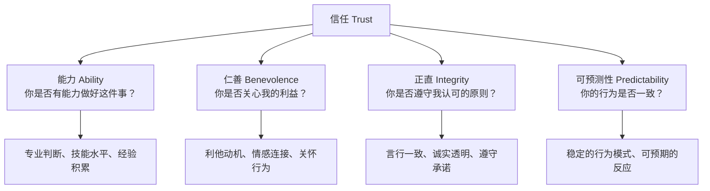
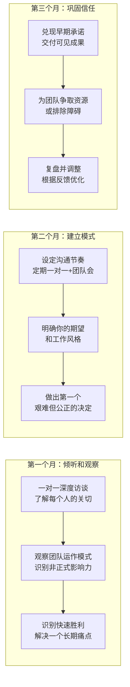

## 五、建立信任的沟通行为

领导力三维模型中，信任属于**关系维度（Who）**的核心支柱。愿景再宏大，如果团队不信任你，那只是空洞的口号；行动方案再完美，如果下属怀疑你的动机，执行中一定充满猜忌和内耗。正如帕特里克·兰西奥尼（Patrick Lencioni）在《团队协作的五大障碍》中所指出的：**缺乏信任是团队功能障碍的第一大障碍，也是所有其他问题的根源。**

本节将从理论根基出发，系统拆解信任的本质、构建机制、具体沟通行为、修复策略，以及在不同情境下的应用方法。

---

### 信任的本质：不只是"感觉好"

#### 什么是领导力语境中的信任？

信任不是一个模糊的"感觉好"，而是一个可以被定义、拆解和操作的概念。在组织行为学中，信任的经典定义来自梅耶等人（Mayer, Davis & Schoorman, 1995）的研究：

> **信任是指一方愿意接受来自另一方行为的脆弱性（vulnerability），基于对另一方将执行对信任者重要的特定行为的预期，而不考虑自己监控或控制该方的能力。**

这个定义包含三个关键要素：

| 要素 | 含义 | 领导力场景中的表现 |
|------|------|-------------------|
| 脆弱性接受 | 愿意在不确定中暴露自己 | 下属愿意向你汇报坏消息、承认错误、提出不同意见 |
| 积极预期 | 相信对方会做出对你有利的行为 | 团队相信你会在裁员时公平对待他们，不会背后捅刀 |
| 放弃控制 | 不依赖监控和惩罚来约束对方 | 你授权下属独立决策，不需要事事审批 |

**为什么这个定义很重要？** 因为它揭示了一个反直觉的真相：信任的本质不是"确定性"，而是"在不确定中愿意冒险"。如果你只在100%确定对方可靠时才"信任"，那不是信任，那是计算。真正的信任发生在信息不完全的情况下——你无法完全监控下属的每一个行为，但你选择相信他们会做正确的事。

#### 信任的四维模型

梅耶（Mayer）的信任模型指出，信任的建立取决于对方感知到的四个维度：

这四个维度在不同情境下权重不同：

- **技术团队**中，能力维度权重最高——"你连技术都不懂，我凭什么信你的判断？"
- **创业团队**中，仁善维度权重最高——"你是真心带我们一起成功，还是只顾自己？"
- **危机时刻**中，正直维度权重最高——"你说的是真话，还是在粉饰太平？"
- **跨文化团队**中，可预测性维度权重最高——"我搞不懂你的文化背景，至少你的行为应该是稳定的。"

#### 信任公式：一个实用的评估框架

大卫·梅斯特（David Maister）在《可信赖的顾问》中提出的信任公式，是理解信任最直观的工具：

信任 = （可信度 + 可靠性 + 亲近感）÷ 自我导向

| 要素 | 含义 | 评估问题 | 具体表现 |
|------|------|----------|----------|
| **可信度（Credibility）** | 专业能力和知识水平 | "你是否有足够的专业知识让我相信你的判断？" | 行业洞察、技术深度、战略思维、数据支撑 |
| **可靠性（Reliability）** | 言行一致、守信践诺 | "你说到的事是否真的做到了？" | 按时交付、承诺兑现、行为稳定、不轻易变卦 |
| **亲近感（Intimacy）** | 情感连接和心理安全 | "和你沟通是否有安全感？" | 愿意倾听、保守秘密、理解感受、不评判 |
| **自我导向（Self-Orientation）** | 利己动机的显露程度 | "你做事是为了团队还是为了自己？" | 争功诿过、只关心自己的KPI、忽视团队需求 |

这个公式的精妙之处在于分母——**自我导向**。即使你在可信度、可靠性和亲近感上得分很高，一旦团队感知到你主要在为自己考虑，信任就会被这个分母急剧放大而瓦解。一个自私的领导者，能力越强、越会说话，反而越危险，因为团队会更加警惕你的每一句话背后的动机。

**自检清单**：

每月花15分钟，用以下问题评估自己在团队中的信任状态：

- 可信度：最近一个月，我展示了哪些专业能力？我是否在自己不懂的领域坦诚承认？
- 可靠性：我有哪些承诺尚未兑现？有没有因为"太忙"而搁置了答应团队的事？
- 亲近感：最近一次和团队成员进行非工作目的的深度交流是什么时候？他们是否愿意向我分享困惑和担忧？
- 自我导向：最近一个决策，有多少成分是为了团队的利益，有多少是为了自己的面子或前途？

---

### 信任的生命周期：从建立到修复

信任不是一次性事件，而是一个动态的生命周期。理解这个周期，才能在每个阶段采取正确的沟通策略。

#### 阶段一：初始信任（Initial Trust）

初始信任发生在关系建立之初，基于第一印象和外部信号。这个阶段的信任是脆弱的，但可以通过以下沟通行为快速建立：

**关键沟通行为**：

1. **透明的自我介绍**：不只是介绍自己的职位和经历，更重要的是分享自己的价值观、工作风格和对团队的期望。例如："我先说说我自己——我这个人比较直接，喜欢有问题当面说，不喜欢背后议论。如果你觉得我哪句话说得不对，随时可以反驳我。"

2. **主动了解对方**：不是泛泛地问"你有什么想法"，而是带着好奇心去了解对方的工作挑战、职业目标和个人关切。一对一的前30分钟，80%的时间应该是你在倾听。

3. **快速兑现一个小承诺**：在关系初期，找一个对方关心的小问题，快速解决并交付。这比说100句"我会支持你"都有效。行为科学称之为"承诺-兑现循环"——第一个小承诺的兑现，会启动信任的正向飞轮。

#### 阶段二：知识型信任（Knowledge-Based Trust）

随着互动增多，信任从"初始印象"升级为"基于了解的信任"。这个阶段，你开始真正理解对方的能力、动机和行为模式，对方也在持续观察你。

**关键沟通行为**：

4. **持续的信息共享**：不囤积信息，主动分享对团队决策有影响的上下文。信息不对称是信任最大的敌人。当你做出一个看似突然的决定时，如果你之前的沟通已经让团队了解了背后的背景和数据，他们会倾向于"理解"而非"猜疑"。

5. **公开承认不确定性**："这个方向我不确定是对的，但我基于以下判断选择了它——"这种坦诚比假装全知全能更能建立信任。因为团队知道，一个愿意说"我不知道"的领导者，在他说"我知道"时，一定是真的知道。

#### 阶段三：认同型信任（Identification-Based Trust）

这是信任的最高形态——双方的价值观高度一致，以至于不需要频繁的沟通就能理解对方的意图。这种信任不能速成，但可以通过以下行为加速：

6. **在关键时刻为团队挡风**：当外部压力（上级施压、客户投诉、公司政治）传导到团队时，领导者的反应决定了信任的深度。如果你选择保护团队、自己承担压力，信任会指数级增长。反之，如果你把压力直接转嫁给团队，信任会瞬间崩塌。

7. **展现价值观的一致性**：不是在顺境中喊口号，而是在逆境中坚守原则。当公司要求你做一件你认为不对的事，你是否敢于拒绝？当牺牲团队利益可以换取个人晋升时，你如何选择？这些时刻是信任的"压测"——只有在压力下，真正的价值观才会显现。

#### 信任的破坏与修复

信任的破坏往往在一瞬间，而修复则需要漫长的过程。安德鲁·施维尔（Andrew Shervill）的研究表明，信任破坏有四种类型，每种需要不同的修复策略：

| 破坏类型 | 典型表现 | 修复难度 | 修复策略 |
|----------|----------|----------|----------|
| **能力失败** | 做出了错误判断或决策 | ★★☆ | 承认错误→分析原因→展示改进计划→快速行动 |
| **仁善缺失** | 行为被认为自私或不关心他人 | ★★★ | 真诚道歉→解释动机→通过行动证明利他意图 |
| **正直违背** | 说谎、违反承诺、双重标准 | ★★★★ | 完全坦诚→承担责任→接受惩罚→长期一致性行为 |
| **可预测性破坏** | 行为反复无常、前后矛盾 | ★★★ | 解释变化原因→提供稳定信号→建立新的行为模式 |

**信任修复的沟通模板**：

当你需要修复已破坏的信任时，可以使用以下框架：

1. 直接承认（不回避、不美化）：
   "我做了一件破坏了你对我信任的事，我想和你谈谈。"

2. 具体说明（不说空话）：
   "具体来说，我[做了什么/说了什么]，这违反了我之前[承诺的/一直坚持的]原则。"

3. 承担责任（不找借口）：
   "这是我的责任，没有借口。"

4. 解释但不辩解：
   "当时的情况是……但这不能成为我的理由。"

5. 明确的改进计划：
   "为了防止类似的事再次发生，我会[具体措施]。"

6. 请求监督：
   "如果你发现我又犯了类似的错误，请直接告诉我。"

7. 给对方空间：
   "我理解你需要时间来重新建立信任，我会用行动证明。"

---

### 十二种建立信任的核心沟通行为

以下是经过系统梳理的信任建立行为，每种行为都包含理论依据、具体做法和常见陷阱。

#### 1. 承认"我不知道"

**理论依据**：哈佛商学院艾米·卡迪（Amy Cuddy）的研究表明，领导者展现"温暖"（warmth）比展现"能力"（competence）更能建立信任。坦诚自己知识的局限，恰恰传达了温暖——"我和你一样，也是一个在不断学习的人。"

**具体做法**：

- 当被问到不确定的问题时，不要急着编造答案。直接说："这个问题我不确定答案，让我了解一下，[具体时间]前回复你。"
- 在团队会议中主动说："这个领域我不如你们专业，我希望听到你们的真实判断。"
- 区分"不知道"和"不想说"——如果因为保密原因不能透露，直接说明："这个信息我现在还不能分享，原因是……"

**常见陷阱**：

- ❌ 频繁在自己的核心专业领域说"不知道"——这会损害可信度
- ❌ 说"不知道"后不跟进——承诺了"了解后回复"就必须做到
- ❌ 把"不知道"当作逃避决策的借口

#### 2. 主动承认错误

**理论依据**：心理学中的"犯错误效应"（Pratfall Effect）表明，能力出众的人在犯错后反而更受喜爱，因为错误让他们显得更真实。更重要的是，领导者主动承认错误，为团队创造了一个"犯错是安全的"的心理环境。

**具体做法**：

- 错误发生后尽快承认，不要等到被发现："上次项目延期，主要原因是我对工作量的估算有误。我已经调整了估算方法，以后会留出30%的缓冲。"
- 区分"道歉"和"吸取教训"——前者说"对不起"，后者说"我从中学到了什么"。团队需要的不是你的愧疚，而是你的成长。
- 在全员面前承认重大错误，不要只在私下说——公开承认的信号强度远大于私下道歉。

**常见陷阱**：

- ❌ 承认错误后反复道歉，把焦点放在自己的感受而非团队的损失
- ❌ "背锅式认错"——替别人承担不属于自己的错误
- ❌ 只道歉不改变，形成"认错-再犯-再认错"的循环

#### 3. 兑现承诺：说到做到

**理论依据**：信任的核心是"可预测性"。亚里士多德在《尼各马可伦理学》中就指出："可靠（fidelity）是友谊和一切社会关系的基础。"现代研究反复证实，承诺兑现率是预测信任水平最稳定的指标。

**具体做法**：

- **谨慎承诺**：不要因为"不好意思拒绝"而随口答应。每一句"好的"都是一笔信任债务。
- **公开追踪**：在团队中建立承诺追踪机制——每次会议结束，明确"谁在什么时候之前完成什么"，并在下次会议开始时回顾。
- **做不到就提前说**：如果发现无法按时完成承诺，第一时间通知对方并说明原因、提出替代方案。"我原计划周五交付，但现在发现数据有质量问题，需要额外两天。我会先给你中间版本，最终版本下周二前交付。"

**承诺管理矩阵**：

| 承诺类型 | 示例 | 风险等级 | 管理策略 |
|----------|------|----------|----------|
| 硬性承诺 | "周五交付报告" | 高 | 确认资源后再承诺，承诺后不轻易更改 |
| 软性承诺 | "我尽量安排" | 中 | 明确说明这不是确定承诺，给出评估时间 |
| 意愿表达 | "我觉得可以试试" | 低 | 明确这只是初步想法，还需要更多评估 |
| 条件承诺 | "如果预算批准，我们就做" | 中 | 明确条件，跟踪条件是否满足 |

#### 4. 信息透明：不囤积，不隐瞒

**理论依据**：信息不对称是组织中信任最大的杀手。社会交换理论（Social Exchange Theory）指出，人际关系遵循互惠原则——你分享信息，对方倾向于回报以信任；你隐瞒信息，对方倾向于回报以猜忌。

**具体做法**：

- **主动分享上下文**：做决策时，不只宣布结果，还要解释"为什么"。"我们决定砍掉X功能，原因是数据表明只有3%的用户使用它，而维护它占用了20%的开发资源。"
- **坏消息优先**：好消息可以晚说，坏消息必须早说。拖延坏消息只会让信任雪崩式崩塌——"你早就知道了，为什么不告诉我们？"
- **设置信息透明的节奏**：每周的团队同步会、每月的业务复盘、每季度的战略回顾——让信息分享制度化而非随机化。

**信息透明的边界**：

不是所有信息都适合完全透明。以下情况需要谨慎处理：

| 信息类型 | 处理策略 | 沟通话术 |
|----------|----------|----------|
| 已确认的好消息 | 立即分享 | "我有一个好消息要分享……" |
| 已确认的坏消息 | 尽快分享+上下文 | "我需要告诉大家一个不太好的消息……原因是……" |
| 未确认的传闻 | 不传播，但承认存在 | "有一些关于X的传言，我可以确认的是……目前还不确定的是……" |
| 个人隐私信息 | 严格保密 | "这件事我不能透露细节，因为涉及个人隐私。" |
| 商业机密 | 根据级别选择性分享 | "这个信息的详细内容我不能公开，但对你工作的部分影响是……" |

#### 5. 保持一致：言行合一，前后一致

**理论依据**：心理学家发现，人类对"不一致"极其敏感。一个人说了A做了B，比"既没说A也没做B"更损害信任。这就是为什么"说一套做一套"是领导力的大忌——团队不只在听你说什么，更在看你做什么。

**具体做法**：

- **对不同的人说同样的话**：不要在技术团队说"质量第一"，在销售团队又说"速度优先"。如果确实存在矛盾的优先级，直接承认这种张力："我理解这两者之间存在矛盾，我的判断是……"
- **在公开场合和私下说一致的话**：不要在大会上说"我们没有裁员计划"，私下却在暗示团队要"做好准备"。
- **政策一致性**：规则对所有人一视同仁。如果允许A弹性工作，B也应该可以。差异化的标准必须有合理的、可解释的理由。

#### 6. 展现适当的脆弱

**理论依据**：布琳·布朗（Brené Brown）在《脆弱的力量》中的研究揭示了一个反直觉的发现：**展现脆弱不是软弱，而是勇气的体现，也是建立深度信任最有效的方式之一。** 当领导者展现脆弱时，团队成员会感到"他/她和我一样，也是人"，从而产生深层的连接。

**具体做法**：

- 分享你正在面对的挑战："说实话，我也不确定这个方向对不对。但我做了一些分析，愿意和你们分享我的思考过程。"
- 承认情绪："这件事确实让我很沮丧。但我不想因为情绪做出冲动的决定，所以我先冷静一下，明天我们再讨论。"
- 分享过去的失败和教训："十年前我刚做管理时，犯过一个严重的错误——我把一个很好的人逼走了，因为我太关注结果而忽视了他的感受。从那以后我学到了……"

**脆弱的边界**：

展现脆弱不等于毫无保留。以下是一些边界指南：

| 适合展现的脆弱 | 不适合展现的脆弱 |
|----------------|-----------------|
| 对结果的不确定 | 对团队成员的偏见或敌意 |
| 过去的失败和教训 | 严重的心理健康危机（应寻求专业帮助） |
| 正在学习和成长的领域 | 对公司或上级的强烈不满（可能制造恐慌） |
| 适度的紧张和压力 | 个人生活中的严重冲突 |

#### 7. 给予信任：主动授权

**理论依据**：信任是双向的——你需要先给予信任，才能获得信任。麦格雷戈（McGregor）的X理论和Y理论指出，假设员工本质上值得信赖（Y理论）的领导者，比假设员工需要被监控（X理论）的领导者，更能激发员工的主动性和忠诚度。

**具体做法**：

- **有意义的授权**：不是把没人想做的脏活丢出去，而是把有挑战、有成长空间、有影响力的任务交给团队。
- **降低监控频率**：从"每天检查"改为"每周同步"，从"每件事审批"改为"关键节点审核"。给对方自主空间。
- **接受不同的做法**：授权意味着对方可能用不同于你的方式来完成任务。只要结果达标，不要强求过程一致。

**授权等级表**：

| 等级 | 描述 | 适用场景 | 沟通方式 |
|------|------|----------|----------|
| L1 | 告知："我已经决定了" | 紧急事件、已确认决策 | "我做了X决定，原因是……" |
| L2 | 征询："我想听听你的看法" | 需要输入但决策权在你 | "我倾向于X，你觉得呢？" |
| L3 | 协商："我们一起决定" | 重要决策，对方有关键信息 | "这个问题你怎么看？我们一起做个判断。" |
| L4 | 授权："你来决定" | 成熟领域，对方能力足够 | "这个你来做主，我相信你的判断。" |
| L5 | 委托："你全权负责" | 高信任、高能力的下属 | "这块完全交给你，需要我支持时说一声。" |

#### 8. 深度倾听而非表面附和

**理论依据**：倾听是信任的"放大器"。卡尔·罗杰斯（Carl Rogers）的研究表明，当一个人感到被真正倾听时，他的防御心理会下降，开放程度会上升。但"真正的倾听"不是点头微笑，而是让对方感受到"你真的理解了我"。

**具体做法**：

- **反馈式倾听**："你刚才说的意思是……，我理解得对吗？"这不是在复读，而是在确认你的理解是否准确。
- **追问细节**："你提到'沟通有问题'，能具体说说是哪个环节、什么情况下出现的吗？"这传达了"我真的想理解"的信号。
- **放下手机和电脑**：在一对一沟通中，关掉屏幕，面对对方，保持眼神接触。你的注意力是你能给对方最稀缺的资源。

#### 9. 保护团队的名声

**理论依据**：在组织政治中，领导者如何在外人面前谈论自己的团队，会迅速传回团队耳中。这是信任的"隐性测试"——当你不在场时，你是否仍然在维护团队？

**具体做法**：

- 在上级面前，成绩归团队、问题归自己："这个成果是团队实现的，特别是……" / "这个问题主要是我在方向判断上有偏差。"
- 在跨部门冲突中，先保护团队、再私下纠正："在外部场合，我会先维护团队的立场；回到内部，我会和团队讨论需要改进的地方。"
- 拒绝"甩锅文化"：如果上级要求你找出"责任人"，尽量以"系统性改进"代替"个人追责"："与其说是谁的错，不如我们分析一下流程中哪里可以加一道检查。"

#### 10. 公平对待每一个人

**理论依据**：组织公正理论（Organizational Justice Theory）将公正分为三类——分配公正（结果是否公平）、程序公正（过程是否透明）、互动公正（对待是否尊重）。其中**程序公正**对信任的影响最大——即使结果不利，只要过程公平透明，人们也能接受。

**具体做法**：

- 决策过程透明化：为什么是他升职而不是她？用公开的、可解释的标准。
- 资源分配有据可依：绩效评估、晋升标准、奖金分配——每项制度都有明确的、一致的规则。
- 给予平等的发言机会：不要让会议室变成"老板和几个心腹"的对话。主动邀请安静的人发言："小王，这个话题你怎么看？我想听听你的角度。"

#### 11. 在压力下保持冷静

**理论依据**：情绪传染理论（Emotional Contagion Theory）指出，领导者的情绪会以5-7倍的放大效应传导给团队。当领导者在危机中惊慌失措时，整个团队会陷入恐慌。反之，领导者保持冷静，能为团队提供"情绪锚点"。

**具体做法**：

- 在高压时刻刻意放慢语速、降低音调。物理状态会影响心理状态。
- 把关注点从"问题有多大"转移到"下一步做什么"："情况确实很严峻。但现在最重要的是……我们先做……"
- 如果你确实感到焦虑，承认但不失控："我也有压力，但我对我们的团队有信心。现在让我来说说我们的计划。"

#### 12. 记住细节：小事不小

**理论依据**：西奥迪尼（Cialdini）的互惠原则指出，微小但个人化的关注，会产生不成比例的信任回报。记住一个人的名字、他孩子的名字、他上次提到的项目进展——这些"小事"传递了一个强烈的信号："你对我来说不是可有可无的。"

**具体做法**：

- 一对一前花2分钟回顾上次的对话要点。"上次你说孩子生病了，现在好了吗？"
- 记住团队成员的职业目标。当出现相关机会时，第一时间想到他们。
- 在生日、入职周年等关键日子发一条简短但真诚的消息。

---

### 不同情境下的信任沟通策略

#### 新任领导者：信任的"黄金90天"

当你刚刚加入一个新团队或新公司时，信任从零开始（甚至为负数——团队可能对前任领导者的离开感到不安，对你持观望态度）。迈克尔·沃特金斯（Michael Watkins）在《最初90天》中建议：

**新任领导者信任沟通的五个要点**：

1. **先问后答**：第一个月不要急于推行任何变革。先倾听、提问、理解。"在改变之前，先理解为什么事情是这样做的。"
2. **尊重历史**：不要上来就说"以前的做法都是错的"。每个现状都有其形成的原因。"我想了解这个流程是怎么形成的，它在哪些方面发挥了作用？"
3. **快速赢得一个"小胜利"**：找一个团队长期抱怨但一直没解决的小问题（比如一个繁琐的审批流程），快速搞定它。这会传递一个信号："这个人说到做到。"
4. **透明你的决策过程**：初期团队不了解你的判断逻辑，所以每个决策都要多花时间解释"为什么"。
5. **保护现有团队**：不要在上级面前批评你的新团队。你的第一个立场应该是"我是你们的人"。

#### 远程/混合团队：信任的"数字挑战"

远程环境下，信任面临的最大挑战是**缺少非正式互动**。在办公室里，信任在茶水间闲聊、午餐社交、走廊偶遇中自然积累。远程环境下，这些渠道消失了，信任只能通过刻意设计的沟通来建立。

**远程团队信任建设策略**：

| 策略 | 具体做法 | 频率 |
|------|----------|------|
| **虚拟咖啡时间** | 每周15分钟的非主题视频聊天，可以聊任何事 | 每周 |
| **过程透明** | 使用看板工具让所有人看到每个人的工作进度 | 持续 |
| **异步沟通规范** | 明确"消息不等于即时要求回复"，降低焦虑感 | 制度化 |
| **结果导向评估** | 以产出而非工时评估绩效 | 持续 |
| **定期线下团建** | 每季度至少一次面对面交流 | 每季度 |
| **视频优先** | 重要讨论开摄像头，增加非语言信息 | 每次会议 |

#### 跨文化团队：信任的"文化差异"

不同文化对信任的理解和建立方式存在根本性差异。爱德华·霍尔（Edward Hall）的高低语境文化理论在此尤其重要：

| 维度 | 低语境文化（美、德、北欧） | 高语境文化（中、日、韩） |
|------|--------------------------|------------------------|
| 信任基础 | 契约和规则 | 关系和人情 |
| 建立速度 | 快——通过专业表现 | 慢——通过长期相处 |
| 关键行为 | 履行合同条款、数据驱动决策 | 参加社交活动、给面子、照顾面子 |
| 破坏方式 | 违反明文规定 | 在公开场合让人难堪 |
| 修复方式 | 重新谈判合同、提供补偿 | 中间人调解、长时间的关系修复 |

**跨文化信任沟通的实操建议**：

1. 不要假设你的信任建立方式是"普世"的。在推行任何信任建设措施前，先了解团队成员的文化背景。
2. 混合使用多种信任建立方式——既通过专业能力赢得尊重（低语境），也通过关系建设赢得感情（高语境）。
3. 在跨文化团队中，**可预测性**是信任的最大公约数——无论什么文化背景，一致、稳定、可预期的行为都能建立信任。

---

### 信任测量：你如何知道信任是否存在？

信任是无形的，但可以通过以下指标来观察和测量：

#### 观察指标

| 高信任的信号 | 低信任的信号 |
|-------------|-------------|
| 团队在会议中坦诚表达不同意见 | 会议上一片沉默，私下里议论纷纷 |
| 坏消息被快速上报 | 坏消息被隐瞒或美化 |
| 下属主动寻求反馈和建议 | 下属回避你的反馈或只是表面接受 |
| 团队愿意尝试新事物、接受失败 | 团队只做"安全"的事、避免风险 |
| 人们在你面前表现出真实的自己 | 人们在你面前"表演"、戴着面具 |
| 下属愿意向你表达担忧和恐惧 | 下属只汇报好消息、隐藏问题 |
| 离职率低，推荐率高 | 核心成员持续流失 |

#### 结构化测量工具

**季度信任脉冲调查**（5题，匿名）：

1. "当我在工作中犯了错误，我可以坦诚地向领导汇报，不用担心受到不公正的惩罚。"（1-5分）
2. "我的领导会兑现他/她对我做出的承诺。"（1-5分）
3. "我的领导做决策时，会考虑团队成员的利益，而不仅仅是自己的KPI。"（1-5分）
4. "我有足够的信息来理解领导做出重要决策的原因。"（1-5分）
5. "即使在困难的情况下，我的领导也会支持我和团队。"（1-5分）

分数低于3.5分的维度需要立即关注和行动。

---

### 常见的信任误区

#### 误区一："信任是靠说的"

很多人以为信任可以通过沟通技巧来"制造"——说了正确的话、用了正确的语气，信任就会产生。这是错误的。**信任是靠行为累积的，不是靠语言营造的。** 你可以通过沟通来传达信息、展现态度，但如果你的行为和语言不一致，任何话术都只会加速信任的崩塌。

**纠正方法**：把注意力从"我该说什么"转移到"我该做什么"。每一个沟通承诺，都需要一个对应的行动来兑现。

#### 误区二："信任是一次性的"

有些领导者以为，一旦建立了信任，就可以"坐享其成"。事实上，信任更像银行账户——需要持续存款（正面行为），任何提款（负面行为）都需要有足够的余额来支撑。而且，信任的"利息"远低于"取款手续费"——建立信任需要很长时间，破坏信任只需要一个瞬间。

**纠正方法**：把信任建设视为持续的日常实践，而非一次性项目。

#### 误区三："信任意味着不检查"

"我信任你，所以不用检查"——这句话听起来很美，但实际上是管理的缺失。信任和控制不是二选一的关系，而是互补的关系。合理的检查机制（进度同步、质量审核）不是不信任的表现，而是负责任的管理。关键在于检查的方式——"我关心进展，有什么需要我帮忙的？" vs "你为什么还没做完？"

**纠正方法**：建立基于"支持"而非"监控"的检查机制。把"检查"重新定义为"我能为你做什么"。

#### 误区四："对所有人都用同样的方式建立信任"

信任是个人化的。不同的团队成员，由于性格、经历、文化背景的差异，对"什么行为能建立信任"有不同的期望。对一个内向的技术专家，频繁的社交活动可能让他不适；对一个外向的销售高手，偶尔的深度对话可能比每天的寒暄更有价值。

**纠正方法**：了解每个人的"信任语言"——他们最看重信任的哪个维度（能力、仁善、正直、可预测性），然后有针对性地调整你的行为。

#### 误区五："信任 = 好人缘"

有些人把"被所有人喜欢"等同于"被所有人信任"。但信任和喜欢是两回事。一个总是说好话、从不挑战团队的"好好先生"，可能很受欢迎，但未必被信任——因为团队知道，在关键时刻他可能不会做出艰难的决定。真正被信任的领导者，有时需要说"不"，需要传达坏消息，需要做出让部分人不满意的决策。**信任的本质是"可靠"，不是"讨好"。**

**纠正方法**：区分"被喜欢"和"被信任"。如果你发现自己总是选择最容易被人接受的选项，而非最正确的选项，你可能在追求人缘而非信任。

---

### 信任建设的30天行动计划

将信任建设从理念转化为日常习惯，需要一个结构化的行动计划。以下是经过验证的30天方案：

**第一周：自我评估与倾听**

| 天数 | 行动 | 预期效果 |
|------|------|----------|
| Day 1 | 用信任公式自评，诚实打分 | 建立基线认知 |
| Day 2-3 | 与3-5位团队成员进行一对一深度倾听 | 收集信任现状的真实反馈 |
| Day 4-5 | 分析反馈，识别信任的薄弱环节 | 确定优先改进方向 |
| Day 6-7 | 制定个人信任建设目标 | 明确行动方向 |

**第二周：承诺管理与信息透明**

| 天数 | 行动 | 预期效果 |
|------|------|----------|
| Day 8 | 盘点所有未兑现的承诺，制定完成计划 | 清理信任债务 |
| Day 9-10 | 兑现1-2个被拖延的承诺 | 展示行动力 |
| Day 11-12 | 启动每周信息同步机制（如周报或周会） | 建立信息透明的节奏 |
| Day 13-14 | 主动分享一个之前"不方便说"的上下文 | 展示信息分享的意愿 |

**第三周：授权与支持**

| 天数 | 行动 | 预期效果 |
|------|------|----------|
| Day 15-16 | 选择一个任务进行有意义的授权 | 展示对团队的信任 |
| Day 17-18 | 为团队排除一个长期存在的障碍 | 用行动证明"我在支持你" |
| Day 19-20 | 在外部场合维护团队的立场和贡献 | 展示保护者的角色 |
| Day 21 | 复盘授权过程，调整授权方式 | 建立持续改进的模式 |

**第四周：深化与固化**

| 天数 | 行动 | 预期效果 |
|------|------|----------|
| Day 22-23 | 在一次团队讨论中坦诚分享自己的一个不确定性 | 展现脆弱，拉近距离 |
| Day 24-25 | 在一个重要决策中公开解释"为什么" | 建立决策透明的习惯 |
| Day 26-27 | 记住并跟进团队成员的个人细节 | 展示个人化的关注 |
| Day 28-29 | 主动征求团队对你的反馈："我哪些行为让你感到不信任？" | 展示自我改进的意愿 |
| Day 30 | 进行30天复盘，对比前后变化 | 巩固成果，制定下一个30天计划 |

---

### 信任与领导力的深层关系

信任不只是领导力的"工具"，它还是领导力层级跃迁的关键驱动力。结合约翰·麦克斯韦尔（John Maxwell）的五层领导力模型：

| 领导力层级 | 驱动力 | 信任的角色 | 典型沟通 |
|-----------|--------|-----------|----------|
| **第一层：职位** | 权力和头衔 | 信任为零——人们服从你只因为你有权力 | "这是公司的规定，你必须执行。" |
| **第二层：许可** | 关系和情感 | 初始信任——人们允许你领导，因为喜欢你 | "我想听听你的想法……" |
| **第三层：生产** | 结果和成效 | 能力信任——人们信任你，因为你交付了成果 | "上次我们做到了，这次我也相信我们能行。" |
| **第四层：育人** | 发展和赋能 | 深度信任——人们信任你，因为你投资了他们的成长 | "这个机会我推荐你，我相信你能做好。" |
| **第五层：巅峰** | 传承和精神 | 身份认同——人们信任你，因为你代表了他们认同的价值 | "我们做的不只是一个项目，我们在改变行业。" |

**关键洞察**：从第一层到第二层的跃迁，完全依赖信任的建立。没有信任，你永远停留在"用权力换服从"的最低层级。而从第三层到第四层的跃迁，则需要信任从"你信任我做事"升级为"你信任我做决定"——这需要更深层的信任建设行为。

---

### 本节核心要点

1. **信任是领导力关系维度的基石**，不是可选的"软技能"，而是领导效能的核心决定因素。
2. **信任有四个维度**：能力、仁善、正直、可预测性。不同情境下各维度的权重不同。
3. **信任公式的关键是分母**——自我导向。自私的领导者，能力越强越危险。
4. **信任通过行为累积**，不是通过语言营造。每一次承诺兑现、每一次信息分享、每一次在压力下保护团队，都是信任的"存款"。
5. **信任破坏快、修复慢**。修复信任需要直接承认、承担责任、具体改进计划和长期一致的行为。
6. **信任是个人化的**——没有万能的信任建设策略。了解每个团队成员看重什么，然后有针对性地调整。
7. **信任的终极目标**不是被喜欢，而是被依赖——团队相信你会做正确的事，即使那件事不是最容易的。

***

