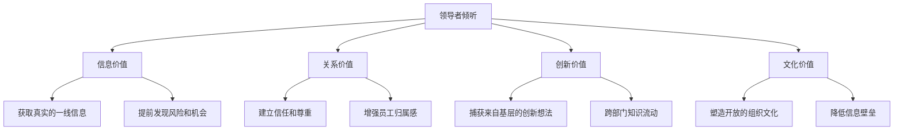
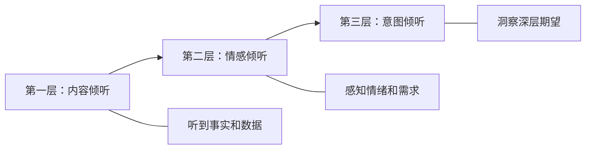
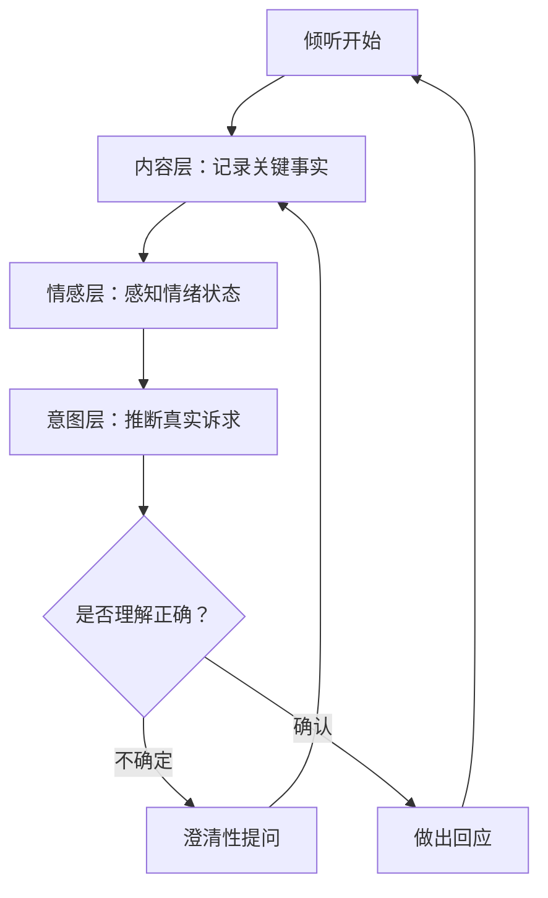
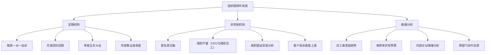

## 七、倾听作为领导力

> "领导者的首要任务是倾听——不是倾听自己想听的，而是倾听组织需要被听见的。" ——彼得·德鲁克

在领导力的众多技能中，倾听往往被低估。人们习惯于将领导力与"表达"画等号——有力的演讲、清晰的指令、鼓舞人心的愿景。然而，真正卓越的领导者都深刻理解一个悖论：**说得越多的人掌握的信息越少，听得越多的人掌控的局势越大**。

### 7.1 为什么领导者更需要倾听？

#### 7.1.1 信息过滤效应

组织天然存在信息过滤机制。当信息从基层向高层传递时，每经过一个管理层级，都会发生一次"美化加工"——坏消息被淡化，好消息被放大。这就是管理学中著名的**"Mushroom Management"效应**：员工被蒙在鼓里（kept in the dark），偶尔被浇一头粪（fed manure），等长出来了就被收割（canned when grown）。

层级过滤的具体表现：

| 信息层级 | 基层员工原话 | 经过一层过滤 | 经过两层过滤 | 到达CEO时 |
|---------|------------|------------|------------|----------|
| 产品缺陷 | "这个bug用户骂疯了" | "有一些用户反馈了体验问题" | "我们正在持续优化用户体

验" | "产品迭代进展顺利" |
| 团队士气 | "大家都要累死了想离职" | "团队目前压力较大" | "团队在高负荷运转中保持了战斗力" | "团队状态良好" |
| 竞争威胁 | "对手已经抄完我们了" | "竞品有一些动态值得关注" | "行业竞争格局在变化" | "我们保持领先优势" |

哈佛商学院的研究表明，在拥有三层以上管理层级的组织中，**CEO获得的负面信息在传递过程中被衰减了约80%**。这意味着如果领导者不主动倾听、不向下穿透信息壁垒，就会活在一个精心粉饰的"信息泡沫"中。

#### 7.1.2 权力的沉默效应

职位越高，周围人越倾向于迎合。这不是因为他们不诚实，而是因为人类的社交本能——**权力距离效应（Power Distance Effect）**。亚当·加林斯基（Adam Galinsky）在哥伦比亚大学的研究发现：当人处于权力位置时，大脑会自动减少对他人观点的关注度，同时增加对自己判断的信心。这形成了一个恶性循环——权力越大→越少倾听→信息越少→决策越差→权力受到质疑。

打破这个循环的唯一方式，就是有意识地、系统地建立倾听机制。

#### 7.1.3 倾听的战略价值

从战略角度看，倾听为领导者带来四重价值：

- **信息价值**：获得未经过滤的真实信息，做出更准确的判断
- **关系价值**：被倾听是人类最深层的需求之一，倾听直接建立信任
- **创新价值**：最好的创意往往来自一线，不倾听就听不到
- **文化价值**：领导者的倾听行为会被整个组织模仿，形成开放文化

### 7.2 领导者倾听的三层次模型

普通人的倾听是被动的——听到声音，理解意思。领导者的倾听是主动的、分层次的。每一层倾听都在获取不同深度的信息。

#### 7.2.1 第一层：内容倾听——理解"说了什么"

内容倾听是最基础的层次，关注的是对方传达的**事实、数据和逻辑**。

**核心能力**：
- 抓住关键信息点，区分事实与观点
- 识别对方论证的逻辑链
- 记录重要数据和细节

**领导者的常见陷阱**：
- 还没听完就开始准备反驳
- 只听自己关心的部分，忽略其他信息
- 急于给建议，打断对方的叙述

**练习方法——"三点记录法"**：
每次重要对话后，用30秒写下三个关键信息点。这不是为了记笔记，而是训练大脑专注于信息提取而非自我表达。

#### 7.2.2 第二层：情感倾听——理解"感受是什么"

情感倾听关注的是对方在传达信息时的**情绪状态和情感需求**。这是大多数人忽视的层次，但对领导者而言至关重要——因为情绪背后往往隐藏着真正的问题。

**核心能力**：
- 识别语调、语速、停顿中的情绪信号
- 注意非语言线索（表情、姿态、眼神）
- 区分"在说什么"和"想表达什么"

**实战示例**：

> 员工："这个项目我觉得没什么问题，进度都在推进。"
>
> 表面信息：项目进展正常。
>
> 情感信号：说话时眼神回避，语气平淡，手指在桌上轻敲。
>
> 深层解读：员工可能在隐瞒问题，或者感到压力但不敢表达。
>
> 领导者回应："听起来你在推进过程中压力不小，有什么是我可以帮忙的？"

**情感倾听的三个信号**：

| 信号类型 | 具体表现 | 可能含义 |
|---------|---------|---------|
| 语速变化 | 突然加快或放慢 | 紧张、回避、正在思考措辞 |
| 音量变化 | 突然降低或升高 | 不确定、愤怒、压抑情绪 |
| 停顿 | 在特定话题前犹豫 | 矛盾心理、有所保留 |
| 身体语言 | 交叉双臂、后仰、摸鼻子 | 防御、不认同、说谎 |
| 用词 | "无所谓""都行""随便" | 不满、放弃表达、失去动力 |

#### 7.2.3 第三层：意图倾听——理解"真正想要什么"

意图倾听是最深的层次，它关注的是对方话语背后**真正的诉求和期望**。很多时候，人们不会直接说出自己想要什么——可能是因为不好意思、不信任、或者自己也没有想清楚。

**核心能力**：
- 听出"没说出口的话"
- 理解表达方式背后的真实诉求
- 将碎片信息拼成完整的意图图谱

**实战示例**：

> 员工："我在公司已经三年了，带的项目也都有结果。最近隔壁组的小王好像被提了高级工程师？"
>
> 表面信息：在讨论小王的晋升。
>
> 真实意图：员工觉得自己也应该晋升，但不好意思直接提。
>
> 高水平领导者回应："你带的几个项目确实表现突出，我之前就在想和你聊聊你的职业发展路径。下周找个时间，我们详细聊聊？"

意图倾听的关键在于：**不只听对方说了什么，还要听对方为什么在这个时间点、用这种方式说这些话。**

#### 7.2.4 三层次倾听的切换与整合

真正的倾听高手不是在三层之间"选择"，而是同时在三层上运作。可以用以下模型来训练：

### 7.3 领导者倾听的七大实操技巧

#### 7.3.1 创造倾听的物理环境

倾听不仅仅是"听"的行为，更是一个需要设计的系统。

**具体做法**：

1. **"走动式倾听"（Gemba Walk）**：源自丰田生产方式的"现场主义"——管理者定期到一线工作现场走动，直接与员工对话。不是去检查工作，而是去倾听。

   实施要点：
   - 频率：每周至少1-2次，每次30-60分钟
   - 对象：随机选择，不要总去同一个部门
   - 姿态：带着好奇心而非检查任务
   - 记录：走后立刻记录发现的问题和想法

2. **"开门政策"的升级版**：传统"open door"政策的问题在于——没人真的会来。更有效的方式是**主动走出去**，而不是等着别人走进来。

3. **一对一会谈的倾听设计**：
   - 座位安排：并排坐或90度角坐，而非面对面（减少对抗感）
   - 电子设备：双方都放下手机和电脑
   - 时间分配：领导者说30%，对方说70%
   - 开场方式：以"你最近在想什么？"而非"有什么问题吗？"开场

#### 7.3.2 全神贯注的"在场"技术

**"10秒法则"**：在对方说完之后，不要立刻回应。默数2-3秒，用这个时间消化对方的内容。这不仅给了你思考的时间，也让对方感受到你真的在听。

**"放下笔"技巧**：当对方说到重要内容时，放下笔（或停止打字），看着对方。这个动作传达的信息是——"你说的比记录更重要，我要完全理解你。"

**注意力管理清单**：
- 关闭电脑通知和手机提醒
- 面朝对方，保持适当的眼神接触（60-70%的时间）
- 不要在脑海中组织反驳——先听完
- 注意自己的身体语言：微微前倾表示关注

#### 7.3.3 鼓励性语言的使用

鼓励性语言不是简单的"嗯嗯"，而是一套精心设计的语言模式，让对方感受到被尊重、被理解。

| 场景 | 鼓励性回应 | 效果 |
|------|----------|------|
| 对方犹豫要不要继续说 | "请继续，我在认真听" | 降低表达门槛 |
| 对方说到关键转折点 | "然后呢？" "后来怎样了？" | 引导深入 |
| 对方表达了一个困难 | "这确实不容易" | 共情认可 |
| 对方提出了一个想法 | "这个角度很有意思，能多说说吗？" | 激发深入思考 |
| 对方说完了 | "谢谢你告诉我这些" | 表达重视 |

**避免使用的语言**：
- "你太敏感了" ——否定对方的感受
- "这有什么好担心的" ——轻视对方的困扰
- "你应该这样做" ——还没听完就急于给建议
- "我理解，但是……" ——"但是"前面的话都是废话

#### 7.3.4 复述与确认技术

复述不是鹦鹉学舌，而是用自己的语言重新组织对方的意思，确认理解是否正确。

**"3R复述法"**：

1. **Reflect（反映内容）**："你刚才提到项目延期是因为资源不足？"
2. **Reframe（重新表达）**："所以你的核心诉求是需要更多的人手支持？"
3. **Request（请求确认）**："我理解得对吗？还是你想表达的其实是另一个意思？"

**高级复述技巧——"关键词回溯法"**：
当对方说到某个词时特别用力或特别犹豫，抓住这个词复述。例如：

> 员工："这个方案领导已经同意了，我只是觉得……不够稳妥。"
>
> 领导者："'不够稳妥'——你能具体说说哪部分让你觉得不稳妥吗？"

#### 7.3.5 开放性问题的艺术

开放性问题是领导者的最强大工具。它不是为了获取"是/否"的答案，而是为了打开对方的思考空间。

**问题类型分层**：

| 层级 | 问题类型 | 示例 |
|------|---------|------|
| 事实层 | 收集信息 | "具体发生了什么？" |
| 分析层 | 理解判断 | "你觉得主要原因是什么？" |
| 方案层 | 探索可能 | "如果资源不受限，你会怎么解决？" |
| 反思层 | 深度思考 | "这件事让你学到了什么？" |
| 愿景层 | 激发想象 | "你理想中的状态是什么样的？" |

**最佳实践——"一个问题原则"**：一次只问一个问题。很多领导者习惯连珠炮式地提问，这会让对方感到被审问而非被倾听。

#### 7.3.6 沉默的力量

沉默是领导者最被低估的工具。在对方说完之后保持沉默（3-5秒），往往比任何追问都更有效——它给对方思考和补充的空间。

**沉默的使用场景**：
- 对方说了一个重要观点后——沉默表示你在消化
- 对方说到一半停下来时——沉默鼓励他继续
- 对方情绪激动时——沉默给他喘息的空间
- 你不确定该如何回应时——沉默避免冲动反应

硅谷某知名CEO分享过他的经验："我强迫自己在每次一对一会议中至少沉默5次。每次我想说话时，我会倒数5个数。这5秒钟里，对方往往会补充最重要的信息。"

#### 7.3.7 记录与闭环

倾听如果没有后续行动，就只是假装在听。

**记录的"三要素"**：
1. 记什么：对方的核心诉求、关键信息、情绪变化
2. 怎么记：当场记关键词，会后30分钟内补全
3. 如何用：定期回顾记录，跟踪行动进展

**闭环的"48小时法则"**：对于倾听中获得的重要信息或承诺，48小时内必须有反馈。哪怕是"我还在查，下周给你答复"，也比沉默强一百倍。

### 7.4 不同场景下的倾听策略

#### 7.4.1 一对一谈话中的倾听

一对一谈话是领导者最重要的倾听场景，也是最容易"做错"的场景。

**常见错误**：

| 错误做法 | 正确做法 |
|---------|---------|
| 把一对一变成进度汇报 | 用开放性问题引导对方谈论真正关心的事 |
| 领导说70%时间 | 领导说30%，听70% |
| 只谈工作不谈人 | 先关心人，再谈事 |
| 每次都问"有什么问题？" | 问"最近什么让你兴奋/困扰？" |
| 当场给出所有答案 | "让我想想"也是一种有效回应 |

**一对一倾听的"4段式"结构**：
1. **开场（5分钟）**：轻松寒暄，建立信任
2. **倾听（20分钟）**：开放性问题引导，深度倾听
3. **探索（10分钟）**：就核心话题深入讨论
4. **收尾（5分钟）**：总结确认，约定下一步

#### 7.4.2 团队会议中的倾听

团队会议中，最常见的问题是"声音最大的人主导了讨论"，而最沉默的人可能有最有价值的洞察。

**具体策略**：
- **"轮流发言"机制**：重要议题让每个人发言，不分先后
- **"匿名输入"工具**：使用匿名投票或文字板收集真实意见
- **"最后发言"原则**：领导者最后一个发言，避免权威影响
- **"沉默者关注"**：主动邀请没发言的人："XX，你对这个问题怎么看？"

#### 7.4.3 危机时刻的倾听

危机中，领导者最容易犯的错误是"急于行动，疏于倾听"。但危机恰恰是最需要倾听的时候——因为信息不完整，而一线往往掌握着关键信息。

**危机倾听的"快-慢-快"节奏**：
1. **快**：快速召集关键人员，收集信息（30分钟内）
2. **慢**：仔细倾听每个人的判断和担忧，不急于下结论
3. **快**：基于收集到的信息做出决策并快速执行

**危机中的倾听要点**：
- 主动找不同意见——尤其是反对意见
- 听"坏消息"——危机中坏消息就是最有价值的信息
- 听"恐惧"——团队的恐惧告诉你风险在哪里
- 不要打断——即使你觉得对方说得不对

#### 7.4.4 向上倾听与横向倾听

领导者的倾听不只是向下，还包括向上（董事会、上级）和横向（同级管理者）。

**向上倾听**：
- 理解上级的真正优先级（不是他说的，而是他反复强调的）
- 听出上级的"弦外之音"（"你觉得呢？"往往不是真的在问你的意见）
- 注意上级提到的其他部门——这往往是他的比较对象

**横向倾听**：
- 跨部门会议中，倾听其他部门的真实痛点
- 不要只听"表面上的诉求"，要听"潜台词"
- 建立定期的跨部门非正式交流

### 7.5 倾听的常见误区与纠正

#### 误区一："我在听"≠"我在理解"

很多人以为听到了就是理解了。实际上，研究表明人类在倾听时的**理解准确率只有约25%**——这意味着四分之三的信息在传递过程中被误解或遗漏了。

**纠正方法**：每听完一段重要信息，用自己的话复述，确认理解是否正确。

#### 误区二：选择性倾听

只听自己想听的、只听与自己观点一致的内容。这是最常见也最危险的倾听障碍。

**纠正方法**：刻意练习"反向倾听"——当你发现自己同意对方时，停下来想想"有没有反对的证据？"；当你发现自己不同意时，停下来想想"他的逻辑有没有合理之处？"

#### 误区三：急于给建议

员工来找你倾诉，你立刻给出解决方案。结果员工可能并不想要你的方案——他只是想被听见。

**纠正方法**：在给建议之前先问一句——"你是想让我听听，还是想让我帮忙想想办法？"这个问题能避免90%的沟通错位。

#### 误区四：用"我很忙"作为不倾听的借口

领导者总觉得自己时间不够。但研究显示，**因为没有倾听导致的决策失误和团队问题，其时间成本远超倾听本身花费的时间**。

**纠正方法**：把倾听当作和客户会议一样优先级的事项，写进日程表，不可被挤占。

#### 误区五：只听"事"不听"人"

只关注问题和解决方案，忽略了提出问题的人的状态。很多领导者的倾听只停留在"内容层"，从未进入"情感层"和"意图层"。

**纠正方法**：每次听完一件事后，问自己——"这个人现在的感受是什么？他真正想要的是什么？"

### 7.6 倾听能力的进阶修炼

#### 7.6.1 建立组织级的倾听系统

优秀的领导者不只靠个人倾听，还会建立系统化的倾听机制。

**推荐的倾听机制清单**：

1. **每周一对一**：管理者与直接下属，30-45分钟，以倾听为主
2. **Skip-level 会议**：高层管理者跳过一层，直接与基层员工对话，每月1次
3. **匿名反馈渠道**：提供安全的匿名表达渠道，定期分析和回应
4. **客户之声（VoC）直达**：让一线的客户反馈直接触达决策层
5. **"午餐轮盘"**：CEO每月随机邀请3-5名不同层级的员工共进午餐

#### 7.6.2 倾听的自我觉察修炼

倾听的最大敌人不是环境噪音，而是**内心的噪音**——你自己的偏见、情绪和预设判断。

**"倾听日记"练习**：
每天花5分钟记录：
1. 今天我认真倾听了谁？
2. 我在听的时候，脑子里在想什么？
3. 有没有什么话我没听进去？为什么？
4. 如果重来一次，我会怎样听？

**偏见清单**——检查自己是否有这些倾听偏见：
- **确认偏见**：只听支持自己观点的
- **光环效应**：对"明星员工"的话格外重视
- **近因偏见**：只记住最近发生的
- **权威偏见**：更信任职位高的人说的话
- **首因偏见**：根据第一印象决定要不要认真听

#### 7.6.3 倾听与领导力风格的融合

不同的领导力风格需要不同的倾听方式：

| 领导力风格 | 倾听重点 | 倾听陷阱 | 调整建议 |
|-----------|---------|---------|---------|
| 愿景型 | 听团队对愿景的理解和反馈 | 只听认同，忽略质疑 | 刻意邀请反对意见 |
| 教练型 | 听员工的成长需求和困惑 | 过度引导，替对方做决定 | 多用提问少用陈述 |
| 亲和型 | 听团队的情感和关系动态 | 回避冲突，只听好消息 | 勇于面对不舒服的真相 |
| 民主型 | 听每个人的意见和建议 | 拖延决策，无限期收集意见 | 设定倾听截止时间 |
| 标杆型 | 听一线执行的困难 | 只听结果，不听过程 | 关注"怎么做"而非只看"做了什么" |
| 命令型 | 听执行中的障碍和风险 | 只听自己想听的 | 刻意放慢节奏，扩大倾听范围 |

#### 7.6.4 高阶：从倾听走向洞察

最高境界的倾听不只是"听懂对方说了什么"，而是**从倾听中产生洞察——看到别人看不到的趋势和模式**。

**"模式识别"训练**：
- 定期回顾倾听记录，寻找反复出现的关键词
- 注意不同时期、不同人群表达中的共同主题
- 将分散的信息拼成更大的图景

例如，你在一个月内的一对一谈话中，听到了这些：
- A说："最近加班很多，有点累"
- B说："感觉事情永远做不完"
- C说："新人好像不太跟得上"
- D说："团队氛围没有以前好了"

表面上看是四个独立的问题，但倾听高手会识别出一个共同模式：**团队过载导致士气和协作质量下降**。这个洞察比任何一个单独的抱怨都重要得多。

### 7.7 倾听的终极检验

如何知道你的倾听是否真正有效？用以下五个标准来检验：

1. **员工愿意主动找你说真话吗？** ——如果只有好消息传到你耳朵里，说明倾听失败
2. **你在决策前是否获得了多元视角？** ——如果所有决策都是"拍脑袋"，说明倾听不足
3. **团队中的沉默者是否有发声渠道？** ——如果只有"明星员工"的意见被听到，说明倾听不均
4. **你最近一次改变主意是因为听到了什么吗？** ——如果很久没有因为别人的话而调整想法，说明倾听无效
5. **当你走进一个房间时，对话会改变吗？** ——如果会，说明你还没有真正建立"安全倾听"的文化

**最后记住一句话**：领导者的倾听能力，不取决于他听到了什么，而取决于**别人敢不敢对他说什么**。当一个组织中，从实习生到副总裁都愿意对你说真话的时候，你就成为了一个真正的倾听型领导者。
