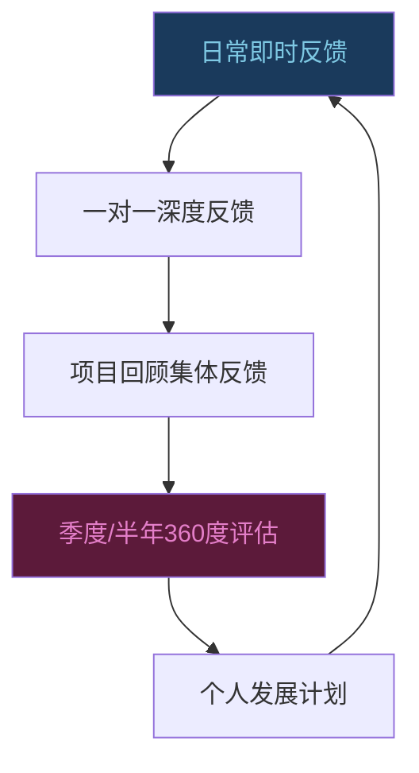

## 八、反馈文化的建设

### 从"偶尔反馈"到"反馈文化"

大多数团队的反馈模式是这样的：平时沉默，年终评估时突然冒出一堆积怨，或者出了大问题才被迫复盘。这种"反馈荒漠"状态的代价是巨大的——盖洛普研究显示，**只有 26% 的员工认为自己收到的反馈能帮助他们把工作做得更好**，而得不到有效反馈的员工离职概率是正常水平的 3 倍。

反馈文化的本质不是"多给反馈"，而是让反馈成为团队日常运转的基础设施。就像代码的持续集成（CI）一样，反馈文化要求的是**小批量、高频次、低成本的信息流动**，而不是等到季度末才做一次大规模集成——那时候冲突已经累积到难以调和。

#### 反馈文化的四个核心特征

| 特征 | 表现 | 缺失时的症状 |
|------|------|-------------|
| **心理安全感** | 成员敢于说真话，不怕被报复 | 会议一片和谐，私下抱怨不断 |
| **双向流动** | 上下级之间、同级之间都有反馈 | 只有上级对下级的单向评价 |
| **即时性** | 问题发生后 48 小时内讨论 | 年终评估时才提半年前的事 |
| **建设性导向** | 聚焦未来改进，而非追究过去 | 反馈变成互相指责或秋后算账 |

### 领导者为什么是反馈文化的支点

反馈文化的建立不是自下而上的自发过程——它需要**自上而下的示范和制度保障**。原因很简单：在组织权力结构中，领导者拥有最大的信息优势和话语权。如果领导者不主动征求意见，下属就会默认"反馈不受欢迎"。

#### 领导者常见的反馈盲区

**盲区一：地位效应（Status Effect）**
当一个人职位越高，周围人越倾向于过滤负面信息。哈佛商学院的研究发现，CEO 收到的反馈质量与其职位任期成反比——任期越长，听到的真话越少。

**盲区二：确认偏差（Confirmation Bias）**
领导者倾向于寻找支持自己判断的信息，忽略相反信号。如果一个领导者认为自己沟通能力不错，就会把团队的沉默理解为"大家都认同"，而非"没人敢说"。

**盲区三：反馈恐惧（Feedback Avoidance）**
即使是领导者，也可能害怕收到负面反馈。承认自己的不足需要勇气，尤其在"领导者应该无所不能"的错误期待下。

#### 打破盲区的具体做法

1. **定期做"匿名反馈调查"**：每季度用简短问卷（5-8 题）匿名收集团队对领导方式的评价，问卷结果只对领导者本人可见
2. **指定"逆耳忠言"角色**：在核心团队中指定 1-2 人，赋予他们定期向你提出不同意见的职责和权限
3. **公开分享你收到的负面反馈**：当团队看到领导者坦然接受批评，心理安全感会显著提升

### 建设反馈文化的四步法

#### 第一步：从自己开始——领导者作为反馈的示范者

建设反馈文化的起点不是制定制度，而是**改变领导者自身的行为模式**。团队会观察领导者如何给反馈、如何接受反馈，并据此判断"在这个团队里，反馈到底安不安全"。

**主动征求反馈：具体化你的请求**

不要问"你们觉得我怎么样"——这种泛泛的问题只会得到泛泛的回答。要用**具体情境+具体行为**的方式提问：

- ❌ "我最近的沟通有什么可以改进的？"
- ✅ "上次项目评审会上，我在张工汇报时打断了他三次，你们觉得我当时应该怎么处理？"
- ✅ "我发的周报邮件，你们觉得信息量够不够？有没有遗漏你们需要的内容？"
- ✅ "上周我做的那个决策，你们当时有没有不同看法但没说出来？"

**接受反馈时的"三秒法则"**

收到反馈时，无论内心的第一反应是什么，先等三秒，然后做这三件事：

1. **感谢**："谢谢你告诉我这个。"
2. **确认理解**："你的意思是说，我在 XXX 场景下的 XXX 行为让你感觉 XXX，对吗？"
3. **说明后续行动**："这个我会认真想一下，下周给你一个回应。"

关键原则：**不要辩解，不要反问"那你当时怎么不说"，不要当场评价反馈的对错**。接受反馈的目标是让对方感到安全，不是在这一次对话中解决问题。

**将反馈转化为可见的改变**

这是最容易被忽略、却最关键的一步。如果你征求了反馈却没有任何改变，团队会迅速得出结论："反馈只是走形式。"

操作方法：
- 每次收到反馈后，记录在一个私人文档中
- 每月回顾一次，选择 1-2 个最可行的改进行动
- 改变发生后，**主动告诉给你反馈的人**："上次你提到 XXX，我这周试了一下，效果不错，谢谢。"

#### 第二步：建立反馈规范——让团队知道"什么是好的反馈"

很多团队不缺反馈意愿，缺的是**反馈能力**。人们不知道该怎么给出有建设性的反馈，要么太含蓄（对方听不出重点），要么太直接（变成人身攻击）。建立明确的反馈规范，是降低反馈成本的关键。

**定义"有帮助的反馈"标准**

向团队明确传达，好的反馈必须满足三个条件：

1. **具体（Specific）**：指向具体的行为或事件，而非笼统的评价
   - ❌ "你的沟通能力需要提高。"
   - ✅ "你在昨天的客户会议中，回答技术问题时用了太多术语，客户显得困惑。"

2. **及时（Timely）**：在事件发生后尽快给出，最好在 48 小时以内
   - ❌ 把三个月前的事攒到绩效面谈时说
   - ✅ 当天或次日找一个合适的时机单独谈

3. **可操作（Actionable）**：对方可以据此做出具体改变
   - ❌ "你以后注意一下。"
   - ✅ "下次给非技术方汇报时，建议先用一句话概括结论，再展开技术细节。"

**反馈的时机选择矩阵**

| 场景 | 推荐方式 | 原因 |
|------|---------|------|
| 日常小改进 | 即时私下口头反馈 | 轻量、及时，不影响工作节奏 |
| 重要行为模式 | 安排一对一专门讨论 | 需要深入对话，给双方充分时间 |
| 团队协作问题 | 在回顾会议中公开讨论 | 涉及多方，需要集体对齐 |
| 敏感/情绪化话题 | 书面反馈 + 面谈跟进 | 书面避免措辞不当，面谈确认理解 |
| 正面反馈 | 当众表扬 | 放大激励效果，树立行为标杆 |

**创造安全的反馈环境**

安全环境不是靠口头承诺"我们这里很开放"建立的，而是靠**一次次安全的反馈经历**逐步积累。具体措施：

- **设立反馈保护区**：一对一会议中专门留出"反馈时间"，用固定格式开场："接下来五分钟，我想听一下你对我最近 XXX 的看法。"
- **禁止报复行为**：明确规定，对提出反馈的人进行任何形式的报复（冷落、穿小鞋、边缘化）是严重违反团队规范的行为。
- **感谢每一个反馈者**：无论反馈质量如何，首先感谢对方的勇气和信任。

#### 第三步：教团队如何给反馈——提供工具和练习机会

**主流反馈模型对比**

| 模型 | 全称 | 结构 | 适用场景 | 局限性 |
|------|------|------|---------|--------|
| **SBI** | Situation-Behavior-Impact | 情境→行为→影响 | 行为层面的反馈 | 缺少"下一步"，对方可能知道问题但不知道怎么改 |
| **SBI-I** | SBI + Intent | SBI + 询问意图 | 避免误解对方动机 | 需要更多时间 |
| **COIN** | Context-Observation-Impact-Next Steps | 情境→观察→影响→下一步 | 带改进方向的反馈 | 比 SBI 更完整但稍复杂 |
| **DESC** | Describe-Express-Specify-Consequence | 描述→表达→要求→后果 | 需要对方改变行为 | 适合"请求改变"，不太适合纯信息分享 |
| **EARS** | Encourage-Ask-Reinforce-Suggest | 鼓励→提问→强化→建议 | 正向反馈为主 | 不适合严重问题 |

**推荐：SBI 模型详解与实操**

SBI 是最简洁、最容易上手的反馈框架，适合作为团队的入门工具。

**S — Situation（情境）**：描述具体的时间、地点和场景
- "在昨天下午的项目进度会上……"
- "在本周一的代码评审中……"
- "在上周五和客户的电话会议里……"

**B — Behavior（行为）**：描述你观察到的具体行为，不加解读
- ✅ "你在李工发言时看了三次手机。"
- ❌ "你对李工不尊重。"（这是解读，不是行为描述）

**I — Impact（影响）**：说明这个行为产生的影响
- "李工之后的发言明显变得紧张和简短了。"
- "会后李工私下问我，是不是他的汇报有问题。"

**完整的 SBI 示范**

> **情境**：在周三下午的技术方案评审会上，你提出了微服务拆分方案。
>
> **行为**：当架构师王工对你的方案提出三个技术质疑时，你逐一反驳了他的每个观点，语速很快，音量也提高了。
>
> **影响**：王工之后没有再发言，其他同事也没有提出任何意见。会议提前结束了，但我们可能错过了一些重要的风险信号。我想了解一下，当时你那边是什么情况？

**练习反馈技能的方法**

1. **反馈角色扮演**：在团队培训中，用真实但脱敏的场景做角色扮演。一人扮演给反馈者，一人扮演接收者，第三人做观察者给出点评。
2. **反馈写作练习**：每周让团队成员写一条 SBI 格式的匿名反馈（可以写给虚拟人物），然后一起点评改写质量。
3. **反馈复盘**：每月选一个真实的反馈案例（当事人同意公开的情况下），分析哪做得好、哪可以改进。

**庆祝良好的反馈行为**

当团队中有人给出了高质量的反馈，或者有人坦然接受了困难的反馈，要在团队层面给予认可：

- "上周张工主动跟王工沟通了代码风格的问题，双方达成了共识，这就是我们期望的反馈方式。"
- "感谢李工在月度回顾中坦诚分享了他对我决策过程的看法，这帮助我做出了调整。"

#### 第四步：将反馈嵌入流程——让反馈成为"规定动作"

单靠个人意愿驱动的反馈行为是脆弱的——工作一忙就会被挤掉。真正可持续的反馈文化需要**制度化保障**。

**流程嵌入清单**

**项目回顾（Retrospective）中的反馈环节**
- 每个迭代或项目结束后，安排 30-60 分钟的回顾会议
- 使用"开始做/停止做/继续做"（Start/Stop/Continue）框架收集团队反馈
- 将反馈行动项记录在案，下次回顾时检查执行情况

**一对一会议中的反馈时间**
- 每次一对一前 5 分钟，先问："这周有什么想跟我反馈的？"
- 每月至少一次深入的反馈对话，用 SBI 模型
- 领导者每次一对一至少给出一条具体的行为反馈

**360 度反馈评估**
- 每半年或一年做一次正式的 360 度评估
- 包括上级、同级、下级和跨部门合作者的反馈
- 结果用于制定个人发展计划，而非绩效考核（至少在初期）

**日常反馈习惯**
- 会议结束后，花 2 分钟给演讲者一条即时反馈
- 代码评审不仅关注代码质量，也关注协作过程
- 项目里程碑节点，团队集体快速复盘（15 分钟站立式）

### 反馈文化的常见误区与纠正

**误区一："反馈 = 批评"**

很多人把"给反馈"等同于"指出问题"。实际上，**正面反馈（强化正确行为）和改进反馈（纠正偏差行为）同等重要**。研究显示，高绩效团队的正负反馈比例约为 5.6:1（来自 John Gottman 的团队动力学研究）。

纠正方法：刻意练习正面反馈。每天至少给一个团队成员一条具体的正面反馈，用 SBI 格式：
> "在今天上午的方案讨论中（S），你主动总结了各方的观点并指出了分歧点（B），这帮助我们快速达成了共识，节省了至少半小时（I）。"

**误区二："好团队不需要反馈"**

有些领导者认为，团队和谐就代表不需要反馈。实际上，**缺乏反馈的和谐往往是回避冲突的假象**。心理学中的"群体思维"（Groupthink）现象表明，当团队过度追求一致时，决策质量会显著下降。

纠正方法：把"建设性异议"作为团队价值观之一。在决策会议中，指定一个"魔鬼代言人"角色，专门负责提出反对意见和风险。

**误区三："一次性培训就够了"**

很多组织会安排一次"反馈技巧培训"，然后期待问题解决。反馈技能和其他技能一样，需要**持续练习和强化**。

纠正方法：
- 每月安排 30 分钟的"反馈练习时间"
- 在团队看板上设置"反馈文化"指标（如：本月团队给出的反馈数量、正负反馈比例）
- 每季度回顾反馈文化的建设进展

**误区四："匿名反馈比当面反馈好"**

匿名反馈确实能降低心理门槛，但它有几个严重缺陷：无法追问细节、无法建立信任、容易变成匿名吐槽。匿名渠道应该是**补充而非替代**。

纠正方法：匿名反馈用于初期收集敏感话题，目标是识别需要当面深入讨论的问题。最终方向是让团队能够在公开场合进行坦诚对话。

**误区五："反馈必须当场给"**

虽然及时性很重要，但**情绪激动时给出的反馈往往质量很差**。如果你或对方情绪很重，先冷静下来再找时间谈。

纠正方法：遵守"24-48 小时原则"——重要反馈在事件发生后 24-48 小时内给出。太早可能情绪未平，太晚则失去时效性。

### 高阶：建设可持续反馈文化的系统方法

#### 反馈文化的成熟度模型

| 阶段 | 特征 | 标志性行为 | 领导者角色 |
|------|------|-----------|-----------|
| **Level 1：反应式** | 只在出问题时才给反馈 | "你怎么又犯这个错？" | 消防员 |
| **Level 2：结构化** | 有固定的反馈流程和工具 | 一对一、回顾会中有反馈环节 | 流程设计者 |
| **Level 3：习惯化** | 反馈成为团队日常习惯 | 随时随地可以自然地给和接反馈 | 示范者 |
| **Level 4：自驱动** | 团队成员之间自发给反馈 | 新人也能自然地给老员工反馈 | 幕后支持者 |
| **Level 5：持续进化** | 反馈机制本身也在持续优化 | 团队定期反思和改进反馈方式 | 进化推动者 |

#### 从 Level 1 到 Level 5 的关键动作

**Level 1 → 2：建立基础设施**
- 制定团队反馈规范文档（不超过一页纸）
- 在一对一会议中增加反馈环节
- 为团队提供 SBI 模型培训

**Level 2 → 3：领导者深度示范**
- 领导者每月至少公开分享一次自己收到的反馈和改进
- 在团队会议中引入实时反馈机制
- 将反馈质量纳入团队复盘的核心议题

**Level 3 → 4：赋权与扩展**
- 建立跨层级的反馈通道（如新人可以直接给 CTO 反馈）
- 创建"反馈伙伴"制度——每两人配对，定期互相反馈
- 在晋升评估中纳入"给他人提供有效反馈的能力"

**Level 4 → 5：系统优化**
- 定期调查团队对反馈文化的满意度
- 分析反馈数据：频率、类型、转化率
- 将反馈文化建设经验整理为团队知识库

#### 反馈文化建设的时间线

| 时间 | 阶段 | 重点行动 | 预期效果 |
|------|------|---------|---------|
| 第 1-2 周 | 准备期 | 领导者自我评估、制定计划 | 明确现状和目标 |
| 第 3-4 周 | 启动期 | 向团队宣布、培训 SBI 模型 | 团队了解期望和工具 |
| 第 2-3 月 | 实践期 | 一对一反馈、项目回顾中嵌入反馈 | 形成初步的反馈习惯 |
| 第 4-6 月 | 深化期 | 360 度评估、反馈伙伴制度 | 反馈成为团队常态 |
| 第 7-12 月 | 固化期 | 反馈纳入绩效和发展体系 | 文化自运转 |

### 案例：某科技团队的反馈文化转型

**背景**：一个 15 人的产品研发团队，技术能力强但协作效率低。代码评审经常引发争吵，产品和技术之间互相甩锅，年终评估时才发现很多人对团队氛围不满。

**问题诊断**：
- 团队从未建立过反馈规范
- 代码评审中的反馈方式粗暴直接，常有人身攻击倾向
- 技术负责人自己也很少接受反馈

**干预措施**：
1. 技术负责人先做了匿名团队调研，发现 12/15 的人认为"给反馈会被穿小鞋"
2. 在全员会议上公开分享调研结果，并做了自我反思
3. 引入 SBI 模型培训，用代码评审场景做角色扮演
4. 每次代码评审增加一条"过程反馈"——不仅评审代码，也评审评审方式
5. 每月一次"安全反馈会"——匿名提交问题，现场讨论解决方案

**结果（6 个月后）**：
- 团队匿名调研中"心理安全感"评分从 2.1/5 提升到 3.8/5
- 代码评审的冲突事件减少了 70%
- 产品-技术协作满意度从 2.4/5 提升到 4.0/5
- 团队主动离职率从 20% 降到 0

**关键教训**：转型成功的最大因素不是培训或流程，而是**技术负责人在全员会议上公开承认自己的问题并请求反馈**。这一刻，团队成员第一次相信"反馈是安全的"。

### 自检清单

在推进反馈文化建设的过程中，定期用以下清单自检：

- [ ] 我最近一周是否主动向团队征求过至少一次反馈？
- [ ] 我最近收到的负面反馈是否转化为了可见的行为改变？
- [ ] 团队中是否有人不知道该怎么给出建设性反馈？
- [ ] 我们的一对一会议中是否有固定的反馈环节？
- [ ] 项目回顾中是否包含了反馈相关的讨论？
- [ ] 最近一个月，我是否给每个团队成员至少一次具体的正面反馈？
- [ ] 团队是否有安全的反馈渠道（包括匿名选项）？
- [ ] 我是否在公开场合庆祝过良好的反馈行为？

***
