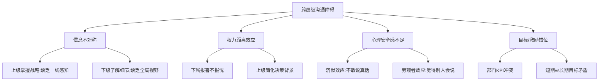
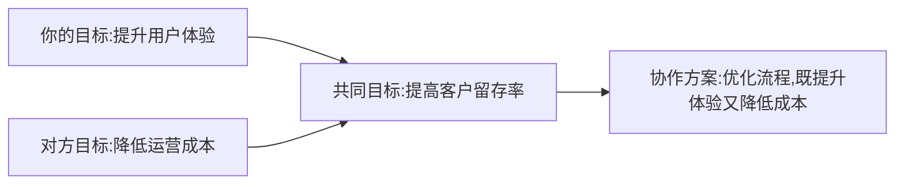

## 九、跨层级沟通

跨层级沟通是领导者每天面对的核心挑战。一个组织中的信息流动方向——向上、平行、向下——每一种都有截然不同的规则、陷阱和技巧。掌握跨层级沟通，意味着你能在组织的三维空间中自如移动，而不是被困在某一个平面上。

### 为什么跨层级沟通如此困难

组织本质上是一个信息不对称的系统。层级越高，掌握的战略信息越多，但对一线细节的感知越弱；层级越低，对执行细节越清楚，但对全局背景的了解越少。这种结构性的信息落差，是跨层级沟通困难的根本原因。

此外，权力关系会扭曲信息传递。下属倾向于向上过滤负面信息（"报喜不报忧"），上级倾向于向下简化决策背景（"你不需要知道为什么"），平级之间则容易陷入部门本位主义。这些都不是个人品德问题，而是组织结构的自然产物。

理解这些结构性因素，是改善跨层级沟通的第一步——你需要对抗的不只是某个人的沟通习惯，而是一整套系统性的扭曲力量。

---

### 向上沟通：让上级做出更好的决策

向上沟通的本质不是"讨好上级"，而是帮助上级在信息不完整的情况下做出更好的决策。你是上级的信息管道之一，你的职责是让流经你的信息尽可能准确、完整、及时。

#### 向上沟通的核心原则

**原则一：结论先行，背景后补**

上级的时间是最稀缺的资源。麦肯锡的"金字塔原理"在这里完全适用：先给结论，再给支撑论据，最后补充细节。如果你的上级需要听你讲三分钟才知道你想说什么，你的沟通方式就需要调整。

| 错误方式 | 正确方式 |
|---------|---------|
| "上周我们测试了A方案和B方案，A方案的转化率是3.2%，B方案是4.1%，但B方案的成本更高……所以我觉得……" | "我建议采用B方案。转化率比A高28%，虽然成本高15%，但ROI仍然更优。详细数据我可以展开说。" |
| "张总，关于那个项目，出了点问题……" | "张总，项目需要延期两周，原因和补救方案我整理好了，您有5分钟吗？" |

**原则二：带着选项来，而不是带着问题来**

向上沟通的大忌是把问题原封不动地抛给上级。正确做法是带着2-3个选项来，每个选项附上你的分析和建议。

错误： "客户要求降价10%，怎么办？"
正确： "客户要求降价10%，我准备了三个方案：
        A. 降价5%+延长账期（保住利润，客户可能接受）
        B. 不降价但增加增值服务（维护价格体系，客户满意度高）
        C. 降价10%但缩减交付范围（短期成交，利润影响最小）
        我建议选A，理由是……"

**原则三：管理预期，而非管理结果**

向上沟通中最危险的行为是"过度承诺"。与其给上级一个漂亮但不切实际的预期，不如一开始就给出真实的范围。

预期管理的三层框架：

1. **底线承诺**（必达）：你有95%以上把握能实现的结果
2. **正常预期**（可达）：你有70%把握能实现的结果
3. **乐观预期**（需努力）：一切顺利时可能达到的结果

向上汇报时，用"底线承诺"作为承诺，用"正常预期"作为进度更新的基准，"乐观预期"留给自己团队追求，不要说出来。

#### 向上沟通的实操技巧

**定期同步机制**

不要等到出了问题才找上级。建立定期同步的节奏，让上级对你的工作有持续的感知：

- **日报/周报**：简洁为王。格式：本周完成（3条）+ 下周计划（3条）+ 需要支持（1条）
- **里程碑汇报**：项目关键节点主动汇报，不要等上级来问
- **风险预警**：发现风险时第一时间上报，附带你的应对方案

**读懂上级的沟通偏好**

每个上级都有自己的沟通偏好，适应它是你的职责：

| 维度 | 观察要点 | 适应策略 |
|-----|---------|---------|
| 信息密度 | 喜欢详细报告还是摘要？ | 匹配偏好，但始终准备好细节备查 |
| 沟通渠道 | 邮件、即时消息、面对面？ | 用他习惯的渠道，紧急事项除外 |
| 决策风格 | 需要时间思考还是当场拍板？ | 给思考型提前发材料，给果断型当面说 |
| 反馈方式 | 直接还是委婉？ | 注意非语言信号，不要只听字面意思 |

**向上沟通的禁忌清单**

- 不要越级汇报（除非直属上级明确失职且你已尝试过正常渠道）
- 不要在公开场合让上级难堪
- 不要只报问题不报方案
- 不要用模糊语言（"可能""大概""应该"）
- 不要等到最后一刻才说坏消息

---

### 平行沟通：在没有权力杠杆时建立协作

平行沟通是最容易被忽视，却往往最难的沟通形式。你和对方没有上下级关系，无法用权力推动协作，只能靠影响力、关系和共同利益。

#### 平行沟通的核心挑战

**挑战一：部门墙**

每个部门都有自己的KPI、节奏和优先级。你觉得很重要的事情，在对方的优先级列表上可能排在第十位。这不是对方不配合，而是组织结构的自然结果。

**挑战二：隐性竞争**

同级之间往往存在隐性的资源竞争——预算、人力、上级关注度、晋升机会。这种竞争会让协作变得复杂，即使双方表面上都很友好。

**挑战三：信息孤岛**

部门之间的信息往往不流通。你知道的事情，对方可能完全不知道；对方的约束和压力，你可能完全不理解。

#### 建立有效平行关系的方法

**方法一：先存后取——建立关系账户**

关系就像银行账户，你必须先存款（帮助对方、建立信任），才能在需要时取款（请求协作）。

具体做法：
- 主动分享对对方有价值的信息（"我看到这个数据可能对你们部门有用"）
- 在对方需要帮助时主动伸手，即使这对你的KPI没有直接好处
- 在跨部门会议上为对方的提案说好话（如果你真心认同）
- 记住对方关心的事情，在相关场合提及

**方法二：寻找共同利益的交集**

不要从"我需要你做什么"开始，而是从"我们一起能解决什么问题"开始。

**方法三：用"影响力六要素"推动协作**

罗伯特·西奥迪尼的影响力原则在平行沟通中特别有效：

1. **互惠**：先给予，再请求
2. **承诺一致**：让对方在公开场合做出小承诺
3. **社会认同**：展示其他部门已经参与的案例
4. **喜好**：建立个人层面的良好关系
5. **权威**：引用数据和高层决策支持你的提议
6. **稀缺**：强调机会的时效性和独特价值

#### 平行沟通的实操框架

**跨部门项目启动会模板**

当你需要多个部门协同时，第一次会议的质量决定了整个项目的成败：

议程：
1. 项目背景和目标（10分钟）
   - 为什么做这件事（用对方关心的语言）
   - 成功的定义是什么
2. 各方角色和期望（15分钟）
   - 每个部门的具体贡献
   - 每个部门能获得的收益
3. 时间线和里程碑（10分钟）
   - 关键节点和交付物
   - 依赖关系和风险点
4. 沟通机制（5分钟）
   - 周会频率和形式
   - 问题升级路径

**处理跨部门冲突的五步法**

当平行沟通中出现冲突时：

1. **暂停**：不在情绪上头时做决定或发邮件
2. **理解**：真正去了解对方的立场和约束，而不是猜测
3. **重构**：把"你vs我"重构为"我们vs问题"
4. **共创**：一起brainstorm解决方案，而不是各提各的
5. **记录**：把达成的共识写下来，发给所有相关方确认

---

### 向下沟通：让信息穿透组织层级

向下沟通的最大敌人是"信息衰减"——你说了100%，中层传递了70%，基层听到的只有40%，执行出来的可能只有20%。

#### 向下沟通为何总是失效

**过滤效应**

每一层管理者都会对信息进行"过滤"——不是故意隐瞒，而是根据自己的理解进行筛选和重新表述。经过三四层过滤后，原始信息可能面目全非。

**选择性倾听**

接收者会根据自己的经验、利益和情绪，选择性地接收信息。你说"我们要提升效率"，有人听到的是"要裁员"，有人听到的是"要加班"，有人听到的是"要买新工具"。

**缺乏上下文**

当你只下达指令而不解释背景时，执行者只能按照字面意思理解。一旦遇到你没有预料到的情况，他们就不知道该如何变通，因为你没有给他们判断的框架。

#### 高效向下沟通的五项实践

**实践一：向下传递上下文，而不仅仅是任务**

这是向下沟通中最重要、也最常被忽视的原则。

| 层级 | 信息内容 | 效果 |
|-----|---------|-----|
| 只分配任务 | "把这个报告周五前交给我" | 机械执行，遇到问题不知道怎么处理 |
| 任务+背景 | "下周董事会要看这个数据，用来决定Q3预算，周五前给我，我需要时间整合" | 理解优先级，遇到困难会主动沟通，可能主动提供更好的格式建议 |

上下文传递的"5W框架"：
- **Why**：为什么做这件事（目的和意义）
- **What**：具体要交付什么（标准和期望）
- **Who**：谁负责、谁配合、给谁看
- **When**：时间节点和优先级
- **How**：关键约束和注意事项（但不要限制具体方法）

**实践二：走动管理（Management by Walking Around）**

走动管理不是"微管理"——你不是去监视下属的工作，而是去感知团队的真实状态。

走动管理的正确姿态：
- 以好奇心而非检查者的姿态出现
- 问开放式问题："最近有什么挑战？""有什么我能帮忙的？"
- 倾听，而不是一到场就开始指导
- 当场能解决的问题当场解决，不能的记录下来跟进
- 频率要稳定（比如每周固定时间），而不是突然袭击

**实践三：建立心理安全——保护说真话的人**

哈佛商学院艾米·埃德蒙森的研究表明，心理安全感是高效团队的第一要素。如果团队成员害怕说真话，你就只能听到好消息，而好消息往往不是你需要知道的。

建立心理安全的具体行动：

1. **当众感谢异议者**："谢谢你提出这个问题，这很重要。"
2. **承认自己的错误**："这个决策是我做的，回头看确实有考虑不周的地方。"
3. **区分"对事"和"对人"**：批评行为，不批评人格
4. **对坏消息的反应控制**：听到坏消息时，先说"谢谢你告诉我"，而不是"怎么现在才说"
5. **保护信息来源**：当有人私下告诉你敏感信息时，不要暴露是谁说的

**实践四：定期一对一会议**

一对一会议是向下沟通最有效的工具，但很多管理者要么不做，要么做得不对。

一对一会议的核心要点：

频率：每周或每两周，30-60分钟
重点：下属的成长和障碍，而不是你的议程
结构（参考）：
  - 前5分钟：轻松对话，建立连接
  - 中间20-40分钟：下属的议题优先
    * 当前工作进展和挑战
    * 需要的支持和资源
    * 职业发展和成长话题
  - 最后5-10分钟：你的议题和行动项确认

关键原则：
  - 这是下属的会议，不是你的会议
  - 少说多听（理想比例：下属说70%，你说30%）
  - 记录行动项，下次回顾
  - 不要把它变成状态汇报会

**实践五：多渠道、多形式重复关键信息**

信息需要被重复7次才能被真正记住——这在组织沟通中尤其适用。

关键信息的传播策略：
- **正式渠道**：全员邮件、部门会议、战略文档
- **非正式渠道**：茶歇聊天、午餐对话、即时消息
- **视觉渠道**：海报、看板、屏幕展示
- **故事形式**：用案例和故事包装，比纯数据更容易记住
- **互动形式**：让团队成员用自己的话复述，确认理解一致

---

### 跨层级沟通的进阶技巧

#### "翻译"能力：在不同层级之间转换语言

优秀的领导者需要具备"翻译"能力——把高层的战略语言翻译成执行层能理解的操作语言，同时把一线的反馈翻译成高层能理解的战略语言。

| 高层语言 | 一线语言 | 翻译示例 |
|---------|---------|---------|
| "提升客户体验" | "减少客户的投诉电话" | "客户体验提升=每个客户的投诉电话从每月2次降到0.5次" |
| "数字化转型" | "用新系统替代旧表格" | "数字化转型=把纸质审批流程搬到线上，审批时间从3天缩短到4小时" |
| "降本增效" | "用更少的人做更多的事" | "降本增效=自动化处理80%的重复工作，让团队专注在高价值任务上" |

#### 管理"信息三角"

在组织中，信息流经三种路径：

1. **正式路径**：会议、邮件、报告
2. **非正式路径**：茶歇、午餐、即时消息
3. **小道消息**：传言、八卦、走廊对话

聪明的领导者不会只依赖正式路径。他们会：
- 通过非正式路径感知团队情绪
- 通过小道消息了解组织中的真实关切
- 用正式路径澄清和纠正不准确的信息

#### 处理"越级"场景

越级沟通是组织中敏感但不可避免的情况。处理原则：

**下属越级来找你**：
- 倾听，但不要绕过他的直属上级做决定
- 了解原因：是直属上级失职，还是下属不了解正常流程
- 引导回正常渠道，同时关注可能的管理问题

**你需要越级了解情况**：
- 先通知相关管理者（"我想直接听听一线的声音"）
- 以学习者的姿态，而非检查者的姿态
- 了解后与管理者沟通你的发现，而不是直接干预

---

### 跨层级沟通的常见误区

**误区一：以为说了就等于沟通了**

"我在会上说了"不等于"大家理解了"。信息发出和信息接收之间存在巨大的鸿沟。验证理解的方式是让对方用自己的话复述，或者观察后续行为是否符合预期。

**误区二：只用一种沟通方式对待所有层级**

对高层用叙事风格、对执行层用指令风格，都是错位的。每种层级需要不同的语言、节奏和信息密度。

**误区三：忽视非语言信号**

跨层级沟通中，权力距离会让对方压抑真实想法。注意观察：
- 沉默可能意味着不同意但不敢说
- 过于简短的回答可能意味着不耐烦或敷衍
- 身体语言（后仰、交叉手臂）可能意味着防御或抗拒

**误区四：只在需要时才沟通**

平时不联系，一找人就是"有个事要你帮忙"——这是关系透支的最快方式。平级和上下级的关系都需要日常维护。

**误区五：用邮件处理复杂或敏感话题**

文字缺乏语气和情感，容易被误读。涉及冲突、敏感话题、复杂决策时，优先选择面对面或视频沟通，邮件只用来记录结论。

---

### 自检清单

定期用以下问题检查自己的跨层级沟通质量：

**向上沟通**
- [ ] 我的上级是否了解我团队当前最重要的三件事？
- [ ] 我是否在问题变严重之前就上报了风险？
- [ ] 我给上级的汇报是否结论先行、选项清晰？
- [ ] 我是否了解上级当前最关心的目标和压力？

**平行沟通**
- [ ] 我是否与关键协作部门保持了日常关系维护？
- [ ] 跨部门项目启动时，我是否明确了各方的收益和角色？
- [ ] 出现冲突时，我是否先理解对方立场再表达自己？

**向下沟通**
- [ ] 我的团队成员是否理解他们工作的"为什么"？
- [ ] 团队中是否有人说真话？如果没人说，为什么？
- [ ] 我的一对一会议是否在关注下属的成长，而不只是汇报？
- [ ] 关键信息是否通过多种渠道重复传达？

---

跨层级沟通不是一个"软技能"，而是一种需要刻意练习的核心领导力。它要求你具备同理心去理解不同层级的视角，具备清晰度去翻译不同层级的语言，具备勇气去传递不受欢迎的真相，具备耐心去建立跨越层级的信任关系。当你能在组织的每个层级都建立有效的信息通道时，你就不再是一个孤立的节点，而是整个组织的连接器。
