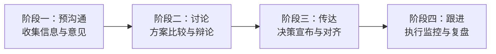

## 十、领导者的决策沟通框架

决策是领导者最核心的职责之一，但决策本身只完成了工作的一半——另一半是将决策有效地传达给相关方，推动执行落地。一个再英明的决策，如果沟通不到位，也会在执行层面大打折扣甚至彻底失败。彼得·德鲁克曾说："管理中90%的问题，本质上都是沟通问题。"在决策场景中，这个比例只会更高。

决策沟通不是简单地"通知"一个结果，而是一个包含信息收集、方案讨论、决策传达、执行对齐、复盘反馈在内的完整闭环。本章将系统拆解领导者的决策沟通框架，从认知误区到模型工具，从向上汇报到向下传达，从常规决策到危机决策，提供一套可直接落地的完整方法论。

### 10.1 决策沟通的底层逻辑

#### 10.1.1 为什么决策需要"沟通"

很多领导者把决策视为一个"事件"——我做了决定，通知大家执行。但事实上，决策是一个"过程"，沟通贯穿始终。

决策沟通之所以关键，根本原因在于三个结构性矛盾：

| 矛盾 | 表现 | 后果 |
|--------|------|------|
| 信息不对称 | 领导者掌握全局信息，执行者只看到局部 | 执行偏离意图，方向性错误 |
| 认知差异 | 同一信息，不同角色有不同解读 | 各自为政，资源冲突 |
| 激励不一致 | 决策收益与执行者个人利益不完全对齐 | 执行动力不足，消极应付 |

有效的决策沟通，本质上就是在解决这三个矛盾：通过信息共享缩小信息差，通过充分讨论统一认知，通过利益绑定对齐激励。

#### 10.1.2 决策沟通的四个阶段

一个完整的决策沟通过程包含四个阶段，每个阶段有不同的沟通目标和策略：

**阶段一：预沟通（决策前）**

在正式讨论方案之前，领导者需要先做信息铺垫。这个阶段的核心任务是：让所有参与方了解决策的背景、约束条件和核心问题。

- 收集各方的数据、观点和诉求
- 初步筛选关键利益相关方
- 设定讨论的边界条件（什么是不可变的，什么可以讨论）
- 预判可能的反对意见并准备应对

**阶段二：讨论（决策中）**

这是信息碰撞和方案比较的阶段。领导者在这个阶段的角色不是"裁判"，而是"主持人"——确保每个关键视角都被听到，而不是过早表态。

- 结构化地呈现备选方案（至少两个）
- 每个方案列出优劣势、风险和资源需求
- 鼓励不同意见，尤其是"沉默的反对者"
- 记录讨论要点和分歧，为后续决策留痕

**阶段三：传达（决策后）**

决策做出后，需要向所有相关方清晰传达。这个阶段的核心挑战是：让不同层级、不同角色的人，都能准确理解决策的内容、原因和对自己的影响。

- 结论先行，再解释逻辑
- 针对不同受众调整信息颗粒度
- 明确每个人的职责和时间节点
- 预留提问和澄清的空间

**阶段四：跟进（执行中）**

决策传达不是沟通的终点，而是执行沟通的起点。跟进阶段需要持续对齐、及时纠偏。

- 建立定期进度汇报机制
- 关注执行中的偏差和阻力
- 在"坚持方向"和"灵活调整"之间保持平衡
- 复盘决策效果，沉淀组织学习

### 10.2 决策沟通的常见误区

#### 误区一：只宣布结果，不解释过程

这是最普遍也最具破坏力的决策沟通错误。很多领导者认为"决策是我的事，执行是团队的事"，因此只宣布最终决定，不分享决策过程中的考量。

**为什么这是个问题？** 人类天然需要理解"为什么"才能真正认同一件事。心理学中的"意义构建"理论指出，当人们不理解行为的意义时，他们只会机械执行，不会主动投入。更危险的是，缺乏解释会催生猜测——团队会自己脑补原因，而这些脑补往往比真相更负面。

**典型场景：**

> CEO 在全员会议上宣布："从下月起，公司将业务重心从 A 产品线转向 B 产品线。"
> 
> 没有任何背景说明。员工的反应：
> - "A 产品是不是要死了？我负责 A 产品，是不是要被裁？"
> - "B 产品我完全不懂，公司是在赌博吧？"
> - "高层肯定又看到了什么内幕消息。"
> 
> 实际原因：A 产品所在的市场正在萎缩，B 产品代表未来增长方向，转型是为了抓住 2-3 年的窗口期。

**正确做法：** 在宣布决策的同时，简要说明决策的背景（市场/业务发生了什么）、考量因素（我们考虑了哪些方案、为什么选这个）、预期效果（期望达到什么目标、对每个人意味着什么）。

#### 误区二：过度民主，模糊责任

有些领导者为了避免冲突，在所有事情上都寻求共识。表面看是尊重团队，实际上是在推卸决策责任。

**过度民主的典型表现：**

- 每个决策都要开全员讨论会
- 讨论无结论，反复开会
- 最终决定是"折中方案"——没有人反对，但也没有人真正支持
- 责任分散——"这是大家一起决定的"

**核心问题：** 民主讨论是为了收集信息和视角，不是为了推卸决策责任。领导者必须区分"咨询"和"决策"：在决策前充分听取意见（咨询），但在决策时果断拍板（决策）。杰夫·贝佐斯将决策分为"单向门"（不可逆的重大决策，需要慎重）和"双向门"（可逆的决策，快速执行）。对于双向门决策，过度民主造成的延迟比决策失误的代价更大。

**正确做法：**

1. 在讨论前明确："这次会议的目的是收集意见，最终决定由 X 做"
2. 讨论有时间限制，不无限延展
3. 决策后明确责任人，不再讨论"要不要做"，只讨论"怎么做"

#### 误区三：决策后反复修改

频繁改变决定会让团队彻底失去信心。当团队发现领导的决定"朝令夕改"时，他们会形成一个理性预期：这次的决定也不会持久，所以不必认真执行。

**反复修改的根本原因通常有三个：**

1. **决策时信息不充分**，但又急于拍板
2. **承受不了反对压力**，一遇到阻力就退缩
3. **缺乏决策标准**，凭感觉做决定，感觉会变

**正确做法：** 对战略方向保持坚定，对战术细节保持灵活。具体来说，宣布决策时可以同时说明："这个方向是确定的，但具体路径我们可以根据执行情况调整。"这样既传递了确定性，又保留了合理的灵活性。

#### 误区四：忽视"沉默反对者"

在决策讨论中，最危险的不是公开反对的人，而是沉默的人。沉默可能意味着不同意但不敢说、不理解但不好意思问、或者已经放弃投入。这些"沉默反对者"在决策宣布后，会成为执行阶段最大的阻力。

**应对策略：** 在讨论中主动点名询问沉默者的意见；在决策传达后做一对一跟进，确认理解和认同度。

#### 误区五：忽略情绪，只讲逻辑

决策对人有影响，而人是有情绪的。尤其是涉及组织调整、人员变动、资源重新分配的决策，如果只讲数据和逻辑，忽视相关方的情绪反应，沟通效果会大打折扣。

**正确做法：** 在传达决策时，先承认情绪（"我知道这个变化会给大家带来不确定性"），再解释逻辑，最后给出行动方向。

### 10.3 决策沟通的核心模型

#### 10.3.1 RAPID 决策角色模型

RAPID 模型由贝恩咨询公司提出，用于明确决策过程中每个角色的职责，避免"人人参与但无人负责"的困境。

| 角色 | 英文 | 职责 | 典型行为 |
|------|------|------|----------|
| **R** — 建议者 | Recommend | 负责提出方案，收集数据和分析 | 撰写方案文档，主持讨论 |
| **A** — 同意者 | Agree | 必须同意才能推进（拥有否决权） | 从法律/财务/技术角度审核 |
| **P** — 执行者 | Perform | 负责执行最终决定 | 制定执行计划，分配资源 |
| **I** — 输入者 | Input | 提供决策所需的信息和意见 | 用户研究、市场数据、风险评估 |
| **D** — 决定者 | Decide | 做最终决定，承担决策责任 | 在充分讨论后拍板 |

**实际应用示例——产品发布决策：**

- **R（建议者）**：产品经理，负责提出产品发布方案，包含发布时间、目标用户、推广策略
- **A（同意者）**：法务负责人（合规审核）+ 技术负责人（稳定性确认）
- **P（执行者）**：开发团队（功能交付）+ 市场团队（推广执行）+ 运营团队（用户承接）
- **I（输入者）**：用户研究团队（用户反馈）+ 数据分析团队（历史数据）+ 客服团队（常见问题）
- **D（决定者）**：产品总监，在听取各方意见后做最终决定

**RAPID 模型的关键原则：**

1. **D（决定者）只有一个**。多个决定者等于没有决定者。
2. **A（同意者）要尽量少**。每增加一个同意者，决策速度下降一半。
3. **R 和 D 不能是同一个人**。建议者和决定者分离，避免"自说自话"。
4. **角色要在决策前分配**，而不是事后追认。

#### 10.3.2 DACI 决策框架

DACI 是 Google、Intuit 等公司广泛使用的决策框架，比 RAPID 更强调"推动者"的角色：

- **D — Driver（推动者）**：驱动整个决策过程，确保按时推进，是决策过程的"项目经理"
- **A — Approver（审批者）**：拥有最终否决权的人，通常只有一人
- **C — Contributors（贡献者）**：提供信息和方案的人
- **I — Informed（知情者）**：需要被告知决策结果但不参与决策过程的人

**DACI 与 RAPID 的核心区别：** DACI 增加了"推动者"角色，适合需要跨部门协调的复杂决策。推动者不一定是决策内容的专家，但必须是过程管理的高手。

**DACI 决策文档模板：**

> **决策标题：** [简明描述要做什么决定]
> **推动者（D）：** [姓名]
> **审批者（A）：** [姓名]
> **贡献者（C）：** [姓名列表]
> **知情者（I）：** [姓名列表]
>
> **背景与问题：** [描述决策的背景和需要解决的问题]
>
> **备选方案：**
> - 方案 A：[描述] → 优势 / 劣势 / 风险
> - 方案 B：[描述] → 优势 / 劣势 / 风险
>
> **推荐方案：** [方案 X]
> **推荐理由：** [为什么选这个]
>
> **决策状态：** 讨论中 / 已决定 / 执行中
> **决策日期：** [YYYY-MM-DD]

#### 10.3.3 决策矩阵（Decision Matrix）

当面对多个方案、多个评估维度时，决策矩阵是最实用的工具。它将主观判断结构化，让决策过程透明可追溯。

**使用步骤：**

1. 列出所有备选方案（行）
2. 确定评估维度（列），如成本、时间、风险、效果、可行性
3. 为每个维度设定权重（总和为100%）
4. 对每个方案在每个维度上打分（1-5分或1-10分）
5. 加权计算总分

**示例——选择团队协作工具：**

| 维度 | 权重 | 方案A：飞书 | 方案B：钉钉 | 方案C：企业微信 |
|------|------|-------------|-------------|----------------|
| 功能完整性 | 30% | 9 (2.7) | 8 (2.4) | 6 (1.8) |
| 学习成本 | 20% | 7 (1.4) | 8 (1.6) | 9 (1.8) |
| 价格 | 20% | 6 (1.2) | 7 (1.4) | 8 (1.6) |
| 集成能力 | 15% | 9 (1.35) | 7 (1.05) | 6 (0.9) |
| 数据安全 | 15% | 8 (1.2) | 8 (1.2) | 7 (1.05) |
| **加权总分** | **100%** | **7.85** | **7.65** | **7.15** |

决策矩阵的价值不仅在于得出"哪个方案最优"的结论，更在于让团队看到每个维度的评分依据和权重设定，从而对决策逻辑形成共识。

#### 10.3.4 决策金字塔——信息分层传达模型

不同层级的受众需要不同颗粒度的信息。决策金字塔模型将决策信息分为四层，由上到下逐层展开：

                    ┌─────────────┐
                    │   结论      │  ← 给高管：一句话说清楚
                    │  （What）    │
                    ├─────────────┤
                    │   原因      │  ← 给中层：为什么这样决定
                    │  （Why）     │
                    ├─────────────┤
                    │   方案      │  ← 给执行者：具体怎么做
                    │  （How）     │
                    ├─────────────┤
                    │   细节      │  ← 给一线：操作手册级别
                    │  （Details） │
                    └─────────────┘

**向上沟通时：** 从结论开始，按需展开（对方问才展开下一层）。
**向下沟通时：** 从结论开始，逐层展开到对方职责对应的层级。

### 10.4 向上汇报的决策沟通

向上汇报是领导者最频繁的决策沟通场景。核心目标是：让上级快速理解你的决策或建议，并获得支持。

#### 10.4.1 金字塔原理——结论先行

麦肯锡的芭芭拉·明托提出的"金字塔原理"是向上沟通的基本功：

- **先说结论**，再解释原因
- 每一层的论点不超过 3-5 个
- 每个论点用数据或事实支撑

**反面示例：**

> "领导，最近 A 客户那边反馈了一些问题，然后我们团队分析了一下，发现主要是产品功能不太匹配，另外 B 客户也提了类似的需求，市场部那边也有数据支持这个判断……所以我们想做一次产品迭代。"

**正面示例：**

> "领导，我建议 Q3 启动一次产品迭代，聚焦客户端的核心痛点。原因有三个：第一，A 客户和 B 客户都反馈了功能匹配问题，影响续约；第二，市场数据显示客户流失率上升了 15%；第三，竞品已推出了类似功能。方案是 6 周迭代周期，重点解决三个高频痛点。"

#### 10.4.2 提供选项而非问题

向上沟通的第二大原则：**让领导做选择题，而非填空题**。

- **弱：** "这个问题怎么办？"（你在把自己的工作推给领导）
- **中：** "我建议方案 A。"（有主见但缺乏对比）
- **强：** "我建议方案 A，理由是 X、Y、Z。如果方案 A 不可行，方案 B 也可以，但风险是 M，成本会增加 N%。"

**提出选项时的结构化模板：**

推荐方案：[方案名称]
核心理由：[1-3 句话]
预期效果：[量化指标]
资源需求：[人力/时间/预算]
风险与对策：[最可能的风险 + 应对计划]

备选方案：[方案名称]
与推荐方案的差异：[关键不同点]
不推荐的原因：[具体原因]
适用场景：[什么情况下应该切换到此方案]

#### 10.4.3 管理预期——避免"惊喜"

在组织中，"惊喜"几乎从来不是好事。好消息可以晚一点说，坏消息必须提前说。

**管理预期的三个核心动作：**

1. **提前告知风险和不确定性**：不要等到项目失败了才暴露风险。在决策阶段就应该列出 Top 3 风险，让上级对可能的"坏结果"有心理准备。
2. **不承诺做不到的事**：为了争取资源或获得支持而过度承诺，是饮鸩止渴。宁可承诺 80% 的目标、交付 90% 的结果，也不要承诺 120% 的目标、交付 90% 的结果。
3. **定期更新进展**：建立固定的汇报节奏（周报/双周报），而不是等上级来问。主动汇报的人掌握沟通主动权。

#### 10.4.4 向上沟通的时机选择

汇报决策建议的时机和内容同样重要：

| 时机 | 适合的内容 | 不适合的内容 |
|------|-----------|-------------|
| 周一早会 | 本周计划、需要协调的事项 | 复杂方案讨论 |
| 一对一会议 | 战略方向、敏感话题、个人发展 | 日常事务 |
| 邮件/消息 | 信息同步、数据报告、确认类事项 | 需要讨论的决策 |
| 紧急会议 | 危机决策、重大变故 | 常规决策 |

### 10.5 向下传达的决策沟通

向下传达的核心目标是：让团队不仅知道"做什么"，更理解"为什么做"，从而从被动执行变为主动投入。

#### 10.5.1 解释"为什么"——从服从到认同

西蒙·斯涅克的"黄金圈法则"在决策沟通中同样适用：先说 Why（为什么做这个决策），再说 How（怎么执行），最后说 What（具体任务）。

**"服从"与"认同"的本质区别：**

| 维度 | 服从 | 认同 |
|------|------|------|
| 动力来源 | 外部压力（怕被罚） | 内在驱动（理解意义） |
| 执行质量 | 及格线（完成任务） | 超预期（主动优化） |
| 遇到困难时 | 等待指示 | 主动解决 |
| 领导不在时 | 效率下降 | 效率不变 |

**"情境-行为-影响"解释框架（SBI）：**

向团队解释决策时，使用 SBI 框架可以让人更容易理解和接受：

- **S — Situation（情境）**：描述决策的背景和约束条件
- **B — Behavior（行为）**：说明决策的具体内容
- **I — Impact（影响）**：解释这个决策对每个人的具体影响

**示例：**

> "因为市场竞争加剧，我们最大的竞品已经推出了类似功能（S），所以公司决定在 Q3 加速产品迭代，优先解决客户反馈的三个核心痛点（B）。这意味着开发团队接下来 6 周的工作强度会增加，但成功的话，我们的续约率可以提升 10-15%，直接影响年终奖金池（I）。"

#### 10.5.2 允许质疑但不允许多次推翻

好的决策沟通需要在"开放"和"坚定"之间找到平衡。

**决策宣布时的沟通结构：**

第一步：宣布决策（结论）
第二步：解释背景和理由（Why）
第三步：开放提问和讨论（Q&A）
第四步：确认理解和承诺（Close）

**关键细节：**

- 在第三步中，给团队表达疑虑的机会，但设定明确的时间边界（如 15-20 分钟的讨论时间）
- 对于合理的担忧，承认并纳入执行预案
- 对于"我不同意"但缺乏实质理由的反对，明确表达"我理解你的感受，但这是经过充分讨论后的决定"
- 一旦讨论结束，进入第四步——要求全力执行，不再反复讨论"要不要做"

**定期复盘机制：**

给反对者一个"被验证"的机会。在决策执行一个阶段后（如 4-6 周），安排正式复盘会议，回顾决策效果。如果当初的担忧确实发生了，及时调整；如果没有，也是团队学习的机会。

#### 10.5.3 分配责任到人——RACI 矩阵

决策传达的最后一个关键环节是：**明确每个人的职责**。RACI 矩阵是最常用的职责分配工具：

| 角色 | 含义 | 要求 |
|------|------|------|
| **R** — Responsible | 执行者，负责具体完成任务 | 明确到具体人，不是"团队" |
| **A** — Accountable | 问责者，对结果负最终责任 | 每项任务只能有一个 A |
| **C** — Consulted | 咨询者，执行前需要咨询的人 | 双向沟通 |
| **I** — Informed | 知情者，需要被告知进展的人 | 单向通知 |

**示例——新产品上线决策的 RACI 分配：**

| 任务 | 产品经理 | 技术负责人 | 开发团队 | 市场团队 | 客服团队 |
|------|----------|-----------|---------|----------|---------|
| 功能开发 | C | A | R | I | I |
| 测试验收 | A | C | R | I | C |
| 市场推广 | R | I | I | A | C |
| 用户引导 | R | C | I | C | R |
| 上线审批 | A | R | I | I | I |

**使用 RACI 的注意事项：**

1. 每行只能有一个 A（问责者），否则"共同负责"等于"无人负责"
2. R 不能太多——每项任务的 R 最好不超过 2-3 人
3. C 和 I 要区分清楚——C 是双向沟通（需要对方意见），I 是单向通知（告知即可）
4. 在决策宣布时同步发布 RACI 矩阵，而不是事后补发

#### 10.5.4 决策传达的信息校准

同一个决策，传达给不同对象时需要调整信息的深度和侧重点：

| 受众 | 关注点 | 传达重点 | 信息深度 |
|------|--------|---------|---------|
| 高管团队 | 战略影响、资源分配 | 为什么做这个决策，对业务目标的影响 | 顶层视角 |
| 中层管理者 | 执行方案、团队影响 | 具体怎么做，对团队意味着什么 | 管理视角 |
| 一线员工 | 个人任务、日常工作变化 | 我需要做什么改变，什么时候开始 | 操作视角 |
| 外部合作伙伴 | 合作模式、利益影响 | 对合作关系的影响，需要他们做什么 | 业务视角 |

### 10.6 危机决策的沟通策略

危机场景下的决策沟通与日常决策截然不同：时间紧迫、信息不完整、情绪高涨、关注度极高。在危机中，领导者的沟通质量直接决定了组织能否凝聚力量、共渡难关。

#### 10.6.1 危机决策沟通的"黄金四小时"原则

危机发生后，组织有大约 4 小时的窗口期来建立沟通主导权。超过这个时间，谣言和猜测会填补信息真空，形成难以扭转的负面叙事。

**四小时内必须完成的沟通动作：**

1. **第一个小时：内部通报**
   - 向核心团队通报事实（已知的、确认的）
   - 明确每个人的分工和下一步行动
   - 建立信息汇总机制（谁收集什么信息、多久汇报一次）

2. **第二个小时：口径统一**
   - 确定对外口径：事实是什么、正在做什么、下一步计划
   - 指定唯一的信息发布人（避免口径不一致）
   - 准备 Q&A 文档，预判高频问题

3. **第三个小时：首次对外沟通**
   - 发布第一份声明或内部通知
   - 核心信息："我们知道发生了什么" + "我们正在做什么"
   - 不需要有完整答案，但需要展示行动力

4. **第四个小时：全面铺开**
   - 向所有相关方同步信息
   - 建立持续更新机制（如每 2 小时更新一次）
   - 开通反馈渠道，收集一线信息

#### 10.6.2 危机沟通的"3C"原则

| 原则 | 英文 | 含义 | 反面示例 |
|------|------|------|---------|
| 关切 | Concern | 表达对受影响方的真诚关心 | "这是技术问题，与我无关" |
| 控制 | Control | 展示你正在掌控局面 | "我们也在等消息" |
| 承诺 | Commitment | 给出具体行动承诺 | "我们会尽快处理" |

**正面示例（某 SaaS 公司数据泄露事件）：**

> "我们非常关注此次数据安全事件对客户造成的影响（Concern）。事件发生后，我们立即启动了应急预案，已关闭受影响的服务入口，并邀请第三方安全团队介入调查（Control）。我们承诺在 48 小时内向所有受影响客户提供完整的事件报告和补偿方案，同时将在 30 天内完成全平台安全升级（Commitment）。"

### 10.7 跨部门决策的沟通挑战与对策

跨部门决策是组织中最复杂、也最容易出问题的决策场景。因为涉及不同团队的目标、资源和利益，沟通成本和协调难度成倍增加。

#### 10.7.1 跨部门决策的典型困境

1. **目标冲突**：销售要快速交付，工程要质量保证，两个目标在短期内存在矛盾
2. **优先级打架**：每个部门都认为自己的需求最重要
3. **信息孤岛**：各部门只掌握自己的信息，对全局缺乏认知
4. **责任模糊**：出问题时互相推诿，"不是我们部门的事"

#### 10.7.2 跨部门决策沟通的"三步法"

**第一步：建立共同目标**

在讨论具体方案之前，先让各方对齐"我们在为什么共同目标服务"。这个共同目标必须高于任何单个部门的目标。

**示例：** 不是"销售要更多的产品功能"和"工程要减少技术债"，而是"在保证产品质量的前提下，Q3 实现 30% 的客户增长"。

**第二步：信息透明化**

让各部门看到其他部门的约束和优先级。很多跨部门冲突源于"不了解对方的处境"。

**实操方法：** 在跨部门决策会议前，要求每个部门提交一页纸的"部门现状简报"，包含当前资源、约束条件和核心优先级。

**第三步：利益交换而非零和博弈**

当资源有限时，不是"谁赢谁输"，而是"怎么交换"。A 部门可以在 X 事项上让步，B 部门在 Y 事项上回报。领导者需要引导这种交换思维，而不是充当裁判。

### 10.8 数据驱动的决策沟通

在现代组织中，基于数据的决策沟通比基于直觉的决策沟通更有说服力，也更容易获得支持。

#### 10.8.1 用数据说话的三个层次

| 层次 | 说明 | 示例 |
|------|------|------|
| 描述数据 | 发生了什么 | "上季度客户流失率从 5% 上升到 8%" |
| 诊断数据 | 为什么发生 | "流失客户中 70% 提到了功能缺失" |
| 预测数据 | 如果不行动会怎样 | "按当前趋势，Q4 流失率将达到 12%，影响营收 200 万" |

**只用描述数据是不够的。** 很多领导者在决策沟通中只说"发生了什么"，但不解释"为什么"和"如果不行动会怎样"。这会导致团队缺乏紧迫感。

#### 10.8.2 数据可视化的沟通技巧

决策沟通中的数据展示，不是做一份漂亮的报告，而是让数据"讲故事"：

1. **一张图只讲一个观点**：不要在一张图表里塞太多数据
2. **标注关键数据点**：用颜色或标注突出你希望对方关注的数字
3. **提供对比基准**：单独说"增长 15%"没有感觉，但说"增长 15%，是行业平均水平的 3 倍"就有说服力
4. **用具体金额替代百分比**：对高管来说，"节省 200 万"比"效率提升 20%"更有冲击力

### 10.9 决策沟通的实用工具箱

#### 10.9.1 决策沟通检查清单

在每次重大决策沟通前，对照以下清单自检：

□ 决策背景是否清晰？（为什么做这个决定）
□ 备选方案是否充分讨论？（至少两个方案的对比）
□ 角色分工是否明确？（RAPID/RACI 是否已分配）
□ 受众是否分层？（不同层级的信息颗粒度不同）
□ 情绪是否被考虑？（受影响方的情绪反应预判）
□ 风险是否被提及？（不要只讲好处）
□ 时间节点是否明确？（什么时候开始、什么时候完成）
□ 反馈渠道是否开放？（团队怎么提出疑虑）
□ 文档是否留痕？（决策过程和结果是否记录）
□ 复盘计划是否安排？（什么时候回顾决策效果）

#### 10.9.2 决策邮件/公告模板

> **主题：[决策] 关于 XXX 的决定**
>
> 各位同事，
>
> 经过充分讨论，我们做出以下决定：**[一句话说清楚]**
>
> **背景：** [2-3 句话描述决策背景和核心问题]
>
> **决策内容：** [具体描述决定是什么]
>
> **为什么做出这个决定：**
> - 理由 1：[数据/事实支撑]
> - 理由 2：[数据/事实支撑]
> - 理由 3：[数据/事实支撑]
>
> **对团队的影响：**
> - [具体影响 1]
> - [具体影响 2]
>
> **时间安排：**
> - [里程碑 1]：[日期]
> - [里程碑 2]：[日期]
>
> **角色分工：**
> - [姓名/团队 1]：负责 XXX
> - [姓名/团队 2]：负责 XXX
>
> **疑问与反馈：** 如有任何疑问，请联系 [负责人] 或在 [反馈渠道] 提出。
>
> 感谢大家的支持。——[签名]

#### 10.9.3 常用决策沟通句式

**宣布决策时：**
- "经过综合评估，我们决定……"
- "基于 [数据/事实]，我认为最合理的方案是……"
- "这个决定的目标是……"

**解释原因时：**
- "做出这个决定主要基于三个考量……"
- "核心原因是……"
- "如果不采取行动，将会……"

**处理反对时：**
- "我理解你的顾虑，这确实是一个风险。我们的应对方案是……"
- "你的观点很有价值，我们在讨论中也考虑过这个角度，最终的判断是……"
- "这个担忧我记下了，我们会在 [时间点] 专门复盘这一点。"

**分配任务时：**
- "这部分工作由你负责，需要在 [日期] 前完成。"
- "你是这个任务的负责人（A），XX 会协助你（R）。"
- "有任何阻碍及时告诉我，我来协调资源。"

### 10.10 决策沟通能力的进阶修炼

#### 10.10.1 从"告知"到"共创"的进阶路径

领导者在决策沟通上通常经历四个阶段：

| 阶段 | 特征 | 沟通方式 | 适用场景 |
|------|------|---------|---------|
| 初级：告知 | "我已经决定了，你们执行" | 单向通知 | 紧急情况、标准化流程 |
| 进阶：解释 | "我决定了，原因是……" | 单向通知 + 理由 | 常规决策 |
| 高级：咨询 | "我倾向 A，你们怎么看？" | 双向讨论 | 重大决策 |
| 顶级：共创 | "我们面临这个问题，一起想方案" | 深度协作 | 战略级决策 |

不同场景需要不同的沟通方式。顶级领导者不是在所有事情上都用"共创"模式，而是能根据决策的性质、紧迫程度和团队成熟度，灵活切换沟通方式。

#### 10.10.2 建立个人的决策沟通品牌

长期来看，领导者需要建立自己的"决策沟通品牌"——团队对你的决策沟通方式形成稳定的预期。

**好的决策沟通品牌：**
- "他做的决定通常都有充分理由"
- "他会听我们的意见，但不会无限讨论"
- "他说什么时候完成就什么时候完成"
- "坏消息他不会瞒着我们"

**建立品牌的方法：**
1. **一致性**：同样的沟通方式坚持使用，不要今天民主明天独裁
2. **可预测性**：团队能预期你的沟通风格，减少不确定感
3. **言行一致**：说了"会考虑"就真的考虑，说了"已决定"就不再反复
4. **主动复盘**：定期公开回顾自己的决策效果，包括错误决策

#### 10.10.3 决策沟通中的常见心理陷阱

| 心理陷阱 | 表现 | 应对方法 |
|----------|------|---------|
| 确认偏误 | 只寻找支持自己观点的信息 | 主动要求团队提出反对意见 |
| 沉没成本谬误 | "已经投入这么多，不能放弃" | 用"如果今天重新开始，还会做这个决定吗"来检验 |
| 权威效应 | "领导说的一定对" | 鼓励匿名反馈，指定"魔鬼代言人" |
| 群体极化 | 讨论后观点变得更极端 | 引入外部视角，设置"冷静期" |
| 乐观偏见 | "我们不会遇到那种风险" | 要求每个方案列出最坏情况 |

### 10.11 本节小结

决策沟通是领导者最核心的沟通能力之一。一个完整的决策沟通框架包含以下关键要素：

1. **认知层面**：理解决策沟通的四个阶段（预沟通→讨论→传达→跟进），避免五个常见误区
2. **模型层面**：掌握 RAPID/DACI 角色模型、决策矩阵、金字塔信息分层模型
3. **向上沟通**：结论先行、提供选项、管理预期
4. **向下沟通**：解释"为什么"、允许质疑但设定边界、RACI 分配责任
5. **特殊场景**：危机决策的"黄金四小时"、跨部门决策的"三步法"
6. **持续精进**：从"告知"走向"共创"，建立个人决策沟通品牌

决策沟通的最高境界不是让所有人同意你的决定，而是让所有人理解你的决定，并在理解的基础上全力执行。正如科林·鲍威尔所说："在你掌握 40%-70% 的信息时做出决定。等到掌握 100% 的信息时，机会已经消失了。"领导者要做的，是在不确定中果断决策，在沟通中传递信心和方向。
