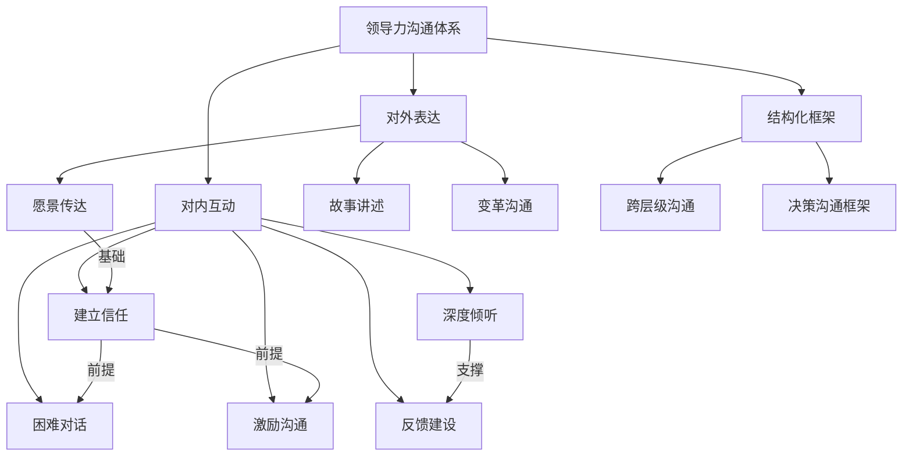
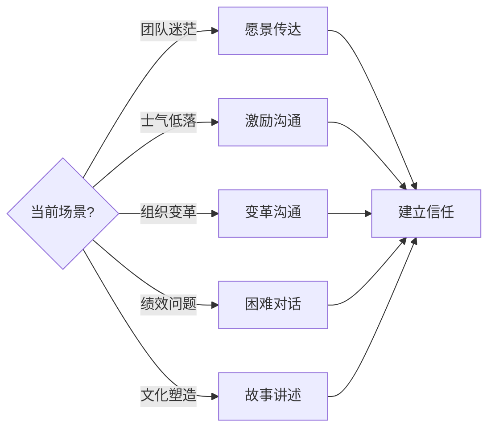
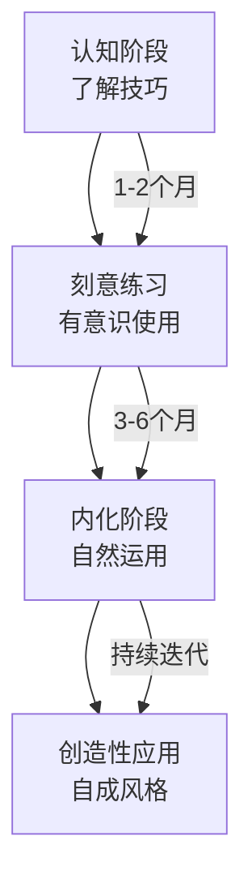

## 本节小结

本节系统梳理了领导力沟通的十大核心技巧。这些技巧不是孤立存在的——它们构成了一个完整的沟通能力体系，从"说什么"到"怎么说"，从"对谁说"到"何时说"，覆盖了领导者在日常工作中面临的几乎所有沟通场景。

### 核心技巧全景图

### 十大技巧速查表

| 序号 | 技巧 | 核心模型/方法 | 适用场景 | 关键原则 |
|------|------|---------------|----------|----------|
| 一 | 愿景传达 | 画面化 + 重复 + "为什么"框架 | 战略发布、目标对齐、文化宣导 | 从"为什么"开始，用画面代替数字 |
| 二 | 激励沟通 | 看见-认可-赋予意义三步法 | 日常管理、低谷期、高强度任务 | 真诚而非套路，具体而非笼统 |
| 三 | 变革沟通 | STAR模型 + 过度沟通策略 | 组织变革、流程调整、转型期 | 诚实、双向、及时，宁可过度也不要不足 |
| 四 | 困难对话 | SBI模型（情境-行为-影响） | 绩效面谈、冲突处理、纠正偏差 | 直接而有温度，对事不对人 |
| 五 | 建立信任 | 言行一致 + 承认脆弱 + 信任账户 | 长期管理、新团队、修复关系 | 信任是存款，需要持续积累；一次失信可能清零 |
| 六 | 故事讲述 | 具体-真实-有结构三要素 | 文化建设、理念传达、说服影响 | 故事是最古老的领导力工具，比数据更持久 |
| 七 | 深度倾听 | 全神贯注 + 复述确认 + 不打断 | 一对一、团队会议、冲突调解 | 倾听是最高形式的尊重 |
| 八 | 反馈建设 | 从自己开始 + 嵌入流程 | 日常管理、团队成长、文化塑造 | 反馈是礼物而非攻击；及时、具体、可行动 |
| 九 | 跨层级沟通 | 向上/向下/平级差异化策略 | 矩阵组织、跨部门协作、汇报 | 对上简洁有力，对下清晰共情，对平协作共赢 |
| 十 | 决策沟通 | RAPID模型 + 金字塔原理 | 决策发布、资源分配、方向调整 | 结论先行，提供选项而非问题 |

### 技巧之间的逻辑关系

这十大技巧并非并列关系，而是存在层层递进的逻辑结构：

**第一层：信任基石。** 建立信任是一切领导力沟通的前提。没有信任，愿景传达会被视为画饼，激励沟通会被视为PUA，反馈会被视为挑刺。信任就像银行账户——每一次兑现承诺、每一次坦诚沟通都是存款，每一次食言、每一次回避都是取款。当账户余额为零或为负时，任何技巧都无法挽救。

**第二层：倾听与反馈。** 在信任的基础上，倾听和反馈构成了日常管理沟通的两个轮子。倾听让你理解团队的真实状态——他们的困惑、需求、不满和期待。反馈则帮助团队成员持续成长——既包括正面的肯定，也包括建设性的改进意见。两者形成闭环：倾听发现问题，反馈推动改进，改进后再倾听验证效果。

**第三层：场景化应用。** 愿景传达、激励沟通、变革沟通、困难对话、故事讲述，这五个技巧是在不同场景下的具体应用。领导者需要根据情境灵活选择：

**第四层：结构化框架。** 跨层级沟通和决策沟通框架是更高层次的结构化能力。它们不是单一技巧，而是将前述多种技巧整合为系统化的沟通流程。当领导者需要同时面对上级、平级和下级，或者需要发布一个影响全局的决策时，就需要这种结构化的沟通框架来确保信息的一致性和有效性。

### 各技巧的核心要点回顾

#### 一、愿景传达：让未来可见

愿景传达的本质是将抽象的战略目标转化为团队可以"看见"的画面。核心要点包括：

- **从"为什么"开始**（西蒙·斯涅克的黄金圈法则）：人们不买你做的东西，买你为什么做。先讲使命和意义，再讲方法和产品
- **画面化而非数字化**："我们要成为行业第一"不如"让每一个用户在30秒内找到答案"有感染力
- **重复、重复、再重复**：领导者对愿景的重复次数，至少是自己觉得"够了"的三倍。杰克·韦尔奇说："我每到一个地方都在讲同一件事，讲到我自己都觉得恶心了，但团队才刚刚开始记住"
- **用故事承载愿景**：具体的客户故事、员工故事比任何PPT都更能传递愿景的温度

#### 二、激励沟通：点燃内在动力

激励不是喊口号，而是帮助团队成员找到工作与个人价值的连接点。核心要点包括：

- **看见**：注意到每个人的具体贡献，而非笼统地说"大家辛苦了"
- **认可**：及时、具体、公开地肯定好行为。"你昨天处理客户投诉的方式非常专业，先倾听再解决，最后还主动回访"远比"干得不错"有效
- **赋予意义**：将日常工作与更大的目标连接。"你写的这段代码，帮10万用户节省了每天30分钟的等待时间"
- **避免虚假激励**：在困难时期用空洞的乐观主义（"明年一定会更好"）反而会损害信任。承认困难，同时展示信心和路径

#### 三、变革沟通：穿越不确定性的指南针

变革期是领导力沟通最大的考验。团队面对不确定性时，沉默会被解读为隐瞒，模糊会被解读为不妙。核心要点包括：

- **STAR模型**：Situation（现状是什么）→ Task（我们需要做什么）→ Action（具体行动计划）→ Result（预期成果和时间线）
- **过度沟通原则**：变革期间的信息需求是平时的3-5倍。宁可重复，也不要留信息真空
- **双向沟通**：不仅要说，更要听。变革期的团队有大量焦虑和疑问需要被回应
- **诚实面对不确定性**：不知道的事情就说"我不知道，但我会在X时间给你更新"，而非编造答案

#### 四、困难对话：直接而有温度

绩效问题、行为偏差、人际冲突——这些对话是领导者回避最多的，也是最不能回避的。核心要点包括：

- **SBI模型**：在什么情境下（Situation），我观察到什么行为（Behavior），产生了什么影响（Impact）。例如："在昨天的客户演示中（S），你迟到了20分钟且没有提前通知（B），客户对我们的专业性产生了疑虑，后续谈判明显更谨慎了（I）"
- **对事不对人**：批评行为，而非人格。"这份报告的数据有三处错误"而非"你太粗心了"
- **给出口路**：困难对话的目的不是指责，而是改变。在指出问题后，明确期望的行为并提供支持
- **选择合适的时机和场所**：私下进行，不在情绪激动时开口，预留足够的时间

#### 五、建立信任：领导力的隐形基础设施

信任是所有领导力沟通的底层操作系统。核心要点包括：

- **言行一致**：说到做到是最基本的信任建立方式。如果做不到，提前沟通而非事后解释
- **承认脆弱**：适度展示自己的不确定、错误和学习过程。"这个决定我也没有十足把握，但基于目前的信息，我认为这是最好的选择"
- **保持透明**：分享背景信息、决策逻辑、甚至组织的困境。信息不对称是信任的最大杀手
- **信任账户模型**：Stephen Covey提出的概念——信任像银行账户，需要持续存入（兑现承诺、帮助他人、诚实沟通），谨慎支取（请求支持、提出批评）

#### 六、故事讲述：最古老的领导力工具

人类的大脑天生对故事敏感，对数据不敏感。领导者用故事传递价值观、文化和方向，比任何制度文件都有效。核心要点包括：

- **具体**：有时间、地点、人物、细节。"去年冬天，一个用户在凌晨3点给我们发了一封邮件"比"很多用户反馈"有力得多
- **真实**：最好的领导力故事是真实的——自己的失败、团队的突破、客户的改变
- **有结构**：开头设悬念，中间有冲突，结尾有启发。经典的三幕结构在领导力沟通中同样适用
- **故事库建设**：优秀的领导者会有意识地收集和整理故事素材，按主题分类（奋斗、失败、创新、客户），随时可以调用

#### 七、倾听：被低估的领导力

大多数领导者擅长说，不擅长听。但研究表明，被倾听的员工敬业度高出4.6倍。核心要点包括：

- **全神贯注**：放下手机，关掉电脑屏幕，用身体语言（眼神接触、前倾、点头）传递"我在听"
- **复述确认**："你的意思是……对吗？"这一步看似简单，却是避免误解最有效的手段
- **不打断**：忍住插话的冲动，让对方把话说完。沉默不是尴尬，是给对方思考和表达的空间
- **听背后的情绪**：不仅听内容，还要听情绪。"这个项目还不错"说的时候是兴奋还是疲惫，传递的信息完全不同

#### 八、反馈文化：让成长成为常态

反馈不是年终考核时的突击，而是日常工作中的持续对话。核心要点包括：

- **从自己开始**：领导者主动寻求反馈，是最有力的文化信号。"在这个项目中，你觉得我有哪些地方可以做得更好？"
- **嵌入流程**：将反馈机制化——项目复盘、一对一、周会中预留反馈时间
- **及时具体**：好的反馈在行为发生后24小时内给出，越具体越好
- **正负比例**：研究表明，高绩效团队的正负反馈比例约为5.6:1。这不是说要回避批评，而是说肯定和建设性反馈同样重要

#### 九、跨层级沟通：对上、对下、对平

不同层级的沟通对象，需要不同的策略和技巧：

- **向上沟通**：结论先行、提供选项、管理预期、用数据说话。上级最稀缺的是时间，最需要的是确定性
- **向下沟通**：清晰传达期望、给予自主空间、定期check-in而非事无巨细地管控。下级最需要的是方向感和安全感
- **平级沟通**：寻找共同目标、尊重专业边界、主动分享信息。平级之间最大的障碍是利益冲突和信息壁垒

#### 十、决策沟通框架：让决定落地

一个好的决策如果没有好的沟通，和一个坏决策没有区别。核心要点包括：

- **RAPID模型**：明确建议者（Recommend）、同意者（Agree）、执行者（Perform）、输入者（Input）、决定者（Decide），避免责任模糊
- **结论先行**：先说决定是什么，再说为什么这样决定
- **提供选项而非问题**：让上级做选择题而非填空题
- **管理预期**：提前告知风险和不确定性，避免事后被追责

### 从技巧到习惯：领导者的修炼路径

知道这些技巧只是起点，内化为习惯才是目标。以下是建议的修炼路径：

**具体修炼建议：**

| 阶段 | 行动 | 检验标准 |
|------|------|----------|
| 第1-2周 | 选择1-2个最薄弱的技巧开始练习 | 能说出每个技巧的核心模型和步骤 |
| 第3-4周 | 在真实场景中有意识地使用 | 能回忆起最近3次使用该技巧的具体情境 |
| 第2-3个月 | 扩展到3-4个技巧，形成组合 | 能根据场景自动选择合适的技巧组合 |
| 第4-6个月 | 覆盖全部十大技巧 | 团队反馈沟通风格有明显改善 |
| 6个月以后 | 融会贯通，形成个人风格 | 沟通成为领导力的自然延伸，而非刻意为之 |

### 最后的提醒

> 技巧可以学习，但真正的领导力沟通来自真诚。没有真诚作为基础，所有技巧都只是表演。

这句话值得每一位领导者反复咀嚼。领导力沟通的终极目标不是"说得好听"，而是"让人愿意跟你走"。这需要的不仅是技巧，更是品格——言行一致的品格、尊重他人的品格、承认错误的品格、关心团队成长的品格。

技巧是术，真诚是道。有道无术，术尚可求；有术无道，止于术。当技巧与真诚合二为一时，领导力沟通才能真正发挥其力量——不是说服人，而是感召人；不是控制人，而是成就人。

***
