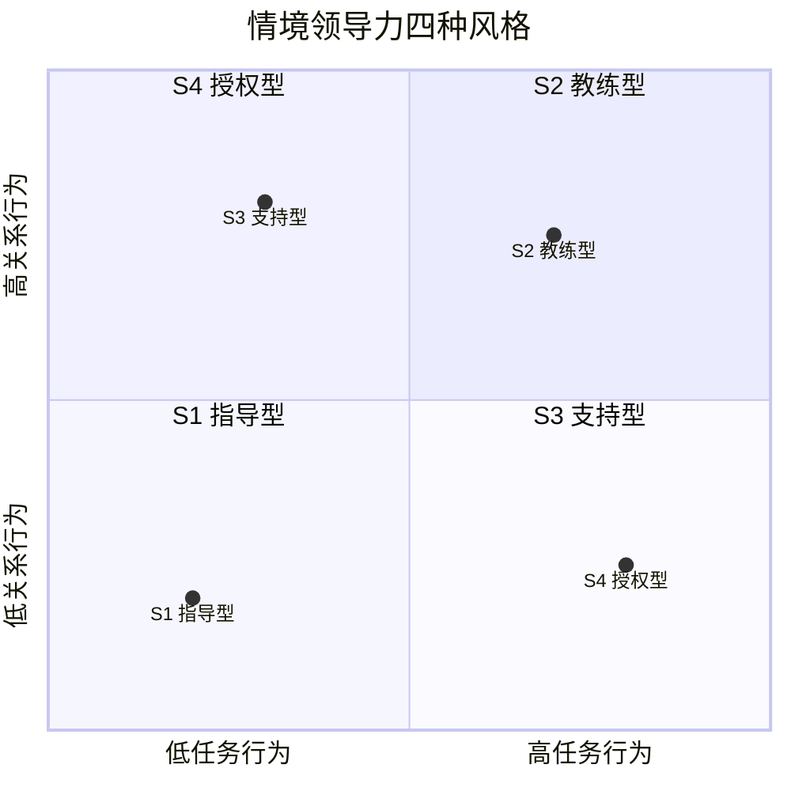
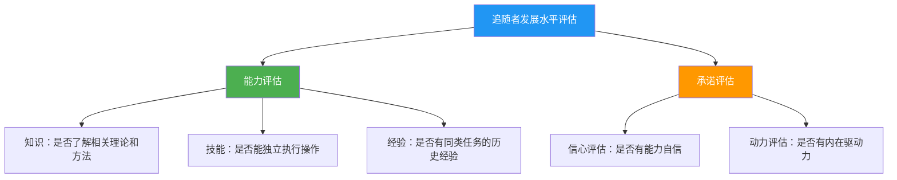
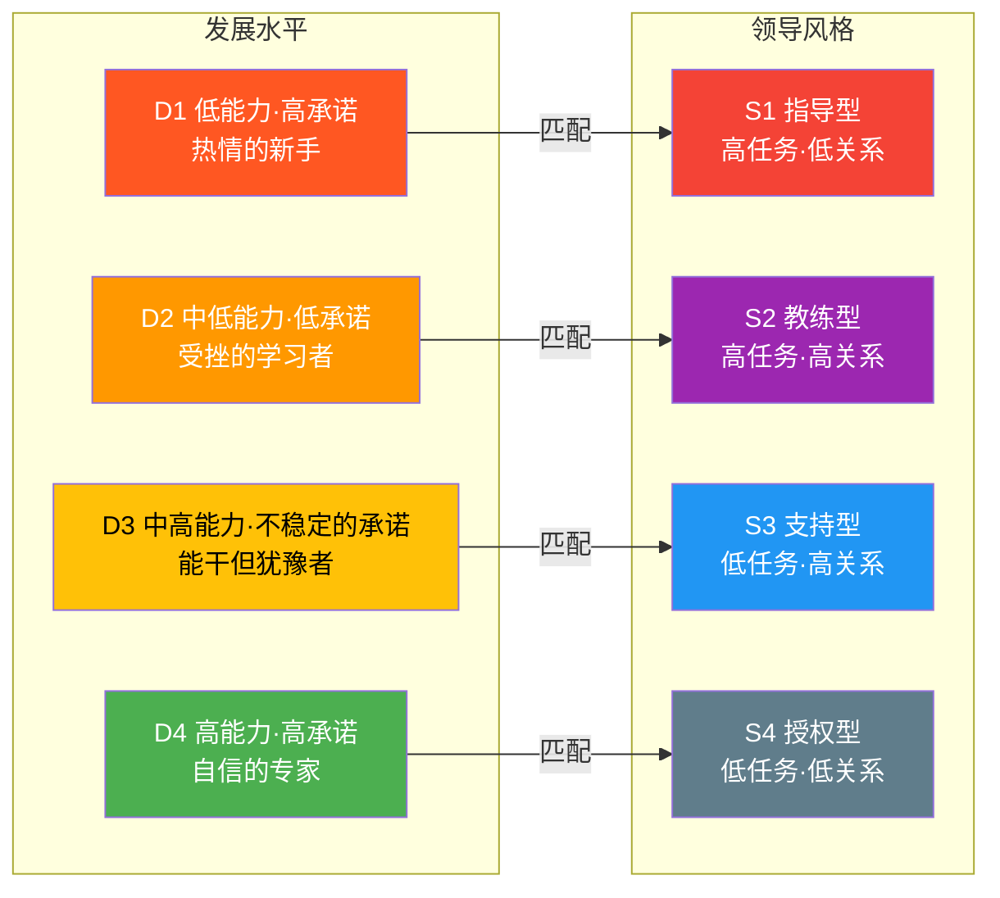

## 三、情境领导力理论（Situational Leadership）

### 理论起源与发展脉络

情境领导力理论（Situational Leadership Theory）由保罗·赫塞（Paul Hersey）和肯·布兰查德（Ken Blanchard）于1969年联合提出，最早发表在合著的《组织行为管理》（*Management of Organizational Behavior*）一书中。该理论的核心假设颠覆了当时领导力研究的主流范式——**不存在一种放之四海而皆准的"最佳"领导风格**，领导效能取决于领导者行为与下属成熟度之间的匹配程度。

这一理论的诞生有其深刻的时代背景。20世纪60年代末，俄亥俄州立大学和密歇根大学的行为学派已经识别出"任务导向"和"关系导向"两大领导行为维度，但研究结论相互矛盾：有的研究认为高任务导向更有效，有的认为高关系导向更优。赫塞和布兰查德的贡献在于引入了**第三个变量——追随者的准备度**，从而调和了这些矛盾。

理论经历了三个主要版本的迭代：

| 版本 | 时间 | 核心术语 | 关键变化 |
|------|------|----------|----------|
| Situational Leadership I (SLI) | 1969-1976 | 下属成熟度（Maturity） | 初始模型，定义M1-M4四个成熟度等级 |
| Situational Leadership II (SLII) | 1985-2003 | 发展水平（Development Level） | 改用D1-D4，强调"发展"而非"成熟"，更积极正面 |
| SLII 2.0 及后续 | 2015至今 | 发展水平 + 需求 | 整合了情境对话框架和数字化工具 |

SLII模型是目前应用最广泛的版本，本章以SLII为主要讨论框架。

### 核心框架：领导行为的两个维度

情境领导力理论将领导行为分解为两个独立维度：

**任务行为（Task Behavior / Directive Behavior）**：领导者通过单向沟通明确告诉下属做什么、怎么做、何时做、在哪里做。具体表现为设定目标、制定计划、分配角色、建立时间线、示范操作方法、检查进度等。

**关系行为（Relationship Behavior / Supportive Behavior）**：领导者通过双向沟通激活下属的内在动力和自主性。具体表现为倾听、鼓励、表扬、解释决策逻辑、征求建议、表达信任、关注情绪状态等。

这两个维度不是此消彼长的对立关系，而是可以独立调节的正交维度。由此交叉组合出四种领导风格：

### 四种领导风格深度解析

#### S1 指导型（Directing）——高任务·低关系

**行为特征**：领导者承担绝大部分决策权，提供清晰、具体的指令和操作规范。沟通模式以单向为主，重点是"做什么"和"怎么做"。关系维度的投入被有意压缩——不是冷漠，而是在有限的精力中将重点放在结构化指导上。

**核心动作**：
- 制定详细的工作计划和操作步骤
- 明确定义交付标准和验收条件
- 设定短期里程碑和频繁的检查点
- 提供具体的操作示范（"我做你看"）
- 做出所有关键决策，减少下属的选择焦虑

**沟通模板**（典型对话）：

> 领导："小王，这个客户报告需要在周五下午3点前完成。格式用我们的标准模板（链接发你了），数据从CRM系统导出，重点关注三个指标：转化率、客单价、复购率。做完先发给我看，我确认后再发给客户。中间有任何疑问随时问我，不用犹豫。"

**适用情境**：新员工入职期、团队引入全新业务领域、紧急危机处理、流程标准化阶段。

**潜在风险**：如果对已经具备能力的下属持续使用S1风格，会被感知为"微管理"（micromanagement），导致信任崩塌和人才流失。

#### S2 教练型（Coaching）——高任务·高关系

**行为特征**：领导者仍然主导决策方向（高任务），但增加了大量解释和互动（高关系）。核心变化是领导者开始回答"为什么"——不仅要告知下属怎么做，还要解释背后的逻辑和原理。鼓励下属提问和参与讨论，但最终决策权仍在领导者手中。

**核心动作**：
- 解释任务背后的"为什么"——战略意义、客户价值、业务逻辑
- 主动征求下属意见，即使最终决策可能不同
- 在小决策上给下属试错空间
- 提供频繁的正面反馈和建设性指导
- 关注下属的情绪状态和信心水平
- 使用"我做我们做"的渐进式参与

**沟通模板**（典型对话）：

> 领导："小李，你上次写的方案我看了，结构思路很好（具体肯定）。客户那边的核心诉求是降本增效，所以数据分析部分需要重点展开（解释背景）。我建议你加一个成本对比的章节，我来帮你看看数据怎么取。你先试试，有问题我们一起讨论。"

**适用情境**：有潜力但经验不足的员工处于学习期、团队成员接手新职责、需要培养继任者的过渡期。

**常见误区**：将"教练型"等同于"温和型"。S2仍然包含明确的方向引导和任务结构，不是放任自流的"鼓励式管理"。

#### S3 支持型（Supporting）——低任务·高关系

**行为特征**：领导者减少对具体工作的指令和控制（低任务），将更多精力放在激励、倾听和情感支持上（高关系）。决策权大幅下移，领导者更多扮演"资源提供者"和"信心建设者"的角色。

**核心动作**：
- 将决策权交给下属，提供必要资源支持
- 倾听下属的困惑和挫折感，不急于给答案
- 通过提问帮助下属自己找到解决方案
- 公开认可下属的专业能力和贡献
- 创造安全的试错环境，降低心理负担
- 关注下属的职业发展需求和个人状态

**沟通模板**（典型对话）：

> 领导："老张，这个项目的整体方案你来定就好。我看了你上次的执行计划，很扎实。你觉得哪个部分可能需要协调资源？……行，市场部那边我来帮你打招呼。你自己把控节奏，我支持你的判断。"

**适用情境**：有能力但信心不足或动力下降的员工、经历组织变革导致士气低落的团队、资深员工遇到暂时性瓶颈。

**深层逻辑**：为什么高能力的员工会突然失去动力？常见触发因素包括：晋升受挫、薪酬不满、工作重复感、家庭变故、组织架构调整带来的不确定感。S3风格的本质是**通过关系维度的支持重建下属的内在动机**。

#### S4 授权型（Delegating）——低任务·低关系

**行为特征**：领导者在任务和关系两个维度上都减少介入。这不是"甩手掌柜"式的放任，而是在充分评估下属能力和意愿后，将完整的所有权交给对方。领导者的角色转变为"资源在需要时可及"的后盾。

**核心动作**：
- 将目标、权限和责任一并交付
- 约定里程碑和汇报机制，但不干预过程
- 明确表态："这是你的项目，你做主"
- 在下属主动求助时才介入
- 定期回顾结果而非监控过程

**沟通模板**（典型对话）：

> 领导："老陈，下周的产品发布会你全权负责。预算30万，目标触达5000名潜在客户。方案和供应商你来定，有需要我签字的随时发我。我对你完全放心。"

**适用情境**：高度成熟的骨干员工、长期稳定运营的标准化流程、创始人对核心联合创始人的授权。

**关键前提**：S4不是"不管"，而是"在确定对方值得信任的前提下选择性不介入"。如果下属在S4下出了问题，领导者需要退回S3甚至S2，而不是直接跳到S1进行微观管控。

### 追随者准备度/发展水平的精确评估

情境领导力的有效应用，前提是**准确评估下属的准备度**。SLII模型用"发展水平"（Development Level）替代了早期的"成熟度"概念，包含两个子维度：

**能力（Competence）**：下属在特定任务上表现出来的知识、技能和经验，可以通过培训、教育和实践获得。注意，能力是**任务特定的**——同一个员工在不同任务上可能处于不同的能力水平。

**承诺（Commitment）**：下属对特定任务表现出的信心和动力的组合。信心是"我能做到"的自我效能感，动力是"我愿意做"的内在驱动力。承诺同样是**情境特定的**。

**四个发展水平的精确画像**：

| 发展水平 | 能力 | 承诺 | 典型画像 | 典型表现 |
|----------|------|------|----------|----------|
| D1 | 低 | 高 | 热情的新手 | 充满激情但缺乏技能，愿意加班学习，但容易犯错 |
| D2 | 中低 | 低 | 受挫的学习者 | 学了一段时间发现比想象中难，信心和动力都在下降 |
| D3 | 中高 | 不稳定 | 能干但犹豫者 | 已经具备独立工作的能力，但信心不够稳定，时而积极时而退缩 |
| D4 | 高 | 高 | 自信的专家 | 既有能力又有热情，可以独立决策和执行 |

**评估方法和实操工具**：

1. **行为观察法**：观察下属在具体任务中的表现，而非笼统印象
   - D1标志：频繁提问基础问题、犯低级错误、对反馈热情接受
   - D2标志：拖延任务、抱怨任务难度、开始质疑自己
   - D3标志：能力波动明显、需要确认和鼓励、在关键决策上犹豫
   - D4标志：主动承担、高质量交付、乐于分享经验

2. **结构化对话法**：用以下问题进行一对一评估
   - "这个任务你之前做过类似的吗？"（评估经验）
   - "你觉得最大的挑战在哪里？"（评估能力认知）
   - "你对完成这个任务有信心吗？"（评估信心）
   - "你对这个方向感兴趣吗？"（评估动力）

3. **任务分解评估**：同一个员工可能在不同子任务上处于不同发展水平。例如，一个资深工程师在技术实现上是D4，但在跨部门沟通上可能是D1。

### 风格与发展水平的匹配模型

**匹配原则**不是固定的"一人一风格"，而是**"一人一任务一风格"**。同一个下属，在不同的任务上可能需要不同的领导风格。一个在技术方案上高度成熟的D4员工，在首次做项目预算时可能是D1。

### 情境领导力在沟通中的实操应用

#### 沟通风格转换的具体技巧

**S1指导型的沟通要点**：
- **语言特征**：祈使句为主，信息密度高，结构化强
- **典型句式**："你需要做X，按照Y标准，在Z时间前完成"
- **频率**：高频沟通（每日甚至半天一次），持续时间短（5-15分钟）
- **媒介**：面对面或视频 > 文字消息（新手需要看到示范和表情）
- **反馈模式**：即时、具体、纠正性为主（"这个数据需要核实来源"）

**S2教练型的沟通要点**：
- **语言特征**：祈使句+疑问句混合，信息密度中等
- **典型句式**："我建议你做X，因为……你怎么看？"
- **频率**：中高频沟通（每周2-3次），持续时间中等（15-30分钟）
- **媒介**：面对面/视频为主，配合文字材料
- **反馈模式**：先肯定再建议，解释改进背后的原因

**S3支持型的沟通要点**：
- **语言特征**：疑问句和陈述句为主，信息密度低，关系密度高
- **典型句式**："你觉得呢？""我支持你的决定""需要我帮什么忙？"
- **频率**：中低频沟通（每周1次深度对话），持续时间灵活
- **媒介**：下属偏好决定（有些人喜欢面谈，有些人喜欢非正式场合）
- **反馈模式**：以正面反馈为主，关注感受和状态

**S4授权型的沟通要点**：
- **语言特征**：声明句和开放性问题
- **典型句式**："你全权负责""有需要随时找我""结果导向"
- **频率**：低频沟通（月度回顾或里程碑节点），由下属主导频率
- **媒介**：书面报告 > 面谈（减少对下属工作节奏的干扰）
- **反馈模式**：结果导向，回顾性总结

#### 真实场景案例分析

**案例一：初创公司的技术总监带领实习生**

某互联网初创公司技术总监老刘，手下有一个大三实习生小陈。小陈计算机科班出身，在校成绩优秀，对编程充满热情，但从未参与过真实的商业项目。

**评估**：小陈在编码能力上处于D1（有理论基础但缺乏实践经验），承诺水平高（热情满满、主动要求挑战性任务）。匹配S1指导型。

**实际操作**：
1. 第一周：老刘亲自带小陈走完一个完整的需求-开发-测试-上线流程（"我做你看"）
2. 第二周：给小陈分配简单的bug修复任务，每天花15分钟review代码并讲解修改逻辑
3. 第三周起：逐步增加任务复杂度，从bug修复到小功能开发
4. 第四周评估：小陈编码能力提升到D2水平，开始出现"这比我想的难"的情绪，老刘转入S2教练型

**关键转折**：老刘没有因为小陈"聪明"就跳过S1阶段直接给大任务。能力和经验是两回事——理论知识不等于工程实践。

**案例二：销售团队的季节性士气波动**

某B2B销售公司区域经理张总管理8人销售团队。Q1是行业淡季，团队中3名资深销售（D4）在Q4冲量后精疲力竭，出现倦怠迹象；2名新人（D1-D2）对淡季目标感到迷茫。

**评估与策略**：
- 对3名资深销售：从S4退回S3。减少目标压力，增加一对一关怀对话，关注职业倦怠信号，安排弹性工作时间和学习机会
- 对2名新人：维持S1-S2指导型。利用淡季加强培训，安排资深销售带教
- 对其余3名中等水平销售：维持S2-S3，根据各自状态灵活调整

**三个月后结果**：淡季结束后，资深销售恢复活力，新人能力显著提升，Q2业绩同比增长15%。

**案例三：跨文化团队的领导风格调适**

某跨国企业中国区总监王总管理一个包含本地员工和外籍专家的混合团队。一位法国籍数据科学家Pierre（D4能力，但因文化差异和语言障碍在跨部门协作上处于D2水平）。

**分析**：不能笼统地对Pierre使用S4授权。在技术决策上继续S4，但在跨部门沟通上需要S2教练型——帮他理解中国企业的决策逻辑、汇报习惯和人情文化。

### 常见误区与纠正方法

**误区一：把"风格"等同于"性格"**

❌ 错误认知："我性格内向，所以天生适合S3或S4，做不了S1"

✅ 正确认知：情境领导力的风格是**行为选择**，不是性格表现。内向的领导者可以通过邮件和文档提供S1级别的清晰指导，外向的领导者也可以在需要时克制自己的介入欲望做到S4。关键不是"你是谁"，而是"下属需要什么"。

**误区二：认为S4是终极目标**

❌ 错误认知："好领导就是充分授权，管得越少越好"

✅ 正确认知：S4只是**四种有效风格之一**。在下属处于D1时过度授权等于放任自流；在危机情境中过度授权可能导致灾难。有效的领导者需要在四种风格之间灵活切换，而非执着于某一种。

**误区三：忽视发展水平的情境特定性**

❌ 错误认知："他是资深工程师，所以所有事都用S4"

✅ 正确认知：能力是**任务特定的**。一个资深工程师在技术方案上是D4，但首次负责招聘面试可能是D1，首次做预算管理可能是D2。领导者需要按任务维度分别评估，而非给人贴一个笼统的标签。

**误区四：只关注能力，忽视承诺**

❌ 错误认知："他能力够了，就不用管了"

✅ 正确认知：承诺（信心+动力）是独立于能力的维度。一个高能力的员工可能因为晋升受挫、家庭变故或组织变革而陷入D3甚至D2。忽视承诺维度是大量管理失败的根源。

**误区五：风格切换过于突兀**

❌ 错误认知：昨天还S1指导，今天突然变成S4授权

✅ 正确认知：风格切换应该是渐进的。从S1到S2，领导者增加关系维度的投入；从S2到S3，逐步减少任务维度的介入。突然的风格跳跃会让下属感到困惑甚至被抛弃。

**误区六：对整个团队用同一种风格**

❌ 错误认知："我是教练型领导，对所有人都用S2"

✅ 正确认知：情境领导力是**个人化**的管理方法。同一个团队里，对新手用S1，对受挫者用S2，对倦怠者用S3，对骨干用S4。笼统地对所有人施加同一种风格，本质上是懒惰的管理。

### 与其他领导力理论的整合

情境领导力不是孤立存在的理论，它与其他领导力模型有深刻的互补关系：

| 理论 | 与情境领导力的关系 | 整合方式 |
|------|-------------------|----------|
| 变革型领导力 | 变革型领导侧重"为什么"，情境领导侧重"怎么做" | 在S2和S3中注入变革型领导的愿景激励 |
| 仆人式领导力 | 仆人式领导强调服务追随者 | 在所有风格中都以服务心态为底层 |
| 路径-目标理论 | 路径-目标理论同样强调情境匹配 | 情境领导力提供更精细的发展水平评估工具 |
| 领导力梯队 | 领导力梯队描述不同管理层级的能力需求 | 领导者自身也需要在不同层级调整情境领导的应用 |
| 教练技术（GROW模型） | 教练技术是S2/S3的具体执行工具 | 在S2/S3中使用GROW（目标-现状-选项-意愿）框架进行对话 |

### 理论的局限性与批判性思考

任何理论都有其适用边界，情境领导力理论也不例外：

**局限一：评估的主观性**。对下属发展水平的评估高度依赖领导者的主观判断，不同领导者可能对同一个下属得出截然不同的评估结论。缓解方法：使用结构化评估工具，引入360度反馈，定期校准评估。

**局限二：对"授权型"过度乐观**。理论假设D4下属只需要极少的领导介入，但现实中即使是D4员工也需要战略方向、组织资源和情感连接。特别是在高压环境下，D4员工也会出现承诺下降。

**局限三：文化适应性不足**。该理论诞生于美国文化背景下，对权力距离（power distance）较高的文化（如东亚、中东）的适用性存在争议。在高权力距离文化中，下属可能更习惯接受指令而非被授权，S4风格可能导致下属感到"被忽视"而非"被信任"。

**局限四：对复杂任务的简化**。真实工作任务很少是单一维度的。一个复杂的项目可能包含多个子任务，每个子任务的难度和下属的能力都不同。简单地将"项目"作为一个整体来评估发展水平，可能过于粗糙。

**局限五：动态性被低估**。理论暗示发展水平是相对稳定的，但实际上它会因为外部事件（组织变革、个人危机、市场变化）而快速波动。领导者需要持续、高频地重新评估，而非一评了之。

### 进阶：建立团队级情境领导力系统

对于管理5人以上团队的领导者，逐个评估和切换风格的效率很低。以下是将情境领导力系统化的进阶方法：

**第一步：建立团队能力矩阵**

用一张表格记录每个成员在每项核心任务上的发展水平，每月更新一次。

| 成员 | 技术方案 | 项目管理 | 客户沟通 | 团队培训 | 战略规划 |
|------|----------|----------|----------|----------|----------|
| 成员A | D4 | D3 | D2 | D1 | D1 |
| 成员B | D3 | D4 | D4 | D3 | D2 |
| 成员C | D2 | D1 | D3 | D2 | D1 |

**第二步：设计标准化的风格切换触发机制**

- 任务分配时自动匹配领导风格
- 建立"信号清单"——当观察到特定行为信号时自动触发风格切换
- 例：当D2下属开始主动分享经验→从S2切换到S3

**第三步：培养团队成员的自我评估能力**

最终目标是让下属能够主动识别自己的发展水平，并与领导者协商所需的领导风格。这将情境领导力从"自上而下的管理工具"进化为"双向的协作协议"。

**第四步：将情境领导力融入团队文化**

- 在一对一会议中定期讨论发展水平变化
- 在项目复盘中引入"这个任务我需要什么样的支持"的讨论
- 在新项目启动时，团队成员主动声明自己在各子任务上的发展水平和所需支持类型

### 本节小结

情境领导力理论的核心价值不在于提供了一套"标准答案"，而在于提供了一个**思考框架**：在决定如何领导之前，先评估追随者的状态。这个框架的精髓可以用一句话概括——**领导力不是你做了什么，而是下属需要你做什么**。

关键知识点回顾：
1. 领导行为有任务和关系两个独立维度，可以自由组合
2. 追随者的发展水平包含能力（知识+技能+经验）和承诺（信心+动力）两个子维度
3. 四种领导风格（S1-S4）分别匹配四种发展水平（D1-D4），匹配关系是核心
4. 同一个员工在不同任务上可能处于不同发展水平，需要按任务维度分别评估
5. 风格切换应该是渐进的、基于持续观察的，而非一步到位的
6. 最终目标是培养下属的自我评估能力，让情境领导力成为双向协作协议
