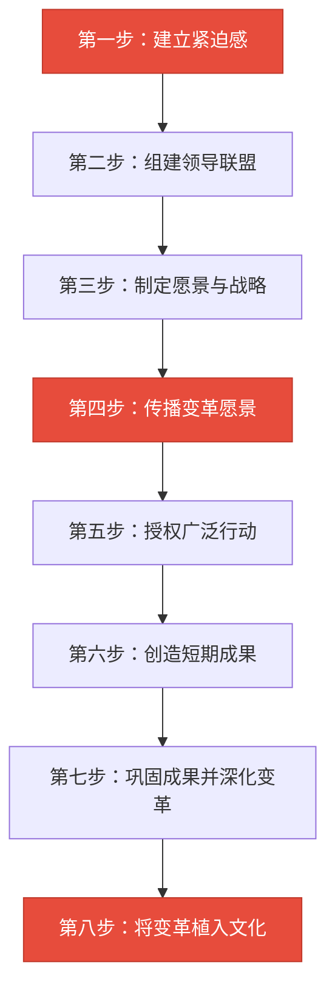
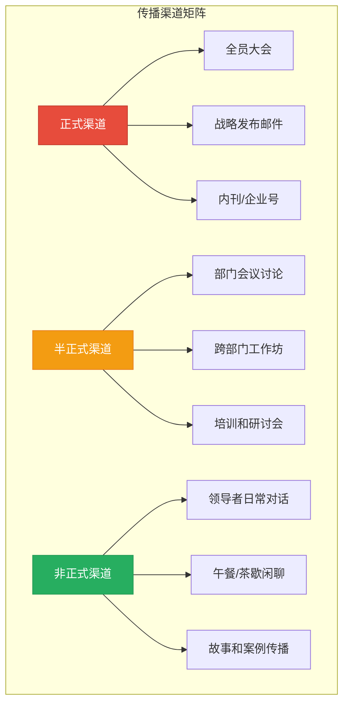
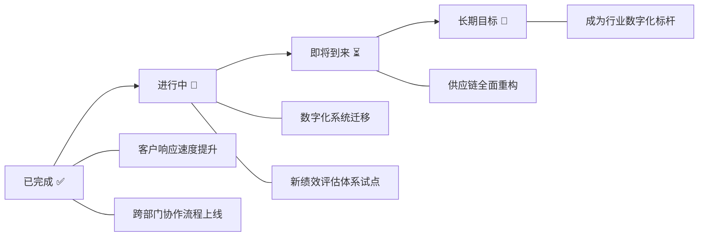
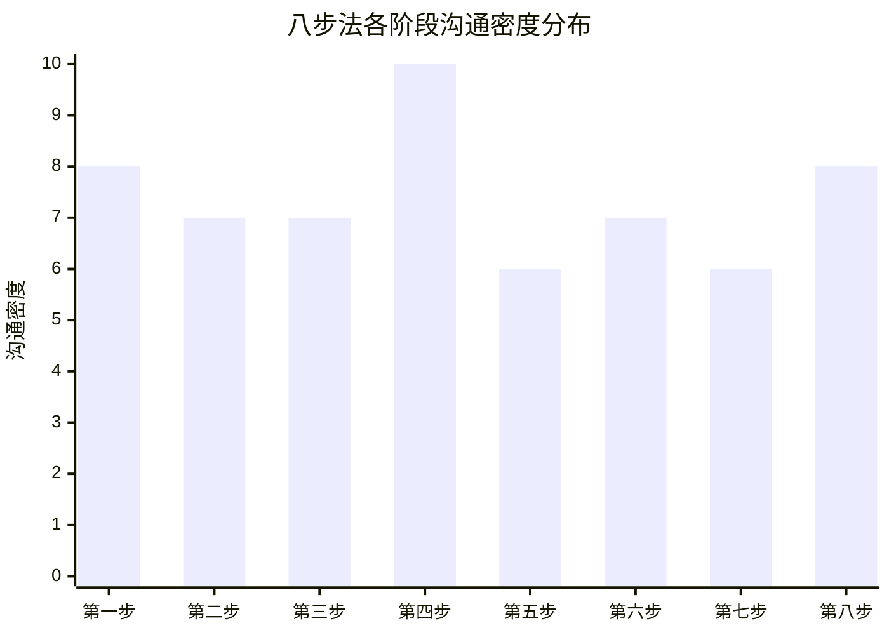

## 四、科特的变革管理八步法中的沟通

### 为什么变革管理绕不开科特

在组织变革理论的谱系中，约翰·科特（John P. Kotter）的八步法是最具影响力且被广泛验证的框架之一。科特是哈佛商学院松下幸之助领导力教席教授，他在1996年出版的《领导变革》（*Leading Change*）中提出了这一模型，后来在2014年的《变革加速器》（*Accelerate*）中进一步完善。

科特的研究起点是一个令人警醒的数据：**70%的组织变革项目以失败告终**。他花了数十年时间研究100多家企业——包括通用电气、壳牌、苹果等——试图找出成功变革与失败变革之间的分水岭。结论是：**失败的核心原因不是战略错误，而是沟通失灵**。领导者往往高估了"宣布变革"的效果，低估了"推动人心转变"所需的沟通投入。

这一章将逐步拆解八步法中的每一个沟通机制，不仅解释"是什么"，更深入到"怎么做到"。

---

### 八步法的完整框架

> 红色节点标注的三步（第一步、第四步、第八步）是沟通密度最高的关键环节，但正如科特所强调的，**沟通贯穿所有八个步骤**，没有任何一步可以脱离有效的沟通独立完成。

---

### 第一步：建立紧迫感（Establishing a Sense of Urgency）

#### 沟通目标

让组织中的每一个人——从高管到一线员工——真实感受到"不变革就危险"。紧迫感不是制造恐慌，而是用事实和数据取代盲目乐观。

#### 沟通机制详解

**数据驱动的坦诚对话。** 科特观察到，变革失败的组织往往存在大量"避讳话题"——利润率下降被归因于"周期性波动"，市场份额流失被解释为"统计口径差异"。建立紧迫感的第一步就是打破这些自我安慰的叙事。

具体做法包括：

| 沟通手段 | 具体操作 | 预期效果 |
|---------|---------|---------|
| 市场数据发布会 | 展示竞争对比、客户流失率、行业趋势数据 | 用事实冲击认知舒适区 |
| 客户反馈直通 | 让高管直接阅读/聆听未经过滤的客户投诉 | 建立情感层面的紧迫感 |
| 离职面谈分析 | 汇总并公开关键人才离职的真实原因 | 揭示组织吸引力下降的事实 |
| 竞争对手对标 | 邀请外部专家分析竞品动态 | 打破"我们还不错"的幻觉 |
| 跨部门问题诊断会 | 让各部门互相暴露协作痛点 | 从内部视角看见效率黑洞 |

**"燃烧的平台"叙事的正确用法。** 很多领导者听说过"burning platform"（燃烧的平台）的概念——一个石油钻井平台着火时，工人被迫跳入冰冷海水求生的故事。但科特警告说，单纯的恐惧叙事会导致恐慌性行为而非建设性行动。正确的做法是"恐惧+希望"的双轨沟通：先展示不变革的代价，再暗示变革后可能达到的美好状态。

#### 常见失败模式

- **沟通不足型**：CEO在季度会上用三句话提了一下"我们需要变革"，然后就进入了下一步。科特指出，组织中至少需要**75%的管理层**真正认同紧迫感，变革才有足够推动力。
- **过度恐吓型**：反复强调"公司要完了"，导致核心人才开始投简历，紧迫感变成了流失加速器。
- **数据堆砌型**：PPT塞满50页数据图表，但没有一条清晰的"so what"信息，听众看完毫无触动。

#### 实操模板：紧迫感沟通话术框架

【情境描述】
"过去18个月，我们的市场份额从32%下降到了26%。"
（用具体数据，不用"有所下降"这类模糊表达）

【原因分析】
"主要原因是三个新进入者用数字化手段重新定义了客户体验。"
（指向具体、可理解的原因，不归咎于抽象的'市场变化'）

【不变革的代价】
"如果按当前速度，12个月后我们的份额将低于20%，触发供应链协议中的惩罚条款。"
（将后果具体化、可量化、有时间节点）

【变革的窗口】
"但我们还有时间。我们的技术储备和客户基础仍然是行业最强的之一。"
（在紧迫感中保留希望，避免绝望）

---

### 第二步：组建领导联盟（Creating a Guiding Coalition）

#### 沟通目标

识别并说服组织中最有影响力的个体加入变革领导核心。"有影响力"不等于"职位最高"——科特特意强调，联盟成员需要包括三类人：**职位权力**（高管）、**专业权威**（技术/业务骨干）、**人际网络**（被同事信赖的非正式领袖）。

#### 沟通机制详解

**一对一定向说服。** 组建联盟不能用群发邮件或全员大会的方式。每一位潜在成员都需要个性化的沟通策略：

对于不同动机类型的联盟候选人，沟通策略截然不同：

| 动机类型 | 典型特征 | 沟通切入点 | 需要避免 |
|---------|---------|-----------|---------|
| 事业驱动型 | 渴望更大的影响力和职业发展 | 强调变革成功后的角色升级和行业影响力 | 不要暗示这是"额外负担" |
| 使命驱动型 | 关心组织的长期存续和员工福祉 | 展示不变革对员工和客户的真实影响 | 不要过度强调个人利益 |
| 专业驱动型 | 为自己的专业判断被忽视而不满 | 邀请其贡献专业洞见，赋予技术决策权 | 不要让其感觉被"利用" |
| 关系驱动型 | 团队和谐比个人成就更重要 | 强调变革将改善团队协作和文化 | 不要制造对立和竞争氛围 |

**联盟的信任建设。** 科特观察到，领导联盟最常见的失败是"名义联盟"——成员在名义上同意参与，但实际行为中保持观望。避免这种情况的关键是首次联盟会议的设计：不要直接进入"讨论战略"，而是先花时间让成员分享各自观察到的组织痛点。这种交换创造的共同认知基础远比一份PPT更有黏合力。

#### 实操清单：联盟组建沟通计划

1. 列出组织影响力地图（formal + informal power map）
2. 对每位候选人进行动机分析（至少需要了解：职业目标、对现状的态度、最大的顾虑）
3. 预约一对一咖啡/午餐对话（非正式场景，降低防御心理）
4. 对话中遵循"倾听-共情-邀请"节奏，不急于推销愿景
5. 获得口头承诺后，安排联盟首次闭门会议
6. 首次会议议程：现状痛点分享（60%）→ 共识建立（20%）→ 角色讨论（20%）

---

### 第三步：制定愿景与战略（Developing a Vision and Strategy）

#### 沟通目标

将变革方向从模糊的"我们要变好"提炼为清晰的、可传达的、有吸引力的愿景和可执行的战略。科特特别强调，愿景不是CEO一个人写出来的，它是领导联盟通过深度对话和反复迭代共同锻造的。

#### 沟通机制详解

**愿景的六个检验标准。** 科特提出，一个有效的变革愿景必须同时满足：

1. **可想象的**（Imaginable）：能描绘出未来的清晰画面，而非抽象的数字目标
2. **值得向往的**（Desirable）：对所有关键利益相关者——员工、客户、股东——都有吸引力
3. **可行的**（Feasible）：既不是异想天开，也不是保守到让人无感
4. **聚焦的**（Focused）：清晰到可以指导决策，但不僵化到排除灵活性
5. **可传达的**（Communicable）：能在5分钟内让任何人理解
6. **有弹性的**（Flexible）：允许个体根据自身情况灵活执行

**战略讨论中的沟通艺术。** 战略讨论容易陷入两种极端：一是CEO独裁式决策，联盟成员只是"被告知"；二是无休止的民主讨论，迟迟无法达成共识。科特推荐的沟通模式是"有序争论+决断"：

【阶段一：信息收集】（1-2次会议）
- 每位联盟成员从自己的专业领域呈现数据和判断
- 规则：只陈述事实和分析，不急于提方案

【阶段二：方案生成】（2-3次会议）
- 鼓励多元方案，不急于收敛
- 使用"红色团队"（red team）方法：专门有人负责挑刺

【阶段三：决策收敛】（1次关键会议）
- 主持人引导明确的投票或表态
- 一旦决定，所有联盟成员在外部保持一致口径

---

### 第四步：传播变革愿景（Communicating the Change Vision）

#### 沟通目标

这是八步法中**沟通密度最高**的一步。科特用了一个数字来说明问题：大多数变革失败的组织，其领导者在愿景沟通上的投入大约是成功组织的**1/10到1/50**。

#### 沟通机制详解

**"七次法则"与多渠道覆盖。** 科特发现，人们需要**至少7次**听到同一个核心信息，才能真正理解并内化它。而且这7次不能是同一种方式的7次重复——需要通过多种渠道、多种形式、从不同的人口中传递。

科特的洞见是：**非正式渠道的影响力往往大于正式渠道**。员工对CEO在全员大会上的演讲半信半疑，但会认真对待自己直属领导在茶歇时的一句话。因此，传播愿景的关键不只是让CEO讲得更好，而是让愿景**渗透到组织中每一层的日常对话中**。

**"言行一致"的放大效应。** 科特反复强调一个简单但常被忽视的原则：**行动是最强的沟通**。如果领导者宣称"我们要以客户为中心"，但随后批准了一个削减客服预算的方案，那么所有的口头沟通都会被这一个行动抵消。他举了这样一个对比：

| 场景 | 言行一致 | 言行不一 |
|------|---------|---------|
| 削减成本 | 领导者先削减自己的办公室预算，再要求全员降本 | 领导者要求全员降本，但自己的差旅标准不变 |
| 客户至上 | 高管每月亲自处理10个客户投诉 | 高管只在年度报告中提"客户至上" |
| 创新驱动 | 管理层专门留出20%时间让团队做实验 | 管理层口头上鼓励创新，KPI却只考核短期产出 |

**愿景的一句话测试。** 科特要求变革领导者做这样一个测试：随机找到一个一线员工，用30秒告诉他"我们为什么要变革、要变成什么样"。如果他说不清楚，说明愿景的传播还不够。一个经典的30秒愿景模板：

"我们正在从【现状】转向【未来状态】，因为【紧迫原因】。
这个变化意味着每个人将【个人获益】。
第一步是【具体行动】。"

示例："我们正在从'产品驱动'转向'客户体验驱动'，因为市场数据显示客户在流失。这个变化意味着每个人的工作都会和客户满意度直接挂钩。第一步是每个部门选定一个客户痛点，在30天内拿出改进方案。"

---

### 第五步：授权广泛行动（Empowering Broad-Based Action）

#### 沟通目标

消除阻碍变革的制度性、心理性和结构性障碍。这一步的沟通核心是**倾听**而非讲述——领导者需要识别障碍在哪里，然后通过沟通将其拆除。

#### 沟通机制详解

**"障碍诊断"对话。** 科特建议领导者定期进行结构化的障碍收集对话，而不是被动等待问题浮现。有效的障碍诊断对话模板：

【问题1】"在执行变革的过程中，你遇到的最大阻力是什么？"
【问题2】"这个阻力来自制度、资源、技能还是态度？"
【问题3】"如果我能改变一件事来帮你推进，你希望是哪一件？"
【问题4】"有没有一些聪明的做法你已经在尝试，但缺乏支持？"

**"安全空间"的创建。** 授权行动需要员工敢于尝试和犯错。科特举了一个关键案例：一位事业部总经理在推行数字化转型时，每周举行"最佳失败分享会"——团队成员分享自己本周尝试过但没成功的事情，最佳"失败"获得奖励。这个做法用沟通创造了一种心理安全感，使得创新行为从个别人的冒险变成了团队的常态。

**跨部门障碍的沟通协调。** 科特发现，最顽固的变革障碍往往出现在部门交界处。A部门的变革方案恰好卡在B部门的审批流程中，而B部门并不了解A部门变革的紧迫性。解决方案是建立"跨部门变革联络人"制度，每个部门指定一位联络人，定期进行跨部门障碍协调沟通。

---

### 第六步：创造短期成果（Generating Short-Term Wins）

#### 沟通目标

用可见、可衡量的早期成功来巩固变革信心，反驳怀疑者。科特指出，变革的第6到18个月是最危险的"怀疑期"——新流程已经开始执行，但最终成果还未显现，此时反对者会试图用各种论据证明"变革没有用"。短期成果的沟通是对抗这种叙事的最有力武器。

#### 沟通机制详解

**成果选择的三个标准。** 不是所有的小胜利都值得大张旗鼓地宣传。科特建议选择满足以下三个标准的成果进行重点沟通：

1. **可见性高**：让尽可能多的人能看到这个成果（而不是只有相关部门知道）
2. **与愿景相关**：成果必须能清楚地连接到变革愿景（而不是"碰巧也有改善"）
3. **难以被反驳**：成果必须是客观可衡量的，不能被反对者解释为"统计波动"

**成果传播的"故事化"技巧。** 单纯的数据报告（"客户满意度提升12%"）远不如一个具体的故事有冲击力。科特推荐"STAR故事法"：

S（情境）："上个季度，我们的华东区团队面临客户投诉激增的问题..."
T（任务）："团队决定利用新推出的快速响应机制来处理这些投诉..."
A（行动）："他们在48小时内回访了每一位投诉客户，并在72小时内给出解决方案..."
R（结果）："投诉处理满意度从38%飙升到87%，其中3个流失客户重新签约。"

**庆祝的分寸感。** 科特警告一个微妙的陷阱：庆祝短期成果时不能暗示"胜利已经到来"。措辞应该是"这证明我们走在正确的路上"，而不是"看，变革已经成功了"。后者会让人们放松警惕，为第七步的推进制造阻力。

---

### 第七步：巩固成果并深化变革（Consolidating Gains and Producing More Change）

#### 沟通目标

防止过早宣布胜利，并利用短期成果带来的信心和推动力，推进更深层次、更困难的变革。科特把这一步比作"在诺曼底登陆后不要宣布二战胜利"——早期成果只是滩头阵地，真正的战役才刚开始。

#### 沟通机制详解

**"还有多远"的透明沟通。** 到了第七步，变革已经取得了一些成果，组织中的"变革疲劳"开始出现。人们会问"我们还要折腾多久"。科特的建议是进行"变革地图"式的沟通——清晰展示已完成的里程碑、正在进行的工作、以及剩余的关键节点。

**引入新变革力量。** 科特在这一步提出了一个反直觉的建议：主动招募新的变革推动者。在第一步和第二步中组建的领导联盟可能已经疲倦，或者其影响力已经耗尽。此时需要新鲜血液——可以是新晋升的管理者、外部引入的人才、或者在前几步中因看到成果而主动涌现的拥护者。关键的沟通动作是**公开认可**他们的加入，赋予他们正式的角色和权力。

**"变革日历"的建立。** 科特建议将关键的变革里程碑编入组织的正式日历——就像财务季度报一样定期回顾。这让变革成为组织常规节奏的一部分，而不是一个随时可能被遗忘的"项目"。

---

### 第八步：将变革植入文化（Anchoring New Approaches in the Culture）

#### 沟通目标

让变革成果从"需要刻意维持的项目"变成"自然而然的做事方式"。这是最后一步，也是最容易被跳过的一步。科特警告：如果跳过这一步，组织会在3-5年内悄然回到旧习惯。

#### 沟通机制详解

**故事是最强大的文化载体。** 科特观察到，每个组织文化的核心都是一系列"我们的故事"——"当年创始人是如何..."、"那次危机中我们的团队..."。将变革植入文化的最有效方式，就是创造并传播属于变革的新故事。

具体策略包括：

| 文化锚定手段 | 具体做法 | 效果 |
|------------|---------|------|
| 变革英雄叙事 | 整理并传播变革中涌现出的标杆人物故事 | 为"新的做事方式"提供具象化的行为榜样 |
| 新员工入职故事 | 在入职培训中加入变革故事模块 | 让新成员从第一天就理解"我们为什么这样做事" |
| 领导者口头禅 | 制定并推广与变革一致的日常用语 | 语言塑造思维，日常用语是文化最微观的载体 |
| 仪式和传统 | 创建与变革相关的年度仪式（如创新日、客户之声周） | 用重复性活动强化文化记忆 |
| 招聘标准更新 | 将变革所需的行为特质纳入招聘评估 | 从入口确保新成员与新文化兼容 |

**制度与文化的一致性检验。** 科特提出了一个实用的检验方法：审视组织的所有正式制度——晋升标准、绩效考核、薪酬结构、决策流程——问一个问题："这些制度是在奖励变革后的行为，还是在奖励变革前的行为？"如果一个销售组织宣称"我们转向长期客户关系"，但销售奖金仍然只看当季签约额，那么文化变革就只是嘴上说说。

---

### 科特模型中的沟通密度分布

理解八步法中沟通强度的分布，有助于合理分配领导者的沟通精力：

第四步（传播愿景）是沟通密度的绝对高峰——科特建议在这一步，领导者应该将**至少50%的工作时间**用于各种形式的愿景沟通。第一步（建立紧迫感）和第八步（文化植入）紧随其后，分别对应变革的起点和终点。

---

### 科特模型的局限性与适用边界

没有哪个模型是万能的。科特八步法在以下场景中效果最佳，也需要了解其局限：

**最佳适用场景：**

- 大型组织（500人以上）的战略性变革
- 自上而下推动的变革（需要高层领导者的深度参与）
- 有明确方向和终点的变革（如数字化转型、业务模式转型）
- 企业文化相对保守、需要"催化剂"推动的组织

**局限性：**

| 局限 | 说明 | 补充模型 |
|------|------|---------|
| 假设自上而下权力 | 科特模型的核心假设是变革由高层发起和推动 | 对于自下而上的变革，参考彼得·圣吉的"学习型组织"模型 |
| 线性假设 | 八步法暗示了先后顺序，但现实中的变革往往是混沌和迭代的 | 科特本人在《变革加速器》中修正为"双操作系统"模型 |
| 沟通仍被当作"传导" | 科特的沟通框架本质上仍是"领导者→追随者"的单向传播 | 补充以"对话型领导力"（Dialogic Leadership）的双向互动视角 |
| 对远程/分布式组织覆盖不足 | 模型形成于面对面工作为主的时代 | 需要结合数字化协作工具和异步沟通策略 |

---

### 与其他变革模型的对比

| 维度 | 科特八步法 | ADKAR模型 | 勒温三阶段 | 敏捷变革 |
|------|-----------|----------|-----------|---------|
| 提出者 | John Kotter | Prosci/Jeff Hiatt | Kurt Lewin | 多人演化 |
| 视角 | 组织/领导者 | 个人 | 系统 | 团队 |
| 沟通角色 | 贯穿全程的核心引擎 | 意识和知识阶段的工具 | 解冻阶段的关键 | 持续反馈循环 |
| 最适场景 | 大型组织战略变革 | 个人层面的变革管理 | 系统性阻力分析 | 快速迭代的小团队 |
| 步骤数 | 8步 | 5要素 | 3阶段 | 持续循环 |
| 对沟通的假设 | 领导者主导的多渠道传播 | 针对个人的认知-情感-行为路径 | 打破旧平衡需对话 | 自组织的透明沟通 |

---

### 实操工具箱

#### 工具一：变革沟通计划模板

【变革名称】：_________________________
【变革目标】：_________________________

阶段一：紧迫感建立（第1-4周）
├── 数据收集：列出5个最能说明问题的数据点
├── 利益相关者分析：识别支持者、中立者、反对者
├── 沟通活动：
│   ├── Week 1: 高管闭门对齐会
│   ├── Week 2: 中层管理者数据分享会
│   └── Week 3-4: 全员信息发布会 + 部门讨论会
└── 检查点：至少75%的管理层能用自己的话解释"为什么必须变"

阶段二：愿景传播（第5-12周）
├── 愿景一句话版本：_________________________
├── 渠道计划：
│   ├── 正式渠道（全员会、邮件、内刊）：每2周1次
│   ├── 半正式渠道（部门会、工作坊）：每周1次
│   └── 非正式渠道（领导者日常对话）：每天
├── 故事收集：每周收集1个变革相关的正面故事
└── 检查点：随机测试10个一线员工，至少7个能在30秒内说清愿景

阶段三：成果庆祝与文化固化（第13周起）
├── 短期成果清单：列出3-5个可在90天内达成的里程碑
├── 庆祝计划：每个里程碑的庆祝方式和传播计划
├── 文化锚定：梳理需要更新的制度、流程和标准
└── 检查点：变革行为已写入至少3个正式制度文件

#### 工具二：变革沟通效果评估表

定期评估沟通效果，避免自我感觉良好的陷阱：

评估维度          | 1分(很差) | 3分(一般) | 5分(优秀) | 当前得分
-----------------|----------|----------|----------|--------
认知覆盖率       | <30%员工 | 50-70%   | >90%     | ___
理解准确性       | 多数误解 | 部分理解 | 准确传达 | ___
情感认同度       | 多数抵触 | 中立观望 | 多数支持 | ___
行为改变率       | 几乎无   | 部分改变 | 大部分变 | ___
渠道多样性       | 1-2种    | 3-4种    | 5种以上  | ___
双向反馈频率     | 无反馈   | 季度收集 | 周度收集 | ___
言行一致性       | 差距明显 | 基本一致 | 高度一致 | ___

---

### 本节核心要点回顾

1. **科特八步法的核心洞见**：70%的变革失败源于沟通失灵，而非战略错误
2. **沟通贯穿全程**：不是某一步的事，而是每一步的核心工作
3. **七次法则**：同一个信息需要至少7次、通过多种渠道传达才能内化
4. **非正式渠道 > 正式渠道**：茶歇间的对话比全员大会更有影响力
5. **行动是最强的沟通**：一个言行不一的决策可以抵消一百次演讲
6. **第四步是沟通密度峰值**：变革领导者应在此阶段投入50%以上的时间
7. **第八步不可跳过**：不在文化层面固化，3-5年内变革成果会悄然消散

科特的八步法不是一个线性的检查清单，而是一个需要反复迭代的沟通战略框架。每一步中的沟通质量——而非步骤本身的完成度——决定了变革的成败。
