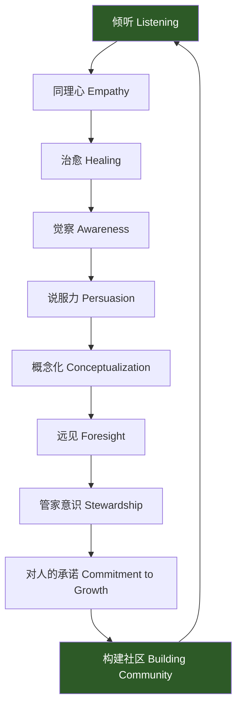
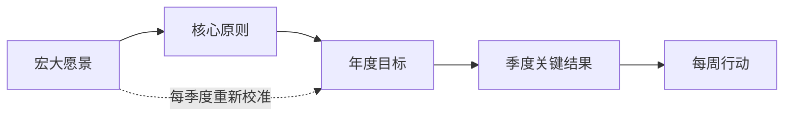
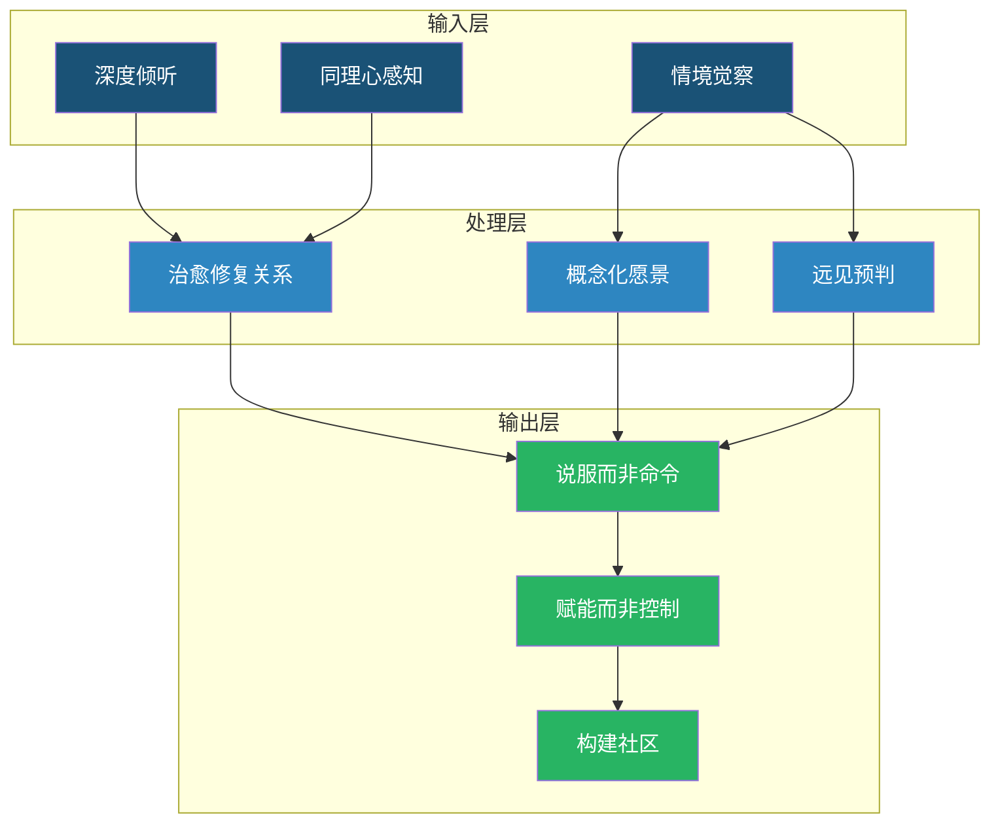

## 五、仆人式领导力（Servant Leadership）

### 为什么这个理论值得单独成章

在所有领导力理论中，仆人式领导力是最"反直觉"的一个——它要求领导者把"服务他人"置于"指挥他人"之前。这个看似违背权力逻辑的理念，却在半个世纪的实践中被反复验证：采用仆人式领导力的组织，员工敬业度平均高出 6-7 倍（Gallup, 2020），客户满意度提升 20%-30%（Heskett et al., Service Profit Chain），员工流失率降低 50% 以上。理解仆人式领导力的沟通模式，是掌握"以影响力替代权威"这一高级领导技能的关键。

### 理论起源与哲学根基

#### Robert Greenleaf 的原始定义

1970 年，美国 AT&T 高管罗伯特·K·格林利夫（Robert K. Greenleaf）发表了一篇名为《仆人式领导力》（The Servant as Leader）的论文，首次系统阐述了这一理念。格林利夫提出了一个核心测试问题：

> "被服务者是否因此成长了？他们是否变得更健康、更智慧、更自由、更自主？他们是否更有可能自己成为仆人式领导者？"

这个问题后来被称为"格林利夫测试"（Greenleaf Test），成为判断一个领导者是否真正践行仆人式领导力的试金石。

格林利夫的理论根植于三个哲学传统：

| 哲学根源 | 核心主张 | 对领导力的启示 |
|----------|----------|----------------|
| 基督教伦理 | "为首者必为众人的仆人" | 领导力的本质是牺牲和服务 |
| 存在主义 | 人的存在先于本质，每个人都是目的而非手段 | 员工不是达成目标的工具，而是目标本身 |
| 过程哲学（怀特海） | 现实是关系性的，整体大于部分之和 | 组织是一个有机体，不是机器 |

这三重根基赋予了仆人式领导力深厚的伦理维度——它不仅是一种管理技术，更是一种关于"人应该如何相处"的哲学立场。

#### 从哲学到实践的演进

格林利夫最初的写作偏向哲学思辨，真正将仆人式领导力"操作化"的是拉里·斯皮尔斯（Larry Spears）。1998 年，斯皮尔斯从格林利夫的大量著作中提炼出了仆人式领导力的十大特征，成为后续研究和实践的标准框架。

### 仆人式领导力的十大核心特征

斯皮尔斯提出的十大特征不是独立的"技能清单"，而是一个有机整体。理解它们之间的关系比单独记忆每个特征更重要。

#### 1. 倾听（Listening）

仆人式领导力中的倾听，不是"等对方说完我再讲"的消极等待，而是一种主动的、深度的理解行为。具体包含三个层次：

| 倾听层次 | 描述 | 典型行为 |
|----------|------|----------|
| 听内容 | 理解对方说了什么 | 不打断，做好笔记 |
| 听情绪 | 感知对方的感受状态 | "听起来你对这件事很沮丧" |
| 听需求 | 洞察未被表达的诉求 | "你真正希望我做什么？" |

**实践方法——"三级倾听法"：**

1. **第一轮：纯接收**。对方说话时，闭嘴、不思考反驳、不急于给建议。用身体语言（点头、眼神接触）表示在场。
2. **第二轮：复述确认**。"我理解你说的是……对吗？"这一步消除 80% 的沟通误解。
3. **第三轮：深度探索**。"是什么让你这样想？""如果有一个理想的解决方案，会是什么样子？"

**常见错误：**
- ❌ 假装倾听（眼睛在看手机，嘴里说"嗯嗯"）
- ❌ 急于给建议（对方还没说完，你就说"你应该……"）
- ❌ 选择性倾听（只听自己想听的部分，忽略不舒服的信息）
- ❌ 以自身经历打断（"我当年比你还惨……"）

#### 2. 同理心（Empathy）

同理心不是同情心。同情心是"你真可怜"，同理心是"我理解你的处境"。前者居高临下，后者平视对等。

**同理心表达的 SPEAK 模型：**

- **S（Sense 感知）**：观察对方的非语言信号——表情、语调、身体姿态
- **P（Perspective 视角）**：尝试站在对方的立场看问题，而非自己的
- **E（Acknowledge 确认）**：口头确认对方的感受是合理的——"换成我，可能也会这样"
- **A（Ask 询问）**：不假设自己完全理解，主动问"还有什么我没看到的？"
- **K（Keep silent 保持沉默）**：有时最有力的同理心表达就是一个安静的陪伴

**真实案例：** 西南航空（Southwest Airlines）前 CEO 赫布·凯莱赫（Herb Kelleher）在公司遇到困难时，不是发通知裁员，而是亲自给每位员工写信，解释公司面临的挑战，询问他们的想法。最终员工自发提出降薪方案，公司渡过难关。这就是同理心驱动的沟通——领导者不是命令者，而是共同面对困难的伙伴。

#### 3. 治愈（Healing）

"治愈"在仆人式领导力语境中，不是心理治疗，而是帮助团队成员从冲突、失败、不信任中恢复关系和信心的能力。

**组织层面的治愈流程：**

1. **承认伤害**。不回避冲突，直面问题——"上周的那次争论，确实伤害了一些人"
2. **创造安全空间**。让受伤方有机会表达感受，不评判、不追究
3. **共同修复**。引导双方找到"向前走"的共识，而非纠缠于"谁对谁错"
4. **制度预防**。把教训转化为团队规则，避免类似伤害重演

#### 4. 觉察（Awareness）

仆人式领导者的觉察是双维度的：**自我觉察**（知道自己的情绪、偏见、行为对他人的影响）和**情境觉察**（读懂组织的氛围、权力动态、未说出口的张力）。

**自我觉察的日常练习：**

- 每天结束时写下：今天我做了哪些决定？背后的动机是什么？有没有情绪驱动的冲动决策？
- 定期向信任的同事索要 360 度反馈——"我在会议中给人什么感觉？""有什么我看不到的盲点？"
- 在做重大决策前，自问：如果我今天心情完全不同，我会做出同样的决定吗？

#### 5. 说服力（Persuasion）

这是仆人式领导力与传统"命令-控制"模式最鲜明的区别。传统领导者说"你必须这样做"，仆人式领导者说"让我解释为什么这样做对我们都好"。

**说服的三个支柱：**

| 支柱 | 传统领导力 | 仆人式领导力 |
|------|-----------|-------------|
| 权力基础 | 职位权力（"我是老板"） | 专家权力 + 参照权力（"我有经验/我值得信任"） |
| 推理方式 | 结论导向（"因为我说了"） | 逻辑+情感+数据三维论证 |
| 决策参与 | 单向宣布 | 邀请讨论，共同决策 |

**说服力的实操框架——"因为-所以-但是"：**

- **因为**（现状问题）："因为我们的客户投诉率在过去三个月上升了 15%"
- **所以**（行动建议）："所以我建议我们重新设计客户反馈流程"
- **但是**（承认局限）："但我意识到这会增加你们的工作量，我们一起看看怎么优化"

#### 6. 概念化（Conceptualization）

概念化能力是指领导者能够超越日常运营的琐碎，看到更大的图景和长远方向。仆人式领导者的概念化不是"画大饼"，而是将愿景转化为团队能理解、能认同、能执行的叙事。

**从愿景到执行的概念化路径：**

**沟通中的概念化表达：** 不要说"我们要做行业第一"（空洞），而要说"我们的目标是让每一个使用我们产品的客户，在遇到问题时能在 30 秒内找到答案。这意味着我们需要重构知识库、训练 AI 客服、建立社区互助体系。"

#### 7. 远见（Foresight）

远见不是预测未来，而是基于对过去的理解、对现在的观察，做出合理的前瞻性判断。仆人式领导者的远见体现在沟通上，就是在危机到来之前就开始调整方向，而不是等到火烧眉毛才通知团队。

**培养远见的"回溯-现在-前瞻"法：**

1. **回溯**：过去 3 年，这个领域发生了哪些变化？哪些是趋势，哪些是噪音？
2. **现在**：当前有哪些信号暗示未来走向？客户行为、技术趋势、竞争对手动态
3. **前瞻**：如果这些信号持续发展，6 个月后会怎样？12 个月后？3 年后？

#### 8. 管家意识（Stewardship）

管家意识的核心是：**领导者不是组织的"拥有者"，而是组织的"受托管理者"**。你被赋予了权力，但这个权力是为了服务组织使命和成员成长，而非自我扩张。

在沟通中，管家意识体现为：
- 重大决策透明化——向团队解释"为什么这样决定"
- 资源分配公开化——让团队知道预算、人力、机会的分配逻辑
- 功劳归属团队化——成功时说"这是团队的功劳"，失败时说"这是我的责任"

#### 9. 对人的承诺（Commitment to the Growth of People）

仆人式领导力相信每个人都有内在价值和成长潜力，领导者的核心职责就是创造条件让这种潜力释放出来。

**对人承诺的沟通实践：**

- **一对一发展对话**：每季度与每位团队成员进行 30 分钟的成长对话，主题不是绩效考核，而是"你未来 6 个月想成为什么样的人？我能帮你什么？"
- **个性化发展计划**：根据每个人的优势和兴趣，制定差异化的成长路径
- **失败的容错空间**：当团队成员尝试新事物失败时，问"你学到了什么？"而不是"你为什么搞砸了？"

**数据支撑：** 根据 LinkedIn 2021 年职场学习报告，94% 的员工表示如果公司投资于他们的学习和发展，他们会留在公司更久。仆人式领导力的"对人的承诺"直接对应了这一需求。

#### 10. 构建社区（Building Community）

仆人式领导力的最终目标不是培养一个高效的"工作机器"，而是构建一个有归属感的"人类社区"。在这个社区中，人们不仅完成工作，还互相支持、共同成长。

**构建社区的沟通策略：**

- 建立"非功利性对话"空间——午餐会、茶歇时间、兴趣小组
- 促进跨部门交流——轮岗、影子计划、跨团队项目
- 仪式感建设——庆祝里程碑、纪念团队成员的个人重要时刻
- 开放安全的反馈文化——匿名建议箱 + 定期团队回顾会

### 仆人式领导力的沟通模型

将十大特征整合为一个可操作的沟通框架：

### 仆人式领导力 vs. 其他领导力范式

在本章的其他小节中，我们讨论了多种领导力理论。仆人式领导力与它们的核心差异在哪里？

| 维度 | 仆人式领导力 | 变革型领导力 | 情境领导力 | 传统权威型 |
|------|-------------|-------------|-----------|-----------|
| 核心驱动 | 服务他人 | 激发愿景 | 匹配情境 | 执行命令 |
| 领导者角色 | 仆人/管家 | 变革推动者 | 灵活教练 | 指挥官 |
| 权力来源 | 道德权威 | 魅力+愿景 | 专业判断 | 职位赋予 |
| 关注焦点 | 人的成长 | 组织变革 | 任务+成熟度 | 任务完成 |
| 沟通风格 | 倾听优先 | 激励叙事 | 因人而异 | 指令传达 |
| 最佳适用 | 服务行业/知识工作 | 转型期/危机期 | 团队多样化 | 军事/紧急情况 |
| 主要风险 | 优柔寡断 | 领导者依赖 | 复杂度高 | 抑制创新 |

**关键洞察：** 仆人式领导力不是万能药。在需要快速决策的危机情境中，果断的指令型领导可能更有效。最好的领导者是能够根据情境灵活切换风格的人——仆人式领导力提供的是"默认模式"和"价值底色"，而非唯一的沟通方式。

### 实践落地：仆人式领导力的日常操作手册

#### 每日实践清单

**早晨（5 分钟）：**
- 回顾今天的会议和对话，预想每个人的可能需求
- 自问：今天我能为谁的成长做什么？

**工作中（持续）：**
- 在每次对话中，确保自己说话时间不超过 40%
- 在给建议前，先问三个问题
- 用"你怎么看？"替代"照我说的做"

**结束时（5 分钟）：**
- 记录今天帮助了谁、如何帮助的
- 反思有没有哪次对话本可以做得更好

#### 一对一沟通模板

当与团队成员进行一对一对话时，使用以下框架：

1. 开场（2 分钟）
   "今天你想聊什么？有没有特别想讨论的？"
   → 把主导权交给对方

2. 倾听阶段（10-15 分钟）
   - 不打断
   - 记笔记
   - 用复述确认理解："你的意思是……对吗？"
   
3. 探索阶段（5-10 分钟）
   - "是什么让你这样想？"
   - "理想的解决方案是什么样的？"
   - "有哪些阻碍你没提到的？"

4. 赋能阶段（5 分钟）
   - "你觉得下一步应该怎么做？"
   - "你需要我提供什么支持？"
   - "我有什么可以帮你挡掉的干扰？"

5. 关闭（2 分钟）
   - 总结共识和行动项
   - "还有其他想聊的吗？"

#### 团队会议中的仆人式领导力

| 会议环节 | 传统做法 | 仆人式做法 |
|----------|---------|-----------|
| 开场 | 领导者宣布议程 | 轮流让成员提出想讨论的议题 |
| 讨论 | 领导者先表态 | 最后发言，避免锚定效应 |
| 决策 | 领导者拍板 | 寻求共识，若分歧大则延期决定 |
| 分配任务 | 领导者指派 | 询问意愿，匹配个人发展方向 |
| 结束 | 领导者总结 | 轮流总结，强化参与感 |

### 真实案例深度分析

#### 案例一：星巴克的霍华德·舒尔茨

霍华德·舒尔茨（Howard Schultz）是仆人式领导力的标志性实践者。他在自传《将心注入》中详细描述了自己的领导哲学：**"我们不是在经营咖啡生意，而是在通过咖啡经营人的生意。"**

舒尔茨的关键沟通实践：
- **全员医保**：1988 年，星巴克成为美国第一家为所有兼职员工提供医疗保险的公司。舒尔茨亲自向员工解释原因——"你们的健康和尊严比利润更重要"
- **开放论坛**：每月举办"城镇会议"，任何员工可以向 CEO 提问，不审查、不回避
- **危机沟通**：2008 年金融危机期间，舒尔茨关闭全美 7,100 家门店进行员工培训，公开承认"我们迷失了方向"，邀请全体员工参与重建

**结果：** 星巴克员工流失率远低于餐饮行业平均水平（约 65% vs 行业 150%+），员工主动推荐率（eNPS）持续高位。

#### 案例二：微软的萨提亚·纳德拉

萨提亚·纳德拉 2014 年接任微软 CEO 时，微软正陷入"内部恶性竞争"的文化泥潭。纳德拉的核心变革工具就是仆人式领导力——他提出"从无所不知（know-it-all）到无所不学（learn-it-all）"的文化转型。

关键沟通举措：
- **"Model-Care-Coach" 框架**：领导者要先示范（Model）同理心行为，再关怀（Care）员工需求，最后辅导（Coach）成长
- **取消排名淘汰制**：废除了鲍尔默时代的"强制分布排名"，因为它制造恐惧而非信任
- **开放学习文化**：纳德拉在全员邮件中推荐《非暴力沟通》和卡罗尔·德韦克的《终身成长》，将其作为公司文化变革的共同语言

**结果：** 微软市值从纳德拉接任时的约 3000 亿美元增长至超过 3 万亿美元，员工满意度大幅提升。

#### 案例三：西南航空的赫布·凯莱赫

赫布·凯莱赫创建了美国最成功的低成本航空公司，他的领导哲学极其简单：**"员工第一，客户第二，股东第三。"**

这个排序看似违反直觉，凯莱赫的解释是："如果员工开心，他们就会让客户开心。客户开心了，就会反复乘坐我们的航班。这样股东自然就开心了。"

在沟通层面，凯莱赫的做法包括：
- 记住数千名员工的名字和个人故事
- 在感恩节亲自到行李分拣处帮忙
- 在公司刊物上刊登员工的家庭故事和兴趣爱好
- 遇到困难时，先问"我们能做什么来支持员工？"而不是"我们怎么削减成本？"

### 常见误区与纠正

#### 误区一："仆人式领导 = 软弱/没主见"

**纠正：** 仆人式领导力不是"好好先生"。服务他人不等于无原则迁就。真正的仆人式领导者在以下情况下会坚定立场：
- 涉及组织核心价值观时
- 有人在伤害团队或他人时
- 需要做出艰难但正确的决定时

关键区别在于：你坚定立场的方式是通过解释和说服，而非命令和威胁。

#### 误区二："仆人式领导 = 不需要权威"

**纠正：** 仆人式领导力不是废除权威，而是重新定义权威的来源。权威不来自职位（"我是你的老板"），而来自能力、品格和对他人的关怀。你仍然需要做出决策、设定标准、执行纪律——只是你做这些事的方式是基于尊重和服务，而非恐惧和控制。

#### 误区三："仆人式领导 = 每个人都满意"

**纠正：** 仆人式领导力追求的是"对的人在对的位置做对的事"，不是"让所有人开心"。有时候，帮助某人成长意味着给他们困难的反馈、挑战他们走出舒适区、甚至帮助他们认识到当前岗位不是最佳匹配。这些都不"舒服"，但都是服务。

#### 误区四："仆人式领导只适合非营利组织"

**纠正：** 仆人式领导力在商业组织中同样有效。星巴克、西南航空、TDIndustries、ServiceMaster 等高利润企业都将其作为核心领导理念。关键是理解"服务"不是"免费服务"，而是通过服务他人来实现共同的商业目标。

#### 误区五："践行仆人式领导就不用关心结果"

**纠正：** 恰恰相反。仆人式领导力对结果的要求可能更高，因为它追求的是**可持续的卓越**，而非短期的绩效冲刺。它关注的不只是"这个季度的数字"，还有"团队的长期能力和健康"。

### 仆人式领导力的局限与适用边界

任何理论都不是万能的，仆人式领导力也有其局限：

| 局限 | 说明 | 应对策略 |
|------|------|---------|
| 决策速度慢 | 寻求共识耗时，不适合紧急决策 | 在危机时刻切换为指令型领导，事后解释 |
| 文化差异 | 在高权力距离文化中可能被视为软弱 | 调整表达方式，用行为而非宣言展示服务精神 |
| 团队规模限制 | 一对一关怀在大团队中难以持续 | 培养中层管理者成为仆人式领导者，形成文化 |
| 个人消耗 | 持续关注他人需求可能导致领导者精疲力竭 | 建立自我关怀机制，学会说"不" |
| 被滥用风险 | 少数人可能利用领导者的善意 | 设定清晰的边界和期望 |

**最佳适用场景：**
- 知识工作者团队（需要自主性和创造力）
- 服务型组织（员工满意度直接影响客户体验）
- 长期项目团队（信任和关系是持续合作的基础）
- 多元化团队（需要包容不同背景和观点）

**不太适用的场景：**
- 军事战斗指挥（需要绝对服从的紧急情境）
- 初创公司的极早期（需要强驱动和快速迭代）
- 组织文化严重有毒时（需要先"刮骨疗伤"再谈服务）

### 进阶：仆人式领导力的组织系统设计

仆人式领导力不应只停留在领导者个人行为层面，还应嵌入组织制度：

#### 招聘环节
- 面试问题设计：问候选人"你上一次帮助同事解决困难是什么时候？"而非只问技术能力
- 评估标准中加入"服务意识"维度

#### 绩效考核
- 不只考核"你做了什么"，还考核"你帮助了谁成长"
- 引入同行反馈和下属反馈，权重不低于上级评价
- 微软的做法：将"帮助他人成功"纳入晋升标准

#### 晋升机制
- 晋升标准包含"培养了多少接班人"
- 要求候选人展示"服务型领导"的具体案例

#### 组织沟通机制
- 建立匿名反馈渠道，让基层声音能到达高层
- 定期举办"逆向导师"活动——让年轻员工指导高管了解新趋势
- CEO 办公室设立"倾听日"——每月一天接受任何员工的一对一对话

#### 培训体系
- 新管理者必修"仆人式领导力"课程
- 定期举办同理心工作坊和深度倾听训练
- 建立领导力教练（Coach）制度，而非只靠培训（Training）

### 自测：你是一个仆人式领导者吗？

用以下 10 个问题评估自己（每项 1-5 分）：

1. 在团队会议中，我通常最后一个发言吗？
2. 我能说出每位直接下属当前最大的职业发展目标吗？
3. 过去一个月，我主动询问过"我能帮你什么？"吗？
4. 当团队犯错时，我的第一反应是"我们能学到什么"而非"谁的责任"吗？
5. 我是否定期向团队寻求关于自己领导方式的反馈？
6. 我做决策时是否会向团队解释背后的原因和权衡？
7. 当个人利益与团队利益冲突时，我是否选择了团队？
8. 我是否投入了时间和资源来帮助团队成员成长？
9. 团队成员是否敢于对我说"你错了"？
10. 如果明天我离开，团队是否能继续良好运转？

**评分解读：**
- **40-50 分**：你已经是优秀的仆人式领导者，继续保持并影响更多人
- **30-39 分**：有不错的基础，在某些方面仍有提升空间
- **20-29 分**：仆人式领导力的意识已有，但行为实践需要加强
- **10-19 分**：建议从倾听和同理心两个最基础的特征开始练习

### 本节核心要点回顾

1. **仆人式领导力的核心悖论**：通过服务他人来领导，通过放弃控制来获得影响力
2. **十大特征是有机整体**：倾听是入口，同理心是桥梁，赋能是目的，社区是结果
3. **沟通模式的根本转变**：从"我说你听"到"你先说我后问"，从"命令执行"到"共识共创"
4. **不是软弱，是更高阶的坚定**：用说服替代命令，用关系替代恐惧，用长期主义替代短期冲刺
5. **需要制度支撑**：仅靠领导者个人不够，要在招聘、考核、晋升中系统嵌入
