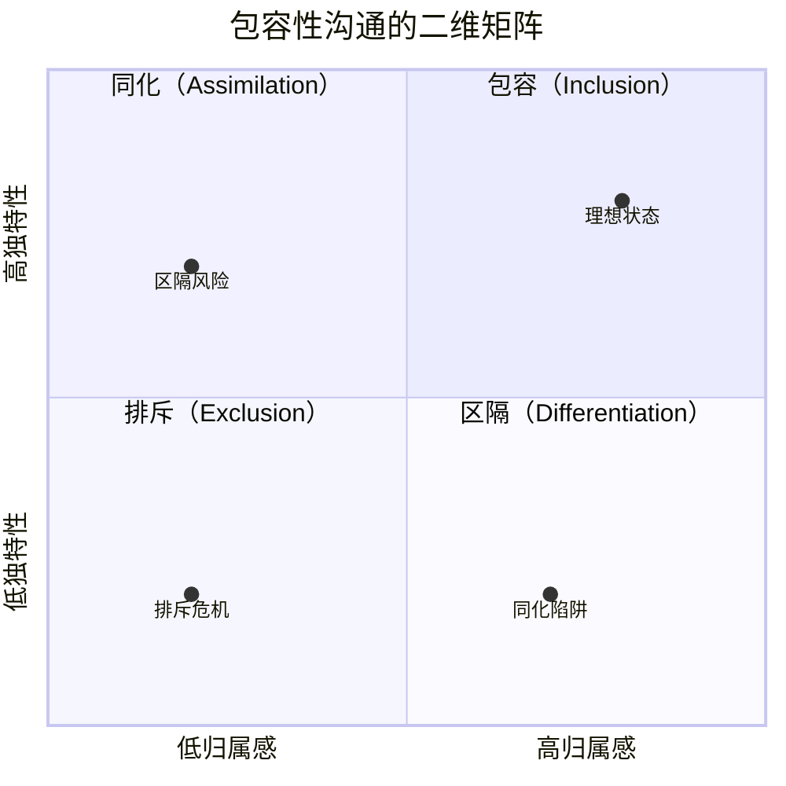
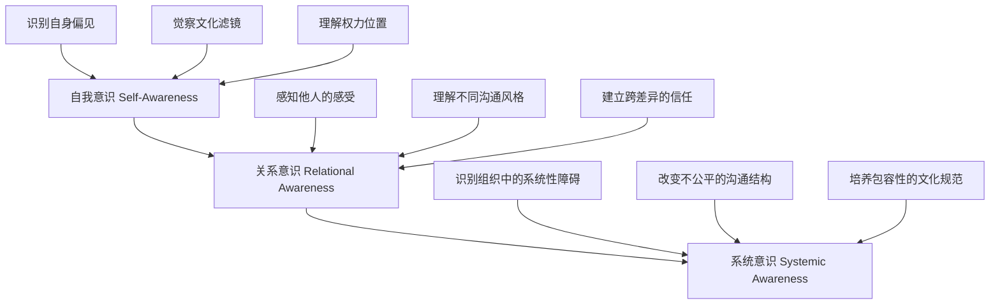

## 六、包容性领导力沟通（Inclusive Leadership Communication）

### 核心概念

在多元化日益成为常态的今天，包容性领导力沟通变得越来越重要。包容性领导力强调领导者需要创造一个让每个人都感到被尊重、被听见、被重视的沟通环境。

包容性领导力沟通的核心要素：

1. **意识觉察**：意识到自己的偏见和盲点，理解不同背景的人可能有不同的沟通偏好
2. **主动邀请**：在会议和讨论中主动邀请不同的声音，特别是那些通常沉默的人
3. **安全空间**：创造心理安全感，让人们敢于表达不同意见而不担心被惩罚
4. **文化敏感**：理解和尊重不同文化背景下的沟通风格差异
5. **公平对话**：确保每个人都有平等的发言机会，不让少数人主导对话

***

### 理论基础：为什么包容性沟通是领导力的核心能力

#### 学术定义与起源

包容性领导力（Inclusive Leadership）的研究始于21世纪初，由Nembhard和Edmondson（2006）率先提出"包容性领导"概念，强调领导者通过承认自身局限性和邀请他人参与来促进团队学习。随后，Shore等（2011）在《Academy of Management Review》上提出了包容性的理论框架，将包容性定义为"个体感受到自己在工作群体中既属于其中又被尊重为独特存在的程度"。

这一框架包含两个核心维度：

- **归属感（Belongingness）**：个体感受到被群体接纳、被视为"自己人"
- **独特性（Uniqueness）**：个体的独特视角、背景和能力被群体重视和利用

这两个维度的交集，就是包容性发生的区域。只有当一个人同时感到"我属于这里"和"我的不同被重视"时，真正的包容才得以实现。

#### 包容性沟通与团队绩效的实证关系

Google的"亚里士多德项目"（Project Aristotle，2015）对180多个团队进行研究后发现，**心理安全感**是区分高效团队和低效团队的第一要素，而心理安全感的核心来源正是包容性沟通。研究显示：

- 高心理安全感的团队，成员主动分享信息的概率提高3.2倍
- 包容性沟通氛围强的团队，创新产出提升47%
- 多元化团队在缺乏包容性沟通时，绩效反而低于同质化团队

Deloitte（2017）的全球包容性领导力研究进一步量化：包容性领导力评分每提高10%，团队感知到的绩效提升17%，团队协作提升29%，团队承诺提升20%。

#### 与其他领导力理论的关系

包容性领导力沟通并不是孤立存在的，它与前面章节讨论的多种领导力理论相互交织：

| 领导力理论 | 与包容性沟通的交叉点 |
|------------|----------------------|
| 变革型领导力 | 包容性沟通是"个性化关怀"的具体实践手段 |
| 仆人式领导力 | 两者共享"倾听优先"和"赋能他人"的核心精神 |
| 情境领导力 | 根据团队成员的文化背景和沟通风格灵活调整方式 |
| 黄金圈法则 | 包容性是"为什么"层面的价值宣言，而非表面策略 |

包容性沟通不是一种"额外技能"，而是渗透在所有领导力行为中的底层操作系统。

***

### 包容性沟通的理论模型

#### Shore包容性框架的沟通映射

Shore等人提出的"包容性-独特性"框架在沟通场景中的具体表现：

四个象限在沟通中的典型表现：

- **包容象限（高归属+高独特）**：团队成员既觉得自己"属于这里"，又因为自己的独特背景而被重视。沟通中表现为：不同意见被主动邀请，少数派的声音被放大而非压制。
- **同化象限（高归属+低独特）**：团队成员感觉自己属于群体，但"不同"被淡化甚至消除。沟通中表现为："我们这里都是这样做"，隐性压力要求新成员放弃原有风格。
- **排斥象限（低归属+低独特）**：既不被接纳，独特性也被否定。沟通中表现为：某些人被系统性地排除在对话之外。
- **区隔象限（低归属+高独特）**：独特性被承认，但只是被"特殊对待"而非真正融入。沟通中表现为："你们那个文化的人是不是都……"。

领导者的目标是让团队始终处于包容象限，避免滑向其他任何一个象限。

#### 心理安全感模型（Amy Edmondson）

Amy Edmondson教授的心理安全感研究是包容性沟通的理论支柱。她将心理安全感定义为"团队成员共享的一种信念，即团队是安全的，可以进行人际风险承担"。

在沟通层面，心理安全感意味着团队成员确信：

1. **发言不会受罚**：提出不同意见不会被嘲笑、忽视或报复
2. **犯错可以承认**：承认错误不会被追责，而是被视为学习机会
3. **提问不丢面子**：承认"我不懂"不会降低自己在团队中的地位
4. **冲突是建设性的**：意见分歧被导向问题解决，而非人身攻击

Edmondson提出，心理安全感不是"一团和气"——恰恰相反，它需要刻意营造，因为它违反了人类保护自身社会地位的本能。

#### 文化维度理论在包容性沟通中的应用

Geert Hofstede的文化维度理论为包容性沟通提供了跨文化视角。不同文化维度对沟通的影响：

| 文化维度 | 高分端特征 | 低分端特征 | 包容性沟通策略 |
|----------|-----------|-----------|---------------|
| 权力距离 | 接受等级差异，不敢挑战上级 | 期待平等对话，可以公开质疑 | 对高权力距离成员提供私下反馈渠道 |
| 个人/集体主义 | 个人成就优先，直接表达 | 集体和谐优先，间接表达 | 同时提供"一对一"和"小组讨论"两种表达方式 |
| 不确定性规避 | 喜欢规则明确，抗拒模糊 | 容忍模糊，灵活应变 | 对高规避者提供清晰的讨论框架和预期 |
| 长期/短期导向 | 注重长远关系和积累 | 关注即时结果和效率 | 在沟通中平衡"关系建设"和"快速决策" |
| 放纵/克制 | 情感表达自由 | 情感表达克制 | 注意不将"沉默"误读为"没意见" |

包容性沟通不是要求所有人在同一套沟通规则下运作，而是理解并适应不同文化背景下的沟通偏好。

***

### 包容性沟通的实践框架

#### 框架一：三环意识模型

包容性沟通的能力建设从三个环层递进：

**第一环：自我意识**

自我意识是包容性沟通的起点。哈佛大学Project Implicit的研究显示，超过70%的人存在隐性偏见（Implicit Bias），这些偏见在意识不到的情况下影响我们的沟通行为。

领导者需要持续自问：
- 我在会议中最常回应谁的发言？我忽略了谁？
- 当某人说话带有口音时，我是否在潜意识中降低了对其内容的信任度？
- 我是否将某些人的"安静"解读为"没有想法"，而实际上他们只是沟通风格不同？
- 我在分配"重要任务"或"露脸机会"时，是否存在无意识的偏向？

**第二环：关系意识**

关系意识指领导者能够在跨差异互动中敏锐地感知对方的体验。这不仅仅是"看到差异"，而是理解差异在互动中的实际影响。

具体实践：
- **代入练习**：在重要会议前，花5分钟想象自己是团队中最少发言的那个人，思考"什么会阻止我开口"
- **信号捕捉**：注意非语言信号——某人身体后倾、停止做笔记、叹了口气——这些可能是不适感的表达
- **跟进机制**：在大组讨论后，主动与沉默的成员进行一对一沟通："今天讨论XX话题时，我很想听听你的看法"

**第三环：系统意识**

系统意识要求领导者超越个人互动层面，审视组织结构和流程中哪些设计在系统性地压制某些声音。

需要审视的系统问题：
- 会议邀请机制：谁被邀请参加决策会议？谁只收到会议纪要？
- 反馈渠道设计：只有"公开发言"一种方式，还是同时提供匿名、书面、一对一等多种渠道？
- 时间安排：会议时间是否考虑了不同时区、育儿责任、宗教活动等因素？
- 语言政策：工作语言是否为母语者创造了不公平的优势？

#### 框架二：ALURE五步包容性沟通模型

ALURE模型提供了一套可操作的沟通步骤：

| 步骤 | 英文 | 含义 | 具体做法 |
|------|------|------|---------|
| A | Acknowledge | 承认差异 | "我知道我们的背景不同，这正是我们需要你视角的原因" |
| L | Listen Deeply | 深层倾听 | 不只听内容，还要听情绪、需要和未说出的话 |
| U | Understand Context | 理解语境 | 了解对方所处的系统性环境和约束条件 |
| R | Respond with Respect | 尊重回应 | 在回应中体现你真正听到了对方，而非敷衍 |
| E | Empower Action | 赋能行动 | 将对话转化为具体的、可执行的改变 |

**ALURE模型在实际场景中的应用示例：**

场景：跨文化团队讨论产品方案时，一位来自东亚文化背景的工程师一直没发言。

传统做法：直接点名"XX，你怎么看？"——这可能让对方感到尴尬和被迫。

ALURE做法：
1. **Acknowledge**：在讨论前先说明"今天我们讨论的是一个影响全球用户的决策，不同文化视角对我们的方案质量至关重要"
2. **Listen Deeply**：注意这位工程师在其他一对一场景中的表达方式——他可能更擅长书面而非口头表达
3. **Understand Context**：理解在某些文化中，打断他人或主动发言可能被视为不礼貌
4. **Respond with Respect**：提供书面反馈渠道："会后我会把方案发到群里，欢迎大家用自己最方便的方式补充想法"
5. **Empower Action**：收到反馈后，公开引用并感谢："XX在书面反馈中提到了一个关键的本地化问题，这对我们的方案非常重要"

#### 框架三：IDEAS包容性会议管理法

会议是包容性沟通最重要的战场。IDEAS方法提供了系统化的会议包容性管理方案：

**I - Invitation（邀请）**
- 会前检查：所有利益相关方是否都被邀请？
- 角色分配：谁主持？谁记录？谁总结？是否有轮换机制？
- 预告议题：提前24-48小时发送议题和思考材料，给内向型成员准备时间

**D - Design（设计）**
- 开场仪式：用"签到"（Check-in）开始会议，每人用一句话分享当前状态
- 发言结构：使用"先写后说"（Write-then-Share）法，让每个人先独立思考3分钟再讨论
- 时间公平：使用计时器确保每人有均等的发言时间

**E - Engagement（参与）**
- 沉默策略：提问后保持沉默至少10秒，给思考型成员回应空间
- 追问技巧："XX提到的观点很有意思，有没有其他人想在这个基础上补充？"
- 阻断垄断：当某人过度主导时，温和介入："感谢你的贡献，让我们听听还没有发言的人的想法"

**A - Accountability（问责）**
- 行动记录：谁负责什么？截止时间是什么？
- 意见追踪：被提出但未讨论的意见，安排后续跟进
- 效果评估：定期匿名调查"这个会议中你是否感到自己的声音被听到？"

**S - Sustain（持续）**
- 制度化：将包容性会议实践纳入团队规范，而非一次性行为
- 迭代改进：根据反馈持续调整会议流程
- 示范引领：领导者率先示范包容性行为，而非只提要求

***

### 包容性沟通中的关键技能

#### 技能一：识别和应对微冒犯（Microaggression）

微冒犯是指在日常沟通中针对特定群体的、通常是无意识的轻视或贬低行为。Sue等人（2007）将微冒犯分为三类：

**微攻击（Microassault）**：有意但隐蔽的歧视行为
- 示例：在分配任务时系统性地给某性别成员分配"支持性"角色
- 应对："我注意到任务分配的模式似乎有些固定，我们可以重新审视一下分配逻辑吗？"

**微冒犯（Microinsult）**：无意识的、带有偏见的言语
- 示例："你的中文说得真好！"（对华裔美国人）
- 应对："谢谢，英语是我的母语。不过我很好奇，是什么让你预期我说不好？"

**微否认（Microinvalidation）**：否定他人的经历或感受
- 示例："我不觉得这有什么歧视的，你太敏感了"
- 应对：不要否认对方的感受——"我听到你觉得这没有问题，但XX确实感受到了伤害，我们可以一起看看怎么让环境更友好"

**领导者如何系统性减少微冒犯：**

1. **教育先行**：在团队中引入微冒犯的概念，不是为了追责，而是提高认知
2. **建立规范**：团队协约中明确"当我们无意中冒犯了他人时，我们的第一反应是倾听和道歉，而非辩解"
3. **旁观者策略**：培训团队成员"旁观者介入"技巧，当看到微冒犯发生时能够得体地介入
4. **反馈文化**：建立"向上反馈"机制，让团队成员可以安全地指出领导者的微冒犯行为

#### 技能二：跨文化沟通中的包容性

全球化团队中的包容性沟通面临独特挑战。Erin Meyer的"文化地图"（The Culture Map）理论为跨文化包容性沟通提供了实用框架：

**沟通维度：低语境 vs 高语境**

| 维度 | 低语境文化（如美国、德国、荷兰） | 高语境文化（如中国、日本、韩国） |
|------|-------------------------------|-------------------------------|
| 信息传递 | 直接、明确、靠语言本身 | 间接、含蓄、靠语境和关系 |
| "不"的表达 | 直接说"不" | 用沉默、犹豫、"可能"来暗示 |
| 反馈方式 | 明确的正面/负面反馈 | 通过第三方、隐喻或暗示传递 |
| 包容性策略 | 确保"直接"不变成"粗暴" | 确保"含蓄"不被误解为"同意" |

**实际操作建议：**
- 在高语境文化参与者面前，不要假设"没有反对意见就是同意"——主动追问"我想确认大家都认同这个方向"
- 在低语境文化参与者面前，不要把他们的直接反馈解读为"不尊重"——这是他们的沟通习惯
- 为不同语境文化的成员提供多种反馈渠道：匿名问卷、书面反馈、一对一谈话

#### 技能三：处理权力动态对沟通的影响

权力差距是包容性沟通最大的隐形障碍。当一个人在权力关系中处于弱势地位时，其沟通行为会发生显著变化：

**权力差距下的典型沟通现象：**
- **自我审查**：过滤掉可能"不得体"的意见
- **迎合偏差**：说上级想听的话，而非真实想法
- **过度礼貌**：用过多的修饰语稀释核心观点
- **沉默退缩**：认为"说了也没用"而放弃表达

**领导者应对策略：**

1. **制度化的匿名渠道**：定期的匿名反馈调查、匿名意见箱、第三方收集
2. **"先说后听"原则**：在决策讨论中，领导者最后发言，避免"锚定效应"
3. **角色反转练习**：定期让初级成员担任会议主持人或方案汇报人
4. **权力透明化**：公开承认权力差异——"我知道我在这个房间里的职位可能让你们不太愿意提出反对意见，但我真诚地需要你们的诚实反馈"
5. **保护异议者**：当有人提出反对意见时，确保该人不会因此受到隐性报复

***

### 常见误区与纠正

#### 误区一：包容性=不得罪任何人

**错误理解**：包容性沟通意味着避免任何可能引起不适的话题，追求"所有人都满意"。

**纠正**：真正的包容性沟通不是回避冲突，而是创造一个安全的空间让建设性冲突能够发生。"不冒犯"不等于"不挑战"——有时候，包容性恰恰意味着挑战某些人舒适区中的偏见和特权。

**对比：**

| 伪包容 | 真包容 |
|--------|--------|
| 避免讨论种族话题，因为"太敏感" | 正视种族话题，用尊重和好奇的态度讨论 |
| "我们的团队没有偏见" | "我们都有盲点，让我们一起学习识别它们" |
| 所有人必须用同一种方式沟通 | 允许不同的沟通风格，并创造多种参与渠道 |
| 不对任何人的言论提出异议 | 有勇气温和但坚定地指出排他性言论 |

#### 误区二：包容性沟通只是"术"的层面

**错误理解**：包容性沟通只是一套技巧和话术，学几个方法就行了。

**纠正**：包容性沟通是价值观（道）、原则（法）、技巧（术）、工具（器）四个层面的统一体。如果只学技巧而不内化价值观，行为会显得虚伪，反而破坏信任。

道法术器的层次：
- **道**：相信每个人的视角都有独特价值，差异是团队的财富而非负担
- **法**：在决策、沟通、反馈的每个环节中嵌入包容性原则
- **术**：具体的话术、会议设计、反馈方法
- **器**：匿名反馈工具、包容性会议检查清单、偏见打断脚本

#### 误区三：包容性只关乎"少数群体"

**错误理解**：包容性领导力只是帮助女性、少数族裔、LGBTQ+等"少数群体"。

**纠正**：包容性是面向所有人的。每个人在某些维度上都可能是"多数"，在另一些维度上是"少数"。一个白人男性工程师在性别和种族上是"多数"，但在年龄（如果他是团队中最年轻的）、教育背景（如果他没有博士学位）、社会经济出身等维度上可能是"少数"。

包容性领导力沟通的终极目标是创造一个**每个人都能完整地做自己**的环境，这包括——但不限于——那些在传统意义上属于"弱势群体"的人。

#### 误区四：包容性沟通会让效率下降

**错误理解**：让每个人发言太浪费时间，不如让最懂的人快速做决定。

**纠正**：短期来看，包容性沟通可能比"一言堂"慢。但研究一致表明：

- McKinsey（2020）：高管团队性别多元化排名前四分之一的公司，盈利能力超出平均水平25%；族裔多元化排名前四分之一的公司，超出36%
- Harvard Business Review（2016）：多元化团队解决问题的速度快60%，决策质量提高87%
- 包容性沟通减少的不是速度，而是"返工率"——因为更多的视角在前期被纳入，后期需要修正的问题更少

**效率对比模型：**

传统模式：快决策 → 高返工 → 总耗时长
包容模式：慢决策 → 低返工 → 总耗时短

#### 误区五：我"感觉"自己很包容就够了

**错误理解**：我没有歧视意图，所以我的沟通一定是包容的。

**纠正**：包容性的判断标准不是你的意图，而是对方的体验。一个领导者的沟通是否包容，最终由接收者的感受来定义——而非发送者的意图。

**实践方法：**
- 定期进行360度反馈，包含包容性维度
- 使用"影响力-意图"矩阵进行自我评估：

| | 影响是正面的 | 影响是负面的 |
|---|---|---|
| **意图是正面的** | 最佳状态 | 需要学习：意图好但造成了伤害 |
| **意图是负面的** | 罕见情况 | 需要改变：既没好意图也没好结果 |

当你的"意图"和"影响"不一致时，正确的回应是："对不起，我没想到这会让你有这样的感受。谢谢你告诉我，我会注意。"——而不是："我不是那个意思，你误会了。"

***

### 高级主题：包容性沟通的深层挑战

#### 挑战一：在高同质化团队中引入包容性

大多数团队并非天然多元化。在高度同质化的团队（如一个几乎全部来自同一所大学、同一专业背景的技术团队）中引入包容性沟通面临特殊困难：

**困境分析：**
- 团队成员因相似性而产生强烈的"内群体偏好"
- "文化契合"（Culture Fit）的招聘标准可能在无意识中排除差异
- 异见者在同质化团队中面临更大的社会压力

**渐进策略：**

1. **引入认知多样性**：即使团队成员的人口统计学特征相似，也可以引入认知多样性——招聘不同专业背景的人、邀请跨部门合作、引入外部顾问
2. **制度化反对派**：在决策流程中设置"魔鬼代言人"角色，轮流由不同人担任
3. **扩展"边界"**：通过跨团队项目、行业交流、客户访谈等方式，让团队接触不同视角
4. **领导者的"自我分化"**：领导者有意识地表达不同于团队主流的观点，打破"我们都一样"的幻觉

#### 挑战二：在危机中维持包容性

危机时刻，包容性沟通面临最大的压力测试。当团队面临紧急截止日期、预算削减、危机事件时，"效率优先"的本能会压缩包容性空间。

**危机中的包容性悖论：**
- 危机时刻恰恰最需要多元视角，因为同质化思维在复杂问题中失败率最高
- 但危机造成的压力恰恰最容易回归命令-控制模式，压制多元声音

**平衡策略：**
- **事前建立**：包容性文化不能在危机中临时建立——必须在日常就建立足够的信任储备
- **结构化快速决策**：使用"快速轮流发言"（每人60秒，不打断）等结构化方法，保证高效的同时不遗漏关键信息
- **事后复盘**：危机结束后，专门留出时间检视"在危机中，哪些声音被压制了？我们因此错过了什么？"
- **情绪包容**：在危机中承认和接纳团队成员的恐惧、焦虑和不确定性，而非要求"专业性地压制情绪"

#### 挑战三：数字时代的包容性沟通

远程和混合工作模式为包容性沟通带来新的维度：

**数字沟通中的包容性挑战：**

| 挑战 | 具体表现 | 应对策略 |
|------|---------|---------|
| 技术鸿沟 | 网络不稳定、设备差异、平台不熟悉 | 提供技术支持，允许音频而非视频参与 |
| 时区不公 | 某些成员总是在"非正常时间"参会 | 轮换会议时间，录制并提供异步参与选项 |
| 屏幕疲劳 | 长时间视频会议增加认知负担 | 设置"相机可选"规范，定期休息 |
| 文字沟通偏差 | 文字缺乏语调和表情，容易误读 | 使用表情符号辅助表达语气，重要沟通选择视频 |
| 异步沟通中的"沉默" | 在文字渠道中，不回复可能只是忙碌 | 建立"已读确认"规范，不假设沉默代表同意 |
| "数字存在感"不平等 | 远程员工在"办公室优先"文化中被边缘化 | 确保远程参与者在每次会议中有专门的发言时间 |

#### 挑战四：当包容性遭遇"文化冲突"

包容性领导力面临的最困难场景之一，是当不同文化群体之间存在价值观冲突时。例如：
- 某些宗教信仰与LGBTQ+权利之间的张力
- 不同文化对"尊重权威"和"言论自由"的不同优先级
- 性别平等理念与传统性别角色期望的冲突

**处理原则：**

1. **区分"尊重人"和"认同所有观点"**：包容性要求我们尊重每个人的尊严和存在权利，但不要求我们认同所有观点
2. **找到共同底线**：在价值观冲突中，寻找双方都能接受的基本行为标准（如"在工作场所，我们对所有人使用尊重的语言"）
3. **透明化期望**：明确组织的核心价值观底线，而非假装"所有观点都一样好"
4. **个人vs组织空间**：区分"个人信仰空间"和"组织行为标准"——你有权持有个人信仰，但在组织中需要遵守包容性行为规范

***

### 实用工具箱

#### 工具一：包容性沟通自评清单

领导者可以定期使用以下清单进行自我评估（每项1-5分）：

**自我意识维度：**
- [ ] 我能识别自己在沟通中至少3个常见偏见
- [ ] 我定期寻求他人对我沟通风格的反馈
- [ ] 我在做决策前会检查"谁的声音还没有被听到"

**互动行为维度：**
- [ ] 我在会议中平均发言时间不超过30%
- [ ] 我主动邀请沉默者发言（使用非强迫的方式）
- [ ] 当我犯了微冒犯错误时，我能迅速承认并改正

**结构设计维度：**
- [ ] 我的会议设计包含多种参与方式（口头、书面、匿名）
- [ ] 我的团队有明确的"不同意"安全通道
- [ ] 我定期审视团队流程中是否存在系统性排他设计

#### 工具二：包容性会议检查清单

**会前：**
- [ ] 所有必要参与者都已邀请
- [ ] 议题和材料提前24-48小时发送
- [ ] 会议时间考虑了所有参与者的时区和约束
- [ ] 准备了多种参与方式（口头、聊天、会后书面反馈）

**会中：**
- [ ] 开场签到，每人有机会发言
- [ ] 使用"先写后说"或"轮流发言"等结构化方法
- [ ] 注意谁在沉默，使用非强迫方式邀请参与
- [ ] 防止任何人垄断发言时间
- [ ] 当微冒犯发生时，及时但温和地介入

**会后：**
- [ ] 行动项有明确负责人和截止日期
- [ ] 未讨论的意见有后续跟进计划
- [ ] 定期收集参与者对会议包容性的反馈

#### 工具三：包容性反馈话术模板

**当有人在会议中被忽视时：**
"XX，我注意到我们刚才讨论的这个话题可能和你负责的领域相关，你有什么看法想分享吗？"

**当需要挑战某人的排他性言论时：**
"我理解你的出发点是好的，不过我从XX的角度想了想，这个说法可能会让人感到不被欢迎。我们可以一起想想有没有更好的表达方式？"

**当需要向上反馈包容性问题时：**
"我很感谢这个团队的整体氛围。有一个小建议——如果我们在做重大决策时能增加一个'反对意见收集'环节，可能会帮助我们发现盲点。"

**当承认自己的包容性失误时：**
"我刚才说的话可能不妥，谢谢你的提醒。我的本意是[解释意图]，但我理解这个表达可能造成了[说明影响]。以后我会注意用更恰当的方式表达。"

***

### 从理论到行动：90天包容性沟通提升计划

**第一阶段：觉察（第1-30天）**

| 周次 | 行动 | 产出 |
|------|------|------|
| 第1周 | 完成哈佛Project Implicit隐性偏见测试 | 偏见觉察报告 |
| 第2周 | 录像或录音一次自己的团队会议，回看发言比例 | 发言时间分布数据 |
| 第3周 | 进行3位团队成员的一对一沟通，询问"你在这个团队中是否感到自己的声音被听到" | 团队包容性基线 |
| 第4周 | 阅读一本包容性领导力书籍（推荐：《The Leader's Guide to Unconscious Bias》） | 个人学习笔记 |

**第二阶段：练习（第31-60天）**

| 周次 | 行动 | 产出 |
|------|------|------|
| 第5周 | 在团队会议中实施"先写后说"方法 | 团队会议反馈 |
| 第6周 | 引入会议签到（Check-in）环节 | 团队氛围变化记录 |
| 第7周 | 练习ALURE模型，至少在3次跨差异对话中有意识地应用 | 沟通反思日志 |
| 第8周 | 在团队中引入微冒犯教育（可以是15分钟的团队分享） | 团队规范初稿 |

**第三阶段：制度化（第61-90天）**

| 周次 | 行动 | 产出 |
|------|------|------|
| 第9周 | 与团队共创包容性沟通团队协约 | 团队协约文档 |
| 第10周 | 建立定期的包容性反馈机制（如每月匿名调查） | 反馈机制启动 |
| 第11周 | 用IDEAS方法重构至少3个关键会议流程 | 会议流程文档 |
| 第12周 | 进行阶段性复盘，收集360度反馈 | 90天复盘报告 |

***

### 小结

包容性领导力沟通不是一套技巧，而是一种持续的实践和承诺。它要求领导者在三个层面同时发力：

1. **道的层面**：内化"差异是财富"的价值观，接受自己的不完美和持续学习的需要
2. **法的层面**：在团队流程和组织结构中嵌入包容性设计，让包容性成为"默认设置"而非"额外努力"
3. **术的层面**：掌握具体的方法和工具，在每一次对话、每一次会议、每一次决策中有意识地践行包容性

最终，衡量一位领导者包容性沟通能力的标准，不是领导者自己说了什么，而是团队中那些最不常发声的人是否愿意开口、是否感到被重视、是否相信自己的声音真的能带来改变。

正如Verna Myers所说："多样性是被邀请参加聚会，包容性是被邀请跳舞。"领导者的使命，不仅是发出邀请，更是确保舞池的灯光照亮每一个人。

***
