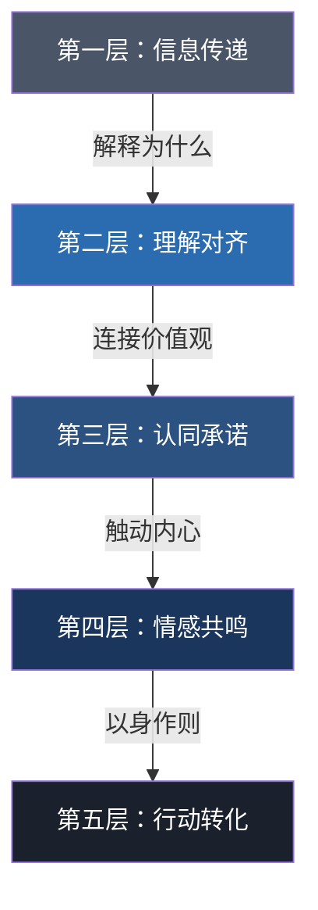
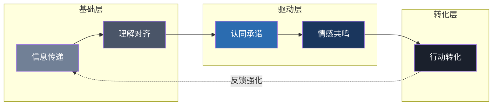

## 七、领导力沟通的五个层次

领导力的本质不是权力，而是影响力；而影响力的核心载体，就是沟通。同样一句话，有人说了等于没说，有人却能让人热血沸腾、付诸行动——差别不在话术，在于沟通触及的深度。

领导力沟通可以按照影响力深度划分为五个层次，从最基础的信息传递到最深层的行为转化，每一层都对应不同的沟通能力要求和实际效果。理解这五个层次，不仅能帮助领导者诊断自身沟通的短板，更能提供一条清晰的进阶路径。

### 7.1 五层次模型总览

| 层次 | 核心功能 | 沟通表现 | 典型场景 | 影响力持续时间 |
|------|----------|----------|----------|----------------|
| **第一层：信息传递** | 传递事实 | 传达数据、指令、通知 | 工作汇报、邮件通知 | 即时，易遗忘 |
| **第二层：理解对齐** | 达成共识 | 解释原因、确认理解 | 方案讨论、需求澄清 | 短期，需反复 |
| **第三层：认同承诺** | 激发认同 | 阐述愿景、分享价值 | 战略宣导、目标动员 | 中期，有动力 |
| **第四层：情感共鸣** | 建立连接 | 讲述故事、展现真诚 | 挽留谈话、危机沟通 | 长期，有忠诚 |
| **第五层：行动转化** | 驱动改变 | 身体力行、创造体验 | 变革推动、文化塑造 | 持久，成习惯 |

大多数领导者的沟通停留在第一层和第二层——把事情说清楚，确保别人听懂。这已经能应付日常管理，但远远不够驱动真正的变革。卓越的领导者会有意识地将沟通推向第四层和第五层，因为只有触及情感和行动层面，才能产生持久的影响力。

---

### 7.2 第一层：信息传递——从"说了"到"说清楚"

#### 7.2.1 定义与机制

信息传递是领导力沟通的起点，其本质是**降低信息不对称**。领导者拥有团队成员不掌握的信息——战略方向、项目进度、客户反馈、上级要求——需要通过沟通将这些信息准确、及时地传递给相关人员。

这一层的理论基础来自香农的信息论：信息传递包含**编码（组织信息）→ 传输（选择渠道）→ 解码（对方接收）**三个环节。任何一个环节出问题，信息就会失真或丢失。

#### 7.2.2 常见问题

信息传递看似简单，但实际执行中经常出现以下问题：

**信息不完整**：只说了结论，没说背景。例如"这个项目暂停"——团队不知道为什么暂停、暂停多久、自己该做什么。

**信息过载**：一封邮件包含十条不相关的事项，重点被淹没。接收者的注意力是有限资源，信息越多，每条信息被记住的概率越低。

**渠道选择不当**：复杂的技术方案用即时消息发送，简单的时间通知却组织一场会议。渠道的正式程度和信息的复杂度需要匹配。

**缺乏确认机制**：发了邮件就认为对方已读已理解，实际上可能进了垃圾箱或被忽略。

#### 7.2.3 提升方法

**结构化表达**：采用"结论先行"的金字塔结构。先说核心信息（What），再说背景原因（Why），最后说行动要求（How）。例如：

> ❌ "最近客户那边反馈比较多，产品也有不少问题，竞品又上了新功能，所以经过讨论，我们决定调整一下Q3的计划。"
>
> ✅ "Q3计划需要调整，三个原因：客户反馈集中、产品体验问题、竞品动态。具体调整方案如下……"

**选择合适渠道**：

| 信息类型 | 推荐渠道 | 避免渠道 |
|----------|----------|----------|
| 紧急决策 | 电话/即时消息 | 邮件 |
| 复杂方案 | 文档+会议 | 纯文字消息 |
| 日常同步 | 即时消息/站会 | 长邮件 |
| 正式通知 | 邮件+公告 | 口头传达 |

**建立反馈闭环**：信息发出后，通过复述确认（"你能用自己的话说下接下来要做什么吗？"）或书面确认（会议纪要、待办清单）确保信息被正确接收。

#### 7.2.4 实操模板：高效工作汇报

【汇报模板】
主题：[一句话概括]
状态：🟢正常 / 🟡有风险 / 🔴有阻塞
关键信息：
  - [最重要的1-2条]
  - [需要决策/支持的事项]
下一步：[具体行动+时间]

这个模板能在30秒内传递核心信息，避免"说了五分钟对方还不知道你要表达什么"的常见问题。

---

### 7.3 第二层：理解对齐——从"听到了"到"听懂了"

#### 7.3.1 定义与机制

信息传递解决的是"知不知道"的问题，理解对齐解决的是"理不理解"的问题。两者的区别是：你可以把一封技术方案发给所有人（信息传递），但只有当每个人都能用自己的话解释这个方案的逻辑和意图时，才算达成了理解对齐。

理解对齐的理论基础来自认知心理学中的**心智模型（Mental Model）**理论。每个人基于自己的经验、知识和认知框架来理解信息，同样的信息在不同人的大脑中会形成不同的理解。领导者的任务是缩小这些理解差距，让团队成员的心智模型尽可能趋同。

#### 7.3.2 为什么理解对齐如此重要

根据项目管理协会（PMI）的研究，**56%的项目失败可归因于沟通不畅**，而其中最大的问题不是信息缺失，而是理解偏差。一个需求，产品理解的、开发理解的、测试理解的可能是三个不同的东西，每个人都在"按要求做"，但最终结果对不上。

McKinsey的研究也指出，高对齐团队的执行效率比低对齐团队高出**25%以上**，因为减少了返工、重复沟通和方向性错误。

#### 7.3.3 提升方法

**解释"为什么"而不只是"是什么"**：

> ❌ "从下周一开始，所有代码必须经过Code Review才能合并。"
>
> ✅ "上个季度我们线上出现了3次因代码质量问题导致的故障，每次平均修复时间4小时。为了从根本上减少这类问题，从下周一开始，所有代码必须经过Code Review才能合并。这样做的好处是……"

当人们理解了原因，不仅执行意愿更强，还能在遇到具体情境时做出正确的判断——因为他们理解的是逻辑，而不仅仅是规则。

**使用类比和具象化**：抽象概念要用具体类比来解释。例如解释微服务架构："想象一个餐厅——以前是一个大厨负责所有菜品（单体架构），现在是每个厨师专精一道菜（微服务），好处是……"

**主动检验理解**：不要问"听懂了吗？"——大多数人即使没听懂也会说"嗯"。改用以下方式：

- **复述法**："你来用自己的话说下，接下来你要做的事情是什么？"
- **提问法**："你觉得这个方案在执行中可能会遇到什么困难？"——如果对方能提出合理的问题，说明真的理解了。
- **示例法**："你能举个例子说明你会怎么应用这个方法吗？"

#### 7.3.4 工具：对齐检查清单

在重要沟通结束后，用以下清单自检：

□ 对方能否用一句话概括核心结论？
□ 对方能否说出至少一个"为什么"的原因？
□ 对方能否明确自己的具体行动项和时间节点？
□ 对方是否提出了至少一个相关问题？
□ 如果对方需要向第三方转述，内容是否会被扭曲？

如果以上有任何一项答案为"否"，说明理解对齐尚未完成，需要补充沟通。

---

### 7.4 第三层：认同承诺——从"听懂了"到"愿意做"

#### 7.4.1 定义与机制

理解对齐解决的是认知问题，认同承诺解决的是意愿问题。一个人可以完全理解你的方案，但内心并不认同，执行时就会消极应付。真正的领导力沟通，不仅要让人"知道该做什么"，更要让人"想去做"。

这一层的理论基础来自自我决定理论（Self-Determination Theory, SDT），由心理学家Edward Deci和Richard Ryan提出。该理论指出，人的内在动机来自三个基本心理需求：

- **自主性（Autonomy）**：感觉自己的行为是自己选择的，而不是被强迫的
- **胜任感（Competence）**：感觉自己的能力被认可，能够胜任挑战
- **归属感（Relatedness）**：感觉自己属于一个群体，与他人有连接

当领导者的沟通能满足这三个需求时，团队成员会从"被要求做"转变为"主动想做"。

#### 7.4.2 从服从到承诺的光谱

| 状态 | 表现 | 持续性 | 创造力 |
|------|------|--------|--------|
| **抵触** | 明确反对或消极对抗 | — | 负面 |
| **服从** | 做了但不情愿，最低标准执行 | 低 | 无 |
| **顺从** | 按要求做，不多不少 | 中低 | 低 |
| **认同** | 理解并认可，主动执行 | 中高 | 中 |
| **承诺** | 发自内心投入，愿意额外付出 | 高 | 高 |

领导者的沟通目标，是将团队从"服从/顺从"推向"认同/承诺"。

#### 7.4.3 提升方法

**连接个人价值与组织目标**：不要只谈组织需要什么，要谈这对个人意味着什么。

> ❌ "公司要开拓东南亚市场，这是战略方向，大家加油。"
>
> ✅ "东南亚市场的开拓是公司未来三年最重要的增长引擎。对团队来说，这意味着三件事：第一，每个人都会获得跨境项目经验，这是行业里非常稀缺的履历；第二，成功后团队规模会扩大，晋升通道会打开；第三，我们正在做的事情有可能改变一个新市场的用户体验。"

**赋予选择权而非直接命令**：在目标确定的前提下，给团队选择路径的空间。

> ❌ "这个项目用React做。"
>
> ✅ "这个项目需要一个前端框架，性能和开发效率是两个关键约束。我倾向React，但你们是技术实现的负责人，你们觉得什么方案最合适？"

后者保留了方向，但把技术决策权交给了团队，满足了自主性需求。

**让团队参与决策过程**：人们对自己参与制定的计划有更强的承诺感。即使最终决策权在领导者手中，也应该在决策前征求意见、在决策后解释理由。

**公开认可和庆祝**：当团队取得阶段性成果时，及时、具体、公开地认可。"你们做得不错"不如"张三在数据库优化上做得非常出色，查询时间从2秒降到了200毫秒，这直接解决了客户投诉最多的性能问题"。

#### 7.4.4 案例：从抵触到承诺的转变

某传统企业推进数字化转型，IT部门被要求在三个月内将核心系统迁移到云上。初始状态：

- 团队抵触："我们做了十年的本地系统，为什么非要上云？"
- 担忧："上云后我们会不会被裁员？"
- 被动："上面要我们做就做呗。"

CTO的沟通策略：

1. **透明化原因**：用数据说明本地系统的维护成本逐年上升，已经占到IT预算的60%，而竞品的系统响应速度是自己的3倍。
2. **连接个人利益**：明确表示上云后团队不会裁员，反而需要更多云架构人才，并承诺提供AWS认证培训和考试费用。
3. **赋予自主权**：让团队自己选择云服务商和迁移方案，CTO只设定安全和预算约束。
4. **小步快跑**：先迁移一个非核心系统作为试点，让团队积累信心。

三个月后，不仅按时完成了迁移，团队还主动提出了五个优化建议，其中两个被采纳后节省了20%的云资源费用。

---

### 7.5 第四层：情感共鸣——从"愿意做"到"全心投入"

#### 7.5.1 定义与机制

信息传递、理解对齐、认同承诺——这三层本质上还在理性的范畴内运作。但人类不是纯理性的动物，情感才是行为最强大的驱动力。神经科学家安东尼奥·达马西奥（Antonio Damasio）在《笛卡尔的错误》中指出：**情感不是理性的对立面，而是理性决策的基础**。一个完全丧失情感能力的人，连最简单的决策都做不了。

领导力沟通的第四层，就是通过情感共鸣建立深度的人际连接。当团队成员在情感上与领导者建立连接时，他们不仅愿意做事，更会因为这种连接而产生超越利益的忠诚和投入。

#### 7.5.2 情感共鸣的科学基础

镜像神经元（Mirror Neurons）的发现为情感共鸣提供了神经科学解释。当我们观察到他人的情感表达时，大脑中的镜像神经元会"模拟"对方的状态，产生类似的情感体验。这就是为什么一个真正充满热情的演讲者能让听众也感到兴奋，而一个假装热情的人只会让人觉得尴尬。

领导者的真诚（Authenticity）是触发镜像神经元响应的关键——大脑对"真实"和"表演"的区分能力远超我们的想象。

#### 7.5.3 提升方法

**讲述故事而非罗列事实**：人类大脑天生对故事有更强的记忆和情感反应。神经科学研究表明，故事能让大脑释放催产素（增强信任和连接感），而单纯的数据只会激活大脑的语言处理区域。

好的领导力故事包含以下要素：

【故事结构模板】
1. 情境（Situation）：当时面临什么背景？
2. 冲突（Conflict）：遇到了什么困难或挑战？
3. 行动（Action）：做了什么关键决策？
4. 结果（Result）：最终结果如何？
5. 学习（Learning）：从中学到了什么？

**展现脆弱性（Vulnerability）**：领导者适当展现自己的不足、困惑和失败，反而能增强信任感。Brené Brown在《敢于领导》（Dare to Lead）中的研究表明，脆弱性不是软弱的表现，而是勇气的体现。

> ❌ 一个永远正确、从不犯错的领导者形象——让人敬而远之。
>
> ✅ "这个决策我也不确定是对的，但我做了详细分析，这是我考虑的因素……如果结果不如预期，我承担主要责任。"

**全情投入的在场感**：在一对一沟通或团队会议中，放下手机、关闭电脑通知、保持眼神接触。这些看似微小的行为传递的信号是："你比任何事情都重要。"领导者的时间分配本身就是最强的沟通信号。

**主动了解团队成员**：了解每个人的动机、压力来源、职业期望和生活状态。不是为了监视，而是为了在沟通时能够真正"看见"对方。当一个人感到自己被真正看见和理解时，情感连接自然产生。

#### 7.5.4 案例：危机中的情感沟通

2020年疫情初期，某旅游公司CEO面对80%业务归零的困境，通过全员视频会议进行了一次经典的情感沟通：

> "我不打算粉饰现实。接下来几个月会非常艰难，我们可能需要做一些痛苦的决定。但我想让你们知道三件事：第一，我不会在没有提前告知的情况下突然裁员；第二，如果必须裁员，管理层会先降薪；第三，我相信旅游行业一定会回来，而在座的各位就是公司最宝贵的资产。"

这次沟通没有使用任何华丽的辞藻，没有画大饼，但做到了三件事：承认现实（建立信任）、展现共情（理解恐惧）、给出承诺（提供安全感）。会后员工满意度调查显示，信任度反而提升了15%。

---

### 7.6 第五层：行动转化——从"全心投入"到"改变行为"

#### 7.6.1 定义与机制

行动转化是领导力沟通的最高层次，也是最难达到的层次。目标不是让人"想做"，而是让人"做了"，并且"持续做"直到形成新的行为习惯。

这一层的理论基础来自行为科学和习惯形成理论。BJ Fogg的行为模型（B=MAP）指出，行为（Behavior）的发生需要三个条件同时满足：

- **动机（Motivation）**：想做（前三层已解决）
- **能力（Ability）**：能做（降低行动门槛）
- **提示（Prompt）**：现在做（环境触发）

领导者在这一层的角色，是设计一个让正确行为"自然而然发生"的环境。

#### 7.6.2 身体力行的力量

行动转化最强大的工具不是语言，而是领导者的**行为示范**。社会学习理论（Social Learning Theory）创始人Albert Bandura指出，人类的大部分行为是通过观察和模仿学习的，而人们最常模仿的对象是自己尊敬的人——在组织中，就是领导者。

| 领导者的行为 | 团队学到的 |
|-------------|-----------|
| 加班到深夜但不抱怨 | 努力工作的标准是什么 |
| 犯错后主动承认 | 错误是学习的机会 |
| 每天第一个到公司 | 准时和纪律的重要性 |
| 认真准备每一次会议 | 会议质量和准备程度 |
| 对客户的投诉认真回应 | 客户至上的真正含义 |

一个要求团队准时交付但自己总是延期的领导者，传递的真正信息是"准时交付不重要"。**人们不会听你说什么，会看你做什么。**

#### 7.6.3 提升方法

**创造行为设计环境**：不要依赖意志力，要让正确行为变得更容易。

- 要推动Code Review文化？把它设为Git分支合并的强制流程（技术手段），而不是每天口头提醒。
- 要推动知识分享？把每周五下午设为固定的分享时间（时间保障），而不是"有空的时候分享一下"。
- 要推动数据驱动决策？在每个汇报模板中加入数据字段（结构约束），而不是"建议大家多用数据说话"。

**设计小步快跑的体验**：不要试图一次性改变所有行为。选择一个具体、可衡量、容易做到的小行为作为起点，通过快速的成功体验建立信心和动力。

> 例如推动团队学习新技术：不要说"大家要持续学习"，而是"本月每个人选一篇技术文章，下周三用5分钟分享核心观点"——门槛极低，但能启动学习的正循环。

**创造共享体验**：组织团队参加挑战性的活动（黑客马拉松、客户服务日、跨部门协作项目），通过共同经历建立集体记忆和行为模式。体验比任何说教都更能改变行为。

**建立反馈和庆祝机制**：行为改变需要正反馈来强化。建立可视化的进度追踪（看板、仪表盘），定期回顾和庆祝进步。每一次正反馈都在强化新行为的神经通路。

#### 7.6.4 案例：从沟通到行为变革

某互联网公司希望推动"工程师文化"——让工程师更多地参与产品决策，而不是被动接受需求。CEO的行动转化策略：

1. **行为示范**：CEO亲自参加每周的工程师技术分享会，坐在台下认真听，提问。这传递的信号是"技术很重要，我重视你们的想法"。
2. **降低门槛**：在需求评审流程中增加"技术可行性反馈"环节，工程师必须在需求文档上签字确认。这让参与产品决策从"额外工作"变成"标准流程"。
3. **创造体验**：每季度举办一次"工程师提案日"，工程师可以提出产品改进方案，被采纳的方案由提出者主导实施。
4. **持续强化**：在季度全员会议上，专门设置"工程师贡献奖"，表彰在产品决策中提出关键建议的工程师。

六个月后，工程师提出的产品改进建议数量增长了3倍，其中有12个被采纳并上线，用户满意度提升了8%。

---

### 7.7 五层次的协同与进阶

#### 7.7.1 层次之间的关系

五个层次不是割裂的，而是一个递进且互相支撑的体系：

- 没有信息传递的基础，理解对齐无从谈起
- 没有理解对齐，认同承诺就是空谈
- 没有情感共鸣，认同承诺只是理性的计算
- 没有行动转化，一切沟通都停留在口头

同时，行动转化的结果会反馈到信息层——当团队看到新行为带来的积极结果时，这些结果本身就成了最有说服力的"信息"。

#### 7.7.2 不同场景的层次侧重

不是所有沟通都需要推到第五层。关键是根据场景选择合适的层次深度：

| 场景 | 需要达到的层次 | 原因 |
|------|---------------|------|
| 日常工作同步 | 第一层 | 信息准确即可 |
| 技术方案评审 | 第二层 | 需要理解对齐 |
| 战略方向宣导 | 第三层 | 需要认同和承诺 |
| 人员挽留/冲突调解 | 第四层 | 需要情感连接 |
| 组织文化变革 | 第五层 | 需要行为转化 |
| 危机沟通 | 第四层+第五层 | 需要信任和行动 |

#### 7.7.3 领导者自评工具

用以下框架评估自己在五个层次上的沟通能力，每项1-5分：

第一层·信息传递：
  □ 我的信息表达结构清晰、重点突出        (1-5)
  □ 我选择合适的沟通渠道传递不同信息      (1-5)
  □ 我有确认信息被正确接收的机制          (1-5)

第二层·理解对齐：
  □ 我习惯解释"为什么"而不只是"是什么"    (1-5)
  □ 我会主动检验对方是否真正理解          (1-5)
  □ 我善于用类比和例子解释复杂概念        (1-5)

第三层·认同承诺：
  □ 我能让团队理解工作背后的意义          (1-5)
  □ 我在决策前征求团队意见               (1-5)
  □ 我及时认可团队的具体贡献              (1-5)

第四层·情感共鸣：
  □ 我善于用故事传递信息和价值观          (1-5)
  □ 我愿意在团队面前展现真实和脆弱        (1-5)
  □ 我了解每个团队成员的动机和需求        (1-5)

第五层·行动转化：
  □ 我以身作则，行为与要求一致            (1-5)
  □ 我设计环境让正确行为更容易发生        (1-5)
  □ 我创造共享体验来推动行为改变          (1-5)

得分说明：45-60分——卓越的领导力沟通者；30-44分——有扎实基础，重点提升低分项；15-29分——需要系统性提升，从第一层开始逐层突破。

---

### 7.8 常见误区与纠正

| 误区 | 问题 | 纠正方法 |
|------|------|----------|
| **跳过基础层** | 连信息都没说清楚就想激励人心 | 先确保信息传递和理解对齐做到位 |
| **虚假的情感表达** | 强行煽情或模仿他人的沟通风格 | 找到自己真实的表达方式，真诚比技巧重要 |
| **只说不做** | 开了很多动员会但自己行为不变 | 从最小的行为改变开始，以身作则 |
| **一刀切的沟通方式** | 对所有人用同样的沟通层次和风格 | 了解不同人的沟通偏好，因人而异 |
| **忽视反馈** | 只关注自己说了什么，不关注对方接收到什么 | 建立双向反馈机制，持续校准 |
| **过度依赖单一层次** | 只会用数据说话，或只会讲故事 | 五个层次综合运用，场景化选择 |

---

### 7.9 进阶：跨文化与远程环境下的层次应用

#### 7.9.1 跨文化沟通的层次调整

不同文化背景下，五个层次的侧重点有所不同：

- **高语境文化**（中国、日本、韩国）：第四层（情感共鸣）往往比第三层（认同承诺）更重要。关系先于任务，信任建立在长期的情感互动之上。在这些文化中，领导者需要投入更多时间在非正式的情感连接上（聚餐、私聊、关心生活）。

- **低语境文化**（美国、德国、北欧）：第二层（理解对齐）和第三层（认同承诺）更受重视。人们期望看到清晰的逻辑和充分的理由，"因为我是老板"不是有效的沟通策略。

#### 7.9.2 远程/混合团队的层次挑战

远程工作环境下，第四层（情感共鸣）面临最大挑战——缺少面对面的非语言线索（表情、肢体语言、语气细微变化），情感传递的效率大幅降低。

应对策略：
- **增加视频沟通的频率**：即使简短的视频通话也比文字消息传递更多情感信息
- **刻意创造非正式互动**：虚拟咖啡时间、线上团建、非工作话题的聊天频道
- **文字沟通中增加情感信号**：适度使用表情符号、语气词，让文字不至于过于冰冷
- **定期一对一**：远程环境下，管理者与每位团队成员的定期一对一比办公室环境更重要

---

领导力沟通的五个层次提供了一个清晰的框架，帮助领导者从"把话说清楚"逐步进阶到"改变人的行为"。关键认知是：**层次越高，影响力越大，但也越难达到，需要更多的时间、真诚和持续的练习。** 没有人天生就能在所有层次上自如沟通，但通过有意识的学习和实践，每个领导者都能不断提升自己沟通的深度和影响力。

***
