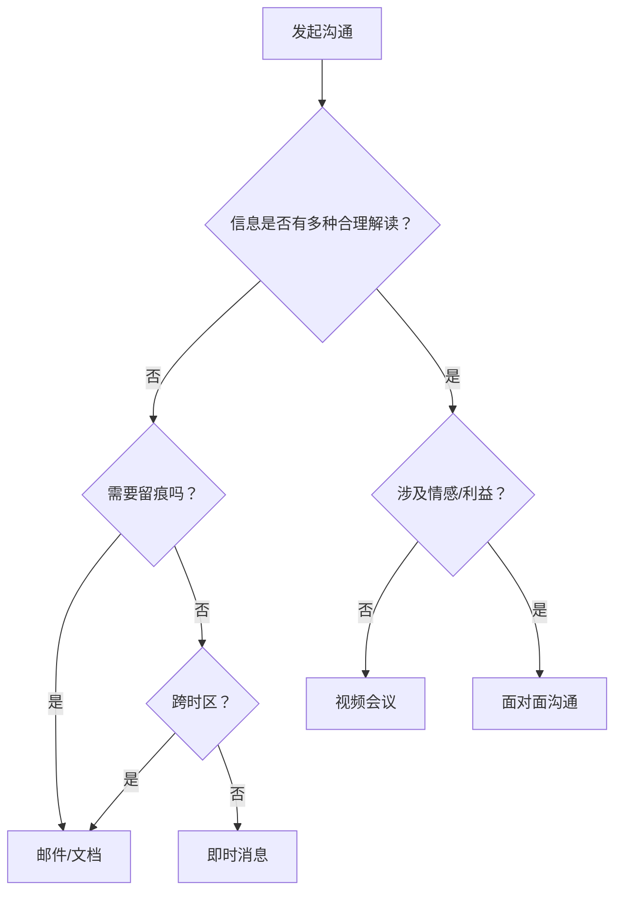
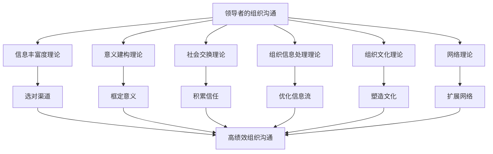

## 八、组织行为学中的沟通理论

组织行为学为领导力沟通提供了坚实的学科根基。与前几章侧重"领导者怎么说话"不同，本章从组织层面审视沟通——它不是个人技巧，而是组织运行的底层操作系统。以下六大理论构成了理解"组织中的沟通如何影响绩效、信任、变革与文化"的核心框架。

### 信息丰富度理论（Media Richness Theory）

#### 理论起源与核心命题

达夫特与伦格尔（Richard Daft & Robert Lengel, 1986）在研究组织信息处理需求时提出：不同沟通渠道携带的信息量存在本质差异。他们将渠道按"丰富度"（Richness）排列为一个连续谱：

| 丰富度等级 | 渠道示例 | 携带信息维度 |
|:---|:---|:---|
| 最高 | 面对面沟通 | 语言+语调+表情+肢体语言+即时反馈+情境线索 |
| 高 | 视频会议 | 语言+语调+表情（缺少完整肢体语言） |
| 中 | 电话/语音通话 | 语言+语调+即时反馈（无视觉线索） |
| 低 | 即时消息/邮件 | 仅文字（可含表情符号补偿） |
| 最低 | 正式报告/备忘录 | 结构化文字，无即时反馈 |

理论的核心命题是：**信息模糊性（equivocality）越高的任务，越需要高丰富度的渠道。** 模糊性不是指信息不足，而是指信息存在多种合理解读——比如"公司战略方向调整"这类消息，文字传达极易被不同人往不同方向解读。

#### 两个关键概念

**信息丰富度（Information Richness）**：一个渠道在单一沟通行为中能够传递多种信息线索的能力。面部表情、手势、语调、语速、停顿、身体姿态——这些并行信息通道让接收者能够交叉验证，从而更准确地理解发送者的真实意图。

**信息模糊性（Equivocality）**：一个问题或消息存在多种相互矛盾的解读方式的程度。简单通知（"明天9点开会"）模糊性低，文字渠道足以胜任；而"我们需要重组团队"模糊性极高，任何单一渠道都可能制造误解。

#### 领导力应用指南

**应该使用高丰富度渠道的场景：**

- **愿景传达**：企业转型方向、战略调整——这类信息涉及大量价值观判断，仅靠文字无法传递"为什么这样做"的情感张力。
- **绩效反馈**：尤其是负面反馈。邮件中的批评容易被放大语气，面对面沟通时领导者可以通过表情和语调传递"我希望你变得更好"而非"我在否定你"。
- **冲突调解**：当事人情绪高涨时，文字只会激化矛盾。面对面沟通中的沉默、叹气、握手等非语言信号往往比语言本身更有调解力。
- **变革宣布**：组织架构调整、裁员、并购——任何涉及个人利益的不确定性消息，都必须高丰富度渠道优先。

**低丰富度渠道的合理使用场景：**

- 事实性通知（会议时间、政策条文）
- 需要留痕和追溯的决策记录
- 跨时区、跨语言的日常协调
- 数据和报告的传递

**常见误区：**

| 误区 | 问题 | 正确做法 |
|:---|:---|:---|
| "所有重要沟通都必须面对面" | 大型组织不可能事事面谈 | 区分信息的模糊程度，低模糊信息用文字效率更高 |
| "视频会议=面对面" | 视频会议丢失了大量非语言信号，且存在"Zoom疲劳" | 真正重要的对话仍应争取线下进行 |
| "邮件效率最高所以优先用" | 效率不等于效果，复杂议题用邮件沟通会产生大量往返澄清 | 先面对面达成共识，再用邮件确认记录 |
| "年轻人习惯文字所以不用面谈" | 渠道偏好不能替代信息丰富度需求 | 根据沟通内容选渠道，不是根据个人偏好 |

**实操工具：渠道选择决策树**



---

### 组织意义建构理论（Organizational Sensemaking）

#### 卡尔·韦克的核心洞见

卡尔·韦克（Karl Weick, 1995）在《组织的社会心理学》中提出了一个颠覆性观点：**组织不是先有理解再有行动，而是在行动中通过沟通建构理解。** 换句话说，人们不是先弄清楚"发生了什么"再做出反应，而是通过"说给别人听"和"听别人说"来逐渐形成对现实的认知。

这个理论包含几个关键机制：

**回顾性（Retrospection）**：人只能理解已经发生的事。领导者不能等待"完全弄清楚"再沟通——因为"完全弄清楚"本身就需要通过沟通来实现。

**社会性（Sociality）**：意义不是个人脑中的产物，而是在人与人的互动中产生的。一个人的解读会被他人的反馈修正，最终形成集体理解。

**持续性（Ongoingness）**：意义建构永远不会"完成"。组织成员会持续地对新信息进行解读和再解读。

**提取线索（Enactment）**：人们不只是被动接收信息，还会通过自己的行动去"创造"情境，然后从这些情境中提取意义。领导者的一句话、一个决定，都会成为组织成员建构意义的"线索"。

#### 意义建构的七个属性

韦克（Weick, Sutcliffe & Obstfeld, 2005）后来将意义建构归纳为七个属性：

1. **扎根于身份建构**——"我是谁"决定了"我怎么看这件事"。组织变革时，如果员工的身份认同受到威胁（"我还是不是核心团队成员？"），任何沟通都首先会被身份焦虑过滤。
2. **具有回顾性**——人们用过去的经验框架来理解新事件。领导者需要帮助团队建立新的参照框架，而不是让旧框架继续主导解读。
3. **从线索中提取意义**——环境中充满了线索，但人们只会注意到与自己已有信念一致的线索（确认偏误）。领导者需要主动"框定"哪些线索值得关注。
4. **具有社会性**——走廊里的闲聊、茶水间的讨论、微信群里的吐槽——这些都是意义建构发生的场所，而且往往比正式渠道更有影响力。
5. **具有持续性**——意义建构不会因为一封全员邮件就停止。发完邮件才是意义建构的开始，不是结束。
6. **聚焦于提取和回击**——人们不会被动接受信息，他们会质疑、挑战、重新解读。领导者必须预期这种"推回"并做好准备。
7. **促使行动**——意义建构的最终产物不是"理解"，而是行动方向。如果沟通结束后人们只是"知道了"但不知道"该怎么做"，意义建构就失败了。

#### 领导者如何在实践中运用意义建构

**危机沟通中的意义建构三步法：**

**第一步：快速发声，抢占解释权。** 危机发生后，人们会立刻开始自行建构意义。如果领导者沉默，"走廊版本"就会成为主流叙事。韦克强调：**沉默不是中立，沉默等于放弃对叙事的控制权。**

实际操作：危机发生后24小时内必须发出第一次正式沟通。内容不需要完整，但需要包含三个要素：
- 我们知道发生了什么（事实）
- 我们正在做什么（行动）
- 下一步什么时候更新（预期管理）

**第二步：提供框架，不是答案。** 在高度不确定的环境中，领导者不可能有所有答案。与其给出虚假的确定性，不如提供解读框架：

```markdown
框架示例：
"这次重组意味着三件事——
第一，我们的核心业务不会改变（确定性）；
第二，部分团队会合并，具体方案下周确认（不确定性+时间表）；
第三，所有人的薪酬和职级不会在本季度内调整（底线保障）。"
```

**第三步：创造双向意义建构的机会。** 不要只是"宣布"，要创造让员工提问、质疑、表达焦虑的空间。全员大会后的小组讨论、匿名问答、一对一谈话——这些"意义建构的容器"比宣布本身更重要。

**组织变革中的意义建构实操：**

| 阶段 | 领导者的关键行动 | 常见失败模式 |
|:---|:---|:---|
| 变革启动 | 讲述"为什么变"的故事，连接组织历史与未来愿景 | 只说"是什么"不说"为什么" |
| 执行中期 | 定期分享进展和小胜利，持续框定"我们正在朝正确的方向走" | 长时间沉默让谣言填充信息真空 |
| 阻力出现 | 把阻力视为意义建构的正常环节，而非"不服从" | 将质疑者贴上"不配合"标签 |
| 变革落地 | 庆祝新身份，讲述"我们是如何做到的"集体故事 | 跳过总结直接进入下一个目标 |

---

### 社会交换理论（Social Exchange Theory）

#### 理论机制

社会交换理论（Blau, 1964; Emerson, 1976）的核心命题是：**人际互动本质上是一种交换关系，但与经济交换不同，社会交换中的"货币"是信任、尊重、支持和忠诚，交换的时间跨度是不确定的。**

在领导力语境中，这意味着：
- 领导者的每一次关怀、认可、授权都是在"存入"社会货币
- 这些存入不会立即产生回报，但会在未来以忠诚度、主动性和绩效的形式"兑现"
- 如果领导者只"提取"（要求、批评、施压）而不"存入"，社会账户就会破产——表现为冷漠、离职、消极抵抗

**组织中的三种交换关系：**

**1. 领导者-成员交换（LMX, Leader-Member Exchange）**

格雷恩与尤尔-比恩（Graen & Uhl-Bien, 1995）提出：领导者与不同下属建立的关系质量是不同的。高LMX关系的特征是高度信任、相互尊重和超出职责范围的互惠；低LMX关系则停留在正式的角色要求层面。

LMX的质量直接影响：
- 员工的组织公民行为（主动帮助同事、承担额外责任）
- 信息分享意愿（高LMX下属更愿意向上反馈坏消息）
- 创新行为（心理安全感更高，敢于尝试）
- 离职倾向（低LMX是离职的强预测因子）

**领导者自检：LMX关系质量评估表**

| 维度 | 高质量LMX信号 | 低质量LMX信号 |
|:---|:---|:---|
| 信任 | 下属主动分享真实想法和顾虑 | 下属只说"领导爱听的话" |
| 信息流动 | 双向信息畅通，下属愿意反馈坏消息 | 信息单向流动，下属隐瞒问题 |
| 授权程度 | 领导者给予自主空间和决策权 | 事事请示，微管理 |
| 超出职责 | 下属主动承担额外任务 | 只做份内事，"不归我管" |
| 忠诚度 | 关键时刻愿意为团队多走一步 | 机会合适时考虑离开 |

**2. 组织支持感（Perceived Organizational Support, POS）**

艾森伯格等人（Eisenberger et al., 1986）提出：员工会形成"组织是否重视我的贡献、关心我的福祉"的整体感知。这种感知主要来自组织的政策、实践和领导者的日常行为。

POS高的组织中，员工表现出更强的情感承诺和更低的缺勤率。而领导者的日常沟通——记住员工名字、关心个人困难、及时给予认可——是POS最重要的微观来源。

**3. 心理契约（Psychological Contract）**

卢梭（Rousseau, 1989）提出：员工与组织之间存在一种隐性的、未被正式书面化的相互期望。当组织（通过领导者的行为）违背心理契约时，员工的反应远比违反正式合同更强烈——表现为信任崩塌、绩效下降、甚至主动破坏。

**心理契约破裂的典型场景与修复策略：**

| 破裂场景 | 员工感知 | 修复策略 |
|:---|:---|:---|
| 承诺的晋升被推迟 | "组织不可信" | 主动沟通原因，给出明确的新时间表和保障 |
| 项目被取消，团队成员未被告知 | "我们不重要" | 先与核心成员一对一沟通，再全员宣布 |
| 裁员时说"不会影响你们"后又裁员 | "领导说的全是假话" | 如实沟通不确定性，不要做无法兑现的承诺 |
| 高绩效者与低绩效者得到相同待遇 | "努力没有意义" | 建立透明的差异化激励机制 |

#### 社会交换的"存款"与"取款"行为清单

**存款行为（建立信任资本）：**

- 公开认可团队成员的贡献（具体到人和事，不是泛泛表扬）
- 在上级面前为团队争取资源和利益
- 在团队犯错时主动承担责任（"是我的决策问题"）
- 记住团队成员的个人重要事件（生日、家人状况）
- 在没有正式要求的情况下提供帮助和指导
- 保护团队免受组织政治的干扰
- 给予真实的、可执行的发展反馈

**取款行为（消耗信任资本）：**

- 抢占团队的功劳
- 在公开场合批评个人
- 做出承诺后遗忘或反悔
- 只在需要产出时才出现
- 对团队的困难视而不见
- 选择性偏袒部分成员

**核心原则：存款的速度远慢于取款的速度。** 一次公开批评可能需要十次认可来弥补。领导者的信任资本需要长期、持续、一致性地积累。

---

### 组织信息处理理论（Organizational Information Processing Theory）

#### 理论框架

达夫特与伦格尔（1986，同信息丰富度理论的提出者）进一步将信息处理视角扩展到整个组织层面。核心命题是：**组织的信息处理需求由任务不确定性和任务互依性决定，而组织必须拥有足够的信息处理能力来匹配这些需求。**

**任务不确定性（Task Uncertainty）**：工作任务的可预测程度。流水线作业不确定性低，研发创新不确定性高。不确定性越高，对信息处理能力的需求越大。

**任务互依性（Task Interdependence）**：不同岗位或部门之间工作的相互依赖程度。互依性越高，协调所需的信息沟通越多。

**组织的信息处理能力可以通过两种策略提升：**

**1. 信息技术策略（Vertical Information Systems）**
- 管理信息系统（MIS）、企业资源计划（ERP）
- 数据仪表盘、自动化报告
- 适合处理结构化、可量化的信息

**2. 横向沟通策略（Lateral Relations）**
- 跨部门联络人、项目协调员
- 矩阵式组织结构
- 跨职能团队、联席会议
- 适合处理非结构化、需要协商的信息

#### 领导者的信息处理角色

在组织信息处理理论的框架下，领导者承担三个关键角色：

**信息守门人（Gatekeeper）**：决定什么信息向上、向下、横向流动。过度把关会导致信息孤岛，把关不足会导致信息过载。

**信息放大器（Amplifier）**：当团队需要重视某件事时，领导者通过反复提及、设置指标、公开讨论来放大信号。

**信息翻译器（Translator）**：将来自不同部门、不同专业背景的信息"翻译"成团队能够理解和使用的语言。

**实操：领导者信息处理效率提升方法**

| 问题 | 诊断 | 解决方案 |
|:---|:---|:---|
| 团队重复犯同一个错误 | 经验教训没有被结构化传递 | 建立复盘文档制度，每次项目结束后产出"关键学习" |
| 部门间协调成本过高 | 横向沟通渠道不足 | 设立跨部门联络人或定期联席会议 |
| 员工说"不知道公司发生了什么" | 信息传递链条过长或被截断 | 建立CEO到一线的定期沟通机制（全员月会/内刊） |
| 领导者成为瓶颈 | 所有信息都经过领导者中转 | 授权并建立透明的信息共享平台 |

---

### 组织文化与沟通的共生关系

#### 埃德加·沙因的文化三层次模型

埃德加·沙因（Edgar Schein, 2004）将组织文化分为三个层次，每一层都与沟通深度关联：

**第一层：人工制品（Artifacts）**——可见的组织结构和流程。包括：办公环境布局（开放还是封闭）、着装规范、会议形式（谁先说话、怎么称呼）、沟通工具选择（用邮件还是即时消息、用中文还是英文）。这些是文化的表层，容易观察但难以解读含义。

**第二层：信奉的价值观（Espoused Values）**——组织公开声称的理念和战略。比如"我们重视创新""客户第一""扁平化管理"。这些通过正式沟通传播——公司愿景声明、新员工培训、领导力讲话。

**第三层：基本隐性假设（Basic Underlying Assumptions）**——组织成员无意识共享的深层信念。比如"犯错是可耻的""领导说的就是对的""竞争比合作更重要"。这一层不会被正式沟通传播，但会通过领导者的日常行为、奖惩实践和被容忍或被压制的行为来传递。

**关键洞见：领导者的日常沟通行为比正式声明更能定义组织文化。** 如果CEO说"我们鼓励创新"，但每次有人提出新想法都被追问"ROI是多少"，那么真正的文化是"保守比创新安全"。

#### 用沟通塑造文化的实操路径

**1. 故事讲述（Storytelling）**

组织中的故事——创始人传说、危机往事、英雄员工——是文化传承最有效的载体。领导者需要：
- 收集和传播组织内部的正面故事（注意：虚假的故事会被识破，效果适得其反）
- 在新员工入职时讲述"我们是如何走到今天的"
- 在重大决策时引用历史故事作为决策依据（"上次类似情况，我们是这样处理的……"）

**2. 符号管理（Symbolic Management）**

领导者的每一个行为都是一个文化符号：
- 你坐的位置（坐在团队中间还是独立办公室）
- 你回复消息的速度（秒回还是三天后回）
- 你开会时是否带手机
- 你在非工作时间发不发工作消息

**3. 仪式设计（Rituals and Routines）**

| 仪式类型 | 示例 | 传递的文化信号 |
|:---|:---|:---|
| 每日站会 | 15分钟同步进展和阻碍 | 透明、敏捷、解决问题导向 |
| 月度复盘 | 团队一起回顾成功和失败 | 学习型组织、不惧失败 |
| 年度庆祝 | 表彰杰出贡献者 | 重视人才、认可努力 |
| 新人欢迎仪式 | 团队聚餐、导师配对 | 以人为本、融入感 |

---

### 领导力沟通的网络效应

#### 弱关系的力量

格兰诺维特（Granovetter, 1973）提出的"弱关系优势"理论在领导力中同样适用：**领导者最容易忽视的信息来源是弱关系——其他部门的同事、行业内的朋友、甚至离职的前员工。** 强关系（核心团队）提供情感支持但信息同质化；弱关系提供差异化信息和跨界视角。

**实践建议：**
- 定期与非直接下属、其他部门负责人进行非正式沟通
- 参加跨行业活动，建立组织外部的弱关系网络
- 在公司内部推行跨部门轮岗或影子项目

#### 结构洞理论

伯特（Burt, 1992）的结构洞理论进一步指出：**占据不同群体之间"桥梁"位置的人拥有信息优势和控制优势。** 领导者可以有意地将自己或团队成员放置在组织网络的结构洞位置——比如让某个人同时参与产品和技术两个团队的讨论，成为信息桥梁。

---

### 六大理论的整合框架

将以上理论整合，可以构建一个完整的"领导者组织沟通能力模型"：



**六大理论对应的领导者核心能力：**

| 理论 | 核心能力 | 一句话总结 |
|:---|:---|:---|
| 信息丰富度理论 | 渠道选择力 | 根据信息模糊度匹配沟通渠道 |
| 意义建构理论 | 叙事框架力 | 在不确定中帮助团队理解"正在发生什么" |
| 社会交换理论 | 信任投资力 | 持续向关系账户存款，谨慎取款 |
| 组织信息处理理论 | 信息架构力 | 设计让正确信息流向正确的人的系统 |
| 组织文化理论 | 文化塑造力 | 用日常行为而非口号定义组织文化 |
| 网络理论 | 关系网络力 | 主动构建和维护跨界信息网络 |

---

### 常见误区与纠偏

**误区一："沟通理论是学术的，跟实际管理没关系"**

组织行为学的每一个沟通理论都直接对应管理实践。不理解信息丰富度理论的领导者会用邮件处理裁员通知；不懂意义建构的领导者会在危机中选择沉默；不了解社会交换的领导者会透支团队信任而不自知。

**误区二："好的沟通=信息传达准确"**

信息传达准确只是起点。好的组织沟通需要同时实现：选对渠道（信息丰富度）、构建共同理解（意义建构）、积累信任资本（社会交换）、优化信息流动（信息处理）、传递文化信号（文化理论）、扩展信息来源（网络理论）。

**误区三："沟通问题出在员工听不懂"**

大多数组织沟通失败不是"听不懂"，而是渠道错误、信任不足、框架缺失或文化冲突。把问题归因于"员工理解力差"是领导者逃避自身责任的典型表现。

**误区四："建立信任就是对员工好"**

社会交换理论中的信任投资不是"讨好"，而是公平、一致和可靠。过度迁就不等于信任建设，反而会被解读为软弱。真正的信任投资是"高标准+高支持"——对绩效有明确要求，同时在过程中提供充足的资源和指导。

---

### 本节回顾

组织行为学为领导力沟通提供了六个互补的分析视角。信息丰富度理论告诉我们"用什么渠道说"，意义建构理论告诉我们"说什么以及怎么说才能让人理解"，社会交换理论告诉我们"怎么说才能让人愿意听"，组织信息处理理论告诉我们"如何设计信息流动的系统"，组织文化理论告诉我们"怎么说才能塑造想要的文化"，网络理论告诉我们"从哪里获取和传递信息"。

六者合一，构成了领导者在组织中进行有效沟通的完整知识体系。接下来的小结将把本章所有理论基础进行串联。
