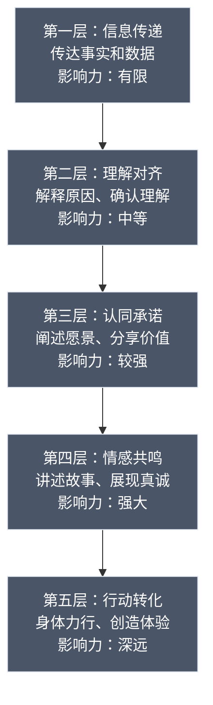
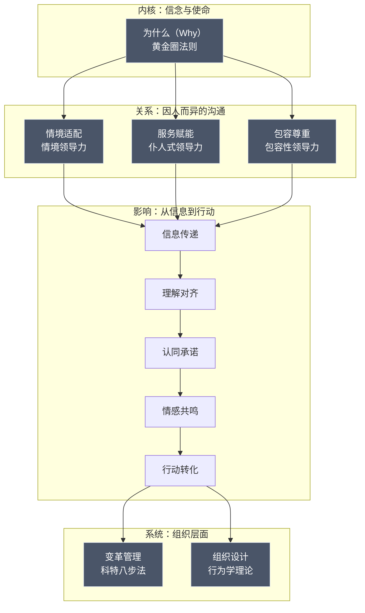

## 本节小结：领导力沟通理论全景整合

### 一、八大理论的完整回顾

本节系统梳理了领导力沟通的八大理论基础。这些理论并非孤立存在，而是从不同维度揭示了同一个核心命题：**领导者如何通过沟通影响他人、驱动行动、创造变革**。下面逐一回顾每个理论的核心要义与关键启示。

#### 1.1 黄金圈法则——从"为什么"开始

西蒙·斯涅克的黄金圈法则揭示了一个根本性的沟通差异：普通领导者从"做什么"（What）开始沟通，而卓越领导者从"为什么"（Why）开始。这一理论建立在人脑边缘系统与新皮层的结构差异之上——决策和行为驱动力来源于处理情感与信念的边缘系统，而非处理语言和逻辑的新皮层。

**核心启示：** 当你先传达信念和使命（Why），再解释方法和路径（How），最后呈现具体行动和产品（What），你就能激发他人内在的认同和行动力。苹果、马丁·路德·金、莱特兄弟的成功，都印证了这一模式。

**关键实践要点：**
- 明确你的"为什么"——不是赚钱，而是你相信什么
- 沟通顺序永远是 Why → How → What，而非反过来
- 你的"为什么"必须真实，伪装的信念会被识破

#### 1.2 变革型领导力——通过沟通重塑追随者

伯恩斯（1978年）提出、巴斯（1985年）发展的变革型领导力理论，将领导者的沟通行为归纳为四个维度：

| 维度 | 含义 | 沟通体现 |
|------|------|----------|
| **理想化影响（II）** | 成为榜样，展现高道德标准 | 言行一致，分享个人价值观和信念 |
| **鼓舞性激励（IM）** | 传递令人振奋的愿景 | 用富有感染力的语言描绘未来图景 |
| **智力激发（IS）** | 挑战追随者重新思考 | 提出启发性问题，鼓励创新思维 |
| **个性化关怀（IC）** | 关注每个人的成长需求 | 一对一沟通，因材施教的反馈 |

**核心启示：** 变革型领导力的四个维度本质上都是沟通行为。领导者不是通过权力命令，而是通过沟通激发追随者超越自我利益，为更高的组织使命而努力。元分析研究显示，变革型领导力与团队绩效的相关系数达到0.26-0.32，在知识型组织中效果尤为显著。

#### 1.3 情境领导力——没有最好的风格，只有最合适的风格

赫西和布兰查德（1969年）提出的情境领导力理论打破了"一种领导风格适用所有情境"的迷思。该理论的核心变量是**下属的成熟度**（能力+意愿的组合），领导者需要据此在两种基本行为之间灵活切换：

- **任务行为（指导性）：** 明确告诉做什么、怎么做、何时做、在哪做
- **关系行为（支持性）：** 倾听、鼓励、促进互动、提供情感支持

四种情境对应的沟通风格：

| 下属成熟度 | 推荐风格 | 沟通特征 | 典型场景 |
|-----------|---------|---------|---------|
| 低能力低意愿 | **告知式（S1）** | 高任务+低关系，明确指令 | 新员工入职、紧急危机 |
| 低能力高意愿 | **推销式（S2）** | 高任务+高关系，解释+鼓励 | 新项目启动、培训期 |
| 高能力低意愿 | **参与式（S3）** | 低任务+高关系，倾听+共识 | 老员工倦怠、变革阻力 |
| 高能力高意愿 | **授权式（S4）** | 低任务+低关系，充分信任 | 核心骨干、成熟团队 |

**核心启示：** 领导力沟通不是一套固定话术，而是需要根据对象的状态动态调整的灵活系统。最常犯的错误是"过度指导有能力的下属"和"过度放任新手"。

#### 1.4 科特变革管理——沟通是变革的生命线

约翰·科特（John Kotter）在《领导变革》中提出的八步变革模型，揭示了组织变革失败的根本原因：70%的变革项目未能达到预期目标，而其中绝大多数失败都与沟通不足或沟通失效直接相关。

八步模型中的沟通角色：

| 步骤 | 核心任务 | 沟通的关键作用 |
|------|---------|--------------|
| 1. 制造紧迫感 | 让组织意识到变革的必要性 | 用数据和故事呈现"不变革的代价" |
| 2. 组建领导联盟 | 建立有影响力的变革团队 | 跨部门对话、建立共同认知 |
| 3. 创建愿景和战略 | 明确变革方向和路径 | 将抽象战略转化为易懂的愿景声明 |
| 4. 传达变革愿景 | 让所有人理解并认同愿景 | 多渠道、反复、生动地传达 |
| 5. 授权广泛行动 | 消除变革障碍 | 倾听一线反馈、及时解决阻碍 |
| 6. 创造短期成果 | 展示变革的初步成效 | 庆祝和宣传早期胜利 |
| 7. 巩固成果并推进变革 | 避免"宣布胜利"过早 | 持续沟通进展和下一步计划 |
| 8. 将变革植入文化 | 使新行为成为常态 | 通过故事和仪式强化新文化 |

**核心启示：** 科特特别强调"过度沟通"（over-communication）的重要性——领导者认为自己已经充分传达了愿景时，实际上员工可能只接收到了信息的十分之一。变革沟通必须做到：多渠道、多形式、反复传达、言行一致。

#### 1.5 仆人式领导力——领导即服务

罗伯特·格林里夫（Robert K. Greenleaf）于1970年在《仆人式领导力》一文中提出这一理论，其核心命题颠覆了传统领导观：**领导者首先是一个服务者，然后才是一个领导者**。真正的领导力不是来自职位和权力，而是来自服务他人的意愿和能力。

仆人式领导者的十大特征（Larry Spears总结）：

1. **倾听（Listening）**——深度倾听，而非等待发言
2. **共情（Empathy）**——理解他人的感受和视角
3. **治愈（Healing）**——帮助他人和组织修复创伤
4. **觉察（Awareness）**——对自我和环境保持高度敏感
5. **说服（Persuasion）**——通过影响而非命令达成共识
6. **概念化（Conceptualization）**——超越日常的战略思考
7. **远见（Foresight）**——预见决策的长期后果
8. **管家意识（Stewardship）**——为组织和社区承担责任
9. **对人的承诺（Commitment to the Growth of People）**——投资于人的发展
10. **构建社区（Building Community）**——培育归属感和共同体

**核心启示：** 仆人式领导力的沟通模式是"倾听优先、赋能为本"。领导者不是站在团队前面发号施令，而是站在团队后面提供支持，帮助每个人发挥最大潜能。这种模式在知识型组织、创意团队和志愿者组织中效果尤为突出。

#### 1.6 包容性领导力——让每个声音都被听见

包容性领导力（Inclusive Leadership）关注的核心问题是：**如何在多元化的组织中创造一个每个人都能安全表达、充分参与的沟通环境**。

包容性领导者的六个特征性行为（Catalyst研究）：

| 行为 | 含义 | 沟通实践 |
|------|------|----------|
| **可见的承诺** | 公开表达对多元包容的支持 | 在会议和公开场合明确表态 |
| **谦逊** | 承认自己的盲点和局限 | 主动说"我不知道"、征求反馈 |
| **对偏见的觉察** | 了解自己和组织中的无意识偏见 | 审视自己的沟通模式和决策过程 |
| **对文化的好奇** | 真诚地想要了解他人的经历 | 提开放式问题、积极倾听 |
| **对协作的有效性** | 确保不同背景的人都能贡献 | 创造平等的发言机会 |
| **承诺勇气** | 在需要时挑战不公正 | 当看到排斥行为时及时干预 |

**核心启示：** 包容性沟通不是简单的"态度友善"，而是一套系统性的行为实践。研究表明，当团队成员感受到被包容时，其创新行为提升47%、团队承诺提升56%、离职意愿降低51%。

#### 1.7 领导力沟通的五个层次

领导力沟通按照影响力深度可以分为五个递进层次：



**核心启示：** 大多数领导者的沟通停留在第一层和第二层——他们善于传递信息和解释逻辑，但很少能触及情感共鸣和行动转化。卓越的领导者会刻意练习将沟通推向更高层次：用故事触发情感，用行动诠释信念，用体验创造持久改变。

#### 1.8 组织行为学中的沟通理论

组织行为学从系统层面审视领导力沟通，揭示了沟通在组织中的结构性作用。核心理论包括：

- **意义建构理论（Karl Weick）：** 组织成员通过沟通来理解模糊的环境，领导者是"意义的建构者"
- **信息丰富度理论（Daft & Lengel）：** 不同沟通渠道传递信息的能力不同，复杂问题需要高丰富度的渠道（面对面 > 电话 > 邮件 > 备忘录）
- **组织文化理论（Schein）：** 沟通模式本身就是组织文化的核心组成部分，领导者通过日常沟通不断强化或重塑文化
- **网络理论：** 领导者在组织沟通网络中的位置（中心度、桥接度）决定了其影响力

**核心启示：** 领导力沟通不仅仅是个人技巧问题，更是组织系统设计问题。领导者需要有意识地选择合适的沟通渠道、建构组织意义系统、塑造沟通文化。

---

### 二、理论之间的深层关联

这八大理论并非各自为政，它们之间存在紧密的逻辑关联和互补关系。

#### 2.1 理论的分层结构

从分析层次来看，八大理论可以分为三个层级：

| 层级 | 理论 | 关注焦点 |
|------|------|---------|
| **个人层面** | 黄金圈法则、变革型领导力、领导力沟通五层次 | 领导者个人的沟通理念和能力 |
| **关系层面** | 情境领导力、仆人式领导力、包容性领导力 | 领导者与追随者之间的关系动态 |
| **系统层面** | 科特变革管理、组织行为学理论 | 沟通在组织系统中的结构性作用 |

三个层级之间存在自下而上的支撑关系：个人能力是基础，关系质量是桥梁，系统设计是保障。

#### 2.2 理论之间的互补与交叉

各理论之间存在显著的交叉和互补关系。例如：

- **黄金圈法则 × 变革型领导力：** 黄金圈的"Why"对应变革型领导力的"理想化影响"和"鼓舞性激励"，二者都强调信念和愿景的传达
- **情境领导力 × 仆人式领导力：** 情境领导力强调因人而异，仆人式领导力强调服务导向，二者结合意味着"以服务之心行因材施教之事"
- **科特变革管理 × 组织行为学：** 科特的八步法提供了变革的行动框架，组织行为学提供了理解组织系统的理论透镜
- **包容性领导力 × 领导力沟通五层次：** 包容性沟通是实现第四层"情感共鸣"和第五层"行动转化"的重要前提

#### 2.3 核心理念的趋同

尽管表述不同，八大理论在以下核心理念上高度趋同：

1. **信念先行：** 黄金圈法则、变革型领导力和科特变革管理都强调"先打动人心，再推动行动"
2. **因人而异：** 情境领导力、仆人式领导力和包容性领导力都反对"一刀切"的沟通模式
3. **行动为证：** 变革型领导力的"理想化影响"、仆人式领导力的"服务行为"和领导力沟通五层次的"行动转化"都强调"做比说更重要"
4. **系统思维：** 科特变革管理和组织行为学理论都提醒我们，领导力沟通不能脱离组织系统的支撑

---

### 三、从理论到实践的整合框架

#### 3.1 领导力沟通的整合模型

将八大理论整合为一个可操作的实践框架：



**运作逻辑：** 以"为什么"为内核驱动，根据对象和情境选择合适的沟通风格（关系层），将沟通推向更高层次的影响力（影响层），最终在组织系统中落地为持续的变革和文化塑造（系统层）。

#### 3.2 领导者自检清单

将理论转化为日常可用的自检工具：

**沟通前的准备（黄金圈 + 情境领导力）：**
- 我清楚这次沟通的"为什么"吗？（不只是传达什么信息，而是要激发什么信念）
- 我了解沟通对象当前的能力和意愿水平吗？
- 我选择了适合对方成熟度的沟通风格吗？

**沟通中的执行（变革型领导力 + 包容性 + 五层次）：**
- 我是否在展示而非仅仅讲述？（理想化影响）
- 我是否用愿景和故事打动了听众？（鼓舞性激励）
- 我是否提出了启发性的问题而非只给答案？（智力激发）
- 我是否关注了每个人的独特需求？（个性化关怀）
- 我是否确保了每个声音都有机会被听到？（包容性）
- 我的沟通触及了哪个层次？如何推到更高层次？

**沟通后的跟进（科特 + 仆人式 + 组织行为学）：**
- 我是否通过多种渠道反复强化了核心信息？
- 我是否主动消除了执行层面的障碍？
- 我是否在为团队成员的成长服务？
- 我是否在有意识地塑造组织的沟通文化？

#### 3.3 常见的理论应用误区

| 误区 | 正确理解 |
|------|---------|
| "黄金圈法则就是加一句口号" | Why 必须是真实的信念，不是包装过的宣传语 |
| "变革型领导力就是画大饼" | 四个维度缺一不可，缺少个性化关怀的愿景只会制造怀疑 |
| "情境领导力就是看人下菜碟" | 核心是帮助下属成长，不是讨好或操控 |
| "科特八步法只适用于大型变革" | 其原理（紧迫感→愿景→行动→巩固）适用于任何规模的改变 |
| "仆人式领导力就是当老好人" | 服务不等于纵容，有时候服务意味着给予艰难的反馈 |
| "包容性领导力就是不得罪人" | 包容意味着主动挑战不公正，有时需要勇气面对冲突 |
| "领导力沟通五层次是线性的" | 五个层次可以同时存在于一次沟通中，且根据情境反复切换 |
| "组织行为学理论太学术化" | 信息丰富度、意义建构等理论直接指导日常沟通渠道选择 |

---

### 四、理论学习的进阶路径

#### 4.1 入门者：先掌握两个核心框架

对于领导力沟通的初学者，建议优先掌握两个最实用的框架：

1. **黄金圈法则**——帮你建立"从为什么开始"的沟通习惯，这是所有领导力沟通的起点
2. **情境领导力**——帮你建立"因人而异"的沟通意识，避免一刀切的陷阱

掌握这两个框架后，你的沟通将从"我说你听"升级为"我知道为什么说、知道怎么对你说"。

#### 4.2 进阶者：理解关系动态和系统影响

在入门基础上，进一步学习：

3. **变革型领导力**——理解如何通过四个维度全面提升沟通影响力
4. **仆人式领导力**——理解服务型沟通如何建立深层信任
5. **领导力沟通五层次**——理解如何将沟通从信息传递推向行动转化

这个阶段的领导者开始从"技巧驱动"转向"关系驱动"，懂得沟通的本质是建立连接而非传递信息。

#### 4.3 高级者：驾驭复杂系统和文化变革

在前两个阶段基础上，深化理解：

6. **科特变革管理**——理解如何在组织层面系统性地推进变革沟通
7. **包容性领导力**——理解如何在多元化环境中创造心理安全的沟通空间
8. **组织行为学理论**——理解沟通在组织系统中的结构性作用

这个阶段的领导者能够"跳出沟通看沟通"，从系统和文化的高度设计组织的沟通架构。

---

### 五、关键公式与模型速查

#### 5.1 核心公式

```text
领导力沟通效能 = 清晰的Why × 合适的风格 × 持续的行动 × 系统的支撑
```

缺少任何一个因子，整体效能都会大打折扣：
- 没有清晰的Why → 沟通缺乏灵魂，沦为信息广播
- 风格不合适 → 信息无法有效触达，产生误解和抵触
- 没有持续行动 → 承诺沦为空话，信任被透支
- 没有系统支撑 → 个人努力被组织惯性消解

#### 5.2 理论速查对照表

| 理论 | 提出者 | 核心问题 | 一句话精髓 | 最适用场景 |
|------|--------|---------|-----------|-----------|
| 黄金圈法则 | Simon Sinek | 人们为什么追随你？ | 从"为什么"开始 | 愿景传达、品牌沟通、团队激励 |
| 变革型领导力 | Burns/Bass | 如何激发超越自我的动力？ | 用信念和关怀激发追随者 | 团队激励、组织变革、文化建设 |
| 情境领导力 | Hersey/Blanchard | 对不同的人该怎么沟通？ | 风格匹配成熟度 | 新人培养、团队管理、绩效辅导 |
| 科特变革管理 | John Kotter | 如何推动组织级变革？ | 沟通是变革的生命线 | 组织变革、战略转型、流程优化 |
| 仆人式领导力 | Robert Greenleaf | 领导者应该是什么角色？ | 先服务，后领导 | 知识团队、创意组织、文化建设 |
| 包容性领导力 | Catalyst等 | 如何让每个人都有归属感？ | 创造安全的对话空间 | 多元团队、跨文化沟通、创新团队 |
| 沟通五层次 | 综合理论 | 如何提升沟通的影响力？ | 从信息传递到行动转化 | 演讲、一对一、全员沟通 |
| 组织行为学理论 | Weick/Daft/Schein | 沟通在组织中如何运作？ | 沟通塑造组织现实 | 沟通渠道设计、文化建设、变革管理 |

---

> **记住：理论不是用来背诵的，而是用来指导实践的。** 八大理论提供了八个不同的透镜，帮助你看到领导力沟通的不同侧面。在接下来的"核心技巧"部分，我们将把这些理论转化为可操作的技巧和方法；在"实战案例"部分，你将看到这些理论如何在真实场景中发挥作用。理论 → 技巧 → 案例，这就是从"知道"到"做到"的完整路径。

***
