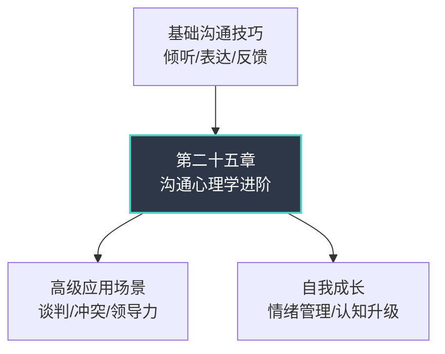
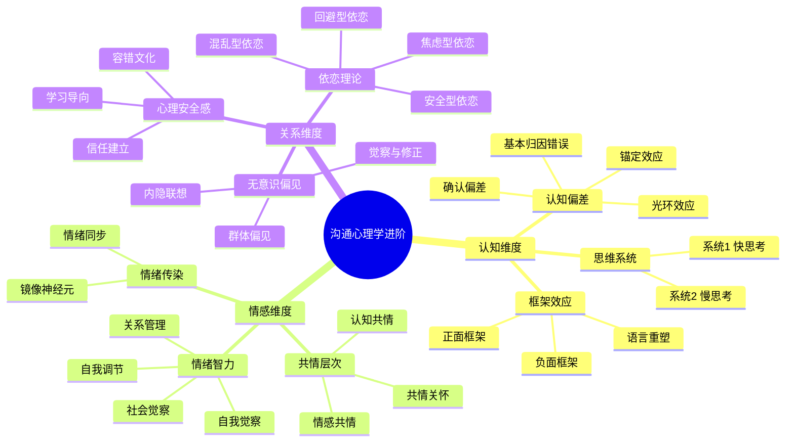

# 第二十五章 沟通心理学进阶

## 章节定位

在前面的章节中，我们系统学习了沟通的基本功——倾听、表达、反馈、非语言信号。但掌握技巧只是第一步。真正的沟通高手之所以能在复杂情境中游刃有余，是因为他们理解沟通背后的**心理机制**：为什么人们会误读信息？为什么同样的措辞在不同人身上效果截然不同？为什么有些对话从一开始就已经偏离了轨道？

本章是沟通主题的**高阶进阶篇**。我们不再停留在"怎么做"，而是深入"为什么"——从认知心理学、社会心理学、神经科学三个维度，剖析沟通中隐藏的心理力量。理解这些机制，你将获得一种"第三只眼"：在对话进行的同时，能够觉察到思维偏差、情绪传染、框架效应在如何悄然塑造沟通走向。

### 本章与其他章节的关系

本章承上启下：向下扎根于基础技巧的"知其然"，向上通往高级应用的"知其所以然"。如果你跳过了前面的基础章节直接阅读本章，建议至少先回顾"倾听的层次"和"非语言沟通"两节，因为本章的很多内容建立在这些基础之上。

---

## 核心主题

本章聚焦七大心理学维度，覆盖沟通中最关键的心理机制：

| 维度 | 核心问题 | 理论来源 | 实用价值 |
|------|----------|----------|----------|
| 认知偏差 | 我们的判断如何被系统性扭曲？ | 卡尼曼双系统理论 | 识别自己和他人的思维陷阱 |
| 情绪智力 | 如何在高压下保持沟通效能？ | 戈尔曼情商模型 | 管理情绪，避免冲动决策 |
| 共情层次 | 如何真正理解对方的感受？ | 罗杰斯人本主义 | 建立深度连接 |
| 心理安全感 | 如何创造让人敢于说真话的环境？ | 埃德蒙森团队研究 | 提升团队沟通质量 |
| 依恋理论 | 早期关系如何影响成年后的沟通模式？ | 鲍尔比依恋理论 | 理解亲密关系中的沟通困境 |
| 框架效应 | 信息的呈现方式如何影响决策？ | 特沃斯基前景理论 | 提升说服力和影响力 |
| 无意识偏见 | 我们如何看待"和自己不同"的人？ | 社会认知研究 | 减少歧视性沟通 |

---

## 学习目标

完成本章学习后，你应该能够：

### 目标一：识别认知偏差
理解确认偏差、锚定效应、光环效应、基本归因错误如何扭曲沟通判断。具体包括：能够在对话中觉察自己是否陷入了"只听自己想听的"的确认偏差；理解为什么第一个数字（锚点）会深刻影响后续谈判；认识到"以貌取人"背后的光环效应机制；以及避免将他人的行为简单归因于性格而忽略情境因素。

### 目标二：深化情绪智力
掌握情绪智力在高级沟通场景中的应用策略。不仅能识别自己的情绪状态，还能在情绪爆发前启动调节机制；能够区分"我在生气"和"我对这件事有愤怒的反应"两种不同的自我对话模式；学会在高压对话中保持认知清晰度。

### 目标三：分层理解共情
区分认知共情、情感共情和共情关怀三个层次，并灵活运用。认知共情是"我理解你的处境"；情感共情是"我能感受到你的痛苦"；共情关怀是"我愿意帮助你"。三者不是递进关系，而是需要根据情境灵活切换——心理咨询师需要情感共情，但医生更需要认知共情来保持专业判断。

### 目标四：构建心理安全感
借鉴艾米·埃德蒙森的理论，创造有利于开放沟通的环境。理解心理安全感不是"大家一团和气"，而是"可以安全地表达不同意见、承认错误、提出疑问"。掌握从领导者、团队成员、组织制度三个层面构建心理安全感的具体方法。

### 目标五：理解思维系统
认识系统1（快速、直觉、自动化）与系统2（缓慢、理性、费力）思维对沟通决策的影响。理解为什么人在疲劳时更容易做出冲动的沟通决定；为什么"第一反应"往往不是最佳反应；以及如何通过刻意切换思维系统来提升沟通质量。

### 目标六：觉察无意识偏见
识别并克服沟通中的隐性偏见。包括性别偏见、年龄偏见、文化偏见、外貌偏见等如何在无意识中影响我们的沟通态度和决策。掌握通过"暂停-觉察-调整"三步法来削弱偏见影响的实操技巧。

---

## 本章结构

本章采用**理论→技巧→实战→反思**的四段式结构，确保每个知识点都能从"知道"走向"做到"。

### 第一节：理论基础（9个子节）

介绍沟通心理学的核心理论框架。这是整章的知识地基，后续的技巧和案例都建立在这些理论之上。

**包含内容：**
- 认知心理学视角下的沟通——系统1与系统2在对话中的运作机制
- 核心认知偏差——确认偏差、锚定效应、光环效应、基本归因错误的详细解析
- 情绪智力的高级应用——戈尔曼四维模型在复杂沟通场景中的深化运用
- 共情的深度层次——认知共情、情感共情、共情关怀的区分与切换
- 心理安全感——埃德蒙森团队效能研究的核心发现
- 依恋理论与沟通——四种依恋风格如何塑造人际沟通模式
- 框架效应——信息呈现方式对沟通效果的影响机制
- 沟通中的无意识偏见——隐性偏见的形成机制与觉察方法
- 本节小结——理论基础的核心要点回顾

### 第二节：核心技巧（12个子节）

将心理学理论转化为可操作的沟通技巧。每个技巧都有清晰的使用场景、操作步骤和注意事项。

**包含内容：**
- 认知偏差觉察技巧——在实时对话中识别和应对思维陷阱的方法
- 框架转换技巧——如何通过语言重塑改变对话方向
- 高级共情技巧——在不同情境下灵活切换共情层次的实操方法
- 心理安全感构建技巧——从个人行为和团队制度两个层面创造安全环境
- 依恋觉察与沟通调整——识别自己和对方的依恋风格并调整沟通策略
- 无意识偏见觉察技巧——日常沟通中的偏见识别与纠正练习
- 综合应用：心理智慧沟通模型——将所有心理学工具整合为统一框架
- 高级说服心理学技巧——基于心理机制的说服策略
- 情绪传染与沟通氛围管理——理解和管理团队中的情绪动态
- 认知重构在沟通中的应用——如何改变对话双方对事件的解读框架
- 沟通中的自我觉察练习——建立持续自我反思的习惯
- 本节小结——核心技巧的系统回顾

### 第三节：实战案例（7个子节）

通过真实场景展示心理学原理的具体应用。每个案例遵循**问题识别→心理分析→解决方案→效果评估**的四步结构。

**包含案例：**
- 职场中的锚定效应与谈判——薪资谈判中如何设置和应对锚点
- 亲密关系中的依恋模式冲突——焦虑型与回避型伴侣的沟通困境
- 团队中的心理安全感建设——从"不敢说"到"愿意说"的转变过程
- 跨文化沟通中的框架效应——同一信息在不同文化背景下的解读差异
- 辅导中的共情层次应用——教练如何在不同阶段切换共情方式
- 处理沟通中的无意识偏见——识别并化解团队中的隐性歧视
- 本节小结——实战案例的共性规律提炼

### 第四节：常见误区

指出学习者在应用沟通心理学时常犯的错误。这一节的价值在于"避坑"——很多人学了心理学知识后反而沟通更差了，因为他们掉入了这些陷阱。

### 第五节：练习方法

提供系统的训练方案。不是"练习很重要"这样的空话，而是具体到每一天做什么、怎么记录、如何评估进步的可执行计划。

### 第六节：本章小结

回顾核心要点，整合各节内容，提供进一步学习的建议和资源。

### 第七节：深度拓展

为希望继续深入的读者提供进阶资源和研究方向。

---

## 关键概念导图

以下导图展示了本章涉及的核心概念及其相互关系：

### 概念间的关联

这些概念不是孤立的，它们在实际沟通中相互交织：

| 关联组合 | 互动机制 | 典型场景 |
|----------|----------|----------|
| 认知偏差 + 框架效应 | 确认偏差使框架效应更难被察觉 | 你已经同意对方观点，所以他的话怎么听都有道理 |
| 依恋风格 + 情绪智力 | 焦虑型依恋者需要更高情绪调节能力 | 伴侣没秒回消息时的内心风暴 |
| 心理安全感 + 无意识偏见 | 偏见会破坏心理安全感 | 少数群体成员感到"说了也没用" |
| 系统1思维 + 情绪传染 | 情绪传染主要通过系统1运作 | 会议室里一个人的焦虑迅速蔓延 |
| 共情 + 认知偏差 | 共情不足导致基本归因错误 | "他迟到就是因为不尊重我" |

---

## 适用人群

本章适合已经掌握基础沟通技巧、希望深入理解沟通背后心理机制的学习者。具体包括：

**直接适用：**
- **管理者和团队领导者**——需要理解团队成员的心理动力，创造高效沟通环境。心理安全感和情绪智力对你尤其关键。
- **心理咨询师和教练**——共情层次的精细区分和依恋理论的应用是你的核心工具。
- **教育工作者**——理解学生的认知偏差和依恋需求，能够显著提升师生沟通质量。
- **人力资源专业人士**——面试中的无意识偏见、绩效沟通中的框架效应，都是日常工作中的高频场景。
- **对人际关系有深度探索兴趣的个人**——理解自己和他人的沟通模式，是改善所有关系的起点。

**间接受益：**
- **销售人员**——框架效应和说服心理学直接提升沟通转化率。
- **创业者和产品经理**——用户访谈中的认知偏差识别直接影响产品决策质量。
- **跨文化工作者**——理解文化差异如何影响心理机制，避免无意识的冒犯。

### 前置知识要求

阅读本章前，建议你已经具备以下基础：

- 理解积极倾听的基本方法（复述、澄清、总结）
- 了解非语言沟通的基本要素（肢体语言、语调、空间距离）
- 有过至少一段时间的团队协作或亲密关系沟通经验

如果以上基础尚有欠缺，建议先阅读本书前面的章节。本章的很多内容需要结合实际沟通经验才能真正理解和内化。

---

## 阅读建议

### 推荐学习路径

**第一遍（建立框架，约2小时）：**
快速通读理论基础部分，不必逐字精读，重点理解每个概念的核心含义和相互关系。建议在阅读时画出自己的概念导图，这比单纯阅读的记忆效果好3倍以上。

**第二遍（深入学习，约4-6小时）：**
选择与你当前需求最相关的2-3个技巧，结合实战案例深入学习。这一遍要慢，每个技巧都要想清楚"我在什么场景下可以用"。

**第三遍（实践内化，持续2-4周）：**
按照练习方法部分的建议，每周选择1-2个练习坚持实践。不要贪多，深度练习比广度浏览更有效。建议用沟通日记记录每天的实践情况和反思。

### 学习效果加速器

1. **找一个学习伙伴**——心理学概念容易"自以为懂了"，和别人讨论能暴露理解盲区
2. **从最近的一次沟通困境入手**——用本章的框架分析一次真实经历，学习效果远超纯理论阅读
3. **每次只改变一个习惯**——同时调整太多沟通习惯会导致认知过载，反而退步
4. **允许自己犯错**——心理学知识的应用需要反复试错，每次"用错了"都是学习机会

---

## 本章核心问题

在阅读过程中，请持续思考以下问题。这些问题不是考试题，而是帮助你将知识与自身经验连接的思考锚点：

1. **你最常掉入哪个认知偏差陷阱？** 回想最近一次沟通失误，是确认偏差让你只听到了支持自己观点的信息，还是基本归因错误让你给对方贴了标签？

2. **你在高压对话中的默认反应是什么？** 是情绪爆发（系统1主导）还是能够暂停思考（启动系统2）？你的反应模式与你的依恋风格有什么关系？

3. **你的团队/家庭中，心理安全感程度如何？** 人们是否敢于表达不同意见？犯错后会被惩罚还是被理解？这些问题的答案直接影响沟通质量。

4. **你对哪些群体存在无意识偏见？** 这是一个不舒服但极其重要的问题。承认偏见的存在是消除偏见的第一步。

5. **你最近一次"换框"成功是什么时候？** 想想你如何通过改变描述方式改变了对话走向——这就是框架效应的实战应用。

这些问题将在后续各节中被反复引用和深化。带着问题阅读，你会发现每个知识点都在回答你真实存在的困惑。

---

> **阅读提示：** 本章内容密度较高，涉及多个心理学领域的专业概念。如果某个部分读起来吃力，不必强求一次理解透彻——先标记，继续阅读后续内容，很多时候后面的案例会帮助你理解前面的理论。学习心理学概念最重要的不是背诵定义，而是在真实沟通中反复验证和体悟。
