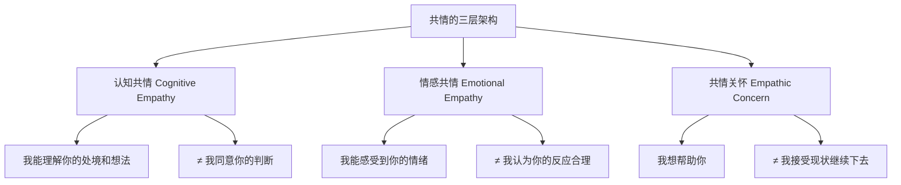
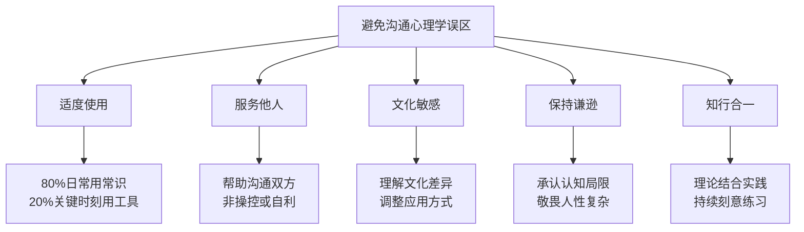

# 第四节 常见误区

学习沟通心理学的最大风险，不是学得太少，而是学得不当。知识本身是中性的，但应用方式会产生截然不同的效果。一个掌握心理学工具的人，既可能成为更好的沟通者，也可能成为更隐蔽的操控者；既能看见更深层的人际动态，也可能陷入过度分析的泥潭。

本节系统梳理学习沟通心理学后最容易陷入的十大误区，每个误区都包含表现识别、深层机制分析、典型案例、自检工具和纠正方案。目标不是让你回避心理学知识，而是让你更成熟、更准确地使用它。

---

## 误区一：过度心理学化

### 表现

学习了沟通心理学之后，开始对每一句话、每一个表情、每一次停顿都进行深度分析，把原本简单的日常沟通变成了复杂的心理解码。别人一个普通的皱眉，你会联想到微表情理论；同事没有秒回消息，你开始分析对方的依恋类型。

这种现象在心理学初学者中极为普遍，被称为"心理学专业学生综合征"（Psychology Student Syndrome）——刚学完一个新概念，就会在生活中到处"发现"它的证据。

### 深层机制

过度心理学化的根源在于**新知识的可得性偏差**（Availability Bias）。当你刚学完一个心理学概念，这个概念在你的认知系统中处于高度激活状态，导致你在判断任何相关现象时，都会优先调用这个概念。这不是你变得更敏锐了，而是你的注意力被新知识劫持了。

另一个机制是**控制幻觉**（Illusion of Control）。人际沟通天然具有不确定性，而心理学理论提供了一套解释框架，让人产生"我终于看懂了"的掌控感。这种掌控感本身令人愉悦，容易让人上瘾。

### 典型案例

> **场景**：同事在会议上没有采纳你的建议。
>
> **过度分析**："他一定是对我有偏见——这可能是光环效应的反面，也可能是因为上周我指出他的错误导致的报复心理，这涉及到基本归因错误和互惠原则的负面应用。而且他说话时身体后倾，这是防御姿态，说明他潜意识里在抗拒我的观点……"
>
> **实际情况**：同事只是觉得另一个方案更可行，皱眉是因为在思考成本问题。

> **场景**：朋友聚会时某人话少了些。
>
> **过度分析**："她是不是回避型依恋？是不是最近的生活事件触发了她的不安全感？我应该怎么用共情技术来打开她？"
>
> **实际情况**：她只是昨晚没睡好，有点累。

### 问题分析

1. **认知资源过载**：大脑的工作记忆容量有限（Miller的7±2法则），当你把大量认知资源用于分析时，用于倾听和回应的资源就减少了，沟通质量反而下降
2. **确认偏差放大**：一旦你预设了某种心理解释，你会不自觉地只关注支持这个解释的证据，忽略反面证据
3. **关系异化**：对方能感受到你在"分析"他，而不是在"和他"交流，这种感觉令人不适
4. **自我消耗**：持续的深度分析会导致心理疲劳，让你对沟通产生焦虑

### 自检清单

- 你是否在对话中花更多时间分析对方而非倾听对方？
- 你是否经常用心理学术语向朋友解释他们的行为？
- 你是否觉得"看穿"了别人，但对方并不认同你的分析？
- 你是否在普通社交场合也感到需要"解读"每一个细节？
- 你是否发现自己对简单问题给出复杂的心理学解释？

如果以上问题有3个以上回答"是"，你可能已经陷入过度心理学化。

### 纠正方案

**原则：心理学知识是望远镜，不是显微镜。望远镜让你看见远方的星辰，显微镜让你只看见眼前的细菌。**

1. **建立"使用阈值"**：只在以下情况启动心理学分析——
   - 沟通出现了明显的反复模式（不是单次事件）
   - 常规方法尝试无效后
   - 涉及重要关系的关键对话
   - 对方明确表达困惑或痛苦

2. **80/20法则**：80%的日常沟通用常识和直觉处理，20%的重要时刻才启动心理学工具

3. **延迟分析**：对话中不要实时分析，事后复盘时再运用心理学框架

4. **简单优先原则**：遇到一个现象，先问"有没有更简单的解释？"——大多数时候，同事只是在想方案，朋友只是累了

---

## 误区二：将心理学知识用于操控

### 表现

利用对认知偏差、心理弱点和情绪机制的了解来操控他人，以达到自己的目的。这不是偶尔的策略性沟通，而是系统性地利用心理学知识来剥夺他人的自主判断能力。

### 深层机制

操控的本质是**信息不对称的恶意利用**。当你知道锚定效应的机制而对方不知道时，你就在利用这种不对称性。道德边界在于：你是用这个知识来帮助对方做出更好的决策，还是让对方做出对你有利但对他自己不利的决策。

心理学中有一个关键区分：**说服**（Persuasion）与**操控**（Manipulation）的区别在于对方是否保留了知情同意的能力。说服是提供信息和框架帮助对方做出更好的选择；操控是绕过对方的理性判断，让他做出你想要的选择。

### 典型案例

> **场景**：销售经理培训团队。
>
> **操控式做法**："我们要利用客户的锚定效应，先报高价再打折，让他觉得占了便宜。利用从众心理，告诉他'很多人都买了'，哪怕数据是编的。利用损失厌恶，制造紧迫感——'这个优惠今天截止'，实际上根本不限时。利用权威效应，伪造客户评价和专家背书。"
>
> **结果**：短期内转化率确实上升了，但客户投诉率增长了300%，复购率下降了60%，品牌口碑持续恶化。一年后，这家公司的客户流失率是行业平均的3倍。

> **场景**：情侣关系中的情感操控。
>
> **操控式做法**："我知道她有焦虑型依恋，那我就用间歇性强化——有时候热情回应，有时候冷淡不理，这样她就会越来越离不开我。"
>
> **结果**：这不是心理学的应用，这是心理学的滥用。这种行为模式被称为"煤气灯效应"（Gaslighting），是一种情感虐待。

### 为什么操控必然失败

| 维度 | 短期效果 | 长期后果 |
|------|----------|----------|
| 信任 | 对方暂时不知道 | 一旦识破，信任彻底崩塌 |
| 关系 | 表面服从 | 深层抗拒和疏离 |
| 声誉 | 可能获利 | 社交圈中臭名远扬 |
| 自我 | 获得控制感 | 失去真诚连接的能力 |
| 法律 | 暂时安全 | 某些操控行为构成欺诈 |

### 道德边界测试

在使用任何心理学策略之前，问自己三个问题：

1. **透明度测试**：如果对方完全知道我在做什么，我还会这样做吗？
2. **互惠测试**：如果别人用同样的方式对我，我能接受吗？
3. **长期测试**：这种方式在十年后还能用吗？关系会变成什么样？

如果任何一个答案是否定的，你就在操控。

### 正确做法

- **心理学知识用于理解，而非控制**：理解对方的心理需求，是为了更好地满足它，而非利用它
- **目标是双赢**：真正的沟通高手不是让对方做你想要的事，而是找到双方都满意的方案
- **透明原则**：如果可能的话，让对方知道你的意图和理由
- **提升对方而非削弱对方**：好的心理学应用应该让对方变得更有判断力，而非更依赖你

---

## 误区三：忽视文化差异

### 表现

将基于西方（尤其是美国）研究的心理学理论直接套用到中国文化情境中，忽略文化背景对心理机制的根本性影响。这不仅是一个学术问题，更是实际沟通中的致命错误。

### 为什么文化差异如此重要

心理学研究的大部分理论都建立在"WEIRD"样本上——Western（西方）、Educated（受过教育）、Industrialized（工业化）、Rich（富裕）、Democratic（民主社会）的受试者。这些研究结论在其他文化中的适用性是高度存疑的。

更关键的是，文化不仅影响行为表现，还影响底层心理机制。例如：

- **自我概念**：西方文化中的自我是独立的（Independent Self），东方文化中的自我是互依的（Interdependent Self）。这意味着"自我表达"在不同文化中的心理意义完全不同
- **归因方式**：西方人更倾向内部归因（性格决定行为），东亚人更倾向情境归因（环境决定行为）。这直接影响你如何解读他人的行为
- **情绪表达**：西方文化鼓励情绪的直接表达，东亚文化更强调情绪的克制和情境适切性

### 典型案例

> **场景**：在中国企业中推行"直接反馈文化"。
>
> **错误做法**：完全照搬硅谷模式，鼓励员工"直接、坦诚"地反馈，不考虑中国文化的面子和关系因素。
>
> **具体表现**：要求员工在全员会议上直接指出同事的错误，用"三明治反馈法"（肯定-批评-肯定），要求经理对下属"有话直说"。
>
> **结果**：员工感到不舒服和被冒犯，优秀员工开始离职，留下的员工学会了"表面配合、内心抗拒"。团队凝聚力反而下降了。

> **场景**：在中国家庭中应用"非暴力沟通"。
>
> **错误做法**：照搬NVC的四步法（观察-感受-需要-请求），在与父母的沟通中使用。
>
> **具体表现**："爸，我观察到你这周第三次说我不够努力（观察），我感到委屈和不被理解（感受），因为我需要被尊重和信任（需要），你能不能不要再和别人比较我了（请求）？"
>
> **问题**：在中国文化语境中，这种表达方式显得生硬、自我中心，甚至有"忤逆"的意味。父母可能觉得你"学了洋东西就来教训老子"。

### 中西文化差异对照表

| 维度 | 西方倾向 | 中国倾向 | 对沟通心理学的影响 |
|------|----------|----------|-------------------|
| 反馈方式 | 直接、明确 | 间接、含蓄、给面子 | 直接批评在中国可能造成关系破裂 |
| 冲突处理 | 面对面对质 | 通过中间人调解、迂回表达 | 西式"直面冲突"在中国可能被视为不成熟 |
| 权力距离 | 相对平等 | 等级分明 | 下属直接挑战上级在中国职场风险极高 |
| 个人vs集体 | 个人表达优先 | 集体和谐优先 | "做自己"在集体主义文化中需要重新定义 |
| 时间观念 | 任务导向 | 关系导向 | 先谈关系再谈事情，在中国是基本礼仪 |
| 情绪表达 | 鼓励直接表达 | 强调克制和情境适切 | "有话直说"在中国文化中未必是美德 |
| 自我定位 | 独立自我 | 互依自我 | "找到自我"在不同文化中含义不同 |
| 沟通风格 | 低语境（信息在语言中） | 高语境（信息在语境中） | 中国人经常"话里有话"，需要听弦外之音 |

### 跨文化应用的修正原则

1. **理解原理的普遍性，注意应用的文化适应性**
   - 锚定效应在不同文化中都存在，但锚定的具体策略需要文化化
   - 共情在所有文化中都有价值，但表达共情的方式需要调整

2. **中国文化的核心心理需求**
   - **面子**（Mianzi）：不只是虚荣，是社会身份和尊严的外在体现
   - **关系**（Guanxi）：不只是社交网络，是信任和义务的长期积累
   - **人情**（Renqing）：不只是帮忙，是社会交换的隐性规则
   - **和谐**（Harmony）：不只是没有冲突，是维护群体凝聚力的主动追求

3. **间接沟通不等于无效沟通**
   - 中国人说"改天请你吃饭"，你不需要真的等那顿饭，这是一个社交信号
   - 中国人说"你看着办"，不是真的让你随便办，而是在表达信任的同时保留否认的空间
   - 理解间接沟通的规则，比强行推行直接沟通更有效

4. **找到文化融合点**
   - 不是非此即彼，而是在理解和尊重文化差异的基础上，找到适合当下情境的沟通方式
   - 对年轻人可以用更直接的方式，对长辈需要更含蓄
   - 在创新团队可以更开放，在传统组织需要更谨慎

---

## 误区四：共情等于同意

### 表现

认为表达共情就等于同意对方的观点或行为，导致两种极端：要么为了坚持立场而拒绝共情，让对方感到不被理解；要么为了表达共情而放弃立场，做出违心的妥协。

### 深层机制

这个误区的根源在于**情绪与判断的混淆**。人类大脑中，情绪处理（杏仁核、前扣带回）和逻辑判断（前额叶皮层）是相对独立的系统。你可以同时感受到对方的情绪（共情）和判断对方的行为不合理（立场），这两者并不矛盾。

但在实际沟通中，很多人把"理解你的感受"等同于"认可你的做法"，把"我能感受到你的痛苦"等同于"你做的是对的"。这种混淆导致了沟通中的两难困境。

### 典型案例

> **场景**：下属因为个人原因频繁请假，影响工作。
>
> **错误想法**："如果我表达理解，就等于认可他的行为，以后更难管理。"
>
> **错误做法A（拒绝共情）**："公司有公司的规定，你不能总请假。"——下属感到不被理解，关系恶化。
>
> **错误做法B（放弃立场）**："好吧，你有困难就请假吧。"——工作受影响，其他同事不满。

### 共情的三层架构

共情不是单一的能力，而是三个独立的层次，每个层次都可以独立运作：

- **认知共情**：理解对方的想法和处境——"我理解你最近家里有事，照顾家人确实需要时间"
- **情感共情**：感受对方的情绪——"我能感受到你的焦虑和压力"
- **共情关怀**：产生帮助的动机——"我想帮你找到一个既照顾家庭又不影响工作的方案"

这三个层次是独立的。你可以理解对方的处境，但不认同他的解决方案；你可以感受到对方的痛苦，但认为他的行为是不当的；你想帮助对方，但帮助的方式不是纵容。

### 正确的表达模板

> "我理解你最近遇到了一些困难（认知共情），我能感受到你的压力（情感共情）。同时，频繁请假对团队和项目都有影响（陈述事实）。让我们一起看看有没有什么办法，既能处理你的个人事务，也能保证工作的正常进行（共情关怀+立场）。"

关键结构：**共情 + "同时"（而非"但是"） + 立场 + 共同解决**

"同时"和"但是"的区别：
- "我理解你，但是……"——对方听到的是"但是"后面的内容，前面的共情被抵消
- "我理解你，同时……"——共情和立场并存，对方既感到被理解，也知道你有底线

---

## 误区五：忽略情绪的信号价值

### 表现

过度强调理性沟通，试图完全消除情绪，认为情绪是沟通的障碍。典型表达是"不要带情绪"、"我们理性讨论"、"把情绪放一边"。

### 深层机制

这个误区源于启蒙运动以来西方文化对理性的过度推崇。笛卡尔的"我思故我在"把理性置于人类存在的核心，而把情绪视为需要被理性控制的"低级"功能。

但现代神经科学（尤其是Antonio Damasio的研究）已经证明：情绪不是理性的对立面，而是理性决策的必要组成部分。Damasio研究了前额叶损伤的患者，这些患者保留了完整的逻辑推理能力，但由于无法产生情绪，反而无法做出简单的决策——因为他们无法判断哪个选项"更重要"。

### 情绪的四大功能

| 功能 | 说明 | 在沟通中的作用 |
|------|------|---------------|
| **信号功能** | 告诉我们什么对我们重要 | 愤怒=边界被侵犯；焦虑=不确定性过高；委屈=付出不被看见 |
| **动机功能** | 驱动我们采取行动 | 没有情绪参与，人们不会真正改变行为 |
| **社会功能** | 帮助他人理解我们的状态 | 情绪是沟通的信号灯，让对方知道你的感受和需求 |
| **适应功能** | 帮助我们应对环境变化 | 情绪快速评估环境，比理性分析更快地做出反应 |

### 典型案例

> **场景**：团队成员对新政策感到不满。
>
> **错误做法**："大家不要带情绪，我们理性讨论这个问题。"
>
> **隐含信息**：你的感受不重要，或者说你的感受是不合理的。这会让员工感到被贬低和不被尊重。
>
> **结果**：表面上情绪被压制了，但不满并没有消失——它转入地下，变成消极怠工、小团体抱怨、离职倾向。

> **场景**：伴侣因为家务分工不均而发火。
>
> **错误做法**："你能不能冷静一点？我们理性地谈谈。"
>
> **问题**：发火本身就是信号——它在说"我已经忍了很久了，这件事对我来说很重要"。压制这个信号，问题不会消失，只会积累。

### 正确的情绪处理流程

1. **接纳情绪**："我能感觉到大家对这个变化有强烈的感受"——不说"别生气"，而是承认情绪的存在和合理性
2. **探索信号**："这些感受背后，是什么让你们最担心？"——把情绪作为信息来源，而非干扰
3. **识别需求**：情绪背后总有一个未被满足的需求——安全感、公平感、被尊重、被看见
4. **表达需求**：帮助对方把模糊的不满转化为具体的需求表达
5. **共同解决**：在情绪被处理后，再进入方案讨论

### 情绪≠发泄

需要澄清的是：接纳情绪不等于允许无限制的情绪发泄。情绪表达需要在尊重他人的框架内进行：

- ✅ "我对这个决定感到失望"——表达情绪
- ✅ "这件事让我感到不被尊重"——情绪+需求
- ❌ "你们这些人都不配做领导"——情绪发泄+人身攻击
- ❌ 摔门、砸东西——行为化的暴力表达

接纳情绪≠允许伤人行为。底线是：你可以表达任何感受，但不能用伤害他人的方式表达。

---

## 误区六：心理安全感等于没有标准

### 表现

误以为创造心理安全感就是不能批评、不能有高标准、不能让任何人感到不适。结果把"安全"变成了"平庸"的代名词。

### 深层机制

这个误区的根源在于对"安全"一词的日常理解与学术定义之间的差距。日常语境中，"安全"意味着"没有风险"；但在Amy Edmondson的理论中，"心理安全"指的是"承担人际风险不会受到惩罚"——你可以提问、承认错误、提出不同意见，而不用担心被嘲笑或报复。

关键区别：心理安全感保护的是**学习行为**（提问、试错、反馈），不是**绩效标准**（产出质量、专业要求、行为规范）。

### Amy Edmondson的二维模型

                    高标准
                      │
         焦虑区        │        学习区
    （高压力、怕犯错）  │  （敢于尝试、追求卓越）
                      │
    ──────────────────┼─────────────────
                      │
         漠然区        │        舒适区
    （无所谓、混日子）  │  （愉快但平庸）
                      │
                    低标准
    低心理安全 ────────┼──────── 高心理安全

- **学习区**（高心理安全+高标准）：最佳状态——人们敢于冒险、追求卓越、互相支持
- **舒适区**（高心理安全+低标准）：表面和谐但绩效平庸——"一团和气但没有产出"
- **焦虑区**（低心理安全+高标准）：高压环境——"KPI导向但人人自危"
- **漠然区**（低心理安全+低标准）：最差状态——"既不安全也没标准"

### 典型案例

> **场景**：新经理想创造心理安全的团队文化。
>
> **错误做法**："大家做什么都可以，我不会批评任何人。"三个月后代码质量下降40%，核心工程师离职——他们觉得在这样的团队里没有成长。
>
> **正确做法**：设立明确的技术标准和绩效期望，同时创造一个"犯错可以被讨论、问题可以被暴露"的环境。代码评审有严格标准，但评审方式是建设性的而非指责性的。

### 正确做法

1. **明确标准，支持达标**：高标准本身不破坏心理安全感，破坏安全感的是"高标准+惩罚失败"
2. **区分"对人温和"和"对事严格"**：你可以同时对人充满尊重和对事非常严格——这不是矛盾，而是成熟
3. **失败是学习的机会**：当有人犯错时，问"我们能从中学到什么？"而不是"谁该为此负责？"
4. **反馈要具体、建设性**：
   - ❌ "这个方案不行"（模糊、否定）
   - ✅ "这个方案在成本控制方面有改进空间，具体来说……"（具体、建设性）

---

## 误区七：框架效应等于欺骗

### 表现

认为使用框架技巧就是"玩文字游戏"、"粉饰太平"，拒绝使用有效的沟通框架，坚持"直来直去"才是诚实。

### 深层机制

这个误区源于对"框架"概念的误解。框架（Framing）不是捏造事实，而是选择呈现事实的角度。任何一个事件都有多个真实的维度，选择强调哪个维度、用什么顺序呈现、搭配什么语境，就是框架选择。

举个例子：一个杯子中有半杯水。"还有半杯水"和"只剩半杯水"都是真实的描述，但它们激活的心理反应完全不同。这不是欺骗——你没有说假话——但你选择了一个不同的角度。

### 框架 vs 欺骗的本质区别

| 维度 | 框架选择 | 欺骗 |
|------|----------|------|
| 事实基础 | 100%基于真实信息 | 隐藏或扭曲事实 |
| 信息完整性 | 选择角度，不隐瞒 | 故意遗漏关键信息 |
| 意图 | 帮助对方更好地理解和处理 | 让对方做出不利于自己的判断 |
| 可验证性 | 所有信息经得起核实 | 无法经得起核实 |
| 对方自主权 | 保留对方的判断能力 | 削弱对方的判断能力 |

### 典型案例

> **场景**：需要传达裁员消息。
>
> **欺骗式**："公司发展很好，只是做一些小的组织调整。"——事实扭曲
>
> **生硬式**："你被裁员了，下个月走人。"——事实准确但缺乏框架
>
> **框架式**："公司正在进行战略转型，你的职位在这个过程中受到影响。我们理解这对你的影响，会提供补偿方案和再就业支持。让我们详细谈谈接下来的安排。"——事实准确，框架帮助对方处理信息

> **场景**：向上汇报项目延期。
>
> **生硬式**："项目延期了两周。"
>
> **框架式**："为了确保产品质量，我们额外花了两周进行深度测试，发现并修复了三个关键缺陷。这些缺陷如果不修复，上线后可能导致用户数据丢失。"——同样的事实，不同的框架，不同的理解

### 正确的框架使用原则

1. **事实必须100%准确**：框架不改变事实，只改变呈现角度
2. **不隐瞒关键信息**：如果对方追问，坦诚说明所有维度
3. **选择对双方最有利的真实角度**：不是只选对你有利的角度，而是选对理解和解决问题最有利的角度
4. **框架服务于理解，而非误导**：如果一个框架会让对方做出错误判断，那它就不是好的框架

---

## 误区八：单一理论万能化

### 表现

学习了某种心理学理论后，用它解释所有的人际现象。学了依恋理论，就把所有关系问题都归因于依恋类型；学了MBTI，就把所有性格差异都用16型人格解释；学了非暴力沟通，就把NVC当作所有沟通问题的万能钥匙。

### 深层机制

这种现象叫做**锤子定律**（Maslow's Hammer）："如果你手里只有锤子，所有东西看起来都像钉子。"心理学理论是解释世界的工具，但每个工具都有其适用范围和局限性。

更深层的原因是**认知闭合需求**（Need for Cognitive Closure）。面对复杂的人际现象，一个单一的、简洁的解释框架让人感到安心——"我终于看懂了"。但这种安心感是虚假的，因为它牺牲了准确性。

### 典型案例

> **场景**：学了依恋理论后的"依恋万能论"。
>
> - 同事沉默不语 → "回避型依恋"
> - 朋友情绪波动 → "焦虑型依恋"
> - 领导决策独断 → "回避型依恋的表现"
> - 所有的人际问题都用依恋理论解释
>
> **问题**：同事可能只是内向，朋友可能最近压力大，领导可能只是经验丰富。依恋理论主要适用于亲密关系，不一定适用于职场关系。

> **场景**：学了非暴力沟通后的"NVC万能论"。
>
> - 所有冲突都用NVC四步法解决
> - 对方不接受NVC就觉得"他没有共情能力"
> - 忽略文化差异——NVC的直白风格不适合所有文化语境
> - 忽略权力差异——下属对上级使用NVC可能有风险

### 理论适用范围对照

| 理论 | 最佳适用场景 | 局限性 |
|------|------------|--------|
| 依恋理论 | 亲密关系、亲子关系 | 不完全适用于职场和一般社交 |
| 非暴力沟通 | 关系中的冲突化解 | 对文化语境敏感，直白风格不普适 |
| 认知行为框架 | 个人情绪和思维调整 | 需要对方有自省意愿和能力 |
| 系统理论 | 家庭和组织动力学 | 个体层面的干预可能不足 |
| 社会交换理论 | 功利性关系分析 | 无法解释利他和无偿付出 |
| MBTI/性格测试 | 自我认知的入口 | 科学效度有限，不宜用于决策 |

### 纠正方案

1. **多元视角**：同一个现象用至少两个不同的理论来解释，比较哪个更符合具体情境
2. **保持开放**：不急于下结论，先收集更多信息
3. **持续观察**：用行为验证假设——如果对方的行为持续符合你的理论预测，说明理论可能适用；如果反复出现反例，你需要修正或放弃这个理论
4. **尊重复杂性**：人不是理论的简单实例。每个人都是独特的，受基因、成长经历、当前情境、文化背景等多重因素影响
5. **理论是地图，不是领土**：地图帮助你导航，但它永远不是真实的世界本身

---

## 误区九：忽视自身盲点

### 表现

善于识别他人的认知偏差，却对自己的偏差视而不见。更危险的是，心理学知识反而成为了为自己的偏差辩护的工具。

### 深层机制

这涉及心理学中最讽刺的现象：**偏差盲点**（Bias Blind Spot）。研究发现，大多数人都认为自己比一般人更少受到认知偏差的影响——即使他们刚刚学习了这些偏差。你越是了解偏差，越可能觉得自己已经"免疫"了。

另一个机制是**动机性推理**（Motivated Reasoning）：当你想证明自己是对的时，你的大脑会自动搜索支持你立场的证据，忽略反面证据。心理学知识为你提供了更精密的辩护工具，但不一定会让你更客观。

### 典型案例

> **场景**：心理学爱好者的"偏差武器化"。
>
> - 在争论中说"你这是确认偏差"——但自己也在确认偏差中
> - 指出别人的"基本归因错误"——但自己也在犯同样的错误
> - 用心理学知识为自己的行为辩护——"我这样做是因为我有回避型依恋"
> - 把所有批评都归因为"投射"——"你批评我，其实是你自己内心的问题"

> **场景**：心理咨询师的反移情盲区。
>
> 一个心理咨询师在工作中非常善于识别来访者的防御机制，但在自己的亲密关系中，却无法觉察自己在使用同样的防御机制。专业知识的权威感让他觉得自己"应该已经处理好了"，反而更难接受他人的反馈。

### 自我审视工具

**偏差自检五问**：

1. **镜像检验**：我刚才指出别人的问题，我自己有没有同样的问题？
2. **动机检验**：我的分析结论恰好支持了我的利益，这是巧合还是偏差？
3. **反驳检验**：有没有有力的证据反驳我的结论？我有没有认真考虑过？
4. **他人检验**：如果我信任的人对我提出同样的批评，我会怎么反应？
5. **时间检验**：一年后回看今天的判断，我还会得出同样的结论吗？

### 纠正方案

1. **对自己的思维保持同样的审视**：如果你能识别他人的确认偏差，也要定期检查自己是否在确认偏差中
2. **建立"认知偏差伙伴"**：找一个你信任的人，授权他在你出现偏差时直言指出
3. **定期自我反思**：每周花15分钟回顾本周的沟通，问自己"有没有什么地方我可能在偏差中？"
4. **保持知识的谦逊**：知道自己有偏差不等于没有偏差——知行合一是终身的功课
5. **欢迎批评**：当别人指出你的偏差时，第一反应不是辩护，而是感谢

---

## 误区十：知识替代实践

### 表现

读了很多心理学书籍，能流利地讨论各种理论和概念，但在实际沟通中依然使用旧有模式。把"知道"等同于"做到"，用知识积累替代行为改变。

### 深层机制

这个误区的根源在于**知识幻觉**（Illusion of Knowledge）。阅读和理解一个概念会让人产生"我已经掌握了"的感觉，但从知识到技能之间有一条巨大的鸿沟。

心理学中区分两类知识：
- **陈述性知识**（Declarative Knowledge）：知道"是什么"——了解共情的定义、步骤和理论
- **程序性知识**（Procedural Knowledge）：知道"怎么做"——在真实的情绪激动场景中能自然地运用共情

从陈述性知识到程序性知识，必须经过大量的刻意练习。你可以读100本游泳教材，但只有下水才能学会游泳。

### 典型案例

> **场景**：心理学课程学员的困惑。
>
> "我上了这么多人际沟通的课，读了这么多书，为什么在和伴侣吵架的时候，还是控制不住自己？道理我都懂，但就是做不到。"
>
> **原因**：知识存储在大脑皮层，但情绪反应由杏仁核驱动。在情绪激动时，杏仁核会"劫持"前额叶皮层的功能，让你在那一刻忘记所有学过的理论。只有通过反复练习，把新行为变成自动化的习惯，才能绕过这个限制。

### 从知识到技能的转化路径

1. **不知道**：还没接触这个知识
2. **知道但做不到**：理解了理论但无法在实际中运用——大多数人停在这里
3. **做得到但需要努力**：能在提醒下做到，但需要刻意控制
4. **做得自然**：不需要提醒也能做到，但偶尔会退步
5. **成为习惯**：新行为已经自动化，成为自然反应

### 纠正方案

1. **小步实践**：不要试图一次性改变所有行为。每周选一个具体技能，刻意练习
2. **复盘机制**：每次重要沟通后，花5分钟复盘——哪里做得好？哪里可以改进？下次怎么做？
3. **找到练习伙伴**：和朋友或伴侣约定，互相练习和反馈
4. **从安全场景开始**：先在风险低的场景练习，等熟练后再在重要场景使用
5. **接受不完美**：改变需要时间，偶尔退步是正常的，关键是持续练习

---

## 如何系统性地避免这些误区

### 五大核心原则

**原则一：适度使用**
心理学知识是调味品，不是主菜。80%的日常沟通用常识和直觉处理，20%的重要时刻才启动心理学工具。不要把每一次对话都变成心理学实验。

**原则二：服务他人**
使用心理学知识的目标是帮助沟通双方获得更好的结果，而非操控他人或为自己辩护。在每次使用心理学知识之前，问自己："这样做对双方都有利吗？"

**原则三：文化敏感**
考虑文化背景，在不同的文化情境中调整应用方式。心理学原理可能是普遍的，但应用方式必须是文化化的。在中国文化中，理解面子、关系、人情和和谐的核心需求。

**原则四：保持谦逊**
承认自己的认知局限，对复杂的人性保持敬畏。你永远不可能完全理解另一个人，心理学理论提供的是近似理解，不是绝对真理。

**原则五：知行合一**
知识不等于能力。从"知道"到"做到"需要大量刻意练习。每周选一个具体技能练习，复盘每次重要沟通，持续精进。

### 误区急救指南

当你不确定自己是否陷入了某个误区时，用这个快速检查表：

| 检查项 | 问自己 |
|--------|--------|
| 过度分析？ | "我是在倾听还是在解读？" |
| 操控意图？ | "如果对方完全知道我的策略，我还会这样做吗？" |
| 文化盲区？ | "这个方法在对方的文化背景中适用吗？" |
| 共情混淆？ | "我是在理解对方还是在认同对方？" |
| 情绪压制？ | "我是在处理情绪还是在忽略情绪？" |
| 标准缺失？ | "安全感和高标准我都有吗？" |
| 框架恐惧？ | "我是在选择角度还是在扭曲事实？" |
| 理论迷信？ | "我有没有用其他理论来检验我的解释？" |
| 盲点自检？ | "我自己有没有同样的问题？" |
| 知行差距？ | "我做到了，还是只是知道？" |

---

## 本节小结

学习沟通心理学最大的风险不是学得不够，而是学得不当。这十大误区——过度心理学化、操控他人、忽视文化差异、共情混淆、压制情绪、标准缺失、框架恐惧、理论迷信、盲点忽视、知行脱节——每一个都是真实而常见的陷阱。

避免这些误区的核心在于三个字：**度、善、谦**。

- **度**：适度使用，不过度分析，不过度依赖
- **善**：以善意为出发点，服务他人而非操控他人
- **谦**：保持谦逊，承认自己的局限，对人性保持敬畏

将心理学知识作为理解和服务他人的工具，而非操控或标签化的武器。保持谦逊、开放和适度，才能真正发挥心理学知识的价值，成为一个更好的沟通者——不是因为你掌握了多少技巧，而是因为你真正理解了人与人之间连接的本质。
