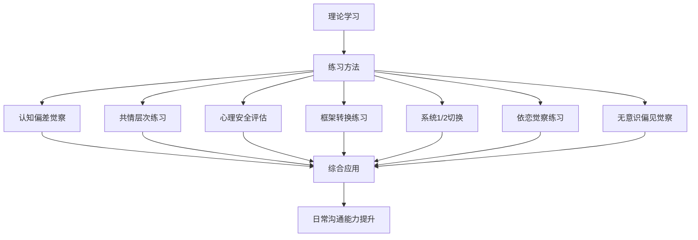
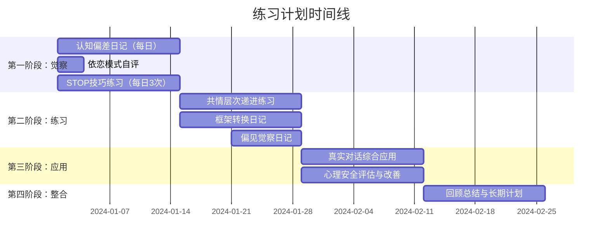

# 第五节 练习方法

沟通心理学是一门实践性极强的学科——理解认知偏差、共情层次、框架效应等概念只是起点，真正的成长发生在反复练习与自我觉察的过程中。本节提供七套系统化的练习方案，涵盖从前文理论基础到核心技巧的全部关键能力点。每套练习都包含理论依据、操作步骤、进度评估和常见问题应对，确保你可以独立完成从"知道"到"做到"的跨越。

---

## 练习一：认知偏差日记

### 为什么这个练习有效

认知偏差是大脑为了快速处理信息而形成的"捷径"。Daniel Kahneman 在《思考，快与慢》中指出，这些捷径在大多数情况下是高效的，但在复杂沟通场景中会导致系统性的判断失误。通过每日记录和反思，你在训练自己的元认知能力——即"思考自己如何思考"的能力。神经科学研究表明，持续的元认知练习可以增强前额叶皮层对杏仁核反应的调控，也就是说，你可以从根本上降低冲动反应的概率。

### 基础练习：每日偏差记录

**目的**：培养识别自身认知偏差的习惯，提高自我觉察能力。

**每日记录模板**：

日期：____
情境描述：（具体场景，越详细越好）
我的第一反应：（不加修饰地写下当时的想法）
可能涉及的偏差：
□ 确认偏差 — 只关注支持自己观点的信息
□ 锚定效应 — 被最先接收到的信息过度影响
□ 光环效应 — 因为某人一个优点就全面高估
□ 基本归因错误 — 把别人的行为归因于性格，把自己的归因于环境
□ 损失厌恶 — 对失去的恐惧远大于对获得的渴望
□ 框架效应 — 同一信息因表述方式不同而判断不同
□ 可得性偏差 — 因为容易想到就认为更常见
□ 后见之明偏差 — 事后觉得"我早就知道"
□ 其他：____

替代解释：（至少写出2种其他可能的解读方式）
如果重来，我会：____

**操作要点**：

1. **时间选择**：推荐在每天睡前进行，此时记忆最清晰。设定一个固定闹钟，每次花费5-10分钟即可
2. **记录标准**：不必等到"完美"的偏差案例，日常小事同样有价值。同事迟到、朋友没回消息、领导语气变化——这些微小场景往往最能暴露默认思维模式
3. **诚实原则**：记录的目的不是证明自己正确，而是发现思维盲区。写下"不光彩"的想法反而更有价值

### 进阶练习：偏差模式分析

**每周回顾**（每周日花20分钟）：

1. 统计本周出现频率最高的3种偏差类型
2. 分析触发这些偏差的典型情境：
   - 什么时间最容易犯错？（早晨？疲惫时？情绪激动时？）
   - 什么关系中最容易犯错？（上级？亲密伴侣？陌生人？）
   - 什么话题最容易犯错？（涉及利益？价值观？个人能力评价？）
3. 识别偏差之间的关联：比如你发现"基本归因错误"和"确认偏差"经常同时出现——一旦你把同事的行为归因为"他就是不负责"，你就会自动寻找支持这个判断的证据

**月度复盘模板**：

月份：____
出现最多的偏差类型：____（共____次）
高风险情境：____
本月最大的认知转变：____
下月改进重点：____

### 高级练习：预判与交叉验证

**预判练习**：在重要沟通（绩效面谈、谈判、冲突对话）之前，提前列出你可能犯的偏差清单，并为每种偏差设计一个"触发信号"——当你注意到自己在做X时，说明偏差可能出现了。

例如：
- 触发信号："我觉得这个人不可信" → 可能是光环效应或相似性偏见
- 触发信号："数据不重要，我凭经验就知道" → 可能是可得性偏差
- 触发信号："反正我早就知道会这样" → 后见之明偏差

**交叉验证**：请一位信任的朋友或同事在每周帮你指出1-2次你可能犯的认知偏差。外部视角能看到你自己看不到的盲区。

### 常见困难与应对

| 困难 | 原因 | 解决方法 |
|------|------|----------|
| 觉得自己没犯偏差 | 正常——偏差就是你察觉不到的思维模式 | 从"回放"对话开始，逐句检查自己的措辞和判断 |
| 记录变成流水账 | 缺乏具体的分析维度 | 严格按照模板填写，尤其"替代解释"不能省 |
| 坚持不下来 | 目标太高或太耗时 | 降到最低标准：每天只记录1条，1句话也行 |
| 分不清是哪种偏差 | 对偏差类型不熟悉 | 打印一张偏差速查卡放在手边，对照填写即可 |

---

## 练习二：共情层次练习

### 为什么这个练习有效

共情不是一种单一能力，而是由认知共情（理解对方的观点）、情感共情（感受对方的情绪）和共情关怀（产生帮助对方的动机）三个层次组成的递进结构。神经科学发现，这三个层次分别对应大脑中不同的神经网络：认知共情主要激活内侧前额叶皮层和颞顶联合区，情感共情激活前脑岛和前扣带皮层，共情关怀则与眶额叶皮层和腹侧纹状体相关。练习的关键在于：不是"更用力"地共情，而是在正确的情境中调用正确的层次。

### 基础练习：共情阶梯

选择一个日常对话场景，有意识地练习三个层次的递进回应。

**场景示例**：朋友说"今天工作好累啊。"

| 层次 | 回应示例 | 核心动作 |
|------|----------|----------|
| 认知共情 | "听起来你今天工作挺辛苦的。" | 反映理解——让对方知道你听懂了 |
| 情感共情 | "我能感受到你现在一定很疲惫。" | 反映感受——让对方知道你感受到了 |
| 共情关怀 | "你需要休息一下吗？我能为你做点什么？" | 表达关心——让对方知道你在乎 |

**关键原则**：并不是每次都需要递进到第三层。对方只是随口抱怨时，认知共情就够了；对方明显情绪低落时，才需要情感共情；对方处于危机中或明确求助时，共情关怀才是最合适的。判断失误（比如对随口抱怨过度共情）反而会让对方感到压力。

### 进阶练习：共情日记与情感标签库

**共情日记**（持续一周）：

日期：____
对话对象：____
对方表达的核心内容：____
对方的表面情绪：____
对方的深层情绪：____（如果有不同的话）
我使用的共情层次：□ 认知  □ 情感  □ 关怀
对方的反应：□ 被理解  □ 更愿意说  □ 情绪缓和  □ 无明显变化  □ 反感/回避
反思：哪个层次更合适？____

**情感标签库建设**：大多数人的情感词汇量远低于实际的情感体验范围。准确命名情绪是共情的基础——你无法准确反映你无法命名的东西。

基础情绪（6种）：开心、悲伤、愤怒、恐惧、惊讶、厌恶

复杂情绪扩展库：

| 类别 | 具体情绪 | 典型触发场景 |
|------|----------|-------------|
| 低落类 | 失望、沮丧、委屈、无助、心寒、无力 | 期待落空、努力被忽视 |
| 焦虑类 | 紧张、不安、恐慌、心虚、如履薄冰 | 不确定性、能力质疑 |
| 积极类 | 感激、欣慰、满足、自豪、踏实、释然 | 被认可、问题解决 |
| 社交类 | 嫉妒、羡慕、内疚、羞耻、尴尬、疏离 | 比较、犯错、社交失当 |
| 复杂类 | 矛盾、纠结、困惑、迷茫、五味杂陈 | 多重冲突、身份认同 |
| 关系类 | 依赖、疏远、信任、防备、亲近、抗拒 | 亲密关系变化 |

**每日练习**：
1. 早上起床后命名自己当前的情绪状态（不许用"还行""一般"这种模糊词）
2. 在一次对话中准确命名对方的情绪
3. 每周新增3-5个情感词汇到自己的标签库

### 高级练习：共情校准

共情的终极挑战不是"感觉到对方的情绪"，而是"准确地感觉到对方的真实情绪"——而不是把自己的情绪投射到对方身上。

**投射检测练习**：每次共情之后，问自己：
- "这是对方的情绪，还是我认为对方应该有的情绪？"
- "我的判断是否受到了自己当前情绪状态的影响？"
- "如果我现在心情很好/很差，我对同一情境的判断会不同吗？"

**校准方法**：在练习共情回应之后，加一句验证性的话：
- "我理解得对吗？"
- "你现在最主要的感受是____，是这样吗？"
- "我不确定我是否完全理解了，你能再跟我说说吗？"

根据对方的反馈调整你的共情层次和内容，这比任何理论知识都更能提升你的共情准确度。

---

## 练习三：心理安全氛围评估

### 为什么这个练习有效

Google 的 Project Aristotle 研究发现，心理安全感是区分高绩效团队和低绩效团队的最重要因素。心理安全不是"大家都很友好"，而是一种"我可以承担人际风险"的集体信念——我可以提问、可以犯错、可以不同意，而不会被惩罚或嘲笑。在沟通心理学的框架中，心理安全感是认知偏差得以公开讨论的前提条件：如果团队成员害怕暴露自己的思维错误，偏差觉察就永远停留在个人层面，无法成为集体智慧。

### 个人练习：心理安全自评量表

在你所在的每个团队/社群中分别做一次评估：

团队/社群名称：____
评估日期：____

在以下情境中，我的安全感如何？（1-5分）

1. 提出不同意见
   1-非常不安全  2-不太安全  3-一般  4-比较安全  5-非常安全
   具体事件佐证：____

2. 承认自己犯了错
   1-非常不安全  2-不太安全  3-一般  4-比较安全  5-非常安全
   具体事件佐证：____

3. 向他人寻求帮助
   1-非常不安全  2-不太安全  3-一般  4-比较安全  5-非常安全
   具体事件佐证：____

4. 提出不成熟的新想法
   1-非常不安全  2-不太安全  3-一般  4-比较安全  5-非常安全
   具体事件佐证：____

5. 挑战上级或权威的观点
   1-非常不安全  2-不太安全  3-一般  4-比较安全  5-非常安全
   具体事件佐证：____

6. 分享个人困扰（健康、家庭等）
   1-非常不安全  2-不太安全  3-一般  4-比较安全  5-非常安全
   具体事件佐证：____

总分：____/30

**评分解读**：
- 25-30分：心理安全水平高，继续保持
- 18-24分：中等水平，有改善空间，关注得分最低的2项
- 12-17分：偏低，存在系统性问题，需要主动干预
- 6-11分：严重不足，沟通环境可能存在毒性因素

**关键补充**：每个评分后面的"具体事件佐证"是最有价值的部分。不要凭感觉打分——回忆一个真实发生过的事件来支撑你的判断。如果没有想到任何事件，说明你在刻意回避，这个回避本身就是信号。

### 团队练习：心理安全地图绘制

如果你是团队领导者或希望改善团队沟通氛围的人，按以下四步操作：

**第一步：观察（1-2周）**

在日常会议和沟通中记录以下指标：

| 观察维度 | 记录内容 | 信号解读 |
|----------|----------|----------|
| 发言分布 | 谁经常发言？谁极少发言？ | 沉默可能意味着不安全 |
| 意见处理 | 不同意见被如何回应？ | 招牌、忽视、贬低是危险信号 |
| 错误讨论 | 错误被公开讨论还是隐藏？ | 隐藏错误说明存在惩罚文化 |
| 提问行为 | 有人提问"愚蠢"的问题吗？ | 没有"愚蠢问题"说明氛围健康 |
| 非语言信号 | 开会时人们的表情和姿态 | 低头、紧抱双臂暗示防御状态 |

**第二步：匿名调查（使用上述量表，加上开放式问题）**

- "你在这里最不敢做的一件事是什么？"
- "有没有一次你想说但没说出口的话？"
- "如果你可以改变团队的一件事来让大家更敢说话，那是什么？"

**第三步：分析与识别**

将调查结果和观察记录综合分析，找到：
- 心理安全的"高地"（团队做得好的地方）
- 心理安全的"洼地"（最需要改善的地方）
- 关键影响者（谁的行为在塑造团队的安全氛围？）

**第四步：制定改善计划**

从最容易见效的"洼地"开始，设定1-2个具体、可衡量的目标。例如：
- "在下个月的每次会议中，确保每个人至少发言一次"
- "每周至少一次公开讨论一个团队犯过的错误及其学习收获"

### 安全语言工具箱

语言是构建心理安全的最直接工具。以下是经过研究验证的安全语言模式，按功能分类：

| 功能 | 具体表达 | 适用场景 |
|------|----------|----------|
| 展示谦逊 | "我不确定，但我认为……""我可能忽略了什么，帮我看看""这是我目前的理解，可能有错" | 分享观点时降低威胁感 |
| 邀请参与 | "你怎么看？""有什么我遗漏的吗？""请挑战这个想法" | 主动邀请不同声音 |
| 正常化失败 | "这是我们学习的机会""错误说明我们在尝试新事物""重要的是我们从中学到了什么" | 团队出现失误后 |
| 感谢反馈 | "谢谢你告诉我这个""你的反馈帮了我大忙""我很高兴你愿意说出来" | 收到批评或不同意见时 |
| 承认不确定性 | "我也没有答案""这个问题很复杂，我们需要一起想""我需要更多信息才能判断" | 面对复杂问题时 |

**练习方法**：每天从工具箱中选2-3个表达，在真实对话中有意识地使用。使用后记录对方的反应，逐渐形成习惯。

---

## 练习四：框架转换练习

### 为什么这个练习有效

框架效应（Framing Effect）是 Tversky 和 Kahneman 的经典研究发现：同一信息因为呈现方式不同，会导致截然不同的判断和决策。在沟通中，框架不仅影响别人如何理解你说的话，也影响你自己如何理解和感受正在发生的事情。掌握框架转换能力意味着你拥有了重新定义现实的工具——不是欺骗，而是选择从最有建设性的角度看问题。

### 基础练习：同一事件，四重框架

选择一个近期发生的事件，用四种不同框架分别描述它：

**示例事件**：项目延期两周

| 框架类型 | 描述方式 | 心理效果 |
|----------|----------|----------|
| 负面框架 | "我们的项目延期了，这是个问题。" | 引发焦虑和归责 |
| 中性框架 | "项目时间表调整了两周。" | 降低情绪强度 |
| 正面框架 | "我们获得了两周额外时间来确保质量。" | 转向建设性思考 |
| 学习框架 | "这个项目教会了我们如何更好地管理时间预期。" | 聚焦成长和未来 |

**练习要求**：不要只写一句话就完事。每种框架都写出完整的一段话，模拟你如果真的要用这种框架向团队/客户传达时会怎么说。这样才能感受到不同框架带来的实际沟通效果差异。

### 进阶练习：框架日记

每天记录一个你亲历或观察到的情境，完成框架转换练习：

日期：____
情境：____
我的初始框架：____
我的初始感受：____
转换后的框架：____
转换后的感受变化：____
这个新框架对谁更有利？对谁可能不利？____

**重要提醒**：框架转换不是"正能量洗脑"。如果一件事确实是坏事（比如被不公正对待），正面框架可能反而让你忽视真实问题。选择框架的标准不是"让我感觉好"，而是"最有助于建设性地解决问题"。

### 高级练习：框架谈判

在真实的人际互动和谈判中应用框架技巧：

**四步框架策略**：

1. **识别对方框架**：对方是从什么角度看这个问题的？用了什么词语、比喻、参照点？例如对方说"你迟到了"（违规框架），而你认为是"路上遇到事故"（不可抗力框架）

2. **评估框架效果**：对方的框架是否准确？是否对双方都有利？是否遗漏了重要信息？

3. **构建替代框架**：找到一个既诚实又更有建设性的角度。关键是不能否定对方的事实，只能引入新的视角。例如："你说得对，我确实迟到了。同时我也想让你知道情况——路上发生了交通事故，我绕路过来的。"

4. **温和引入新框架**：使用过渡性语言，避免对抗感：
   - "我注意到另一个角度……"
   - "如果我们从另一个方面来看……"
   - "你说的有道理。我在想，是否也可以这样理解……"

### 常见框架类型速查表

| 框架类型 | 核心逻辑 | 典型用语 |
|----------|----------|----------|
| 损失框架 | 强调会失去什么 | "如果不行动，我们将损失……" |
| 收益框架 | 强调会获得什么 | "如果行动，我们将获得……" |
| 时间框架 | 改变时间参照点 | "短期看是成本，长期看是投资" |
| 比较框架 | 引入新的参照对象 | "相比去年，我们已经进步了……" |
| 责任框架 | 改变责任归属 | "这是我们共同面对的挑战" |
| 身份框架 | 唤起特定身份认同 | "作为一个学习型团队，我们……" |

---

## 练习五：系统1与系统2切换练习

### 为什么这个练习有效

Kahneman 的双系统理论将思维分为：系统1是快速、自动、情绪化的直觉反应；系统2是缓慢、费力、理性的深度分析。沟通中的大多数问题——冲动回怼、以偏概全、情绪化判断——都源于系统1在不该主导的时候主导了。但系统1并非敌人：它在处理日常社交信号、快速判断他人意图时是高效的。关键不是"压制系统1"，而是在需要时"调用系统2来审核系统1的输出"。

### STOP练习

STOP是一个经验证的元认知干预技巧，在任何可能引发冲动反应的情境中都可以使用：

| 步骤 | 动作 | 时间 | 内部语言示例 |
|------|------|------|-------------|
| S — Stop（停止） | 中断自动反应 | 0-1秒 | "等一下。" |
| T — Take a breath（呼吸） | 做一次深呼吸 | 1-3秒 | "我先呼吸一下。" |
| O — Observe（观察） | 觉察自己的想法和身体感受 | 3-8秒 | "我现在感觉到____，我在想____。" |
| P — Proceed（继续） | 基于观察做出有意识的回应 | 8秒以后 | "我选择____，因为____。" |

**每日练习计划**：每天选择3个沟通情境（不必都是冲突情境），有意识地执行STOP流程。在手机备忘录中记录：

情境：____
STOP执行了吗？□ 是  □ 否（为什么没执行？____）
暂停前我会说：____
暂停后我实际说了：____
两者差异：____

### 暂停三秒规则

"暂停三秒"是STOP的简化版，适用于日常低强度情境：

**必须暂停的四种信号**：
1. 有人说了让你不舒服的话
2. 你感到强烈的情绪反应（愤怒、委屈、焦虑）
3. 你需要做出重要决定
4. 你第一反应是想立即反驳

**练习记录**：

日期：____
触发情境：____
我暂停了吗？□ 是  □ 否
暂停前的自动反应：____
暂停后的理性反应：____
两种反应的后果对比：____

### 反事实思维练习

反事实思维（Counterfactual Thinking）是调用系统2审核系统1输出的具体方法。当系统1给出一个判断时，强迫自己思考"如果不是这样呢？"

**练习场景**：同事没有回复你的邮件。

| 步骤 | 内容 |
|------|------|
| 系统1的判断 | "他故意忽略我。" |
| 暂停 | STOP流程，3秒呼吸 |
| 反事实清单 | 1. 他可能很忙，还没来得及看 |
| | 2. 邮件可能进了垃圾箱 |
| | 3. 他可能在思考如何认真回复 |
| | 4. 他可能有紧急事情要处理 |
| | 5. 他的邮箱可能已满/出了技术问题 |
| | 6. 他可能以为不需要回复（"收到"文化差异） |
| 重新判断 | 需要更多信息。先等24小时，或直接当面问一下。 |

**训练目标**：从最初只能想到1-2种替代解释，逐步提升到至少5种。当你能在10秒内列出5种以上可能性时，说明系统2的"自动调用"能力已经显著增强。

### 系统1优势场景识别

不要误以为系统1总是坏的。以下场景中，系统1的快速反应是有价值的：

- 快速判断对话氛围变化（某人突然沉默、语气变冷）
- 直觉感知到"有什么不对"（虽然说不清具体是什么）
- 在需要快速社交反应的场合（寒暄、幽默、应变）
- 识别对方话中的"言外之意"

练习的目标不是消灭系统1，而是在系统1和系统2之间建立高效的协作模式：系统1负责快速扫描，系统2在需要时介入审核。

---

## 练习六：依恋觉察练习

### 为什么这个练习有效

依恋理论（Bowlby, Ainsworth）最初用于解释婴儿与养育者之间的关系模式，后来被扩展到成人亲密关系和一般社交领域。研究发现，一个人的依恋风格会深刻影响其在沟通中的行为模式——如何表达需求、如何处理冲突、如何回应亲密和距离。重要的是：依恋风格不是固定不变的，通过有意识的觉察和练习，不安全依恋模式可以逐步向安全型转变，这个过程在心理学中被称为"获得性安全"（Earned Security）。

### 依恋模式自评

诚实地回答以下问题（不设对错，目的只是觉察）：

**关于亲密关系中的行为**：

| 问题 | 是/否/有时 | 你的真实感受 |
|------|-----------|-------------|
| 我经常担心伴侣/朋友会离开我 | | |
| 我需要频繁的确认和保证才能安心 | | |
| 我在亲密关系中感到舒适和安全 | | |
| 发生冲突时，我倾向于靠近对方（追问、纠缠）还是远离（冷战、回避）？ | | |
| 当对方需要空间时，我会感到被抛弃的恐惧 | | |
| 我有时会在关系中感到窒息或被束缚 | | |

**关于日常沟通模式**：

| 问题 | 是/否/有时 | 你的真实感受 |
|------|-----------|-------------|
| 我能直接、清楚地表达自己的需求 | | |
| 在冲突中我能保持冷静，而不是情绪爆发或完全关闭 | | |
| 我默认信任他人的善意，直到有证据表明不该信任 | | |
| 我能接受他人有缺点而不因此否定整段关系 | | |
| 我害怕被人看透真实的自己 | | |
| 我倾向于先照顾别人的情绪而忽视自己的 | | |

**模式识别指南**：

- 如果多数答案指向"担心被抛弃、需要确认、倾向于靠近" → 可能有焦虑型依恋倾向
- 如果多数答案指向"感到窒息、回避亲密、独立性强" → 可能有回避型依恋倾向
- 如果两种模式都有且交替出现 → 可能是混乱型依恋
- 如果多数答案指向"舒适、信任、能直接表达" → 安全型依恋

### 依恋日记

持续记录一周，观察依恋模式如何在日常沟通中表现：

日期：____
情境：____
我的反应：____
这个反应背后可能有什么依恋需求？____
如果我是安全型依恋，我会怎么做？____

### 安全型沟通练习

针对不同依恋倾向，练习安全型依恋的沟通方式：

**针对焦虑型倾向的练习**：

| 不安全模式 | 安全型替代 | 核心转变 |
|-----------|-----------|---------|
| "你应该知道我想要什么" | "我需要____，因为____" | 从暗示到直接表达 |
| 反复发消息确认对方态度 | 信任对方的同时自我安抚 | 从外部确认到内部稳定 |
| "你是不是不爱我了"（猜疑） | "我今天感到有点不安，跟你聊聊" | 从攻击性试探到脆弱性表达 |

**针对回避型倾向的练习**：

| 不安全模式 | 安全型替代 | 核心转变 |
|-----------|-----------|---------|
| "我不想谈了"（冷战） | "我现在需要一点时间冷静，30分钟后我们再谈" | 从逃避到暂停 |
| "我没事"（压抑） | "我确实有些感受，可能需要一点时间整理" | 从否认到承认 |
| 独自处理所有问题 | "这件事我需要你的帮助" | 从自给自足到适度依赖 |

**通用的安全型沟通原则**：
1. **直接表达需求**，而不是期待对方猜到
2. **在冲突中保持连接**，而不是攻击或退缩
3. **信任与开放**，而不是防御和怀疑
4. **允许脆弱**，而不是用铠甲包裹自己
5. **尊重边界**，既不侵犯也不封闭

---

## 练习七：无意识偏见觉察练习

### 为什么这个练习有效

无意识偏见（Unconscious Bias）与有意识的歧视不同，它存在于每个人的大脑中，不受主观意愿控制。神经科学研究表明，人脑在做出社会判断时会自动激活刻板印象，这个过程发生在意识觉察之前。这意味着即使你是一个价值观上反对歧视的人，你的大脑仍然会自动产生偏见性判断。好消息是：觉察可以改变行为。研究发现，当人们意识到自己的偏见时，他们可以有意识地调整自己的判断和行为，减少偏见的影响。

### 偏见觉察基线测试

完成哈佛内隐联想测试（IAT），了解自己的潜在偏见：
- 网址：https://implicit.harvard.edu/
- 选择你感兴趣的偏见类型（种族、性别、年龄、体重等）
- 诚实作答，不追求"正确"答案
- 测试结果不是"定罪"，而是觉察的起点

**重要提示**：IAT测试的结果可能让你不舒服。这是正常的。拥有内隐偏见不等于你是"坏人"——它说明你的大脑正常运作，正常的大脑就是会形成刻板印象。关键在于觉察之后你选择做什么。

### 偏见日记

记录一周内可能存在的无意识偏见：

日期：____
情境：____
我的判断/自动反应：____
可能涉及的偏见类型：
□ 相似性偏见 — 偏好与自己相似的人
□ 确认偏见 — 只关注支持自己判断的证据
□ 可得性偏见 — 因为容易想到就认为更典型
□ 权威偏见 — 过度信任权威人物的观点
□ 性别偏见 — 基于性别做出能力/性格判断
□ 年龄偏见 — 基于年龄做出能力/态度判断
□ 外貌偏见 — 基于外表做出能力/品格判断
□ 光环效应 — 因为一个特征而全面美化或丑化
□ 其他：____

客观评估：如果去掉这个偏见因素，你会怎么判断？____

### 偏见干预策略

| 策略 | 具体做法 | 作用机制 |
|------|----------|----------|
| 个体化 | 在评价一个人时，刻意回忆其3个独特特征 | 打破群体刻板印象 |
| 视角转换 | 想象自己是对方，身处同样的处境 | 激活共情网络 |
| 减速决策 | 在重要判断前等待24小时 | 给系统2介入的时间 |
| 多元曝光 | 主动接触不同背景的人和观点 | 重塑大脑的自动联想 |
| 标准化 | 制定客观评价标准，用同一标准衡量所有人 | 减少主观判断的空间 |

### 多元化实践计划

每周设定1-2个拓展社交多样性的目标：

本周目标：
□ 与一位不同文化/职业/年龄段的人进行深度交谈
□ 阅读一篇来自不同视角的文章或书籍章节
□ 观看一部关于不同群体的纪录片
□ 参加一次你平时不会参加的活动或社群
□ 在工作中主动与你不常交流的同事合作

记录：
我接触了什么不同的视角？____
这如何挑战了我的既有假设？____
我的哪些判断因此发生了变化？____

---

## 综合练习计划

### 8周渐进式训练方案

**第1-2周：基础觉察期**

| 每日任务 | 用时 | 具体操作 |
|---------|------|----------|
| 认知偏差日记 | 10分钟 | 记录1-2个偏差案例 |
| STOP练习 | 5分钟 | 3次有意识的STOP |
| 情绪命名 | 2分钟 | 命名当日3种情绪 |

| 一次性任务 | 用时 | 具体操作 |
|-----------|------|----------|
| 依恋模式自评 | 30分钟 | 完成自评量表 |
| 心理安全自评 | 20分钟 | 对1-2个团队做评估 |
| IAT测试 | 15分钟 | 完成哈佛内隐联想测试 |

**第3-4周：技巧练习期**

| 每日任务 | 用时 | 具体操作 |
|---------|------|----------|
| 共情日记 | 10分钟 | 记录1次共情实践 |
| 框架转换日记 | 10分钟 | 1个情境的4种框架 |
| 反事实思维练习 | 5分钟 | 对1个判断做替代解释 |

**第5-6周：综合应用期**

- 在真实对话中综合运用前4周学到的技巧
- 每次重要对话后做简要复盘
- 请信任的朋友提供反馈
- 开始绘制团队心理安全地图（如果你是团队负责人）

**第7-8周：深化整合期**

- 回顾过去6周的所有记录
- 识别自己进步最大的2个领域和仍需改进的2个领域
- 制定个性化的长期练习计划
- 将最有效的练习融入日常习惯

### 持续练习框架

8周训练结束后，进入维护和深化阶段：

| 频率 | 任务 | 目的 |
|------|------|------|
| 每日 | 从7个练习中选1个做5分钟版本 | 保持觉察习惯 |
| 每周 | 完成一次完整的偏差日记+共情日记 | 维持核心技能 |
| 每月 | 做一次心理安全自评 | 追踪环境变化 |
| 每季度 | 重做一次IAT测试 | 检测偏见变化趋势 |
| 每半年 | 回顾并更新练习计划 | 适应新的成长需求 |

### 进度追踪与效果评估

建议用一个简单的表格记录你的进展：

月份：____
本月重点练习：____
完成率：____%（实际练习天数/计划天数）
最明显的进步：____
仍需改进的地方：____
遇到的最大困难：____
下月调整：____

**效果衡量标准**（每2个月自评一次）：

| 指标 | 评估问题 | 评分(1-10) |
|------|----------|-----------|
| 偏差觉察 | 我能在犯偏差的当时就意识到吗？ | |
| 共情准确度 | 我对他人情绪的判断越来越准确了吗？ | |
| 框架灵活性 | 我能快速切换不同框架看问题吗？ | |
| 情绪调控 | 在压力下我能保持理性回应吗？ | |
| 关系质量 | 我的人际关系因为这些练习改善了吗？ | |
| 自我认知 | 我对自己的思维模式了解更深入了吗？ | |

---

## 本节小结

沟通心理学的学习不是一次性事件，而是一个持续的练习-反馈-调整循环。本节提供的七套练习覆盖了沟通心理学的核心能力维度：

1. **认知偏差觉察**——看清自己的思维盲区
2. **共情层次练习**——准确感知他人的情绪世界
3. **心理安全评估**——创造让人敢于真实表达的环境
4. **框架转换练习**——从最有建设性的角度看问题
5. **系统1/2切换**——在直觉和理性之间找到平衡
6. **依恋觉察练习**——理解关系模式如何塑造沟通行为
7. **无意识偏见觉察**——减少大脑自动判断的负面影响

这七个维度不是独立的——它们相互影响、相互增强。当你提高了偏差觉察能力，你的共情准确度也会提升；当你学会框架转换，你处理冲突的方式也会改变。8周的训练计划是一个起点，真正的目标是将这些练习融入你的日常思维习惯中。

记住两个核心原则：

**第一，觉察先于改变。** 你无法改变你看不到的东西。这些练习的首要目标不是"立刻变好"，而是"看清楚"。当你能清楚地看到自己的思维模式时，改变自然会发生。

**第二，不完美地练习，比完美地不练习有价值一万倍。** 不要等到有整块时间、好的心情、合适的场景才开始练习。现在就打开你的认知偏差日记，写下今天的第一个记录。
