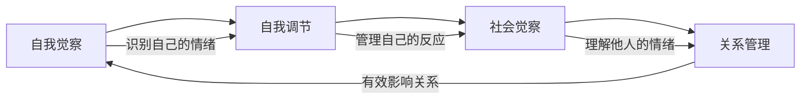
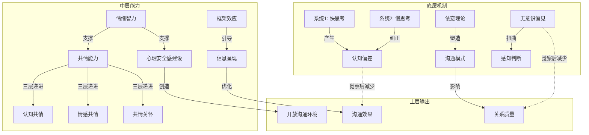

# 第六节 本章小结

沟通心理学进阶不是一个松散的知识集合，而是一套环环相扣的认知操作系统。本节将从"知识整合 → 能力内化 → 实践路径"三个层面，帮助你把全章内容真正变成可调用的沟通智慧。

## 一、八块拼图如何拼成一张图

本章涵盖的八个核心主题——认知偏差、双系统思维、情绪智力、共情层次、心理安全感、依恋理论、框架效应、无意识偏见——并非彼此孤立的概念。它们共同指向一个核心命题：**沟通质量取决于我们对自身心理过程的觉察程度，以及对他人心理世界的理解深度。**

### 1.1 认知偏差与双系统思维的关系

认知偏差不是随机发生的"错误"，而是系统1思维（快思考）的固有产物。系统1为了高效处理信息，不得不使用启发式——可得性启发式、代表性启发式、锚定策略等——这些启发式在大多数日常情境中是有效的，但在复杂沟通场景中会导致系统性偏差。

理解这层关系的实际意义在于：**你不需要消灭偏差，你需要知道什么时候偏差会"叛变"。** 当沟通涉及高利害关系、强情绪刺激、时间压力或信息不完整时，系统1的启发式会从"省力助手"变成"判断杀手"。此时需要主动激活系统2（慢思考），通过STOP技巧（停止-呼吸-观察-继续）或"暂停三秒"来打断自动反应链。

### 1.2 情绪智力是共情的前置条件

没有自我觉察，就不可能真正理解他人。情绪智力的四个维度——自我觉察、自我调节、社会觉察、关系管理——构成了一个递进的能力链：

- **自我觉察**是地基：你必须先能准确命名自己的情绪状态，才能区分"我现在感到愤怒"和"对方在激怒我"之间的区别。前者是事实，后者是归因。
- **自我调节**是缓冲：在强烈情绪下保持认知灵活性，不被杏仁核劫持。
- **社会觉察**是雷达：捕捉他人的情绪信号——语调变化、用词选择、肢体语言中的微表情。
- **关系管理**是输出：将前三者的能力转化为有效的沟通行为。

共情的三个层次（认知共情、情感共情、共情关怀）正是情绪智力"社会觉察"维度的深度展开。认知共情对应"理解对方在想什么"，情感共情对应"感受到对方的情绪"，共情关怀则将理解转化为行动。

### 1.3 依恋理论解释了"为什么有些人沟通特别难"

依恋理论为沟通模式提供了发展心理学的解释框架。一个人在亲密关系中的沟通风格——是否能直接表达需求、是否在冲突中保持连接、是否信任对方的善意——很大程度上受早期依恋经验的影响。

| 依恋类型 | 核心恐惧 | 沟通特征 | 常见陷阱 |
|----------|----------|----------|----------|
| 安全型 | 无突出恐惧 | 开放表达、信任善意、冲突中保持连接 | 可能低估他人不安全感的影响 |
| 焦虑型 | 被抛弃 | 过度寻求确认、情绪波动大、反复确认关系 | 将正常空间误解为冷淡信号 |
| 回避型 | 失去独立 | 情感疏离、回避冲突、强调自主 | 将亲密需求误解为控制 |
| 混乱型 | 亲密本身 | 矛盾行为、不可预测、靠近又推开 | 难以建立稳定的沟通模式 |

理解依恋类型的实践价值：**不要试图改变对方的依恋类型，而是在理解的基础上调整自己的沟通策略。** 面对焦虑型的人，提供稳定的反馈节奏；面对回避型的人，给予足够的空间；面对混乱型的人，保持一致性和可预测性。

### 1.4 心理安全感是所有高效沟通的基础设施

心理安全感不是一个"nice to have"的软性指标，而是沟通能否真正有效的硬性前提。谷歌"亚里士多德项目"对180个团队的研究发现，心理安全感是区分高效团队与低效团队的最重要因素——比团队成员的个人能力、团队组成结构都更重要。

心理安全感的四个维度各解决一个具体问题：

- **发言安全感**：我可以说出不同意见吗？→ 解决"沉默螺旋"问题
- **学习安全感**：我可以承认不知道吗？→ 解决"虚假共识"问题
- **承认错误安全感**：我可以说"我搞砸了"吗？→ 解决"掩盖问题"问题
- **创新安全感**：我可以提出疯狂的想法吗？→ 解决"群体思维"问题

关键认知：**心理安全感与高标准并存。** 艾米·埃德蒙森明确指出，心理安全感≠没有标准。最佳组合是"高心理安全+高学习标准"，这才是真正的学习区。

### 1.5 框架效应与无意识偏见是同一枚硬币的两面

框架效应是主动选择呈现角度的策略；无意识偏见是被动接受的刻板印象滤镜。两者都说明同一个道理：**同一个现实，可以被截然不同地感知和理解。**

框架效应要求我们注意"如何呈现信息"——同样的事实，"90%存活率"和"10%死亡率"给人的感受完全不同。无意识偏见要求我们注意"如何接收信息"——我们对不同性别、年龄、种族、口音的人会自动启动不同的评价标准。

将两者结合的实际应用：在重要沟通前，既检查自己的"呈现框架"是否合理，也检查自己的"接收滤镜"是否在扭曲对方的信息。

### 1.6 概念关系全景图

---

## 二、从知识到能力：内化路径

知道这些理论和技巧，与在真实沟通中自然运用它们之间，存在巨大的鸿沟。本节提供一个经过验证的内化框架，帮助你跨越这个鸿沟。

### 2.1 内化的四个阶段

心理学技能的内化遵循"无意识无能 → 有意识无能 → 有意识有能力 → 无意识有能力"的四阶段模型：

**第一阶段：无意识无能**
你不知道自己在沟通中存在哪些认知偏差。你认为自己的判断是客观的，自己的共情水平是正常的。这个阶段的特征是"不知道自己不知道"。

**第二阶段：有意识无能**
通过学习本章内容，你开始识别自己的偏差模式。你发现自己经常犯基本归因错误，发现自己在压力下会退回到回避型依恋的沟通模式。这个阶段可能会伴随不适感——"原来我有这么多问题"。这是正常的，也是必要的。

**第三阶段：有意识有能力**
你能够在沟通中运用所学技巧，但需要刻意提醒自己。比如在重要对话前，你有意识地进行PREPARE检查；在感到被冒犯时，你刻意暂停三秒；在给反馈时，你主动选择合适的共情层次。这个阶段需要认知资源，会感到"费力"。

**第四阶段：无意识有能力**
技巧变成了直觉。你不需要提醒自己"现在该用认知共情了"，而是自然地根据情境调整沟通方式。偏差觉察变成了自动化的元认知监控。这个阶段，知识真正变成了智慧。

### 2.2 PREPARE准备模型：重要沟通前的七步检查

PREPARE模型整合了本章所有核心概念，提供了一个实用的沟通准备框架。每次重要沟通前，花3-5分钟完成以下检查：

| 步骤 | 检查项 | 核心问题 |
|------|--------|----------|
| **P**erspective（视角） | 多角度审视 | 除了我的视角，对方可能怎么看这件事？有没有我遗漏的利益相关者？ |
| **R**eframe（框架） | 选择有利框架 | 我打算用什么框架来呈现这个信息？这个框架对双方都真实且有利吗？ |
| **E**mpathy（共情） | 确定共情层次 | 对方现在可能处于什么情绪状态？我需要在哪个层次上与他连接？ |
| **P**ause（暂停） | 检查认知偏差 | 我对这个人/这件事有没有预设的判断？有没有确认偏差或锚定效应在影响我？ |
| **A**ttach（依恋） | 觉察依恋动态 | 这段关系中有没有依恋模式在起作用？我的反应是基于当前情境还是旧有模式？ |
| **R**emove（移除） | 识别无意识偏见 | 我对这个人有没有基于外貌、年龄、性别、背景的预判？这些预判公正吗？ |
| **E**ngage（参与） | 创造心理安全 | 这次沟通的环境是否让对方感到安全？我需要做什么来降低对方的防御？ |

### 2.3 八大常见误区的系统性规避

学习沟通心理学最大的风险不是学得不够，而是学得不当。以下是将常见误区转化为检查清单的方法：

| 误区 | 错误信号 | 自检问题 | 纠正方向 |
|------|----------|----------|----------|
| 过度心理学化 | 对每句话都做心理分析 | "这个分析对解决问题有帮助吗？" | 只在明显模式出现时使用 |
| 操控倾向 | 利用偏差影响他人决策 | "如果对方知道我的策略，会怎么想？" | 以双赢为目标 |
| 忽视文化差异 | 照搬西方研究结论 | "这个理论在中国文化中适用吗？" | 考虑面子、关系、权力距离 |
| 共情=同意 | 不敢在坚持立场时共情 | "理解他是否等于接受他的行为？" | 分离理解和认可 |
| 忽略情绪价值 | 强调"理性讨论" | "情绪背后传递了什么信息？" | 先处理情绪，再处理问题 |
| 心理安全无标准 | 只营造舒适不设要求 | "我是在创造学习区还是舒适区？" | 安全感+高标准并行 |
| 框架=欺骗 | 拒绝选择呈现角度 | "我的框架是否扭曲了事实？" | 选角度而非改事实 |
| 单一归因 | 用一种理论解释一切 | "还有其他可能的解释吗？" | 保持多元视角 |

---

## 三、自我评估：你现在在哪里

在制定学习计划之前，先做一个诚实的自我评估。以下评估覆盖本章的八个核心维度，每个维度用1-5分自评（1=完全不具备，5=已经内化为直觉）。

### 3.1 八维自评量表

评估日期：____

一、认知偏差觉察（我能识别自己和他人的认知偏差）
□ 1分 — 不知道什么是认知偏差
□ 2分 — 能在事后回顾中识别偏差
□ 3分 — 能在沟通过程中实时识别偏差
□ 4分 — 能在重要决策前主动检查偏差
□ 5分 — 偏差觉察已经成为自动化思维习惯

二、系统切换能力（我能根据情境切换快慢思考）
□ 1分 — 总是凭直觉反应
□ 2分 — 偶尔提醒自己慢下来
□ 3分 — 能在重要时刻主动暂停
□ 4分 — 能根据情境灵活切换
□ 5分 — 系统切换成为自然习惯

三、情绪觉察与调节（我能准确识别和管理自己的情绪）
□ 1分 — 难以命名自己的情绪
□ 2分 — 能识别基本情绪（开心/难过/生气）
□ 3分 — 能识别复杂情绪（失望/委屈/焦虑）
□ 4分 — 能在强烈情绪下保持认知灵活
□ 5分 — 情绪成为决策的有效信号而非干扰

四、共情能力（我能根据情境使用恰当层次的共情）
□ 1分 — 不太关注他人的感受
□ 2分 — 能表达基本的理解
□ 3分 — 能感受到他人的情绪
□ 4分 — 能在理解的基础上提供帮助
□ 5分 — 能灵活切换三个共情层次

五、心理安全感建设（我能创造让人敢于表达的环境）
□ 1分 — 没有考虑过这个问题
□ 2分 — 知道概念但很少刻意实践
□ 3分 — 会主动邀请不同意见
□ 4分 — 团队成员能在我面前承认错误
□ 5分 — 团队有主动挑战想法的默契

六、依恋觉察（我能识别自己和他人的依恋模式）
□ 1分 — 没有了解过依恋理论
□ 2分 — 能识别自己的依恋类型
□ 3分 — 能识别他人的依恋倾向
□ 4分 — 能根据依恋模式调整沟通方式
□ 5分 — 依恋觉察成为关系管理的自然维度

七、框架运用（我能有意识地选择信息呈现角度）
□ 1分 — 怎么想就怎么说
□ 2分 — 偶尔注意措辞的影响
□ 3分 — 能为同一事实选择不同框架
□ 4分 — 能识别和应对他人使用的框架
□ 5分 — 框架选择成为自然的沟通策略

八、无意识偏见管理（我能识别和减少隐性偏见）
□ 1分 — 认为自己没有偏见
□ 2分 — 知道偏见存在但不清楚自己的
□ 3分 — 完成了IAT测试，了解自己的盲区
□ 4分 — 在重要决策前主动检查偏见
□ 5分 — 建立了系统性的偏见减少机制

总分：____ / 40

**分数解读：**
- **8-15分**：起步阶段——你正在建立沟通心理学的知识框架，重点关注理论理解和基础觉察
- **16-23分**：成长阶段——你已经具备基本觉察能力，重点是在真实沟通中刻意练习
- **24-31分**：进阶阶段——你能在多数情境中运用所学，重点是处理复杂场景和边界情况
- **32-40分**：精通阶段——知识已经开始内化为直觉，重点是持续精进和帮助他人成长

### 3.2 识别你的"默认模式"

每个人在沟通中都有一个"默认模式"——当不加思考时，你自然会采用的沟通方式。识别这个默认模式，是改变的起点。

**自我诊断问题：**

当你在沟通中感到威胁时，你的第一反应是什么？
- A. 赶紧表达自己的立场，争取主动（可能是焦虑型依恋或确认偏差驱动）
- B. 保持沉默，等风暴过去（可能是回避型依恋或恐惧驱动）
- C. 分析对方的动机和心理状态（可能是过度心理学化倾向）
- D. 立即寻找解决方案（可能是回避情绪的倾向）
- E. 根据情境灵活应对（这是健康的表现）

当你与意见不同的人沟通时，你通常会？
- A. 专注于找到对方逻辑中的漏洞（确认偏差）
- B. 尝试理解对方为什么这么想（认知共情）
- C. 感到不舒服，想尽快结束对话（回避倾向）
- D. 认为对方的信息来源不可靠（可得性偏差）

这些回答没有"正确答案"，但它们揭示了你的默认模式——以及你最容易在哪个维度上失衡。

---

## 四、分阶段学习路径

### 4.1 第一阶段：觉察建立期（第1-2周）

**目标**：建立对自身心理模式的基本觉察。这个阶段不要求改变，只要求"看见"。

**具体任务：**

**认知偏差日记**——每天记录1-2个沟通情境，识别其中的认知偏差。使用以下模板：

日期：____
情境：____
我的自动反应：____
可能存在的偏差：□ 确认偏差  □ 锚定效应  □ 光环效应  □ 基本归因错误  □ 其他
替代解释（至少3种）：____
如果暂停三秒，我会怎么反应：____

**STOP练习**——每天选择3个沟通情境，练习STOP技巧：
- **S**top（停止）：在反应前暂停
- **T**ake a breath（呼吸）：做一次深呼吸
- **O**bserve（观察）：观察自己的想法和情绪
- **P**roceed（继续）：基于理性分析做出回应

**依恋模式自评**——诚实地回答：
1. 在亲密关系中，我害怕被抛弃吗？
2. 我需要频繁的确认和保证吗？
3. 在冲突时，我倾向于靠近还是远离？
4. 我能直接表达自己的需求吗？
5. 我信任他人的善意吗？

**验收标准**：两周后，你能识别出自己最常见的2-3种认知偏差模式，能说出自己的依恋倾向。

### 4.2 第二阶段：技巧练习期（第3-6周）

**目标**：在受控环境中练习核心技巧，建立新的沟通习惯。

**共情层次练习**——选择日常对话，刻意练习三个层次的回应：

| 层次 | 练习方式 | 示例情境："今天工作好累啊" |
|------|----------|---------------------------|
| 认知共情 | 反映理解 | "听起来你今天挺辛苦的。" |
| 情感共情 | 反映感受 | "我能感受到你现在很疲惫。" |
| 共情关怀 | 表达行动 | "你需要休息一下吗？我能做点什么？" |

每天记录使用了哪个层次，以及效果如何。一周后评估自己在各层次上的舒适度和熟练度。

**框架转换练习**——每天选择一个事件，用三种不同框架描述：

事件：项目延期两周
负面框架："项目延期了，这是个问题。"
中性框架："项目时间表调整了两周。"
正面框架："我们获得了两周额外时间来确保项目质量。"
学习框架："这个项目教会了我们如何更好地管理时间预期。"

练习目标不是自我欺骗，而是拓宽视角——同一个事实可以有多个真实的角度。

**心理安全评估**——对你所在的团队进行心理安全自评（1-5分）：
1. 我可以在团队中提出不同意见吗？
2. 我可以承认错误而不担心后果吗？
3. 我可以寻求帮助而不被认为能力不足吗？
4. 我可以提出新想法而不被嘲笑吗？
5. 我可以挑战领导的决定吗？

总分低于15分的团队需要重点关注心理安全感建设。

**验收标准**：你能根据情境选择合适的共情层次，能为同一事件构建3种以上框架，能在重要对话前完成PREPARE检查。

### 4.3 第三阶段：实战应用期（第7-12周）

**目标**：在真实沟通场景中综合运用所学。

**真实对话应用**——选择3-5次重要沟通，提前使用PREPARE模型准备，事后进行复盘：

PREPARE复盘表

沟通对象：____
沟通目标：____
实际结果：____

P（视角）：我考虑了哪些视角？遗漏了什么？
R（框架）：我使用了什么框架？效果如何？
E（共情）：我使用了哪个层次的共情？是否恰当？
P（暂停）：我有没有在关键时刻暂停？
A（依恋）：依恋模式有没有影响这次沟通？
R（偏见）：我有没有无意识偏见在起作用？
E（安全）：对方感到安全吗？我创造了什么安全感？

最大的收获：____
下次可以改进的地方：____

**他人反馈**——请2-3位你信任的人，对你在沟通中的表现给出具体反馈。重点询问：
- 我在什么情况下让你感到被理解？
- 我在什么情况下让你感到不被理解？
- 你觉得我在沟通中最明显的习惯是什么？
- 你觉得我最大的改善空间在哪里？

**验收标准**：你能在80%以上的重要沟通中运用PREPARE模型，能在事后复盘中识别至少2个可改进点。

### 4.4 第四阶段：持续精进期（长期）

**目标**：将心理学知识内化为沟通直觉，持续精进。

**月度自我评估**——每个月重复八维自评量表，追踪进步。

**知识更新**——心理学研究在不断发展。保持对新研究的关注，更新自己的知识库。

**教学相长**——将所学教给他人。教学是最好的学习——当你能清晰地向别人解释一个概念时，你才真正理解它。

**跨界应用**——将沟通心理学的原理应用到不同领域：亲密关系、亲子教育、团队管理、客户服务、公开演讲。

---

## 五、进一步学习资源

### 5.1 核心书目

以下书目按本章主题组织，建议按需选读而非全部通读。

**认知心理学与决策**
- 《思考，快与慢》丹尼尔·卡尼曼——双系统思维与认知偏差的奠基之作，系统1和系统2概念的原始出处
- 《助推》理查德·塞勒、卡斯·桑斯坦——框架效应和选择架构的实际应用
- 《噪声》丹尼尔·卡尼曼等——决策中"噪声"（随机偏差）的系统性研究，是《思考，快与慢》的补充

**情绪与共情**
- 《情绪智力》丹尼尔·戈尔曼——情绪智力概念的系统阐述，四维模型的理论基础
- 《共情的力量》亚瑟·乔拉米卡利——共情三层次的实践指南
- 《情绪》莉莎·费德曼·巴瑞特——情绪建构理论，挑战传统情绪观，理解情绪如何被大脑"制造"

**心理安全与团队**
- 《无畏的组织》艾米·埃德蒙森——心理安全理论的核心著作，包含大量团队案例和实证研究
- 《团队的智慧》帕特里克·兰西奥尼——团队功能障碍的经典分析框架

**依恋与关系**
- 《依恋与亲密关系》阿米尔·莱文——成人依恋理论在亲密关系中的应用
- 《依恋的形成》约翰·鲍尔比——依恋理论的原始文献，适合深度学习者

**框架与说服**
- 《影响力》罗伯特·西奥迪尼——说服心理学的经典框架（互惠、承诺、社会认同等六原则）
- 《框架思维》马茨·阿尔瓦松等——框架效应在商业和组织中的系统应用

**偏见与多样性**
- 《偏见的本质》戈登·奥尔波特——偏见心理学的奠基之作
- 《盲区》马扎林·贝纳基、安东尼·格林沃尔德——无意识偏见的现代研究和IAT测试的开发者著作

### 5.2 实践工具

| 工具名称 | 用途 | 获取方式 |
|----------|------|----------|
| 哈佛内隐联想测试（IAT） | 识别个人无意识偏见 | https://implicit.harvard.edu/ |
| 情绪日记应用 | 记录和分析日常情绪模式 | 各应用商店搜索"情绪日记"或"mood tracker" |
| 团队心理安全评估量表 | 评估团队心理安全感水平 | 基于埃德蒙森7题量表自建问卷 |
| 共情倾听练习卡片 | 日常共情层次练习 | 自制卡片或使用沟通教练提供的工具 |
| 认知偏差清单 | 沟通前快速检查偏差 | 制作个人清单，包含本章介绍的所有偏差类型 |
| PREPARE检查表 | 重要沟通前的系统准备 | 将本节的PREPARE模型制作为便携卡片 |

### 5.3 进阶方向

如果你希望在沟通心理学方向继续深入，以下是可以探索的进阶领域：

**积极沟通心理学**——Barbara Fredrickson的"扩展与建构"理论表明，积极情感不仅能改善当前的沟通体验，还能建构长期的认知、社会和心理资源。高效团队的积极沟通与消极沟通比率约为3:1到6:1。学习如何系统地增加积极沟通，是比"减少问题"更高效的路径。

**社会神经科学**——研究发现，有效沟通伴随着参与者之间更大的"脑间同步性"（Interpersonal Neural Synchrony）。面对面沟通比远程沟通更容易产生神经同步，这解释了为什么某些重要对话必须面对面进行。了解这些神经机制，可以帮你设计更有效的沟通环境。

**进化心理学视角**——人类的许多沟通障碍有着进化根源。内群体偏见（对"自己人"更信任）、地位竞争动机（沟通中的炫耀和贬低）、欺骗检测机制（过度怀疑）——理解这些进化遗产，可以帮助我们在现代环境中更好地管理本能反应。

**积极冲突管理**——冲突不一定是消极的。当管理得当时，冲突可以成为创新和学习的机会。积极冲突管理的核心是：将冲突视为差异而非威胁、关注利益而非立场、寻找双赢方案、在冲突后修复关系。

---

## 六、结语

沟通心理学不是一套冰冷的理论，而是理解人性的窗口。当你理解了认知偏差如何影响判断，情绪如何驱动行为，依恋如何塑造模式，共情如何建立连接，你获得的不只是沟通技巧——你获得的是一种看待人与人之间关系的全新视角。

但请记住三个原则：

**第一，觉察先于改变。** 你无法改变自己没有意识到的东西。本章所有练习的共同起点，都是"看见"——看见自己的偏差、看见自己的模式、看见自己的盲区。改变从觉察开始。

**第二，知识服务于人，而非相反。** 心理学知识的最大价值不在于分析他人，而在于理解自己。当你能觉察自己的模式、管理自己的情绪、理解自己的依恋需求，你才能真正地理解和支持他人。切勿将心理学变成操控工具或自我辩护的武器。

**第三，真诚的连接是终极目标。** 沟通的终极目标不是技巧的展示，不是框架的精巧运用，不是偏差的完美管理——而是人与人之间真诚的连接。所有的技巧和理论，都是为了帮助你成为更好的沟通者，而不是更精明的操控者。

愿你在沟通心理学的学习中，不仅提升技能，更深化对人性的理解和尊重。每一次觉察、每一次暂停、每一次选择更善意的框架，都是向更好的沟通者迈进的一步。
