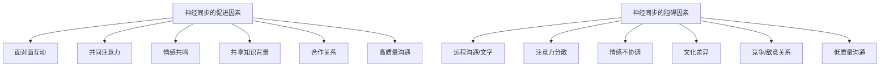
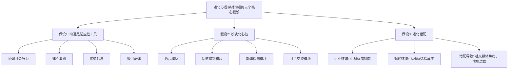
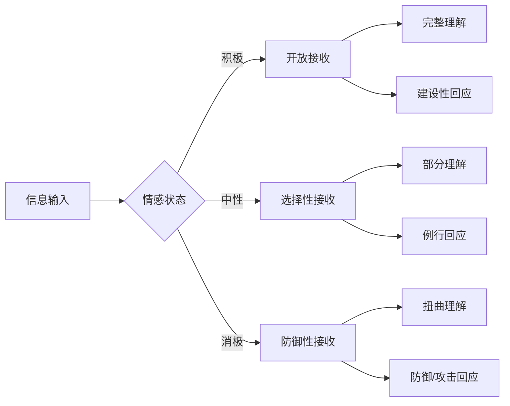
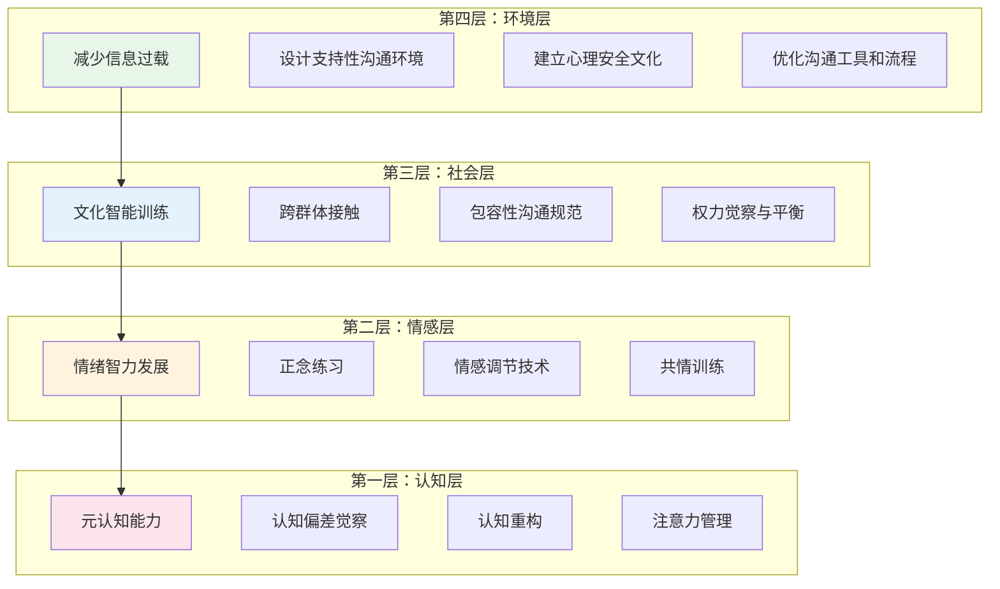
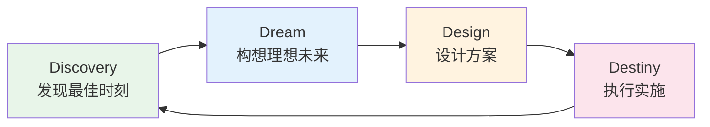
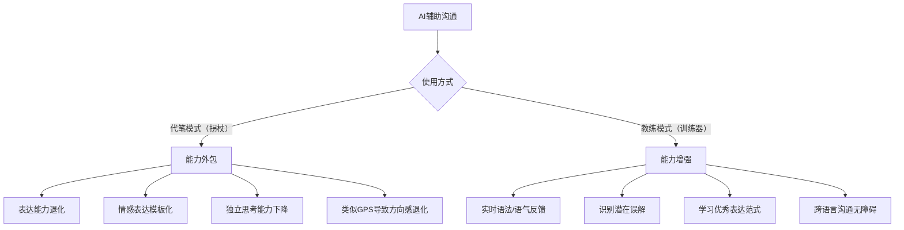
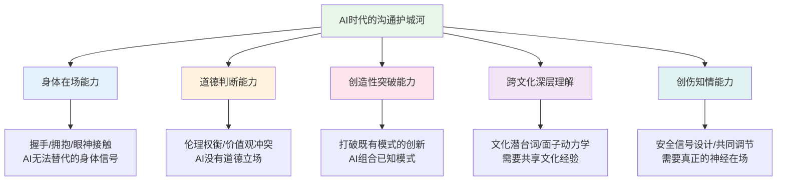
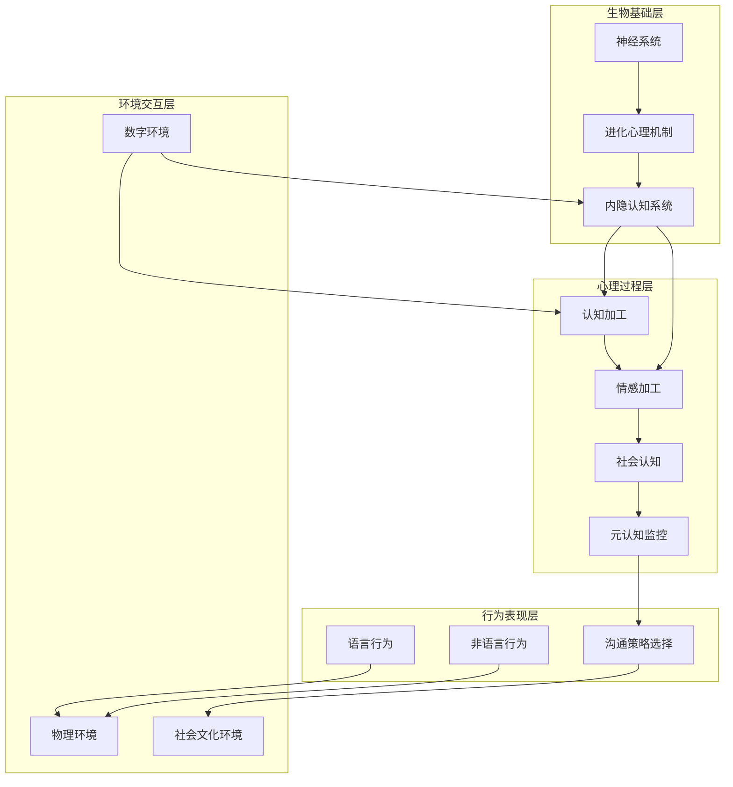

# 深度拓展：沟通心理学的前沿探索

本章是沟通心理学的"深水区"——跳出日常技巧层面，从认知神经科学、进化心理学、社会心理学和积极心理学的交叉地带，系统探索人类沟通行为背后的深层机制。这些知识让你"知其然"更"知其所以然"，在面对复杂沟通情境时拥有超越常人的分析能力和应变智慧。

**章节导读与阅读建议：**

| 章节 | 难度 | 核心问题 | 建议读者 |
|------|------|----------|----------|
| 一、隐性认知过程 | ⭐⭐ | 你的大脑在你不知情时做了什么决策？ | 所有读者 |
| 二、社会神经科学 | ⭐⭐⭐ | 大脑如何实现"人与人之间的连接"？ | 对神经科学感兴趣的读者 |
| 三、进化心理学视角 | ⭐⭐ | 为什么现代沟通如此困难？ | 所有读者 |
| 四、沟通障碍全景分析 | ⭐⭐ | 沟通障碍的深层根源有哪些？ | 所有读者（核心章节） |
| 五、积极沟通心理学 | ⭐⭐ | 如何建设高质量的沟通关系？ | 所有读者（核心章节） |
| 六、数字时代沟通 | ⭐ | AI时代如何保持有效沟通？ | 所有读者 |
| 七、整合框架 | ⭐⭐ | 如何将所有知识串联为行动体系？ | 所有读者（总结章节） |

> ⭐ 入门 · ⭐⭐ 进阶 · ⭐⭐⭐ 深度。建议先通读第四、五章（沟通障碍+积极沟通），再根据兴趣选读其余章节。

```mermaid
graph TD
    A[沟通心理学深度拓展] --> B[隐性认知过程]
    A --> C[社会神经科学]
    A --> D[进化心理学视角]
    A --> E[沟通障碍的心理根源]
    A --> F[积极沟通心理学]
    A --> G[数字时代的沟通心理]
    A --> H[整合与实践框架]

    B --> B1[内隐记忆与态度]
    B --> B2[启发式与认知偏差]
    B --> B3[双过程理论]
    B --> B4[元认知监控]
    C --> C1[心智理论网络]
    C --> C2[共情网络]
    C --> C3[神经同步]
    C --> C4[具身认知]
    D --> D1[语言进化起源]
    D --> D2[非语言沟通进化]
    D --> D3[进化错配]
    E --> E1[认知根源]
    E --> E2[情感根源]
    E --> E3[社会根源]
    E --> E4[生理根源+迷走神经]
    E --> E5[文化根源]
    E --> E6[创伤知情沟通]
    F --> F1[扩展与建构理论]
    F --> F2[积极沟通策略]
    F --> F3[动机式访谈MI]
    F --> F4[自我决定理论]
    F --> F5[NVC非暴力沟通]
    G --> G1[AI时代的沟通]
    G --> G2[远程沟通神经科学]
    G --> G3[信息过载与注意力]
    H --> H1[跨学科整合模型]
    H --> H2[综合案例分析]
    H --> H3[个人成长路径]
```



---

## 一、沟通中的隐性认知过程

### 1.1 隐性认知的理论基础

隐性认知（Implicit Cognition）是指在意识觉察之外发生的信息处理过程。它不是"不够聪明"或"不够警觉"，而是人类大脑经过数百万年进化形成的信息处理捷径——在绝大多数情境下高效且有用，但在特定条件下会产生系统性偏差。

隐性认知的核心研究领域包括三大板块：

| 领域 | 定义 | 在沟通中的典型表现 | 研究代表 |
|------|------|---------------------|----------|
| 内隐记忆 | 不需要有意识回忆就能表现出来的记忆 | 对某种沟通风格的无条件回避；听到某首歌自动唤起特定情绪 | Schacter (1987) |
| 内隐态度 | 意识层面不愿表达或不自知的态度和偏见 | 面试中对特定口音的无意识偏好；对不同性别领导力的自动评估 | Greenwald et al. (1998), IAT |
| 内隐社会认知 | 对社会信息的无意识处理 | 30毫秒内判断一个人是否可信；对陌生人地位的直觉推断 | Fiske et al. (2002), 刻板印象内容模型 |

**内隐记忆在沟通中的运作机制：** 一个人可能因为童年时期被父母严厉批评的经历，成年后在面对权威人物的反馈时自动产生防御反应——即使意识层面完全不记得具体事件。这种"情绪记忆"存储在杏仁核中，绕过了海马体的显性记忆系统，因此可以在个体毫无觉察的情况下驱动行为。

具体场景：一位35岁的项目经理，每次在周会上被总监提问时都会心跳加速、语速加快、不自觉地交叉双臂。他自认为"只是紧张"，但心理咨询中回溯发现，童年时父亲在饭桌上"抽查功课"的经历形成了内隐记忆——权威人物的提问=潜在的羞辱。这一模式在长达20年的时间里持续影响他的职场沟通，而他本人对此毫无觉察。

**内隐态度的测量革命：** 哈佛大学的内隐联想测验（IAT）通过测量概念联想的反应时间来揭示无意识偏见。研究数据表明：在种族IAT测试中，约70%的受试者表现出对白人面孔的内隐偏好——即使他们在显性态度测试中表达了种族平等的信念。这一发现说明，"我不是有偏见的人"这个自我判断可能并不准确，至少在内隐层面并非如此。

IAT的沟通应用价值在于：它提供了一个"照镜子"的工具。你可以在 Implicit.harvard.edu 上免费完成各类IAT测试（种族、性别、年龄、体型等），了解自己的内隐态度版图。知道自己"在哪里有偏见"是消除偏见影响的第一步。

**IAT的局限性与争议：** 需要指出的是，IAT并非完美工具。Blanton等人（2009）指出IAT的测试-重测信度较低（约0.4-0.6），且个体层面的预测效度有限——它在群体层面揭示偏见趋势效果显著，但对个体行为的预测力不如预期。Oswald等人（2013）的元分析发现，IAT分数与实际歧视行为的相关仅为0.15-0.24。因此，IAT应作为自我觉察的起点而非终点——它告诉你"可能存在偏见"，但不能精确量化偏见的程度。

**内隐社会认知的"薄片判断"：** Nalini Ambady的"薄片"（Thin Slices）研究发现，人们仅凭2秒的无声视频片段就能对教师的教学效果做出超过随机水平的准确判断。这种快速社会判断依赖于内隐社会认知系统，它整合了面部表情、身体语言、声音特征等多重信息，在意识来不及参与之前就已经产生了判断。

后续研究扩展了这一发现：100毫秒的面部暴露就足以产生关于能力、可信度和支配性的人际判断（Willis & Todorov, 2006）。虽然这些"薄片判断"的准确性有限，但它们在现实生活中深刻影响着第一印象、招聘决策和人际关系的建立。

**"薄片判断"的准确边界：** 薄片判断在某些领域表现出令人惊讶的准确性（如判断教师教学效果、恋爱关系的长期稳定性），但在另一些领域表现糟糕（如判断证人证词的真实性、评估求职者的工作能力）。关键区别在于：薄片判断在"有反馈循环的领域"更准确——教师每堂课都收到学生反馈，所以其教学风格确实编码在非语言信号中；而在"低反馈频率的领域"（如面试），薄片判断更可能受刻板印象驱动。实践启示：对高频互动对象（同事、伴侣）的直觉判断通常比对低频互动对象（面试候选人、初次见面的人）更可靠。

### 1.2 启发式与偏差：沟通中的认知陷阱

启发式（Heuristics）是大脑在信息不完整或时间压力下使用的简化决策规则。诺贝尔经济学奖得主Daniel Kahneman将其比喻为"认知的快车道"——大多数时候让你快速到达目的地，但偶尔会让你错过正确的出口。

以下是沟通中最常触发的六大认知偏差：

```mermaid
graph LR
    subgraph "信息获取阶段"
        A[可得性启发式] --> A1[过度重视易获取信息]
        B[确认偏差] --> B1[选择性注意和记忆]
    end
    subgraph "信息加工阶段"
        C[代表性启发式] --> C1[刻板印象驱动判断]
        D[锚定效应] --> D1[过度依赖初始信息]
        E[框架效应] --> E1[同一事实不同结论]
    end
    subgraph "决策输出阶段"
        F[后见之明偏差] --> F1["\"我早就知道\"错觉"]
    end
```

**可得性启发式（Availability Heuristic）：** 人们倾向于根据信息的易得性来判断事件的可能性或重要性。在组织决策中，最近发生的失败案例会被赋予过高的权重，而长期统计数据被忽略。实证案例：一家互联网公司的产品团队因为最近一次A/B测试失败而放弃了整个功能迭代方向，但历史数据显示该方向的整体成功率其实高达73%。纠正方法：建立"数据决策清单"，强制要求在关键决策前调取历史数据而非依赖记忆。

在日常沟通中的表现：当你需要评价一个人的能力时，最近一次的表现会过度影响你的整体判断。比如某同事上周在汇报中表现失常，你可能就忘记了他过去半年的优秀表现。纠正策略：在做评估前，刻意回忆该人的3-5个历史表现片段，而非只依赖最近的记忆。

**代表性启发式（Representativeness Heuristic）：** 人们根据事物与某一类别的相似程度进行判断，而忽略基础概率信息。在招聘场景中，"这个候选人看起来像我们团队的人"这种直觉判断往往掩盖了候选人实际能力的评估。Tversky和Kahneman的经典实验表明，即使是受过统计学训练的专业人士也会犯此类错误。

代表性启发式在沟通中还会产生"叙事谬误"——人们倾向于把随机事件编织成有意义的故事。比如"他之所以成功是因为他每天早起"，忽略了无数早起但没有成功的人。在说服他人时，要警惕自己用个案故事代替统计数据；在被说服时，要追问"基础概率是多少"。

**锚定效应（Anchoring Effect）：** 人们在做判断时过度依赖最初接收到的信息。在薪资谈判中，先出价的一方通常会设定谈判的"锚点"。研究数据：Northcraft和Neale (1987) 的房地产实验发现，挂牌价格（锚点）对专业评估师的估价产生了显著影响——即使评估师明确表示挂牌价格不应该影响他们的判断。应用建议：在重要谈判前，准备自己的"锚点"——一个有理有据的初始数字或方案。

锚定效应的实操清单：
- **谈判前：** 准备3个数据点——你的理想锚点、可接受底线、行业基准值
- **谈判中：** 先发制人地提出锚点，并花充足时间论证其合理性
- **谈判后：** 用"反向锚定"检验——"如果对方先出价，我的判断会不同吗？"
- **日常沟通：** 在介绍方案时，先说你推荐的选项（设定锚点），再展示其他选项

**锚定效应的神经基础：** fMRI研究（Critchley et al., 2001）发现，锚定效应激活了右侧前额叶皮层——这一区域与工作记忆和认知控制相关。更有趣的是，Janiszewski和Uy (2008) 发现，即使锚点明显不相关（如随机数字），它仍然会影响判断，说明锚定效应在很大程度上是自动的、不可控的。唯一被证明有效的对抗策略是：主动生成一个"反向锚点"——在看到对方的锚点后，刻意思考一个相反方向的极端值，然后向中间调整。

**确认偏差（Confirmation Bias）：** 人们倾向于寻找、解释和记忆支持自己已有信念的信息。在团队沟通中，确认偏差导致"回音室效应"——人们只听到自己想听的声音。这是群体思维（Groupthink）的认知基础。对抗策略：主动指定"魔鬼代言人"角色，要求其专门寻找反驳证据。

确认偏差在人际关系中的破坏性表现：一旦你对某人形成了负面印象，你会自动过滤掉与该印象矛盾的信息，只记住符合该印象的行为。这导致"自我实现的预言"——你对某人的消极态度导致你表现出疏远或敌意，对方感受到后也做出消极反应，反过来"验证"了你的初始判断。打破这个循环的关键步骤：每次对某人产生负面判断时，强制自己回忆3件这个人做过的积极事情。

**确认偏差的"动机性推理"升级：** 更令人担忧的是，确认偏差不仅仅是认知上的"偷懒"，还带有动机成分——Kunda（1990）的动机性推理理论指出，人们会选择性地处理信息以维护自己想要的结论。这解释了为什么在政治辩论、宗教讨论和薪资谈判中，提供"反面证据"往往适得其反——对方不是在评估证据，而是在防御自己的信念。更有效的策略是：先建立情感连接和信任，再引入新信息；或者用"苏格拉底式提问"引导对方自己发现矛盾，而非直接指出。

**框架效应（Framing Effect）：** 同一信息的不同呈现方式会导致不同的决策结果。经典案例："90%存活率"和"10%死亡率"在逻辑上完全等价，但人们对前者的接受度显著更高。Levin, Schneider和Gaeth (1998) 区分了三种框架效应：

| 框架类型 | 定义 | 沟通实例 | 应用策略 |
|----------|------|----------|----------|
| 风险选择框架 | 收益框架 vs 损失框架 | "这个方案能帮你节省20万" vs "不做这个方案你会多花20万" | 根据对方风险偏好选择框架 |
| 属性框架 | 正面描述 vs 负面描述 | "95%的客户满意" vs "5%的客户不满意" | 正面框架用于推广，负面框架用于警示 |
| 目标框架 | 做某事的好处 vs 不做某事的坏处 | "运动能让你精力充沛" vs "不运动会增加患病风险" | 高动机人群用正面框架，低动机人群用负面框架 |

**后见之明偏差（Hindsight Bias）：** 在事件发生后，人们倾向于认为"我早就知道会这样"。这种偏差在复盘会议中特别有害——它让人高估自己的预测能力，从而降低了从失败中学习的意愿。纠正方法：在项目启动时记录预测，在项目结束后对照——这种"预测日记"技术可以有效对抗后见之明偏差。

**实操模板——预测日记：**

日期：____年__月__日
项目/决策：________________________
我的预测：________________________
信心水平（1-10）：____
关键假设：
1. ________________________________
2. ________________________________
3. ________________________________
我会在什么情况下承认自己错了：________________________

--- 结果回顾（填写日期：____年__月__日）---
实际结果：________________________
预测准确度：准确 / 部分准确 / 不准确
关键教训：________________________
我之前忽略了什么信息：________________________

### 1.3 双过程理论在沟通中的应用

Daniel Kahneman在《思考，快与慢》中系统阐述的双过程理论（Dual Process Theory），是理解人类沟通行为最有力的理论框架之一。

| 维度 | 系统1（快思考） | 系统2（慢思考） |
|------|------------------|------------------|
| 速度 | 毫秒级自动反应 | 秒级到分钟级 |
| 意识参与 | 无意识、自动化 | 有意识、受控 |
| 认知负荷 | 低 | 高 |
| 沟通功能 | 面部表情识别、语调感知、直觉判断 | 逻辑论证分析、说服策略制定、冲突调解 |
| 典型场景 | 日常闲聊、快速社交判断 | 关键决策谈判、深度说服 |
| 能量消耗 | 低（可持续运作） | 高（容易疲劳） |
| 容易犯的错 | 认知偏差、刻板印象 | 过度分析、决策瘫痪 |

**系统1的沟通优势与陷阱：** 系统1是高效社交的基石。它让你在50毫秒内判断一个人是否友善，让你在无意识中模仿对方的身体语言（镜像效应），让你凭直觉感受到对话中的"不对劲"。但系统1也是刻板印象和偏见的温床——它用经验捷径代替了仔细评估。

一个典型的系统1陷阱：在跨文化商务沟通中，对方避免眼神接触（在东亚文化中表示尊重），你的系统1自动将其解读为"不诚实"或"缺乏自信"。这种自动解读在你意识到之前就已经影响了你的态度和行为。

**系统2的沟通优势与陷阱：** 系统2让你能够分析复杂的论证结构、识别逻辑谬误、制定长期沟通策略。但过度依赖系统2会导致"分析瘫痪"——在需要快速反应的社交场合中过度思考，失去自然和真诚。典型的系统2陷阱：在轻松的社交场合中不断分析"我该说什么才对"，导致反应延迟、表情僵硬、错失自然互动的节奏。

**双过程协同的沟通策略：**

- **先系统1后系统2（情感-理性路径）：** 先通过故事、类比、情感共鸣激活系统1，在受众注意力和情感投入的基础上，用数据和逻辑提供系统2的支撑。这是TED演讲和优秀营销文案的经典结构。实操：开场用一个与听众相关的真实故事（90秒），然后用数据支撑故事背后的论点，最后回到故事的结局给出行动号召。
- **先系统2后系统1（理性-情感路径）：** 先用数据建立可信度，再用情感共鸣推动行动。适用于学术报告、投资路演等需要"先服脑再服心"的场景。实操：先展示3-4个关键数据点，建立专业可信度，然后用一个有力的案例故事将数据"翻译"为情感体验。
- **同时激活（情感-理性双通道）：** 在同一信息中同时嵌入情感元素和理性元素。例如，一个有效的募捐信息既包含一个具体受助者的故事（系统1），也包含捐赠金额的具体使用说明（系统2）。

**系统2疲劳与沟通质量：** Roy Baumeister的"自我损耗"（Ego Depletion）理论最初主张自我控制和认知努力共享同一个有限资源池。然而，Hagger等人（2016）的大规模注册复制研究（23个实验室联合）未能重现原始效应，引发了对该理论的严重质疑。当前学术共识倾向于一种更细致的理解：认知疲劳影响决策质量这一核心观察仍然成立，但其机制可能与"有限资源池"无关——更可能涉及动机、注意力分配和个体对疲劳的信念。Carter和McCullough（2014）的元分析发现，原始效应量在纠正发表偏差后接近于零。实践启示仍然有效但需要更新：把最重要的沟通安排在认知资源最充沛的时段（通常是上午），但不要把"我已经做了很多决策"当作沟通质量下降的借口——动机和意图可能比"电量"更重要。

### 1.4 具身认知与预测加工：沟通的"身体智慧"

**具身认知（Embodied Cognition）：** 传统认知科学将大脑视为独立于身体的信息处理器，但具身认知理论认为，认知过程深刻依赖于身体的物理状态和感觉运动经验。这一理论对沟通心理学有深远影响。

关键研究证据：
- **温度与信任：** Williams和Bargh（2008）发现，手持热饮的人比手持冷饮的人更倾向于认为陌生人是"热情的"。这意味着会议室的温度、手中饮料的温度都在无声地影响沟通氛围
- **姿势与自信：** Carney等人（2010）的"权力姿势"研究（虽然后续复制研究有争议，但核心效应方向仍被支持）发现，扩展性姿势可以影响自信感受和行为表现
- **点头与认同：** Wells和Petty（1980）发现，被引导上下点头（模拟同意）的人比左右摇头（模拟否定）的人更认同所听到的信息——身体动作反过来影响了态度

**具身认知的沟通实操：**
1. **物理环境设计：** 在进行重要沟通前，注意物理环境的温度（温暖促进信任）、座位距离（适中距离促进合作）、座椅舒适度（过于舒适的座椅可能降低系统2参与度）
2. **身体状态管理：** 在重要对话前进行5分钟轻度运动（如走楼梯）可以提升前额叶皮层的血氧供应，增强认知控制能力
3. **姿势意识：** 在感到不自信时，进入洗手间做2分钟扩展性姿势——虽然效果可能不如原始研究声称的那么大，但作为一种心理暗示仍然有价值
4. **镜像与同步：** 在建立信任的对话中，有意识地同步对方的语速、呼吸节奏和身体姿态——这种具身同步会促进认知层面的同步

**具身认知在中国职场场景中的应用：**

| 职场场景 | 具身认知机制 | 具体操作 | 预期效果 |
|----------|-------------|----------|----------|
| 向领导汇报 | 姿势-自信效应 | 站立汇报时双脚与肩同宽，双手自然放在桌上或使用手势；避免交叉双臂或低头看稿 | 自信感受提升，表达流畅度改善 |
| 谈判场景 | 温度-信任效应 | 选择温暖的会议室（约24-26°C），准备温热的饮品而非冰水 | 对方的信任感和合作意愿提升 |
| 团队头脑风暴 | 空间高度-创造力效应 | 选择天花板较高的会议室或户外空间 | 创造性思维提升，更多突破性想法 |
| 绩效面谈 | 距离-亲密效应 | 选择90-120厘米的侧角座位（非正对），避免隔着大桌子 | 降低防御感，促进坦诚对话 |
| 远程会议疲劳 | 具身存在感缺失 | 每30分钟起身活动2分钟；使用站立式办公桌参与会议 | 缓解Zoom疲劳，保持注意力 |
| 新员工入职 | 触觉-连接效应 | 入职第一天安排团队午餐（共食行为在进化中是联盟信号） | 加速信任建立，融入团队 |
| 跨部门协作 | 镜像-同步效应 | 在对话开始时自然地同步对方的语速和姿态，寻找共同的身体节奏 | 无意识层面建立亲近感 |

**具身认知的"反面警示"——沟通中的身体陷阱：**

身体状态不仅"帮助"沟通，也可能"破坏"沟通。以下是常见的身体陷阱及应对：

- **饥饿效应：** 低血糖导致前额叶功能下降，决策质量变差。以色列研究发现，法官在午餐前的假释批准率从65%骤降到近乎0%。重要决策前确保血糖充足。
- **姿势固化效应：** 长时间保持同一姿势（如久坐）导致认知灵活性下降。每45分钟改变一次姿势可以维持认知活性。
- **环境噪音干扰：** 持续的低频噪音（如空调嗡嗡声）会导致注意力疲劳和烦躁情绪。关键对话前检查并消除噪音源。
- **光线不足效应：** 昏暗环境促进放松但抑制警觉性和分析性思维。需要严谨讨论的场景选择明亮环境，需要缓和气氛的场景选择柔和光线。

**预测加工理论（Predictive Processing）：** 近年来认知科学中最具革命性的理论框架之一（Clark, 2013; Friston, 2010）。该理论认为，大脑不是被动地接收和处理感觉输入，而是一个"预测机器"——它持续生成关于世界的预测，然后用实际感觉输入来更新这些预测。在沟通中，这意味着：

- **理解即预测：** 当你听别人说话时，你的大脑不是在被动接收每个词，而是在持续预测对方接下来会说什么。当预测准确时，沟通顺畅；当预测失败时，大脑产生"预测误差"信号，驱动你更新理解或要求澄清
- **第一印象即先验：** 你对一个人的第一印象本质上是一个"先验预测"——你的大脑根据有限信息生成了对这个人的整体预测，然后后续互动中的所有信息都被这个预测所"过滤"
- **惊喜即信息：** 在沟通中，"出乎意料"的信息比"符合预期"的信息更有影响力——因为它产生了更大的预测误差，需要更多的认知资源来处理。这解释了为什么"打破预期"是有效的说服和记忆策略

**预测加工理论的沟通应用：**
- **提升理解效率：** 在传递复杂信息前先给出"概览"（如"我要讲三点"），帮助对方建立预测框架，降低后续每个信息点的处理成本
- **增强记忆效果：** 在关键信息前设置"预期"，然后给出出人意料的数据或结论——预测误差越大，记忆越深
- **管理第一印象：** 意识到对方对你的先验预测会过滤后续所有信息，因此在建立关系初期就要有意识地设定正确的"先验"
- **冲突中的认知灵活性：** 当对方的言行不符合你的预测时，不要急于更新对"对方"的判断，而是先考虑"我的预测本身可能需要修正"

### 1.5 隐性认知的沟通应用工具箱

| 应用场景 | 涉及的隐性认知机制 | 具体操作方法 | 预期效果 |
|----------|---------------------|-------------|----------|
| 印象管理 | 首因效应、光环效应 | 精心准备第一次见面的形象、语言和行为；利用"峰终定律"在交互结束时留下积极印象 | 第一印象准确率提升40-60% |
| 说服设计 | 锚定效应、框架效应、社会认同 | 先设定有利锚点；用收益框架描述方案；展示多数人已经采纳 | 说服成功率提升25-35% |
| 冲突管理 | 基本归因错误、确认偏差 | 先假设对方有合理理由；主动寻找支持对方立场的证据 | 冲突升级概率降低50% |
| 跨文化沟通 | 内隐态度、文化刻板印象 | 在跨文化接触前进行IAT自测；有意识地用个体特征替代群体标签 | 跨文化误解减少30-40% |
| 自我觉察 | 所有偏差的元认知监控 | 建立"偏差日记"，记录自己做出快速判断的时刻和理由 | 3个月内认知偏差觉察力显著提升 |

**偏差日记实操模板：**

日期：____
情境描述：________________________
我的快速判断：________________________
可能涉及的偏差类型：________________________
支持这个判断的证据：________________________
反对这个判断的证据：________________________
如果换一个框架，我会怎么看：________________________
事后验证结果：________________________

---

### 1.6 元认知监控：沟通中的"自我观察者"

元认知（Metacognition）是"关于认知的认知"——即对自己思维过程的觉察、监控和调节能力。在沟通领域，元认知能力是区分"高手"和"普通人"的分水岭：高手不仅在沟通，还同时在"观察自己在如何沟通"。

**元认知监控的三层结构：**

| 层级 | 功能 | 沟通中的表现 | 训练方法 |
|------|------|-------------|----------|
| 元认知知识 | 了解自己的认知特点和局限 | 知道自己在疲劳时容易冲动发言；知道自己对某类话题容易情绪化 | 自我评估问卷、过往沟通复盘 |
| 元认知监控 | 实时觉察当前的认知和情感状态 | 在争论中意识到"我现在在防御"；在说服时意识到"我在用锚定效应" | 正念冥想、实时自我对话 |
| 元认知调节 | 根据监控结果调整认知策略 | 意识到防御后切换到倾听模式；意识到偏差后主动寻找反面证据 | 认知重构训练、角色扮演 |

Flavell（1979）首次系统提出元认知概念，将其定义为"对自身认知过程及其产品的知识和调节"。在沟通场景中，元认知监控意味着你拥有了一个"内部分析师"——它不参与沟通本身，而是在旁观层面观察沟通的动态，识别问题模式，并在必要时发出"预警信号"。

**元认知监控的"STOP"技术：** 这是一个在高压沟通中保持元认知觉察的即时工具：

S — Stop（暂停）：在感到强烈情绪或冲动反应时，暂停3秒
T — Take a breath（呼吸）：做一次深呼吸，激活副交感神经系统
O — Observe（观察）：问自己三个问题：
     1. 我现在在感受什么情绪？
     2. 我的身体有什么反应？（心跳加速？肌肉紧张？）
     3. 我的思维在走哪条"自动路线"？
P — Proceed with intention（有意识地继续）：基于观察结果选择回应方式

STOP技术的神经科学基础在于：暂停和深呼吸可以抑制杏仁核的"战斗或逃跑"反应，给前额叶皮层（负责理性决策）重新接管控制权争取时间。仅仅3秒的暂停就足以将神经控制从边缘系统（情绪中枢）转移到前额叶（执行控制中枢），从而将自动化的情绪反应转变为有意识的策略选择。

**元认知能力的系统训练方案：**

元认知能力并非天赋，而是可以通过系统训练显著提升的技能。以下是经过实证研究支持的训练路径：

1. **"第三人称"自我对话：** Kross等人（2014）的研究发现，在压力情境中用第三人称称呼自己（"小明现在很焦虑"而非"我现在很焦虑"）可以创造心理距离，增强元认知觉察。这种技术被称为"自我疏离"（Self-Distancing），它激活了前额叶皮层的调控功能，降低了杏仁核的情绪反应强度约15-20%。实操：在感到强烈情绪时，用你自己的名字对自己说"[你的名字]现在正在经历什么？他/她需要什么？"

2. **沟通"实时解说"训练：** 想象你是一位体育解说员，正在为你的沟通行为做"实况解说"。在日常对话中，有意识地在心里描述自己正在做什么："我现在正在用数据说服对方""我现在在试图建立情感连接""我注意到自己开始防御了"。这种"元认知旁白"在最初会消耗额外的认知资源（导致反应略微变慢），但经过4-6周的练习后会逐渐自动化，不再显著增加认知负荷。

3. **结构化沟通复盘：** 每天选择一次重要沟通，用以下框架进行5分钟复盘：
   - 我的沟通目标是什么？（明确意图）
   - 我实际采取了什么策略？（行为觉察）
   - 策略与目标是否匹配？（一致性检验）
   - 如果重来一次，我会做什么不同的选择？（替代方案生成）
   - 我在这个过程中有哪些自动反应？这些反应从何而来？（根源追溯）

4. **预测-验证循环：** 在重要沟通前，预测对方可能的3种反应以及你的应对策略。沟通结束后验证预测的准确度。这种训练可以校准你的"社会直觉"——让你的系统1判断经过系统2的"质量检验"后越来越精准。研究显示，坚持6个月的预测-验证训练可以将社交判断的准确率提升20-30%（Tetlock, 2005, 超级预测者研究）。

5. **"偏差检查站"机制：** 在关键决策性沟通中设置三个固定的"偏差检查站"——开场前（"我的预设是什么？"）、讨论中（"我是否在选择性听取？"）、决策前（"我的判断受了哪些偏差影响？"）。这类似于软件开发中的"代码审查"——在关键时刻暂停并审视自己的"思维代码"是否存在"bug"。

---

## 二、社会神经科学与沟通

### 2.1 社会神经科学：从"心理"到"大脑"的范式转换

社会神经科学（Social Neuroscience）是研究社会行为的神经生物学基础的交叉学科，由John Cacioppo在20世纪90年代系统建立。这个领域的核心洞见是：人类的社会行为不是"附加"在生物基础上的"软件"，而是深深刻在神经系统"硬件"中的进化产物。

**技术革命推动的发现：** 神经影像技术的发展是这一领域的催化剂：

| 技术 | 原理 | 时间分辨率 | 空间分辨率 | 适用研究 |
|------|------|-----------|-----------|----------|
| fMRI（功能性磁共振成像） | 测量血氧水平依赖信号 | 秒级 | 毫米级 | 定位社会认知的脑区 |
| EEG（脑电图） | 记录脑电活动 | 毫秒级 | 厘米级 | 追踪实时神经加工过程 |
| PET（正电子发射断层扫描） | 测量放射性示踪剂分布 | 分钟级 | 厘米级 | 神经递质系统研究 |
| fNIRS（功能性近红外光谱） | 测量皮层血氧变化 | 秒级 | 厘米级 | 自然社交互动中的脑活动 |
| 超扫描（Hyperscanning） | 同时记录多人脑活动 | 取决于底层技术 | 取决于底层技术 | 真实人际互动中的脑间同步 |

**神经影像研究的"读脑"误解：** 社会神经科学的发现经常被媒体过度简化为"科学家发现了沟通的脑区"。需要澄清的是：大脑中没有单一的"沟通中心"或"共情中心"。每个社会认知功能都是由多个脑区组成的分布式网络实现的，且同一脑区可能参与多种不同的功能。fMRI测量的是血氧变化而非神经活动本身，时间分辨率在秒级——远低于神经活动的毫秒级时间尺度。因此，当我们说"前脑岛与共情相关"时，更准确的说法是"前脑岛的血氧变化与共情体验的自我报告存在统计相关"。这种谦逊的理解方式对于正确解读神经科学研究具有基础性意义。

### 2.2 社会认知的四大脑网络

人类大脑中存在专门处理社会信息的网络系统，这些网络的发现彻底改变了我们对"社交能力"的理解——它不是一种抽象的"软技能"，而是有具体神经基础的认知能力。

**心智理论网络（Theory of Mind Network）：** 理解他人心理状态（信念、意图、情感）的神经基础。核心脑区包括内侧前额叶皮层（mPFC）、颞顶联合区（TPJ）和后扣带回皮层（PCC）。当人们思考"他在想什么""她为什么这样做"时，这些区域显著激活。研究发现，TPJ的灰质体积与心智理论测试成绩正相关——这意味着"读懂他人"的能力有神经解剖学基础。在沟通中，心智理论能力使你能够预判对方的反应，从而调整自己的表达方式和内容。

心智理论的发展有明确的里程碑：儿童在4岁左右通过"错误信念任务"，开始理解他人可以持有与自己不同的信念。但心智理论能力的个体差异在成人中依然显著——有些人能敏锐地感知他人的想法和感受，而有些人在这方面相对迟钝。好消息是，心智理论能力可以通过训练提升（见2.4节）。

**心智理论的"共享性"与"非共享性"：** 神经影像研究揭示了一个重要区分：当你思考与你相似的人的心理状态时，mPFC的激活模式与思考自己时更相似；而当你思考与你不同的人时，mPFC的激活模式出现明显"分离"。这意味着大脑在处理"像我的人"和"不像我的人"时使用了部分不同的神经通路——这从神经层面解释了为什么我们更容易理解与自己相似的人，也更容易对"外群体"成员产生共情失败。在跨群体沟通中，主动寻找共同点不仅是"建立关系"的技巧，更是在神经层面激活"自我-他人重叠"的共情通路。

**共情网络（Empathy Network）：** 体验他人情感状态的神经基础。核心脑区包括前脑岛（Anterior Insula）和前扣带回皮层（ACC）。Singer等人（2004）的经典研究发现，当人们观察自己的伴侣接受疼痛刺激时，共情网络的激活模式与自己经历疼痛时相似——大脑仿佛在"替对方疼"。共情网络的激活强度存在个体差异，并且与自闭症谱系障碍（ASD）的症状严重程度负相关。

共情有两种类型，神经基础不同：
- **情感共情（Affective Empathy）：** 直接"感受"对方的情绪，主要依赖前脑岛和ACC。这是一种自动的、镜像式的情绪反应。
- **认知共情（Cognitive Empathy）：** 理解对方的情绪状态和原因，主要依赖mPFC和TPJ（与心智理论网络重叠）。这是一种需要推理的、"设身处地"的理解。

在沟通中，两种共情缺一不可：只有情感共情没有认知共情，你会被对方的情绪"淹没"（共情疲劳）；只有认知共情没有情感共情，你理解了但对方感受不到你的关心。

**共情的"成本"与"调节"：** 近年来的研究发现，过度共情可能是一种负担。Klimecki等人（2014）区分了"共情痛苦"（Empathic Distress）和"共情关怀"（Empathic Concern）：前者是直接"感染"对方的痛苦，导致回避行为和职业倦怠；后者是理解对方的痛苦同时保持建设性的助人动机。从"共情痛苦"到"共情关怀"的转化是可以通过训练实现的——慈悲冥想（Compassion Meditation）被证明可以减少前脑岛和ACC的"痛苦镜像"激活，同时增加腹侧纹状体和眶额叶皮层的"关爱"激活。这一发现对医护人员、心理咨询师和管理者的日常实践有直接的指导价值：你需要的不是"感同身受"的痛苦，而是"理解并帮助"的关怀。关于共情训练的具体方法（正念冥想、慈心禅修、反思性写作），详见2.4节。

**社会奖赏网络（Social Reward Network）：** 社会互动激活大脑奖赏系统的神经基础。核心脑区包括腹侧纹状体（Ventral Striatum）和腹侧被盖区（VTA）。Rilling等人（2002）的研究发现，信任博弈中的相互合作激活了与获得金钱奖励相同的脑区——积极的社会互动本身就是一种"奖赏"。这解释了为什么被接纳、被赞美、合作成功会让人感到愉悦，也解释了为什么社交隔离会导致抑郁。

**社会疼痛网络（Social Pain Network）：** 社会排斥激活大脑疼痛处理系统的神经基础。Eisenberger等人（2003）使用"网络球"（Cyberball）范式发现，即使是被虚拟游戏中的其他玩家排斥，也会激活背侧前扣带回皮层（dACC）——与身体疼痛高度重叠的脑区。更令人震惊的是，Kross等人（2011）发现，社交排斥激活的脑区与被泼热咖啡的疼痛激活脑区几乎完全重叠。这解释了"心痛不是比喻"——社会疼痛在神经层面就是真实的疼痛。止痛药（对乙酰氨基酚）甚至被证明可以减轻社会疼痛的感受（DeWall et al., 2010）。

这一发现的沟通启示是深远的：社交排斥（被忽视、被冷落、被"冷暴力"）在神经层面等同于身体伤害。如果你曾经疑惑为什么"不过是没回复消息"会让对方如此痛苦，现在你知道了——对方的大脑真的在经历疼痛。

**社会疼痛的个体差异与文化调节：** 社会疼痛的敏感性存在显著的个体差异。高拒绝敏感性（Rejection Sensitivity）个体对社交排斥的神经反应更强烈、更持久。此外，文化因素也调节社会疼痛的体验——在强调集体主义的文化中，社会排斥激活的脑区反应可能更强，因为群体归属在这些文化中对自我认同更为重要。

### 2.3 神经同步：沟通的"脑间连接"

**人际神经同步（Interpersonal Neural Synchrony）：** 这是社会神经科学中最令人兴奋的发现之一。Hasson等人（2012）的研究表明，当两个人进行有效沟通时，他们的大脑活动会出现显著的同步——听者的大脑活动模式逐渐"追踪"说话者的大脑活动模式。这种同步的程度与以下因素正相关：

- 沟通内容的理解深度
- 双方的注意力集中程度
- 关系的亲密度和信任度
- 沟通的愉悦度

**神经同步的条件与限制：**



**神经同步的"因果性"问题：** 需要注意的是，当前研究主要建立的是神经同步与沟通质量之间的"相关"关系，而非"因果"关系。是高质量沟通导致了神经同步，还是神经同步导致了高质量沟通？最新证据（Novembre et al., 2016）暗示两者可能是双向的——同步促进理解，理解又促进同步，形成正反馈循环。但从实操角度，这一因果问题不影响核心启示：促进神经同步的条件（面对面、共同注意力、情感共鸣）恰恰也是高质量沟通的条件。

**镜像神经元系统与共情：** Rizzolatti等人在恒河猴大脑中发现了镜像神经元——当猴子观察他人执行动作时，这些神经元也会放电，仿佛猴子自己在执行该动作。人类的镜像系统更为复杂，不仅映射动作，还映射意图和情感。在面对面沟通中，镜像系统的激活比文字沟通强烈得多——这从神经层面解释了为什么"见面聊"比"发消息"更能建立信任和理解。

**镜像神经元的"过度炒作"警报：** 镜像神经元被媒体和流行心理学过度神化，被称为"共情的神经基础""文明的基石"甚至"理解他人的万能钥匙"。需要谨慎的是：（1）人类镜像神经元的直接证据有限，大多数研究依赖fMRI间接推断；（2）镜像系统参与动作理解，但共情远比动作模仿复杂——它涉及情感评估、情境推理和自我-他人区分；（3）Hickok（2014）在《镜像神经元的神话》中系统论证了镜像系统被过度归因的问题。合理的态度是：镜像系统是共情和沟通的神经基础之一，但不是唯一的，也不是万能的。

镜像系统的一个重要应用：无意识模仿（Mimicry）。在自然对话中，人们会无意识地模仿对方的姿势、手势、语调和面部表情。这种模仿不是"讨好"，而是大脑自动建立"同步"的方式。Chartrand和Bargh (1999) 的"变色龙效应"实验发现，被模仿的人会感到更强的亲近感和互动满意度。实操建议：在重要对话中，有意识地适度模仿对方的姿态和语速（不是刻意模仿，而是自然地调整到与对方相近的节奏），可以促进神经同步和信任建立。

**超扫描研究的突破性发现：** 超扫描技术（Hyperscanning）允许同时记录两个或多个互动中个体的大脑活动。Dikker等人（2017）的课堂研究发现，在高中课堂上，学生之间以及学生与教师之间的脑电同步程度能够预测学生对课程的参与度和学习效果。这意味着有效教学的本质是"脑间连接"的建立。

### 2.4 社会神经科学的沟通实践指南

**基于神经科学的共情训练方案：**

| 训练方法 | 作用机制 | 训练周期 | 效果证据 | 操作要点 |
|----------|----------|----------|----------|----------|
| 正念冥想 | 增强前脑岛灰质密度 | 8周MBSR课程 | Hölzel et al. (2011): 前脑岛灰质显著增加 | 每天20-45分钟，专注呼吸觉察 |
| 慈心禅修 | 激活共情网络和积极情感系统 | 8周 | Klimecki et al. (2013): 共情准确度提升 | 从自身→亲人→陌生人→所有人扩展 |
| 表演训练 | 激活镜像系统和心智理论网络 | 12周 | Goldstein & Bloom (2011) | 角色扮演、即兴表演 |
| 阅读文学小说 | 训练心智理论和情感识别 | 8周 | Kidd & Castano (2013): ToM测试成绩提升 | 选择人物心理描写细腻的小说 |
| 反思性写作 | 增强心智理论和情绪觉察 | 4周 | 通过书写他人的视角增强认知共情 | 每周2-3次，每次20分钟，从对方视角写日记 |

**每日共情训练计划（实操版）：**

早晨（5分钟）：
  - 正念呼吸练习，觉察自己当前的情绪状态
  - 设定今天的共情意图："今天我要在至少一次对话中
    真正理解对方的感受"

白天（融入日常）：
  - 在每次对话前，花3秒观察对方的面部表情和身体语言
  - 当你想要反驳时，先停顿3秒，尝试理解对方为什么这样说
  - 主动问一个开放性问题来深入了解对方的感受

晚上（5分钟）：
  - 回顾今天的沟通，选择一个片段：
  - 对方在那个时刻可能在想什么？
  - 对方在那个时刻可能在感受什么？
  - 如果我是对方，我会怎么看待这次对话？

**优化远程沟通的神经科学策略：** 由于远程沟通（视频/电话/文字）天然缺乏面对面互动的神经优势，需要有意识地弥补：

1. **视频优于电话优于文字：** 视频保留了面部表情和部分身体语言的信息，脑间同步程度显著高于纯文字沟通。如果条件允许，重要沟通务必使用视频。
2. **增强眼神接触信号：** 在视频会议中直视摄像头（而非屏幕上的对方）可以模拟眼神接触，增强共情网络的激活。
3. **主动使用情感标记：** 远程沟通中缺失的非语言线索需要用语言来补偿。例如明确表达"我很高兴听到这个消息"而非仅仅微笑。
4. **降低认知负荷：** 视频会议的"Zoom疲劳"部分源于大脑需要更努力地处理缺失的非语言信息。建议将视频会议控制在45分钟以内，间隔休息。
5. **使用触觉补充：** 研究表明，触觉是最原始的社会连接通道。在远程沟通后，可以通过握手、拥抱等触觉互动来弥补屏幕前缺失的连接感（面对面时）。

### 2.5 具身认知与沟通进阶：手势、呼吸与环境设计

> **前置知识：** 具身认知的基本原理（温度-信任效应、姿势-自信效应、点头-认同效应）已在1.4节详细讨论。本节聚焦具身认知在沟通中的进阶应用——手势的认知功能、呼吸对沟通状态的调控、以及物理环境的具身效应设计。

具身认知理论对沟通心理学的影响远不止"摆个自信姿势"这么简单。本节深入三个经常被忽视但实操价值极高的领域：手势如何辅助思维、呼吸如何调控沟通状态、以及物理环境如何无形中塑造沟通质量。

**手势在沟通中的认知功能：** Susan Goldin-Meadow的数十年研究表明，手势不仅是沟通的"装饰品"，更是思维的"脚手架"。具体功能包括：

1. **减轻工作记忆负担：** 当人们用手势表达时，工作记忆的占用减少约15-20%，使认知资源可以更多地用于内容组织和逻辑推理。在复杂谈判或汇报中，有意识地使用手势可以让你的思维更清晰、表达更流畅。

2. **传递无意识信息：** 手势经常"泄露"说话者尚未完全成形的想法——在问题解决过程中，手势先于语言出现解决方案的线索。敏锐的沟通者可以通过观察对方的手势获取额外的信息。

3. **促进听众理解：** 对于空间关系、运动过程等概念，手势辅助比纯语言描述的理解率高30-40%。在技术讲解、方案演示等场景中，手势是极具价值的沟通增强工具。

4. **同步与连接：** 在对话中，互动双方的手势趋向同步（类似于身体语言的镜像效应），这种手势同步与关系亲密度和理解深度正相关。

**呼吸与沟通状态的关联：** 呼吸模式直接影响自主神经系统状态，进而影响沟通质量。快速浅层呼吸激活交感神经系统（"战斗或逃跑"状态），导致思维狭隘、情绪反应增强；深层缓慢呼吸激活副交感神经系统（"休息和消化"状态），促进思维开放、情绪稳定。

实操呼吸技术——"4-7-8呼吸法"（Andrew Weil推广）：
- 吸气4秒（用鼻子）
- 屏气7秒
- 呼气8秒（用嘴巴，发出"呼"声）
- 重复3-4个循环

在重要沟通前（如面试、谈判、困难对话）进行2分钟的4-7-8呼吸，可以将心率降低5-10次/分钟，显著降低"紧张性失常"的风险。

**环境因素的具身效应：** 沟通环境的物理特征通过具身认知机制影响沟通质量：

- **空间高度：** 天花板较低的空间促进细节导向思维，天花板较高的空间促进抽象和创造性思维。创意会议选高天花板空间，执行讨论选适中空间。
- **颜色影响：** 蓝色环境促进创造性思维，红色环境促进细节注意力和警惕性。在需要创意的头脑风暴中使用蓝色调环境，在需要严谨的合同审核中使用暖色调环境。
- **空间布局：** 圆形/环形座位安排促进平等感和合作意愿；对立座位安排促进竞争感和批判性思维。团队协作用圆形，辩论/评审用对立。
- **噪音水平：** 适度的环境噪音（约70分贝，如咖啡厅背景音）促进创造性思维；安静环境促进分析性思维。创意讨论可选轻度背景音，关键决策选安静环境。

---

## 三、进化心理学视角的沟通

### 3.1 进化心理学的基本框架

进化心理学（Evolutionary Psychology）的核心命题是：人类的心理机制是进化过程中适应性问题的解决方案。这不是说所有行为都是"天生的"或"不可改变的"，而是说理解行为的进化起源可以帮助我们更好地理解为什么人类会以特定方式思考、感受和沟通。

进化心理学对沟通的三个核心假设：



### 3.2 沟通的进化起源

**语言进化的主要假说：**

| 假说 | 核心主张 | 关键证据 | 代表学者 |
|------|----------|----------|----------|
| 社会脑假说 | 语言是为了管理复杂社会关系而进化 | 群体规模与新皮层比率正相关 | Robin Dunbar |
| 八卦假说 | 语言主要用于社会信息交换 | 人类对话65%是社会性话题 | Robin Dunbar |
| 性选择假说 | 语言能力是智力的信号，受性选择驱动 | 语言能力与择偶吸引力相关 | Geoffrey Miller |
| 合作假说 | 语言是为了协调合作行为而进化 | 语言出现与合作行为进化同步 | Michael Tomasello |
| 符号接地假说 | 语言从手势系统进化而来 | 手势与语言共享脑区 | Michael Corballis |

这些假说不是互相排斥的——语言很可能同时服务于多种进化功能。但它们共同指向一个结论：语言不是人类碰巧拥有的抽象能力，而是深刻嵌入社会生活中的适应性工具。

**Dunbar数字与沟通层次：** Robin Dunbar发现，人类大脑新皮层的大小限制了稳定社会关系的数量——大约150人（即"Dunbar数字"）。这与原始狩猎采集群体的平均规模高度吻合。更重要的是，Dunbar提出了社交圈的层次结构：

| 层次 | 人数 | 关系特征 | 维持方式 | 沟通频率建议 |
|------|------|----------|----------|-------------|
| 亲密关系 | ~5人 | 最深的信任和情感连接 | 高频深度互动 | 每天或隔天 |
| 同情圈 | ~15人 | 亲密朋友，愿意提供帮助 | 定期交流 | 每周至少1次 |
| 友谊圈 | ~50人 | 好朋友，偶尔聚会 | 间歇性互动 | 每月至少1次 |
| 熟人圈 | ~150人 | 认识并能叫出名字 | 低频但有意义的接触 | 每季度至少1次 |

Dunbar数字的实践意义：你的时间和精力是有限的，不可能与所有人维持深度关系。有意识地分配你的社交投入，而不是平均用力。对亲密圈的5个人，每周花3-5小时进行高质量互动；对同情圈的15个人，每月确保至少一次有意义的对话。超过150人的社交网络需要借助组织结构、仪式和规则来维持。

**Dunbar层次的"降级预警"信号：** 当关系出现以下信号时，它可能正在从一个层次滑向更低层次：

- **从亲密到同情：** 你发现已经一个月没有深度交流了，对话变成了寒暄
- **从同情到友谊：** 你不再第一时间想到这个人来分享好消息或求助
- **从友谊到熟人：** 你开始在社交场合中"假装记得"对方的近况
- **从熟人到遗忘：** 你已经想不起上一次有意义的互动是什么时候

挽救策略：当发现降级信号时，主动发起一次深度对话（不是简单的"最近怎么样"，而是"上次你说的那个项目后来怎么样了"）。研究表明，一次15分钟的高质量对话就能"充值"一段关系数周。

**Dunbar数字的"社交媒体幻觉"：** 社交媒体让人产生拥有数百甚至数千"朋友"的错觉。但Dunbar等人（2016）对Twitter和Facebook用户的研究发现，即使在社交媒体上，用户的稳定互动网络仍然约为100-200人——与进化预测高度一致。更多的"好友"只是增加了信息噪音，并未扩展真正的社交资本。实践启示：与其追求更多的"连接"，不如投资维护现有的150人以内的关系网络。

**非语言沟通的进化历史：** 非语言沟通的进化历史远比语言悠久。Darwin在1872年的《人和动物的表情》中就提出面部表情具有进化基础。Ekman的跨文化研究证实，六种基本情绪表情（快乐、悲伤、愤怒、恐惧、惊讶、厌恶）具有跨文化普遍性，甚至在从未接触过外部文化的偏远部落中也能被正确识别。

最近的研究进一步扩展了这一发现：
- **威胁显示：** 降低眉毛、收紧下巴、扩张鼻孔——灵长类动物中普遍存在的攻击信号
- **顺从信号：** 避免眼神接触、降低身体姿态、微笑露出牙齿——灵长类中普遍存在的让步信号
- **联盟信号：** 靠近、触碰、同步动作——灵长类中普遍存在的团结信号

这些进化遗留的非语言"语法"在现代社会中仍然活跃，只是被文化规范部分覆盖和修饰了。例如，在大多数文化中，下位者避免与上位者直接对视——这一模式在灵长类的支配等级中可以找到直接对应。

**Ekman微表情的争议：** 值得指出的是，Ekman的微表情理论——即持续时间仅1/25到1/5秒的"泄露真实情感"的表情——近年来受到了严重质疑。Porter和ten Brinke（2008）的研究虽然支持微表情的存在，但其在真实场景中的检测准确率远不如实验室条件。更关键的是，"微表情训练"（如Ekman的METT课程）被证明在测谎场景中几乎没有实际效果（Bond & DePaulo, 2006的元分析发现，人类测谎准确率仅略高于随机水平，约为54%）。合理的态度是：关注面部表情线索有价值，但不要过度依赖"微表情读心术"——它在流行文化中的形象远超其科学基础。

**进化视角的非语言信号解读矩阵：**

| 信号类别 | 具体表现 | 进化功能 | 现代解读 | 注意事项 |
|----------|----------|----------|----------|----------|
| 支配信号 | 挺胸、扩展肢体、降低语调、增加目光接触 | 建立和维护等级 | 自信、权威感 | 过度使用会引发他人防御 |
| 顺从信号 | 缩小身体、避免对视、提高语调、微笑 | 避免冲突、寻求接纳 | 礼貌、谦逊 | 在低权力距离文化中可能被误解为缺乏自信 |
| 联盟信号 | 靠近、触碰、同步动作、分享食物 | 建立和维护联盟 | 友善、亲近 | 文化差异大（东亚文化中触碰更谨慎） |
| 求偶信号 | 延长目光接触、微笑、自我修饰、展示资源 | 吸引配偶 | 浪漫兴趣 | 在职场中需要注意边界 |
| 警觉信号 | 环顾四周、身体僵直、语速加快 | 感知威胁 | 紧张、焦虑 | 可能被误解为不诚实 |

### 3.3 进化心理学对沟通障碍的深层解释

**欺骗检测模块：** 进化心理学认为，人类发展出了专门的心理机制来检测欺骗行为。在进化环境中，被欺骗可能意味着失去食物、配偶甚至生命，因此自然选择强烈偏好那些善于识别欺骗的个体。这些机制包括：
- 对面部微表情的无意识敏感（Ekman的微表情持续时间仅1/25到1/5秒）
- 对言行一致性的持续监控
- 对"不诚实信号"的警觉（如声音频率升高、自我触碰增加、瞳孔缩小）

在现代社会中，这些高度敏感的欺骗检测机制可能导致过度怀疑——互联网上的"阴谋论"在某种程度上是这种进化机制的过度激活。理解这一点不是为了"原谅"轻信或偏执，而是为了在感觉"有什么不对"时保持一份自我审视："这是真正的信号，还是我的欺骗检测模块在误报？"

**欺骗检测的"假阳性"管理：** 进化环境中的欺骗检测机制被设计为"宁可误报、不可漏报"（因为漏报一次被欺骗的代价可能致命）。但在现代社会中，这种"高敏感度"导致了大量假阳性——把正常行为误判为欺骗。管理策略：

1. **基率校准：** 在你怀疑某人欺骗之前，先问"在这个情境下，欺骗的基础概率有多高"
2. **替代解释：** 对每个"欺骗信号"列出至少2-3种替代解释（"他不看我可能是因为紧张，不一定是说谎"）
3. **延迟判断：** 不要在感受到"欺骗直觉"的当下做决定，给自己至少24小时的冷静期
4. **证据门槛：** 设定"我需要看到什么程度的证据才会下结论"——避免凭直觉定罪

**内群体/外群体偏见：** 进化心理学认为，将世界分为"我们"和"他们"是一种适应性策略。在进化环境中，快速区分盟友和潜在威胁者具有生存价值。这种心理倾向在现代社会中导致了：
- 对外群体成员的不信任和偏见
- 内群体偏好（即使分组是随机的——Tajfel的最小群体范式证明了这一点）
- 跨群体沟通中的"道德折扣"——对外群体成员的不当行为给予更严厉的道德评判

**实操策略——减少内群体偏见的沟通方法：**
1. **寻找超级ordinate身份：** 在分歧中寻找双方共同属于的更大群体（"我们都是这个项目的参与者""我们都是为了孩子好"）
2. **个体化信息：** 在与外群体成员沟通前，先了解2-3个个人化的细节（名字、爱好、经历），这会激活心智理论网络而非刻板印象系统
3. **合作性互动：** Allport的接触假说表明，在平等条件下为共同目标合作是减少偏见最有效的方式

**地位竞争的沟通表达：** 在进化环境中，社会地位直接影响资源获取和繁殖成功率。现代社会中的许多沟通行为可以理解为地位竞争的表达：
- "炫耀"：展示资源、成就和社会连接
- "贬低"：通过贬低竞争对手来提升相对地位
- "谦虚炫耀"：看似谦虚实则展示成就的沟通策略（"我也不太懂，就是碰巧拿了第一名"）
- "知识展示"：在对话中展示专业知识以建立智力优越感

理解这些行为的进化根源不是为了"原谅"它们，而是为了更好地觉察和管理自己及他人的地位竞争动机。自检问题："我此刻的沟通是为了传递信息和建立连接，还是为了证明自己比别人强？"

### 3.4 道德基础理论：沟通中的道德分歧根源

Jonathan Haidt的道德基础理论（Moral Foundations Theory）解释了为什么人们在道德问题上存在如此深刻的分歧——不是因为一方"对"一方"错"，而是因为双方使用了不同的"道德味蕾"。

**六大道德基础：**

| 道德基础 | 核心关注 | 政治倾向偏好 | 沟通中的触发场景 |
|----------|----------|-------------|-----------------|
| 关爱/伤害 | 保护弱者、减少痛苦 | 偏自由主义 | "这对弱势群体不公平" |
| 公平/欺骗 | 互惠、公正、反对欺骗 | 偏自由主义 | "凭什么他能享受特权" |
| 忠诚/背叛 | 维护群体团结 | 偏保守主义 | "你不能在背后说团队坏话" |
| 权威/颠覆 | 维护合法秩序和传统 | 偏保守主义 | "新人应该先学习再提意见" |
| 圣洁/堕落 | 维护纯洁性、反对污染 | 偏保守主义 | "这种行为让人恶心" |
| 自由/压迫 | 反对控制和支配 | 两者共用 | "没有人能告诉我该怎么做" |

**道德基础理论的沟通应用：**
- **说服不同立场的人：** 如果你只使用对方"不敏感"的道德基础来论证，说服力会大打折扣。例如，用"公平"来论证环保政策对自由主义者更有效，用"忠诚"和"圣洁"来论证对保守主义者更有效
- **理解"不可理解"的立场：** 当对方的道德反应让你觉得"不可思议"时，他们可能在使用你不敏感的道德基础
- **减少道德敌意：** 认识到对方的道德判断有其内在逻辑，而非"邪恶"或"愚蠢"，可以降低跨群体沟通中的敌意

### 3.5 进化错配：为什么现代沟通如此困难

进化心理学最有解释力的概念之一是"错配假说"（Mismatch Hypothesis）——人类的心理机制主要适应于进化环境（小型面对面群体），而现代环境与进化环境存在巨大差异。

| 进化环境特征 | 现代环境特征 | 错配导致的沟通问题 |
|-------------|-------------|---------------------|
| 小群体（50-150人） | 大组织（数千到数万人） | 社交信息过载、无法建立深度关系 |
| 面对面沟通为主 | 远程/异步沟通为主 | 非语言信息缺失、误解增加 |
| 信息稀缺 | 信息过载 | 注意力竞争、决策质量下降 |
| 长期稳定关系 | 高流动性社交 | 信任建立困难、关系浅层化 |
| 直接观察他人 | 社交媒体展示 | 社会比较焦虑、虚假印象 |
| 即时反馈 | 延迟反馈 | 沟通不确定性和焦虑 |
| 语言为主、文字为零 | 文字为主、语言为辅 | 语调/表情信息大量丢失 |
| 面部识别高度熟练 | 大量屏幕面孔 | 社交记忆负荷增加 |

> **延伸阅读：** 关于进化错配在数字时代的具体表现（信息过载、社交媒体焦虑、AI时代沟通），详见第六节。

**社交媒体与进化错配：** 社交媒体将人类的进化心理机制推到了极端：
- **地位展示机制被放大：** 进化中用于向150人展示的信号现在可以向数百万陌生人展示，点赞和关注成为数字化的"社会地位积分"
- **社会比较机制被扭曲：** 进化中用于与5-15个亲密同龄人比较的机制现在被应用于与精心策划的"完美生活"的全球比较
- **欺骗检测机制被过度激活：** 在信息真假难辨的网络环境中，阴谋论思维和过度怀疑成为欺骗检测机制的"误报"

**进化错配的应对策略框架：**

| 错配类型 | 核心问题 | 应对策略 | 具体操作 |
|----------|----------|----------|----------|
| 社交规模错配 | 信息过载、关系浅层化 | 主动"缩圈" | 定期审视社交列表，将精力集中在Dunbar层次内的关系上 |
| 沟通渠道错配 | 非语言信息缺失 | 渠道升级原则 | 重要/敏感话题从文字升级到语音再升级到面对面 |
| 社会比较错配 | 焦虑、自卑 | 比较锚点重置 | 将比较对象从"网上最优秀的人"重置为"身边真实的人" |
| 信息过载错配 | 决策疲劳、注意力碎片化 | 信息断食 | 每天设定2-3小时完全离线，每周一次半天数字断食 |
| 即时反馈错配 | 对延迟回复的焦虑 | 预期管理 | 在沟通前明确回复期望（"我今天回复，最晚明天"） |

### 3.6 进化心理学视角的沟通应用

**利用叙事的进化吸引力：** 人类对故事的热爱有深刻的进化基础——故事是传递社会信息、道德教训和生存智慧的高效载体。在说服和领导力沟通中，用故事包裹信息比纯数据展示更有效。具体操作：
- 使用"英雄之旅"结构（挑战→挣扎→突破→成长）来组织你的说服信息
- 在故事中嵌入具体人物（"我"或"张三"），比抽象描述更能激活心智理论网络
- 在故事的关键节点制造情感高潮，利用情绪记忆增强信息的持久性
- 用"悬念"机制保持注意力——大脑的叙事处理系统会在信息不完整时自动保持警觉

**利用互惠和承诺的进化逻辑：** 进化心理学认为，互惠利他主义是人类合作的基石。Robert Cialdini的影响力研究本质上是对进化心理机制的系统应用：
- **互惠原则：** 先给予再索取，利用进化形成的"欠债还"的心理机制。实操：在请求帮助前先主动提供一次帮助，或先给予对方一个有价值的建议
- **承诺与一致性：** 先获得小承诺，再升级到大承诺，利用进化形成的"信誉维护"机制。实操：让对方先在小事上同意你的观点（"你同意数据分析很重要对吧？"），再引入你的核心论点
- **社会认同：** 展示多数人的行为，利用进化形成的"从众"安全策略。实操：在提案中引用"行业头部公司都在这样做"或"87%的用户选择了这个方案"
- **权威信号：** 展示专业资质和经验，利用进化形成的"跟随专家"的生存策略。实操：在发言前适度提及你的相关经验（但注意不要过度炫耀）
- **稀缺性：** 强调机会的有限性，利用进化形成的"错过恐惧"。实操："这个优惠仅限本周"或"这个岗位只招一个人"
- **喜好：** 建立个人连接和共同点，利用进化形成的"跟随盟友"的倾向。实操：在进入正题前花2-3分钟建立个人连接（共同兴趣、共同经历）

---

## 四、沟通障碍的心理学全景分析

> **本节定位：** 前三节分别从隐性认知、社会神经科学和进化心理学三个维度揭示了人类沟通行为的深层机制。本节将这些理论视角"落地"——聚焦于沟通障碍的多维心理根源，并在每一类障碍分析中直接回溯对应的理论机制，帮助读者建立"理论→诊断→干预"的完整思维链路。理解障碍的根源，是超越障碍的前提。

### 4.1 沟通障碍的认知根源

人类工作记忆容量有限（Cowan, 2001: 约4±1个信息块），这是一切沟通障碍的认知基础。当信息量超过工作记忆处理能力时，沟通效果会断崖式下降。

**认知负荷理论（Cognitive Load Theory）在沟通中的应用：** John Sweller的认知负荷理论最初用于教学设计，但其原理完全适用于一般沟通场景。认知负荷分为三类：

| 负荷类型 | 定义 | 沟通中的来源 | 管理策略 |
|----------|------|-------------|----------|
| 内在负荷 | 信息本身的复杂性 | 专业术语、抽象概念、复杂逻辑 | 分块、类比、由浅入深 |
| 外在负荷 | 信息呈现方式造成的额外负担 | 冗余信息、分散注意力的格式、不一致的术语 | 简化呈现、统一术语、去除冗余 |
| 相关负荷 | 用于建构理解和记忆的认知努力 | 主动思考、建立联系、形成心智模型 | 设计促进深度加工的互动 |

**降低外在认知负荷的实操清单：**
1. 一次只传递一个核心观点（不要在一封邮件中塞入5个请求）
2. 使用一致的术语（不要在同一篇文档中混用"用户""客户""使用者"）
3. 用视觉辅助代替冗长文字描述（流程图、示意图、表格）
4. 在复杂信息前先给出"概览地图"（"我要讲三个方面，分别是……"）
5. 关键信息用加粗或高亮标记（但不要滥用——如果所有内容都加粗等于没有加粗）

**注意力的稀缺经济学：** Herbert Simon在1971年的预言已成为现实："信息的丰富意味着注意力的稀缺。"在现代沟通环境中，获得对方的注意力本身就是一种稀缺资源。认知心理学家Daniel Simons的"看不见的大猩猩"实验（1999）生动证明了注意力的选择性——当人们专注于一项认知任务时，可能完全错过视野中明显的异常事件。

**注意力残留效应：** Leroy（2009）的研究发现，从一个任务切换到另一个任务后，注意力不会立即完全转移——部分注意力仍"残留"在前一个任务上，这种现象称为"注意力残留"（Attention Residue）。这解释了为什么在频繁切换会议和邮件之间，沟通质量会持续下降。实践建议：在两个重要沟通之间安排至少5分钟的"认知缓冲期"（散步、深呼吸、简单整理），让注意力残留消散。

**媒体丰富度理论与渠道选择：** Daft和Lengel（1986）的媒体丰富度理论（Media Richness Theory）为沟通渠道选择提供了经典框架。该理论认为，不同沟通渠道的"信息丰富度"不同——即渠道传递语言线索、非语言线索、即时反馈和个性化信息的能力不同：

| 渠道 | 丰富度等级 | 适用场景 | 不适用场景 |
|------|-----------|----------|-----------|
| 面对面 | 最高 | 冲突调解、敏感反馈、重大决策 | 简单通知、留痕记录 |
| 视频会议 | 高 | 远程团队协作、面试、头脑风暴 | 简单事务 |
| 电话 | 中高 | 紧急事务、情感支持 | 复杂数据传递 |
| 即时消息 | 中低 | 简单请求、日常协调 | 敏感话题、复杂讨论 |
| 邮件 | 低 | 正式记录、复杂信息留痕、跨时区 | 紧急事务、冲突处理 |

关键原则：沟通渠道的丰富度应与信息的"模糊性"匹配——越模糊、越敏感、越复杂的信息，越需要高丰富度渠道。

**沟通适应理论（Communication Accommodation Theory）：** Howard Giles的沟通适应理论（CAT）解释了人们在沟通中如何调整自己的语言和非语言行为以趋近或远离对方。趋近（Convergence）是指调整自己的沟通风格使之更接近对方——这通常增加好感和沟通效果。远离（Divergence）是指刻意保持或扩大与对方的差异——这通常发生在需要强调身份差异的场景中。

CAT的实践价值在于：它提供了一个自觉的框架来分析"我在沟通中是否在适应对方"以及"对方是否在适应我"。当你发现对方在远离你的沟通风格时，可能意味着他们正在强调某种身份差异或群体边界；当你发现双方都在趋近时，说明沟通正在建立连接。实操：在重要对话中有意识地观察双方的语速、用词复杂度和身体姿态，并适度趋近对方的风格。

### 4.2 沟通障碍的情感根源

**情感过滤模型：** 情感状态不是沟通的"背景音乐"，而是沟通的"滤镜"——它决定了哪些信息被接收、如何被解释、以及如何被回应。



实操启示：在传递重要信息前，先评估对方当前的情感状态。如果对方处于消极情绪中，先处理情绪（倾听、认可、共情），再传递信息。如果你自己处于消极情绪中，延迟重要沟通，或者先用3分钟正念呼吸调整状态。

**情绪调节的过程模型（Gross, 1998, 2015）：** James Gross的情绪调节过程模型是目前最具影响力的情绪调节理论框架，也是将情绪科学转化为沟通实操的关键桥梁。该模型按情绪生成的时间线，将调节策略分为五类：

| 调节策略 | 作用时机 | 具体操作 | 沟通场景示例 | 调节效果 |
|----------|----------|----------|-------------|----------|
| 情境选择 | 情绪产生前 | 主动选择或回避特定情境 | 避免在对方疲惫时提出敏感话题；选择安静场所进行重要对话 | 高效预防，但可能限制社交范围 |
| 情境修正 | 情绪产生前 | 改变引发情绪的情境因素 | 在冲突性会议前先安排轻松的寒暄环节；调整会议室座位安排减少对立感 | 灵活实用，适合组织层面应用 |
| 注意力部署 | 情绪产生中 | 将注意力转移到或移开特定刺激 | 在激烈争论中把注意力从"他怎么这样说"转移到"他的核心诉求是什么" | 即时有效，但需要元认知觉察 |
| 认知重评 | 情绪产生中 | 改变对情境的解读方式 | 把"他在攻击我"重新解读为"他在表达强烈的需求" | 最推荐的策略——降低负面情绪同时不损害认知功能 |
| 反应调节 | 情绪产生后 | 直接调节已产生的情绪反应 | 在感到愤怒时深呼吸降低生理唤醒；在想哭时暂时转移注意力 | 短期有效但长期代价高——需要持续消耗认知资源 |

Gross模型的核心洞见在于：**越早介入，调节成本越低，效果越好。** 认知重评（在情绪"发酵"之前改变解读）被大量研究证明是最健康的调节策略——它既降低了负面情绪的强度，又不损害认知加工能力。相比之下，表达抑制（压制已产生的情绪表达）虽然在表面上维持了"冷静"，但会增加生理压力反应、降低记忆准确度、损害人际信任（因为对方能感知到你的"不自然"）。

**认知重评的实操训练方法：**

当你在沟通中感到强烈负面情绪时，用以下三步进行认知重评：

第一步：暂停与觉察（3秒）
  → 在心里说："我现在感到 [愤怒/焦虑/委屈]，这是正常的。"
  → 不要立即做出反应

第二步：寻找替代解读（10秒）
  → 问自己："除了我最初的想法，还有什么其他可能的解释？"
  → 至少列出2种替代解读：
    解读A：________________________
    解读B：________________________

第三步：选择最有助于沟通的解读
  → 不需要选择"最正确"的解读，而是选择"最有助于有效沟通"的解读
  → 然后基于这个解读做出回应

示例：
  情境：同事在会议上公开质疑你的方案
  初始情绪反应：愤怒（"他在当众羞辱我"）
  替代解读A："他可能对方案有真实的担忧，只是表达方式直接"
  替代解读B："他可能在向领导展示自己的专业判断力"
  选择解读A → 回应："你的顾虑很有道理，能具体说说你担心的部分吗？"

**Schachter-Singer的情绪归因理论在沟通中的应用：** Schachter和Singer（1962）的双因素理论指出，情绪体验由两个成分构成——生理唤醒和认知标签。这意味着同一种生理唤醒状态（如心跳加速、手心出汗）可能被解读为不同的情绪：在谈判桌上被解读为"紧张"，在社交场合被解读为"兴奋"。这一理论在沟通中的应用价值在于：当你感受到强烈的生理反应时，你有选择如何"标签"它的自由。

**Lazarus的认知评价理论在冲突沟通中的应用：** Richard Lazarus（1991）的认知评价理论进一步深化了情绪产生的机制。他认为情绪不是由事件直接触发的，而是由个体对事件的两次评价决定的：初级评价（"这件事与我有什么关系？"——威胁、伤害、挑战还是无关）和次级评价（"我有什么资源来应对？"——我是否有能力、支持和控制力来处理）。在沟通冲突中，认知评价理论揭示了一个关键干预点：同样的冲突事件，不同的评价方式会引发完全不同的情绪反应。例如，同事在会议上反驳你的方案——威胁评价会引发愤怒和防御，挑战评价会激发好奇和积极，无关评价则保持平静和客观。干预策略：当你在冲突中感到强烈情绪时，有意识地检查自己的初级评价——"我真的被威胁了吗？还是这只是一个不同的视角？"然后检查次级评价——"我是否有足够的能力和资源来应对这个情况？"这种双重检查可以在情绪升级之前将其重新路由到建设性的方向。

**情绪感染（Emotional Contagion）：** Hatfield等人（1994）的研究表明，情绪可以在人与人之间自动传播——人们会无意识地模仿他人的面部表情、声音语调和身体姿态，进而"感染"相应的情绪状态。在团队沟通中，领导者的负面情绪传播速度和影响范围远超正面情绪（负面偏差）。这意味着管理者需要格外注意自己在团队互动中的情绪表达。

情绪感染的"超级传播者"效应：团队中地位最高或情感表达最强烈的人，其情绪对整个团队的影响力最大。研究发现，一个负面的领导者可以在30分钟内将整个团队的情绪基调拖入消极状态。反之，一个情绪稳定、积极的领导者可以在困难时期成为团队的"情感锚点"。

**情绪感染的数字化扩展：** 社交媒体时代，情绪感染已经突破了物理空间的限制。Kramer等人（2014）在Facebook上进行的大规模实验证明，仅仅通过算法调整用户信息流中的正面/负面内容比例，就能显著影响用户自身发布内容的情绪基调——情绪可以通过纯文字在数百万人之间传播。这一发现的沟通启示：在群聊、工作群和社交媒体中，你的情绪表达不仅影响直接互动对象，还会通过转发和评论链传播到更广泛的网络。在组织中，一个在工作群中频繁抱怨的员工可能在无形中拉低整个团队的情绪基调。

**依恋风格与沟通模式：** Bowlby和Ainsworth的依恋理论描述了早期亲子关系如何塑造个体一生的关系模式。Bartholomew和Horowitz（1991）的四分类模型在成人关系研究中被广泛应用：

| 依恋风格 | 自我模型 | 他人模型 | 沟通特征 | 常见触发情境 | 建设性应对 |
|----------|----------|----------|----------|-------------|-----------|
| 安全型 | 正面 | 正面 | 开放、信任、有效表达需求 | 压力下仍能保持沟通 | 继续保持，帮助他人建立安全感 |
| 焦虑型 | 负面 | 正面 | 过度寻求确认、害怕被抛弃、情绪波动大 | 回复延迟引发焦虑 | 学会自我安抚，减少对即时回复的依赖 |
| 回避型 | 正面 | 负面 | 情感疏离、强调独立、回避亲密话题 | 亲密需求增加时退缩 | 刻意练习逐步分享感受，从低风险话题开始 |
| 恐惧-回避型 | 负面 | 负面 | 矛盾行为：渴望亲密又恐惧亲密 | 情感卷入时的混乱反应 | 寻求专业支持，建立安全的自我和他人模型 |

**识别依恋风格的沟通信号：**
- **焦虑型信号：** 频繁发消息确认关系状态、对延迟回复过度解读、在冲突中倾向于"追着谈"
- **回避型信号：** 在情感话题上转移话题、强调"我没事""不需要帮忙"、在冲突中倾向于"冷静一下"（实际是逃避）
- **安全型信号：** 能坦率表达需求和感受、在冲突中保持尊重、不因一时的误解而质疑整个关系

**依恋风格的沟通适配策略：** 与不同依恋风格的人沟通时，调整你的策略可以显著提升沟通效果：

| 你沟通的对象 | 他们最需要的 | 你应该做的 | 你应该避免的 |
|-------------|------------|-----------|-------------|
| 焦虑型 | 安全感和确认 | 主动分享你的状态、及时回复、明确表达重视 | 突然消失、模糊回复、用沉默处理冲突 |
| 回避型 | 空间和自主 | 尊重他们的独处需求、用文字而非面谈讨论敏感话题 | 穷追不舍、情感施压、要求即时回应 |
| 安全型 | 真诚和平等 | 直接表达需求和感受、保持一致性 | 无需特别调整，保持真实即可 |
| 恐惧-回避型 | 耐心和稳定 | 保持稳定的沟通节奏、不因其矛盾行为而改变你的态度 | 要求他们"想清楚"、在他们退缩时也退缩 |

**依恋风格不是"标签"：** 需要强调的是，依恋风格是一个连续谱而非离散分类，且可以通过后天的关系经验和心理治疗发生改变（"习得性安全"）。不要用依恋风格给他人"贴标签"或"诊断"——它是一个理解沟通模式的框架，而非固定的个性标签。关于依恋风格与迷走神经状态的整合视角，详见4.4节。

**依恋风格在职场沟通中的实战场景：**

依恋理论不仅适用于亲密关系，在职场中同样深刻影响沟通模式。以下是三个典型的职场场景及其依恋风格适配策略：

**场景一：向焦虑型下属布置模糊任务**

情境：你需要让一位焦虑型依恋的下属负责一个方向尚未完全明确的探索性项目。

❌ 避免的做法：
  "这个项目方向还没定，你先探索着，有问题再说。"
  → 焦虑型听到"方向未定"会激活不安全感，"有问题再说"
    会被解读为"你不在乎我的困难"

✅ 推荐的做法：
  "这个项目的最终方向还需要探索，但我想让你知道三件事：
   第一，我选你是因为你在XX方面的能力（胜任感确认）；
   第二，我们每周二下午固定沟通一次进度（可预测性）；
   第三，遇到卡点随时找我，不需要等到周二（安全网）。
   你觉得这个节奏可以吗？"
  → 提供结构、可预测性和随时可用的支持，直接对冲焦虑

**场景二：与回避型同事进行跨部门协作**

情境：你需要和一位回避型依恋的同事共同完成一个项目，但对方总是
"嗯""好的""我再看看"，很少主动沟通进展。

❌ 避免的做法：
  频繁发消息追问进度、要求面对面开会讨论每个细节
  → 回避型会感到空间被侵入，进一步退缩

✅ 推荐的做法：
  - 用异步渠道（文档/邮件）而非即时沟通讨论重要事项
  - 在共享文档中写明"我需要你在周三前完成X部分，
    如果有困难请在这个文档中留言"
  - 给对方留出独立工作的空间，用"里程碑检查"替代"日常跟催"
  - 一对一沟通时用轻松的语气，避免过度情感化
  → 尊重空间 + 明确预期 + 低压力互动 = 回避型的最佳协作模式

**场景三：管理者识别团队中的依恋模式动态**

一个团队中通常存在多种依恋风格的成员。识别这些模式可以帮助你
优化团队沟通设计：

焦虑型成员（约20%）：
  特征：频繁确认方向、对模糊指令不安、在冲突中倾向于"追着谈"
  管理策略：提供清晰的结构和定期反馈，明确告知"你做得很好"
  风险：如果缺乏反馈，可能通过过度工作来"换取"认可

回避型成员（约25%）：
  特征：独立性强但信息共享不足、在冲突中倾向于"冷静一下"
  管理策略：用书面渠道沟通敏感话题、设定明确的里程碑而非日常跟催
  风险：如果被迫过度社交，可能通过离职来"逃离"

安全型成员（约50-60%）：
  特征：坦率表达需求、在冲突中保持尊重、能接受建设性反馈
  管理策略：保持一致性，无需特殊适配
  价值：安全型成员是团队的"情感稳定器"，在冲突中可以发挥调解作用

**依恋风格的"习得性安全"培养路径：** 研究表明（Mikulincer & Shaver, 2007），非安全依恋风格的个体可以通过以下途径逐步发展"习得性安全"（Earned Security）：（1）与安全型的人建立稳定关系——安全型伴侣/朋友/导师的"共同调节"作用可以逐步重塑依恋系统的运作模式；（2）心理治疗——特别是以依恋为基础的治疗（如情绪聚焦疗法EFT）；（3）正念练习——通过增强对自己依恋模式的元认知觉察，在触发情境出现时有意识地选择不同的回应方式。这一过程通常需要6个月到2年，但改变是真实且持久的。

### 4.3 沟通障碍的社会根源

**社会认同威胁（Social Identity Threat）：** 当个体的社会身份（性别、种族、职业、教育背景等）受到负面评价或质疑时，会触发强烈的防御反应。Steele和Aronson (1995) 的刻板印象威胁研究表明，仅仅是意识到自己可能被刻板印象评判，就足以导致认知表现下降。在沟通中，社会认同威胁导致退缩、攻击或过度自我辩护。

**刻板印象威胁的沟通机制：** 刻板印象威胁不仅影响认知表现，还直接影响沟通行为。当个体感受到身份威胁时，会出现以下连锁反应：（1）生理应激反应（皮质醇升高、心率加快）→（2）认知资源被占用（部分工作记忆用于监控自我表现）→（3）沟通行为改变（过度谨慎、回避发言、防御性措辞）→（4）表现下降→（5）归因于自身能力而非情境因素→（6）长期回避特定沟通场景。打破这一链条的关键在于：在沟通环境中减少身份线索的凸显性。

**减少社会认同威胁的沟通策略：**
1. **承认多元身份：** 在团队沟通中明确表示"我们重视不同背景带来的视角"
2. **避免无意的排他性语言：** 如"这个很简单，大家都知道"可能威胁那些不知道的人的身份
3. **将评价聚焦于行为而非身份：** "这个方案的数据支撑不够"而非"你们文科生就是不懂数学"
4. **建立成长型思维文化：** 强调能力可以通过学习提升，而非固定不变

**权力距离与话语权：** Hofstede的权力距离维度在微观沟通层面有具体表现。高权力距离文化中，下属更倾向于不表达不同意见、更依赖上级的明确指示、更在意面子。低权力距离文化中，扁平化的沟通更常见。但即使在同一文化内部，组织中的权力差异也深刻影响沟通质量——Edmondson (1999) 发现，医院护士在面对权威医生时，即使发现了用药错误也可能不敢指出。

**打破权力壁垒的实操方法：**
- **领导者先表态：** "我可能是错的，我需要你们的真实意见"
- **结构化发言顺序：** 从资历最浅的人开始发言，避免权威效应
- **匿名意见收集：** 使用匿名工具收集敏感意见
- **制度性保护：** 建立"安全报告"制度，保护提出异议的人

**群体思维的七阶段模型：** Irving Janis的群体思维模型描述了决策群体如何一步步走向灾难性决策：
1. 自封的无懈可击幻觉——"我们不会犯错"
2. 集体合理化——为明显的问题寻找借口
3. 坚信内群体道德——"我们是好人，所以我们的决定是对的"
4. 对外群体的刻板印象——"反对我们的人都不了解情况"
5. 对异议者的直接压力——"你这样说是不合群"
6. 自我审查——"算了，我的顾虑可能不重要"
7. 全体一致的幻觉——"大家都同意了"（实际上很多人沉默了）

**真实案例——群体思维如何导致灾难：** 1986年"挑战者号"航天飞机灾难是群体思维最经典的案例。NASA的决策团队在明知O型密封圈在低温下存在风险的情况下，仍然决定发射。事后分析发现，团队完整地经历了Janis的七个阶段：工程师的警告被集体合理化（"以前也没出过事"），提出异议的Roger Boisjoly被施压（"你是团队的叛徒"），最终团队在幻觉中达成了一致。这个案例警示我们：当一个决策群体中没有人说"不"的时候，恰恰是最需要警惕的时候。

**对抗群体思维的检查清单：**
□ 领导者是否鼓励批评性意见？
□ 是否有指定的"魔鬼代言人"？
□ 是否有外部专家或独立视角？
□ 是否考虑过至少3个替代方案？
□ 是否评估过方案的风险和代价？
□ 是否回访过之前被否决的方案？
□ 是否有匿名表达异议的渠道？
□ 决策过程中是否有足够的时间让沉默者发言？

### 4.4 沟通障碍的生理根源

**神经多样性与沟通：** 神经多样性（Neurodiversity）不是"缺陷"，而是大脑功能的自然变异。不同的神经类型有不同的沟通偏好和需求：

| 神经类型 | 沟通优势 | 沟通挑战 | 适配建议 |
|----------|----------|----------|----------|
| 自闭症谱系 | 直接、诚实、关注细节 | 难以读懂隐含意图、对非字面语言困惑 | 直接明确表达、减少暗示、书面沟通可选 |
| ADHD | 创意联想、热情表达 | 注意力分散、打断他人、遗忘承诺 | 重要信息书面确认、允许运动、分段沟通 |
| 阅读障碍 | 三维思维、宏观视角 | 文字处理慢、拼写困难 | 口头沟通优先、提供音频版本 |
| 高敏感人群 | 深度加工、情感细腻 | 易过度刺激、需要恢复时间 | 降低刺激强度、允许独处时间 |
| 多动-冲动型ADHD | 高能量、快速反应 | 插话、急于完成、忽略细节 | 设定发言信号、提供运动休息、用计时器管理节奏 |

**神经多样性的"双极端化"误解：** 在讨论神经多样性时，常见的两个极端误解是：（1）将神经多样性浪漫化为"超能力"，忽视了当事人面临的真实困难；（2）将神经多样性病理化为"需要修复的缺陷"，否认了其独特优势。合理的态度是：承认神经多样性既带来挑战也带来优势，重点在于设计包容性的沟通环境——正如建筑设计中的"通用设计"理念，好的沟通环境应该对所有神经类型都友好。

**疲劳、压力与沟通能力：** 睡眠不足会导致：
- 前额叶皮层功能下降（执行控制减弱）
- 杏仁核过度激活（情绪反应增强）
- 共情准确度下降（Killgore et al., 2008）
- 沟通中的冲突倾向增加（Gordon & Chen, 2014）

实践建议：在疲劳状态下避免进行需要高度情感智慧的沟通（如绩效面谈、冲突调解、亲密关系中的对话）。如果不可避免，提前用5分钟的正念呼吸来部分恢复前额叶功能。

**迷走神经理论与沟通状态（Polyvagal Theory）：** Stephen Porges的迷走神经理论（1994, 2011）为理解沟通中的生理反应提供了革命性的框架。该理论认为，人类的自主神经系统有三种状态，它们按进化顺序依次激活：

| 神经状态 | 进化层级 | 生理特征 | 沟通表现 | 触发情境 |
|----------|----------|----------|----------|----------|
| 社会参与系统（腹侧迷走神经） | 最新（哺乳动物） | 心率平稳、面部肌肉灵活、声调丰富 | 开放倾听、流畅表达、共情连接 | 安全、信任的环境 |
| 战斗-逃跑系统（交感神经） | 中等（爬行动物） | 心率加速、肌肉紧张、瞳孔扩大 | 语速加快、攻击性增强或回避退缩 | 感知到威胁或冲突 |
| 冻结系统（背侧迷走神经） | 最原始 | 心率下降、肌肉僵硬、解离感 | 沉默、情感麻木、"大脑一片空白" | 极端威胁、无力感 |

**Porges的"神经觉"（Neuroception）概念：** 大脑在意识觉察之前就已经对环境进行了"安全/危险"的判断——这个过程称为"神经觉"。神经觉不受意志控制，它基于环境中的微妙线索（语调、面部表情、身体姿态、空间布局）自动运作。当神经觉判断"安全"时，社会参与系统被激活，沟通顺畅进行；当神经觉判断"危险"时，战斗-逃跑或冻结系统被激活，沟通能力大幅下降。

**这一理论的关键实践启示：**

1. **"我大脑一片空白"不是"不够聪明"：** 当一个人在高压沟通中突然"卡壳"，这可能是背侧迷走神经激活导致的冻结反应——大脑在生理层面"关闭"了高级认知功能。应对策略不是"努力想"，而是先通过深呼吸和自我安抚恢复社会参与系统。

2. **语调比内容更重要：** Porges的研究发现，中耳肌肉在安全状态下会调节为优先接收人类语音频率（尤其是有情感色彩的语调），而在威胁状态下会切换为对低频环境声音的警觉模式。这意味着：当对方处于防御状态时，你说的内容几乎"听不进去"——不是因为他们不想听，而是因为他们的听觉系统在生理上已经切换了模式。先用温和的语调重建安全感，再传递信息。

3. **安全信号的设计：** 你可以有意识地发出"安全信号"来帮助对方的神经觉判断"安全"——保持开放的身体姿态、使用温和而有变化的语调、保持适当的社交距离、避免突然的动作和声音变化。

4. **"共同调节"（Co-regulation）：** 人类的神经系统会相互影响。一个处于社会参与系统（安全、平静）的人可以帮助身边的人也进入同样的状态——这就是"共同调节"。在团队中，领导者或情绪最稳定的人可以成为整个团队的"神经锚点"。

**依恋风格与迷走神经状态的整合视角：** 依恋理论和迷走神经理论从不同角度描述了同一件事——人如何在关系中管理安全感。将两者整合可以提供更完整的理解和干预框架：

| 依恋风格 | 优势迷走神经状态 | 压力下的典型神经切换 | 关键触发因素 | 整合干预策略 |
|----------|-----------------|---------------------|-------------|-------------|
| 安全型 | 稳定居于腹侧迷走（社会参与） | 短暂激活交感系统后快速恢复 | 极少——需要持续高强度压力 | 保持即可，作为团队的"神经锚点" |
| 焦虑型 | 腹侧迷走不稳定，频繁在交感和腹侧之间振荡 | 快速进入交感激活（战斗模式），表现为追讨、质问、情绪爆发 | 回复延迟、模糊信号、关系不确定性 | 提供可预测性和即时确认，帮助稳定腹侧迷走状态 |
| 回避型 | 腹侧迷走部分功能抑制，倾向于交感系统的"逃跑"模式 | 退缩到背侧迷走（冻结/情感麻木） | 情感需求增加、亲密话题、冲突升级 | 尊重空间需求，用温和语调缓慢接触，不追逼 |
| 恐惧-回避型 | 三种状态快速切换，神经系统高度不稳定 | 在战斗、逃跑和冻结之间混乱切换 | 任何亲密信号都可能触发矛盾反应 | 保持极度一致和可预测，必要时建议专业支持 |

**职场危机沟通中的"神经状态管理"实操流程：** 当团队面临危机（裁员传闻、重大项目失败、组织重组）时，大多数成员的神经系统会从社会参与系统切换到战斗-逃跑或冻结系统。此时，传统的内容沟通（发邮件说明情况）效果极差——因为对方的听觉系统已经切换到"警觉模式"，无法有效接收语义信息。

危机沟通的"神经状态优先"流程：

第一步：先发出"安全信号"（内容之前）
  → 语调：降低音调、放慢语速、增加语调的温暖感
  → 身体语言：开放姿态、适当靠近、避免防御性动作
  → 环境：选择非正式、私密的空间（会议室而非开放办公区）
  → 时间：避免在对方饥饿、疲劳或刚经历冲突后进行

第二步：承认情绪（在传递信息之前）
  → "我知道大家可能已经听到了一些消息，我能理解这会让人不安"
  → 不要假装一切都好——虚假的乐观会被神经觉系统识别为"不安全信号"
  → 承认不确定性比给出虚假确定感更能激活社会参与系统

第三步：传递信息（在安全信号和情绪承认之后）
  → 结构化：先说结论，再说过程（降低认知负荷）
  → 具体化：用具体数字和时间线代替模糊描述
  → 选择权：提供你能提供的选择（"你们可以选择A或B"），激活自主性需求

第四步：持续共同调节
  → 在危机期间增加一对一沟通频率
  → 允许情绪表达，不急于"解决问题"
  → 领导者自身保持稳定的迷走神经状态——你的平静会通过共同调节传递给团队

### 4.5 沟通障碍的文化根源

文化不仅是沟通的"背景"，更是塑造沟通行为的深层操作系统。Edward Hall在1976年提出的高语境/低语境沟通理论揭示了文化差异对沟通方式的根本性影响：

| 维度 | 高语境文化（如中国、日本、阿拉伯） | 低语境文化（如美国、德国、北欧） |
|------|-----------------------------------|-------------------------------|
| 信息载体 | 大量信息蕴含在语境、关系和非语言线索中 | 信息主要通过明确的语言文字传递 |
| 沟通风格 | 含蓄、间接、暗示 | 直接、明确、坦率 |
| 冲突处理 | 回避正面冲突，保全面子 | 直接面对冲突，解决问题优先 |
| 合同观念 | 关系信任 > 书面合同 | 书面合同 > 关系信任 |
| 反馈方式 | 正面反馈包裹负面内容 | 先说问题再给建议 |
| 决策过程 | 非正式协商后达成共识 | 正式会议中辩论后决策 |

**高语境沟通的"潜台词"解读能力：** 在中国文化中，"改天一起吃饭"通常不是真正的邀约，"我再考虑考虑"往往意味着拒绝，"这个问题很有意思"可能是在表达不满。这些潜台词的解读依赖于共享的文化知识和关系背景。对于习惯了低语境沟通的人（如许多西方人），这些信号几乎是不可见的；反之，高语境文化的人在低语境环境中可能被误解为"不直接""不坦诚"。

**中国职场中的高语境沟通解码表：**

| 表面表达 | 可能的潜台词 | 适用场景 | 应对策略 |
|----------|-------------|----------|----------|
| "这个方案不错，再完善完善" | 方案有明显问题，但不便直说 | 上级对下级的反馈 | 主动追问"具体哪些部分需要完善？" |
| "我再想想" / "回去研究研究" | 大概率是拒绝 | 跨部门协作请求 | 不要追问，换个方式或时机再提 |
| "你看着办吧" | 要么是完全信任，要么是不满但不想担责 | 需要通过语气和上下文判断 | 如果判断为后者，主动提供2-3个方案供选择 |
| "原则上可以" | 实际操作中有障碍 | 审批流程 | 追问"有没有什么需要特别注意的地方？" |
| "辛苦了" | 可能是客套，也可能是真诚感谢 | 需要结合关系亲密度判断 | 如果来自不太熟的人，通常只是客套 |
| "有空来我家坐坐" | 社交礼貌，不是真邀约 | 日常寒暄 | 不必当真，除非对方给出了具体时间 |
| 沉默 + 微微皱眉 | 不同意但不便当面反对 | 会议讨论中 | 会后私下沟通，给对方面子 |
| "年轻人有想法是好事" | 可能是肯定，也可能是暗示"你还嫩" | 来自长辈或上级 | 结合语境判断，如伴随摇头则偏向后者 |
| "这事你定吧" | 可能是信任授权，也可能是不愿担责 | 需要判断领导风格——授权型vs甩锅型 | 如果是后者，书面确认决策依据并抄送相关人 |
| "你自己看着办" | 高度模糊——需要通过历史关系判断 | 通常出现在领导不便表态时 | 主动提供2-3个方案并标注推荐项，请领导"选择"而非"决策" |
| "嗯……这个嘛……" | 犹豫或不同意，但不愿直接否定 | 当众讨论中对方不好意思反对 | 会后单独沟通："刚才那个点你好像有顾虑？" |
| "下次再说吧" | 大概率是搁置/拒绝 | 提案或请求被回应 | 不要反复追问，换个角度或找中间人重新推进 |
| "帮我个忙呗" | 可能是真请求，也可能是"你欠我的"人情启动 | 来自关系不太对等的人 | 评估关系账户余额——如果答应了，这笔"人情债"未来可能被兑换 |
| 微信发语音而非文字 | 可能是亲近信号，也可能是权力信号（"我的时间比你宝贵"） | 职场中来自上级的长语音 | 不要反感，用文字回复表示尊重，同时完成信息确认 |
| "哈哈"vs"哈哈哈" | 字数决定含义："哈哈"=礼貌敷衍，"哈哈哈"=有点好笑，"哈哈哈哈哈"=真的好笑 | 微信聊天中 | 对方只回"哈哈"时，可能表示话题该结束了 |
| 群聊中的"已读不回" | 可能是"知道了但不需要回复"，也可能是"不想参与这个话题" | 工作群中 | 如果是重要事项，@具体人并明确需要回复 |
| "领导说得对" | 不一定是真的认同，可能只是不想争论 | 下级对上级的回应 | 注意区分附和与真实认同，主动邀请具体意见 |

**高语境沟通的"读空气"能力培养：** 在日本文化中有"空気を読む"（读空气）的说法，中国文化中也有类似的"察言观色"能力。这种能力不是天赋，而是可以通过系统训练提升的：

1. **建立"语境日志"：** 每天记录1-2个你不确定对方"真实意思"的沟通场景，标注你当时的判断和依据。一周后回顾，总结判断准确率和常见误判模式
2. **校准"关系温度计"：** 在重要沟通前，快速评估你与对方的关系状态（信任度、亲密度、权力关系），这决定了对方"字面意思"与"真实意思"之间的距离
3. **观察"信号簇"而非单一信号：** 单一的非语言信号（如沉默、皱眉）可能有多种解释，但当多个信号同时出现时（沉默+微微后仰+交叉双臂+短暂目光回避），判断准确率会显著提高
4. **验证假设而非直接猜测：** 当你不确定对方的潜台词时，用温和的方式验证——"我理解你的意思是……对吗？"而非直接按照自己的猜测行动
5. **向"文化向导"学习：** 在每个组织中，都有一些"人精"——他们对潜台词的解读几乎从不出错。观察他们的沟通方式，向他们请教特定表达的含义，是快速提升"读空气"能力的捷径

**高语境沟通的"面子"动力学：** 在中国文化中，"面子"不仅是个人尊严，更是一种社会资本。面子有三种运作机制：（1）**给面子**——在公开场合认可对方的能力和地位，如"这个项目能成功，王总的支持功不可没"；（2）**留面子**——在对方犯错时避免公开批评，如私下沟通而非群聊中指出问题；（3）**借面子**——通过引用权威人物的认可来增加自己的说服力，如"李总上次也提到过这个思路"。面子动力学的核心规则是：**永远不要在公开场合让人"丢面子"**——即使你的批评完全正确，公开批评的社交代价通常远大于批评本身的价值。

**中国式"关系"沟通的独特逻辑：** 中国社会的关系网络（Guanxi）对沟通有深远影响。与西方的"任务导向"沟通不同，中国的商务沟通往往遵循"先关系后事务"的模式。具体表现为：（1）**饭局文化**——许多重要的商务共识在正式会议之外的饭局上达成，因为非正式环境降低了双方的"面子风险"；（2）**中间人机制**——通过共同认识的人引荐，比直接接触更容易建立信任；（3）**人情债**——帮助他人会建立隐性的"人情账"，未来可以"请人情"来获得回报。这些机制有其深层的社会心理学基础——它们本质上是在降低社会交易成本、建立信任信号。理解这些逻辑不是为了"利用"关系，而是为了在尊重文化逻辑的前提下更有效地沟通。

**文化紧致度理论（Cultural Tightness-Looseness）：** Gelfand等人（2011）提出的文化紧致度理论补充了Hofstede框架。"紧致"文化（如日本、新加坡、巴基斯坦）对社会规范的执行更严格，偏离规范的行为受到更严厉的惩罚；"松散"文化（如荷兰、新西兰、巴西）对规范违反的容忍度更高。这一维度直接影响沟通：在紧致文化中，人们在沟通中更谨慎、更关注"正确"的表达方式；在松散文化中，人们更愿意尝试新的表达方式、更容忍"出格"的言论。

**代码转换（Code-Switching）：** 多语境个体在不同文化环境之间切换沟通风格的现象。这不仅是语言层面的切换（如在工作中说英语、回家说中文），还包括非语言行为、表达直接度、情感表达幅度等多维度的调整。代码转换是一种重要的跨文化沟通能力，但也可能带来"文化身份疲劳"——长期在两种以上沟通风格之间切换的消耗。实践建议：为自己创造"文化休息"空间——在某个环境中可以完全按照自己最自然的方式沟通，而不必持续适应。

**Hofstede文化维度在微观沟通中的表现：**

| 文化维度 | 高分文化特征 | 低分文化特征 | 沟通中的具体差异 |
|----------|-------------|-------------|----------------|
| 权力距离 | 接受等级差异，尊重权威 | 追求平等，质疑权威 | 下属是否敢向上级表达不同意见 |
| 个人主义vs集体主义 | 以"我们"为中心 | 以"我"为中心 | 决策时考虑个人利益还是群体和谐 |
| 不确定性规避 | 规则明确，风险厌恶 | 灵活变通，接受模糊 | 对模糊信息的容忍度和追问程度 |
| 长期导向 | 注重关系积累和长远利益 | 注重即时结果和短期回报 | 谈判中是否愿意先投资关系 |
| 放纵vs克制 | 表达情感被接受 | 情感表达受约束 | 在正式场合的情感表达幅度 |

**跨文化沟通的"文化智能"（CQ）模型：** 文化智能是适应不同文化背景的能力，由四个维度组成：

1. **CQ驱动（Motivation）：** 你是否有兴趣和信心与不同文化背景的人沟通
2. **CQ知识（Knowledge）：** 你对不同文化的价值观、规范和沟通惯例了解多少
3. **CQ策略（Strategy）：** 你能否在跨文化互动前做好计划、互动中灵活调整、互动后反思总结
4. **CQ行为（Action）：** 你能否调整自己的语言、语调、身体语言和沟通风格以适应对方的文化

**跨文化沟通的实操错误清单与纠正：**

| 常见错误 | 涉及的文化差异 | 纠正策略 |
|----------|---------------|----------|
| 把"沉默"解读为"同意" | 高语境文化中沉默可能表示不同意但不便直说 | 主动邀请发言："我想听听你的看法" |
| 用本国的"礼貌"标准评判他人 | 鞠躬深度、敬语使用、身体距离等因文化而异 | 学习目标文化的基本礼仪规范 |
| 将直接反馈等同于"不尊重" | 低语境文化中的直接是效率而非攻击 | 关注内容而非形式，区分"直接"和"粗鲁" |
| 期待所有人在会议中发言 | 集体主义文化中公开表态可能带来社会风险 | 提供匿名反馈渠道，会后一对一沟通 |
| 忽视"面子"机制 | 在面子文化中，公开批评的破坏力远大于私下反馈 | 永远在私下场合给予负面反馈，公开场合给予正面认可 |
| 假设"英语好=沟通好" | 语言能力不等于文化理解力 | 区分语言障碍和文化障碍，分别应对 |

### 4.6 创伤知情沟通：当过去影响现在

**什么是创伤知情沟通？** 创伤知情沟通（Trauma-Informed Communication）是一种意识到创伤经历对个体沟通模式的深远影响，并据此调整沟通方式的方法论。这不是要求你成为心理咨询师，而是要求你在沟通中意识到：对方（或你自己）的某些看似"不合理"的反应，可能根植于未被处理的创伤经历。

Bessel van der Kolk在《身体从未忘记》中指出，创伤不是存储为"故事"（叙事记忆），而是存储为"身体反应"（感觉记忆）和"情绪碎片"（情绪记忆）。这意味着创伤反应不受意识控制——当某个情境触发了创伤记忆时，个体的身体和情绪会自动进入"生存模式"，理性思考能力大幅下降。

**创伤反应在沟通中的常见表现：**

| 表现 | 表面行为 | 可能的创伤根源 | 沟通适配策略 |
|------|----------|---------------|-------------|
| 过度防御 | 对轻微批评产生强烈反应 | 早期被频繁贬低或羞辱的经历 | 使用温和开场，先肯定再建议 |
| 情感麻木 | 在重要话题上表现冷漠或回避 | 情感忽视或虐待经历 | 给予空间，不要求即时情感表达 |
| 过度讨好 | 无法说"不"，过度迎合 | 被爱是有条件的经历 | 主动邀请表达不同意见，降低说"不"的风险 |
| 控制需求 | 必须掌控每个细节和流程 | 经历过不可预测的混乱或暴力 | 提供清晰的结构和预期，减少不确定性 |
| 信任困难 | 难以接受帮助或善意 | 被背叛或利用的经历 | 通过小承诺的一致兑现逐步建立信任 |

**创伤知情沟通的五个核心原则（SAMHSA框架的沟通应用）：**

1. **安全（Safety）：** 确保沟通环境在物理和心理上都是安全的。具体操作：选择私密的谈话空间，明确谈话的目的不是"评判"而是"理解"，在开始前告知"你可以随时暂停或结束这次对话"。

2. **信任与透明（Trustworthiness & Transparency）：** 通过一致性和开放性建立信任。具体操作：说到做到，不隐瞒决策背后的理由，在不确定时坦诚说"我不确定"而非给人虚假的确定感。

3. **同伴支持（Peer Support）：** 利用相似经历的连接力量。具体操作：适度分享你自己的类似经历（如果真实且恰当），让对方感到"不是只有我这样"。

4. **合作与赋能（Collaboration & Empowerment）：** 让对方在沟通中有控制权和选择权。具体操作：提供选项而非单方面决定，询问"你希望我怎么支持你"而非直接给建议。

5. **文化、历史与性别考量（Cultural, Historical & Gender Issues）：** 承认创伤的社会文化背景。具体操作：避免"对所有人用同一套方法"，考虑个体的文化背景和身份经历对沟通的影响。

**自我创伤觉察：** 创伤知情沟通不仅适用于理解他人，也适用于理解自己。当你在沟通中发现自己有"过度反应"（对某类话题的情绪强度明显超出情境本身），这可能是未处理创伤的信号。自检问题：
- 我现在的反应强度与情境成比例吗？
- 这个反应让我想起了什么过去的经历？
- 我是在回应眼前的人，还是在回应过去的记忆？

如果自检发现存在未处理的创伤模式，建议寻求专业心理咨询支持——这不是"软弱"，而是对自己和他人负责任的选择。

**创伤知情沟通的实操决策树：**

在实际沟通中，当你怀疑对方可能有创伤背景时，以下决策树可以帮助你选择最合适的沟通策略：

第一步：识别信号
  对方是否在特定话题/情境下出现以下反应？
  □ 情绪反应强度明显超出情境本身
  □ 身体反应（呼吸急促、肌肉紧绷、手抖）
  □ 突然沉默或"断联"（眼神空洞、反应迟钝）
  □ 过度道歉或过度自我贬低
  □ 对控制/可预测性的强烈需求
  → 如果至少出现2项，进入第二步

第二步：即时回应（安全信号）
  - 降低语速和音量（激活对方的社会参与系统）
  - 使用开放而非封闭的身体姿态
  - 给予选择权："我们可以继续聊这个，也可以换个话题，你觉得呢？"
  - 如果对方明显不适："我们不需要现在解决这个问题，
    什么时候你准备好了我们再聊"
  → 绝对不要：追问细节、要求对方"想开点"、用"这没什么大不了"安慰

第三步：后续跟进（信任建设）
  - 24小时后用轻量方式关心："昨天聊的话题，你后来感觉怎么样？"
  - 如果对方主动分享更多，使用反映式倾听而非建议
  - 如果对方回避，尊重边界，不要追
  → 核心原则：让对方感到"被看见但不被审视"

第四步：长期关系维护
  - 在日常互动中持续发出"安全信号"（一致性、可预测性、尊重边界）
  - 避免在公开场合提及对方的敏感话题
  - 如果你是管理者，在团队中建立"心理安全文化"（见5.7节）

**代际创伤与沟通模式的传递：** 需要特别指出的是，创伤不仅影响个体，还会通过代际传递影响家庭和群体的沟通模式。研究发现（Yehuda et al., 2016），大屠杀幸存者的后代在压力情境下表现出更高的皮质醇反应——这种生理层面的代际传递可能是通过表观遗传机制实现的。在沟通层面，代际创伤表现为：（1）家庭中存在"不可讨论的话题"——某些经历或情感被系统性地排除在日常对话之外；（2）冲突处理模式的重复——经历过暴力的家庭中长大的人可能在冲突中要么过度攻击要么过度回避；（3）情感表达的"语法"——"在我们家，难过的时候不能哭""男孩子不能示弱"等隐性规则代代相传。觉察这些模式是打破代际创伤循环的第一步。

**职场中的"替代性创伤"：** 对于经常倾听他人困难经历的角色（管理者、HR、心理咨询师、医护人员），需要警惕"替代性创伤"（Vicarious Trauma）——长期接触他人的创伤叙述可能导致自身的心理健康受损。替代性创伤的信号包括：对工作的热情下降、睡眠质量恶化、对他人苦难的"麻木化"或过度焦虑。预防策略：（1）设定"共情边界"——理解对方的痛苦不等于承受对方的痛苦；（2）建立"共同调节"支持网络——定期与信任的同事或督导讨论自己的感受；（3）在倾听创伤叙述后进行"身心着陆"练习——5分钟的感官觉察（注意5个你看到的、4个你听到的、3个你触碰到的东西），帮助神经系统从"替代性体验"中恢复。

### 4.7 克服沟通障碍的四层整合模型



**各层的关键干预技术：**

- **认知层：** 发展元认知能力——即对自己思维过程的觉察和管理。核心技术包括认知重构（识别和挑战不合理信念）、思维记录（用结构化格式记录触发事件→自动思维→情绪→替代思维）、偏差日志（记录自己犯认知偏差的时刻和情境）。
- **情感层：** 发展情绪智力——即识别、理解和管理自己及他人情绪的能力。核心技术包括情绪轮盘练习（精确识别和命名情绪）、情感标注（"我现在感到的是焦虑而不是愤怒"）、共情想象（"如果我是对方，我会怎么感受"）。
- **社会层：** 发展文化智能和跨群体沟通能力。核心技术包括接触假说的实践（在平等条件下与不同群体成员互动）、视角采择训练（有意识地从对方的社会身份视角理解情境）。
- **环境层：** 设计支持有效沟通的环境。核心技术包括信息架构设计（如何组织和呈现信息以降低认知负荷）、沟通流程设计（何时用同步沟通、何时用异步沟通）、物理环境设计（噪音、光线、空间布局对沟通的影响）。

**四层模型的诊断与干预流程：**

当你遇到沟通障碍时，按以下顺序诊断和干预——从底层开始，逐层向上：

第一步：认知层诊断
  → 信息是否过于复杂？是否需要分块或简化？
  → 是否存在认知偏差在影响判断？
  → 双方的注意力是否集中？

第二步：情感层诊断
  → 对方（或自己）当前的情绪状态是什么？
  → 情绪是否在过滤信息的接收和解读？
  → 是否需要先处理情绪再处理问题？

第三步：社会层诊断
  → 是否存在权力不对等导致的表达障碍？
  → 是否有群体身份威胁在引发防御？
  → 文化差异是否在影响沟通风格？

第四步：环境层诊断
  → 沟通渠道是否适合当前的沟通目的？
  → 是否有信息过载或注意力竞争？
  → 物理/数字环境是否支持有效互动？

---

## 五、积极沟通心理学

### 5.1 积极心理学与沟通范式转换

积极心理学（Positive Psychology）由Martin Seligman在1998年提出，标志着心理学从"修复缺陷"到"培育优势"的范式转换。积极沟通心理学将这一视角应用于沟通领域——不仅关注如何减少沟通障碍，更关注如何培育最佳的沟通体验和结果。

积极沟通心理学的四个核心理念：

1. **优势导向：** 每个人都有独特的沟通优势（如善于倾听、善于讲故事、善于调解冲突），识别和发展这些优势比弥补弱点更有效
2. **积极情感的工具价值：** 积极情感不仅是沟通的目标，也是促进有效沟通的手段
3. **意义驱动：** 将日常沟通互动与更大的人生目标和价值观连接，提升投入度和满足感
4. **关系投资：** 高质量人际关系是人类幸福的核心要素，有效沟通是建设高质量关系的基础

### 5.2 Barbara Fredrickson的"扩展与建构"理论

Fredrickson的"扩展与建构"理论（Broaden-and-Build Theory）是积极沟通心理学最重要的理论基础。

**扩展效应：** 积极情感（快乐、兴趣、满足、爱）能够扩展个体的即时思维-行动倾向。实验证据：当人们处于积极情绪状态时，注意力范围更广（Fredrickson & Branigan, 2005）、思维更具创造性（Isen et al., 1987）、更能接受不同观点（Bless et al., 1996）。在沟通中，这意味着积极的情绪氛围能够拓宽双方的认知视野，使沟通更加开放和富有成效。

**建构效应：** 积极情感的反复体验能够建构持久的个人资源：
- **智力资源：** 问题解决能力、创造性思维、认知灵活性
- **社会资源：** 友谊、社会支持网络、信任关系
- **心理资源：** 韧性、乐观、自我效能感
- **身体资源：** 健康、免疫力、协调性

**积极沟通比率：** Losada和Fredrickson（2005）的研究提出，高效能团队的积极与消极沟通比率约为5.6:1。虽然这一精确数字后来因数学方法问题受到质疑（Brown et al., 2013），但核心观点——存在一个积极沟通的最优比率——仍然得到广泛支持。后续研究建议，日常关系中3:1、亲密关系中5:1是一个健康的参考区间。

关键点：积极沟通不等于"永远说好话"。健康的关系需要建设性的负面反馈——关键是负面反馈的比例不超过积极互动的1/3到1/5。当积极比率低于3:1时，关系满意度急剧下降；当低于1:1时，关系进入"衰亡螺旋"。

**如何计算你的积极沟通比率：** 不需要精确计数，但可以通过"情绪温度计"来估算：

每天结束时，回顾当天的沟通互动：
  积极互动（赞美、感谢、幽默、支持、分享好消息）：____次
  中性互动（日常事务性沟通）：____次
  消极互动（批评、抱怨、冲突、冷漠、忽视）：____次

  积极/消极比率：____ : 1

  目标：
  - 日常关系 ≥ 3:1
  - 亲密关系 ≥ 5:1
  - 团队管理 ≥ 5:1

  如果比率低于目标，不必恐慌——持续一周的记录会给你一个基线，
  然后每天多增加1-2次积极互动即可。

### 5.3 自我决定理论与沟通满足感

Edward Deci和Richard Ryan的自我决定理论（Self-Determination Theory, SDT）是理解人类动机和幸福感最有影响力的心理学理论之一。SDT指出，自主性（Autonomy）、胜任感（Competence）和归属感（Relatedness）是人类三种基本心理需求——当这三种需求被满足时，个体会体验到内在动机和幸福感；当被阻挠时，会产生焦虑、倦怠和疏离。

**三种基本需求在沟通中的表现：**

| 基本需求 | 在沟通中的满足方式 | 在沟通中的阻挠方式 | 满足后的沟通效果 |
|----------|-------------------|-------------------|-----------------|
| 自主性 | 尊重选择权、提供选项、避免操纵、允许说"不" | 强制说服、道德绑架、威胁、情感操控 | 更愿意主动投入、更有创意、更坦诚 |
| 胜任感 | 能力确认、建设性反馈、适当挑战、承认进步 | 贬低、过度批评、不可能的标准、与他人比较 | 更愿意承担挑战、更愿意分享想法、更自信 |
| 归属感 | 关心表达、包容接纳、共同身份、高质量倾听 | 排斥、忽视、孤立、区别对待 | 更愿意合作、更信任团队、更愿意表达脆弱 |

**SDT视角的沟通设计原则：**
- **支持自主性：** "你可以选择方案A或方案B"比"你应该选择方案A"更能激发对方的投入
- **支持胜任感：** "你上次处理类似问题的方法很有创意"比"这次你做得不错"更能增强对方的信心
- **支持归属感：** "我们是一个团队"比"你必须配合"更能促进合作

**社会支持的心理健康保护效应：** Cohen和Wills (1985) 的元分析表明，社会支持通过两条路径影响心理健康：主效应模型（社会支持直接提升幸福感）和缓冲模型（社会支持在压力事件中起到保护作用）。积极沟通是社会支持网络的核心维护机制。

### 5.4 积极沟通的六大实践策略

**策略一：积极建设性回应（Active Constructive Responding, ACR）**

Shelly Gable的研究发现，伴侣如何回应彼此的好消息（而非坏消息）才是关系质量的最强预测因素。ACR是回应好消息的最佳方式：

| 回应类型 | 示例 | 效果 |
|----------|------|------|
| 积极建设性 | "太棒了！跟我说说细节，你是怎么做到的？" | 增强关系、放大积极情绪 |
| 积极被动 | "不错啊。"（继续看手机） | 错失关系建设机会 |
| 消极建设性 | "但这个工作压力会很大吧？你考虑过风险吗？" | 泼冷水、压制积极情绪 |
| 消极被动 | "嗯。"（转换话题） | 伤害关系、抑制分享意愿 |

ACR的关键要素：**眼神接触 + 追问细节 + 表达真诚喜悦 + 帮助对方放大积极体验**。练习方法：在接下来一周的每次对话中，当对方向你分享好消息时，有意识地使用ACR回应。记录每次的效果反馈。

**ACR的"万能句式"模板：**

当对方分享好消息时：

第一句（表达真诚喜悦）：
  "这太棒了！" / "真的吗？太好了！" / "我真为你高兴！"

第二句（追问细节）：
  "跟我说说，是怎么发生的？" / "你当时什么感受？"

第三句（帮助放大体验）：
  "你为此付出了那么多，这是你应得的。" / "你觉得最让你骄傲的是什么？"

第四句（连接到对方的优势）：
  "这又一次证明了你在____方面的天赋。"

**策略二：Gottman的"四骑士"识别与转化**

John Gottman通过对3000多对夫妻长达40年的追踪研究，发现了四种最能预测关系破裂的沟通模式——他称之为"末日四骑士"（The Four Horsemen）。这一发现虽然是在亲密关系研究中提出的，但其核心洞见完全适用于职场、友谊和家庭等所有类型的人际沟通。

| 四骑士 | 具体表现 | 对应的解药 | 沟通转化示例 |
|--------|----------|-----------|-------------|
| 批评（Criticism） | 对人格而非行为的攻击："你总是……""你从来不……" | 温和开场（Gentle Start-up）：用"我"陈述代替"你"指责 | "你太自私了" → "我感到被忽略了，我希望我们能多花时间在一起" |
| 蔑视（Contempt） | 嘲讽、翻白眼、冷嘲热讽、道德优越感 | 建立欣赏文化：每天表达对对方的尊重和感谢 | "你连这都做不好？" → "这个任务确实有难度，我们一起想想办法" |
| 防御（Defensiveness） | 否认责任、反诉对方："不是我的错，是你……" | 承担责任：即使只承认一小部分，也比完全否认好 | "那不是我的问题" → "你说的有道理，我在那部分确实可以做得更好" |
| 石墙（Stonewalling） | 关闭沟通、冷暴力、情感撤离 | 生理自我安抚：暂停20分钟以上再继续 | 沉默离开 → "我现在情绪太激动了，给我20分钟冷静一下，然后我们再谈" |

Gottman研究的核心数据点：在预测离婚时，"蔑视"是最强的单一预测因子——比争吵频率、收入压力、性生活满意度都更强。蔑视的本质是"我比你优越"的信号，它直接攻击了对方的自我价值感。在职场中，管理者对下属的蔑视（如当众嘲讽、无视建议）同样是最具破坏力的沟通行为。

**Gottman的"情感银行账户"概念：** 每次积极互动都是"存款"，每次消极互动都是"取款"。关系的稳定性不取决于是否有冲突（取款），而取决于积极互动是否足以"覆盖"消极互动。这与Fredrickson的积极比率研究高度一致。Gottman发现，稳定幸福的婚姻中积极与消极互动比率为5:1，而在走向破裂的婚姻中这一比率低于1:1。

**"情感投标"（Emotional Bids）与回应模式：** Gottman提出了"情感投标"概念——人们在日常互动中不断发出微小的情感连接请求（如"你看这个好有趣"、"今天好累"、"你觉得呢"）。对这些投标的回应方式决定了关系的质量：

| 回应模式 | 行为表现 | 对关系的影响 |
|----------|----------|-------------|
| 转向（Turning Toward） | 注意到投标并积极回应："真的！给我看看" | 建立连接、积累信任 |
| 转离（Turning Away） | 忽略或未注意到投标（继续看手机） | 关系逐渐冷淡 |
| 转向反对（Turning Against） | 贬低或驳回投标："这有什么好看的" | 关系逐渐恶化 |

Gottman团队的实证数据：在为期六年的追踪中，最终离婚的夫妻在日常互动中只有33%的情感投标得到了"转向"回应，而仍然幸福的夫妻这一比例高达86%。这一发现的实践意义深远——关系的质量不是由"大事件"决定的，而是由无数个微小的日常回应累积而成的。

**策略三：优势识别与发挥**

VIA（Values in Action）性格优势分类系统识别了24种普遍性格优势，分为6大美德类别。在沟通中，识别自己和对方的"标志性优势"（Signature Strengths）并有意识地运用，可以显著提升沟通的满意度和效果。例如：
- "好奇心"优势强的人适合用提问引导对话
- "公平"优势强的人适合担任调解角色
- "社交智慧"优势强的人适合处理复杂人际关系
- "创造力"优势强的人适合在头脑风暴中引领方向
- "审慎"优势强的人适合在决策前发现风险和漏洞

**VIA优势在沟通中的应用矩阵：**

| 沟通场景 | 推荐使用的优势 | 具体操作 |
|----------|---------------|----------|
| 说服他人 | 好奇心、社交智慧、创造力 | 用提问激发好奇心，用故事调动情感 |
| 调解冲突 | 公平、宽恕、社交智慧 | 先确认各方的合理诉求，再寻找共同点 |
| 激励团队 | 热情、希望、领导力 | 将目标与个人优势连接，创造意义感 |
| 建立信任 | 诚实、忠诚、善良 | 在小事上保持一致性，主动分享脆弱面 |
| 应对压力 | 勇敢、坚韧、自我调节 | 接受现实的同时保持行动力 |

**策略四：感恩表达的系统化**

Emmons和McCullough (2003) 的研究表明，持续的感恩练习（每周记录3件感恩的事）能够在10周内显著提升幸福感和生活满意度。在沟通中，系统化的感恩表达包括：
- **日常层面：** 每天向一个人表达具体的感谢（不是泛泛的"谢谢"，而是"谢谢你今天在会议上帮我补充了那个数据点，让我的论证更有说服力"）
- **关系层面：** 定期进行"感恩审计"——回顾哪些人为你做了什么，然后告诉他们
- **团队层面：** 在团队会议中设置"感恩时刻"——轮流分享对其他成员的感谢

**感恩表达的具体化公式：**
谢谢你 + [具体行为] + [对你产生的影响] + [你的真实感受]

示例：
"谢谢你昨天主动留下来帮我调试代码（具体行为），
让我在截止日期前完成了提交（产生的影响），
我真的松了一口气，也感受到了团队的支持（真实感受）。"

**策略五：意义建构（Meaning-Making）**

Viktor Frankl的意义治疗理论指出，意义感是人类最深层的需求。在沟通中，帮助自己和他人建立意义连接可以显著提升沟通的投入度和满足感。具体方法：
- 将日常任务对话与"为什么"连接："这个报告不只是数据汇总，它将影响公司对明年市场方向的决策"
- 帮助他人看到自己的贡献在大图景中的位置
- 在团队中建立"我们的使命"叙事
- 在一对一沟通中探索"这份工作对你个人意味着什么"

**意义建构的"三层对话"框架：**

第一层：事实层（What）
  → "我们在做什么？"
  → 例："我们要在下个月上线新的用户注册流程"

第二层：方法层（How）
  → "我们怎么做？"
  → 例："我们需要优化表单设计、缩短验证步骤、增加社交登录"

第三层：意义层（Why）
  → "我们为什么做这件事？它意味着什么？"
  → 例："去年有30%的用户在注册环节流失。优化注册流程不只是一个技术任务——
       它意味着更多人能够顺利使用我们的产品，意味着那些被繁琐流程挡在门外的
       用户终于能够获得我们的服务。"

效果：当团队理解了"为什么"之后，他们的投入度和创造力会显著提升。

**策略六：积极冲突管理**

冲突不一定是消极的。当管理得当时，冲突可以成为创新和学习的机会。关键转换：

| 传统冲突思维 | 积极冲突思维 |
|-------------|-------------|
| 冲突 = 威胁 | 冲突 = 差异的机会 |
| 关注谁对谁错 | 关注各方的利益和需求 |
| 追求"赢" | 追求双赢 |
| 冲突后回避 | 冲突后修复和学习 |
| 情绪是冲突的障碍 | 情绪是理解需求的线索 |

**NVC（非暴力沟通）与积极冲突管理的整合：** Marshall Rosenberg的非暴力沟通框架与积极冲突管理高度互补。NVC的四要素——**观察**（不带评判的事实描述）、**感受**（真实的情绪表达）、**需要**（未被满足的需求）、**请求**（具体可行的行动请求）——为积极冲突管理提供了精确的语言工具。

| NVC要素 | 冲突中的常见错误 | 正确示例 |
|---------|-----------------|----------|
| 观察 | "你总是迟到"（评判+概括） | "这周三次会议你分别迟到了5分钟、10分钟和15分钟"（具体事实） |
| 感受 | "你太不负责任了"（对人评判） | "我感到焦虑和不被尊重"（自身感受） |
| 需要 | "你应该守时"（要求） | "我需要团队协作中的可预测性和相互尊重"（需求表达） |
| 请求 | "以后别迟到了"（模糊命令） | "从下周开始，如果你预计会迟到，能否提前10分钟在群里通知大家？"（具体请求） |

NVC的核心洞察是：**冲突的根源不是"对方做错了什么"，而是"我的什么需要没有被满足"。** 当你将注意力从"指责对方"转向"表达需要"时，冲突的性质就从"对抗"转变为"共同解决问题"。值得注意的是，NVC在与有创伤背景的人沟通时尤其有价值——因为它避免了评判性语言，直接触及感受和需要层面（详见4.6节创伤知情沟通）。

**积极冲突管理五步法：**
1. **暂停：** 当你感到情绪升温时，说"我需要2分钟整理一下思路"
2. **好奇：** 用好奇心代替判断——"你能帮我理解你的考虑吗？"
3. **确认：** 先确认你理解了对方的核心需求——"如果我理解正确，你最关心的是……"
4. **共创：** 邀请对方一起寻找解决方案——"有没有什么办法能同时满足我们两个的核心需求？"
5. **修复：** 冲突后主动修复关系——"刚才的讨论很激烈，但我很感谢你愿意直接说出来"

**五步法的实战案例：**

场景：产品团队和技术团队就功能优先级产生冲突——
      产品坚持要快速上线新功能，技术坚持要先做架构重构。

第一步（暂停）：
  产品负责人感到不满时说："我理解大家对优先级有不同看法，
  让我们花5分钟各自写下自己最关心的3个点。"

第二步（好奇）：
  "技术团队，你们坚持先重构架构，核心考虑是什么？"
  → 技术："现在的架构每上线一个新功能，bug率增加15%，
     如果继续堆功能，系统可能在3个月内崩溃。"

第三步（确认）：
  "我理解了，你们最关心的是系统的长期稳定性。
  如果我理解正确，你们不是反对新功能，而是担心当前架构撑不住。"
  → 技术："对，如果能保证稳定性，我们也希望尽快上线新功能。"

第四步（共创）：
  "那我们有没有一个方案，既能保证核心功能上线，
  又能同步做最关键的架构优化？比如先重构注册模块的底层，
  然后上线依赖这个模块的新功能？"

第五步（修复）：
  "刚才的讨论很激烈，但我很高兴我们找到了共识。
  我以后会更主动地了解技术约束，也希望你们在发现风险时
  第一时间告诉我。"

**五步法在亲密关系场景中的应用：**

场景：伴侣之间关于家务分工的长期不满——
      一方觉得自己承担了大部分家务，另一方觉得自己已经做了很多。

第一步（暂停）：
  感到委屈的一方在情绪升温时说：
  "我有些话想跟你聊，但我需要先整理一下自己的感受。
   我们晚饭后坐下来好好谈谈可以吗？"

第二步（好奇）：
  "我注意到你最近经常加班回来很累，我很好奇你每天的工作节奏
   是什么样的？你觉得你一周下来精力状态怎么样？"
  → 对方："其实我也挺累的，每天通勤两小时，到家真的不想动了。"

第三步（确认）：
  "我理解了，你每天通勤4小时确实很消耗。你不是不想帮忙，
   而是到家后精力已经耗尽了。我说得对吗？"
  → 对方："对，我也知道你也不容易……"

第四步（共创）：
  "那我们想想，有没有什么办法能让双方都轻松一些？
   比如周末集中处理大件家务，工作日用一些外包服务？
   或者我们可以重新分配一下哪些是你精力好时能做的？"

第五步（修复）：
  "谢谢你愿意跟我坦诚地聊这些。我知道你也一直在努力。
   我们以后遇到不满的时候都这样直接说出来，
   不要等到积累到爆发了才沟通，好吗？"

**NVC在远程文字沟通中的适配：** 在文字沟通（微信、邮件、Slack）中使用NVC时，需要额外注意以下几点：（1）观察要素要更具体——文字中缺少语调，"你这周三次会议迟到"可能被误读为攻击，需要加上"我注意到"的前缀；（2）感受要素要用"我"开头——"我感到焦虑"而非"你让我焦虑"；（3）请求要素要标注可选性——"如果你方便的话，能否……"而非"请你……"；（4）发送前进行"情感审计"——让一个可信的人先读一遍，确认不会被误解。远程文字沟通中NVC的使用需要比面对面更谨慎，因为缺失了语调和表情的缓冲。

**NVC四要素在不同沟通渠道中的表达对比：**

| NVC要素 | 面对面 | 微信/即时消息 | 邮件 | 常见文字失误 |
|---------|--------|-------------|------|------------|
| 观察 | 可用语调软化："我注意到……" | 加前缀："我注意到……"（避免直接陈述事实被误读为指责） | 写成客观记录："根据XX系统记录，本周有3次……" | 直接写事实不加缓冲，如"你迟到了三次" |
| 感受 | 面部表情辅助传递真实情感 | 明确标注情绪词："我感到有些焦虑"；可适度用emoji辅助（但不要过度） | 用完整句子描述："这让我感到有些担忧" | 省略感受直接跳到指责，如"你总是这样" |
| 需要 | 可通过语调强调重要性 | 单独成段，避免埋在长消息中被忽略 | 用加粗标记："**我需要的是团队协作中的可预测性**" | 把需求包装成批评，如"你就不能守时吗" |
| 请求 | 可即时确认对方是否接受 | 标注可选性+期望时间："如果你方便的话，能否从下周开始提前10分钟通知？" | 明确行动项+回复期望："请在周三前确认，如有困难请回复说明" | 模糊命令式，如"以后注意点" |

**NVC在微信群/工作群中的特殊挑战：** 群聊场景是NVC应用最具挑战性的环境——多人在场时"面子风险"放大，观察要素可能被群成员集体解读为"公开批评"，感受表达可能被解读为"示弱"。在群聊中使用NVC的建议：

1. **观察要素：** 避免在群聊中指出具体个人的问题——如果必须指出，用"我们"代替"你"（"我们最近的交付准时率有些波动"），或在群中只说概要，细节通过私聊沟通
2. **感受要素：** 群聊中适度表达团队层面的感受（"我有些担心我们的进度"），避免过于个人化的情感暴露
3. **需要要素：** 以团队需求的形式表达（"我们需要一个更可靠的交付节奏"），而非个人需求
4. **请求要素：** 以集体行动的方式提出（"我们能不能一起梳理一下流程中的卡点？"），而非指向个人

**NVC常见失败模式与纠正：**

| 失败模式 | 典型表现 | 为什么会失败 | 纠正方法 |
|----------|---------|-------------|---------|
| "伪观察" | "你总是迟到"伪装成观察 | "总是"是评判，不是事实 | 用具体数据："本周三次会议你分别迟到了5、10、15分钟" |
| "伪感受" | "我觉得你不尊重我" | "你不尊重我"是对他人意图的判断，不是自己的感受 | 改为："我感到不被重视"（描述自己的内心体验） |
| "伪需要" | "我需要你别再迟到" | 这是对他人行为的要求，不是自己的需要 | 改为："我需要团队协作中的可预测性"（描述自己的深层需求） |
| "伪请求" | "你能不能上点心？" | 模糊、不可执行、暗含评判 | 改为："你能否在预计迟到时提前10分钟在群里通知？" |
| "机械套用" | 每次冲突都像在念公式 | 对方感到被"技术化对待"而非真诚沟通 | NVC是思维方式，不是话术模板——理解精神比记忆格式更重要 |

### 5.5 动机式访谈：激发内在改变的沟通艺术

**动机式访谈（Motivational Interviewing, MI）** 由William Miller和Stephen Rollnick在20世纪80年代发展而来，最初用于成瘾治疗，现已被广泛应用于医疗健康、管理教练、教育和亲密关系沟通。MI的核心假设是：人们拥有改变自己的内在动机，沟通者的角色不是"推动"改变，而是"释放"对方已有的改变意愿。

**MI的四个过程（按顺序推进）：**

| 过程 | 核心任务 | 沟通者的行为 | 典型语言 |
|------|----------|-------------|----------|
| 引入（Engaging） | 建立信任关系和工作联盟 | 全神贯注倾听、反映情感、表达尊重 | "我想先听听你的想法" |
| 聚焦（Focusing） | 确定沟通的焦点和方向 | 协商议题、保持方向感 | "今天你最想聊的是什么？" |
| 唤起（Evoking） | 引出对方自己的改变理由 | 引出变革语言、放大矛盾感 | "这件事对你来说为什么重要？" |
| 计划（Planning） | 将动机转化为具体行动 | 支持自主决策、制定可行计划 | "你觉得什么样的小步骤是可行的？" |

**MI的核心技术——OARS：**

O — Open Questions（开放式问题）
    不是："你有没有按时锻炼？"
    而是："你对目前的运动习惯怎么看？"
    原理：开放式问题邀请对方深入探索，激活自主性

A — Affirmations（肯定与确认）
    不是："你做得不错"（评价性）
    而是："你在那么困难的情况下还是坚持下来了，这需要很大的毅力"（描述性）
    原理：描述性肯定增强胜任感，而不制造依赖

R — Reflective Listening（反映式倾听）
    不是："我听到了"（被动接收）
    而是："听起来你对这件事感到很矛盾——一方面想改变，另一方面又担心失败"（主动映射）
    原理：准确反映让对方感到被理解，同时帮助对方听到自己内心的声音

S — Summarizing（总结）
    不是：简单重复对方的话
    而是：将散落的观点串联成有意义的整体
    原理：总结帮助对方看到全局，发现自己的"变革语言"

**"变革语言"的识别与回应：** MI理论区分了两种关键的语言信号——**变革语言**（Change Talk）和**维持语言**（Sustain Talk）。变革语言是对方表达想要、需要或尝试改变的话语；维持语言是对方表达维持现状的理由的话语。

| 变革语言类型 | 示例 | 回应策略 |
|-------------|------|----------|
| 渴望（Desire） | "我希望情况能不一样" | 反映+放大："你希望改变，能多说说你理想中的样子吗？" |
| 能力（Ability） | "上次我坚持了两周" | 肯定+唤起："你做到了两周！是什么让你能坚持下来？" |
| 需要（Need） | "我必须做出改变了" | 深化："这个'必须'背后，对你来说最重要的是什么？" |
| 理由（Reason） | "如果继续这样，我的健康会出问题" | 连接："所以健康对你来说是一个很强的推动力" |
| 承诺（Commitment） | "我打算从下周开始" | 支持+具体化："你打算具体怎么做？" |
| 激活（Activation） | "我已经准备好了" | 引导计划："你觉得自己准备好了，接下来的第一步是什么？" |

**MI的"双面骰子"隐喻：** 当对方表达矛盾心理（"我想改变但又不想改变"）时，MI的策略不是消除矛盾，而是帮助对方自己探索矛盾的两面。沟通者像一个"双面骰子"——每次对话只呈现矛盾的一面（通常是更具变革潜力的一面），让对方自己决定"骰子落在哪一面"。

**MI在日常沟通中的应用场景：**

1. **管理场景：** 下属工作表现不佳 → 不是直接批评（"你的报告质量太差了"），而是用MI方式："你觉得目前的工作状态是你满意的吗？" → 引出对方自己的不满和改变意愿 → "你觉得自己在哪方面最有提升空间？"

2. **亲密关系场景：** 伴侣沉迷手机 → 不是说教（"你总是看手机"），而是："我注意到我们最近在一起的时间变少了，你怎么看？" → 引出对方自己的价值观 → "你理想中我们的相处方式是什么样的？"

3. **教育场景：** 孩子不想学习 → 不是威胁（"不学习以后找不到工作"），而是："你对学习这件事最大的困扰是什么？" → 理解对方的体验 → "有没有什么学习方式是你觉得还不错的？"

**MI在组织管理中的系统化应用框架：** 在组织层面，MI可以被系统性地嵌入管理流程，而非仅作为个别管理者的个人技能：

| 管理场景 | 传统方式（推式） | MI方式（拉式） | 关键MI技术 |
|----------|-----------------|---------------|-----------|
| 绩效改进 | "你的KPI未达标，需要在下月提升20%" | "你对这个季度的绩效怎么看？你觉得最大的挑战是什么？" | 开放式问题+反映式倾听 |
| 职业发展 | "你应该往管理方向发展" | "你理想中三年后的自己是什么样的？" | 唤起变革语言+支持自主 |
| 行为纠正 | "你开会迟到三次了，必须改正" | "我注意到最近会议的准时性有些变化，你怎么看？" | 观察式描述+探索性提问 |
| 团队冲突 | "你们两个别吵了，按方案A执行" | "你们各自最关心的核心利益是什么？有没有可能找到兼顾的方案？" | 反映式倾听+促进对话 |
| 变革推动 | "公司决定转型，大家必须配合" | "面对这次变革，你们最大的担忧是什么？你们觉得什么对团队最重要？" | 承认情绪+引出价值观 |

**MI应用的"红线"——何时不应使用MI：** MI不是万能的。以下场景中，MI可能不适用或需要与其他方法结合：

- **紧急危机：** 当存在即时安全风险时（如数据泄露、人身安全），需要直接指令而非开放式探索
- **明确违规：** 当行为违反法律法规或明确的组织政策时，需要直接指出而非引导自我觉察
- **能力差距过大：** 当对方缺乏基本能力时（如新员工不了解基础流程），需要教学而非探索
- **对方明确拒绝沟通：** 当对方已经关闭沟通通道时，需要先修复关系再使用MI
- **权力极度不对等且缺乏信任：** 如果下属完全不信任上级，MI的开放式问题可能被解读为"陷阱"——此时需要先通过行动建立信任

**MI的精神"比"技术"更重要：** Miller和Rollnick反复强调，MI不仅是一套技术，更是一种沟通"精神"（Spirit）——**合作**（Partnership，而非专家-患者关系）、**接纳**（Acceptance，尊重对方的自主性和价值）、**慈悲**（Compassion，以对方的福祉为导向）、**唤起**（Evocation，相信对方拥有改变的资源）。如果只有技术没有精神，MI就退化为一种更"高级"的操控——表面上尊重对方，实际上仍在暗中引导对方走向你预设的方向。Miller在2023年新版中特别强调：MI的核心精神是"跟随对方的节奏"，而非"巧妙地引导对方到你想要的结论"。区分"好的MI"和"伪装的操控"的自检标准：如果对方的最终决定与你的期望不同，你是否仍然尊重？如果答案是"是"，你在做MI；如果答案是"否"，你可能在做精致的操控。

**MI的学习路径建议：**

入门阶段（1-2周）：
  阅读《动机式访谈（第三版）》前三章
  每天练习1次开放式问题替代封闭式问题

进阶阶段（3-8周）：
  系统练习OARS四技术
  在低风险对话中练习反映式倾听
  每周录制1次对话，回听分析自己的MI使用情况

精通阶段（3-6个月）：
  在高风险对话（绩效面谈、冲突调解）中运用MI
  学习识别"变革语言"和"维持语言"的细微差别
  建立MI练习小组，互相提供反馈

⚠️ 常见新手错误：
  1. 把反映式倾听变成"鹦鹉学舌"（简单重复而非深度映射）
  2. 开放式问题中隐藏了预设答案（"你不觉得你应该……吗？"）
  3. 在对方还没准备好时急着进入"计划"阶段
  4. 过度使用肯定，变成空洞的"你真棒"

### 5.6 心流沟通与组织应用

**心流沟通（Flow in Communication）：** Csikszentmihalyi的心流理论描述了完全沉浸在活动中的最佳体验。在沟通中，心流状态（深度对话、创意协作、高效会议）是沟通的最高质量状态。心流沟通的条件：
- **挑战-技能平衡：** 对话的复杂度与参与者的沟通能力相匹配
- **明确的目标：** 对话有清晰的方向和阶段性目标
- **即时反馈：** 能够实时感知对方的理解和反应
- **专注：** 没有外部干扰和内心杂念
- **心理安全：** 参与者感到可以自由表达真实想法

**心流会议设计模板：**
会前（5分钟）：
  - 明确本次会议的1个核心目标
  - 告知所有参与者需要准备的内容
  - 关闭所有不相关的设备和通知

会中：
  - 0-3分钟：重申目标，确认所有人理解
  - 3-40分钟：核心讨论（中间不插话，保持连续深入）
  - 40-45分钟：总结行动项和责任人

会后（2分钟）：
  - 每人用一句话说"今天最有价值的收获"

### 5.7 叙事心理学：故事如何重塑沟通

**叙事是人类理解世界的基本方式。** Jerome Bruner（1986）区分了两种基本的思维模式：范式思维（Paradigmatic Thinking，逻辑-科学式）和叙事思维（Narrative Thinking，故事式）。人类不是先理解世界再讲故事，而是通过讲故事来理解世界。在沟通中，叙事不仅是"传递信息的容器"，更是"建构意义的引擎"。

**叙事的神经科学基础：** 当人们听故事时，大脑的激活模式远比听纯数据丰富。Hasson等人（2010）的研究发现：
- 叙事性内容激活的脑区比事实性内容多出约30%
- 故事中的情感描写激活听者的杏仁核和脑岛——与真实体验情感时几乎相同的脑区
- 故事中的动作描写激活听者的运动皮层——仿佛听者自己在执行该动作
- 这种"神经耦合"程度越深，听者对故事的理解和记忆越深刻

这意味着：当你用故事传递信息时，你不是在对方的大脑中"添加"了一条信息，而是在对方的神经系统中"模拟"了一次体验。体验比信息更有说服力，也更难忘记。

**叙事沟通的六个核心元素：**

| 元素 | 功能 | 沟通中的应用 | 示例 |
|------|------|-------------|------|
| 具体人物 | 激活心智理论网络 | 用"张三"而非"某人" | "去年有个叫张明的产品经理遇到了这个问题" |
| 情感张力 | 激活杏仁核和注意力系统 | 制造悬念和冲突 | "当时所有人都认为项目要失败了" |
| 困境/挑战 | 引发认同和共情 | 展示与听众相似的困境 | "他面对的困境和你们现在一样——预算缩减、工期紧张" |
| 转折点 | 创造记忆锚点 | 展示关键决策或顿悟 | "直到他换了一个完全不同的角度来思考" |
| 具体细节 | 增强真实感和可信度 | 包含感官细节 | "那天晚上11点，他在办公室的白板上画了一张图" |
| 结局与启示 | 提供意义和行动指引 | 连接到听众的现实处境 | "三个月后，那个功能成了公司最赚钱的业务线" |

**叙事结构在不同沟通场景中的应用：**

1. **说服场景——"英雄之旅"结构（Joseph Campbell）：** 将你的论点嵌入一个英雄旅程的框架中。"现状→召唤（问题出现）→拒绝召唤（最初的抗拒）→跨越门槛（接受挑战）→考验与盟友→最大的危机→获得奖赏→返回"。这种结构之所以有效，是因为它与人类数千年来传讲故事的基本模式吻合，大脑天然被这种结构吸引。

2. **危机场景——"凤凰"结构：** "我们曾经辉煌→遭遇重创→从灰烬中学习→重建得更强大"。这种结构将危机重新框架为成长的催化剂，适合团队士气低落时使用。

3. **教学场景——"寓言"结构：** "有一只狐狸和一只葡萄→狐狸试了各种方法→最后放弃了→它说'葡萄肯定是酸的'"。用简单的故事包装复杂的道理，降低认知负荷的同时增加记忆持久性。

4. **建立连接场景——"起源故事"结构：** "我是怎么走到今天的→哪些经历塑造了我→我为什么在乎这件事"。自我暴露适度的起源故事可以快速建立信任和亲近感。

**叙事谬误的觉察与防范：** 人类大脑对故事的偏爱也带来了认知陷阱——"叙事谬误"（Narrative Fallacy）。Nassim Taleb在《黑天鹅》中指出，人类倾向于将随机事件编织成因果故事，从而产生"一切都可解释"的虚假控制感。在沟通中，这意味着：
- 要警惕用个案故事代替统计数据（"我认识一个人炒股赚了大钱"不代表炒股是好策略）
- 要区分"相关性故事"和"因果性证据"
- 在被他人的故事说服时，追问"如果找一个相反的故事呢？"

**叙事沟通的完整实战模板——从零构建一个说服性故事：**

以下是一个将叙事六元素应用于实际商务场景的完整工作流程。假设你需要说服管理层批准一个新的用户增长项目：

第一步：确定核心论点
  → "我们需要投入50万做社区运营，这将在6个月内将用户留存率从30%提升到50%"

第二步：选择叙事结构
  → 使用"英雄之旅"结构——现状→挑战→探索→突破→收获

第三步：找到"具体人物"
  → 不要说"用户"，说"张薇，28岁，杭州的产品经理"
  → 人物越具体，心智理论网络激活越强

第四步：构建情感张力
  → "张薇试用了我们的产品第一周，非常喜欢。但第三周她就卸载了。"
  → 制造悬念——"为什么喜欢却卸载了？"

第五步：展示困境/挑战
  → "我们调查了100个像张薇这样的用户，发现一个共同模式：
     他们在第二周遇到了一个使用障碍，但没有人能帮他们解决。
     他们不知道社区里已经有人遇到过同样的问题并找到了方法。"
  → 让听众认同——"我们的用户正在流失，而我们有解决方案却没送到他们手上"

第六步：转折点
  → "直到我们做了一个小实验——在3个城市试点了用户互助社区。
     结果令人震惊：参与社区的用户，30天留存率达到了68%，是对照组的两倍多。"
  → 关键数据在这里出现，用故事的情感铺垫让数据更有冲击力

第七步：具体细节
  → "张薇在社区里发了一条帖子——'有人遇到过XX问题吗？'
     15分钟内就有3个老用户回复了她。她在那个帖子里说：
     '我本来想卸载的，没想到这里这么热心。'"
  → 引用真实（或合理构造的）细节增强可信度

第八步：结局与启示
  → "今天，张薇已经是我们社区的活跃版主，帮助了超过200个新用户。
     她的故事不是个例——这是50万投入能撬动的系统性改变。
     我需要你们的支持，让更多'张薇'留下来。"

效果对比：
  纯数据版："社区运营可以提升留存率38个百分点，ROI预计3.2倍。"
  叙事版：（上述完整故事）→ 决策者不仅理解了数据，还"体验"了用户流失的
  痛苦和社区运营的价值。神经科学研究表明，叙事版激活的脑区比纯数据版多30%，
  记忆持久性高约2-3倍。

**叙事模板的"速成"公式——STAR-L法：**

当你没有时间构建完整的"英雄之旅"时，STAR-L（Situation-Task-Action-Result-Lesson）提供了一个更简洁的叙事结构：

S — 情境（Situation）：一句话设定背景
    "去年Q3，我们的新用户7日留存率降到了历史最低的22%"

T — 任务（Task）：一句话说明挑战
    "我们需要找到留存率下降的根本原因并扭转趋势"

A — 行动（Action）：两到三句话描述关键行动
    "我们深入访谈了50个流失用户，发现他们在第三天遇到了一个
    关键障碍。我们用两周时间重构了新手引导流程。"

R — 结果（Result）：用数据说话
    "新流程上线后，7日留存率从22%提升到41%，月活增长了35%"

L — 教训（Lesson）：连接到听众的处境
    "这个经历让我意识到，数据背后是真实的人——
     我们需要更频繁地走进用户的世界"

STAR-L的优势在于它可以在60秒内完成一个完整的故事弧，适合快节奏的会议场景。练习方法：每天用STAR-L格式讲述一个工作中的小故事，3周后你会发现叙事能力显著提升。

**心理安全的系统建设：** Amy Edmondson定义的心理安全是高效能团队最重要的特征。Google的"亚里士多德项目"分析了180多个团队后确认了这一发现。建设心理安全的具体策略：
- 领导者以身作则承认错误和不确定性——"我上次的判断有误，这是我从中学到的"
- 对不同意见表达真诚的好奇和感谢——"这个角度我没想到过，谢谢你提出来"
- 将"失败"重新定义为"学习"——"这次没有达到预期，我们从中学到了什么？"
- 建立"发言不追责"的制度保障

**心理安全建设的阶段模型：**

| 阶段 | 团队表现 | 领导者行动 |
|------|----------|-----------|
| 不安全 | 沉默、附和、隐瞒问题 | 主动分享自己的失误和学习 |
| 试探期 | 少数人开始发言，大多数人观望 | 对每次发言都给予积极回应 |
| 发展期 | 较多人愿意表达不同意见 | 开始引入"魔鬼代言人"机制 |
| 成熟期 | 所有人都能自由表达，包括坏消息 | 将注意力转向建设性地处理分歧 |

**欣赏式探询（Appreciative Inquiry）的4D模型：**



欣赏式探询与传统问题导向方法的根本区别：传统方法问"什么出了问题？怎么修？"，欣赏式探询问"什么时候我们做得最好？怎么复制？"这种视角转换能够激活团队的积极情感和创造力。

**4D模型的实操问题清单：**

Discovery（发现最佳时刻）：
  - "回想一次我们团队合作最顺畅的经历，当时发生了什么？"
  - "那次成功中，你个人最大的贡献是什么？"
  - "哪些因素让那次经历如此特别？"

Dream（构想理想未来）：
  - "如果我们能把那种最佳状态常态化，会是什么样子？"
  - "一年后我们的团队理想状态是什么？"
  - "如果没有任何限制，你最想改变什么？"

Design（设计方案）：
  - "为了实现那个愿景，我们需要建立哪些新习惯？"
  - "谁来负责什么？什么时候开始？"
  - "我们怎么知道自己在进步？"

Destiny（执行实施）：
  - "本周我们可以开始的第一个小行动是什么？"
  - "遇到阻碍时我们怎么互相支持？"
  - "什么时候回顾进展？"

### 5.8 积极沟通心理学的未来方向

**AI与积极沟通：** 人工智能正在改变沟通的面貌。未来的研究和实践方向包括：
- AI辅助的情绪识别和反馈系统——帮助人们更好地觉察自己和他人的情绪状态
- AI驱动的个性化沟通教练——根据个人的沟通模式提供定制化建议
- 人机协作中的信任建立——AI如何以促进积极沟通的方式参与人类对话
- AI生成内容对真实性的影响——当AI可以完美模拟人类语言时，"真诚沟通"意味着什么

**文化差异与积极沟通：** 积极心理学的许多发现主要基于西方WEIRD（Western, Educated, Industrialized, Rich, Democratic）样本。在集体主义文化中，积极沟通的表达形式可能更加含蓄——不直接表达赞美，而通过行动和间接方式传递积极情感。例如，在日本文化中，默默为同事准备咖啡可能比口头赞美更能表达认可。跨文化积极沟通的研究是这一领域的重要发展方向。

**积极沟通的长期效应研究：** 大多数现有研究是横截面的或短期的，积极沟通模式对个体和组织的长期影响证据仍然不足。需要更多纵向研究来回答：积极沟通习惯是否能在数年甚至数十年的时间尺度上持续改善生活质量和关系满意度？

---

## 六、数字时代的沟通心理学

### 6.1 数字沟通的认知特征

数字沟通（短信、邮件、社交媒体、视频会议）在认知层面与面对面沟通有根本区别。理解这些区别是避免数字沟通陷阱、保持有效远程协作的前提条件。

| 维度 | 面对面沟通 | 数字异步沟通 | 数字同步沟通 |
|------|-----------|-------------|-------------|
| 非语言线索 | 完整 | 极少（表情符号部分补偿） | 部分（视频）到极少（文字） |
| 认知负荷 | 低（自动处理非语言信息） | 高（需要推理缺失的信息） | 中等 |
| 回复思考时间 | 极短（毫秒级） | 长（可反复编辑） | 短到中 |
| 信息持久性 | 无（依赖记忆） | 高（可搜索、可引用） | 低到中 |
| 社会存在感 | 高 | 低 | 中等 |
| 情绪感染速度 | 快 | 慢 | 中等 |
| 误解概率 | 低 | 高 | 中等 |
| 身份表达空间 | 丰富 | 有限 | 中等 |

**数字沟通的"情感真空"问题：** 文字沟通天然缺乏语调、面部表情和身体语言，导致情感信息的大量缺失。研究表明，人们对自己通过文字表达情感的准确性过度自信——发送者认为自己的意图清晰，但接收者准确理解的概率只有50-60%（Byron, 2008）。

**表情符号的补偿作用：** 表情符号在某种程度上弥补了文字沟通的情感信息缺失。研究发现，在文字消息中使用表情符号可以增加接收者对积极情绪的识别准确率，减少对负面情绪的误解。但表情符号也有局限：它的表达精度远低于面部表情，且存在文化差异（同一表情在不同文化中可能有不同解读）。更有趣的是，表情符号的解读高度依赖于关系背景——同一句"好的👌"，来自亲密朋友和来自上级领导的解读可能完全不同。

**异步沟通的"编辑悖论"：** 异步沟通允许反复编辑消息，这看似是优势（可以更精确地表达），但实际带来两个问题：一是"完美主义瘫痪"——反复修改导致回复延迟，增加了沟通焦虑；二是"人设不一致"——精心编辑的消息可能与真实的人格不一致，导致面对面互动时的落差感。

**数字沟通渠道选择决策树：**

你需要沟通什么？按照以下决策树选择最优渠道：

| 沟通类型 | 子场景 | 推荐渠道 | 备选渠道 | 禁用渠道 |
|----------|--------|----------|----------|----------|
| 紧急事务 | 需要即时来回讨论 | 电话 | 视频 | 邮件、异步消息 |
| 紧急事务 | 只需告知不需讨论 | 即时消息（标注"紧急"） | 电话 | 邮件 |
| 重要/敏感话题 | 涉及情绪或冲突 | 面对面（首选） | 视频 | 文字消息、邮件 |
| 重要/敏感话题 | 涉及重大决策 | 视频会议 + 会后文字确认 | 面对面 | 纯文字 |
| 重要/敏感话题 | 涉及敏感反馈 | 面对面（首选） | 视频通话 | 群聊、邮件抄送 |
| 复杂信息传递 | 需要讨论和澄清 | 面对面会议 | 视频会议 | 邮件、即时消息 |
| 复杂信息传递 | 只需传达不需讨论 | 结构化邮件（编号+要点） | 文档共享 | 语音消息 |
| 日常事务 | 简单请求或通知 | 即时消息 | 邮件 | 电话（过度打扰） |
| 日常事务 | 需要记录留痕 | 邮件 | 文档共享 | 电话 |
| 社交/关系维护 | 日常问候 | 即时消息/社交媒体 | 语音消息 | 邮件（过于正式） |
| 社交/关系维护 | 深度交流 | 面对面 | 电话/视频 | 文字消息 |

**渠道升级原则：** 当你在低丰富度渠道（文字）中发现沟通出现以下信号时，应立即升级到高丰富度渠道：（1）来回消息超过5轮仍未达成共识；（2）对方的回复越来越短或间隔越来越长；（3）你发现自己在反复揣测对方的"真实意思"；（4）涉及情感话题对方开始用"嗯""好的""随便"等封闭式回应。

### 6.2 信息过载与注意力管理

**信息过载的心理影响：** 当信息量超过个体的处理能力时，会出现以下后果（Eppler & Mengis, 2004）：
- 决策质量下降（信息越多反而决策越差）
- 决策延迟（"我需要更多信息"的无限循环）
- 压力和焦虑（未读消息的持续累积感）
- 注意力碎片化（频繁切换导致深度思考能力下降）

**信息过载的"悖论"：** 人们在信息过载时往往不是减少信息摄入，而是更加焦虑地搜索更多信息——这是一种与进化错配相关的"囤积"本能。打破这个循环需要有意识的信息管理策略。

**注意力管理的实操框架：**

1. **环境设计：** 关闭非必要通知；在需要深度思考时使用"专注模式"；设计物理环境减少干扰
2. **时间分块：** 将一天分为"同步时间"（可被即时打断）和"深度时间"（不可被打断）
3. **信息过滤：** 建立信息的"入口标准"——只有符合标准的信息才值得你的注意力
4. **批量处理：** 将同类沟通任务集中处理（如每天固定2-3个时间段统一回复消息）
5. **定期"信息断食"：** 每周安排至少2-4小时完全不接触数字设备，让注意力系统恢复

**注意力管理时间模板：**

上午 9:00-9:30  → 批量处理邮件和消息
上午 9:30-12:00 → 深度工作（关闭所有通知）
中午 12:00-12:30 → 批量处理邮件和消息
下午 12:30-14:00 → 同步沟通时间（会议、协作）
下午 14:00-16:00 → 深度工作（关闭所有通知）
下午 16:00-16:30 → 批量处理邮件和消息
下午 16:30-17:30 → 灵活时间（根据当天需要安排）

### 6.3 远程沟通的神经科学优化

基于社会神经科学的研究发现，远程沟通需要额外的认知努力来弥补非语言信息的缺失。具体优化策略包括：

**视频会议优化：**
- 使用高质量摄像头和良好照明——视觉信息质量越高，大脑处理越轻松
- 直视摄像头（而非屏幕）模拟眼神接触
- 使用更大的屏幕显示对方的面部——更大的面部信息量有助于情绪识别
- 每45分钟休息一次——视频会议的"Zoom疲劳"部分源于大脑需要额外努力解读有限的非语言信息
- 减少参会人数——每增加一个人，每个人的注意力份额和神经同步机会都在下降
- 使用"画廊视图"时注意"超大量注视"效应——同时看到多张面孔的注视会造成额外的认知负荷

**文字沟通优化：**
- 善用格式标记语调（加粗强调、分段、列表）——补偿缺失的语调信息
- 在容易产生误解的地方明确标注情感意图（"这只是我的疑问，不是质疑"）
- 对于重要或敏感的话题，升级沟通渠道（文字→电话→视频→面对面）
- 在发送前进行"情感审计"：如果你不确定消息的情绪色彩，让一个可信任的人先读一遍
- 避免在情绪激动时发送文字消息——文字一旦发送就无法撤回（至少对方已经读到了）

**异步沟通的最佳实践：**
- **开头明确目的：** "这封邮件的目的是请求你批准X方案"
- **结构化内容：** 使用编号列表和小标题，方便快速扫描
- **明确行动项：** 每条消息都应该清楚地说明"你需要做什么"
- **设定回复期望：** "如果方便的话，请在周五前回复"
- **长度适中：** 超过500字的邮件应该考虑是否需要改为电话或会议

### 6.4 网络心理学与数字社交行为

**在线去抑制效应（Online Disinhibition Effect）：** John Suler（2004）描述了人们在在线环境中表现出与面对面截然不同的行为模式——包括更多的攻击性、更多的自我暴露和更多的极端表达。这一效应由六个因素驱动：

| 因素 | 解释 | 在沟通中的表现 |
|------|------|---------------|
| 匿名性 | 不知道对方是谁 | 更容易发表攻击性言论 |
| 不可见性 | 对方看不到自己 | 无需管理面部表情和身体语言 |
| 异步性 | 不需要即时回应 | 可以精心编辑攻击性内容 |
| 内心独白化 | 在线互动像"自言自语" | 把对方"去人格化"为屏幕上的文字 |
| 想象的分离 | 在线世界与现实世界分离 | "网上说的不算"的心态 |
| 权威弱化 | 传统权威在线上被削弱 | 更容易挑战权威 |

**去抑制效应的双向性：** Suler指出，去抑制效应既有"有害"的一面（攻击、骚扰、欺凌），也有"有益"的一面（更坦诚的自我暴露、更容易寻求帮助、打破面对面社交的焦虑）。在设计数字沟通环境时，关键是如何鼓励有益的去抑制（如匿名心理咨询、在线支持社区），同时限制有害的去抑制（如网络暴力、恶意评论）。

**准社会关系（Parasocial Relationships）与社交媒体：** 准社会关系是指受众对媒体人物（明星、网红、播客主持人）形成的单向情感连接。社交媒体时代，准社会关系变得更加普遍和强烈——粉丝通过评论、直播互动和私信与偶像建立"伪双向"关系。这种现象对沟通的影响在于：（1）人们可能将对媒体人物的准社会关系模式投射到真实人际关系中，期待他人提供与网红类似的"完美"回应；（2）网红和内容创作者需要理解，他们与粉丝之间的"沟通"是一种特殊的单向传播，不应与真实双向沟通混淆。

**数字身份管理：** 在线环境中，人们通过精心策划的内容来构建"数字身份"——这与面对面互动中自然流露的"物理身份"存在差异。Goffman的"拟剧理论"在数字时代获得了新的维度：社交媒体上的"前台"（精心编辑的帖子）和"后台"（真实生活的粗糙面）之间的差距可能导致"身份焦虑"和"冒名顶替综合征"。对沟通的启示：在数字环境中保持一定程度的真实性（如适度分享挫折和不完美）可以增加他人对你的信任，因为它发出"这是一个真实的人"的信号。

### 6.5 AI时代的人际沟通挑战

**AI辅助沟通的双刃剑效应：** 大语言模型（LLM）已经深度渗透日常沟通——从邮件润色、会议摘要到客户回复生成。这种渗透带来了系统性的沟通范式转变：

| 维度 | 传统沟通 | AI辅助沟通 | 心理影响 |
|------|----------|-----------|----------|
| 表达质量 | 依赖个人能力，参差不齐 | 趋向"标准化优秀" | 个体表达特色被稀释 |
| 情感真实性 | 直接反映内心状态 | 经过"优化"的情感表达 | 接收者难以判断真实态度 |
| 响应速度 | 受限于个人思考时间 | 几乎即时生成 | 对"慢回复"的容忍度下降 |
| 沟通频率 | 受限于时间和精力 | 大幅降低发送成本 | 信息量激增，注意力进一步稀缺 |
| 认知参与 | 写作过程本身是思考过程 | 写作与思考脱钩 | 深度表达能力可能退化 |

**AI时代沟通的"真实性危机"：** 当AI可以完美模拟人类语言时，传统的"真诚信号"（如措辞上的犹豫、语法上的不完美、情感上的流露）可能被刻意保留或模仿，导致真实性判断的彻底混乱。这一问题在求职信、客户邮件、甚至亲密关系的数字沟通中已经开始显现。

更深层的心理冲击在于"意图归属困难"——当你收到一封措辞得体、逻辑清晰的邮件时，你无法确定：这是对方真实想法的准确表达，还是AI将对方模糊的意思"美化"后的结果？这种不确定性侵蚀了数字沟通中的信任基础。

**AI对沟通能力发展的双向影响：**



**人机协作沟通的新伦理框架：** AI参与人际沟通引发了一系列伦理问题，需要在个人和组织层面建立明确规范：

| 伦理问题 | 具体场景 | 建议原则 |
|----------|----------|----------|
| 署名与归属 | 用AI生成的内容以个人名义发送 | 信息传递类可接受；情感表达类应注明或亲自撰写 |
| 知情权 | 收件人不知道回复是AI生成的 | 重要关系中保持透明；组织层面制定AI使用声明规范 |
| 情感代劳 | 用AI写道歉信、情书、慰问语 | 关键情感表达必须本人完成——AI可以建议措辞，但最终发送的应是你的真实声音 |
| 决策替代 | 用AI分析对方邮件的"真实意图" | AI的情绪分析可作参考，但人际判断最终应由你自己做出 |
| 能力公平 | 部分人有AI工具，部分人没有 | 组织应确保AI工具的公平获取，避免"AI鸿沟"加剧沟通不平等 |

**LLM作为"沟通镜子"的新应用：** 大语言模型在沟通训练中有一个尚未被充分开发的角色——作为"沟通镜子"，帮助人们觉察自己的沟通模式：

1. **语气分析：** 将你最近10封邮件输入AI，请它分析你的整体语气倾向（是否过于正式、是否无意中带有攻击性、是否缺乏温度）
2. **视角转换：** 让AI以收件人的身份重读你的消息，指出可能被误解的表达
3. **模式识别：** 让AI分析你的沟通历史，识别反复出现的模式（如"每次与上级沟通时你都倾向于过度道歉"）
4. **角色扮演练习：** 让AI扮演不同类型的沟通对象（焦虑型依恋、回避型、高权力距离文化背景），让你在安全环境中练习适配不同风格

**AI伴侣与社交技能退化的风险：** AI聊天伴侣（Character.AI、Replika等）的兴起带来了一个值得关注的现象：当人们可以从AI那里获得"完美"的倾听、理解和回应时，真实人际关系中的摩擦和不完美变得更加难以忍受。研究者将这种现象称为"社交技能替代效应"——AI提供的低成本社交满足可能降低人们投入真实关系的动力和能力。

平衡策略：将AI社交视为"补充"而非"替代"。AI对话可以作为自我表达的练习场、情感处理的过渡空间，但不应成为人际连接的替代品。自检标准：如果你发现自己更愿意向AI倾诉而非向真人倾诉，这可能是一个需要审视的信号。

**AI原生代的沟通能力发展：** 2024-2026年间，一个显著趋势是"AI原生代"（从小就在AI辅助环境中成长的一代）的沟通能力发展模式正在发生变化。Jonathan Haidt在《The Anxious Generation》（2024）中指出，过度数字化的童年正在重塑青少年的社交技能发展轨迹。具体表现为：（1）面对面社交的"微表情识别"能力下降——因为大量社交经验来自屏幕而非面对面；（2）"不舒服的对话"耐受度降低——AI聊天可以随时"退出"，但真实冲突需要当面对质；（3）"延迟满足"能力减弱——AI的即时回应重塑了对沟通节奏的期待。应对策略不是"禁止AI"，而是有意识地确保青少年（以及成年人）获得足够的面对面社交练习——正如学习游泳不能只在模拟器上练习，沟通能力的培养最终需要真实的人际互动。

**AI Agent协作时代的沟通新范式：** 2025-2026年，AI Agent（如各种自动化工作助手）开始深度参与人类的工作沟通。这带来了新的沟通挑战：当你的"同事"中既有真人又有AI Agent时，如何界定沟通的"真实性"和"责任归属"？新的沟通素养包括：（1）识别AI生成内容的能力——了解AI的典型表达模式，避免被误导；（2）与AI Agent"委托沟通"的能力——清晰地向AI传达你的意图、约束和偏好，使其能准确代表你进行异步沟通；（3）在人机混合团队中保持"人类连接"——确保关键的关系建设和信任维护仍然通过人类间的直接互动完成。

**主流AI工具对沟通行为的具体影响：**

| AI工具类型 | 典型产品 | 渗透的沟通环节 | 对沟通能力的正面影响 | 对沟通能力的负面影响 | 使用建议 |
|-----------|---------|--------------|-------------------|-------------------|---------|
| 邮件/消息润色 | Grammarly、Notion AI、微信输入法AI | 异步文字沟通 | 减少语法错误、提升表达清晰度 | 削弱原始写作能力、制造"千人一面"的表达 | 先写草稿再用AI优化，保留个人表达风格 |
| 会议摘要/转录 | Otter.ai、飞书妙记、钉钉闪记 | 同步沟通记录 | 释放注意力、减少记录负担 | 可能导致"不认真听反正有AI记"的心态 | 用AI记录作为补充而非替代，保持主动倾听 |
| 客户回复生成 | Intercom AI、Zendesk AI | 客服/销售沟通 | 提升响应速度、保持一致性 | 降低个性化温度、可能产生不恰当的回复 | AI生成初稿，人工审核和个性化调整 |
| 情感分析 | 各平台内置情绪检测 | 沟通前的准备 | 帮助觉察文字的情感色彩 | 过度依赖AI判断而忽视自己的直觉 | 作为参考而非决策依据 |
| AI对话伙伴 | ChatGPT、Claude、文心一言 | 信息获取、创意激发 | 降低信息获取门槛、提供多元视角 | 可能减少真实人际对话的频率 | 用AI练习和准备，但最终在真人中验证 |
| AI翻译 | DeepL、Google翻译 | 跨语言沟通 | 消除语言障碍 | 可能丢失文化语境和潜台词 | 重要沟通仍需双语人士审核文化准确性 |

**AI时代的"沟通真实性"分层模型：** 在AI深度渗透沟通的背景下，建立一个清晰的"真实性分层"框架有助于在不同场景中做出恰当的AI使用决策：

第一层：纯信息传递（AI可深度参与）
  → 日程安排、数据报告、会议纪要、通知公告
  → AI角色：起草、整理、翻译、格式化
  → 人类角色：审核准确性、决定发送时机

第二层：专业分析与建议（AI可辅助）
  → 方案建议、数据分析解读、行业研究总结
  → AI角色：提供初稿、数据整理、多角度分析
  → 人类角色：做出判断、承担责任、传递专业信任

第三层：关系建设与维护（AI应有限参与）
  → 团队激励、客户关系维护、合作伙伴沟通
  → AI角色：建议措辞、提醒关注点
  → 人类角色：亲自表达、注入真诚、建立情感连接

第四层：情感表达与冲突处理（AI不应替代）
  → 道歉、安慰、调解冲突、表达爱与关怀
  → AI角色：仅在被请求时提供建议
  → 人类角色：完全亲自完成——这是人类沟通的核心价值所在

**AI时代沟通能力的"护城河"策略：** 在AI能力快速提升的背景下，以下沟通能力因其"不可自动化"的特性而成为个人和组织的核心竞争力：



**AI时代保持真诚沟通的策略：**

1. **"人机分工"原则：** 明确区分适合AI辅助的沟通（信息传递、日程安排、数据报告）和必须人类完成的沟通（情感表达、关系建设、冲突调解）
2. **"30%原始表达"规则：** 在日常沟通中刻意保留至少30%的非AI辅助交流，保持自身的表达能力不萎缩
3. **"面对面校准"机制：** 定期通过线下互动来校准数字沟通中可能累积的误解——AI辅助的文字沟通再完美，也无法替代面对面的眼神接触和情感共鸣
4. **团队AI使用透明化：** 在团队中建立关于AI辅助沟通的明确规范，消除"谁在说话"的信任疑虑
5. **"写作即思考"保护：** 在需要深度思考的问题上，坚持先自己写草稿再用AI优化——写作过程本身就是思考过程，外包写作就是外包思考

**AI时代的沟通能力新图景：** 未来最有价值的沟通能力不是"写得漂亮"（AI可以做到），而是以下几种人类独有的能力：

| 能力 | 为什么AI无法替代 | 如何培养 |
|------|-----------------|----------|
| 真诚的情感连接 | AI可以模拟共情，但无法真正"感受" | 练习脆弱性表达，在安全关系中展示真实自我 |
| 临场应变 | AI基于已有模式，无法应对真正的意外 | 在即兴演讲、即兴戏剧中训练快速反应 |
| 道德判断 | AI没有价值观，只有优化目标 | 在复杂伦理情境中练习权衡和决策 |
| 身体在场 | AI无法替代握手、拥抱、眼神接触 | 重视线下面对面互动，不要让数字沟通成为默认 |
| 创造性突破 | AI组合已有模式，真正的创新需要打破模式 | 刻意练习跨界思考、类比推理、逆向思维 |

---

## 七、整合框架：沟通心理学的全景地图

### 7.1 跨学科整合模型

前面讨论的六个领域不是孤立的，它们共同构成了理解人类沟通行为的完整框架。以下整合模型将各学科的核心洞见串联为一个有机整体：



**整合模型的运作逻辑：** 生物基础层决定了我们的"硬件配置"——哪些认知和情感倾向是进化"预装"的。心理过程层是"操作系统"——它在硬件基础上运行，处理来自环境的信息并产生行为输出。行为表现层是"应用程序"——具体的语言和非语言行为。环境交互层是"外部接口"——物理、社会文化和数字环境既提供输入信号，也约束行为输出。元认知监控（B4）是"系统管理员"——它觉察和调节整个系统的运作，是沟通能力提升的关键杠杆点。

**沟通问题诊断速查矩阵：** 当你遇到具体沟通困境时，用以下矩阵快速定位问题所在层次，避免"头痛医脚"的误诊：

| 你观察到的现象 | 可能的问题层次 | 核心诊断问题 | 首选干预工具 | 备选干预工具 |
|--------------|-------------|------------|------------|------------|
| 对方"听不进去"你说的话 | 生理层（迷走神经） | 对方的神经系统是否处于防御/冻结状态？ | 先用温和语调重建安全感（Porges迷走神经理论） | 检查物理环境是否发出"不安全信号" |
| 对方情绪突然爆发 | 情感层（情绪调节） | 对方的情绪是在回应当前情境还是被触发了旧有模式？ | 认知重评+情绪标注（Gross模型） | 依恋风格适配+创伤知情沟通 |
| 双方对同一件事理解完全不同 | 认知层（框架/偏差） | 是否存在框架效应、锚定效应或确认偏差？ | 框架转换+苏格拉底式提问 | 预测日记校准+偏差检查站 |
| 团队会议没人说真话 | 社会层（权力/群体） | 是权力距离问题还是群体思维？ | 心理安全建设+结构化发言 | 匿名意见收集+魔鬼代言人 |
| 跨部门合作总是冲突 | 社会层（内群体偏见） | 是否存在内群体/外群体偏见？ | 寻找超级ordinate身份（接触假说） | 道德基础匹配+个体化信息 |
| 微信/邮件频繁被误解 | 环境层（渠道失配） | 当前渠道的信息丰富度是否匹配沟通复杂度？ | 升级沟通渠道（文字→电话→面对面） | 添加情感标记+发送前情感审计 |
| 想说服对方但总是失败 | 认知+社会层 | 框架是否匹配？道德基础是否对齐？ | MI的OARS技术+框架效应 | 叙事沟通+互惠原则 |
| 关系逐渐冷淡 | 情感层（积极比率） | 积极/消极沟通比率是否低于3:1？ | ACR回应+情感投标"转向" | 感恩表达系统化+优势识别 |
| 自己在冲突中容易"上头" | 生理+认知层 | 是否存在杏仁核劫持？系统1是否主导？ | STOP技术+4-7-8呼吸 | 认知重评训练+正念冥想 |
| 远程团队缺乏凝聚力 | 环境+生理层 | 神经同步是否因远程而受阻？ | 视频>电话>文字+定期线下校准 | 非工作社交时间+共同仪式 |

**诊断流程的关键原则：**

1. **从底层开始：** 当多层次问题并存时，优先处理生理层和情感层——如果对方的神经系统处于防御状态，任何认知层面的沟通技巧都不会有效
2. **一次一个焦点：** 不要试图同时解决所有层次的问题——选择当前最突出的1-2个层次集中干预
3. **验证假设：** 你的诊断可能有误——用小实验验证（如"如果我先处理情绪，对方的反应是否会改变？"），而非固守初始判断
4. **系统思维：** 沟通问题往往是多因素交织的——一个人"听不进去"可能同时涉及迷走神经状态（生理）、依恋风格（情感）和权力距离（社会），需要综合干预

### 7.2 个人成长路径：从觉察到精通

将沟通心理学的深度知识转化为实际能力，需要一个系统化的成长路径：

**阶段一：觉察（1-3个月）**
- 学习识别自己的认知偏差和情感反应模式
- 建立"沟通日记"——每天记录一次沟通经历，分析其中的认知、情感和社会因素
- 完成IAT测试，觉察自己的内隐偏见
- 开始正念冥想练习（每天10分钟）
- 识别自己的依恋风格及其在沟通中的表现
- 觉察自己在跨文化情境中的自动反应和预设判断

**阶段二：理解（3-6个月）**
- 深入学习一个心理学理论（如依恋理论、双过程理论、Gross情绪调节模型）
- 分析自己的依恋风格如何影响沟通模式
- 学习识别他人的情感状态和沟通需求
- 练习认知重评策略——每天至少一次将"威胁评价"转化为"挑战评价"
- 了解Gottman的"四骑士"模型，学习在自己的关系中识别这些模式
- 开始有意识地运用积极沟通策略（ACR、感恩表达）
- 完成VIA性格优势测试，识别自己的标志性优势

**阶段三：应用（6-12个月）**
- 在日常沟通中有意识地运用框架转换、积极回应、优势发挥等策略
- 在团队中推动心理安全文化建设
- 处理一次有挑战性的沟通情境（如冲突调解、困难对话）
- 获得他人的反馈并迭代改进
- 建立自己的"沟通策略工具箱"——记录哪些策略在哪些情境下最有效
- 在跨文化沟通中实践文化智能（CQ）的四个维度
- 建立个人的AI辅助沟通使用规范

**阶段四：精通（12个月以上）**

进入精通阶段的核心标志不是"不再犯错"，而是能够在高压、复杂的情境中灵活切换策略，并从错误中快速恢复。具体的精通能力包括：

- **情境判断力：** 能够在30秒内识别当前沟通情境的核心挑战（是认知问题、情感问题、还是社会关系问题），并选择最合适的应对策略
- **策略灵活性：** 能够在对话中实时切换策略——发现对方情绪升温时从逻辑论证切换到情感共鸣，发现对方认知负荷过高时从复杂解释切换到简单类比
- **偏差自我监控：** 能够在犯认知偏差的"当下"就觉察到（而非事后复盘时才发现），并主动调整
- **教学能力：** 能够将沟通心理学知识"翻译"为他人的实操指导——这要求对知识的深度理解达到"能教"的水平
- **文化适应力：** 能够在不同文化背景的沟通情境中灵活调整策略，而不是固守一套"万能模板"
- **压力下的优雅：** 在冲突、误解、高压等情境中保持沟通的质量和风度——这是最终极的沟通能力

精通阶段的持续精进方法：
1. 每月复盘一次最具挑战性的沟通经历，用本章的理论框架进行深度分析
2. 每季度学习一个新的相关领域（如谈判心理学、跨文化沟通、冲突调解）
3. 建立一个"沟通导师"关系——找一个你钦佩其沟通能力的人，定期交流心得
4. 将自己的经验转化为可分享的内容（写文章、做分享、指导他人）——教是最好的学

### 7.3 综合案例分析：当所有理论相遇

理论学习的最终检验是实践应用。以下是一个完整的综合案例，展示如何将本章的所有知识整合应用于一个真实、复杂的沟通情境。

**情境设定：**

李明（化名）是一家中型科技公司的产品总监。过去三个月，他的团队经历了以下情况：
- 两名核心开发工程师提出离职，理由是"沟通不畅、不被理解"
- 产品上线延期两周，原因是技术团队和产品团队在优先级上反复拉锯
- 团队会议中出现了明显的"沉默"现象——大多数人不再发言
- 李明本人感到"越来越疲惫"，开始在邮件中使用严厉措辞

**第一层分析：认知层诊断**

运用双过程理论框架：
- **系统1问题：** 李明的"严厉措辞"是系统1主导的情绪反应——疲劳导致前额叶功能下降，杏仁核过度激活，使得他的表达从理性建议退化为情绪化批评。这是典型的"自我损耗"效应。
- **认知偏差扫描：** 李明可能受到以下偏差影响：(1) 可得性启发式——最近离职的两名员工过度影响了他对整个团队状态的判断；(2) 确认偏差——他开始只看到"团队沟通有问题"的证据，忽略了依然在高效运作的部分；(3) 基本归因错误——他倾向于将团队的问题归因于"员工能力不足"而非审视自己的沟通方式。

**干预方案（认知层）：**
1. 李明使用"偏差日记"记录自己一周内的快速判断，识别系统1的"自动驾驶"模式
2. 在做关键决策前使用"预测日记"——写下自己的判断和信心水平，事后验证
3. 实施STOP技术——在感到愤怒或焦虑时暂停3秒，观察自己的思维路径

**第二层分析：情感层诊断**

运用Gross情绪调节模型和依恋理论：
- **情绪调节策略诊断：** 李明目前主要使用"反应调节"（在情绪已经产生后压制表达），而非更有效的"认知重评"（在情绪发酵前改变解读）。他的"严厉措辞"是压制失败后的"情绪泄漏"。
- **依恋风格影响：** 李明的"越来越疲惫"和"控制不住严厉措辞"可能是依恋系统被激活的表现——团队成员的离职触发了他的"关系丧失"焦虑（即使在职场中这种焦虑也存在），导致他要么过度控制（增加汇报频率、细节要求），要么情感撤离（减少与团队的互动）。
- **情绪感染：** 作为管理者，李明的负面情绪正在通过情绪感染机制扩散到整个团队，形成恶性循环。

**干预方案（情感层）：**
1. 李明学习认知重评三步法——在感到愤怒时暂停，寻找替代解读（"工程师离职可能是因为市场机会好，不是因为我的管理有问题"）
2. 识别自己的依恋风格在压力下的表现，学习自我安抚而非向外控制
3. 在团队会议前做5分钟正念呼吸，确保以稳定的情绪状态进入互动

**第三层分析：社会层诊断**

运用社会认同理论和权力距离分析：
- **权力不对等：** 李明作为总监，他的"严厉措辞"在权力距离放大效应下被解读为"威胁"而非"反馈"。团队成员的"沉默"是社会认同威胁的典型反应——"既然发言可能被批评，不如沉默"。
- **群体思维迹象：** 团队出现了Janis群体思维的早期信号——自我审查（不再发言）、对异议者的间接压力（离职的工程师被视为"不合群"）。
- **Dunbar层次破裂：** 李明可能没有意识到，随着团队规模增长，他的沟通方式需要从"亲密圈式"（每天深度互动）调整为"同情圈式"（结构化、制度化的互动），但他仍在使用旧的沟通模式。

**干预方案（社会层）：**
1. 李明主动分享自己的失误和不确定性——"我最近的沟通方式可能给大家带来了压力，这是我需要改进的地方"（建立心理安全）
2. 重新设计会议流程——从资历最浅的人开始发言（结构化发言顺序），引入匿名意见收集
3. 建立"魔鬼代言人"机制，鼓励建设性分歧

**第四层分析：环境层诊断**

运用数字沟通分析和注意力管理框架：
- **沟通渠道失配：** 产品团队和技术团队的优先级拉锯可能是因为使用了错误的沟通渠道——复杂的优先级讨论被放在即时消息中进行，而非面对面会议。
- **信息过载：** 团队可能面临多渠道信息轰炸（邮件、即时消息、项目管理工具、会议），导致注意力碎片化和决策疲劳。
- **物理环境：** 开放式办公环境可能抑制了需要心理安全的深度对话。

**干预方案（环境层）：**
1. 将复杂/敏感话题的讨论升级为面对面会议
2. 实施"批量处理"策略——每天固定两个时段处理消息，其余时间关闭通知
3. 为一对一和小团队深度对话预约私密空间

**整合干预时间线：**

第1周（个人层面）：
  - 李明开始偏差日记和预测日记
  - 学习认知重评三步法
  - 每天10分钟正念冥想

第2周（团队层面）：
  - 李明召开一次"坦诚对话"——承认自己的问题，邀请反馈
  - 重新设计会议流程
  - 建立匿名意见渠道

第3周（流程层面）：
  - 优化沟通渠道选择（复杂问题→面对面，简单通知→消息）
  - 实施信息管理策略（批量处理、减少通知）
  - 为深度对话预约私密空间

第4周（验证与调整）：
  - 匿名收集团队反馈
  - 对比干预前后的团队沟通指标
  - 根据反馈迭代优化方案

这个案例展示了沟通心理学知识体系的实际应用——不是某个单一技巧的运用，而是多维度、多层次的系统性干预。在实际工作中，你可能不需要同时动用所有层面的分析，但拥有这个完整的"诊断框架"可以确保你不会遗漏关键因素。

### 7.4 自测清单：你的沟通心理学素养

在结束本章之前，用以下清单评估你当前的沟通心理学素养水平：

| 评估维度 | 初级（1分） | 中级（2分） | 高级（3分） |
|----------|------------|------------|------------|
| 认知偏差觉察 | 知道什么是认知偏差 | 能识别常见偏差在他人身上的表现 | 能觉察自己的认知偏差并及时纠正 |
| 情绪调节能力 | 知道情绪调节的概念 | 能在日常沟通中使用认知重评策略 | 能在高压情境中灵活切换调节策略（Gross模型） |
| 共情能力 | 理解共情的概念 | 能在日常对话中主动共情 | 能在冲突中保持共情并促进理解 |
| 关系沟通质量 | 了解积极沟通的理念 | 能识别并回应情感投标 | 能转化"四骑士"模式，系统维护情感银行账户 |
| 进化心理学理解 | 了解进化心理学的基本概念 | 理解进化错配对沟通的影响 | 能运用进化洞见设计沟通策略 |
| 积极沟通实践 | 了解积极沟通的理念 | 定期运用ACR和感恩表达 | 系统地在团队中推动积极沟通文化 |
| 数字沟通能力 | 知道数字沟通的特点 | 有意识地管理数字沟通中的信息和注意力 | 设计高效的数字沟通流程和规范 |
| 跨文化沟通 | 了解文化差异的存在 | 能识别高/低语境沟通风格差异 | 能灵活适配不同文化背景的沟通方式 |
| AI沟通素养 | 使用过AI辅助沟通工具 | 有意识地平衡AI辅助与原始表达 | 建立团队AI沟通规范，保持人类独特沟通能力 |

评分说明：
- 9-13分：初级阶段——你对沟通心理学有了基本了解，继续学习和实践
- 14-19分：中级阶段——你已经具备了较好的沟通心理学素养，在日常沟通中有意识地运用
- 20-27分：高级阶段——你对沟通心理学有深入的理解和丰富的实践经验，可以成为团队的沟通顾问

无论你当前处于哪个阶段，最重要的是持续练习。沟通心理学不是一门"学会了就毕业"的学科——它是一种需要终身修炼的能力。每一次对话、每一次冲突、每一次误解，都是练习和成长的机会。

---

## 常见误区与纠正

| 误区 | 问题所在 | 正确认知 |
|------|----------|----------|
| "我是一个理性的人，不受偏见影响" | 内隐认知不受意识控制，所有人都是有偏见的 | 通过IAT等工具觉察自己的内隐偏见，接受"人皆有偏见"的现实 |
| "共情就是同意对方" | 共情是理解对方的感受，不等于认同对方的观点 | 可以共情对方的情绪同时持有不同立场 |
| "进化心理学是在为不良行为找借口" | 解释行为的起源不等于为其辩护 | 进化洞见帮助我们觉察和管理自动反应，而非听之任之 |
| "积极沟通就是不表达负面情绪" | 被压抑的负面情绪最终会以更具破坏性的方式爆发 | 积极沟通包含建设性地表达不满和冲突 |
| "面对面沟通总是最好的" | 在某些情境下，异步文字沟通反而更有利于深思熟虑 | 根据沟通目的和情境选择最合适的渠道 |
| "神经多样性的人需要被'修复'" | 神经多样性是自然变异，不是疾病 | 设计包容性的沟通环境，而非要求个体适应 |
| "信息越多沟通越好" | 信息过载会降低决策质量和沟通效果 | 信息质量和呈现方式比信息数量更重要 |
| "沟通技巧学会了就能一劳永逸" | 沟通能力需要持续练习和适应不同情境 | 建立持续学习和自我反思的习惯 |
| "共情疲劳说明我不适合做管理" | 共情疲劳是正常现象，说明你确实在投入情感 | 学会区分情感共情和认知共情，建立自我关怀的恢复机制 |
| "跨文化沟通只要语言好就行" | 语言能力不等于文化理解力，沟通风格差异才是核心障碍 | 学习文化维度理论，培养文化智能（CQ）的四个维度 |
| "AI帮我写得更好，所以应该多用" | 过度依赖AI会外包思考过程，削弱自身表达能力 | 遵循"30%原始表达"规则，将AI视为教练而非代笔 |
| "含蓄的沟通方式就是不坦诚" | 高语境沟通是文化传统，不是沟通缺陷 | 理解不同文化的沟通逻辑，避免用单一标准评判 |

---

## 推荐阅读与资源

### 经典著作

| 书名 | 作者 | 主题覆盖 | 适合读者 |
|------|------|----------|----------|
| 《思考，快与慢》 | Daniel Kahneman | 双过程理论、认知偏差 | 所有层级 |
| 《社会性动物》 | Elliot Aronson | 社会心理学与沟通 | 中级 |
| 《情感依附》 | John Bowlby | 依恋理论 | 中高级 |
| 《真实的幸福》 | Martin Seligman | 积极心理学基础 | 所有层级 |
| 《情绪的语言》 | Karla McLaren | 情绪觉察与共情表达 | 所有层级 |
| 《影响力》 | Robert Cialdini | 说服心理学 | 所有层级 |
| 《社会与文化中的神经科学》 | John Cacioppo | 社会神经科学 | 高级 |
| 《进化心理学》 | David Buss | 沟通的进化基础 | 中高级 |
| 《心理学与生活》 | Richard Gerrig | 心理学通识 | 入门 |
| 《心流》 | Mihaly Csikszentmihalyi | 最佳体验与投入 | 所有层级 |
| 《社会心理学》 | David Myers | 社会心理学全景 | 入门-中级 |
| 《正义之心》 | Jonathan Haidt | 道德基础理论 | 中级 |
| 《规则的乌托邦》 | Michele Gelfand | 文化紧致度理论 | 中级 |
| 《情商》 | Daniel Goleman | 情绪智力与自我管理 | 所有层级 |
| 《爱的沟通》 | John Gottman | 亲密关系中的沟通科学 | 中级 |
| 《身体从未忘记》 | Bessel van der Kolk | 创伤与身心关系 | 中高级 |

### 近年重要著作（2020年后）

| 书名 | 作者 | 年份 | 主题覆盖 | 适合读者 |
|------|------|------|----------|----------|
| 《The Extended Mind》 | Annie Murphy Paul | 2021 | 具身认知的最新综述，如何利用身体、环境和社交增强思维 | 中级 |
| 《Atlas of the Heart》 | Brené Brown | 2021 | 87种情绪的精确识别与命名，情感沟通的基础工具书 | 所有层级 |
| 《The Anxious Generation》 | Jonathan Haidt | 2024 | 数字时代对青少年社交能力的影响，进化错配的最新证据 | 中级 |
| 《Supercommunicators》 | Charles Duhigg | 2024 | 沟通科学的最新实践指南，深度对话的神经科学基础 | 所有层级 |
| 《Clear Thinking》 | Shane Parrish | 2023 | 在高压情境中保持清晰思维的实操方法 | 中级 |
| 《Nonviolent Communication（第四版）》 | Marshall Rosenberg | 2015/2023更新 | NVC经典框架，冲突中的需求表达 | 所有层级 |
| 《Motivational Interviewing（第三版）》 | Miller & Rollnick | 2013/2023更新 | MI理论与技术的权威指南 | 中高级 |

### 中文推荐资源

| 书名 | 作者 | 主题覆盖 | 适合读者 |
|------|------|----------|----------|
| 《非暴力沟通》 | Marshall Rosenberg（中译） | 需求表达与冲突化解 | 所有层级 |
| 《亲密关系》 | Rowland Miller（中译） | 关系心理学 | 中级 |
| 《沟通的艺术》 | Ronald Adler（中译） | 沟通学全景教材 | 入门-中级 |
| 《跨文化沟通》 | 严文华 | 中国文化语境下的跨文化沟通 | 中级 |
| 《社会心理学》 | 侯玉波 | 中国社会心理学研究 | 入门-中级 |
| 《自卑与超越》 | Alfred Adler（中译） | 个体心理学与人际关系 | 所有层级 |
| 《被讨厌的勇气》 | 岸见一郎、古贺史健 | 阿德勒心理学的通俗解读 | 入门 |
| 《关键对话》 | Kerry Patterson（中译） | 高风险沟通技术 | 所有层级 |

### 在线工具与测试

| 工具 | 网址 | 用途 |
|------|------|------|
| 内隐联想测验（IAT） | implicit.harvard.edu | 测量内隐偏见 |
| VIA性格优势测试 | viacharacter.org | 识别24种性格优势 |
| 依恋风格测试 | 参考ECR量表 | 评估成人依恋类型 |
| 文化智能评估 | culturalq.com | 评估跨文化沟通能力 |
| 道德基础问卷 | moralfoundations.org | 了解自己的道德基础偏好 |

---

## 实践练习：本章互动工作坊

### 练习一：内隐偏见觉察（30-40分钟）

**目的：** 通过结构化自我观察，觉察自己的内隐态度和认知偏差。

**步骤：**
1. 回忆最近一周的3次沟通互动（可以是会议、对话、邮件往来）
2. 对每次互动，回答以下问题：
   - 在互动开始前，你对对方有什么预设判断？
   - 这些预设判断基于什么信息？是直接观察还是群体标签？
   - 如果对方的性别、年龄、外貌或口音不同，你的判断会改变吗？
3. 完成IAT测试（implicit.harvard.edu），记录结果
4. 将IAT结果与你的自我观察进行对比——是否有意外发现？

**预期效果：** 完成后你将获得一份"内隐偏见地图"——知道自己在哪些维度存在无意识偏见。这不是为了自责，而是为了在未来的沟通中多一份觉察。研究表明，仅仅是意识到偏见的存在，就能将其对决策的影响降低约20%（Greenwald et al., 2020更新版元分析）。

### 练习二：双过程日记（持续1周）

**目的：** 培养对系统1和系统2运作的觉察力。

**每天记录：**
今天我做了一个快速判断（系统1主导）：
  情境：________
  我的判断：________
  这个判断可能是对的吗？________
  如果用系统2重新分析，我会怎么看？________

今天我做了一个深思熟虑的决定（系统2主导）：
  情境：________
  我花了多长时间思考：________
  这个决定是否比直觉判断更好？________
  在什么情况下，直觉判断可能更好？________

**预期效果：** 坚持1周后，你会发现自己开始在"做判断的当下"就觉察到系统1的运作——而不是事后复盘才发现。这是元认知能力提升的标志性信号。

### 练习三：积极沟通比率追踪（持续2周）

**目的：** 量化你的积极/消极沟通比率，建立提升基线。

**操作：**
1. 选择一个你最常互动的关系对象（伴侣、同事、朋友）
2. 每天结束时，用以下格式记录：
   - 积极互动次数（赞美、感谢、幽默、支持、分享好消息）：____
   - 中性互动次数（日常事务性沟通）：____
   - 消极互动次数（批评、抱怨、冲突、冷漠、忽视）：____
   - 积极/消极比率：____:1
3. 两周后计算平均比率，与目标值（日常关系3:1，亲密关系5:1）对比
4. 如果低于目标，制定具体的"每天多一次积极互动"计划

**预期效果：** 2周后你将拥有自己的"积极沟通基线"数据。大多数人在开始追踪时会惊讶地发现自己的实际比率远低于预期。Gottman的研究表明，仅仅是开始"有意识地关注"积极互动，就能在2周内将比率提升0.5-1.0——因为觉察本身就是改变的开始。

### 练习四：MI/NVC实战练习（持续2周）

**目的：** 将动机式访谈和非暴力沟通的核心技术转化为肌肉记忆。

**每周任务：**

第1周——OARS练习：
  周一-周三：每天至少用1次开放式问题替代封闭式问题
    例："你对这个方案怎么看？" 而非 "你同意这个方案吗？"
  周四-周五：练习反映式倾听——在对方说完后，先用自己的话
    总结对方的核心意思，再回应
  周末：回顾本周，记录哪次"反映"最准确，哪次偏差最大

第2周——NVC四要素练习：
  周一-周三：练习"观察"——描述事实而不加评判
    例："这周你有三次在截止时间后提交"（观察）
    而非 "你总是拖延"（评判）
  周四-周五：练习完整的四要素表达
    观察→感受→需要→请求
  周末：回顾本周，记录使用NVC后的对方反应变化

**预期效果：** 2周后，你会发现自己在冲突场景中的"默认反应模式"开始从"指责-防御"转向"好奇-理解"。这不是一夜之间的事，但每次成功的OARS或NVC实践都会强化新的神经通路。

### 练习五：跨文化沟通反思（选做）

**目的：** 提升文化觉察力和跨文化沟通适应能力。

**步骤：**
1. 回忆一次跨文化沟通经历（可以是国内不同地域、不同代际、不同行业背景）
2. 用以下框架分析：
   - 对方的沟通风格与你有什么不同？
   - 你当时是否将自己的风格当作"正常"标准？
   - 如果用对方的文化框架来解读，你的行为可能被如何理解？
3. 如果你有外国朋友或同事，进行一次"文化对话"——互相分享各自的沟通习惯和背后的逻辑

**进阶练习——"文化角色互换"：**

找一个朋友或同事，进行以下15分钟的练习：

第1步（5分钟）：A用B的沟通风格进行一次对话
  - 如果B是直接型，A也要变得直接
  - 如果B是含蓄型，A也要使用暗示和间接表达

第2步（5分钟）：角色互换，B用A的风格对话

第3步（5分钟）：互相分享感受
  - "当你用我的方式说话时，我感觉……"
  - "用你的方式说话时，我发现……"

效果：这个练习能让你在身体层面（而不仅仅是认知层面）体验到
不同沟通风格的差异，比任何理论学习都更深刻。

### 练习六：AI沟通审计（30分钟）

**目的：** 审视AI在你的沟通中的角色，建立健康的"人机分工"意识。

**步骤：**
1. 回顾你过去一周的数字沟通（邮件、消息、社交媒体帖子）
2. 对每条重要沟通，标记它是"纯人工""AI辅助"还是"AI代写"
3. 计算三类沟通的比例
4. 对AI代写的内容，问自己：
   - 如果我自己写，措辞会有什么不同？
   - 收件人能感受到这是AI写的吗？
   - 这条沟通的情感成分是否应该由我自己完成？
5. 制定你的"AI沟通使用规范"——明确哪些场景用AI、哪些不用

**AI沟通审计的"30%检验"：**

审计完成后，检查你的"纯人工"沟通比例是否≥30%。

如果低于30%：
  → 你的表达能力可能正在"外包"给AI
  → 行动计划：选择2-3个高频沟通场景，未来两周内
    完全不使用AI辅助，用自己的原始表达
  → 可选场景：团队周报、给朋友的生日祝福、
    社交媒体的个人动态、会议中的即兴发言

如果高于70%：
  → 你可能没有充分利用AI的效率优势
  → 行动计划：识别3个你花大量时间但AI可以高效辅助的沟通场景
    （如邮件润色、会议摘要、多语言翻译）

理想的平衡点：核心情感表达100%人工 + 事务性信息50-70%AI辅助
  → 关系建设、冲突调解、情感表达 → 100%人类
  → 日报周报、数据报告、模板化通知 → 可用AI辅助
  → 跨语言沟通、复杂文档整理 → 积极使用AI

### 练习七：迷走神经状态觉察训练（持续1周）

**目的：** 培养对自己和他人迷走神经状态的实时觉察能力。

**每天记录：**

早晨（2分钟）：
  - 我现在的神经状态是什么？
    □ 社会参与（平静、开放、好奇）
    □ 战斗-逃跑（紧张、急躁、想逃）
    □ 冻结（麻木、空白、无力）
  - 身体信号：心跳____ 呼吸____ 肌肉____

白天（每次重要沟通后1分钟）：
  - 沟通前我的状态：____
  - 沟通中状态是否变化：是/否 → 变化为：____
  - 对方的身体信号暗示什么状态：____
  - 如果对方在防御/冻结状态，我做了什么来帮助恢复：
    ____

晚上（3分钟）：
  - 今天我在什么时刻从"社会参与"滑入了"战斗-逃跑"或"冻结"？
  - 触发因素是什么？
  - 我用了什么方法恢复？有效吗？
  - 明天我想尝试什么不同的策略？

目标：一周后，你应该能够在神经状态变化的"当下"就觉察到，
而不是事后复盘才意识到。这是将迷走神经理论从知识转化为能力的关键。

---

## 快速参考卡：沟通心理学核心工具速查

当你遇到具体沟通困境时，按以下速查表快速定位对应理论和工具：

| 沟通困境 | 根源分析 | 核心理论 | 即时应对 | 长期训练 |
|----------|----------|----------|----------|----------|
| 对方突然沉默/退缩 | 冻结反应（背侧迷走神经激活） | 迷走神经理论 | 降低语调、放慢语速、给予空间 | 正念冥想增强社会参与系统弹性 |
| 你说的话对方"听不进去" | 神经觉判断"危险"，听觉系统切换模式 | 迷走神经理论 | 先用温和语调重建安全感 | 练习NVC的"观察-感受-需要-请求"框架 |
| 对方对你的建议很抵触 | 自主性需求被威胁 | 自我决定理论+动机式访谈 | 用开放式问题探索对方的想法 | 学习MI的OARS技术 |
| 团队会议没人说真话 | 群体思维+权力距离 | 群体思维七阶段模型 | 指定"魔鬼代言人"，匿名收集意见 | 系统建设心理安全文化 |
| 跨部门沟通总是冲突 | 内群体偏见+道德基础差异 | 道德基础理论+接触假说 | 寻找"超级ordinate身份" | 用对方敏感的道德基础重新论证 |
| 微信/邮件频繁被误解 | "情感真空"+过度自信 | 媒体丰富度理论 | 升级沟通渠道（文字→电话→面对面） | 发送前做"情感审计" |
| 对方总是在"抬杠" | 确认偏差+动机性推理 | 双过程理论 | 用苏格拉底式提问引导 | 建立信任后再引入新信息 |
| 自己在冲突中容易"上头" | 杏仁核劫持+系统1主导 | Gross情绪调节模型 | STOP技术（暂停-呼吸-观察-有意识继续） | 认知重评训练，每天至少一次 |
| 看到某人就不舒服 | 内隐态度+刻板印象 | 内隐社会认知 | 强制回忆3件此人做过的积极事情 | 完成IAT测试，建立偏差日记 |
| 远程团队缺乏凝聚力 | 神经同步困难+社会存在感低 | 社会神经科学 | 视频>电话>文字，直视摄像头 | 建立固定的"非工作"线上社交时间 |
| 想说服对方但总是失败 | 框架不对+道德基础错配 | 道德基础理论+框架效应 | 用对方的道德语言重新包装论点 | 学习MI的"唤起"技术 |
| 关系逐渐冷淡 | 情感投标被忽视 | Gottman情感投标理论 | 主动发起一次深度对话 | 每天至少"转向"回应3次情感投标 |

**核心理论一句话速记：**

双过程理论 → 快思考会犯错，慢思考会疲劳，协同使用最有效
迷走神经理论 → 安全感是一切有效沟通的生理前提
自我决定理论 → 自主性+胜任感+归属感 = 内在动机
Gottman四骑士 → 批评/蔑视/防御/石墙，蔑视是最强离婚预测因子
扩展与建构理论 → 积极情感扩展思维，消极情感缩窄思维
道德基础理论 → 对方不是"蠢"或"坏"，只是用了不同的道德味蕾
进化错配理论 → 现代沟通困难源于石器时代大脑遇上信息时代环境
动机式访谈 → 不是"说服"，是"释放"对方内在的改变意愿
NVC → 观察→感受→需要→请求，从指责转向表达需求

**高压沟通中的"3秒急救包"：**

当沟通进入高压状态时，大脑的认知资源被情绪系统大量占用。以下急救包针对最常见的四种高压场景，提供可以在3秒内启动的应对动作：

| 场景 | 3秒动作 | 原理 |
|------|---------|------|
| 被突然批评 | STOP：暂停→深呼吸→观察自己的情绪→选择回应 | 抑制杏仁核劫持，恢复前额叶控制 |
| 感到愤怒 | 认知重评：问自己"还有什么其他可能的解释？" | 将威胁评价转化为挑战评价（Lazarus） |
| 大脑一片空白 | 迷走神经恢复：缓慢深呼吸，感受脚底接触地面的感觉 | 激活腹侧迷走神经系统，从冻结状态恢复（Porges） |
| 对方在攻击你 | 去个人化："他现在的反应可能与我无关" | 打破基本归因错误，降低防御反应 |

**说服他人时的"认知杠杆"速查：**

| 杠杆 | 操作 | 适用场景 | 神经机制 |
|------|------|----------|----------|
| 锚定 | 先说你的推荐选项，再给对比方案 | 产品推荐、方案选择、薪资谈判 | 激活右侧前额叶皮层的工作记忆系统 |
| 框架 | 收益框架（强调获得）vs 损失框架（强调避免） | 根据对方的风险偏好选择 | 损失框架激活杏仁核，收益框架激活腹侧纹状体 |
| 社会认同 | "87%的用户选择了这个方案" | 推动犹豫不决的人做决定 | 进化形成的从众安全策略 |
| 互惠 | 先给予有价值的东西，再提出请求 | 争取资源、建立合作 | 进化形成的"欠债必还"心理机制 |
| 叙事 | 用一个具体人物的故事包裹你的论点 | 复杂概念通俗化、情感驱动决策 | 故事激活的脑区比纯数据多约30% |

**关系维护的"日常微习惯"：**

| 微习惯 | 频率 | 心理机制 |
|--------|------|----------|
| 对他人的好消息使用ACR回应 | 每次 | Gable研究：回应好消息比回应坏消息更能预测关系质量 |
| 每天向一个人表达具体感谢 | 每天 | 感恩表达激活社会奖赏网络（腹侧纹状体） |
| 回应他人的情感投标（"转向"而非"转离"） | 每次 | Gottman数据：幸福关系中86%的投标被"转向"回应 |
| 主动分享一个自己的小脆弱 | 每周1-2次 | 适度自我暴露增强信任（社会渗透理论） |
| 检查自己的积极/消极沟通比率 | 每周 | 目标：日常关系≥3:1，亲密关系≥5:1 |

**跨文化/跨群体沟通检查清单：**

□ 我是否假设对方的沟通方式和我一样？（文化差异觉察）
□ 我是否在用群体标签代替个体了解？（去个体化检查）
□ 我是否给了对方足够的"面子"？（高语境文化适用）
□ 我是否在用对方敏感的道德基础来论证？（道德基础匹配）
□ 我是否选择了适合的沟通渠道？（渠道丰富度匹配）
□ 我是否给了对方足够的思考和回应时间？（权力距离适配）

---

## 本章总结：道法术器贯通的沟通智慧

本章从认知神经科学、进化心理学、社会心理学、积极心理学和跨文化心理学五个"道"的层面，系统探索了人类沟通行为的深层机制。这些知识构成了一个完整的理解框架：

**道——理解人类沟通的底层逻辑：**
- 人类的认知系统有"快"（系统1）和"慢"（系统2）两条通路，它们各有优势和陷阱
- 元认知监控是沟通高手的核心能力——"观察自己在如何沟通"比"沟通本身"更重要
- 身体状态深刻影响认知和情感，具身认知提醒我们"沟通不仅是脑力活，也是体力活"
- 大脑中的社会认知网络（心智理论、共情、社会奖赏、社会疼痛）为沟通提供了神经基础
- 迷走神经理论揭示了"安全感"是一切有效沟通的生理前提——社会参与、战斗-逃跑、冻结三种神经状态决定沟通质量
- 进化环境塑造的心理机制在现代环境中产生"错配"，导致许多沟通障碍
- 创伤经历深刻塑造个体的沟通模式，理解创伤反应是建设安全沟通环境的前提
- 叙事是人类理解世界的基本方式，故事比数据更能改变态度和行为
- 积极情感不仅能改善沟通体验，还能扩展认知视野、建构持久资源
- 文化是沟通的底层操作系统，高语境与低语境、个人主义与集体主义深刻塑造沟通行为
- AI正在重塑沟通范式，真实性危机和能力外包风险需要新的应对框架

**法——掌握沟通的元策略：**
- 隐性认知的觉察和管理（IAT自测、偏差日记、证据审计）
- 元认知监控的系统训练（STOP技术、第三人称自我对话、实时解说、预测-验证循环）
- 双过程协同（情感-理性路径、理性-情感路径、双通道激活）
- 进化心理机制的有意识应用（叙事、互惠、社会认同）
- 积极沟通的系统化实践（ACR、Gottman四骑士识别与转化、感恩表达、优势发挥、意义建构）
- 叙事沟通策略（英雄之旅、凤凰结构、寓言结构、起源故事）
- 创伤知情沟通的五个核心原则（安全、信任、同伴支持、合作赋能、文化考量）
- 自我决定理论指导下的沟通设计（支持自主性、胜任感、归属感）
- 动机式访谈（MI）的"释放而非推动"范式——用OARS技术唤起对方内在改变意愿
- 非暴力沟通（NVC）的"观察-感受-需要-请求"框架——从指责转向需求表达
- 道德基础理论帮助理解跨群体道德分歧
**术——运用具体的沟通技术：**
- 迷走神经状态觉察与"共同调节"——识别冻结/战斗-逃跑信号，用语调和姿态重建安全感
- MI的OARS技术——开放式问题、肯定、反映式倾听、总结
- NVC四要素表达——观察→感受→需要→请求的结构化表达
- 锚定效应的攻防策略
- 框架转换和重构技术
- 认知重评三步法（暂停觉察→寻找替代解读→选择最佳回应）
- STOP元认知技术（暂停→呼吸→观察→有意识继续）
- Schachter-Singer情绪重标签技术
- 叙事沟通六元素运用法（人物、张力、困境、转折、细节、启示）
- 手势辅助表达与4-7-8呼吸调节技术
- Gottman四骑士检测与"解药"转化
- 情感投标的三种回应模式识别
- 心流会议设计
- 积极冲突管理五步法
- 远程沟通的神经科学优化
- 跨文化沟通适配（高/低语境切换、面子管理、潜台词解读）
- 创伤知情沟通的实操策略
- AI时代的"人机分工"与真诚沟通维护

**器——使用沟通的辅助工具：**
- 快速参考卡——12种沟通困境的根源分析、即时应对和长期训练方案
- 预测日记、偏差日记、证据审计模板
- STOP技术速查卡
- 沟通日程设计
- Dunbar层次关系管理
- 数字沟通渠道选择决策树
- 注意力管理时间模板
- 文化智能（CQ）自评工具
- AI作为"沟通镜子"的四种用法
- 积极沟通比率追踪表
- 认知重评三步法工作表
- Gottman情感投标回应模式自检清单
- 综合案例分析的四层诊断框架

道法术器不是四个独立的层次，而是一个贯通的整体。"道"让你理解"为什么"，"法"让你知道"怎么想"，"术"教你"怎么做"，"器"帮你"做得好"。将这四个层面融会贯通，你就拥有了面对任何沟通情境的分析框架和应对智慧。

**"道法术器"实战口诀——遇到沟通困境时的四步自检：**

道 → "这件事的本质是什么？"（认知问题？情感问题？社会关系问题？生理状态问题？）
法 → "我应该用什么框架来分析？"（双过程？情绪调节？迷走神经？道德基础？）
术 → "我具体应该说什么/做什么？"（NVC四要素？STOP技术？认知重评？ACR回应？）
器 → "我有什么工具可以辅助？"（快速参考卡？偏差日记？渠道升级决策树？）

> 本章内容融合了认知心理学、社会神经科学、进化心理学、积极心理学、跨文化心理学和数字传播学的前沿研究，旨在为读者提供理解人类沟通行为的全景视角。这些深度知识是"道"的层面——它们不会给你即时可用的"术"，但会让你在面对任何沟通情境时，拥有超越直觉的分析框架和应对智慧。将这些知识与前面章节的具体技巧结合，你就拥有了"道法术器"贯通的完整沟通能力体系。特别提醒：在AI快速渗透沟通领域的今天，保持"人类独有的沟通能力"——真诚的情感连接、临场应变、道德判断和身体在场——比以往任何时候都更加重要。
