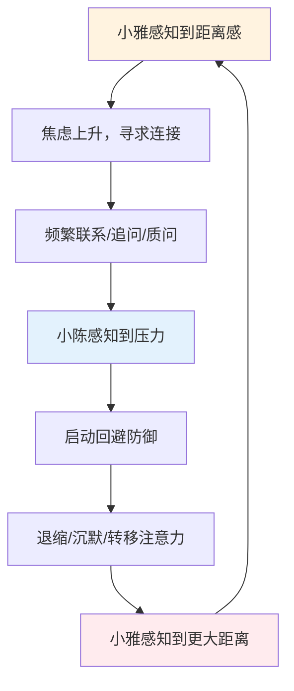

## 案例二：亲密关系中的依恋模式冲突

亲密关系是依恋模式冲突最密集的场景。当焦虑型依恋者遇上回避型依恋者，双方的防御机制会形成一个自我强化的恶性循环——一方越追，另一方越逃，彼此都在无意中触发对方最深的恐惧。本案例将完整拆解这一过程，从触发机制到修复策略，提供可操作的干预路径。

### 一、案例背景

小雅（27岁，焦虑型依恋）和小陈（29岁，回避型依恋）交往两年。两人在工作上都是高绩效者，但亲密关系中反复出现同一个冲突模式：

- 小雅需要频繁的情感确认，一旦感到"被忽略"就会焦虑升级
- 小陈在压力下倾向于退缩和独处，面对情感需求时感到窒息

这次冲突的导火索：周五下午小雅发了一条消息问晚上吃什么，小陈三个小时没回复。这已经是本月第三次类似事件。

**冲突时间线：**

| 时间 | 小雅的行为 | 小雅的内心独白 |
|------|-----------|---------------|
| 14:00 | 发消息："晚上想吃什么？我来点外卖" | 正常期待 |
| 15:00 | 发消息："在忙吗？" | 开始不安 |
| 15:30 | 发消息："你看到消息了吗？" | 焦虑上升 |
| 16:00 | 发消息："你到底在干嘛？能不能回一下？" | 愤怒掩盖焦虑 |
| 16:30 | 打电话，被挂断 | 情绪崩溃 |
| 16:31 | 发消息："行，你就这样对我吧" | 攻击性表达 |

小陈这边：正在开一个紧急项目会议，手机静音。16:35会议间隙看了一眼手机，看到6条未读+1个未接来电，回了句"在开会"，然后深呼吸，感到一阵烦躁。

### 二、心理机制深度分析

#### 2.1 依恋系统激活

依恋理论（Bowlby, 1969）的核心观点：人类有与生俱来的依恋行为系统，当感知到威胁或分离时会被激活。焦虑型和回避型是两种不同的应对策略：

**焦虑型依恋的激活路径：**

感知到"不回应" → 解读为"可能被抛弃"
→ 依恋系统激活 → 焦虑情绪涌出
→ 寻求行为升级（反复联系、追问、质问）
→ 如果仍无回应 → 情绪崩溃或攻击性表达

小雅的反应并非"矫情"或"作"，而是依恋系统在发出警报。她的大脑将"三小时未回复"编码为潜在的分离威胁，杏仁核被激活，催产素水平下降，皮质醇（压力激素）上升。从神经科学角度看，这与面对真实物理威胁时的应激反应高度相似。

**回避型依恋的激活路径：**

感知到"密集联系" → 解读为"被控制/窒息"
→ 防御系统激活 → 退缩冲动涌现
→ 关闭情感通道 → 转向理性化或专注其他事物
→ 如果对方继续追 → 加大回避力度或爆发愤怒

小陈的回避也不是"不爱"或"冷血"，而是他在成长过程中习得的自我保护策略。当他感到情感需求被"强加"时，他的神经系统将其识别为自主性威胁，触发战斗-逃跑反应中的"逃跑"分支。

#### 2.2 追逐-回避循环（Pursue-Withdraw Cycle）

这是亲密关系中最常见的负性互动模式之一，由伴侣治疗师 Sue Johnson 和 John Gottman 等人反复记录和研究：

关键认知：这个循环中没有"坏人"。双方都在用各自的方式试图保护自己，但方式恰好踩中了对方的痛点。

#### 2.3 三重认知扭曲

本次冲突中同时出现了三种认知偏误，它们叠加放大了情绪反应：

**① 基本归因错误（Fundamental Attribution Error）**

将他人的行为归因于性格/意图，而非情境因素：

- 小雅："他没回消息 → 他不在乎我"（归因于个人特质），而非"他在开会"（情境因素）
- 小陈："她一直发消息 → 她太黏人了"（归因于个人特质），而非"她感到不安需要确认"（情绪状态）

**② 确认偏差（Confirmation Bias）**

选择性关注支持已有信念的证据：

- 小雅的"证据库"：他上次也没及时回、他宁愿打游戏也不陪我、他从不主动说爱我（忽略反面证据：他记得她喜欢的咖啡口味、生病时请假照顾她）
- 小陈的"证据库"：她又来了、每次都这样、我一点空间都没有（忽略反面证据：她也经常为他做饭、尊重他的工作选择）

**③ 读心术谬误（Mind Reading Fallacy）**

在没有验证的情况下假设自己知道对方的想法和动机：

- 小雅"确定"小陈是故意不回
- 小陈"确定"小雅就是想控制他

### 三、分阶段干预方案

#### 3.1 第一阶段：紧急情绪调节（冲突当下）

**小雅可以做的：**

1. **物理打断**：放下手机，离开当前环境。去洗手间用冷水洗手30秒，激活迷走神经，降低交感神经兴奋度
2. **自我对话**："我现在感到被抛弃的恐惧，但这是我的依恋系统在报警，不代表真的有危险"
3. **情绪标注**：在纸上写下"我现在感到__（害怕/愤怒/不被重视）"，研究表明单纯给情绪命名就能降低杏仁核活动强度（Lieberman et al., 2007）
4. **24小时缓冲规则**：在情绪高峰期不发决定性消息。将想说的话写在备忘录里，24小时后重新审视

**小陈可以做的：**

1. **即使只用5秒钟**，也发一条最低限度的回应："在忙，X点后回复你"——这对焦虑型伴侣来说是极其重要的"安全信号"
2. **自我对话**："她不是在攻击我，她是在表达不安。我感到烦躁是正常的，但我不需要现在就回应所有内容"
3. **设定时间边界**："我需要30分钟独处时间，之后我们好好聊"——给出明确的时间承诺

#### 3.2 第二阶段：修复性对话（情绪平复后，通常2-24小时内）

修复性对话的目标不是"分清谁对谁错"，而是共同理解刚才发生了什么，并为未来建立新的应对方式。

**对话结构（建议40-60分钟，面对面）：**

**Step 1：各自描述体验（每人5分钟，不打断）**

小雅的表达（使用"我感到"句式 + 认知共情）：

> "我知道你在开会时没法回消息，这完全合理。但当长时间没有回复时，我会开始感到不安——不是因为你做错了什么，而是这触到了我内心深处害怕被忽略的感受。我发那些消息的时候，其实是在用愤怒掩盖恐惧。我真正需要的不是你秒回，而是知道你心里有我。"

小陈的表达（使用情感共情 + 自我暴露）：

> "我看到那些消息时，第一反应确实是压力很大，想要先退开。但这不是因为我不在乎你。在那种压力下我的脑子会自动进入'解决问题'模式，关掉情感通道。我知道这让你更难受。我需要学会在压力下也保持一点连接，而不是完全关机。"

**Step 2：共同标注循环模式**

两个人一起回顾刚才的"追逐-回避循环"，把每一步画出来或说出来。关键是认识到：**这是循环在驱动我们，不是对方在伤害我们。**

**Step 3：建立具体协议**

| 协议内容 | 负责方 | 具体做法 |
|---------|--------|---------|
| 忙碌时发送安全信号 | 小陈 | 至少发一个"在忙"，不求详细解释 |
| 不安时先自我觉察 | 小雅 | 先问自己"我现在是感到害怕吗？"再决定发什么 |
| 消息升级的"刹车点" | 小雅 | 连续2条无回复后停止发送，转为写日记或散步 |
| 给出明确回复时间 | 小陈 | "我X点后回复你"并遵守承诺 |
| 每日连接仪式 | 双方 | 固定一个时间段（如晚饭后20分钟）进行无手机的面对面交流 |
| 每周关系复盘 | 双方 | 周末花15分钟回顾本周互动，及时微调 |

#### 3.3 第三阶段：长期依恋模式调整（数周至数月）

短期协议能缓解症状，但真正的改变需要调整依恋模式本身。这通常需要3-12个月的持续练习：

**对焦虑型依恋者（小雅）的成长路径：**

1. **建立自我安抚能力**：练习正念冥想（每天10分钟），学会在焦虑来临时不立即外求，而是先回到自己的身体感受
2. **拓展安全感来源**：不过度依赖单一关系。培养友谊、兴趣爱好、职业成就感等多元的安全基地
3. **识别"旧伤"**：理解自己焦虑型依恋的来源（可能是童年时期照看者的不一致回应），将"过去的恐惧"与"现在的现实"分离
4. **发展内在对话**：从"他不回我就是不爱我"转变为"他暂时没回消息，我感到不安，但我可以等到他回复后再判断"

**对回避型依恋者（小陈）的成长路径：**

1. **提升情感可及性**：练习用语言表达感受，即使一开始觉得别扭。从简单的"今天有点累"开始，逐步到更深层的情感分享
2. **觉察回避信号**：识别自己什么时候开始"关机"（如突然想看手机、想去工作、身体转向另一侧），在关机前多停留10秒钟
3. **理解独处需求与情感连接并非对立**：可以先满足伴侣的连接需求，再给自己充电时间，两者可以兼顾
4. **挑战"脆弱即危险"的信念**：回避型的核心信念是"暴露需求会被拒绝或控制"。通过小步尝试（如主动说"我今天需要一个拥抱"）来积累正向经验

#### 3.4 关系层面的长期建设

**① 建立情感银行账户（Gottman理论）**

John Gottman的研究发现，稳定的关系中积极互动与消极互动的比例至少为5:1。具体做法：

- 每天至少表达一次具体的欣赏："你今天做的那道菜真的很好吃"（而非泛泛的"你真好"）
- 在伴侣分享日常小事时给予回应（转向而非转离）
- 记住重要的日子和细节
- 在对方疲惫时主动分担

**② 创建"关系使用手册"**

两个人共同写一份关于彼此的说明书，包含：

- 我感到安全时的表现是什么
- 我感到不安全时的早期信号是什么
- 我在冲突中最需要什么
- 什么方式的安慰对我最有效
- 我需要独处时的表达方式

**③ 压力预警系统**

建立一套简短的信号系统，让对方知道自己的状态：

- 🟢 "我状态很好，随时可以聊"
- 🟡 "我有些压力，但可以简短交流"
- 🔴 "我现在需要空间，X小时后再聊"

这个系统的关键在于：收到🔴信号的一方不将其解读为"被拒绝"，发送🔴信号的一方承诺在约定时间主动恢复连接。

### 四、常见误区与纠正

| 误区 | 为什么是错的 | 正确做法 |
|------|------------|---------|
| "只要他多回消息就好了" | 把系统性问题简化为单一行为，治标不治本 | 理解这是依恋模式的互动问题，双方都需要调整 |
| "我需要改变自己去迎合他" | 焦虑型不应完全压抑需求，回避型不应完全放弃空间 | 目标是双方都向中间移动，而非一方牺牲 |
| "等我不焦虑了再沟通" | 焦虑不会自动消失，压抑会积累到爆发 | 学会在焦虑中也能有效沟通，焦虑是信息而非敌人 |
| "他不改就是不爱我" | 依恋模式是深层习惯，改变需要时间 | 关注趋势而非完美，看他在努力没有 |
| "我们总是吵架说明不合适" | 所有关系都有冲突，关键是冲突后能否修复 | 关注修复能力，而非冲突频率 |
| "回避型就是不在乎" | 回避型的情感表达方式不同，不代表没有情感 | 学习解读回避型的"爱的语言"（如行动服务、实际帮助） |

### 五、何时寻求专业帮助

以下情况建议寻求专业伴侣治疗（如情绪聚焦疗法EFT或Gottman方法）：

- 同一冲突模式持续6个月以上，自助干预无效
- 出现言语攻击、冷暴力或控制行为
- 一方或双方有未处理的创伤经历（童年忽视、前任出轨等）
- 信任严重受损，无法自行重建
- 冲突已经泛化到影响工作、睡眠和身体健康

### 六、关键学习总结

1. **依恋模式不是性格缺陷**，而是在早期关系中习得的生存策略。理解这一点是不将对方行为个人化的前提
2. **区分行为与意图**：小陈的"不回消息"是回避行为，意图不是"惩罚"小雅；小雅的"连续发消息"是寻求行为，意图不是"控制"小陈
3. **冲突中的语言转换**：将"你总是不理我"转化为"当你没有回复时，我会感到不安"——前者触发防御，后者邀请共情
4. **改变是双向的**：不是焦虑型要学会"不黏人"，也不是回避型要学会"多回应"，而是双方共同理解并跳出追逐-回避循环
5. **耐心是必要的**：依恋模式经过数十年形成，改变需要数月到数年的持续练习。每一次成功的修复性对话，都在神经通路上留下新的痕迹

***

**延伸阅读：**
- 《依恋与亲密关系》（Attached）—— Amir Levine & Rachel Heller
- 《情绪聚焦伴侣治疗》（The Practice of Emotionally Focused Couple Therapy）—— Sue Johnson
- 《爱的博弈》（What Makes Love Last?）—— John Gottman
