## 案例三：团队中的心理安全感建设

> 心理安全感不是"让大家感觉良好"，而是创造一种环境，让人们敢于承担人际风险——提出异议、承认错误、寻求帮助——而不必担心受到惩罚或羞辱。
> ——艾米·埃德蒙森，《无畏的组织》

本案例记录了一位新任管理者如何用八周时间，将一个"沉默型低效团队"转变为高心理安全感的创新型团队。案例完整呈现了问题诊断、干预策略、执行细节和量化结果，适合正在管理团队或即将接管团队的读者参考。

---

### 一、背景：一个"没人敢说话"的团队

王总监从公司另一个事业部调任，接管了一个绩效持续低迷的技术团队。该团队有12名成员，负责核心产品的后端架构维护与迭代。

**团队的表面状态**：

| 观察维度 | 具体表现 |
|---------|---------|
| 会议参与度 | 周会平均发言人数仅2-3人，其余全程沉默 |
| 问题上报率 | 近半年无一人主动上报过线上事故隐患 |
| 创新提案 | 整个季度零创新提案，连小改进建议都极少 |
| 人员流动 | 一年内3人离职，离职面谈均提及"氛围压抑" |
| 错误处理 | 出问题后第一反应是互相推诿，而非分析根因 |

**前任总监的管理风格**：

前任赵总监以"严格管理"著称，其核心管理行为包括：

- **公开批评**：在全员会议上点名批评犯错的成员，措辞严厉
- **结果导向极端化**：只看结果不问过程，延期即等于失败
- **意见筛选**：只接受与自己判断一致的建议，对不同意见冷处理
- **信息不对称**：决策过程不透明，成员只收到"最终命令"

这种管理模式持续了两年，在团队中形成了根深蒂固的防御性行为模式。

---

### 二、问题诊断：不只是"不爱说话"

#### 2.1 心理安全感的四个维度评估

王总监到任第一周，没有急于改变任何事情。他设计了一份匿名问卷（基于埃德蒙森的心理安全感量表），对团队进行诊断。结果如下：

| 安全感维度 | 团队均分（满分5分） | 行业标杆 | 差距 |
|-----------|-------------------|---------|------|
| 发言安全感 | 1.8 | 3.9 | -2.1 |
| 学习安全感 | 2.1 | 4.1 | -2.0 |
| 承认错误安全感 | 1.3 | 3.5 | -2.2 |
| 创新安全感 | 1.6 | 3.7 | -2.1 |

**关键发现**：承认错误安全感得分最低（1.3），说明团队对"犯错"的恐惧最为严重。这直接解释了为什么无人上报隐患——上报等于承认自己没做好。

#### 2.2 深层心理机制分析

通过一对一深度访谈（每人30-45分钟），王总监识别出四层递进的心理障碍：

**第一层：习得性沉默**

团队成员已经"学会"了沉默。过去两年中，每次有人提出不同意见或指出问题，结果都不好——要么被公开否定，要么被忽视。大脑的奖赏-惩罚回路已经形成条件反射：说话=风险，沉默=安全。

一位资深工程师的原话："我以前也提过建议，但被怼了几次之后就学乖了。反正说了也没用，还不如做好自己的事。"

**第二层：信任断裂**

成员不信任管理层——不是不信任王总监个人（他刚来），而是不信任"管理层"这个角色。前任总监的行为已经摧毁了"领导是可以信赖的"这个基本假设。信任重建需要一致的行为证据，而非言语承诺。

**第三层：群体极化效应**

沉默具有传染性。当大多数人选择沉默，少数想说话的人会受到强烈的从众压力。团队中形成了一种"沉默规范"——说话反而成了"不懂事"的行为。

**第四层：认知偏差的固化**

团队中存在两种关键的认知偏差：

- **确认偏差**：成员只关注"提出想法被批评"的案例，自动忽略"提出想法被采纳"的可能性。一位成员说："我只记得有一次我提了个方案，被赵总直接否了。"但当被问及"有没有提过被采纳的建议"时，他想了一会儿说："好像也有过，但那种感觉完全不一样。"

- **基本归因错误**：成员将前任总监的严厉归因于"他就是这种人"，而非"这是他的管理风格选择"。这导致他们泛化为"所有领导都这样"，提前对新领导也设防。

#### 2.3 团队动态地图

王总监用关系网络分析工具绘制了团队的非正式沟通结构：

```mermaid
graph TD
    subgraph 活跃核心
        A[小李 - 资深前端] --> B[小张 - 后端骨干]
    end
    subgraph 沉默多数
        C[小王 - 后端]
        D[小陈 - 测试]
        E[小刘 - 运维]
        F[小赵 - 前端]
    end
    subgraph 边缘成员
        G[小孙 - 新人1]
        H[小周 - 新人2]
    end
    A -.->|非正式沟通| C
    A -.->|非正式沟通| D
    B -.->|偶尔交流| E
    style 活跃核心 fill:#2d5a27,stroke:#4a8
    style 沉默多数 fill:#4a3c20,stroke:#8a6
    style 边缘成员 fill:#5a2020,stroke:#a44
```



**发现**：团队中只有2人（小李、小张）在正式会议中会发言，其余10人处于"沉默多数"或"边缘化"状态。但非正式场合（午饭、茶歇），这些沉默成员之间的私下交流其实很活跃——他们不是没有想法，而是不敢在正式场合表达。

---

### 三、干预方案：八周系统性建设

#### 3.1 总体策略框架

```mermaid
graph LR
    A[第一阶段<br>建立信任<br>第1-2周] --> B[第二阶段<br>创造安全空间<br>第3-4周]
    B --> C[第三阶段<br>强化新模式<br>第5-8周]
    C --> D[持续维护<br>长期机制]
    style A fill:#1a3a5c,stroke:#4a9
    style B fill:#2a4a3c,stroke:#4a9
    style C fill:#3a3a2c,stroke:#ca6
    style D fill:#4a2a2c,stroke:#ca6
```



核心原则：**行为先于言语，证据先于承诺**。不是告诉团队"这里是安全的"，而是用反复一致的行为让团队自己得出这个结论。

#### 3.2 第一阶段：建立信任（第1-2周）

**目标**：打破"领导=威胁"的条件反射，建立"这个领导不一样"的初步印象。

**具体行动与执行细节**：

**行动1：首次全员会议——展示脆弱性**

王总监在第一次团队会议上做了15分钟的分享，内容包括：

- 自己职业生涯中犯过的三个重大错误及教训
- 自己不懂的技术领域，坦诚需要团队成员的帮助
- 明确表态："我到这里不是来证明自己有多厉害，而是来帮助这个团队变得更好"

> 事后他回忆："那次分享我确实紧张。但效果很明显——分享结束后，有两个人主动来找我聊了。这在之前是不可想象的。"

**关键语言模板**：

"我加入这个团队时间不长，对很多情况还不了解。
在接下来的几周里，我的主要工作是倾听和学习。
如果我做出了你们觉得不对的决定，请直接告诉我——
我宁愿被纠正，也不愿犯一个可以避免的错误。"

**行动2：一对一深度对话（12人×30-45分钟）**

王总监用一周时间完成了与所有成员的一对一谈话。每次谈话遵循固定框架：

| 环节 | 时间 | 目的 | 关键问题示例 |
|------|------|------|------------|
| 破冰 | 5分钟 | 建立个人连接 | "来这里之前你在做什么？生活中有什么爱好？" |
| 倾听 | 15分钟 | 了解现状和感受 | "你觉得这个团队最大的优势是什么？最大的挑战是什么？" |
| 期望 | 10分钟 | 了解需求 | "你希望从我这里得到什么样的支持？" |
| 承诺 | 5分钟 | 设定预期 | "我会在两周内给你反馈，告诉你我从这些对话中学到了什么" |

**关键原则**：
- 不在谈话中做任何评判
- 不对任何人提到其他人说过的话
- 全程做笔记，但不记录敏感信息
- 对每个人的关注点给出真诚回应

**行动3：观察周——不干预的干预**

第一周的会议中，王总监只做两件事：倾听和记录。不评判、不纠正、不急于给方案。他的笔记中记下了每个人的发言频率、身体语言、与其他人的互动方式。

这个"不作为"本身就是信号——它传达了"我不会像前任那样急着下结论"。

**第一阶段的预期与风险**：

| 预期信号 | 如何识别 | 风险应对 |
|---------|---------|---------|
| 开始有人主动找你聊 | 午休或茶歇时有人靠近 | 不要过度热情，保持自然 |
| 一对一谈话中出现停顿 | 成员欲言又止 | 保持沉默等待，不要催促 |
| 会议中出现第一次自发发言 | 有人在你没有点名时开口 | 即时肯定，但不要过度反应 |
| 成员之间开始在你面前开玩笑 | 非正式交流增加 | 参与但不要主导 |

#### 3.3 第二阶段：创造安全空间（第3-4周）

**目标**：建立新的团队规范，让"说话"变得比"沉默"更舒适。

**行动1：会议规则重建**

王总监引入了三条会议基本规则，在每次会议开始时由不同成员轮流宣读：

规则一：所有想法都受欢迎——不成熟的想法也是想法
规则二：质疑不是攻击——挑战观点是为了找到更好的答案
规则三：沉默不是同意——如果你有不同看法，说出来是你的责任

**规则三特别重要**——它把"沉默"从"安全的默认选项"变成了"不负责任的行为"，巧妙地重新定义了团队规范。

**会议结构改进**：

```mermaid
graph TD
    A[会前24h: 发送议题+背景材料] --> B[开会前5min: 匿名收集初步想法]
    B --> C[正式会议: 结构化讨论]
    C --> D[圆桌发言: 每人至少1分钟]
    D --> E[会后: 发送纪要+行动项]
    style A fill:#1a3a5c,stroke:#4a9
    style B fill:#2a4a3c,stroke:#4a9
    style C fill:#3a3a2c,stroke:#ca6
    style D fill:#4a2a2c,stroke:#ca6
    style E fill:#5a2020,stroke:#a44
```



**会前匿名想法收集**：使用在线表单，让成员在会议前提交想法。这样做的好处是：内向者有时间组织语言，且匿名降低了心理门槛。王总监会在会议中有意引用这些匿名想法："有人提到一个观点我觉得很好……"，逐渐让大家意识到"提想法是有价值的"。

**圆桌发言机制**：每次会议最后15分钟，每人必须发言至少1分钟，内容不限——可以是对会议议题的看法，也可以是本周的工作心得或遇到的困难。初期很多人说得很少（"没什么补充的"），但随着安全感建立，这个环节逐渐变得活跃。

**行动2：匿名反馈系统**

王总监建立了三个匿名渠道：

| 渠道 | 工具 | 频率 | 用途 |
|------|------|------|------|
| 匿名建议箱 | 在线表单 | 随时 | 任何想法、建议、不满 |
| 周度脉搏调查 | 5题问卷 | 每周五 | 快速了解团队情绪状态 |
| 月度深度反馈 | 10题问卷 | 每月末 | 评估心理安全感变化趋势 |

**匿名建议箱的关键设计**：
- 提交后无法追踪来源
- 所有建议必须在72小时内得到回应（公开回应）
- 回应不评判建议本身，只关注"我们打算怎么处理"

**行动3：正面强化"第一次开口"**

王总监设计了一套即时正向反馈机制：

- **当有人提出不同意见时**："谢谢你愿意说出这个不同的角度，这帮助我们看到了盲点。"
- **当有人承认错误时**："我欣赏你的坦诚。让我们一起看看从这个错误中能学到什么。"
- **当有人提出新想法时**："这个思路很有意思，能不能多说说你的考虑？"

**关键原则**：反馈要具体，不要笼统地说"很好"。具体性传达了"我认真听了你说的话"，这是信任的基石。

**行动4：错误正常化仪式**

王总监在每周五下午设立了一个15分钟的"本周教训"环节。每次由一位成员自愿分享本周犯的一个错误或遇到的一个困难，全团队一起讨论"我们学到了什么"。

**仪式规则**：
- 王总监第一个分享（连续三周）
- 只讨论"学到了什么"，不讨论"谁的责任"
- 分享者选择匿名或署名
- 每月评选"最有价值教训奖"

**执行初期的挑战与应对**：

| 挑战 | 表现 | 应对策略 |
|------|------|---------|
| 冷场 | 第一次圆桌发言环节，连续三人说"没什么" | 降低要求：先从"这周工作中最有趣的事"开始 |
| 表面配合 | 有人只说"好话"来应付 | 一对一私下询问真实感受 |
| 怀疑观望 | 有人在观察"这能持续多久" | 坚持行为一致性，用时间证明 |
| 历史创伤反应 | 有人在被肯定时表现出不自在 | 不要过度关注，给适应时间 |

#### 3.4 第三阶段：强化新模式（第5-8周）

**目标**：将新的行为模式从"领导推动"转变为"团队自驱"。

**行动1：庆祝学习而非仅庆祝成功**

传统团队文化庆祝的是"成功"——项目上线、达成目标、获得好评。王总监在此基础上增加了对"学习"的庆祝：

- **"本周最有价值教训"投票**：每周五匿名投票选出本周最有价值的学习分享
- **"失败复盘报告"模板**：标准化的复盘文档，包含"发生了什么→为什么→我们学到了什么→下次怎么避免"
- **学习积分系统**：分享教训可以获得积分，积分可用于兑换培训机会或弹性工作时间

**失败复盘报告模板**：

```markdown
## 失败复盘报告

### 发生了什么
[客观描述事件经过，不带评判]

### 影响范围
[受影响的用户/系统/业务指标]

### 根因分析
- 技术层面：
- 流程层面：
- 沟通层面：

### 学到了什么
1. [具体教训1]
2. [具体教训2]

### 行动项
| 行动 | 负责人 | 截止日期 |
|------|--------|---------|
| [具体行动] | [人名] | [日期] |

### 如何防止类似问题再次发生
[系统性改进措施]
```

**行动2：鼓励建设性冲突**

心理安全感高不等于"没有冲突"。王总监引入了"红队-蓝队"辩论机制：

- 针对重要技术决策，将团队分成两组
- 一组负责"支持方案A"，另一组负责"质疑方案A"
- 角色互换后再次辩论
- 最终基于论据质量做决策

这个机制的价值在于：它将"反对"制度化、游戏化，降低了"提出异议=得罪人"的心理门槛。

**行动3：透明决策机制**

王总监建立了决策透明化流程：

```mermaid
graph TD
    A[收集意见<br>匿名+公开] --> B[整理选项<br>列出各方案]
    B --> C[公开讨论<br>红队蓝队]
    C --> D[决策并公示<br>附决策理由]
    D --> E[执行+复盘<br>回顾决策质量]
    E -->|反馈循环| A
    style A fill:#1a3a5c,stroke:#4a9
    style B fill:#2a4a3c,stroke:#4a9
    style C fill:#3a3a2c,stroke:#ca6
    style D fill:#4a2a2c,stroke:#ca6
    style E fill:#5a2020,stroke:#a44
```



**决策公示模板**：

决策：[选择了什么方案]
被考虑的选项：
  1. 方案A（优点/缺点）
  2. 方案B（优点/缺点）
  3. 方案C（优点/缺点）
选择理由：[为什么选了这个方案]
被采纳的不同意见：[哪些反对意见影响了决策]
如果这个决策错了，我们的B计划是：[应急方案]

**行动4：团队心理安全度量仪表板**

王总监将心理安全感的评估从"一次性问卷"升级为"持续度量系统"：

| 指标 | 度量方式 | 频率 | 目标值 |
|------|---------|------|--------|
| 会议发言率 | 每次会议发言人数/总人数 | 每次会议 | >80% |
| 问题主动上报率 | 主动上报的隐患数/总发现的隐患数 | 每月 | >70% |
| 创新提案数 | 每月收到的改进建议数量 | 每月 | >5条 |
| 1:1心理安全评分 | 匿名问卷4题均分 | 每两周 | >3.5 |
| 冲突解决满意度 | 冲突后双方满意度评分 | 每次冲突后 | >3.0 |

---

### 四、量化结果与质性变化

#### 4.1 八周后的关键指标变化

| 指标 | 干预前 | 第4周 | 第8周 | 变化幅度 |
|------|--------|-------|-------|---------|
| 会议发言率 | 17%（12人中2人） | 45% | 85% | +400% |
| 问题主动上报数（月） | 0 | 3 | 11 | 从0到11 |
| 创新提案数（月） | 0 | 2 | 7 | 从0到7 |
| 心理安全综合评分 | 1.7/5 | 3.1/5 | 4.0/5 | +135% |
| 匿名建议箱使用量（周） | 0（前两周） | 4 | 8 | 持续增长 |

#### 4.2 质性变化

**成员反馈摘录**：

> "我第一次觉得在这里犯错是可以的。不是说犯错无所谓，而是犯了错不会被'搞'，而是会被帮助。" ——后端工程师小王

> "以前开会我就想赶紧结束。现在有时候会开超时，因为讨论太激烈了，大家都抢着说。" ——测试工程师小陈

> "最让我意外的是，有一次我在群里直接说'我觉得这个方案有问题'，王总监的回复是'展开说说'。那一刻我就知道，这次是来真的。" ——运维工程师小刘

**行为变化证据**：

- 第6周：两位成员在技术评审会上公开反对了王总监的方案，给出了详细的技术论据。王总监当场采纳了他们的建议。
- 第7周：团队自发建立了"技术分享午餐会"，每周五中午由一位成员做20分钟的技术分享。
- 第8周：一位新入职的实习生在第二周就开始在会议上主动发言（通常新人需要1-2个月才能"破冰"）。

---

### 五、常见陷阱与纠正方法

在心理安全感建设过程中，以下是最常见的六个陷阱：

**陷阱1：把心理安全感等同于"做好人"**

心理安全感不是"不批评"，而是"以建设性方式批评"。王总监在第5周时直接指出了一个代码质量问题，但他的方式是："这段代码有三个可以改进的地方，我们一起看看？"——直接但不羞辱。

**纠正方法**：心理安全感 = 高标准 + 高支持。不是降低要求，而是改变达成要求的方式。

**陷阱2：只改变表面行为，不改变底层机制**

有些管理者学会了"说好听的话"，但绩效考核、晋升标准、资源分配仍然是惩罚导向。团队成员很快会识别出"言行不一"。

**纠正方法**：确保激励体系与心理安全文化一致。如果鼓励"坦诚"但惩罚"失误"，坦诚就不可能发生。

**陷阱3：忽视团队中的"安全破坏者"**

每个团队中都可能存在一两个习惯性贬低他人的人。如果不处理，他们一个人就能摧毁整个团队的心理安全感。

**纠正方法**：私下一对一沟通，明确行为期望。如果持续不改，需要考虑团队调整。

**陷阱4：急于求成，期望线性进步**

心理安全感的提升不是线性的。通常在第3-4周会有一个"试探期"——成员开始小范围尝试，如果得到正面回应就继续，如果得到负面回应就立即退缩。

**纠正方法**：预期波动，在试探期给予最密集的正向强化。

**陷阱5：只关注"说"，忽视"听"**

有些管理者鼓励成员发言，但自己在听的时候表现出不耐烦、急于打断、或者听完就忘。这比不让说话更糟糕——它传达了"你说的不重要"。

**纠正方法**：练习"3秒停顿"——在对方说完后，停顿3秒再回应。这3秒传达了"我在认真消化你说的话"。

**陷阱6：将心理安全感视为一次性项目**

心理安全感是持续维护的系统，不是一次干预就能"解决"的项目。一次严厉的公开批评就可能让数周的努力归零。

**纠正方法**：建立持续的度量和反馈机制，将心理安全维护纳入管理者的日常工作清单。

---

### 六、关键原理：为什么心理安全感是团队效能的基石

#### 6.1 心理安全感与团队绩效的关系

埃德蒙森在Google的"亚里士多德计划"（Project Aristotle）研究中发现：心理安全感是区分高效团队和低效团队的最重要因素，超过了成员个人能力、团队组成、资源投入等所有其他变量。

**机制解释**：

```mermaid
graph TD
    A[高心理安全感] --> B[成员敢于发言]
    A --> C[成员敢于承认错误]
    A --> D[成员敢于尝试创新]
    B --> E[信息流动更充分]
    C --> F[问题更早被发现]
    D --> G[解决方案更多样]
    E --> H[决策质量更高]
    F --> I[风险更可控]
    G --> J[创新产出更多]
    H --> K[团队效能提升]
    I --> K
    J --> K
    style A fill:#2d5a27,stroke:#4a8
    style K fill:#1a3a5c,stroke:#4a9
```



#### 6.2 心理安全感的神经科学基础

当人感到不安全时，大脑的杏仁核（负责威胁检测）会激活"战或逃"反应，抑制前额叶皮层（负责理性思考、创造力、复杂决策）的功能。这意味着：**在一个缺乏心理安全感的团队中，成员的认知能力会被系统性地削弱**——不是因为他们不够聪明，而是因为他们的大脑在忙着"防御"而不是"思考"。

这也解释了为什么本案例中"创新提案数量"的变化如此显著——不是成员突然变得更聪明了，而是他们的认知资源从"自我保护"释放到了"问题解决"上。

---

### 七、可复用的工具与模板

#### 7.1 团队心理安全快速诊断问卷

以下7题可在5分钟内完成，建议每两周使用一次：

| 编号 | 题目 | 评分（1-5分） |
|------|------|-------------|
| 1 | 在这个团队中，我可以自由表达不同意见而不受惩罚 | |
| 2 | 在这个团队中，我可以承认错误而不被嘲笑或指责 | |
| 3 | 在这个团队中，我可以寻求帮助而不被视为能力不足 | |
| 4 | 在这个团队中，我可以尝试新方法而不怕失败的后果 | |
| 5 | 在这个团队中，我可以对领导的决定提出质疑 | |
| 6 | 在这个团队中，我感到同事之间是相互支持的 | |
| 7 | 在这个团队中，坏消息会被视为解决问题的机会而非追责的开始 | |

**评分标准**：均分4.0+为优秀，3.0-3.9为良好需持续关注，2.0-2.9为警戒需干预，<2.0为危险需立即行动。

#### 7.2 心理安全修复话术模板

当管理者自身行为损害了心理安全感时（如在压力下公开批评了某人），修复步骤：

第一步：及时处理（24小时内）
"关于昨天会上发生的事情，我想和你谈谈。"

第二步：承认影响
"我昨天在会上直接批评了你的方案，我知道这可能让你感到不舒服。"

第三步：承担责任
"这是我的问题——我当时太着急了，没有控制好自己的反应方式。"

第四步：明确改变
"以后如果我对你方案有意见，我会私下和你讨论，而不是在会上直接否定。"

第五步：寻求反馈
"你觉得我还有什么需要注意的地方？"

#### 7.3 新任管理者心理安全建设清单

| 周次 | 核心任务 | 完成标志 |
|------|---------|---------|
| 第1周 | 一对一谈话完成、匿名问卷发放 | 所有成员完成访谈 |
| 第2周 | 首次会议规则建立、匿名渠道上线 | 三条规则被团队接受 |
| 第3周 | 圆桌发言机制启动、"本周教训"首次分享 | 至少3人参与圆桌发言 |
| 第4周 | 红队蓝队辩论试点、决策透明化首次实践 | 一次完整的辩论会议 |
| 第5-6周 | 正向强化密集期、冲突处理示范 | 有人在会议上公开质疑你 |
| 第7-8周 | 自驱机制建立、度量系统稳定运行 | 团队成员主动维护心理安全 |

---

### 八、延伸思考：心理安全感的边界与限度

**心理安全感不是万能的**。以下情况需要额外注意：

1. **高压紧急场景**：当系统故障需要快速决策时，"充分讨论"可能不是最优策略。此时需要明确切换到"指挥模式"，并在事后复盘时恢复安全空间。

2. **能力差距过大**：如果团队成员的能力差距太大，心理安全感可能导致"所有人都发言但只有少数人的意见有价值"的困境。此时需要将心理安全感与能力培养结合。

3. **文化差异**：在高权力距离文化中（如部分亚洲和中东文化），直接鼓励下属质疑上级可能适得其反。需要根据文化背景调整策略，例如通过匿名渠道降低直接冲突。

4. **远程团队的特殊挑战**：远程环境中缺少非语言线索和非正式交流机会，心理安全感更难建立。需要更频繁的一对一沟通和更刻意的"虚拟茶歇"安排。

---

本案例展示了心理安全感建设的完整路径：从诊断（识别问题的深度和广度）到干预（系统性的三阶段策略）到持续维护（度量与反馈闭环）。核心启示是——**心理安全感不是一种感觉，而是一套可观察、可测量、可管理的行为系统**。它需要领导者的持续投入，但回报是巨大的：一个成员敢于说话、敢于犯错、敢于创新的团队，其效能远超任何个人能力的简单加总。
