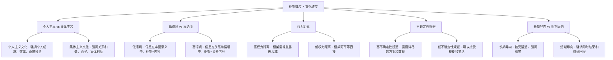
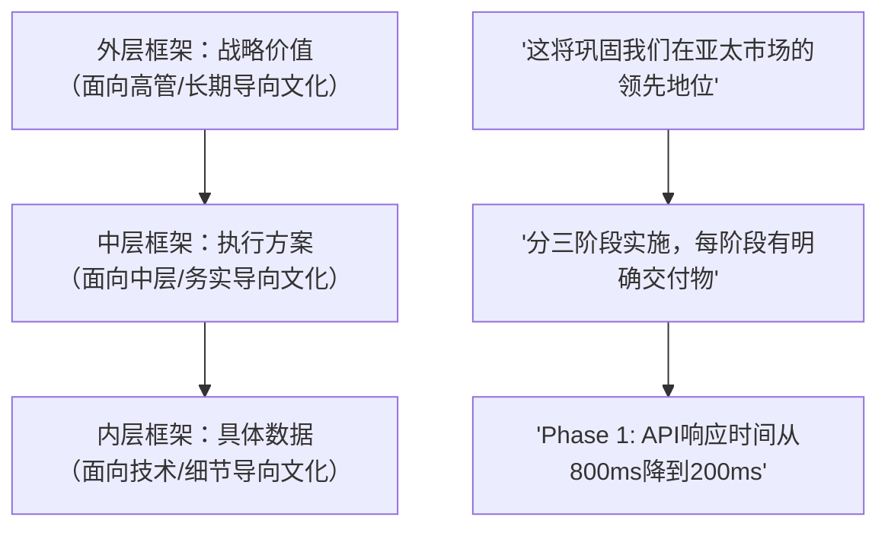

## 案例四：跨文化沟通中的框架效应

### 案例背景与核心问题

张薇是一家中国科技公司的项目经理，负责一个面向美国市场的SaaS产品开发。项目原定2月28日交付Beta版，但因中国春节期间工厂停工两周，硬件集成测试被迫推迟，最终交付日期需要调整到3月15日。

这个场景看似简单，实则包含三层沟通挑战：

| 挑战层级 | 具体内容 | 难度 |
|----------|----------|------|
| 信息层 | 传递"延期两周"这一事实 | 基础 |
| 情感层 | 管理客户的失望、焦虑和信任动摇 | 中等 |
| 文化层 | 在中美沟通风格差异中找到平衡点 | 高级 |

如果张薇用中文思维直接翻译成英文——"很抱歉，项目要延期两周"——这句话在中文语境下是得体的道歉，但在美国商务语境下会被解读为：项目管理能力不足、对客户时间不尊重、缺乏专业性。反过来，如果张薇完全套用美式"spin"话术，把延期包装成"升级机会"，又可能被经验丰富的美国客户识破，反而损害信任。

**跨文化框架效应的核心矛盾**：不同文化对"同一框架"的解读完全不同。在一种文化中被视为积极正面的表达方式，在另一种文化中可能被视为虚伪或回避。

---

### 理论基础：框架效应在跨文化语境中的运作机制

#### 框架效应的本质

框架效应（Framing Effect）由Kahneman和Tversky在1981年的前景理论（Prospect Theory）研究中首次系统描述。核心发现是：人们对同一客观信息的反应，取决于信息被呈现的方式（框架），而非信息本身。

**经典实验复现**：

> 亚洲疾病问题——假设美国正在准备应对一种罕见的亚洲疾病，预计会导致600人死亡。现有两种方案可供选择：
>
> **方案A（收益框架）**：如果采用方案A，200人将被救活。——72%的人选择此方案
>
> **方案B（损失框架）**：如果采用方案B，有1/3的概率600人全部救活，2/3的概率无人被救活。——28%的人选择此方案
>
> 两个方案的期望值完全相同（200人），但收益框架下人们倾向于风险规避，损失框架下倾向于风险寻求。

在跨文化沟通中，框架效应被进一步放大，因为不同文化群体对"收益"和"损失"的敏感度不同。

#### 文化维度如何影响框架感知

**中美文化在这五个维度上的关键差异**：

| 维度 | 中国 | 美国 | 对框架设计的影响 |
|------|------|------|------------------|
| 个人/集体 | 集体主义 | 个人主义 | 中方倾向"我们一起"框架，美方倾向"你的收益"框架 |
| 语境 | 高语境 | 低语境 | 中方可用暗示和委婉，美方需要明确直接 |
| 权力距离 | 较高 | 较低 | 中方倾向自谦和请示，美方倾向平等协商 |
| 不确定性规避 | 中等 | 较低 | 美方可接受一定程度的不确定性 |
| 时间导向 | 长期 | 短期 | 中方可用长期价值框架，美方需看到近期收益 |

理解这些差异后，张薇需要设计一个**跨文化兼容的框架**：既要符合美国客户的直接沟通偏好，又要融入足够的关系维护和长期价值视角。

#### 三重框架模型

在跨文化沟通中，有效的信息传递需要同时构建三个层次的框架：

- **认知框架**：信息被归类为"问题"还是"情况更新"，决定了对方的认知负荷和情绪准备
- **情感框架**：信息触发"损失感"还是"掌控感"，决定了对方的情绪反应
- **行动框架**：信息指向"被动等待"还是"主动参与"，决定了对方的行为倾向

---

### 完整案例展开：张薇的跨文化框架设计过程

#### 第一轮：识别文化陷阱

张薇最初的本能反应是使用典型的中国商务沟通方式：

> ❌ **中文思维直译版**
> "王总（美方负责人），非常抱歉给您带来不便。由于中国春节假期，我们的生产环节受到了一些影响，项目可能需要延期两周左右。我们会尽快赶上进度，请您谅解。"

这段话在中文语境下是得体的，但在美国商务语境下存在五个致命问题：

| 问题 | 具体表现 | 美方解读 |
|------|----------|----------|
| 过度道歉 | "非常抱歉"开头 | 缺乏自信，问题可能比说的更严重 |
| 模糊表达 | "一些影响""两周左右" | 不专业，数据不精确 |
| 被动语态 | "受到了影响" | 回避责任，不坦诚 |
| 缺少方案 | 只说"尽快赶上" | 没有行动计划，不可靠 |
| 请求谅解 | "请您谅解" | 把决定权推给对方，增加对方负担 |

#### 第二轮：过度西化

意识到问题后，张薇可能走向另一个极端：

> ❌ **过度美式spin版**
> "Great news! We've decided to extend our testing phase to ensure the product meets the highest quality standards. The new delivery date is March 15th, and you'll get a much better product as a result!"

这段话的问题在于：

- 把坏消息包装成"好消息"——美国商务人士能立刻识别这种spin
- 没有承认这是延期——回避事实会损害信任
- 没有提供具体的质量提升内容——空洞的承诺
- 没有讨论对客户计划的影响——忽视客户的实际需求

#### 第三轮：跨文化平衡框架

经过深入分析，张薇设计了一个同时满足中美沟通期望的框架：

> ✅ **跨文化平衡版**
>
> "Hi David, I have a project timeline update I'd like to share with you.
>
> During the Spring Festival period, our hardware integration testing was paused, which means we need to adjust the Beta delivery from February 28 to March 15 — a two-week extension.
>
> Here's what this additional time will allow us to complete:
> 1. Full regression testing across all 47 integration points
> 2. Performance stress testing simulating 10,000 concurrent users
> 3. UX optimization based on the alpha feedback we collected in January
>
> To minimize the impact on your launch timeline, we've already:
> 1. Rearranged the subsequent phases — QA starts March 16, launch prep begins March 23
> 2. Prepared a transition plan so your marketing team can begin pre-launch activities during the wait
> 3. Set up weekly progress reports every Friday so you have full visibility
>
> I'd like to discuss how we can further reduce any impact on your plans. Would Thursday at 2pm EST work for a quick call?"

**这段话的框架设计分析**：

| 框架层次 | 设计手法 | 心理机制 |
|----------|----------|----------|
| 认知框架 | "project timeline update"而非"bad news" | 将信息归类为中性的"更新"而非"坏消息"，降低防御心理 |
| 情感框架 | 精确数据 + 具体方案 → 掌控感 | 从"事情失控了"转变为"一切在掌控中" |
| 行动框架 | 已完成的行动 + 邀请讨论 | 从"被动等待"转变为"主动参与" |
| 文化平衡 | 直接承认延期（满足美方直接性需求）+ 展示质量和关系维护（满足中方关系导向） | 两种文化的期望都被满足 |

---

### 多场景框架效应实战

跨文化框架效应不限于中美沟通。以下是三个不同文化组合的实战场景，展示框架设计的通用原则和文化特异性。

#### 场景一：中日沟通——拒绝客户不合理需求

**背景**：李明是中国制造企业的技术总监，日本客户提出了一个超出合同范围的功能修改需求，需要拒绝。

**文化分析**：

日本是极高语境文化，直接说"不"被视为极度失礼。但完全不拒绝又会导致项目范围蔓延。关键是在不使用"不"字的情况下，清晰传达拒绝的意思。

| 框架策略 | 日语文化适配 | 具体表达 |
|----------|--------------|----------|
| 肯定意图 | 先肯定对方需求的合理性 | "ご提案いただいた機能は、ユーザー体験を大幅に向上させるものだと感じています" |
| 陈述约束 | 用客观约束替代主观拒绝 | "ただ、現行のスケジュールとリソースの範囲内で実装いたしますと、品質基準を溉たすことが難しくなります" |
| 提供替代 | 给出可行的替代方案 | "Phase 2で実装する計画を立て、まずは現在のスコープを確実にお届けしたいと考えております" |
| 邀请决定 | 把最终决定权交给对方 | "どちらの方向がプロジェクトの成功にとって最善か、ご意見をお聞かせいただけますでしょうか" |

**框架效果**：日本客户感受到被尊重，约束条件是客观的而非主观的拒绝，替代方案显示了积极态度，最终决定权在客户手中维护了客户的"面子"。

#### 场景二：中美欧三方会议——产品路线图分歧

**背景**：王浩是中国产品负责人，需要在一次三方会议中协调美国销售团队（要求快速上线新功能）和德国工程团队（要求完善技术架构）之间的分歧。

**三方文化框架矩阵**：

| 利益方 | 文化特征 | 核心诉求 | 框架设计要点 |
|--------|----------|----------|--------------|
| 美国销售 | 短期导向、结果驱动 | 快速上线，抢占市场 | 用市场份额数据和竞争压力框架 |
| 德国工程 | 高不确定性规避、质量导向 | 技术完善，零缺陷 | 用技术债务成本和长期维护成本框架 |
| 中国产品 | 长期导向、灵活务实 | 平衡各方，整体最优 | 用分阶段交付和渐进式框架 |

**统一框架设计**：

> "Let me propose a phased approach that addresses both the market urgency and the engineering quality requirements:
>
> Phase 1 (4 weeks): Ship the core feature set with the current architecture. This gives Sales the market entry point while Engineering maintains control over code quality.
>
> Phase 2 (6 weeks): Implement the architecture improvements in parallel with customer feedback collection. This de-risks the technical decisions by grounding them in real usage data.
>
> Phase 3 (4 weeks): Ship the enhanced version with both the full feature set and the improved architecture.
>
> This approach means Sales can start customer conversations in 4 weeks instead of 14, and Engineering gets the time to do things right without cutting corners."

**框架技巧**：将"谁先谁后"的零和竞争框架，转换为"分阶段满足所有人"的增量共赢框架。每个团队都在框架中看到了自己的诉求被优先满足。

#### 场景三：中德沟通——预算超支报告

**背景**：赵敏是中国区运营总监，需要向德国总部报告Q3预算超支18%的情况。

**文化分析**：

德国企业文化极度重视数据精确性和责任追溯。模糊的解释会被视为不专业或有意隐瞒。同时，德国文化中的"Ordnung"（秩序）意味着需要看到清晰的因果链条和纠正措施。

> ❌ **中式委婉版**
> "由于一些市场变化，Q3的预算执行情况与计划有所偏差，我们在控制成本方面还需要进一步加强。"

> ✅ **德式数据驱动版**
>
> "Q3 Budget Variance Report — 18% over plan (€2.34M actual vs €1.98M budget)
>
> **Root Cause Analysis:**
>
> | Factor | Impact | % of Variance |
> |--------|--------|---------------|
> | Raw material price increase (copper +23%) | €180K | 50% |
> | Unexpected regulatory compliance costs | €95K | 26.4% |
> | Overtime due to delayed supplier delivery | €55K | 15.3% |
> | Currency fluctuation (CNY/EUR) | €30K | 8.3% |
>
> **Corrective Actions (already implemented):**
> 1. Signed fixed-price contracts with 2 alternative suppliers — locks in prices through Q2 next year
> 2. Pre-approved compliance budget buffer of 8% for Q4
> 3. Negotiated improved delivery terms with primary supplier — penalty clause for delays >3 days
>
> **Q4 Forecast:** On track to return to within 3% of budget plan."

**框架对比分析**：

| 维度 | 中式委婉版 | 德式数据驱动版 |
|------|------------|----------------|
| 信息精确度 | "有所偏差"——模糊 | "18%, €2.34M"——精确 |
| 因果分析 | "一些市场变化"——笼统 | 四因素分解，百分比精确 |
| 责任归属 | 暗示外部因素 | 明确每个因素的量化影响 |
| 纠正措施 | "进一步加强"——空洞 | 三条具体措施，每条有执行结果 |
| 前瞻性 | 无 | Q4预测回归预算范围 |

---

### 框架效应的高级应用技术

#### 技术一：框架嵌套（Frame Stacking）

在复杂沟通中，可以同时使用多个框架形成"嵌套结构"，让不同文化背景的听众各自找到共鸣点。

每个听众会自动聚焦于自己文化/角色最关注的框架层级，形成"一句话，多重解读"的效果。

#### 技术二：文化镜像（Cultural Mirroring）

在跨文化沟通中，模仿对方的沟通风格可以显著提升信任感。具体操作：

| 对方文化特征 | 镜像策略 | 具体做法 |
|--------------|----------|----------|
| 直接型（美/德/荷） | 数据先行 | 开头就给出关键数字和结论 |
| 关系型（中/日/韩） | 关系先行 | 开头先确认关系状态和共同目标 |
| 分析型（德/北欧） | 逻辑先行 | 按因果链条组织信息 |
| 表达型（美南/拉美/南欧） | 故事先行 | 用具体场景和人物引入话题 |

**注意**：镜像不等于模仿。过度模仿会显得谄媚或不真诚。目标是"在对方舒适的沟通频道上传递你的信息"。

#### 技术三：框架预设（Frame Priming）

在传递关键信息之前，先用一段话或一个问题"预设"对方的解读框架。

**示例**：在告知客户产品Bug之前——

> ❌ 无预设："我们的产品有一个安全漏洞。"
>
> ✅ 有预设："我们的安全监控系统在例行检查中发现了一个潜在风险，已经在一个小时内定位了原因并完成了修复。具体情况如下……"

预设框架将"产品有问题"转换为"安全体系在有效运作"，同样的Bug，完全不同的接收体验。

#### 技术四：损失-收益双框架（Loss-Gain Double Frame）

对风险规避型文化（如德国、日本），先用损失框架引起重视，再用收益框架提供行动方向：

> "如果不处理这个技术债务，未来12个月的维护成本将增加40%（损失框架）。如果我们现在投入3周时间重构，不仅消除这个风险，还将使后续功能开发速度提升25%（收益框架）。"

这种双框架技术利用了人类心理的"损失厌恶"（引起注意）和"收益追求"（推动行动）的双重驱动力。

---

### 常见错误与纠正

#### 错误一：直译母语框架

**表现**：将中文表达方式直接翻译成英文，保留了中文的委婉和含蓄。

**案例**：
> 错误："We will try our best to deliver on time."（我们会尽力按时交付）
> 问题："try our best"在英语商务语境中等于"我们可能做不到"
> 纠正："We are on track to deliver on March 15. Here's the detailed timeline…"（我们将在3月15日交付，以下是详细时间表……）

**原则**：跨文化沟通不是翻译，是重新构建。每种语言有自己的"承诺强度等级"，需要校准而非直译。

| 中文承诺表达 | 直译英文 | 美方实际理解 | 应该表达 |
|-------------|----------|-------------|----------|
| 我们尽力 | We'll try our best | 大概率做不到 | We will deliver by [date] |
| 差不多 | About / approximately | 不确定，可能偏差很大 | Specifically [number] |
| 应该没问题 | Should be fine | 有风险 | We've confirmed [specifics] |
| 我们会考虑 | We'll consider it | 已经否决了 | We'll evaluate and respond by [date] |

#### 错误二：忽视权力距离差异

**表现**：对低权力距离文化（美国、北欧）使用过度恭敬的语气，反而引起不适。

**案例**：
> 错误："尊敬的Smith先生，恳请您在百忙之中审阅我们的方案，如有不当之处请多多指教。"
> 纠正："Hi David, I've attached the proposal for your review. Let me know your thoughts — happy to jump on a call if easier."

#### 错误三：混淆"积极框架"与"隐瞒信息"

**表现**：为了保持积极框架，选择性地隐藏关键负面信息。

**案例**：
> 错误：只说"我们增加了测试环节"，不提具体的延期时长和原因
> 纠正：明确说出延期事实、原因、时长，然后用框架展示应对方案

**原则**：框架效应是在诚实的基础上优化表达方式，不是用修辞技巧掩盖事实。一旦被识破，信任损失远大于信息本身的负面影响。

#### 错误四：单一框架应对所有文化

**表现**：学会了一种框架技巧后，在所有跨文化场景中机械套用。

**纠正**：框架设计必须基于对具体文化维度的分析。同一种框架在不同文化中效果可能完全相反。

| 框架类型 | 在美国的效果 | 在日本的效果 |
|----------|-------------|-------------|
| 直接承认错误 | ✅ 被视为坦诚和负责 | ❌ 被视为严重失职 |
| 强调个人贡献 | ✅ 展示能力和自信 | ❌ 被视为自大和不谦虚 |
| 用数据说话 | ✅ 专业可靠 | ✅ 同样有效 |
| 给出多个选项 | ✅ 赋权和尊重 | ⚠️ 可能被视为推卸决定责任 |

#### 错误五：忽略非语言框架

**表现**：只关注文字层面的框架设计，忽略了沟通渠道、时机、格式等非语言因素。

**跨文化非语言框架清单**：

| 因素 | 考虑要点 | 实操建议 |
|------|----------|----------|
| 沟通渠道 | 美国偏好邮件留痕，日本偏好当面沟通，中东偏好电话 | 选择对方文化中最正式的渠道传递重要信息 |
| 时机 | 避开对方的节假日和非工作时间 | 坏消息不要在周五下午发送 |
| 格式 | 德国偏好结构化文档，美国偏好简明摘要 | 关键信息用对方习惯的文档格式 |
| 时区 | 尊重对方的作息时间 | 提供异步沟通选项，不要求即时回复 |

---

### 框架设计工作表

在任何跨文化沟通之前，使用以下工作表系统化地设计框架：

**第一步：文化分析**

□ 对方的主要文化背景是什么？
□ 在个人主义/集体主义维度上处于什么位置？
□ 是高语境还是低语境文化？
□ 权力距离如何？
□ 对不确定性的容忍度如何？
□ 时间导向是长期还是短期？

**第二步：信息拆解**

□ 核心事实是什么？（必须诚实传达的部分）
□ 对方最关心的影响是什么？（时间、成本、质量、声誉）
□ 对方可能的情绪反应是什么？（失望、愤怒、焦虑、无所谓）
□ 对方需要做出什么决定或采取什么行动？

**第三步：框架构建**

□ 认知框架：如何定义这个信息的性质？（更新/问题/机会/调整）
□ 情感框架：如何引导对方的感受？（掌控/安全/被重视）
□ 行动框架：如何引导对方的行为？（等待/参与/决定）
□ 文化适配：这个框架在对方文化中的实际效果是什么？

**第四步：测试与调整**

□ 如果我是对方，听到这个框架会有什么感受？
□ 这个框架是否被对方文化中的"老手"识破为套路？
□ 是否有未覆盖的重要信息？
□ 是否提供了足够的具体数据和行动方案？
□ 对方是否有清晰的下一步行动指引？

---

### 从张薇案例到通用原则

张薇的案例最终取得了成功——客户David不仅接受了延期安排，还说出了"宁愿晚两周拿到高质量产品，也不要按时拿到有问题的产品"这句话。这个结果不是运气，而是系统化的框架设计的产物。

**跨文化框架效应的五条核心原则**：

1. **诚实为基**：框架优化表达方式，但不改变事实。任何建立在隐瞒或扭曲事实之上的框架都是定时炸弹。

2. **文化敏感**：没有"万能框架"。每种文化有自己的沟通偏好、敏感点和信任建立方式。框架设计必须基于对具体文化的理解，而非刻板印象。

3. **三重覆盖**：有效的框架同时作用于认知层（对方如何理解）、情感层（对方如何感受）和行动层（对方该做什么）。只覆盖其中一两层的框架是不完整的。

4. **数据锚定**：在任何文化中，具体的数据和事实都比抽象的承诺更有说服力。"两周延期，完成47项集成测试"比"确保质量"有力一百倍。

5. **双向赋权**：最好的框架让双方都感到被尊重和有掌控感。邀请对方参与决策、提供选择方案、展示已完成的准备工作——这些都在传递一个信号："我尊重你的时间和判断。"

掌握框架效应在跨文化沟通中的应用，本质上是在学习一种"文化翻译"能力——不是翻译语言，而是翻译思维方式。当你能够在不同文化的认知框架之间自如切换时，你就拥有了真正的全球沟通力。

***
