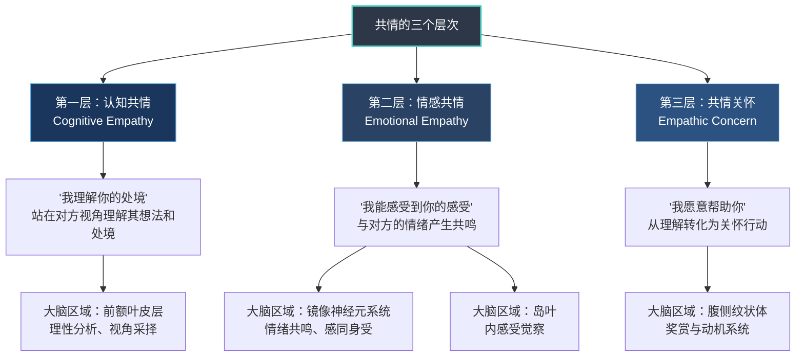
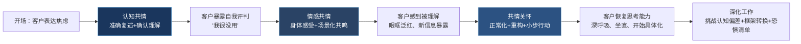

## 案例五：辅导中的共情层次应用

### 案例概述

本案例展示了一位职业教练如何运用认知共情、情感共情和共情关怀三个层次，帮助一位面临职业转型的客户穿越恐惧、重建信心、制定行动计划。这个案例的核心价值在于：共情不是一种笼统的"理解对方"，而是有层次、有策略、有节奏的专业技能。不同层次的共情在辅导的不同阶段发挥着不可替代的作用，用错层次——比如在对方需要被理解时急于给方案——反而会阻断信任的建立。

---

### 理论基础：共情的三个层次

在进入案例之前，有必要先厘清共情层次的理论框架。这一框架源于卡尔·罗杰斯（Carl Rogers）的人本主义心理学，后经丹尼尔·戈尔曼（Daniel Goleman）在情绪智力研究中进一步发展，形成三个可操作的层次：

**三者的关键区别：**

| 维度 | 认知共情 | 情感共情 | 共情关怀 |
|------|----------|----------|----------|
| 核心问题 | "你经历了什么？" | "你感受到了什么？" | "我能为你做什么？" |
| 心理机制 | 视角采择（perspective-taking） | 情绪感染（emotional contagion） | 利他动机（altruistic motivation） |
| 大脑活动 | 前额叶皮层活跃 | 镜像神经元+岛叶活跃 | 腹侧纹状体+眶额皮层活跃 |
| 典型语言 | "我理解……"、"从你的角度看……" | "我能感受到……"、"这种感觉一定……" | "我想让你知道……"、"我们可以一起……" |
| 风险 | 可能显得冷淡、分析过多 | 可能过度卷入、失去边界 | 可能越界、变成拯救者 |
| 适用情境 | 需要理性分析、专业判断时 | 需要情感连接、被看见时 | 需要行动支持、推动改变时 |

三个层次不是简单的递进关系——不是说先认知共情、再情感共情、最后共情关怀。在实际辅导中，它们是**动态切换**的：有时需要先用情感共情建立信任，再用认知共情帮助对方理清思路；有时需要在一次回应中同时运用两个层次。

---

### 案例背景

**教练：** 陈教练，拥有国际教练联盟（ICF）PCC认证，8年企业教练和职业辅导经验，擅长处理职业转型和领导力发展议题。

**客户：** 林女士，38岁，某大型互联网公司高级产品经理，从业15年，年薪约80万。丈夫是公务员，有一个8岁的女儿。林女士一直有一个创业梦想——做一个面向中年女性的健康管理平台，但迟迟无法迈出第一步。

**辅导关系：** 这是第三次辅导会谈。前两次会谈中，陈教练已经与林女士建立了基本的信任关系，了解了她的职业背景和家庭情况。林女士的"创业焦虑"在第二次会谈中已经浮现，但当时只是浅层提及，没有深入探讨。

**本次会谈目标：** 深入探索林女士对职业转型的恐惧根源，帮助她区分"合理的风险评估"和"过度的恐惧反应"。

---

### 客户的初始表达

会谈开始后，林女士主动提到了创业的话题：

> "陈教练，我上次回去之后，又想了很多。我真的想创业，这个想法已经在我心里盘旋了三年。但每次我认真开始想具体怎么做的时候，我就心跳加速，晚上翻来覆去睡不着。上周我甚至打开电脑想写商业计划书，结果盯着屏幕一个小时，一个字都写不出来。我是不是太胆小了？别人都说'想做就做'，我怎么就这么难？"

这段表达中包含了丰富的信息层次，需要教练具备足够敏锐的觉察力来捕捉。

---

### 心理分析：拆解客户表达中的多层信息

#### 情绪层面的识别

林女士的表达中至少存在三层情绪：

**表层情绪——焦虑与恐惧：** "心跳加速""睡不着""盯着屏幕一个字写不出来"——这些都是典型的焦虑躯体化症状，表明恐惧已经不仅仅停留在认知层面，而是被身体体验到的、真实的压力反应。

**中层情绪——羞耻与自我否定：** "我是不是太胆小了"——这句话的潜台词是"我应该勇敢，但我不够好"。这是一种将正常的恐惧反应病理化的自我评判。"别人都说'想做就做'"——她用一个并不存在的"别人"标准来衡量自己，暗示"正常人不会像我这样"。

**深层情绪——多重恐惧的叠加：**
- 对未知的恐惧：15年的企业经验构建了一套稳定的生活系统，创业意味着全面重建
- 对失败的恐惧：不仅损失收入，还可能损失在行业中积累的专业声誉
- 对家庭责任的恐惧：女儿正在上小学，家庭需要稳定的经济来源和她的陪伴
- 对"辜负自己"的恐惧：如果不创业，害怕到老了后悔；如果创业失败，同样后悔
- 对"失去身份"的恐惧：从"大公司高级产品经理"变成"创业小白"，身份落差带来不安全感

#### 认知层面的识别

林女士的思维中存在几个值得注意的认知模式：

**全或无思维：** 在她的描述中，创业是一个"要么做、要么不做"的二元选择，没有看到"渐进式尝试"的可能性。

**灾难化想象：** 她的焦虑来自对"最坏情况"的过度想象，而不是对"最可能情况"的理性评估。

**标签化自我：** "我太胆小了"——把一时的情绪反应等同于人格特质，从"我现在感到害怕"跳跃到"我是一个胆小的人"。

**社会比较偏差：** "别人都说'想做就做'"——她看到的是别人行动的结果，看不到别人在行动前同样经历过的恐惧和犹豫。

#### 依恋模式层面的识别

林女士在企业工作了15年，且用"稳定的工作"来定义安全感，这暗示她可能具有焦虑型依恋倾向。焦虑型依恋者的核心特征是对"被抛弃"和"失去安全基地"的高度敏感。创业对她而言不仅是职业选择，更是在心理层面"离开安全基地"——这对焦虑型依恋者来说是极其困难的。

---

### 共情层次的逐步应用

以下是陈教练在本次会谈中运用三个共情层次的完整过程，包括每个层次的具体回应、背后的策略意图、以及林女士的反应。

#### 第一阶段：认知共情——建立理解基础

**时机选择：** 会谈刚开始，林女士刚刚表达完自己的焦虑。此时她最需要的是被理解——有人能准确地"看到"她的处境，而不是急于给建议或安慰。

**陈教练的回应：**

> "林女士，我听到你说的是这样一件事：你心里有一个清晰的创业愿景，这个愿景已经存在了三年，说明它不是一时冲动。但同时，你在具体行动的时候，身体给了你非常强烈的信号——心跳加速、失眠、无法下笔。这两者之间的张力让你很困惑，你开始怀疑是不是自己'有问题'。我理解得对吗？"

**策略分析：**

这段回应做了几件关键的事：

1. **准确复述内容，但不是逐字复述。** 陈教练没有说"你说你想创业但很害怕"，而是用自己的语言重新组织了林女士的表达，让她感受到"你真的听进去了，不只是在听关键词"。

2. **确认了她的感受的合理性。** "这个愿景已经存在了三年，说明它不是一时冲动"——这句话把她的梦想从"冲动"重新定义为"经过长期酝酿的选择"，直接对冲了她的自我否定。

3. **指出了她的核心困惑。** "身体给了你非常强烈的信号"——陈教练没有说"你很害怕"（这可能让对方觉得被贴标签），而是描述了客观的身体反应，让林女士自己来确认。

4. **用"我理解得对吗"邀请确认。** 这不是谦虚，而是策略——它把判断权交给对方，避免了"你以为你理解了但其实理解错了"的风险。

**林女士的反应：**

> "对，就是这样。而且不只是害怕，我还觉得自己很没用。你看那些创业者，哪个不是雷厉风行的？就我在这里犹犹豫豫。"

认知共情成功打开了更深的对话空间。林女士不再只是描述焦虑症状，而是开始暴露更深层的自我评判。这是进入情感共情的信号——当对方开始说出"我觉得自己……"这样的句式时，说明她已经准备好在更私人的层面被看见。

#### 第二阶段：情感共情——创造情感连接

**时机选择：** 林女士说出了"我觉得自己很没用"，这是脆弱的自我暴露。如果此时陈教练用认知共情回应（"你认为自己不够果断"），会显得太冷、太分析。如果直接跳到共情关怀（"那我们来制定一个计划"），会跳过情绪处理，让林女士感到"我说了这些，但你没有真正感受到"。此时需要情感共情——让她感受到"有人能体会到我的感受"。

**陈教练的回应：**

> "我听到'很没用'这三个字的时候，心里紧了一下。你能说出这句话，需要很大的勇气。我能感受到你内心的撕裂——一方面是对这个创业梦想的强烈渴望，它在你心里活了三年，每次想到它你都会兴奋；另一方面是那种铺天盖地的恐惧，它像一堵墙一样挡在你面前。这两种力量在你身体里拉扯，消耗着你的能量。你说'心跳加速、睡不着'，我能想象那种躺在床上、脑子里翻来覆去转着各种念头、身体却怎么也放松不下来的感觉。"

**策略分析：**

1. **"心里紧了一下"——教练的情感回应。** 陈教练没有保持完全的"专业距离"，而是分享了自己在听到这句话时的真实身体感受。这向林女士传递了一个强有力的信号：你的话真正触动了我，我不是在走过场。

2. **"你能说出这句话，需要很大的勇气"——重新定义"勇敢"。** 林女士认为自己"胆小"，但陈教练指出了一个她没看到的事实：承认自己"没用"本身就是一种勇敢。这在不否定她感受的前提下，悄悄播下了一颗新的自我认知的种子。

3. **"撕裂""拉扯""消耗"——用身体隐喻描述情绪。** 这些词不是抽象的情绪标签（如"你很焦虑"），而是有身体感的描述。当一个人听到自己的内在体验被用身体语言准确描述时，会产生强烈的"被理解"感。

4. **"我能想象那种躺在床上……的感觉"——场景化共情。** 陈教练没有说"我能理解你的失眠"，而是描绘了一个具体的场景。这种场景化的共情比抽象的共情更有力量，因为它让对方感觉到"你真的在我的场景里待过"。

**林女士的反应：**

> （眼眶泛红，停顿了几秒）"你说得太对了。我每天晚上都是这样。有时候我老公问我怎么了，我都不敢跟他说。他肯定会说'稳定的工作不好吗，折腾什么'。"

情感共情的深层效应开始显现。林女士不仅在情绪上被触及（眼眶泛红），而且开始暴露新的信息层——她一直没有跟丈夫沟通这个梦想，这意味着她在面对恐惧的同时，还在独自承担"无人可说"的孤独。这个信息在认知共情阶段不会出现，只有当她感到足够安全、足够被理解时，才会说出来。

#### 第三阶段：共情关怀——从理解到行动

**时机选择：** 林女士已经充分感受到了被理解（"你说得太对了"），并且开始暴露新的信息（不敢跟丈夫说）。此时如果继续停留在情感共情层面，对话可能会陷入"反复倾诉情绪"的循环。林女士需要一个方向感——"有人理解我，而且愿意和我一起往前走"。这是共情关怀介入的最佳时机。

**陈教练的回应：**

> "我想让你知道，你今天说出来的一切——你的恐惧、你的犹豫、你觉得自己'没用'的感受——这些都不是'问题'，这些是信号。恐惧在告诉你，这件事对你非常重要；犹豫在告诉你，你是一个负责任的人，不会轻率行动；觉得自己'没用'说明你对自己有高期待。这些都是你作为一个人、一个创业者的宝贵品质，不是需要被克服的缺陷。
>
> 我也注意到你说不敢跟丈夫谈。这意味着你一直在独自承担这一切。一个人扛着三年的梦想和三年的恐惧，没有一个可以安全说出来的地方，这本身就非常消耗。今天我们先不急着做决定，先做一件事：把你的恐惧具体化。你说'害怕'，但害怕的具体是什么？是一个明确的风险，还是一团模糊的不安？只有把恐惧从'一团雾'变成'一个清单'，我们才能逐个评估和应对。你愿意试试吗？"

**策略分析：**

1. **"这些都不是'问题'，这些是信号"——情绪的正常化与重构。** 这是共情关怀中最关键的一步：不仅理解对方的感受，还帮助她重新理解这些感受的意义。恐惧不是缺陷，而是"这件事对你非常重要"的证据。

2. **逐个回应，逐一重新赋义。** 恐惧→重要性信号；犹豫→负责任；自我否定→高期待。陈教练不是在安慰（"别怕，你很勇敢"），而是在提供一个新的理解框架——这些"负面"品质其实都是正面品质的另一面。

3. **"今天先不急着做决定"——降低行动门槛。** 很多教练在这个阶段会急于推动"制定行动计划"，但这会让客户感到压力。陈教练把行动目标缩小到一个具体、安全、不涉及任何实际决策的小步骤：把恐惧具体化。

4. **"把恐惧从'一团雾'变成'一个清单'"——具象化技术。** 这个比喻非常精准。焦虑的特点就是模糊性——你不知道自己到底在怕什么，所以什么都怕。把模糊的恐惧转化为具体的条目，是打破焦虑循环的第一步。

5. **"你愿意试试吗？"——给予选择权。** 共情关怀不是"我来帮你"，而是"你愿意和我一起吗"。这保持了客户的自主性——她不是被拯救者，而是主动参与者。

**林女士的反应：**

> （深呼一口气，坐直了身体）"好，我愿意试试。我觉得……我最怕的是，如果创业失败了，我连现在的工作都回不去了。我在行业里的人脉、我的专业声誉，可能都会受影响。"

林女士的身体语言发生了显著变化——从"眼眶泛红、停顿"到"深呼一口气、坐直身体"。这表明她从"被情绪淹没"的状态切换到了"可以思考"的状态。更重要的是，她给出了第一个具体的恐惧条目：失败后的职业退路问题。这是一个可以被理性评估和应对的真实风险，而不是一团模糊的焦虑。

---

### 进一步工作：深化辅导

在三个层次的共情建立了信任基础之后，陈教练继续运用多种技术帮助林女士深入探索。

#### 技术一：正常化（Normalization）

**目的：** 消除林女士"我不正常"的自我标签。

**陈教练：**

> "在回答你刚才说的'最怕什么'之前，我想先分享一个数据。哈佛商学院的一项研究追踪了数百位创业者，发现超过70%的人在创业前经历了至少6个月到2年的'犹豫期'。亚马逊的贝佐斯在辞职创业前，他的老板劝他'不要放弃稳定的工作'，他花了好几天反复计算最坏情况。Airbnb的创始人在最初几年里，多次想要放弃。你现在的状态——恐惧、犹豫、反复权衡——不是'胆小'，而是大多数人面对重大不确定性时的正常反应。区别只在于：有些人穿越了这段犹豫期，有些人没有。穿越的关键不是'不害怕'，而是'害怕了还能继续探索'。"

**作用机制：** 正常化的心理学原理是"普遍性确认"（universalization）——当一个人发现自己的经历不是独特的、不是病态的，她的羞耻感会大幅降低，认知资源从"自我攻击"转移到"问题解决"。

#### 技术二：挑战认知偏差

**目的：** 识别并松动林女士的"全或无"思维和"标签化自我"。

**陈教练：**

> "你刚才说'别人都说想做就做'。我想请你回忆一下：在你过去15年的职业生涯中，有没有一件事情，你一开始也很害怕，但最终还是做了？"

**林女士：** "嗯……十年前，公司让我从技术岗转到产品岗。当时我也很焦虑，觉得自己不是产品思维的人。但后来还是转了，而且做得还不错。"

**陈教练：** "那次转型之前，你是什么感觉？"

**林女士：** "跟现在很像。觉得自己不行，怕搞砸了丢人。"

**陈教练：** "但你最终做了，而且做得不错。那现在的你和十年前的你，有什么本质区别吗？"

**林女士：** （沉默了一会儿）"好像没有。就是现在有家庭了，责任更重。"

**陈教练：** "所以你不是'胆小'，你是'更加负责任了'。一个不负责任的人，不会花三年时间反复思考一个决定。"

**作用机制：** 这段对话运用了"例外提问"（exception question）技术——通过找到一个与当前困境相似、但结果不同的过去经历，帮助客户看到自己的能力和韧性。同时，"责任更重"这个新框架直接替代了"胆小"这个旧标签。

#### 技术三：框架转换（Reframing）

**目的：** 改变林女士对"创业"这件事的定义框架。

**陈教练：**

> "你之前一直在想的框架是'离开稳定工作去创业'。这个框架把重点放在了'离开'——离开安全、离开稳定、离开熟悉的一切。自然会触发恐惧。但如果我们换一个框架呢？不是'离开'，而是'实验'——你不是在做一个'只许成功不许失败'的人生豪赌，你是在设计一个'低成本、低风险、可逆的实验'。你愿不愿意和我一起想一想：有没有一种方式，可以在保留现有工作的同时，用业余时间启动这个健康管理平台的最小可行版本？"

**作用机制：** 框架效应（framing effect）表明，同一个客观事实，用不同的方式描述，会导致截然不同的心理反应。"离开稳定工作去创业"是损失框架（loss frame），激活的是恐惧和回避；"低成本实验"是收益框架（gain frame），激活的是好奇和探索。陈教练不是在说服林女士创业，而是在帮她看到一种新的理解方式。

#### 技术四：恐惧具体化

**目的：** 将模糊的焦虑转化为可评估、可应对的具体条目。

**陈教练：**

> "现在我们来做一个练习。把你'害怕创业'这件事中所有的恐惧一条一条写下来，越具体越好。不用考虑它们是否合理，只管写。"

林女士在陈教练的引导下，列出了以下恐惧清单：

| 恐惧条目 | 具体程度 | 可应对性 | 最坏情况评估 |
|----------|----------|----------|--------------|
| 创业失败，损失所有积蓄 | 较具体 | 可通过财务规划控制投入上限 | 最坏：损失50万，但可通过"兼职创业"模式控制在10万以内 |
| 失去稳定的收入来源 | 具体 | 可通过保留工作+兼职创业回避 | 最坏：如果全职创业失败，重新找工作需要3-6个月 |
| 被行业内的人嘲笑 | 模糊 | 需要认知重构 | 最坏：少数人可能议论，但大多数人不会在意别人的职业选择 |
| 家人不支持 | 较具体 | 需要沟通技巧 | 最坏：需要先跟丈夫坦诚沟通，评估其真实态度 |
| 没有创业经验，不知道怎么做 | 具体 | 可通过学习和找合伙人解决 | 最坏：学习曲线陡峭，但15年产品经验是核心优势 |
| 影响陪伴女儿的时间 | 具体 | 需要时间管理规划 | 最坏：初期可能需要减少部分休闲时间，但可以通过合理安排保证亲子时间 |

**陈教练：**

> "你看看这个清单。之前你心里的'恐惧'是一团模糊的、巨大的、压倒性的东西。但现在它变成了六个具体的条目，每一个都可以被评估、被规划、被应对。哪一个你觉得最需要首先处理？"

**作用机制：** 焦虑的认知特征之一是"不确定性放大"——你不知道自己在怕什么，所以什么都怕。把模糊的恐惧具体化为清单，一方面降低了不确定性，另一方面让客户看到"这些恐惧都是可以一个一个处理的"，恢复了控制感。

---

### 辅导过程的节奏图

整个辅导过程的共情层次切换不是随意的，而是有清晰的节奏逻辑：

这个节奏的核心原则是：**跟随客户的情绪状态，而不是按照预设的流程推进。** 当客户需要被理解时，用认知或情感共情；当客户已经准备好行动时，用共情关怀。判断标准不是教练的计划，而是客户的语言和非语言信号。

---

### 共情层次的常见误用模式

在辅导实践中，教练容易犯以下几种共情层次使用错误：

| 误用模式 | 具体表现 | 后果 | 纠正方法 |
|----------|----------|------|----------|
| 认知共情过度 | 一直在"分析"对方的处境，像做案例研究 | 对方感到被当成了"研究对象"，而不是"一个人" | 在分析之后加入情感回应，如"这一定很不容易" |
| 情感共情过度 | 与对方一起哭、一起愤怒，完全卷入情绪 | 失去专业距离，变成"两个受伤的人互相倾诉" | 意识到自己的情绪反应，在合适时机回到认知层面 |
| 共情关怀前置 | 对方还没说完，就急着给建议和方案 | 对方感到"你根本没听我说完"，信任破裂 | 先确认"我已经充分理解了吗"，再提供行动建议 |
| 共情关怀越界 | 不仅给建议，还替对方做决定 | 对方的自主性被剥夺，产生依赖 | 始终用"你愿意试试吗"而非"你应该这样做" |
| 层次单一 | 整个辅导过程只用一种共情方式 | 对话单调，无法深入不同层面 | 根据客户信号主动切换层次 |
| 假共情 | 用"我理解你的感受"作为口头禅，但没有真正理解 | 对方感到敷衍，信任快速流失 | 用具体描述代替笼统回应，如"你刚才说的XX，我的理解是……" |

---

### 进阶讨论：共情与其他心理学工具的整合

共情层次不是孤立的技术，它需要与其他心理学工具配合使用，才能发挥最大效果。

#### 共情与依恋理论的整合

回到林女士的案例。前面分析到她可能具有焦虑型依恋倾向。这意味着：

- 她需要更多的**确认和安全信号**。焦虑型依恋者对"被抛弃"高度敏感，所以在辅导中，陈教练需要更频繁地确认"我和你在一起""你的感受是合理的"。
- 共情关怀中的**具体行动承诺**对她特别重要。焦虑型依恋者需要看到"有人真的会帮我"，而不只是"有人理解我"。
- 但如果林女士是**回避型依恋**，策略就要调整——回避型依恋者不喜欢被"看穿"，情感共情可能让他们感到被侵犯，需要更多的认知共情和对边界的尊重。

#### 共情与情绪智力的整合

戈尔曼的情绪智力四维模型中，"社会觉察"（social awareness）直接对应共情能力。但共情不只是"觉察"，还需要"自我觉察"（self-awareness）作为前提——教练需要先觉察自己的情绪状态，才能不把自己的情绪投射到客户身上。

陈教练在辅导前做了自我检查：他最近正在经历自己公司的一个困难决策，如果他不觉察到这一点，可能会把自己的焦虑投射到林女士身上，过度认同她的恐惧。

#### 共情与认知重构的整合

共情本身不改变思维，它只是建立信任和连接。真正的认知改变需要在共情基础上进行认知重构——帮助客户看到自己的思维模式，并提供新的理解框架。在本案例中，陈教练用"你不是胆小，你是更加负责任了"进行了一次精准的认知重构，而这个重构之所以有效，正是因为前面的三层共情已经建立了足够的信任基础。

---

### 关键学习总结

从这个案例中，可以提炼出以下核心学习点：

**1. 共情是分层次的技能，不是笼统的"善解人意"**

认知共情、情感共情、共情关怀各有其独特的功能和适用场景。一个优秀的辅导者不是"天生就会共情"，而是能够根据客户的状态灵活切换共情层次。

**2. 共情的节奏是跟随客户，而非教练主导**

判断何时使用哪个层次共情的标准是客户的语言和非语言信号，而不是教练的预设流程。当客户说"我觉得自己很没用"时，这是进入情感共情的信号；当客户说"好，我愿意试试"时，这是进入共情关怀的信号。

**3. 共情的目的不是"让对方感觉好"，而是"让对方被真正看见"**

安慰（"别怕，你能行"）和共情的区别在于：安慰是用自己的情绪替代对方的情绪，共情是让对方的情绪被准确地看到和命名。林女士需要的不是"你很勇敢"这样的安慰，而是"你的心跳加速、睡不着，这种恐惧是真实的身体反应"这样的准确看见。

**4. 共情之后必须有行动方向，否则只是"情绪按摩"**

如果陈教练在三个层次的共情之后停下来，林女士可能会感到"被理解了"，但走出辅导室后，她面对的还是同样的困境。共情关怀中的"恐惧具体化"练习给了她一个可执行的第一步，这才是共情转化为改变的关键。

**5. 共情不能替代专业判断**

在整个辅导过程中，陈教练始终保持着专业判断力——他看到了林女士的全或无思维、标签化自我、社会比较偏差，并在合适的时机通过挑战认知偏差和框架转换来干预。如果他只有共情没有专业判断，辅导就会变成"高级版的陪聊"。

**6. 教练的自我觉察是有效共情的前提**

如果陈教练没有在辅导前觉察到自己最近的情绪状态，他可能会把自己的焦虑投射到客户身上，或者因为自己的创业经历而过度给建议（"我当年就是这么做的"）。自我觉察是共情的"安全阀"，确保教练的共情是为客户服务的，而不是为自己的情绪需求服务的。

---

### 延伸思考：不同场景中的共情层次调整

本案例是职业辅导场景，但共情层次的框架在其他场景中同样适用，只是侧重点不同：

| 场景 | 认知共情的重点 | 情感共情的重点 | 共情关怀的重点 |
|------|----------------|----------------|----------------|
| 职业辅导（本案例） | 理解客户的处境和逻辑 | 感受客户的恐惧和渴望 | 引导具体化和行动 |
| 心理咨询 | 理解来访者的思维模式 | 深度共情创伤体验 | 陪伴而非指导 |
| 管理沟通 | 理解员工的工作压力 | 认可员工的情绪 | 提供资源和支持 |
| 亲密关系 | 理解伴侣的行为逻辑 | 感受伴侣的情感需求 | 主动调整自己的行为 |
| 医患沟通 | 理解患者的症状和担忧 | 适度共情但保持专业距离 | 提供清晰的治疗方案 |
| 教育场景 | 理解学生的学习困难 | 认可学生的挫败感 | 提供具体的学习策略 |

在每种场景中，三个层次的比例和节奏都不同。心理咨询需要更深的情感共情，医患沟通需要更多的认知共情，管理沟通需要更早进入共情关怀。掌握这种灵活切换的能力，是沟通心理学进阶的核心标志。
