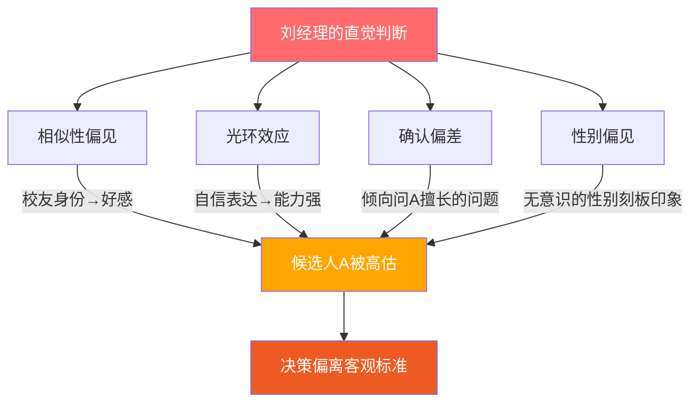
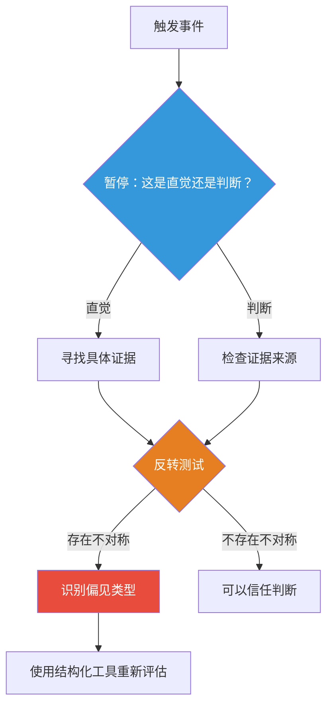

## 案例六：处理沟通中的无意识偏见

无意识偏见（Unconscious Bias）是沟通心理学中最隐蔽却影响最深远的力量之一。它不以恶意为前提——恰恰相反，偏见的"无意识"特性意味着当事人往往真诚地相信自己是客观公正的。本案例通过三个真实场景的深度剖析，展示无意识偏见如何渗透到日常沟通的各个层面，并提供一套完整的觉察、纠正与系统防范框架。

### 6.1 核心案例：招聘决策中的多重偏见叠加

#### 6.1.1 场景还原

刘经理是某科技公司的技术招聘主管，负责校招终面。两位候选人进入最终轮：

| 维度 | 候选人A | 候选人B |
|------|---------|---------|
| 性别 | 男 | 女 |
| 学校 | 985名校（与刘经理同校） | 普通一本 |
| 表达风格 | 自信、主动、善于讲故事 | 内敛、逻辑清晰、需要引导 |
| 作品集 | 中等偏上，完成度好 | 突出，有独立开源项目 |
| 实习经历 | 大厂实习3个月 | 创业公司实习6个月 |
| 面试表现 | 回答流畅，偶有夸大 | 回答扎实，有深度但节奏慢 |

面试结束后，刘经理的第一反应是："候选人A感觉更合适，他很自信，而且是校友，应该能很快融入团队。"

#### 6.1.2 偏见拆解：四重叠加效应

刘经理的"直觉"并非单一偏见作用，而是四层偏见同时叠加的结果：

**偏见一：相似性偏见（Affinity Bias）**

心理学研究表明，人类天然倾向于信任与自己相似的人。这种机制在进化上有其合理性——在原始环境中，"像我的人"更可能是同一部落成员，更值得信任。但在现代组织决策中，它会导致系统性的"克隆效应"：管理者倾向于招聘、提拔与自己背景相似的人，最终团队同质化。

刘经理与候选人A是校友这一事实，在面试开始前就已经建立了情感连接。这种连接不需要候选人做任何事——它是自动发生的，且极难被当事人意识到。

**偏见二：光环效应（Halo Effect）**

心理学家Edward Thorndike在1920年首次描述了这一现象：当我们对某人的某一特质形成正面印象时，会倾向于对其所有特质都给出正面评价。候选人A的自信表达风格被刘经理无意识地泛化为"能力强""适合团队""学习快"等全面优势判断。

光环效应的危险在于它的自我强化性——一旦形成正面光环，后续的信息处理都会被扭曲以维持这个印象。刘经理在面试后续问题中，不自觉地给候选人A更多展示空间和更友好的反馈信号。

**偏见三：确认偏差（Confirmation偏差）**

确认偏差是指人们倾向于寻找、解释和记住支持自己已有信念的信息，同时忽略或低估相反的证据。在面试场景中，这意味着面试官会无意识地：

- 向倾向的候选人提出更容易回答的问题
- 对倾向候选人的回答给予更宽容的解读
- 对倾向候选人的小失误选择性忽略
- 对不倾向候选人的优秀表现寻找"运气好""题目简单"等外部归因

刘经理在回顾自己的面试记录时发现：给候选人A的追问更多是"发挥型"问题（"你觉得这个项目最有趣的部分是什么？"），而给候选人B的追问更多是"挑战型"问题（"这个方案的性能瓶颈你怎么解决的？"）。问题的难度本身就不是公平的。

**偏见四：性别偏见（Gender Bias）**

性别偏见是最敏感也最普遍的无意识偏见之一。它不一定表现为"女性能力不如男性"这种显性歧视，而往往以更微妙的方式存在：

- 对相同行为的不同解读：男性候选人自信被视为"有领导力"，女性候选人同样自信可能被解读为"太强势"
- "文化契合"的隐性门槛：当团队以男性为主时，"文化契合"往往变成了"像我们一样"
- 对表达风格的偏好：组织文化中对"自信""主动""有气场"等特质的推崇，本质上反映了对传统男性化沟通风格的系统偏好

刘经理将候选人B的"内敛"解读为"不够自信"，却没有追问：内敛是否等同于能力不足？一个需要引导才能展开的候选人，是否可能只是在适应陌生的高压环境？

#### 6.1.3 觉察过程：从模糊感到具体识别

刘经理真正的转折点不是"意识到偏见存在"（这太抽象了），而是能够将模糊的"感觉"拆解为具体的认知过程。

**第一步：模糊感觉的具体化**

刘经理在写面试评语时遇到了困难：

> "我对候选人A的印象很好，但具体好在哪里？我写不出具体事例。对候选人B，我记得她的开源项目代码质量很高，架构设计有巧思，但我的评语里却写'沟通能力有待提升'。等等——我到底是招程序员还是招销售？"

这个发现是关键。当"印象好"无法用具体行为证据支撑时，它很可能就是偏见在起作用。真正的客观评价应该可以追溯到具体的观察事实。

**第二步：反转测试**

刘经理做了心理学中经典的"反转测试"（Reversal Test）：

1. "如果候选人A是女性，候选人B是男性，我的判断会一样吗？"——诚实的答案是：可能不会。
2. "如果候选人B也是校友，我会不会更关注她的作品优势？"——答案是：很可能会。
3. "如果候选人A的表达风格和候选人B一样内敛，我还会觉得他'适合团队'吗？"——答案是：不确定了。

反转测试的价值在于：它不能直接告诉你正确的答案，但它能有效地暴露你判断中隐含的不对称性。如果你对两个条件相同但某个人口学特征不同的案例给出不同判断，那么这个差异很可能来自偏见而非客观标准。

**第三步：结构化评估替代直觉判断**

刘经理决定抛弃"综合印象"，改用预先定义好的结构化评估表：

| 评估维度 | 权重 | 候选人A | 候选人B | 评分依据 |
|----------|------|---------|---------|----------|
| 专业技能（编码测试） | 30% | 7/10 | 9/10 | A完成但有2处逻辑漏洞；B完成且代码优雅 |
| 作品集质量 | 25% | 7/10 | 9/10 | A的作品完整但常规；B有独立开源项目，300+ star |
| 问题解决能力 | 20% | 7/10 | 8/10 | A思路清晰但深度不够；B有系统性分析框架 |
| 沟通表达 | 15% | 8/10 | 7/10 | A流畅自信；B需要引导但逻辑严密 |
| 学习潜力 | 10% | 7/10 | 8/10 | A有大厂实习；B在创业公司独立承担项目 |
| **加权总分** | 100% | **7.2** | **8.4** | — |

结构化评估的核心价值不是"打分更准确"，而是迫使评估者把判断标准从"我感觉"转化为"具体证据"。每个分数都必须附带事实依据，这大大压缩了偏见的操作空间。

**第四步：引入第二视角**

刘经理邀请了另一位技术主管独立评估两位候选人。这位主管没有校友背景，也没有见过候选人，只看作品集和编码测试结果。他的评估结果与刘经理的结构化评分高度一致，进一步确认了候选人B是更优选择。

独立评估的关键规则：
- 评估者不应知道其他人的评估结果（避免从众效应）
- 评估维度和权重应在评估前确定（避免事后调整标准）
- 评估结果应以书面形式提交，而非口头讨论（避免权威偏见）

**结果与反思**

刘经理最终选择了候选人B。入职后的跟踪数据显示：候选人B在6个月内独立完成了2个核心模块的技术重构，代码质量评分在同期新人中排名第一，1年后被提拔为小组技术负责人。

这个结果本身不能证明"选B就是对的"（反事实无法验证），但至少证明了：基于结构化评估的决策不会比直觉判断更差，而它能有效地减少偏见导致的系统性错误。

### 6.2 延展案例一：日常沟通中的隐性偏见

偏见不仅存在于招聘这种"重大决策"中，它渗透在日常沟通的每一个细节里。

#### 6.2.1 会议中的发言偏见

**场景**：某产品团队的周会，讨论新功能方案。

| 发言者 | 发言次数 | 被打断次数 | 建议被采纳率 |
|--------|----------|------------|-------------|
| 张总监（男，资深） | 8 | 0 | 75% |
| 李经理（男，中级） | 5 | 1 | 60% |
| 王工程师（女，初级） | 3 | 3 | 20% |
| 赵设计师（女，中级） | 4 | 2 | 25% |

数据揭示的模式：
- 资深男性发言最多、被打断最少、采纳率最高
- 女性成员发言机会少、被打断频繁、建议采纳率显著偏低
- 这种差异并非来自能力差距——王工程师提出的"用户分层缓存策略"在被张总监"翻译"为自己的语言后得到了团队认可

**隐性机制分析**：

这种循环被称为"放大效应"（Amplification Gap）。2016年，白宫女性工作人员曾公开使用"放大策略"——当一位女性同事的观点被忽略时，另一位女性同事会明确重复并归因："正如XX刚才说的……"。这个策略有效地打破了偏见循环。

#### 6.2.2 日常语言中的隐性偏见

**场景**：经理在不同场合对不同员工的评价用词。

| 评价对象 | 正面评价用词 | 负面评价用词 |
|----------|-------------|-------------|
| 男性员工 | "有魄力""果断""有领导力" | "需要更细心""注意细节" |
| 女性员工 | "细心""有耐心""配合度高" | "不够强势""缺乏魄力""需要更自信" |

语言分析揭示的不对称性：
- 对男性的正面评价集中在"领导力""决策力"等主动型特质
- 对女性的正面评价集中在"细心""耐心""配合"等被动型特质
- 对男性的改进建议是具体的、可操作的（"注意细节"）
- 对女性的改进建议往往是模糊的、指向性格的（"需要更自信"）

这种语言模式看似客观评价，实则在无形中设定了不同的期望标准。长期处于这种评价环境中的女性员工，可能会内化这些偏见，形成"冒名顶替综合征"（Impostor Syndrome）。

#### 6.2.3 跨文化沟通中的偏见

**场景**：中外合资企业中，中方团队与外方团队的项目讨论。

| 偏见类型 | 中方对西方式 | 西方对中式 |
|----------|------------|-----------|
| 沟通风格 | "太直接，不懂人情世故" | "太含含糊糊，不敢表达真实想法" |
| 决策方式 | "太激进，不顾后果" | "太慢，效率低" |
| 等级观念 | "对领导不够尊重" | "等级森严，不鼓励创新" |

这些偏见的本质是"文化中心主义"（Ethnocentrism）——以自己的文化规范作为评判他人行为的默认标准。当一个人说"太直接"时，他隐含的前提是"含蓄是正确的沟通方式"；当说"太慢"时，隐含的前提是"快速决策是正确的"。

### 6.3 系统性防范：建立偏见免疫机制

单靠个人觉察无法系统性地减少偏见——因为偏见的触发是自动的、快速的，而觉察需要有意识的努力。真正有效的策略是建立"偏见免疫系统"——在制度和流程层面设置检查点，让偏见即使发生也难以影响最终结果。

#### 6.3.1 个人层面：偏见觉察四步法

**第一步：暂停标记**

在做出重要判断时，训练自己识别以下信号词——它们往往是偏见在起作用的标志：

| 信号词/短语 | 偏见类型 | 潜在含义 |
|------------|---------|---------|
| "感觉不太对" | 整体偏见 | 缺乏具体证据的负面直觉 |
| "很投缘" | 相似性偏见 | 基于背景相似的偏好 |
| "气场不合" | 刻板印象 | 对陌生特质的不适感 |
| "文化不太契合" | 同质化偏好 | 倾向于选择与团队相似的人 |
| "还需要历练" | 年龄/经验偏见 | 对年轻或非传统背景的隐性排斥 |
| "她/他太XX了" | 性别/性格偏见 | 基于刻板印象的性格评价 |

**第二步：证据审查**

对每个判断追问三个问题：
1. "我有什么具体的行为证据支持这个判断？"（如果答不出来，判断很可能是偏见驱动的）
2. "这些证据是我在什么条件下收集的？"（面试的高压环境会影响候选人的表现）
3. "如果我只看到简历和作品集，没有见面，我的判断会一样吗？"（见面引入了大量偏见触发因素）

**第三步：反转测试**

系统性地改变判断对象的某一特征（性别、年龄、外貌、口音等），检查自己的判断是否改变。如果改变，说明该特征可能是偏见来源。

**第四步：结构化工具**

用预定义的评估框架替代开放式判断。详见6.3.3节。

#### 6.3.2 团队层面：偏见防火墙

**制度一：盲审机制**

在可能的情况下，移除与能力无关的人口学信息：

- 简历筛选阶段隐去姓名、照片、性别、年龄、学校名称
- 代码审查使用匿名提交
- 创意方案评审使用编号而非署名

研究数据：一项针对交响乐团招聘的研究发现，使用屏风盲听（候选人隐藏在屏风后面演奏）后，女性演奏家的入选率从不到10%上升到35%以上。

**制度二：结构化面试**

将面试从开放式聊天转变为标准化评估：

面试评估模板
━━━━━━━━━━━━━━━━━━━━━━━━━━━━━━━━
候选人编号：____  面试官：____  日期：____

模块一：专业技能（30分钟）
  Q1: [预设问题] ________________
      评分标准: A(优秀) B(良好) C(及格) D(不及格)
      评分: ___  依据: __________________

  Q2: [预设问题] ________________
      评分标准: A(优秀) B(良好) C(及格) D(不及格)
      评分: ___  依据: __________________

模块二：问题解决（20分钟）
  [统一使用案例分析题]
  评分: ___  依据: __________________

模块三：沟通能力（15分钟）
  [统一使用行为面试问题STAR格式]
  评分: ___  依据: __________________

综合评估: ___/10
是否推荐: □强烈推荐 □推荐 □待定 □不推荐
━━━━━━━━━━━━━━━━━━━━━━━━━━━━━━━━

**制度三：多元化评估小组**

重要决策（招聘、晋升、绩效评估）应由至少3人组成的评估小组完成，且小组成员应具备以下多样性：
- 不同性别
- 不同职级
- 不同部门（如可能）
- 每人独立评估后再集体讨论

讨论规则：
1. 每人先独立提交书面评估
2. 讨论时从最低职级成员开始发言（避免权威偏见）
3. 发言时必须引用具体证据
4. 最终决策需记录不同意见及理由

**制度四：定期偏见审计**

每季度对团队决策模式进行回顾性分析：

| 审计维度 | 分析内容 | 警戒线 |
|----------|---------|--------|
| 招聘通过率 | 按性别/学校/来源分析 | 某群体通过率显著偏低 |
| 晋升分布 | 按性别/年龄/入职渠道分析 | 某群体晋升周期显著更长 |
| 会议发言 | 记录发言次数/被打断次数/建议采纳率 | 某群体系统性被压制 |
| 绩效评分 | 按人口学特征分析评分分布 | 相同绩效的评分存在群体差异 |
| 离职分析 | 分析离职原因与人口学特征的关联 | 某群体离职率异常偏高 |

#### 6.3.3 工具箱：偏见检测与纠正的实用工具

**工具一：偏见自检清单**

在做出涉及他人的判断前，快速过一遍这个清单：

□ 我是否有具体的行为证据支持这个判断？
□ 我是否对所有人都使用了相同的评估标准？
□ 如果换一个人（不同性别/年龄/背景），我的判断会变吗？
□ 我是否受到了第一印象的过度影响？
□ 我是否在寻找支持我已有判断的证据（确认偏差）？
□ 我是否给了所有人同等的表达机会？
□ 我的判断中是否混入了与能力无关的因素？

**工具二：结构化评估表**

通用版本，适用于招聘、晋升、绩效、方案评审等各种场景：

评估对象：______________  评估者：______________  日期：__________

维度一：__________（权重：____%）
  评分：__/10
  事实依据：______________________________________________

维度二：__________（权重：____%）
  评分：__/10
  事实依据：______________________________________________

维度三：__________（权重：____%）
  评分：__/10
  事实依据：______________________________________________

维度四：__________（权重：____%）
  评分：__/10
  事实依据：______________________________________________

加权总分：____
结论：□强烈推荐 □推荐 □待定 □不推荐
关键优势：______________________________________________
主要风险：______________________________________________

**工具三：会议公平性监测表**

在团队会议中安排一位"公平性观察员"，记录以下数据：

会议公平性监测表
━━━━━━━━━━━━━━━━━━━━━━━━━━━━━━
会议：______________  日期：__________  观察员：__________

参与者发言统计：
  姓名A: 发言___次  被打断___次  建议被采纳___次
  姓名B: 发言___次  被打断___次  建议被采纳___次
  姓名C: 发言___次  被打断___次  建议被采纳___次
  ...

打断行为记录：
  [时间] 谁打断了谁 → 被打断者是否完成发言？ □是 □否
  ...

建议归属记录：
  建议一：最初由____提出 → 最终被归因于____
  建议二：最初由____提出 → 最终被归因于____
  ...

公平性评分（1-5）：____
观察到的偏见模式：__________________________________________
━━━━━━━━━━━━━━━━━━━━━━━━━━━━━━

**工具四：哈佛内隐联想测试（IAT）**

哈佛大学开发的内隐联想测试是目前最广泛使用的偏见测量工具。它通过测量你在不同概念之间建立关联的速度，揭示你可能意识不到的隐性偏好。

测试地址：https://implicit.harvard.edu/

可测试的偏见维度包括：
- 种族偏见
- 性别-职业偏见
- 年龄偏见
- 体重偏见
- 性取向偏见
- 宗教偏见

重要提示：IAT结果不是对你"是否是好人"的评判。它测量的是社会文化在你身上留下的自动关联模式。高偏见分数不代表你会歧视行为，低偏见分数也不代表你完全没有偏见。它的价值在于提供一个起点——了解自己的盲区，才能有针对性地训练觉察。

### 6.4 常见误区与纠正

#### 误区一："我没有偏见"

**真相**：每个人都有偏见，这是大脑的默认运作方式。否认偏见的存在本身就是最大的偏见——它让你失去了觉察和纠正的机会。认知心理学研究一致表明，即使是致力于公平的专业人士（法官、医生、教师），也会表现出显著的内隐偏见。

**纠正**：将"我没有偏见"替换为"我可能有我没意识到的偏见，我需要建立机制来检测它们"。

#### 误区二："偏见测试分数低说明我很公正"

**真相**：IAT等工具测量的是自动联想的速度，而非实际行为。一个IAT分数低的人仍然可能在特定情境下表现出偏见行为，因为偏见的触发受环境因素影响很大（压力、时间紧迫、疲劳等）。

**纠正**：将测试结果视为"起点"而非"结论"。持续建立制度性防护，而非依赖个人觉悟。

#### 误区三："只要我足够警惕就不会有偏见"

**真相**：认知资源是有限的。你不可能在每时每刻都保持高度警惕。更重要的是，过度警惕可能导致"反向偏见"——为了避免被指责有偏见而做出另一种不公平的决策。

**纠正**：个人觉察是必要的但不充分的。必须配合制度设计（结构化流程、多元化评估、定期审计）才能系统性地减少偏见的影响。

#### 误区四："偏见只影响低素质的人"

**真相**：研究发现，偏见水平与教育程度、智商或道德水平没有显著相关性。事实上，高认知能力的人可能更善于为自己的偏见找到"合理化"的解释，从而使偏见更难被识别和纠正。

**纠正**：不要用"我受过良好教育"或"我人品好"来安慰自己。偏见是人类认知的固有特性，与个人素质无关。

#### 误区五："指出偏见就是'政治正确'"

**真相**：偏见识别的目的是提高决策质量，而非达到某种政治立场。研究表明，减少偏见的团队在创新、问题解决和财务表现上都优于同质化团队。这不是道德要求，而是竞争优势。

**纠正**：将偏见觉察重新框架为"决策质量优化"而非"政治正确"。

### 6.5 进阶内容：偏见的神经科学基础

#### 6.5.1 大脑的双系统与偏见

Daniel Kahneman在《思考，快与慢》中提出的双系统理论，为理解偏见提供了神经科学基础：

| 特征 | 系统1（快思考） | 系统2（慢思考） |
|------|----------------|----------------|
| 速度 | 毫秒级 | 秒到分钟级 |
| 意识 | 无意识、自动 | 有意识、刻意 |
| 能耗 | 低 | 高 |
| 偏见 | 偏见的主要来源 | 可以纠正偏见 |
| 触发 | 自动化、基于模式匹配 | 需要主动启动 |
| 典型场景 | 快速判断陌生人是否安全 | 仔细评估候选人的简历 |

偏见之所以难以消除，是因为它们存储在系统1中——你不需要"决定"对某类人有偏见，偏见是自动触发的。系统2可以覆盖系统1的判断，但它需要消耗认知资源，而且你必须首先意识到系统1正在起作用。

#### 6.5.2 杏仁核与威胁感知

神经科学研究发现，当我们看到与自己种族/外貌不同的人时，杏仁核（大脑的威胁检测中心）会在约30毫秒内被激活。这个反应速度远快于有意识的思考——等你"意识到"的时候，杏仁核已经完成了第一轮评估。

这意味着：
- 偏见反应是"先于意识"的，你无法通过"告诉自己不要有偏见"来直接控制它
- 但长期的多元化接触可以重塑杏仁核的反应模式——这不是短期训练能完成的
- 在高压力、时间紧迫的条件下，杏仁核的影响更强——这解释了为什么紧急情况下的决策更容易受到偏见影响

#### 6.5.3 从神经可塑性看偏见改变的可能性

好消息是：大脑具有神经可塑性（Neuroplasticity）。虽然偏见的神经回路是长期形成的，但持续的、有针对性的训练可以建立新的神经连接，逐渐削弱偏见回路的自动激活。

有效的"偏见重塑"训练包括：
1. **接触效应**（Contact Hypothesis）：持续、平等、合作地与不同群体的人互动
2. **反刻板印象训练**：有意识地暴露于打破刻板印象的案例
3. **正念冥想**：增强对自动思维的觉察能力
4. **视角采择**：练习从他人视角看问题，激活共情神经回路

### 6.6 总结：从个人觉察到系统变革

处理沟通中的无意识偏见不是一次性事件，而是一个持续的、多层面的过程：

| 层面 | 目标 | 关键行动 |
|------|------|---------|
| 个人觉察 | 了解自己的偏见模式 | IAT测试、偏见日志、反转测试 |
| 个人习惯 | 建立偏见检查的自动反应 | 偏见自检清单、证据审查、暂停标记 |
| 团队制度 | 在流程中嵌入偏见防护 | 结构化评估、盲审、多元化小组 |
| 组织文化 | 创建鼓励反馈的环境 | 偏见审计、公平性监测、透明决策 |
| 长期建设 | 重塑偏见神经回路 | 多元化接触、反刻板印象训练、正念练习 |

回到刘经理的案例：他最终选择候选人B，不仅仅是因为候选人B"更优秀"——而是因为通过结构化的评估流程，他发现了自己的判断中存在系统性的偏见扭曲。如果他继续依赖直觉，他可能会错过更多优秀的候选人，同时不自知地构建一个越来越同质化的团队。

偏见不可怕，可怕的是不知道自己有偏见。觉察是改变的第一步，但只有将觉察转化为制度和习惯，才能真正实现公平而高效的沟通。

***
