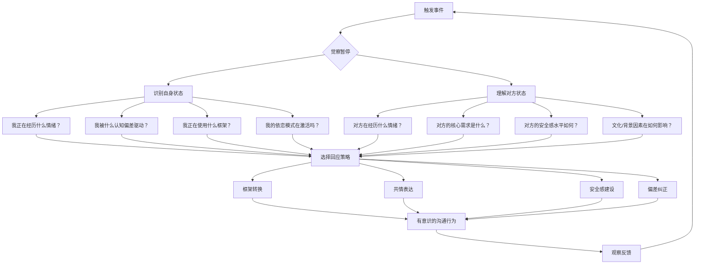

## 本节小结

六则实战案例分别从职场谈判、亲密关系、团队管理、跨文化沟通、专业辅导和招聘决策六个维度，验证了沟通心理学核心原理在真实场景中的运作机制。本节将横向串联所有案例的关键发现，提炼可迁移的通用模型，并提供自我诊断与持续精进的路径。

### 一、六大案例的核心发现

每个案例都揭示了沟通心理学中一条或多条关键规律。以下表格将六则案例的场景、核心心理学原理和关键转折点进行对照：

| 案例 | 场景 | 核心原理 | 关键转折点 |
|------|------|----------|-----------|
| 案例一 | 供应商年度谈判 | 锚定效应、框架效应、确认偏差 | 从被动接受锚点到主动设置反锚点 |
| 案例二 | 亲密关系冲突 | 依恋模式（焦虑-回避追逐循环） | 识别自动防御反应，打断恶性循环 |
| 案例三 | 团队绩效改善 | 心理安全感（Edmondson模型） | 从惩罚文化转向学习文化的制度设计 |
| 案例四 | 跨文化项目沟通 | 框架效应、文化维度理论 | 从负面损失框架切换到正面收益框架 |
| 案例五 | 职业转型辅导 | 共情的三个层次、依恋理论 | 从认知共情穿透到存在性共情 |
| 案例六 | 招聘决策 | 无意识偏见、系统1与系统2 | 用结构化流程替代直觉判断 |

这六个场景覆盖了人际沟通的全部主要领域——**利益博弈、情感连接、组织治理、文化差异、深度支持和公正决策**。它们共同指向一个核心命题：**沟通的质量取决于说话者对自身心理状态的觉察深度，以及对对方心理需求的理解精度。**

### 二、贯穿所有案例的五条主线

#### 主线一：觉察是所有改变的起点

六个案例中，每一个有效的转折都始于同一件事——**觉察**。李明觉察到自己正在接受对方设置的锚点；小雅觉察到自己的追逐行为源于依恋焦虑而非小陈的冷漠；王总监觉察到团队沉默不是能力问题而是安全感缺失；张薇觉察到"延期两周"这个说法本身就在制造负面框架；陈教练觉察到林女士的"胆小"自我评判背后是深层的存在性恐惧；刘经理觉察到自己的"直觉"实际上是多种无意识偏见的叠加。

觉察之所以是一切的起点，是因为人类沟通中绝大多数的无效行为都发生在**自动模式**下。Daniel Kahneman 在《思考，快与慢》中提出的系统1（快速、自动、情绪驱动）和系统2（缓慢、刻意、理性分析）的双系统模型，完美解释了这一现象。当系统1主导时，我们依据直觉、习惯和情绪做出反应——接受锚点、追逐或退缩、沉默或评判。只有激活系统2，我们才能跳出自动反应，做出有意识的选择。

**觉察的三个层次：**

| 层次 | 内容 | 示例 |
|------|------|------|
| 行为觉察 | 我正在做什么 | "我现在正在连续发消息催促对方" |
| 情绪觉察 | 我正在感受什么 | "我感到焦虑，这焦虑的强度与当前事件不成比例" |
| 模式觉察 | 这背后是什么心理模式 | "我每次感到被忽略时都会升级行为，这是我的依恋模式" |

大多数人在冲突中只停留在第一层。达到第三层需要长期练习，但即使只是做到第二层，也足以打断自动反应链条。

#### 主线二：框架决定对话的走向

框架效应（Framing Effect）是贯穿案例一和案例四的核心原理，但它实际上在每个案例中都在发挥作用。**同一事实，用不同的方式表述，会引发完全不同的心理反应和行为决策。**

- 案例一中，"涨价25%"是一个损失框架，激活了买方的损失厌恶心理；而"行业平均涨幅6%-8%"是一个事实锚点，重新校准了谈判基准。
- 案例四中，"项目延期两周"是损失框架；"为确保质量延长测试周期"是收益框架，同时将延期原因从"春节停工"（文化借口）转向"质量保障"（专业决策）。
- 案例二中，小雅的"你到底在干嘛"是一个指责框架，而"我三个小时没收到回复，开始担心了"是一个自我表达框架，两者的沟通效果截然不同。
- 案例五中，陈教练将林女士的"胆小"重新框架为"对15年安全基地的依恋"，将缺陷叙事转化为合理化叙事。

**框架转换的操作公式：**

原始框架（自动反应）→ 暂停 → 识别框架类型 → 选择替代框架 → 重新表述

有效框架需要满足两个条件：**真实性**（不能扭曲事实）和**建设性**（指向解决方案而非问题本身）。"为确保质量延长测试周期"之所以有效，是因为项目确实做了额外的质量检查，框架只是改变了信息的呈现顺序和强调重点。

#### 主线三：心理安全感是一切深度沟通的前提

案例三最直接地展示了心理安全感的作用，但它的影响遍布所有场景。Google 的亚里士多德项目（Project Aristotle）研究了180个团队后发现，**心理安全感是高效团队最重要的特征**，比团队成员的个人能力、团队规模或组织结构都更重要。

心理安全感不是"让所有人都感觉良好"，而是一种**团队成员可以承担人际风险而不必担心负面后果**的状态。具体包括：

- **发言安全感**：可以表达不同意见而不被惩罚（案例三中王总监的第一个改变）
- **学习安全感**：可以提问和承认不知道而不被嘲笑
- **承认错误安全感**：可以坦承失误而不被追究（案例三中的"失败复盘会"）
- **创新安全感**：可以提出不成熟的想法而不被否定

在亲密关系中（案例二），心理安全感表现为：可以表达脆弱而不被利用，可以提出需求而不被拒绝，可以承认恐惧而不被嘲笑。小雅之所以不断升级行为，根本原因是她在关系中缺乏情感安全感——她不确定小陈是否会在她需要时回应她。

在辅导关系中（案例五），心理安全感是共情得以发生的容器。林女士之所以能最终面对自己的恐惧，是因为陈教练创造了一个足够安全的空间，让她可以暴露脆弱而不会被评判。

#### 主线四：认知偏差是沟通失灵的隐形推手

六个案例中涉及的认知偏差可以归纳为一张完整的清单：

| 偏差名称 | 出现案例 | 表现 | 纠正策略 |
|----------|---------|------|---------|
| 锚定效应 | 案例一、四 | 被第一个数字/说法锁定判断 | 提前准备自己的锚点；延迟回应 |
| 确认偏差 | 案例一、六 | 只关注支持自己预判的信息 | 主动寻找反面证据；引入外部视角 |
| 框架效应 | 案例一、四 | 同一事实因表述不同产生不同判断 | 用多种框架重新表述同一事实 |
| 相似性偏见 | 案例六 | 对与自己相似的人产生好感 | 结构化评估；盲审材料 |
| 光环效应 | 案例六 | 因某一正面特质推断全面优秀 | 分维度独立评估 |
| 基本归因错误 | 案例三 | 将他人行为归因于性格而非情境 | 考虑情境因素；假设善意 |
| 损失厌恶 | 案例一、二 | 对损失的敏感度是收益的2-2.5倍 | 将损失重新框架为收益 |
| 情绪性推理 | 案例二、五 | "我感觉是这样，所以事实就是这样" | 区分感受和事实 |

认知偏差无法被"消除"——它们是大脑的进化产物，是高效处理信息的捷径。但通过**觉察→命名→暂停→替代**的四步流程，可以在偏差激活时及时拦截，将决策权从系统1移交到系统2。

#### 主线五：共情是连接的桥梁，但有层次之分

案例五最系统地展示了共情的三个层次，但每个案例都需要某种形式的共情能力：

**共情的三个层次（从浅到深）：**

1. **认知共情（Cognitive Empathy）**：理解对方在想什么、为什么这样想。这是"换位思考"的能力。案例一中，李明需要理解王总提出涨价25%的商业逻辑；案例四中，张薇需要理解美国客户对延期的真实关切。

2. **情感共情（Emotional Empathy）**：感受到对方正在经历的情绪。这不是分析对方的情绪，而是真正地"共振"。案例二中，小雅需要感受到小陈独处时的窒息感，而不仅仅是"知道"他需要空间；小陈需要感受到小雅被忽略时的恐惧，而不仅仅是"知道"她缺乏安全感。

3. **存在性共情（Existential Empathy）**：理解对方作为一个人的存在处境——他的恐惧、渴望、价值观和身份认同。案例五中，陈教练的第三层回应"这15年的工作不仅是你的收入来源，更是你身份的一部分"，触及了林女士的核心身份认同，这是认知共情和情感共情都无法到达的深度。

大多数沟通只停留在第一层。有效的日常沟通确实只需要第一层，但处理深层冲突（案例二）、支持重大决策（案例五）和建设团队信任（案例三）时，必须进入第二层甚至第三层。

### 三、从案例到模型：心理智慧沟通的整合框架

将六则案例的发现整合为一个可操作的沟通模型：

这个模型的核心是中间的**觉察暂停**——在刺激和回应之间创造一个空间，让系统2有机会介入。Viktor Frankl 说："在刺激和回应之间有一个空间。在这个空间里，我们有选择回应方式的自由和力量。" 六个案例的所有有效改变，都发生在那个空间里。

### 四、常见误区回顾

在学习和应用沟通心理学的过程中，以下误区需要特别警惕：

**误区一：将心理学技巧当作操控工具**

锚定效应、框架效应等原理确实可以被用来操控他人。但本书的核心立场是：**理解心理学是为了更有效地沟通，而不是为了操控对方。** 操控与沟通的根本区别在于意图——操控服务于单方利益，沟通服务于双方需求。案例一中李明使用反锚定策略，目的是让谈判回归公平基准，而不是欺骗供应商。

**误区二：过度分析导致沟通僵化**

学习了认知偏差和依恋理论后，有些人会在每次沟通时都进行过度分析，导致反应迟缓、表达不自然。心理学知识应该内化为直觉的一部分，而不是每次都启动一个完整的分析流程。目标是**缩短觉察到行动的时间**，而不是增加分析的步骤。

**误区三：认为改变可以一夜之间发生**

案例二中小雅和小陈的模式在两年中反复出现，不可能通过一次对话就彻底改变。依恋模式是几十年形成的，改变需要时间、练习和耐心。同样，案例三中团队文化的转变花了三个月。**真正的改变是渐进的、非线性的，会有反复和挫折。**

**误区四：忽视文化背景的影响**

案例四专门展示了文化差异对沟通的影响。在应用任何心理学原理时，都需要考虑文化维度——高语境与低语境文化、个人主义与集体主义文化、权力距离的大小——这些因素会显著影响沟通策略的有效性。

**误区五：只关注技巧而忽略真诚**

所有心理学技巧都建立在一个前提之上：**真诚**。没有真诚的共情是表演，没有真诚的框架转换是话术，没有真诚的心理安全感建设是表面功夫。技巧可以提升沟通效率，但只有真诚才能建立真正的信任。

### 五、自我诊断清单

以下清单帮助你评估自己在沟通心理学关键领域的能力水平。对每项进行1-5分自评（1=完全不具备，5=高度熟练），找到最需要提升的领域。

| 能力项 | 自评(1-5) | 对应案例 |
|--------|----------|---------|
| 识别自身认知偏差 | ___ | 案例一、六 |
| 在冲突中按下暂停键 | ___ | 案例二 |
| 根据情境调整沟通框架 | ___ | 案例一、四 |
| 在关系中表达脆弱 | ___ | 案例二 |
| 建设团队心理安全感 | ___ | 案例三 |
| 进行跨文化敏感沟通 | ___ | 案例四 |
| 运用多层次共情 | ___ | 案例五 |
| 识别和纠正无意识偏见 | ___ | 案例六 |
| 将系统2思维融入日常沟通 | ___ | 全部案例 |
| 持续反思和迭代沟通方式 | ___ | 全部案例 |

得分最低的2-3项就是你接下来的学习重点。建议从一个最迫切的场景（比如职场谈判或亲密关系）入手，选择一个具体技巧反复练习，而不是同时追求所有能力的提升。

### 六、持续精进路径

沟通心理学的学习不是一次性的知识获取，而是一个持续的实践-反思循环。以下是分阶段的成长路径：

**第一阶段：觉察建立期（1-4周）**

- 每天记录一次"沟通日志"：今天哪次沟通最成功/最失败？当时我的情绪是什么？我可能被什么偏差驱动？
- 开始练习"三秒暂停"：在回应前给自己三秒钟，觉察此刻的内心状态
- 阅读本章理论基础部分，建立知识框架

**第二阶段：技巧练习期（1-3个月）**

- 每周选择一个具体技巧进行刻意练习（如框架转换、认知共情）
- 在低风险场景中练习（与朋友、家人的日常对话）
- 每周回顾：这周我在哪个场景中成功应用了心理学原理？哪个场景中失败了？为什么？

**第三阶段：模式突破期（3-6个月）**

- 开始在高风险场景中应用（工作谈判、冲突调解）
- 识别自己的"默认模式"——在压力下你最常退回的行为模式是什么
- 寻求反馈：请信任的人告诉你，你的沟通方式在这段时间有什么变化

**第四阶段：内化整合期（6个月以上）**

- 心理学知识从"需要刻意调用"变为"自然流露"
- 能够在复杂场景中灵活组合多种原理
- 开始帮助他人提升沟通能力（教是最好的学）

### 七、本节核心要点回顾

经过六个实战案例的深入分析，以下是最核心的五条原则：

1. **觉察是改变的第一步**：所有有效的沟通改变都始于对自身心理状态的觉察。在刺激和回应之间创造一个暂停的空间，将决策权从自动模式（系统1）移交给有意识模式（系统2），是提升沟通质量的根本起点。

2. **技巧需要灵活应用**：认知偏差纠正、框架转换、共情表达、安全感建设——这些工具没有一个是万能的。有效的沟通者根据场景的性质（利益博弈还是情感支持）、对方的状态（防御还是开放）和文化背景（高语境还是低语境）灵活选择和组合策略。

3. **心理安全是深度沟通的基础**：无论是团队中的创新讨论、亲密关系中的脆弱表达，还是辅导中的自我探索，都需要一个足够安全的环境。没有安全感，防御机制会接管一切，真正的沟通无法发生。

4. **共情是连接的桥梁，但需要穿透到足够深**：停留在认知层面的共情（"我理解你的处境"）只能打开对话，情感层面的共情（"我能感受到你的恐惧"）才能建立连接，存在性层面的共情（"你的恐惧源于你对身份认同的保护"）才能促成真正的转变。

5. **持续反思将知识转化为智慧**：每次沟通都是一个实验。成功的沟通告诉你什么策略有效，失败的沟通告诉你什么模式需要改变。关键不是追求完美的沟通，而是建立一个持续观察、反思和迭代的循环。

这五条原则不是彼此独立的——它们是一个整体系统的五个面向。觉察让你看到自己的模式，技巧给你替代选择，安全感提供练习的空间，共情确保你不会迷失在技术中，而持续反思让你的成长永不停止。
