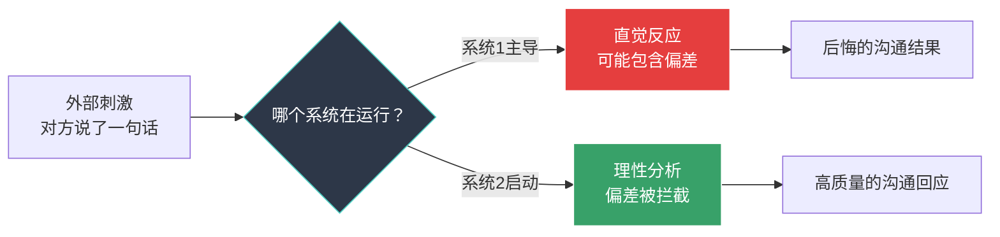

## 一、认知偏差觉察技巧

认知偏差是大脑为了节省能量而走的"捷径"。在沟通中，这些捷径让我们误读对方意图、做出冲动判断、固守错误立场。理论基础部分已经解释了偏差的成因和机制——本节聚焦于**实战层面**：如何在对话进行的同时，实时觉察自己是否正被偏差裹挟，以及一旦觉察后如何纠正。

### 1.1 觉察的前提：理解系统1与系统2的切换

所有认知偏差都有一个共同的"帮凶"——**系统1思维**。系统1是大脑的自动挡，负责快速、直觉、无意识的反应。它高效但容易出错。系统2是手动挡，负责缓慢、理性、有意识的分析。它准确但消耗精力。

沟通中的大多数偏差，发生在系统1接管而系统2"睡着了"的瞬间。因此，觉察技巧的核心目标只有一个：**在关键时刻把系统2叫醒**。

**关键判断信号**——当你发现自己有以下感受时，大概率是系统1在主导：

- "我立刻就知道……"（过于自信的直觉）
- "他肯定是……"（快速归因）
- "这还用想吗？"（拒绝深入分析）
- "我就是觉得不舒服"（情绪先行，原因未知）
- 心跳加速、肌肉紧绷、语速变快（身体进入应激状态）

### 1.2 STOP技巧：沟通中的"紧急制动"

这是最基础也最实用的偏差觉察工具。它不需要任何心理学知识，只需要你在关键时刻做一个动作——**停下来**。

#### 四步操作详解

**S — Stop（停止）**

在做出反应前，有意识地按下"暂停键"。这个"暂停"可以是物理动作：

- 喝一口水（给自己3-5秒）
- 把笔放下再拿起（中断自动化动作）
- 身体微微后仰（创造物理距离感）
- 说"让我想一下"（向对方发出思考信号）

**关键原则**：暂停不需要很长时间。研究表明，即使只延迟2-3秒，系统2就能被部分激活，足以拦截最冲动的反应。

**T — Take a breath（深呼吸）**

通过一次深呼吸激活副交感神经系统。具体操作：

- 用鼻子吸气4秒
- 屏住2秒
- 用嘴呼气6秒
- 关注呼气时身体放松的感觉

这不是玄学。深呼吸直接降低杏仁核（大脑的情绪报警器）的激活水平，减少皮质醇分泌。2018年哈佛医学院的一项实验显示，仅仅6次深呼吸就能将唾液皮质醇水平降低约15%。

**O — Observe（观察）**

观察三个维度：

| 观察维度 | 关注内容 | 内心独白示例 |
|----------|----------|-------------|
| 身体感受 | 肩膀是否紧绷？胃是否收紧？手是否握拳？ | "我的肩膀在发紧，这说明我在紧张或愤怒" |
| 情绪状态 | 现在主导的情绪是什么？强度如何？ | "我感到被冒犯，愤怒程度大概7/10" |
| 思维内容 | 我的脑子里在想什么？有哪些判断正在形成？ | "我在想'他总是这样'——等等，'总是'是绝对化思维" |

**P — Proceed（继续）**

基于观察结果，选择一个更理性的回应方式：

- 如果情绪强度>7/10：先处理情绪，可以说"我需要一分钟整理思路"
- 如果发现绝对化思维：用"有时候""这次"替代"总是""从来"
- 如果发现自己在做归因：增加"也可能是因为……"的备选解释
- 如果一切清晰：直接回应，但语气比直觉反应温和20%

#### 应用场景演示

> **情境**：你在会议上提出方案后，同事立即提出反对意见。
>
> **系统1反应（未使用STOP）**：感到被攻击，准备反驳："你总是反对我的想法！"
>
> **使用STOP后的系统2反应**：
> - **S（停止）**：拿起杯子喝水，不立即反驳
> - **T（深呼吸）**：一次深呼吸，肩膀放松下来
> - **O（观察）**：我感到沮丧（情绪），"总是反对"是绝对化思维（思维偏差——确认偏差+基本归因错误），我只记住了他反对我的几次，忽略了他支持我的时候
> - **P（继续）**："谢谢你的反馈，能具体说说你担心的是什么吗？"（将对抗转化为探索）

#### STOP的局限与升级

STOP技巧在以下场景效果最好：一对一沟通、会议发言、文字消息发送前。但面对快速交锋的多人讨论或情绪高度激烈的冲突，STOP的"暂停"动作可能不够——你需要更快的觉察工具。这就是接下来的PAUSE框架。

### 1.3 PAUSE框架：系统化的偏差扫描

PAUSE是STOP的升级版，适合在重要沟通决策前（而非每一句话前）使用。它是一套结构化的自检清单，帮你系统地扫描可能影响判断的偏差。

| 步骤 | 含义 | 检查问题 |
|------|------|----------|
| **P — Perspective（视角）** | 我是否只从一个角度看问题？ | "如果我是对方，我会怎么理解这件事？" |
| **A — Assumption（假设）** | 我做了哪些未验证的假设？ | "我的判断建立在哪些假设上？这些假设都有证据支持吗？" |
| **U — Utility（效用）** | 我的反应对解决问题有帮助吗？ | "如果我按第一反应行动，3小时后我会后悔吗？" |
| **S — Source（来源）** | 我的信息来源可靠吗？ | "我是亲眼所见，还是听别人转述的？" |
| **E — Evidence（证据）** | 我有没有忽略反面证据？ | "有哪些信息和我的判断矛盾？我为什么忽略了它们？" |

**使用方法**：在做重要沟通决策前（比如是否要和某人摊牌、如何回应一封邮件、在谈判中下一步怎么走），用PAUSE的五个问题快速扫描一遍。不需要每次都回答全部五个——根据情境选择最相关的2-3个即可。

**实际操作建议**：将PAUSE五个问题写在便签纸上，贴在电脑显示器旁边。前两周每次做重要沟通决策前看一眼。两周后它会变成你思维的一部分，不再需要外部提示。

### 1.4 确认偏差觉察：打破"我就是对的"幻觉

确认偏差是最常见、危害最大的认知偏差。它的可怕之处在于：你越是聪明、越是经验丰富，就越擅长为自己的偏见找到"证据"。以下是四种觉察和应对方法。

#### 方法一：魔鬼代言人法

在做出重要判断前，强制自己为相反的观点辩护。

**操作步骤**：

1. 写下你的结论："我认为方案A比方案B好"
2. 设定计时器5分钟
3. 在这5分钟内，你是方案B的坚定支持者，列出所有方案B优于方案A的理由
4. 回到自己的立场，重新评估

**为什么有效**：这不是要你改变主意。研究表明，仅仅是"尝试为对立面辩护"这个动作，就能激活系统2思维，显著降低确认偏差的强度。2015年《实验社会心理学杂志》的研究发现，被要求考虑反面观点的参与者，其判断的准确率比对照组高出约30%。

#### 方法二：事前验尸法（Pre-mortem）

这是心理学家加里·克莱因提出的经典方法。在做决定前，假设"这个决定已经失败了"，然后回溯原因。

**操作模板**：

假设：我决定和供应商X签约

事前验尸：假设6个月后，这个决定被证明是错误的。
失败原因可能包括：
1. 我只看了X提供的成功案例，没有查他们失败的项目
2. 我对X的销售代表有好感（光环效应），影响了判断
3. 我忽略了同事Y提出的担忧
4. 市场环境可能在6个月内发生变化

修正行动：
- 联系X的3个前客户了解真实体验
- 让Y详细阐述他的担忧，不打断
- 评估最坏情境下的退出成本

#### 方法三：反向信息搜索

在搜索信息时，刻意搜索与自己观点相反的内容。

**具体做法**：

- 如果你认为"远程办公效率更高"，主动搜索"远程办公的效率问题"
- 如果你觉得"这个候选人不错"，列出3个"不该录用他的理由"
- 如果你准备和老板提加薪，先想想"老板可能拒绝的理由有哪些"

**日常练习**：每周选一个你深信不疑的观点，花15分钟寻找反对它的证据。不必改变立场，但这个习惯能训练大脑接受"我可能是错的"这个可能性。

#### 方法四：区分事实与解读

确认偏差最隐蔽的表现形式是：把"我对事实的解读"当成"事实本身"。

| 事实 | 常见解读（可能有偏差） | 更客观的描述 |
|------|----------------------|-------------|
| 对方在对话中看了一下手机 | "他不尊重我" | "他看了一下手机，原因未知" |
| 会议上没人发言 | "大家都同意我的方案" | "目前还没有人表达意见，可能是同意，也可能是有顾虑但没说" |
| 同事发了一条简短的回复 | "他生气了" | "他的回复比平时短，可能忙，可能不满，需要更多信息才能判断" |
| 客户说"再考虑一下" | "他在拒绝我" | "客户需要更多时间，具体原因待确认" |

**训练方法**：每天选择一次沟通经历，用两列写下"我观察到的事实"和"我做的解读"。坚持两周，你会发现自己每天至少做了3-5次未经验证的解读。

### 1.5 锚定效应觉察：识别并打破"第一个数字"

锚定效应在谈判、薪资讨论、价格协商中尤为明显。第一个出现的数字（哪怕与事实无关）会像磁铁一样吸引后续的所有判断。

#### 识别锚点

在对话中出现以下信号时，锚定效应可能正在起作用：

- **对方率先抛出数字**："这个项目的预算是50万"——无论这个数字是否合理，它已经成了对话的基准
- **第一个印象过于强烈**：第一次见面时对方的某个特征（口音、穿着、毕业院校）过度影响了你对其能力的判断
- **极端提议**：对方提出了一个明显不合理的要求——即使你拒绝了，你的心理预期也已经被拉向了那个方向
- **历史数据**："去年我们花了100万做类似的事"——去年的数字未必适用于今年

#### 打破锚定的五个策略

**策略一：主动设锚**

不要让对方先出牌。在谈判中，先提出自己认为合理的数字，把对话基准设定在对你有利的位置。2020年一项针对薪资谈判的研究显示，先提数字的一方平均获得比"等对方先开价"的一方高8-12%的结果。

**策略二：重新锚定**

当对方已经设定了锚点，你需要一个"替代锚"来打破它的影响。方法是引入一个完全不同的参考框架。

> **情境**：供应商报价100万。
>
> **被锚定的反应**："能不能便宜点？80万行不行？"（你的还价已经被100万拉高了）
>
> **重新锚定的回应**："根据我们对市场三家供应商的调研，这类项目的行业均价在55-65万之间。能帮我理解一下你方报价的构成吗？"（用行业数据覆盖对方的单点锚定）

**策略三：多角度评估**

不要在单一维度上做判断。强迫自己从至少三个独立角度评估问题：

- 从成本角度：这个价格合理吗？
- 从价值角度：我能获得多少回报？
- 从替代方案角度：有没有更便宜/更好的选择？
- 从时间角度：如果不急，等待会更好吗？

**策略四：反事实思维**

问自己："如果第一个出现的数字不是X而是Y，我的判断会不同吗？"如果答案是"会"，说明你当前的判断受到了锚定的影响。

**策略五：延迟决策**

锚定效应在信息首次出现时最强，随时间推移逐渐减弱。如果可能，在重大谈判或决策中安排"冷却期"——"我需要回去考虑一下，明天给你答复"。24小时的间隔足以让锚定效应衰减约40%。

### 1.6 光环效应觉察：撕掉"完美"和"糟糕"的标签

光环效应让我们因为一个突出特征（好或坏）而扭曲对一个人的整体评价。它的反面叫"角效应"（Horn Effect）——因为一个负面特征而全面否定一个人。

#### 光环效应的常见触发器

| 触发类型 | 具体表现 | 你在想什么 | 实际情况 |
|----------|----------|-----------|----------|
| 外貌光环 | 对方外表出众 | "这个人看起来很专业" | 外貌与专业能力无关 |
| 学历光环 | 毕业于名校 | "名校出来的肯定厉害" | 学校品牌≠个人能力 |
| 职位光环 | 对方是高管 | "高管说的话肯定有道理" | 高管也会犯错，也有知识盲区 |
| 相似性光环 | 对方和你同乡/同校/同爱好 | "这个人很靠谱" | 相似性制造亲近感，但不等于能力 |
| 语言光环 | 对方口才好、会讲故事 | "他说的很有道理" | 说话好听≠内容正确 |
| 权威光环 | 对方引用了专家/数据 | "有数据支持，肯定对" | 数据可以被选择性引用 |

#### 觉察方法

**方法一：分离评估维度**

当你需要评价一个人或一个方案时，分别在不同维度上独立打分，避免"一好百好"的思维滑坡。

评估模板：
方案提出人：张三
- 方案本身的逻辑性：8/10
- 数据支撑的充分性：5/10
- 可执行性：7/10
- 风险评估的完整性：4/10
- 我对提出者的好感度：9/10 ← 注意！这个分数不应影响上面的评分

**方法二：延迟第一印象**

提醒自己：第一印象形成的判断，在获得足够信息之前不应被当作结论。具体做法是给自己设定一个"信息收集期"——比如"在和这个人合作满两周之前，我不下定论"。

**方法三：寻找反面证据**

当你对某人形成强烈正面印象时，问自己："他有什么缺点或不足？"当你对某人形成强烈负面印象时，问自己："他有什么优点或做得好的地方？"这个简单的对冲提问，能有效削弱光环效应的影响。

### 1.7 基本归因错误觉察：从"他就是这样的人"到"可能有其他原因"

基本归因错误让我们在解释他人行为时，过度强调性格因素，而忽略情境因素。它是沟通冲突的头号制造者——因为一旦你给对方贴上"人品有问题""能力不行""不负责任"的标签，你就关闭了理解对方的通道。

#### 三步归因校正法

**第一步：识别自动归因**

当对方做了一件让你不舒服的事时，注意你脑子里冒出的第一个解释。它通常是一个人格标签：

- "他就是自私"（而不是"他可能压力很大"）
- "她不专业"（而不是"她可能信息不足"）
- "他不尊重我"（而不是"他可能习惯不同"）

**第二步：生成备选解释**

强迫自己列出至少两个替代性的、与人格无关的解释：

| 观察到的行为 | 自动归因（人格标签） | 备选解释1（情境因素） | 备选解释2（其他因素） |
|-------------|--------------------|--------------------|--------------------|
| 同事开会迟到 | 不守时、不尊重人 | 地铁故障/孩子生病 | 他以为会议是另一个时间 |
| 伴侣没回消息 | 不在乎我 | 手机没电/在开会 | 消息被其他消息淹没了 |
| 老板语气严厉 | 脾气差、针对我 | 他刚被上级批评 | 他以为这个错误是重复犯的 |
| 客户反复改需求 | 没主见、不专业 | 他的领导改了方向 | 他之前的沟通没有表达清楚 |

**第三步：选择最可能的解释**

不要急于下结论。如果不确定，可以直接询问：

- "我注意到你今天到得比较晚，一切都好吗？"（而不是"你怎么又迟到了"）
- "我感觉你对这个方案有些顾虑，能说说你的想法吗？"（而不是"你总是否定我的方案"）

这种表达方式同时完成了两件事：给对方解释的机会，以及避免你在错误归因的基础上做出对抗性反应。

#### 自我归因觉察

基本归因错误也有"对内"的一面——**自我服务偏差**。当事情成功时，我们归因于自己的能力；当事情失败时，我们归因于外部环境。这种不对称会让我们高估自己的贡献，低估他人的付出。

**觉察问题**：

- "这个项目成功了，我真的贡献了那么多吗？还是有运气/团队/时机的因素？"
- "这件事搞砸了，我真的没有责任吗？哪怕只有一小部分？"
- "如果换一个人做我的角色，结果会不同吗？"

### 1.8 可得性偏差觉察：警惕"容易想到的"不等于"重要的"

可得性偏差让我们过度依赖容易回忆的信息来做判断。在沟通中，它的表现是：最近发生的事、印象强烈的事、情绪色彩浓的事，会被过度赋予权重。

**典型场景**：

- 你记得同事上个月犯的那次大错（印象深刻），但忘了他这三个月做的20件好事（不够突出）
- 你看到一条飞机失事新闻（情绪冲击），就觉得飞机不安全，而忽略了统计数据表明飞行比驾车安全得多
- 你最近一次和某人沟通不愉快（记忆新鲜），就认为"和他总是聊不来"

**觉察方法**：

1. **时间拉远**："如果这件事发生在一年前，我还会这么在意吗？"
2. **频率检查**："类似的事发生过多少次？我记住的是少数极端案例还是全貌？"
3. **数据对冲**："我的感觉和统计数据一致吗？还是我的感觉只基于几个印象深刻的例子？"
4. **样本多样性**："我接触的信息来源是否足够多元？还是我只看到了让我印象深刻的那一面？"

### 1.9 沉没成本觉察：别因为"已经投入了"而继续错误

沉没成本偏差让我们因为已经投入了时间、精力或金钱，而不愿意放弃一个明显不值得继续的方向。在沟通中的典型表现：

- "我们已经讨论了两个小时了，总得有个结果吧"——于是接受了一个糟糕的妥协
- "我已经和他的关系经营了这么久，不能现在撕破脸"——于是继续忍受不合理的对待
- "这个方案我已经改了五版了，不能白费"——即使明知方向错了也不愿换

**觉察问题**：

- "如果我今天刚开始面对这个情况，没有任何已投入的成本，我会做同样的选择吗？"
- "我是在为未来创造价值，还是在为过去买单？"
- "继续投入的边际收益是多少？有没有收益更高的替代方案？"

### 1.10 框架效应觉察：同一事实，不同说法

框架效应说明，信息的呈现方式（正面框架 vs 负面框架）会显著影响判断。在沟通中，你既是框架效应的"接收者"也是"施加者"。觉察框架效应需要从两个方向入手。

**作为接收者**——当对方用特定框架描述信息时，主动"换框"思考：

> 对方说："这个方案有90%的成功率。"
>
> 换框思考："也就是说有10%的失败率。如果失败了，后果是什么？"

> 对方说："不买这个保险，你将损失50万。"
>
> 换框思考："买了这个保险，我每年要付出多少？如果不发生事故，这笔钱的机会成本是什么？"

**作为发送者**——注意自己是否在无意中用特定框架来操纵对方：

- "只剩最后3个名额了" vs "我们还有3个名额"（紧迫感框架 vs 中性框架）
- "这个产品能让效率提升30%" vs "使用这个产品可以节省30%的时间"（同样的数据，不同的关注点）

觉察框架效应的核心技能是**语言解码**：把任何框架性的表述还原为中性的事实描述，然后基于事实做出判断。

### 1.11 群体偏差觉察：从众压力与群体极化

在多人沟通场景中，额外的偏差力量开始起作用。

#### 从众效应

当多数人持同一观点时，个体会不自觉地向多数意见靠拢。在会议中的典型表现：

- "大家都觉得方案A好，那方案A应该确实好"——但可能其他人也在看别人的脸色
- 沉默的螺旋：持少数意见的人因为害怕被孤立而选择沉默，导致多数意见看起来比实际上更一致

**觉察方法**：

- 在集体讨论前，先独立写下自己的观点，避免被他人意见污染
- 作为会议主持人，先征求最junior成员的意见，再让senior成员发言
- 注意区分"真共识"和"假共识"——如果一个决定没人反对，不代表所有人都同意，可能只是没人敢反对

#### 群体极化

讨论后的群体决策往往比讨论前的个人观点更极端——要么更冒险（风险转移），要么更保守。这意味着群体讨论不总是带来"中和"，反而可能放大偏差。

**觉察方法**：

- 在群体讨论后检查："我们的结论是不是比任何一个人最初的想法都更极端？"
- 指定一个人扮演"反对派"角色，专门挑战群体结论
- 采用"德尔菲法"——匿名收集意见，汇总后分享，再次匿名收集，逐步收敛

### 1.12 偏差觉察的训练计划

知道了偏差不等于能觉察到偏差。觉察是一种需要刻意训练的技能。以下是经过验证的训练方案。

#### 第一阶段：意识建立（第1-2周）

**目标**：让偏差从"隐形"变为"可见"。

**每日练习**：

1. 每天晚上回顾当天的3次重要沟通
2. 对每次沟通问自己："我在那次对话中可能受到了哪种偏差的影响？"
3. 用一个简单的表格记录

日期：2026-06-25
沟通1：和同事讨论项目进度
- 可能的偏差：基本归因错误（觉得他拖延是因为态度问题）
- 实际可能的原因：他的任务优先级被调整了
- 觉察时机：事后回顾时才发现

#### 第二阶段：实时觉察（第3-4周）

**目标**：从事后觉察到事中觉察。

**每日练习**：

1. 每天选1次重要沟通，提前设定"偏差警觉"——"这次对话我要注意确认偏差"
2. 在对话中，每当感觉到自己的判断"太确定了"时，触发STOP
3. 每天记录1次"差点被偏差带走"的经历

#### 第三阶段：自动觉察（第5-8周）

**目标**：让偏差觉察成为无意识的习惯。

**持续练习**：

1. 每周做一次PAUSE框架扫描（用于重要决策）
2. 每月回顾偏差日志，统计自己最常见的偏差类型
3. 针对最常见的偏差，设计个性化的觉察信号（比如：每次你想说"总是"或"从来"时，就是一个偏差信号）

#### 训练效果的评估指标

| 指标 | 衡量方法 | 达标标准 |
|------|----------|----------|
| 觉察频率 | 每周记录的偏差觉察次数 | 从每周1-2次增加到每周5次以上 |
| 觉察时机 | 从事后→事中→事前 | 8周后50%以上的觉察发生在事中或事前 |
| 行为改变 | STOP实际使用的次数 | 每周至少3次在沟通中使用STOP |
| 判断质量 | 回顾过去决策的准确率 | 主观感受：决策后悔次数明显减少 |

### 1.13 环境设计：让觉察更容易发生

依赖意志力来对抗偏差是不可靠的。更聪明的方法是**改变环境**，让正确的做法变成默认做法。

**物理环境设计**：

- 在办公桌上放一个"STOP"提示卡，每次看到它就扫描一下当前的思维状态
- 在电脑桌面上设一个每小时弹出的提醒："你现在在做假设吗？"
- 把PAUSE清单写在会议笔记本的第一页

**社交环境设计**：

- 找一个"偏差觉察伙伴"——你们互相提醒对方的偏差（方式要温和："你刚才那个判断，有没有考虑过另一种可能？"）
- 在团队中建立"魔鬼代言人"制度——每次重大决策都必须有人扮演反对者
- 在会议议程中加入"假设检查"环节——花5分钟讨论"我们做了哪些假设？"

**数字环境设计**：

- 在发送重要邮件前，设一个30分钟的延迟发送规则
- 在社交媒体上看到让你愤怒的内容时，强制自己等1小时再回复
- 在做出重要沟通决策前，用PAUSE清单（可以做成手机备忘录模板）

### 1.14 常见错误与纠正

在学习和应用偏差觉察技巧的过程中，很多人会掉入以下陷阱：

**错误一：偏差猎巫——到处找偏差**

学习了认知偏差后，开始在自己的每一次判断中寻找偏差，结果陷入"过度自我怀疑"，丧失了决策的果断性。

**纠正**：偏差觉察的目标不是消除所有偏差（这是不可能的），而是在**高风险、低反馈**的关键决策中多一层保护。日常小事（午餐吃什么、穿哪件衣服）不需要启动偏差扫描。

**错误二：只对别人用——我是客观的那一个**

最容易犯的偏差之一是"偏差盲点"——认为自己比别人更少受到偏差影响。研究表明，大多数人认为自己比平均水平更客观、更公正——这本身就是一个认知偏差。

**纠正**：先对自己的判断保持怀疑，再去分析别人的偏差。觉察偏差的第一条原则是："我也不免疫。"

**错误三：知道了就等于做到了**

读了一本关于认知偏差的书，感觉自己已经"掌握"了。但知道锚定效应的定义和在真实谈判中觉察到锚定效应正在影响自己，是完全不同的两件事。

**纠正**：从本节的训练计划开始，用8周时间把知识转化为习惯。觉察是一种技能，不是一种知识——它需要练习。

**错误四：用偏差术语攻击别人**

学了心理学概念后，在争吵中说"你这是确认偏差"或"你犯了基本归因错误"。这不是觉察，这是武器化。

**纠正**：偏差觉察是**自我工具**，不是批评他人的武器。你可以用偏差知识来理解对方为什么会这样说，但不要用术语来否定对方的感受。

### 1.15 进阶：建立个人偏差画像

经过数周的偏差觉察训练后，你会发现自己有特定的"偏差倾向"——某些偏差你很少犯，而另一些反复出现。这就是你的**个人偏差画像**。

**建立画像的方法**：

1. 回顾过去4周的偏差日志
2. 统计每种偏差出现的频率
3. 分析触发场景——什么类型的情境最容易激活你的特定偏差

**示例**：

个人偏差画像（示例）
最常犯的偏差：
1. 基本归因错误（占所有记录的35%）——在团队协作中尤其明显
2. 确认偏差（占28%）——在技术决策中最突出
3. 光环效应（占20%）——对口才好的人容易过度信任

触发场景分析：
- 基本归因错误多发生在：任务延期、质量不达标、沟通不及时
- 确认偏差多发生在：技术选型、方案评估、复盘分析
- 光环效应多发生在：面试新人、选择合作伙伴、听演讲

个性化觉察策略：
- 在任务延期时，第一反应问"有什么外部因素？"而不是"他的态度有问题？"
- 在技术决策前，强制做一次"魔鬼代言人"练习
- 在评估人时，把"口才好"单独列为一个因素，不让它影响其他维度的评分

持续更新你的偏差画像，每4周回顾一次。随着训练的深入，你会发现自己最常犯的偏差类型在变化——这本身就是成长的证据。
