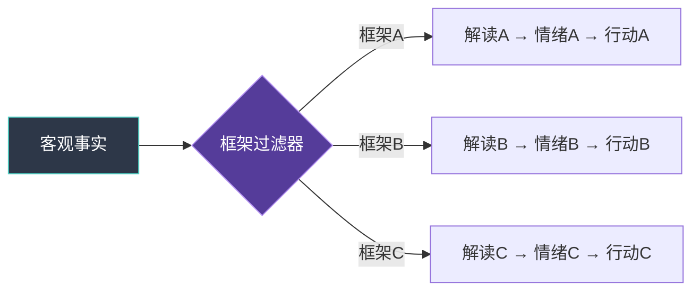
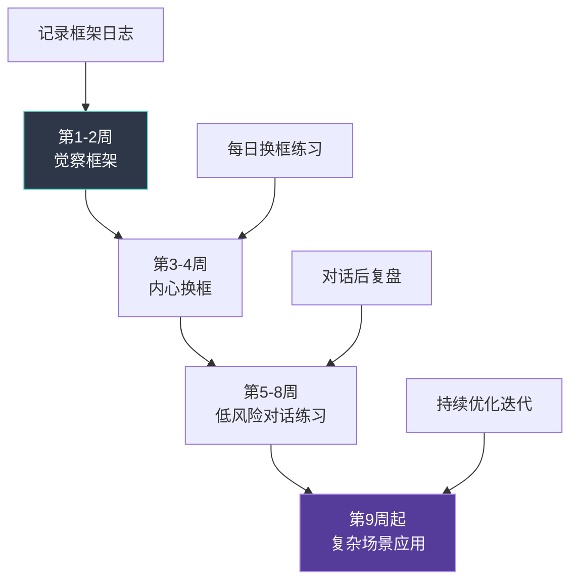

## 二、框架转换技巧

框架转换（Reframing）是沟通心理学中最具实战价值的技巧之一。它的核心思想是：**事实本身不会改变，但人对事实的反应取决于他所处的解读框架**。同一份季度业绩下滑的报告，如果被框架为"危机"，团队会恐慌；如果被框架为"战略调整的信号"，团队会思考。掌握框架转换技巧，意味着你能在不篡改事实的前提下，改变对话的情绪基调、行动方向和最终结果。

### 2.1 什么是框架转换

#### 2.1.1 概念定义

框架转换，又称重新框架（Reframing），是指在不改变客观事实的前提下，通过改变信息的呈现角度、语境或参照系，引导对方（或自己）获得不同解读和情感体验的沟通技术。

这一概念源于多个心理学流派的交汇：

- **认知行为疗法（CBT）**：Aaron Beck 提出的认知模型认为，人的情绪和行为不是由事件本身决定的，而是由对事件的解释决定的。Reframing 是 CBT 的核心技术之一。
- **神经语言程序学（NLP）**：将 Reframe 分为"情境换框"（Context Reframe）和"意义换框"（Meaning Reframe），前者改变事件发生的时间/空间背景，后者改变对事件意义的诠释。
- **框架效应理论**：Kahneman 和 Tversky 的前景理论证明，同一信息的不同框架（收益 vs 损失）会导致截然不同的决策偏好。
- **叙事心理学**：人们通过"故事"来理解自己的经历，Reframing 本质上是帮助对方换一个"叙事版本"。

#### 2.1.2 框架转换的心理学机制

框架转换之所以有效，源于大脑处理信息的几个根本特征：

**选择性注意机制**

人类大脑每秒接收约 1100 万比特的感官信息，但意识层面只能处理约 50 比特。框架就像一个"注意力过滤器"，决定了哪些信息被放大、哪些被忽略。当你把"这个项目失败了"重新框架为"这个项目验证了三条不可行路径"，你并没有删除任何事实，而是把注意力从"结果"转移到了"信息价值"上。

**语义网络激活**

人类的语义记忆以网络结构存储，一个概念的激活会扩散到相关概念。"失败"激活的语义网络包括：错误、责备、失望、终止；而"学习"激活的网络包括：成长、改进、经验、继续。改变用词，本质上是在激活不同的语义网络，从而引发完全不同的情绪反应和行动倾向。

**参照点依赖**

前景理论的核心发现之一是：人的评估是相对于参照点的，而非绝对的。框架的作用就是设定参照点。"这个季度利润增长 5%"——如果参照点是去年的 10% 增长，这是坏消息；如果参照点是行业平均的-3%，这是好消息。框架转换就是巧妙地改变参照点。

#### 2.1.3 框架转换与其他技巧的区别

| 技巧 | 核心操作 | 是否改变事实 | 适用场景 |
|------|----------|-------------|----------|
| 框架转换 | 改变解读角度 | 否 | 改变对话方向和情绪基调 |
| 说服 | 提供证据和论证 | 否 | 让对方接受特定观点 |
| 操控 | 选择性呈现信息 | 部分（隐藏不利信息） | ——（不推荐） |
| 欺骗 | 歪曲或捏造事实 | 是 | ——（不道德） |

框架转换的道德边界在于：它只改变"角度"，不改变"事实"。如果说服是"让你看我指的方向"，那么框架转换是"请你换个位置站，看看从那边看这个东西是什么样的"。

### 2.2 框架转换的七大类型

框架转换不是一种单一技巧，而是一个包含多种变体的技巧家族。根据转换的维度不同，可以分为以下七种类型：

#### 2.2.1 意义换框（Meaning Reframe）

**原理**：保持事件不变，赋予其不同的含义。

**公式**：将"事件X意味着问题Y"转换为"事件X意味着机会Z"。

**深度示例**：

| 原始框架 | 重新框架 | 转换逻辑 |
|----------|----------|----------|
| "客户取消了合同" | "客户主动终止了不匹配的合作" | 从损失→从被动→主动选择 |
| "我被拒绝了" | "我获得了一个明确的信号，可以重新分配资源" | 从否定→信息价值 |
| "竞争对手发布了同类产品" | "市场验证了我们的方向是正确的" | 从威胁→市场验证 |
| "团队成员离职了" | "团队有了引入新血液和新视角的机会" | 从断裂→更新 |

**使用场景**：适用于对方陷入消极归因模式（"这都是坏事"）时。注意——不是所有负面事件都应该被正面化。有时候"这件事确实很糟糕"才是最诚实的回应。框架转换不是粉饰太平。

#### 2.2.2 情境换框（Context Reframe）

**原理**：保持事件含义不变，改变其发生的情境或时间背景。

**公式**：将"在情境A中是问题的X"转换为"在情境B中X是优势"。

**示例**：

- "他这个人太固执了" → "在需要坚守原则的场景中，固执是一种可贵的品质"
- "这个功能太复杂了" → "对于高级用户来说，复杂意味着更精细的控制"
- "她说话太直接了" → "在需要快速决策的紧急情况下，直接是一种效率"

**使用场景**：当对方对某个人或事物形成了固定的负面评价时，通过改变评价的情境来打破刻板印象。

#### 2.2.3 时间框架（Temporal Reframe）

**原理**：将当下的事件放入更大的时间尺度中重新评估。

这是日常沟通中最常用的框架转换类型，分为两个方向：

**短期→长期**

将当下的痛苦、投入、不便，与长期收益连接起来。

> **原始框架**："每天写周报太浪费时间了。"
>
> **重新框架**："我理解写周报会占用你的时间。不过换个角度——如果你每周花 15 分钟记录，年终总结时就不用花三天回忆自己做了什么，而且晋升答辩时这些记录是最有说服力的材料。"

> **原始框架**："这个培训占用了我整个周末。"
>
> **重新框架**："确实需要投入周末时间。不过这个培训覆盖的技能，按照目前市场行情，平均能让薪资提升 15-20%。换算一下，这个周末的投入回报率其实很高。"

**过去→现在→未来**

将过去的失败重新定位为未来成功的资源。

> **原始框架**："上一次我们尝试过类似方案，结果惨败。"
>
> **重新框架**："上次的尝试让我们获得了一份非常详细的'不可行清单'——我们现在知道哪些路走不通，这比从零开始的团队领先了至少三个月。"

#### 2.2.4 因果换框（Causal Reframe）

**原理**：改变对事件因果关系的解释。

**示例**：

- 原始："他不回我消息是因为不在乎我"
- 重新："他不回消息可能是因为他在处理一件紧急的工作，不代表不在乎"
- 原始："客户投诉是因为产品质量差"
- 重新："客户投诉说明客户对我们还有期待，真正失望的客户会直接离开，连投诉都懒得说"

**关键技巧**：因果换框的核心不是替对方找借口，而是引入**多元归因**。基本归因错误告诉我们，人们倾向于将他人的行为归因于性格（"他就是不在乎"），而忽略情境因素。因果换框的作用是提醒："除了你想到的那个原因，还有没有其他可能？"

#### 2.2.5 视角换框（Perspective Reframe）

**原理**：从不同利益相关者的视角重新审视同一事件。

**操作方法**：

第一步：列出与事件相关的所有利益相关方
第二步：逐一站在每个利益相关方的角度思考
第三步：找到被当前视角忽略的关键信息
第四步：引入新的视角，丰富对方的理解

**示例——项目延期**：

| 你的视角 | 重新框架（引入新视角） |
|----------|----------------------|
| "项目延期两周，我搞砸了" | "延期两周，但你及时发现了安全漏洞。如果按原计划上线，这个漏洞可能导致数据泄露，到时候是延期两周的问题严重，还是数据泄露的问题严重？" |

#### 2.2.6 收益/损失换框（Gain/Loss Reframe）

**原理**：基于前景理论，在收益框架和损失框架之间切换。

**收益框架**：强调行动能获得什么——适合对风险厌恶者使用。
**损失框架**强调不行动会失去什么——适合对收益不敏感者使用。

**示例——推动团队学习新工具**：

- **收益框架**："学会这个工具之后，每周能节省 4-5 小时的重复性工作"
- **损失框架**："如果继续用旧工具，我们每个月会比竞争对手多浪费 20 个小时，半年就是 120 个小时"

**选择框架的原则**：

| 对方的特征 | 优先使用 | 原因 |
|-----------|---------|------|
| 谨慎、害怕犯错 | 收益框架 | 强调"你能得到什么"，降低感知风险 |
| 对现状满意、不愿改变 | 损失框架 | 强调"不改变会失去什么"，激活损失厌恶 |
| 已经焦虑/压力大 | 收益框架 | 损失框架会加重焦虑 |
| 漠不关心、动力不足 | 损失框架 | 损失框架更有冲击力 |

#### 2.2.7 身份换框（Identity Reframe）

**原理**：将对行为的评价转化为对身份/角色的重新定义。

**示例**：

- 行为层面："你这次报告写得很仔细" → 身份层面："你是一个做事认真的人"
- 行为层面："你又迟到了" → 身份换框（对对方）："你一直是一个守时的人，今天是什么情况打乱了节奏？"

身份换框的力量在于：**人倾向于让自己的行为与自我认同保持一致**。当你把对方定义为"守时的人"，他为了维持这个自我形象，会更努力地守时。这在心理学中叫做"标签效应"的正向运用。

### 2.3 框架转换四步法

在实际沟通中运用框架转换，需要一个系统化的操作流程。以下四步法经过大量实践验证，既适合自我对话中的内心换框，也适合在外部对话中引导对方。

#### 第一步：识别当前框架

在转换框架之前，你必须先清楚地看到对方（或自己）当前使用的框架是什么。

**识别信号**：

- **关键词**：对方反复使用的词汇往往暴露了他的框架。总是说"问题""困难""风险"的人处于威胁框架中；总是说"机会""可能""尝试"的人处于探索框架中。
- **情绪基调**：焦虑、愤怒、沮丧通常指向负面框架；好奇、期待、平静通常指向正面或中性框架。
- **归因方向**：对方把原因归向哪里？归向外部（"都是因为市场不好"）还是内部（"都是我的错"）？归向稳定因素（"这就是命"）还是可变因素（"我们还没找到正确方法"）？

**实操问题**（用于帮助自己或对方觉察当前框架）：

- "你现在最担心的是什么？"（暴露恐惧框架）
- "你觉得这件事最糟糕的结果是什么？"（暴露灾难化框架）
- "你觉得这个情况是谁造成的？"（暴露归因框架）
- "你觉得还有什么可能性？"（如果回答"没有"，说明框架已经锁死）

#### 第二步：评估框架效果

不是所有负面框架都需要被转换。评估的标准是：**当前框架是否有利于问题解决和关系维护？**

| 评估维度 | 有利框架的特征 | 不利框架的特征 |
|----------|--------------|--------------|
| 行动力 | 激发行动和解决问题的动力 | 导致瘫痪、逃避或过度反应 |
| 视野 | 保持对多种可能性的开放 | 只看到一种解释、一个结果 |
| 关系 | 维护或增进双方关系 | 制造对立、指责或羞耻 |
| 准确性 | 大体符合客观现实 | 严重扭曲或过度简化现实 |

**何时应该转换框架**：当框架导致了行动瘫痪、关系破裂、或与事实严重不符时。
**何时不应该转换框架**：当对方正在经历真实的痛苦需要被看见时，急于换框反而会让对方觉得你在否定他的感受。

#### 第三步：构建替代框架

好的替代框架需要满足三个条件：

1. **事实基础**：新框架必须同样符合客观事实，不能是自欺欺人
2. **情感共鸣**：新框架需要在情感上让对方能够接受，而非冷冰冰的逻辑
3. **行动导向**：新框架应该指向建设性的下一步行动

**构建方法**：

| 方法 | 操作 | 适用场景 |
|------|------|----------|
| 放大时间尺度 | "从一年后来看这件事……" | 当下焦虑/恐慌 |
| 切换利益相关方视角 | "如果你站在他的角度……" | 冲突/指责场景 |
| 引入比较参照物 | "和行业里其他团队相比……" | 对现状不满 |
| 聚焦可控因素 | "在这些因素中，哪些是你能影响的？" | 无力感/失控感 |
| 提取学习价值 | "从这件事中，你最大的收获是什么？" | 失败/受挫之后 |

#### 第四步：温和引入新框架

框架转换最大的陷阱是"强行换框"——直接告诉对方"你不应该这样想"或"换个角度看就好了"。这会让对方感到被否定、被说教，甚至产生逆反心理。

**正确的引入方式**：

| 低效（强行换框） | 高效（温和引导） |
|----------------|----------------|
| "你换个角度想就好了" | "我注意到一个可能被忽略的角度，你看看有没有道理？" |
| "这其实是个好事" | "这件事确实不好受，不过我好奇——如果从长远来看，你觉得它会带来什么影响？" |
| "你不应该这样想" | "你的感受完全可以理解。我在想，如果我们把时间拉长到一年后，今天的选择可能会看起来怎样？" |
| "你太悲观了" | "你说的这些确实是风险。同时我也在想，这里面有没有我们可能抓住的机会？" |

**关键原则**：

- **先共情，再换框**：对方的情绪必须先被看见和认可，换框才能起效
- **用疑问句，不用陈述句**：让对方自己得出新结论，而不是你替他下结论
- **提供选项，不给答案**："我想到两个可能的角度，你觉得哪个更有道理？"
- **允许拒绝**：如果对方对新框架不买账，不要强推，可能时机未到

### 2.4 框架转换在不同场景中的应用

#### 2.4.1 职场反馈场景

**场景**：管理者需要给下属指出绩效问题，但不想打击其积极性。

| 阶段 | 不当框架 | 框架转换后 |
|------|---------|-----------|
| 开场 | "你的工作有很多问题" | "我注意到几个可以进一步提升的地方" |
| 核心 | "你的报告质量不达标" | "报告的数据部分很扎实，如果分析部分能加入更多的深度解读，整体会更出彩" |
| 行动 | "你需要改进" | "你希望在哪些方面得到支持？" |

**背后的原理**：这是将"问题框架"转换为"成长框架"。"问题框架"激活防御机制，"成长框架"激活学习动机。

#### 2.4.2 冲突调解场景

**场景**：两个团队成员因为项目分工产生冲突，互相指责。

**调解者的框架转换**：

第一步：识别框架
  - A 的框架："B 不配合我的工作"
  - B 的框架："A 总是把活推给我"

第二步：评估效果
  - 两个框架都把对方放在"加害者"位置，自己放在"受害者"位置
  - 这种框架只会加剧对立

第三步：构建新框架
  - 将"互相指责"框架转换为"流程缺陷"框架
  - "你们两个都很努力，但分工流程不够清晰，导致出现了灰色地带"

第四步：引入新框架
  - "我看到的是，你们俩都在努力推进项目，但目前的分工边界不够明确。
    不如我们花 15 分钟把分工重新理一理？"

#### 2.4.3 自我对话场景

框架转换不仅是对外的沟通技巧，更是自我管理的核心工具。

**场景**：你要在 200 人面前做演讲，非常紧张。

| 焦虑框架 | 换框后 |
|----------|--------|
| "万一我讲砸了怎么办" | "我已经准备了三周，我对内容足够熟悉" |
| "所有人都在等看我出丑" | "所有人是来获取信息的，不是来评判我的" |
| "我心跳这么快，说明我不行" | "心跳加速说明我的身体在为高表现做准备，这是运动员上场前也会有的反应" |
| "我忘词了就完蛋了" | "没有人知道我原本想说什么，忘词了就即兴发挥" |

**关键技巧——将焦虑重新标记为兴奋**：

哈佛商学院 Alison Wood Brooks 的研究发现：在高压力表现场景中，将"我很紧张"重新标记为"我很兴奋"，比试图"冷静下来"更有效。原因是两者在生理层面几乎相同（心跳加速、手心出汗、肾上腺素升高），大脑更容易从一种高唤醒状态切换到另一种高唤醒状态（紧张→兴奋），而非从高唤醒切换到低唤醒（紧张→平静）。

具体操作：在心里对自己说"我现在的身体反应说明我很兴奋，我准备好全力以赴了"。

### 2.5 框架转换的高级技巧

#### 2.5.1 三重框架法

在复杂的说服场景中，单一框架可能不够。三重框架法是指同时从三个层面构建新框架：

1. **理性层**：提供数据和逻辑支撑
2. **情感层**：连接对方的价值观和情感需求
3. **行动层**：给出具体的下一步

**示例——说服团队接受一个艰难的组织变革**：

- **理性层**："根据过去三年的数据，我们目前的架构导致了 40% 的跨部门协作延迟"
- **情感层**："我知道大家对现有的合作方式已经形成了习惯，改变确实不舒服。但我想让大家每天花在等审批上的那两个小时，能用来做更有价值的事情"
- **行动层**："接下来两周，我们会分三步完成调整，每一步我都会提前通知并确保大家有足够的时间适应"

#### 2.5.2 苏格拉底式提问引导换框

不直接给出新框架，而是通过一系列精心设计的问题，让对方自己发现新的解读方式。

**问题链模板**：

Q1："你觉得这个情况最让你困扰的是什么？"（定位核心痛点）
Q2："如果这个困扰不存在，你会怎么看待目前的情况？"（排除干扰，聚焦本质）
Q3："在你过去的经历中，有没有遇到过类似的情况？后来怎么样了？"（激活正面记忆资源）
Q4："如果一个你很信任的人遇到同样的情况，你会给他什么建议？"（切换到旁观者视角——旁观者通常比当局者更理性）
Q5："那这个建议，对你自己有没有参考价值？"（将外部视角内化）

这种方法的威力在于：人对自己"想出来的"结论，比对别人"告诉我的"结论，接受度高 5 倍以上。

#### 2.5.3 框架升级（Meta-Framing）

当对方的框架过于狭隘时，不是在同一层面换框，而是上升到更高层面重新定义问题。

**示例**：

- 争论层面："这个功能该用技术方案 A 还是方案 B？"
- 框架升级："我们先退一步——这个功能的核心用户场景是什么？搞清楚这个，技术方案自然就明确了"

- 争论层面："预算应该给市场部还是研发部？"
- 框架升级："我们的年度核心目标是增长还是留存？预算分配应该是目标导向的"

框架升级的关键是识别双方的"争论层面"是否足够高。很多争论之所以无解，是因为双方在错误的层面上较劲。

### 2.6 框架转换的常见误区与风险

#### 误区一：滥用积极框架（Toxic Positivity）

**表现**：不管对方说什么，都往正面方向硬掰。"你被裁员了？这是新机会的开始！""你生病了？这是身体在提醒你休息！"

**问题**：这种做法否定了对方的真实感受，会让对方感到自己的痛苦不被理解。框架转换的前提是**先共情**。如果对方正在经历真实的痛苦，第一步是让他知道"我看到了你的痛苦"，而不是急着换框。

**纠正**：使用"同时"而非"但是"的连接词——"这件事确实让人很沮丧，**同时**，我在想我们有没有可以从中提取的东西。" "但是"会否定前半句，"同时"会保留两者。

#### 误区二：框架即事实

**表现**：把框架转换当作事实改变，用新框架来否认客观问题。

**示例**："我们不是在亏钱，我们是在投资未来"——如果现金流即将断裂，这就是自欺欺人。

**纠正**：框架转换只适用于"事实有多种合理解读"的情况。当事实本身指向明确的问题时，应该直面问题，而不是用框架来逃避。

#### 误区三：强加框架

**表现**：对方明确表示不接受新框架，你仍然坚持。

**纠正**：框架转换是一种邀请，不是命令。如果对方拒绝，尊重他的选择。你可以过一段时间再用不同的方式尝试，但当下不要强推。

#### 误区四：忽略情绪准备度

**表现**：对方情绪正激动时（愤怒、悲伤、恐惧），立刻进行框架转换。

**问题**：强烈情绪会占据工作记忆，让理性思考变得困难。此时任何框架转换都会被情绪"弹回"。

**纠正**：等待情绪峰值过去（通常是 6-12 分钟的强烈情绪后会自然回落），先用共情和倾听让对方感到被理解，然后再温和地引入新框架。

#### 误区五：只换框架不给行动

**表现**：成功换了框架后就结束了，没有引导下一步行动。

**问题**：框架转换的价值在于它指向更好的行动。如果只是换了一种看法但没有改变行为，那就变成了空洞的"心灵鸡汤"。

**纠正**：每次框架转换后，追问一句："如果从这个新的角度来看，你觉得接下来可以做什么？"

### 2.7 框架转换能力的训练方法

框架转换是一项需要刻意练习才能内化的技能。以下是循序渐进的训练方案：

#### 阶段一：自我觉察（第1-2周）

**练习**：每天记录 2-3 个自己或他人使用的框架。

使用以下模板：

日期：____
情境：____
我/对方使用的框架：____
使用的关键词：____
这个框架导致了什么情绪/行动：____
是否有其他可能的框架：____

目标不是立刻转换框架，而是先培养"看到框架"的觉察力。很多人一辈子都在用同一个框架看待所有事情，从未意识到框架的存在。

#### 阶段二：内心换框（第3-4周）

**练习**：每天选一个让自己不舒服的事件，完成一次内心换框。

步骤：
1. 写下事件和自己的初始反应
2. 写下初始框架（"我在用什么框架看待这件事？"）
3. 至少写出两种替代框架
4. 记录每种框架带来的情绪变化
5. 选择最有利于行动的框架

#### 阶段三：对话中的温和换框（第5-8周）

**练习**：在日常对话中尝试框架转换，从低风险场景开始。

**从这些低风险场景开始练习**：
- 朋友抱怨工作辛苦时
- 家人对某件事表达担忧时
- 同事对项目进展感到沮丧时

**练习后的复盘**：
- 对方的反应如何？接受了吗？
- 我的引入方式是否足够温和？
- 时机选择是否正确？

#### 阶段四：复杂场景应用（第9周起）

逐步在更高风险的场景中运用：绩效面谈、冲突调解、谈判场合。每次使用后记录效果，持续优化。

### 2.8 框架转换的伦理边界

框架转换是一项强大的沟通工具，但任何强大的工具都需要伦理约束。

**框架转换的道德使用原则**：

| 原则 | 说明 | 反例 |
|------|------|------|
| 忠于事实 | 新框架必须同样符合客观事实 | 把数据造假框架为"灵活处理" |
| 尊重自主 | 用邀请代替强迫，允许对方拒绝 | 强行让对方接受你的框架 |
| 促进福祉 | 框架转换应导向更好的结果 | 用框架让对方接受明显不利的条件 |
| 透明意图 | 如果对方问"你是不是在说服我"，坦诚承认 | 暗中操控对方的认知 |
| 照顾情绪 | 在共情之后再换框 | 对方正在痛苦中你就急着"积极思考" |

**需要警惕的滥用场景**：

- **PUA 中的框架操控**："你太敏感了"（否定对方的感受框架）、"我这样做都是为你好"（将控制行为框架为关爱）
- **职场中的框架压制**："你要把加班看作成长机会"（将不合理的工作要求框架为个人发展）
- **销售中的框架误导**：只展示有利数据，隐藏不利数据——这不是框架转换，而是信息操控

判断标准很简单：**如果对方知道了你的完整意图和所有事实后，仍然会感谢你的框架转换，那它就是道德的。**

### 2.9 本节核心要点

1. 框架转换的本质是在不改变事实的前提下改变解读角度，其有效性建立在选择性注意、语义网络激活和参照点依赖三大心理机制之上
2. 框架转换有七种类型——意义换框、情境换框、时间框架、因果换框、视角换框、收益/损失换框、身份换框——每种适用于不同的沟通场景
3. 四步操作法——识别框架、评估效果、构建替代、温和引入——是框架转换的基本流程
4. "先共情，再换框"是不可违反的顺序原则；"用疑问句，不用陈述句"是引入新框架的核心技巧
5. 框架转换不是万能的——有些问题需要直面而非换框，有些时候需要等待情绪回落后再换框
6. 框架转换能力需要 8 周以上的刻意练习才能内化为直觉反应，从自我觉察开始，逐步扩展到对话应用

***
