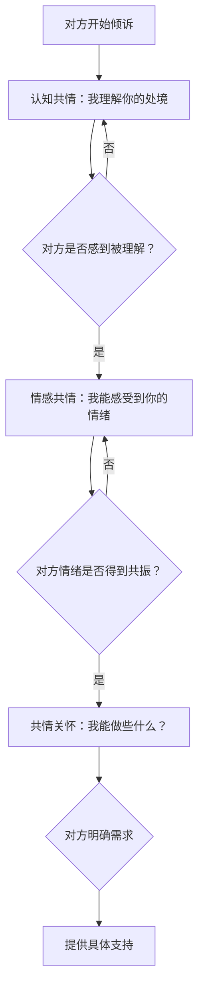

## 三、高级共情技巧

共情（Empathy）是沟通心理学中最核心的能力之一，也是区分"会说话"与"真正懂沟通"的分水岭。初级共情是"我听到了你说的话"，高级共情则是"我不仅听到了你的话，还感受到了你话里的情绪、未说出的需求，以及你此刻的处境"。本节将从神经科学机制出发，系统讲解共情的层次递进模型、进阶倾听技巧、边界管理策略，以及在不同场景中的高级应用。

### 3.1 共情的神经科学基础

理解共情的"为什么"，才能更好地掌握"怎么做"。

#### 3.1.1 镜像神经元系统

1996年，意大利帕尔马大学的Giacomo Rizzolatti团队在猕猴实验中发现了镜像神经元（Mirror Neurons）。当猴子自己抓取食物时，以及观察其他猴子抓取食物时，同一组神经元都会放电。后续fMRI研究证实，人类大脑中存在类似的镜像系统，主要分布在：

- **前运动皮层（Premotor Cortex）**：模拟他人的动作意图
- **顶下小叶（Inferior Parietal Lobule）**：理解动作的目的和意义
- **前脑岛（Anterior Insula）**：体验和感知情绪状态
- **前扣带回皮层（Anterior Cingulate Cortex）**：处理情感冲突和痛苦

这意味着，当我们看到别人皱眉时，我们的大脑会自动"模拟"皱眉的肌肉运动，进而产生类似的情绪体验——这就是共情的生物学基础。

#### 3.1.2 共情的双通路模型

神经科学家Jean Decety和Philippa Jackson提出，共情涉及两条独立但协同的神经通路：

| 通路 | 功能 | 主要脑区 | 特点 |
|------|------|----------|------|
| **自下而上通路** | 自动化的情绪感染 | 杏仁核、脑岛 | 快速、无意识、容易过载 |
| **自上而下通路** | 认知调节和观点采择 | 前额叶皮层、颞顶联合区 | 慢速、有意识、可以训练 |

高级共情的核心能力，就是在这两条通路之间灵活切换：既能感受对方的情绪（自下而上），又能保持认知清晰不被情绪淹没（自上而下）。

#### 3.1.3 共情疲劳的神经机制

长期高强度共情会导致"共情疲劳"（Compassion Fatigue），其神经机制是：

1. **杏仁核过度激活**：持续接收他人负面情绪信号，进入"情绪过载"状态
2. **前额叶功能下降**：认知调节资源耗尽，无法维持"我 vs 你"的边界
3. **皮质醇水平升高**：慢性压力反应，导致身心疲惫
4. **奖赏回路钝化**：助人行为不再带来满足感，产生情感麻木

理解这一机制，是做好共情边界管理的理论前提。

### 3.2 共情层次递进法

高级共情不是单一能力，而是三个层次的递进系统。每一层都有其特定的技巧、语言模式和应用场景。

#### 3.2.1 第一层：认知共情——理解对方的处境

认知共情（Cognitive Empathy）是共情的基础层，核心是"观点采择"（Perspective Taking），即站在对方的角度理解他们的想法、信念和处境。

**核心技巧：观点采择四步法**

1. **暂停自我中心**：在回应之前，有意识地放下自己的观点和判断
2. **信息收集**：通过开放式提问了解对方的完整处境
3. **框架重建**：用对方的信息源、价值观和经历来重构他们眼中的世界
4. **确认检验**：用"我理解的是……对吗？"来验证自己的理解是否准确

**语言模式：**

"我想确认一下我理解对了——你面临的情况是……"
"从你的角度来看，这件事的关键在于……"
"如果我处在你的位置，考虑到你经历的那些，我可能也会这样想。"

**关键原则：** 认知共情不等于认同。你可以说"我理解你为什么这样想"，而不必说"你说得对"。理解是沟通的桥梁，认同是立场的选择。

**常见误区：**
- ❌ "我理解"但实际在等对方说完就开始给建议
- ❌ 用自己的经历去"对标"对方的处境（"我也遇到过……"）
- ❌ 急于下结论，没有收集足够的信息

#### 3.2.2 第二层：情感共情——感受对方的情绪

情感共情（Affective/Emotional Empathy）是在理解的基础上，真正"感受到"对方的情绪状态。这需要允许自己的情绪系统与对方产生共振，同时保持足够的自我觉察。

**核心技巧：情感映照（Emotional Mirroring）**

情感映照不是简单地"重复"对方的情绪，而是通过自己的情绪系统去"校准"对方的感受强度和质地。

**实操步骤：**

1. **身体扫描**：注意到自己身体中因为对方的叙述而产生的变化——胸口发紧？胃部不适？肩膀紧绷？这些身体信号是你情感共情的"天线"
2. **情绪命名**：给对方的情绪一个准确的标签（参见3.3节情感标签法）
3. **语气同步**：你的语速、音调和节奏应该匹配对方的情绪状态——对悲伤的人放慢语速、降低音量，对焦虑的人保持平稳的节奏
4. **表达共振**：用"我能感受到……"来传达你的情绪连接

**语言模式：**

"我能感受到你现在心里很不是滋味。"
"听你说到这里，我都能感觉到那种压力。"
"你说到这件事的时候，我能感受到它对你有多重要。"

**进阶要领：** 高级的情感共情不是"表演"对方的情绪，而是允许自己的情绪系统被对方的经历"触动"，然后诚实地传达这种触动。这种真诚的共振是任何技巧都无法替代的。

#### 3.2.3 第三层：共情关怀——从感受走向行动

共情关怀（Empathic Concern）是共情的最高层次，它在理解和感受的基础上，生发出真正的关心和帮助意愿。这不是"同情"（可怜对方），而是平等的关怀（我关心你的福祉）。

**核心技巧：关怀表达三要素**

| 要素 | 说明 | 示例 |
|------|------|------|
| **确认需求** | 询问对方需要什么，而非假设 | "你希望我怎么做？" |
| **提供选项** | 给出具体、可选择的支持方式 | "我可以帮你……或者……你觉得哪个更合适？" |
| **尊重自主** | 把选择权交给对方 | "不管你怎么决定，我都在。" |

**语言模式：**

"你现在最需要的是什么？是有人听你说，还是需要帮忙想办法？"
"我能做的是……你看这样对你有没有帮助？"
"不管怎样，这件事你不是一个人在面对。"

**注意：** 很多人在共情关怀这一层会犯一个错误——急于"解决问题"。当一个人还在情绪中时，过早的建议会被感知为"你没有真正理解我的感受"。正确的顺序是：先完成第一层和第二层，确认对方感到被理解之后，再进入第三层。

#### 3.2.4 三层递进的实际运用流程

### 3.3 共情倾听的进阶技巧

共情倾听（Empathic Listening）不是被动地"听"，而是主动地用一系列技巧帮助对方感到被深度理解。

#### 3.3.1 情感标签法（Affect Labeling）

情感标签法是将对方的模糊情绪用准确的语言"命名"出来。UCLA的Matthew Lieberman团队通过fMRI研究发现，当情绪被准确命名时，杏仁核的活动会显著降低——仅仅是"说出"情绪的名字，就有助于情绪调节。

**操作原则：**

1. **用试探性语气**：用"似乎""好像""听起来"等词，而非断言式语气
2. **精度递进**：先用大类情绪词（难过、生气），再逐步精化到具体情绪（失望、委屈、无力感）
3. **允许纠正**：如果对方说"不是那样的"，不要争辩，调整你的判断

**实操示例：**

初级标签："你看起来不太开心。"
中级标签："听起来你对这个结果很失望。"
高级标签："我能感觉到这件事让你既失望又有些无力——你做了那么多努力，
         结果却是这样，那种不被看到的委屈才是最让你难受的。"

**常见情绪词对照表：**

| 表面情绪 | 深层情绪 | 可能的核心需求 |
|----------|----------|----------------|
| 愤怒 | 受伤、不被尊重、无力感 | 被认可、被重视 |
| 冷漠 | 失望、自我保护、疲惫 | 安全感、被理解 |
| 焦虑 | 不确定、失控感、恐惧 | 掌控感、确定性 |
| 悲伤 | 失去、分离、遗憾 | 连接、意义感 |
| 烦躁 | 被打扰、界限被侵犯 | 空间、自主权 |
| 讽刺/攻击 | 被忽视的痛苦、不信任 | 被认真对待 |

#### 3.3.2 情感正常化（Normalization）

情感正常化是告诉对方："你有这样的感受是正常的、可以被理解的。"这能有效减轻对方因为"不应该有这种感受"而产生的二次痛苦（meta-emotion，对情绪的情绪）。

**语言模式：**

"任何人在经历这些之后都会有这样的反应，这是非常正常的。"
"你有这样的感受，恰恰说明你是一个在乎的人。"
"如果我是你，经历这些之后，我可能也会有同样的感受。"
"你不需要为自己的情绪道歉——它只是在告诉你一些重要的事情。"

**使用注意：**
- 正常化≠淡化。"大家都这样"是淡化，"你有这样的感受完全合理"是正常化
- 不要对极端行为进行正常化——正常化的是感受，不是行为
- 避免"你应该坚强"这类隐含否定情绪的话语

#### 3.3.3 深度反映（Deep Reflection）

深度反映是超越表面情绪，触及对方背后的价值观、信念和核心需求。这是最高级的倾听技巧，需要对人性有深刻的理解。

**三个维度：**

1. **价值观反映**：识别对方在乎什么
   > "听起来对你来说，**被信任**是这段关系中最重要的东西。"

2. **需求反映**：识别对方真正需要什么
   > "我感觉到你需要的不是道歉，而是一种'被放在心上'的感觉。"

3. **身份反映**：识别对方如何看待自己
   > "这件事让你怀疑自己是不是一个好领导——但在我听来，你恰恰是因为太在乎团队，才会这么纠结。"

**实操技巧：** 深度反映的关键是"说中"对方自己都没有完全意识到的东西。当你准确反映了一个深层需求或价值观时，对方通常的反应是沉默几秒，然后说"对……就是这样"——这个停顿表明你触及了真正重要的东西。

#### 3.3.4 沉默的共情力量

高级共情者懂得使用沉默。在对方情绪涌上来的时刻，不急于用语言去"填补"空白，而是：

- 用眼神传达"我在这里，我看到了你"
- 用一个点头表示"你继续说，我在听"
- 用几秒钟的沉默给对方处理情绪的空间

很多人害怕沉默是因为觉得"不说话显得不关心"，但在真正的共情场景中，恰到好处的沉默比任何语言都更有力。

#### 3.3.5 非语言共情信号

共情不仅通过语言传递，非语言信号往往比语言本身更具说服力：

| 信号类型 | 具体表现 | 传递的信息 |
|----------|----------|------------|
| **眼神** | 温柔注视、适时点头 | "我全神贯注在你身上" |
| **面部表情** | 自然地跟随对方情绪变化 | "我和你同频" |
| **身体姿态** | 身体微微前倾、开放姿态 | "我对你敞开着" |
| **声音** | 语速配合、音量适中、语调柔和 | "我尊重你的节奏" |
| **触碰** | 适当的手臂触碰（需判断关系） | "你不是孤独的" |

### 3.4 高级共情的场景化应用

#### 3.4.1 职场中的高级共情

**场景一：下属绩效不佳的面谈**

错误做法："你的KPI没达标，需要改进。"（纯认知层面，没有共情）

高级共情流程：
1. **认知共情**："我注意到这个季度的指标和你之前的水平有差距，我想先了解一下，你这边是不是遇到了什么情况？"
2. **情感共情**：（对方说出原因后）"听起来这段时间确实不容易，既要处理家庭的事，又要兼顾工作，压力一定很大。"
3. **共情关怀**："我们一起来看看，有没有什么方式能让你在接下来的时间里既能照顾好家里，工作上也能回到正轨。你觉得什么样的支持对你最有帮助？"

**场景二：团队冲突调解**

高级共情的关键是"分别共情"——先分别与冲突双方进行深度共情，理解各自的立场和情绪，再寻找交集。不要急于当裁判，先当理解者。

#### 3.4.2 亲密关系中的高级共情

**核心区别：** 在亲密关系中，对方期待的往往不是"解决方案"，而是"你懂我"。

**经典场景：伴侣抱怨工作**

伴侣："今天又被老板当众批评了，我真的受够了。"

❌ 初级回应："那你下次注意点就好了。"（给建议）
❌ 表面共情："嗯，确实挺烦的。"（敷衍）
✅ 高级共情：
  "当着那么多人的面被批评，那种感觉一定很不好受。
   尤其是你一直在认真做，这种不被认可的感觉比批评本身更让人难受。"

这个回应做了三件事：①准确描述了场景（当众），②命名了情绪（不好受），③触及了深层需求（被认可）。

#### 3.4.3 亲子沟通中的高级共情

**关键原则：** 儿童的情绪表达往往不成熟（哭闹、发脾气），高级共情要求家长透过行为看到背后的情绪和需求。

**场景：孩子因为考试成绩不好大哭**

❌ "别哭了，下次努力就行了。"（否定情绪）
❌ "你看人家谁谁谁怎么不哭？"（比较+否定）

✅ 第一步（认知共情）："这次考试的成绩和你预期的不一样，是吗？"
✅ 第二步（情感共情）："你心里一定很难过，还有些不甘心。"
✅ 第三步（情感正常化）："努力了却没得到想要的结果，换谁都会难过的。"
✅ 第四步（共情关怀）："你想和妈妈/爸爸聊聊哪里没弄懂吗？我们一起想办法。"

#### 3.4.4 跨文化共情

不同文化背景下，共情的表达方式和接受度存在显著差异：

| 维度 | 高语境文化（如中国、日本） | 低语境文化（如美国、德国） |
|------|--------------------------|--------------------------|
| 情绪表达 | 含蓄、间接、读"空气" | 直接、明确、说出来 |
| 共情方式 | 行动关怀（做饭、陪伴） | 语言表达（"I understand"） |
| 边界感 | 较近，主动询问被视为关心 | 较远，过度关心被视为侵入 |
| 沉默含义 | 可能是尊重、思考、不赞同 | 可能是尴尬、不理解 |

### 3.5 共情的边界管理

高级共情最大的风险不是"做不到"，而是"做得太过"——过度共情会导致情绪耗竭、失去客观性，最终反而无法有效帮助对方。

#### 3.5.1 过度共情的五个信号

1. **情绪传染**：对方的负面情绪长时间留在你身上，无法"卸载"
2. **失眠或身体不适**：因为过度共情他人的遭遇而影响自己的生理状态
3. **决策模糊**：因为太理解对方而无法做出客观判断
4. **自我消耗**：感觉自己被"掏空"，对所有人的情绪都感到疲惫
5. **角色混淆**：分不清"这是对方的人生课题还是我的"

#### 3.5.2 边界管理的五层策略

**第一层：自我觉察**

定期进行"情绪体检"——在高强度共情对话后，花1分钟问自己：
- 我现在的身体感受是什么？（紧张？沉重？轻松？）
- 我现在的情绪是什么？（这是我自己的情绪，还是对方的？）
- 我还有足够的能量继续吗？

**第二层：认知分离**

使用"观察者视角"——想象自己是一个善良但不卷入的观察者。你看到了对方的痛苦，理解这份痛苦，但你知道"这是他的人生经历，不是我的"。

有效内心语言：
- "我看到你正在经历困难，我关心你，但这件事属于你的人生旅程。"
- "我可以陪伴，但我不需要替你承担。"

**第三层：物理边界**

- 在高强度共情对话后，给自己设定5-10分钟的恢复时间
- 用物理动作帮助"切换"：起身倒杯水、走到窗边看看远处
- 如果是线上沟通，允许自己"晚一点回复"来保护情绪空间

**第四层：关系边界**

明确不同关系中的共情深度：

| 关系类型 | 适合的共情深度 | 注意事项 |
|----------|--------------|----------|
| 亲密家人/伴侣 | 深度共情+长期支持 | 避免角色混淆（你不是治疗师） |
| 亲密朋友 | 中度共情+选择性支持 | 尊重对方的自主解决问题能力 |
| 普通朋友/同事 | 表达理解+有限支持 | 不必承接所有情绪 |
| 陌生人/弱关系 | 基本礼貌+适度关怀 | 保护自己的情绪空间 |

**第五层：专业支持**

如果你发现自己长期处于高强度共情的环境中（如心理咨询师、社会工作者、客服人员），以下自我保护措施必不可少：

- **定期督导**：有专业督导帮助你处理共情带来的情绪负担
- **同伴支持**：与有类似经历的同伴分享和交流
- **身体关怀**：规律运动、充足睡眠、健康饮食——这些是情绪韧性的物质基础
- **认知重构**：学会区分"关心"和"承担"——关心是主动选择，承担是被动消耗

### 3.6 共情能力的系统训练

高级共情不是天赋，而是可以系统训练的技能。以下是经过验证的训练方法：

#### 3.6.1 每日共情练习（10分钟）

| 时间 | 练习 | 目的 |
|------|------|------|
| 2分钟 | 回忆今天一个让你产生情绪的场景 | 情绪觉察 |
| 3分钟 | 想象这个场景中对方的视角和感受 | 观点采择 |
| 3分钟 | 给这份情绪一个准确的名字 | 情感标签 |
| 2分钟 | 感受自己的身体反应，觉察共情对自身的影响 | 边界觉察 |

#### 3.6.2 "情绪日记"训练法

每天记录一次共情互动：

日期：____
场景：____
对方的情绪（表面）：____
对方的情绪（深层）：____
我感受到的：____
我的回应方式：____
对方的反应：____
如果重来，我会：____

坚持4-6周，你会明显感受到共情准确度和速度的提升。

#### 3.6.3 文学/影视共情训练

阅读小说和观看电影是低成本、高效率的共情训练方式。具体做法：

1. **暂停法**：在角色面临情感冲突的场景暂停，问自己"这个角色现在感受到什么？为什么？"
2. **视角切换**：试着从反派或配角的视角重新理解整个故事
3. **情感考古**：分析角色的行为背后，有哪些未被满足的需求和未被表达的情绪

研究表明，经常阅读文学小说的人在"眼神读取测试"（Reading the Mind in the Eyes Test）中得分显著更高，说明文学阅读确实能提升情感共情能力（Kidd & Castano, 2013, *Science*）。

### 3.7 共情的常见误区与纠正

| 误区 | 为什么是错的 | 正确做法 |
|------|-------------|----------|
| "我完全理解你的感受" | 没有人能完全理解另一个人的感受，这样说反而让对方觉得被轻视 | "我在努力理解你的感受，如果我说得不对请纠正我" |
| "我以前也……" | 把焦点从对方转移到自己身上 | 先充分共情对方，只在适当时机简短分享相似经历作为连接 |
| "你应该感恩/坚强/放下" | 用道德判断否定对方的情绪 | 先接纳情绪，等对方准备好了再探讨可能性 |
| "别难过了" | 暗示对方的情绪是不对的或不必要的 | "你有权利难过，我陪着你" |
| 立刻给建议 | 对方可能只需要被听到 | 先确认："你现在需要的是倾听，还是一起想办法？" |
| "一切都会好的" | 空洞的安慰，无法验证 | "不管接下来怎样，我会在你身边" |
| 过度使用专业术语 | "你的创伤触发了你的依恋焦虑"会让对方感到被分析 | 用日常语言表达理解 |

### 3.8 本节小结

高级共情是一项需要持续修炼的沟通能力，其核心框架可以概括为：

**三层递进**：认知共情（理解）→ 情感共情（感受）→ 共情关怀（行动）

**四大进阶技巧**：情感标签、情感正常化、深度反映、沉默的力量

**边界管理**：自我觉察 → 认知分离 → 物理边界 → 关系边界 → 专业支持

**核心原则**：共情的最终目标不是让对方"好起来"，而是让对方在困难时刻感到"被看到、被理解、不孤独"。这种被理解的体验本身，就是最强大的治愈力量。

> "被倾听，就是被看见。被看见，就是存在的证明。"——心理学家Carl Rogers

